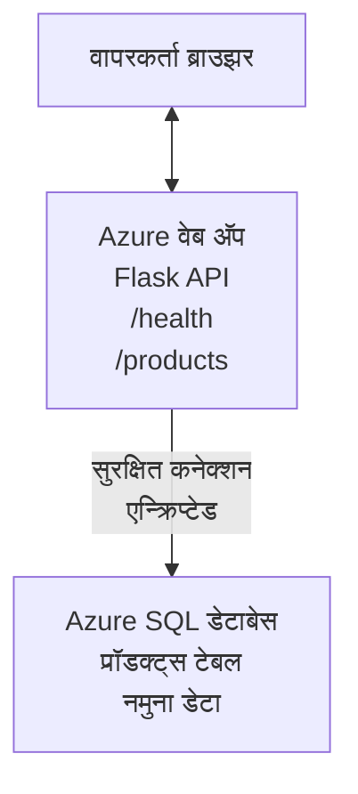

# AZD सह Microsoft SQL डेटाबेस आणि वेब अॅप तैनात करणे

⏱️ **अनुमानित वेळ**: 20-30 मिनिटे | 💰 **अनुमानित खर्च**: ~$15-25/महिना | ⭐ **गुणवत्तात्मक पातळी**: मध्यम

हा **पूर्ण, कार्यरत उदाहरण** कसे वापरायचे हे दर्शवतो [Azure Developer CLI (azd)](https://learn.microsoft.com/azure/developer/azure-developer-cli/) वापरून Microsoft SQL डेटाबेससह Python Flask वेब अनुप्रयोग Azure वर तैनात करणे. सर्व कोड समाविष्ट व चाचणी केलेले आहे — कोणत्याही बाह्य अवलंबित्वांची गरज नाही.

## काय शिकाल

हा उदाहरण पूर्ण करून, तुम्ही:
- इन्फ्रास्ट्रक्चर-एज-कोड वापरून मल्टी-टियर अनुप्रयोग (वेब अॅप + डेटाबेस) तैनात कराल
- हार्डकोड केलेले गुपितांश न वापरता सुरक्षित डेटाबेस कनेक्शन कॉन्फिगर कराल
- Application Insights सह अनुप्रयोगाची आरोग्य निरीक्षण कराल
- AZD CLI वापरून Azure संसाधनांचे कार्यक्षम व्यवस्थापन कराल
- सुरक्षा, खर्च ऑप्टिमायझेशन आणि निरीक्षणासाठी Azure सर्वोत्तम पद्धतींचे पालन कराल

## परिस्थितीचे सार

- **वेब अॅप**: डेटाबेस कनेक्टिव्हिटी सह Python Flask REST API
- **डेटाबेस**: नमुना डेटासह Azure SQL डेटाबेस
- **इन्फ्रास्ट्रक्चर**: Bicep वापरून प्रोव्हिजन केले (मॉड्यूलर, पुनर्वापरयोग्य टेम्पलेट्स)
- **तैनात करणे**: पूर्णपणे `azd` आदेशांनी स्वयंचलित
- **निरिक्षण**: लॉग आणि टेलीमेट्रीसाठी Application Insights

## आवश्यकताः

### आवश्यक उपकरणे

सुरू करण्याआधी, खात्री करा की खालील उपकरणे स्थापित आहेत:

1. **[Azure CLI](https://learn.microsoft.com/cli/azure/install-azure-cli)** (आवृत्ती 2.50.0 किंवा त्याहून उच्च)
   ```sh
   az --version
   # अपेक्षित उत्पादन: azure-cli 2.50.0 किंवा त्याहून वरची आवृत्ती
   ```

2. **[Azure Developer CLI (azd)](https://learn.microsoft.com/azure/developer/azure-developer-cli/install-azd)** (आवृत्ती 1.0.0 किंवा त्याहून उच्च)
   ```sh
   azd version
   # अपेक्षित आउटपुट: azd व्हर्शन 1.0.0 किंवा त्याहून अधिक
   ```

3. **[Python 3.8+](https://www.python.org/downloads/)** (स्थानिक विकासासाठी)
   ```sh
   python --version
   # अपेक्षित उत्पादन: पायथन 3.8 किंवा त्यापेक्षा उच्च आवृत्ती
   ```

4. **[Docker](https://www.docker.com/get-started)** (पर्यायी, स्थानिक कंटेनरायझेशनसाठी विकास)
   ```sh
   docker --version
   # अपेक्षित उत्पादन: डॉकर आवृत्ती 20.10 किंवा त्याहून अधिक
   ```

### Azure आवश्यकताः

- सक्रिय **Azure सदस्यता** ([मोफत खाते तयार करा](https://azure.microsoft.com/free/))
- सदस्यतेतील संसाधने तयार करण्याची परवानगी
- सदस्यता किंवा संसाधन गटावर **मालक** किंवा **योगदानकर्ता** भूमिका

### ज्ञान आवश्यकताः

हे **मध्यम-स्तरीय** उदाहरण आहे. तुम्हाला परिचित असणे आवश्यक:
- मूलभूत कमांड-लाइन ऑपरेशन्स
- मूलभूत क्लाउड संकल्पना (संसाधने, संसाधन गट)
- वेब अनुप्रयोग आणि डेटाबेसची मूलभूत समज

**AZD मध्ये नववी?** प्रथम [Getting Started guide](../../docs/chapter-01-foundation/azd-basics.md) पहा.

## आर्किटेक्चर

हे उदाहरण दोन-स्तरीय आर्किटेक्चर तैनात करते ज्यात वेब अनुप्रयोग आणि SQL डेटाबेस आहे:



**संसाधन तैनातीः**
- **संसाधन गट**: सर्व संसाधनांसाठी कंटेनर
- **अॅप सेवा योजना**: Linux आधारित होस्टिंग (खर्च बचतीसाठी B1 टियर)
- **वेब अॅप**: Python 3.11 रनटाइमसोबत Flask अनुप्रयोग
- **SQL सर्व्हर**: TLS 1.2 किमान असलेला व्यवस्थापित डेटाबेस सर्व्हर
- **SQL डेटाबेस**: बेसिक टियर (2GB, विकास/चाचणीसाठी योग्य)
- **Application Insights**: निरीक्षण व लॉगिंग
- **लॉग अ‍ॅनालिटिक्स वर्कस्पेस**: केंद्रीकृत लॉग संग्रह

**उपमा**: हे रेस्टॉरंट (वेब अॅप) आणि वॉक-इन फ्रिझर (डेटाबेस) सारखे आहे. ग्राहक मेन्यू (API एंडपॉइंट) वरून ऑर्डर करतात, आणि स्वयंपाकघर (Flask अॅप) फ्रिझरमधून सामग्री (डेटा) घेतो. रेस्टॉरंट व्यवस्थापक (Application Insights) सर्व क्रियांची नोंद घेतो.

## फोल्डर संरचना

हे उदाहरणातील सर्व फायली समाविष्ट आहेत — कोणत्याही बाह्य अवलंबित्वाशिवाय:

```
examples/database-app/
│
├── README.md                    # This file
├── azure.yaml                   # AZD configuration file
├── .env.sample                  # Sample environment variables
├── .gitignore                   # Git ignore patterns
│
├── infra/                       # Infrastructure as Code (Bicep)
│   ├── main.bicep              # Main orchestration template
│   ├── abbreviations.json      # Azure naming conventions
│   └── resources/              # Modular resource templates
│       ├── sql-server.bicep    # SQL Server configuration
│       ├── sql-database.bicep  # Database configuration
│       ├── app-service-plan.bicep  # Hosting plan
│       ├── app-insights.bicep  # Monitoring setup
│       └── web-app.bicep       # Web application
│
└── src/
    └── web/                    # Application source code
        ├── app.py              # Flask REST API
        ├── requirements.txt    # Python dependencies
        └── Dockerfile          # Container definition
```

**प्रत्येक फाइलचे कार्य:**
- **azure.yaml**: AZD ला काय आणि कुठे तैनात करायचे ते सांगते
- **infra/main.bicep**: सर्व Azure संसाधनांचे आयोजन करते
- **infra/resources/*.bicep**: वैयक्तिक संसाधन परिभाषा (पुनर्वापरासाठी मॉड्यूलर)
- **src/web/app.py**: डेटाबेस लॉजिकसह Flask अॅप
- **requirements.txt**: Python पॅकेज अवलंबित्व
- **Dockerfile**: तैनातीसाठी कंटेनरायझेशन सूचनांसाठी

## जलद प्रारंभ (पायरी-दर-पायरी)

### पायरी 1: क्लोन करा आणि नेव्हिगेट करा

```sh
git clone https://github.com/microsoft/AZD-for-beginners.git
cd AZD-for-beginners/examples/database-app
```

**✓ यशस्वी तपासणी**: तुम्हाला `azure.yaml` आणि `infra/` फोल्डर दिसले पाहिजेत:
```sh
ls
# अपेक्षित: README.md, azure.yaml, infra/, src/
```

### पायरी 2: Azure मध्ये प्रमाणीकरण करा

```sh
azd auth login
```

हे तुमचा ब्राउझर Azure प्रमाणीकरणासाठी उघडते. तुमचे Azure क्रेडेन्शियल्स वापरून साइन इन करा.

**✓ यशस्वी तपासणी**: तुम्हाला खालील पाहावे लागेल:
```
Logged in to Azure.
```

### पायरी 3: पर्यावरण प्रारंभ करा

```sh
azd init
```

**घटणारे काय**: AZD तुमच्या तैनात करण्यासाठी स्थानिक कॉन्फिगरेशन तयार करते.

**प्रॉम्प्ट्स जे तुम्हाला दिसतील**:
- **पर्यावरणाचे नाव**: एक लहान नाव द्या (उदा. `dev`, `myapp`)
- **Azure सदस्यता**: सूचीतील सदस्यता निवडा
- **Azure लोकशन**: प्रदेश निवडा (उदा. `eastus`, `westeurope`)

**✓ यशस्वी तपासणी**: तुम्हाला हे दिसले पाहिजे:
```
SUCCESS: New project initialized!
```

### पायरी 4: Azure संसाधने प्रोव्हिजन करा

```sh
azd provision
```

**घटणारे काय**: AZD सर्व इन्फ्रास्ट्रक्चर तैनात करते (5-8 मिनिटे लागतात):
1. संसाधन गट तयार करते
2. SQL सर्व्हर आणि डेटाबेस तयार करते
3. अॅप सेवा योजना तयार करते
4. वेब अॅप तयार करते
5. Application Insights तयार करते
6. नेटवर्किंग आणि सुरक्षा कॉन्फिगर करते

**तुम्हाला विचारले जाईल:**
- **SQL प्रशासक वापरकर्तानाव**: वापरकर्तानाव द्या (उदा. `sqladmin`)
- **SQL प्रशासक संकेतशब्द**: मजबूत संकेतशब्द द्या (ही नोंद करा!)

**✓ यशस्वी तपासणी**: तुम्हाला हे दिसले पाहिजे:
```
SUCCESS: Your application was provisioned in Azure in X minutes Y seconds.
You can view the resources created under the resource group rg-<env-name> in Azure Portal:
https://portal.azure.com/#@/resource/subscriptions/.../resourceGroups/rg-<env-name>
```

**⏱️ वेळ**: 5-8 मिनिटे

### पायरी 5: अनुप्रयोग तैनात करा

```sh
azd deploy
```

**घटणारे काय**: AZD तुमचा Flask अनुप्रयोग तयार करतो आणि तैनात करतो:
1. Python अनुप्रयोग पॅकेजेस करतो
2. Docker कंटेनर तयार करतो
3. Azure वेब अॅप वर पुश करतो
4. नमुना डेटाने डेटाबेस प्रारंभ करतो
5. अनुप्रयोग सुरू करतो

**✓ यशस्वी तपासणी**: तुम्हाला हे दिसले पाहिजे:
```
SUCCESS: Your application was deployed to Azure in X minutes Y seconds.
You can view the resources created under the resource group rg-<env-name> in Azure Portal:
https://portal.azure.com/#@/resource/subscriptions/.../resourceGroups/rg-<env-name>
```

**⏱️ वेळ**: 3-5 मिनिटे

### पायरी 6: अनुप्रयोग ब्राउझ करा

```sh
azd browse
```

हे तुमचा तैनात केलेला वेब अॅप `https://app-<unique-id>.azurewebsites.net` वर ब्राउझरमध्ये उघडते

**✓ यशस्वी तपासणी**: तुम्हाला JSON आउटपुट दिसेल:
```json
{
  "message": "Welcome to the Database App API",
  "endpoints": {
    "/": "This help message",
    "/health": "Health check endpoint",
    "/products": "List all products",
    "/products/<id>": "Get product by ID"
  }
}
```

### पायरी 7: API एंडपॉइंटची चाचणी करा

**आरोग्य तपासणी** (डेटाबेस कनेक्शन तपासा):
```sh
curl https://app-<your-id>.azurewebsites.net/health
```

**अपेक्षित प्रतिसाद**:
```json
{
  "status": "healthy",
  "database": "connected"
}
```

**उत्पादने सूचीबद्ध करा** (नमुना डेटा):
```sh
curl https://app-<your-id>.azurewebsites.net/products
```

**अपेक्षित प्रतिसाद**:
```json
[
  {
    "id": 1,
    "name": "Laptop",
    "description": "High-performance laptop",
    "price": 1299.99,
    "created_at": "2025-11-19T10:30:00"
  },
  ...
]
```

**एकल उत्पादन मिळवा**:
```sh
curl https://app-<your-id>.azurewebsites.net/products/1
```

**✓ यशस्वी तपासणी**: सर्व एंडपॉइंट्स त्रुटीशिवाय JSON डेटा परत करतात.

---

**🎉 अभिनंदन!** तुम्ही यशस्वीपणे AZD वापरून Azure वर डेटाबेससह वेब अनुप्रयोग तैनात केला आहे.

## कॉन्फिगरेशन डिप-डाइव

### पर्यावरण चल

गुपितांश सुरक्षितपणे Azure App Service कॉन्फिगरेशनद्वारे व्यवस्थापित केले जातात — **स्रोत कोडमध्ये कधीही हार्डकोड करू नका**.

**AZD द्वारे स्वयंचलित कॉन्फिगर केलेले:**
- `SQL_CONNECTION_STRING`: एन्क्रिप्टेड क्रेडेन्शियलसह डेटाबेस कनेक्शन
- `APPLICATIONINSIGHTS_CONNECTION_STRING`: निरीक्षण टेलीमेट्री एंडपॉइंट
- `SCM_DO_BUILD_DURING_DEPLOYMENT`: स्वयंचलित अवलंबित्व इंस्टॉलेशन सक्षम करतो

**गुपित कसे संग्रहित केले जातात:**
1. `azd provision` दरम्यान तुम्ही सुरक्षित प्रॉम्प्ट्सद्वारे SQL क्रेडेन्शियल प्रदान करता
2. AZD त्यांना स्थानिक `.azure/<env-name>/.env` फाइलमध्ये साठवतो (git-ignored)
3. AZD त्यांना Azure App Service कॉन्फिगरेशनमध्ये इंजेक्ट करतो (एन्क्रिप्टेड)
4. अनुप्रयोग रनटाइम दरम्यान `os.getenv()` वापरून वाचतो

### स्थानिक विकास

स्थानिक चाचणीसाठी, नमुना `.env` फाइल तयार करा:

```sh
cp .env.sample .env
# आपल्या लोकल डेटाबेस कनेक्शनसह .env संपादित करा
```

**स्थानिक विकासाची कार्यप्रणाली**:
```sh
# अवलंबन स्थापन करा
cd src/web
pip install -r requirements.txt

# पर्यावरणीय चरों सेट करा
export SQL_CONNECTION_STRING="your-local-connection-string"

# अनुप्रयोग चालवा
python app.py
```

**स्थानिक चाचणी करा**:
```sh
curl http://localhost:8000/health
# अपेक्षित: {"status": "healthy", "database": "connected"}
```

### इन्फ्रास्ट्रक्चर एज कोड

सर्व Azure संसाधने **Bicep टेम्पलेट्स** (`infra/` फोल्डर) मध्ये परिभाषित आहेत:

- **मॉड्यूलर डिझाइन**: प्रत्येक संसाधन प्रकारासाठी स्वतंत्र फाइल पुनर्वापरसाठी
- **पॅरामिटर्ज्ड**: SKU, प्रदेश, नावकरण सानुकूलित करा
- **सर्वोत्तम पद्धती**: Azure नावकरण मानक आणि सुरक्षा डीफॉल्टचे पालन
- **आवृत्ती नियंत्रित**: इन्फ्रास्ट्रक्चर बदल Git मध्ये ट्रॅक केले जातात

**सानुकूल उदाहरण**:
डेटाबेस टियर बदलण्यासाठी `infra/resources/sql-database.bicep` संपादित करा:
```bicep
sku: {
  name: 'Standard'  // Changed from 'Basic'
  tier: 'Standard'
  capacity: 10
}
```

## सुरक्षा सर्वोत्तम पद्धती

हे उदाहरण Azure सुरक्षा सर्वोत्तम पद्धतींचे पालन करते:

### 1. **कोणतेही गुपित स्त्रोत कोडमध्ये नाही**
- ✅ क्रेडेन्शियल Azure App Service कॉन्फिगरेशनमध्ये संचयित (एन्क्रिप्टेड)
- ✅ `.env` फाइल Git द्वारे वगळलेली (`.gitignore`)
- ✅ प्रोव्हिजनिंग दरम्यान सुरक्षित प्रॉम्प्ट्सने गुपित दिले जातात

### 2. **एन्क्रिप्टेड कनेक्शन**
- ✅ SQL सर्व्हरसाठी किमान TLS 1.2
- ✅ वेब अॅपसाठी केवळ HTTPS लागू
- ✅ डेटाबेस कनेक्शन एन्क्रिप्टेड चॅनेल वापरतात

### 3. **नेटवर्क सुरक्षा**
- ✅ SQL सर्व्हर फायरवॉल फक्त Azure सेवा परवानत
- ✅ सार्वजनिक नेटवर्क प्रवेश प्रतिबंधित (खाजगी एंडपॉइंटसह अधिक लॉक करता येते)
- ✅ वेब अॅपवर FTPS निष्क्रिय

### 4. **प्रमाणीकरण आणि प्राधिकरण**
- ⚠️ **सध्याचा**: SQL प्रमाणीकरण (वापरकर्तानाव/संकेतशब्द)
- ✅ **उत्पादनासाठी शिफारस**: संकेतशब्दमुक्त प्रमाणीकरणासाठी Azure Managed Identity वापरा

**Managed Identity साठी अपग्रेड करण्यासाठी** (उत्पादनासाठी):
1. वेब अॅपवर Managed Identity सक्षम करा
2. SQL परवानग्या या ओळखीला द्या
3. कनेक्शन स्ट्रिंग अद्ययावत करा Managed Identity वापरण्यासाठी
4. संकेतशब्द-आधारित प्रमाणीकरण काढून टाका

### 5. **ऑडिटिंग आणि अनुपालन**
- ✅ Application Insights सर्व विनंत्या आणि त्रुटी लॉग करतो
- ✅ SQL डेटाबेस ऑडिटिंग सक्षम आहे (अनुपालनासाठी कॉन्फिगर करता येते)
- ✅ सर्व संसाधने शासकीय टॅगसह टॅग केलेली आहेत

**उत्पादनापूर्वी सुरक्षा तपासणीसूची:**
- [ ] SQL साठी Azure Defender सक्षम करा
- [ ] SQL डेटाबेससाठी खाजगी एंडपॉइंट कॉन्फिगर करा
- [ ] वेब अनुप्रयोग फायरवॉल (WAF) सक्षम करा
- [ ] गुपित फिरवणुकीसाठी Azure Key Vault वापरा
- [ ] Microsoft Entra ID प्रमाणीकरण कॉन्फिगर करा
- [ ] सर्व संसाधनांसाठी डायग्नोस्टिक लॉगिंग सक्षम करा

## खर्च ऑप्टिमायझेशन

**अनुमानित मासिक खर्च** (नोव्हेंबर 2025 अनुसार):

| संसाधन | SKU/टियर | अंदाजे खर्च |
|----------|----------|-------------|
| अॅप सेवा योजना | B1 (बेसिक) | ~$13/महिना |
| SQL डेटाबेस | बेसिक (2GB) | ~$5/महिना |
| Application Insights | पे-एज-यू-गो | ~$2/महिना (कमी ट्रॅफिक) |
| **एकूण** | | **~$20/महिना** |

**💡 खर्च वाचवण्याचे टिप्स**:

1. **शिकण्यासाठी फ्री टियर वापरा**:
   - अॅप सेवा: F1 टियर (मोफत, मर्यादित तास)
   - SQL डेटाबेस: Azure SQL डेटाबेस सर्व्हरलेस वापरा
   - Application Insights: 5GB/महिना मोफत इनजेशन

2. **वापर नसताना संसाधने थांबवा**:
   ```sh
   # वेब अॅप थांबवा (डेटाबेस अजूनही शुल्क घेतो)
   az webapp stop --name <app-name> --resource-group <rg-name>
   
   # गरज पडल्यास पुन्हा सुरू करा
   az webapp start --name <app-name> --resource-group <rg-name>
   ```

3. **चाचणी नंतर सर्व काही हटवा**:
   ```sh
   azd down
   ```
   यामुळे सर्व संसाधने हटतील आणि शुल्क थांबेल.

4. **विकास विरुद्ध उत्पादन SKU**:
   - **विकास**: बेसिक टियर (या उदाहरणात वापरलेले)
   - **उत्पादन**: स्टँडर्ड/प्रिमियम टियर पुनरावृत्तीने

**खर्च निरीक्षण:**
- पाहा [Azure Cost Management](https://portal.azure.com/#view/Microsoft_Azure_CostManagement)
- खर्चाचा अंदाज टाळण्यासाठी अलर्ट सेट करा
- ट्रॅकिंगसाठी सर्व संसाधनांना `azd-env-name` टॅग करा

**फ्री टियर पर्याय:**
शिकण्यासाठी, `infra/resources/app-service-plan.bicep` मध्ये बदल करा:
```bicep
sku: {
  name: 'F1'  // Free tier
  tier: 'Free'
}
```
**टीप**: फ्री टियरमध्ये मर्यादा आहेत (60 मिनिटे/दिवस CPU, नेहमी ऑन नाही).

## निरीक्षण आणि दृश्यता

### Application Insights एकत्रीकरण

हे उदाहरण **Application Insights** समाविष्ट करते सर्वसमावेशक निरीक्षणासाठी:

**काय निरीक्षण केले जाते:**
- ✅ HTTP विनंत्या (विलंब, स्थिती कोड, एंडपॉइंट)
- ✅ अनुप्रयोग त्रुटी व अपवाद
- ✅ Flask अॅपमधून सानुकूल लॉगिंग
- ✅ डेटाबेस कनेक्शन आरोग्य
- ✅ कामगिरी मेट्रिक्स (CPU, मेमरी)

**Application Insights वापरणे:**
1. [Azure पोर्टल](https://portal.azure.com) उघडा
2. तुमच्या संसाधन गटावर जा (`rg-<env-name>`)
3. Application Insights संसाधनावर क्लिक करा (`appi-<unique-id>`)

**उपयुक्त क्वेरीज** (Application Insights → लॉग्स):

**सर्व विनंत्या पहा**:
```kusto
requests
| where timestamp > ago(1h)
| order by timestamp desc
| project timestamp, name, url, resultCode, duration
```

**त्रुटी शोधा**:
```kusto
exceptions
| where timestamp > ago(24h)
| order by timestamp desc
| project timestamp, type, outerMessage, operation_Name
```

**आरोग्य एंडपॉइंट तपासा**:
```kusto
requests
| where name contains "health"
| summarize count() by resultCode, bin(timestamp, 1h)
```

### SQL डेटाबेस ऑडिटिंग

**SQL डेटाबेस ऑडिटिंग सक्षम केले आहे** जे ट्रॅक करते:
- डेटाबेस प्रवेश नमुने
- अयशस्वी लॉगिन प्रयत्न
- स्कीमा बदल
- डेटा प्रवेश (अनुपालनासाठी)

**ऑडिट लॉग पहा:**
1. Azure पोर्टल → SQL डेटाबेस → ऑडिटिंग
2. लॉग अ‍ॅनालिटिक्स वर्कस्पेसमध्ये लॉग पहा

### वास्तविक कालावधीतील निरीक्षण

**सजीव मेट्रिक्स पहा:**
1. Application Insights → Live Metrics
2. विनंत्या, त्रुटी व कामगिरी वास्तविक वेळेत पहा

**अलर्ट्स सेट करा:**
महत्त्वाच्या घटनांसाठी अलर्ट तयार करा:
- HTTP 500 त्रुटी > ५ पाच मिनिटांत
- डेटाबेस कनेक्शन अपयश
- जास्त प्रतिसाद वेळ (>२ सेकंद)

**उदाहरण अलर्ट तयार करणे**:
```sh
az monitor metrics alert create \
  --name "High-Response-Time" \
  --resource-group <rg-name> \
  --scopes <app-insights-resource-id> \
  --condition "avg requests/duration > 2000" \
  --description "Alert when response time exceeds 2 seconds"
```

## समस्या सोडवणे
### सामान्य समस्या आणि समाधान

#### 1. `azd provision` "Location not available" सह अयशस्वी होते

**लक्षण**:  
```
Error: The subscription is not registered for the resource type 'components' in the location 'centralus'.
```
  
**समाधान**:  
भिन्न Azure प्रदेश निवडा किंवा संसाधन प्रदाता नोंदणी करा:  
```sh
az provider register --namespace Microsoft.Insights
```
  
#### 2. SQL कनेक्शन तैनाती दरम्यान अयशस्वी होते

**लक्षण**:  
```
pyodbc.OperationalError: ('08001', '[08001] [Microsoft][ODBC Driver 18 for SQL Server]TCP Provider...')
```
  
**समाधान**:  
- SQL Server फायरवॉल Azure सेवा परवानगी देतो का तपासा (आपोआप कॉन्फिगर केले जाते)  
- `azd provision` दरम्यान SQL प्रशासन संकेतशब्द योग्यरित्या दिला आहे का तपासा  
- SQL Server पूर्णपणे उपलब्ध झाला आहे याची खात्री करा (२-३ मिनिटे लागू शकतात)  

**कनेक्शन सत्यापित करा**:  
```sh
# Azure Portal मधून, SQL डेटाबेस → क्वेरी एडिटर येथे जा
# तुमच्या क्रेडेन्शियल्ससह कनेक्ट होण्याचा प्रयत्न करा
```
  
#### 3. वेब अ‍ॅप "Application Error" दाखवते

**लक्षण**:  
ब्राउझर सामान्य त्रुटी पृष्ठ दाखवतो.

**समाधान**:  
अ‍ॅप्लिकेशन लॉग तपासा:  
```sh
# अलीकडील लॉग पहा
az webapp log tail --name <app-name> --resource-group <rg-name>
```
  
**सामान्य कारणे**:  
- पर्यावरणीय चल (environment variables) गहाळ (App Service → Configuration तपासा)  
- Python पॅकेज स्थापना अयशस्वी (तैनाती लॉग तपासा)  
- डेटाबेस प्रारंभिकरण त्रुटी (SQL कनेक्टिव्हिटी तपासा)  

#### 4. `azd deploy` "Build Error" सह अयशस्वी होते

**लक्षण**:  
```
Error: Failed to build project
```
  
**समाधान**:  
- `requirements.txt` मध्ये कोणतीही वाक्यरचनात्मक (syntax) त्रुटी नाही याची खात्री करा  
- `infra/resources/web-app.bicep` मध्ये Python 3.11 निर्दिष्ट आहे का तपासा  
- Dockerfile मध्ये बरोबर बेस इमेज वापरली आहे का तपासा  

**स्थानिक डिबग करा**:  
```sh
cd src/web
docker build -t test-app .
docker run -p 8000:8000 test-app
```
  
#### 5. AZD कमांड चालवताना "Unauthorized"

**लक्षण**:  
```
ERROR: (Unauthorized) The client '<id>' with object id '<id>' does not have authorization
```
  
**समाधान**:  
Azure सह पुन्हा प्रमाणीकरण करा:  
```sh
# AZD कार्यप्रवाहांसाठी आवश्यक
azd auth login

# जर आपण थेट Azure CLI आदेश देखील वापरत असाल तर पर्यायी
az login
```
  
वर्णनावर योग्य परवानग्या (Contributor भूमिका) आहेत का तपासा.

#### 6. उच्च डेटाबेस खर्च

**लक्षण**:  
अपेक्षित नसलेली Azure बिल.

**समाधान**:  
- टेस्टिंग नंतर `azd down` चालवायला विसरलात का तपासा  
- SQL डेटाबेस Basic टियर वापरत आहे का तपासा (Premium नाही)  
- Azure Cost Management मध्ये खर्च पुनरावलोकन करा  
- खर्च सूचना सेट करा  

### मदत मिळवा

**सर्व AZD पर्यावरण चल पहा**:  
```sh
azd env get-values
```
  
**तैनाती स्थिती तपासा**:  
```sh
az webapp show --name <app-name> --resource-group <rg-name> --query state
```
  
**अ‍ॅप्लिकेशन लॉगमध्ये प्रवेश करा**:  
```sh
az webapp log download --name <app-name> --resource-group <rg-name> --log-file app-logs.zip
```
  
**अधिक मदत हवी आहे का?**  
- [AZD Troubleshooting Guide](../../docs/chapter-07-troubleshooting/common-issues.md)  
- [Azure App Service Troubleshooting](https://learn.microsoft.com/azure/app-service/troubleshoot-diagnostic-logs)  
- [Azure SQL Troubleshooting](https://learn.microsoft.com/azure/azure-sql/database/troubleshoot-common-errors-issues)  

## व्यावहारिक सराव

### सराव १: तुमची तैनात सत्यापित करा (सुरुवातीसाठी)

**उद्दिष्ट**: सर्व संसाधने तैनात आहेत का आणि अ‍ॅप्लिकेशन कार्यरत आहे का हे पुष्टी करा.

**पायऱ्या**:  
1. तुमच्या संसाधन गटातील सर्व संसाधने यादी करा:  
   ```sh
   az resource list --resource-group rg-<env-name> --output table
   ```
  
  **अपेक्षित**: ६-७ संसाधने (Web App, SQL Server, SQL Database, App Service Plan, Application Insights, Log Analytics)  

२. सर्व API एन्डपॉईंट तपासा:  
   ```sh
   curl https://app-<your-id>.azurewebsites.net/
   curl https://app-<your-id>.azurewebsites.net/health
   curl https://app-<your-id>.azurewebsites.net/products
   curl https://app-<your-id>.azurewebsites.net/products/1
   ```
  
  **अपेक्षित**: सर्व वैध JSON परत करतात, त्रुटी नाहीत  

३. Application Insights तपासा:  
   - Azure पोर्टलमधील Application Insights वर जा  
   - "Live Metrics" पर्यायावर जा  
   - वेब अ‍ॅपवर ब्राउझर रीफ्रेश करा  
   **अपेक्षित**: अधिकृत वेळेत विनंत्या दिसतील  

**यश मानदंड**: सर्व ६-७ संसाधने अस्तित्वात आहेत, सर्व एन्डपॉईंट डेटा परत करतात, Live Metrics मध्ये क्रिया दिसते.  

---

### सराव २: नवीन API एन्डपॉईंट जोडा (मध्यम)

**उद्दिष्ट**: Flask अ‍ॅप्लिकेशनमध्ये नव्हे एन्डपॉईंट जोडा.

**प्रारंभिक कोड**: सध्याचे एन्डपॉईंट `src/web/app.py` मध्ये.

**पायऱ्या**:  
1. `src/web/app.py` संपादित करा आणि `get_product()` फंक्शन नंतर नवीन एन्डपॉईंट जोडा:  
   ```python
   @app.route('/products/search/<keyword>')
   def search_products(keyword):
       """Search products by name or description."""
       try:
           conn = get_db_connection()
           cursor = conn.cursor()
           cursor.execute(
               "SELECT id, name, description, price, created_at FROM products WHERE name LIKE ? OR description LIKE ?",
               (f'%{keyword}%', f'%{keyword}%')
           )
           
           products = []
           for row in cursor.fetchall():
               products.append({
                   'id': row[0],
                   'name': row[1],
                   'description': row[2],
                   'price': float(row[3]) if row[3] else None,
                   'created_at': row[4].isoformat() if row[4] else None
               })
           
           cursor.close()
           conn.close()
           
           logger.info(f"Search for '{keyword}' returned {len(products)} results")
           return jsonify(products), 200
           
       except Exception as e:
           logger.error(f"Error searching products: {str(e)}")
           return jsonify({'error': str(e)}), 500
   ```
  
2. अपडेटेड अ‍ॅप्लिकेशन तैनात करा:  
   ```sh
   azd deploy
   ```
  
3. नवीन एन्डपॉईंट तपासा:  
   ```sh
   curl https://app-<your-id>.azurewebsites.net/products/search/laptop
   ```
  
  **अपेक्षित**: "laptop" शी जुळणारे उत्पादने परत करतात  

**यश मानदंड**: नवीन एन्डपॉईंट कार्यरत आहे, फिल्टर केलेले निकाल परत करतो, Application Insights मध्ये लॉग्समध्ये दिसतो.  

---

### सराव ३: निरीक्षण आणि सूचना जोडा (उन्नत)

**उद्दिष्ट**: सूचनांसह प्रगत निरीक्षण सेट करा.

**पायऱ्या**:  
1. HTTP 500 त्रुटींसाठी सूचना तयार करा:  
   ```sh
   # अर्ज निरीक्षण संसाधन आयडी मिळवा
   AI_ID=$(az monitor app-insights component show \
     --app appi-<your-id> \
     --resource-group rg-<env-name> \
     --query id -o tsv)
   
   # अलर्ट तयार करा
   az monitor metrics alert create \
     --name "High-Error-Rate" \
     --resource-group rg-<env-name> \
     --scopes $AI_ID \
     --condition "count requests/failed > 5" \
     --window-size 5m \
     --evaluation-frequency 1m \
     --description "Alert when >5 failed requests in 5 minutes"
   ```
  
2. त्रुटी निर्माण करून सूचना ट्रिगर करा:  
   ```sh
   # अस्तित्वात नसलेल्या उत्पादनाची विनंती करा
   for i in {1..10}; do curl https://app-<your-id>.azurewebsites.net/products/999; done
   ```
  
3. सूचना आल्या का तपासा:  
   - Azure पोर्टल → Alerts → Alert Rules  
   - तुमचा ई-मेल तपासा (जर कॉन्फिगर केले असेल तर)  

**यश मानदंड**: सूचना नियम तयार झाला आहे, त्रुटींवर ट्रिगर होतो, सूचना प्राप्त होतात.  

---

### सराव ४: डेटाबेस स्कीमा बदल (उन्नत)

**उद्दिष्ट**: नवीन टेबल जोडा आणि अ‍ॅप्लिकेशनमध्ये त्याचा वापर करा.

**पायऱ्या**:  
1. Azure पोर्टल Query Editor द्वारे SQL डेटाबेसशी कनेक्ट करा  

2. नवीन `categories` टेबल तयार करा:  
   ```sql
   CREATE TABLE categories (
       id INT PRIMARY KEY IDENTITY(1,1),
       name NVARCHAR(50) NOT NULL,
       description NVARCHAR(200)
   );
   
   INSERT INTO categories (name, description) VALUES
   ('Electronics', 'Electronic devices and accessories'),
   ('Office Supplies', 'Office equipment and supplies');
   
   -- Add category to products table
   ALTER TABLE products ADD category_id INT;
   UPDATE products SET category_id = 1; -- Set all to Electronics
   ```
  
3. प्रतिसादांमध्ये श्रेणी माहिती समाविष्ट करण्यासाठी `src/web/app.py` अपडेट करा  

4. तैनात करा आणि तपासा  

**यश मानदंड**: नवीन टेबल अस्तित्वात आहे, उत्पादने श्रेणी माहिती दाखवतात, अ‍ॅप्लिकेशन कार्यरत आहे.  

---

### सराव ५: कॅशिंग अमलात आणा (तज्ञ)

**उद्दिष्ट**: कार्यप्रदर्शन सुधारण्यासाठी Azure Redis Cache जोडा.

**पायऱ्या**:  
1. `infra/main.bicep` मध्ये Redis Cache जोडा  
2. `src/web/app.py` मध्ये उत्पादन क्वेरीज कॅश करा  
3. Application Insights सह कार्यप्रदर्शन सुधारणा मोजा  
4. कॅशिंगपूर्वी/नंतरच्या प्रतिसाद वेळांची तुलना करा  

**यश मानदंड**: Redis तैनात आहे, कॅशिंग काम करते, प्रतिसाद वेळ >५०% सुधारण झाली आहे.  

**सूचना**: सुरू करण्यासाठी [Azure Cache for Redis documentation](https://learn.microsoft.com/azure/azure-cache-for-redis/) पहा.  

---

## साफसफाई

सतत शुल्क टाळण्यासाठी, पूर्ण झाल्यावर सर्व संसाधने हटवा:

```sh
azd down
```
  
**पुष्टीकरण संकेत**:  
```
? Total resources to delete: 7, are you sure you want to continue? (y/N)
```
  
`y` टाइप करून पुष्टी करा.

**✓ यश तपासणी:**  
- Azure पोर्टलमधून सर्व संसाधने हटवली गेली आहेत  
- कोणतेही चालू शुल्क नाहीत  
- स्थानिक `.azure/<env-name>` फोल्डर हटवू शकता  

**पर्यायी** (इन्फ्रास्ट्रक्चर ठेवा, डेटा हटवा):  
```sh
# फक्त resource group हटवा (AZD config ठेवा)
az group delete --name rg-<env-name> --yes
```
  
## अधिक जाणून घ्या

### संबंधित दस्तऐवज  
- [Azure Developer CLI Documentation](https://learn.microsoft.com/azure/developer/azure-developer-cli/)  
- [Azure SQL Database Documentation](https://learn.microsoft.com/azure/azure-sql/database/)  
- [Azure App Service Documentation](https://learn.microsoft.com/azure/app-service/)  
- [Application Insights Documentation](https://learn.microsoft.com/azure/azure-monitor/app/app-insights-overview)  
- [Bicep Language Reference](https://learn.microsoft.com/azure/azure-resource-manager/bicep/)  

### या कोर्समधील पुढील पावले  
- **[Container Apps Example](../../../../examples/container-app)**: Azure Container Apps सह मायक्रोसर्व्हिस तैनात करा  
- **[AI Integration Guide](../../../../docs/ai-foundry)**: तुमच्या अ‍ॅपमध्ये AI क्षमता जोडा  
- **[Deployment Best Practices](../../docs/chapter-04-infrastructure/deployment-guide.md)**: उत्पादन तैनात करण्याचे नमुने  

### प्रगत विषय  
- **Managed Identity**: पासवर्ड काढा आणि Microsoft Entra ID प्रमाणीकरण वापरा  
- **Private Endpoints**: व्हर्च्युअल नेटवर्कमध्ये डेटाबेस कनेक्शन्स सुरक्षित करा  
- **CI/CD Integration**: GitHub Actions किंवा Azure DevOps सह तैनती स्वयंचलित करा  
- **Multi-Environment**: विकास, स्टेजिंग, आणि उत्पादन पर्यावरण तयार करा  
- **Database Migrations**: Alembic किंवा Entity Framework वापरून स्कीमा आवृत्तीकरण करा  

### अन्य पद्धतींसोबत तुलना

**AZD vs. ARM Templates**:  
- ✅ AZD: उंच स्तराचे सारांश, सोपे कमांड  
- ⚠️ ARM: अधिक तपशीलवार, सूक्ष्म नियंत्रण  

**AZD vs. Terraform**:  
- ✅ AZD: Azure-स्थानिक, Azure सेवा एकत्रित  
- ⚠️ Terraform: मल्टी-क्लाउड समर्थन, मोठे परिसंस्था  

**AZD vs. Azure Portal**:  
- ✅ AZD: पुनरावृत्तीयोग्य, आवृत्ती-नियंत्रित, स्वयंचलित  
- ⚠️ Portal: मॅन्युअल क्लिक, पुनरुत्पादन कठीण  

**AZD असा समजा**: Azure साठी Docker Compose—सोप्या कॉन्फिगरेशनसह जटिल तैनातींसाठी.  

---

## वारंवार विचारले जाणारे प्रश्न

**प्र: मी वेगळ्या प्रोग्रामिंग भाषा वापरू शकतो का?**  
उ: होय! `src/web/` मध्ये Node.js, C#, Go किंवा कोणतीही भाषा वापरा. `azure.yaml` आणि Bicep नुसार अद्यावत करा.  

**प्र: आणखी डेटाबेस कसे जोडू?**  
उ: `infra/main.bicep` मध्ये आणखी SQL Database मॉड्यूल जोडा किंवा Azure Database सेवांतील PostgreSQL/MySQL वापरा.  

**प्र: मी हे उत्पादनासाठी वापरू शकतो का?**  
उ: हा प्रारंभबिंदू आहे. उत्पादनासाठी: Managed Identity, Private Endpoints, redundancy, बॅकअप धोरण, WAF, आणि उन्नत निरीक्षण जोडा.  

**प्र: मी कोड तैनातीऐवजी कंटेनर वापरू इच्छितो, काय करावे?**  
उ: संपूर्णपणे Docker कंटेनर वापरणाऱ्या [Container Apps Example](../../../../examples/container-app) पहा.  

**प्र: मी माझ्या स्थानिक मशीनवरून डेटाबेसशी कसे कनेक्ट करावे?**  
उ: SQL Server फायरवॉलमध्ये तुमचा IP जोडा:  
```sh
az sql server firewall-rule create \
  --resource-group rg-<env-name> \
  --server sql-<unique-id> \
  --name AllowMyIP \
  --start-ip-address <your-ip> \
  --end-ip-address <your-ip>
```
  
**प्र: मी नवीन डेटाबेस तयार न करता विद्यमान डेटाबेस वापरू शकतो का?**  
उ: होय, `infra/main.bicep` मध्ये विद्यमान SQL Server संदर्भित करा आणि कनेक्शन स्ट्रिंग पॅरामीटर्स अद्यावत करा.  

---

> **टीप:** हा उदाहरण AZD वापरून डेटाबेससह वेब अ‍ॅप तैनात करण्यासाठी सर्वोत्कृष्ट प्रथा दर्शवितो. यात कार्यरत कोड, सविस्तर दस्तऐवज, आणि ज्ञान दृढ करण्यासाठी व्यावहारिक सराव आहेत. उत्पादन तैनातीसाठी, तुमच्या संस्थेसाठी सुरक्षा, विस्तार, अनुपालन आणि खर्चाच्या आवश्यकतांचे पुनरावलोकन करा.  

**📚 कोर्स नेव्हिगेशन:**  
- ← मागील: [Container Apps Example](../../../../examples/container-app)  
- → पुढील: [AI Integration Guide](../../../../docs/ai-foundry)  
- 🏠 [कोर्स होम](../../README.md)

---

<!-- CO-OP TRANSLATOR DISCLAIMER START -->
**अस्वीकरण**:
हा दस्तऐवज AI भाषांतर सेवा [Co-op Translator](https://github.com/Azure/co-op-translator) चा वापर करून अनुवादित केला आहे. जरी आम्ही अचूकतेसाठी प्रयत्न करतो, तरी कृपया लक्षात घ्या की स्वयंचलित भाषांतरांमध्ये त्रुटी किंवा अचूकतेची कमतरता असू शकते. मूळ दस्तऐवज त्याच्या मूळ भाषेत अधिकृत स्रोत मानला पाहिजे. महत्त्वाची माहिती असल्यास, व्यावसायिक मानवी भाषांतराची शिफारस केली जाते. या भाषांतराच्या वापरामुळे उद्भवणाऱ्या कोणत्याही गैरसमज किंवा चुकीच्या अर्थलावणीसाठी आम्ही जबाबदार नाही.
<!-- CO-OP TRANSLATOR DISCLAIMER END -->