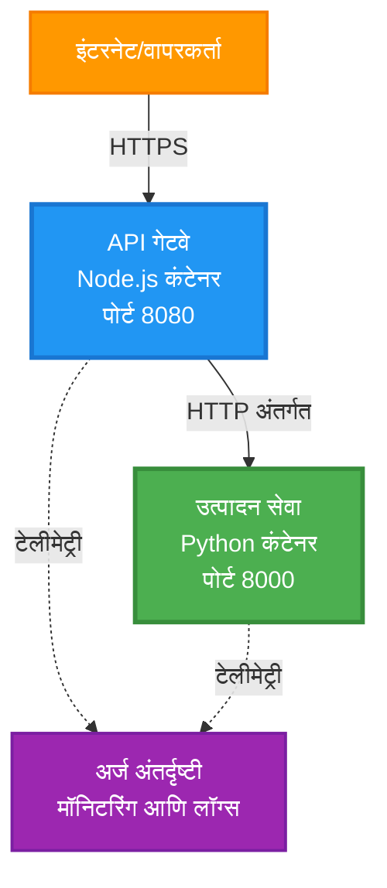
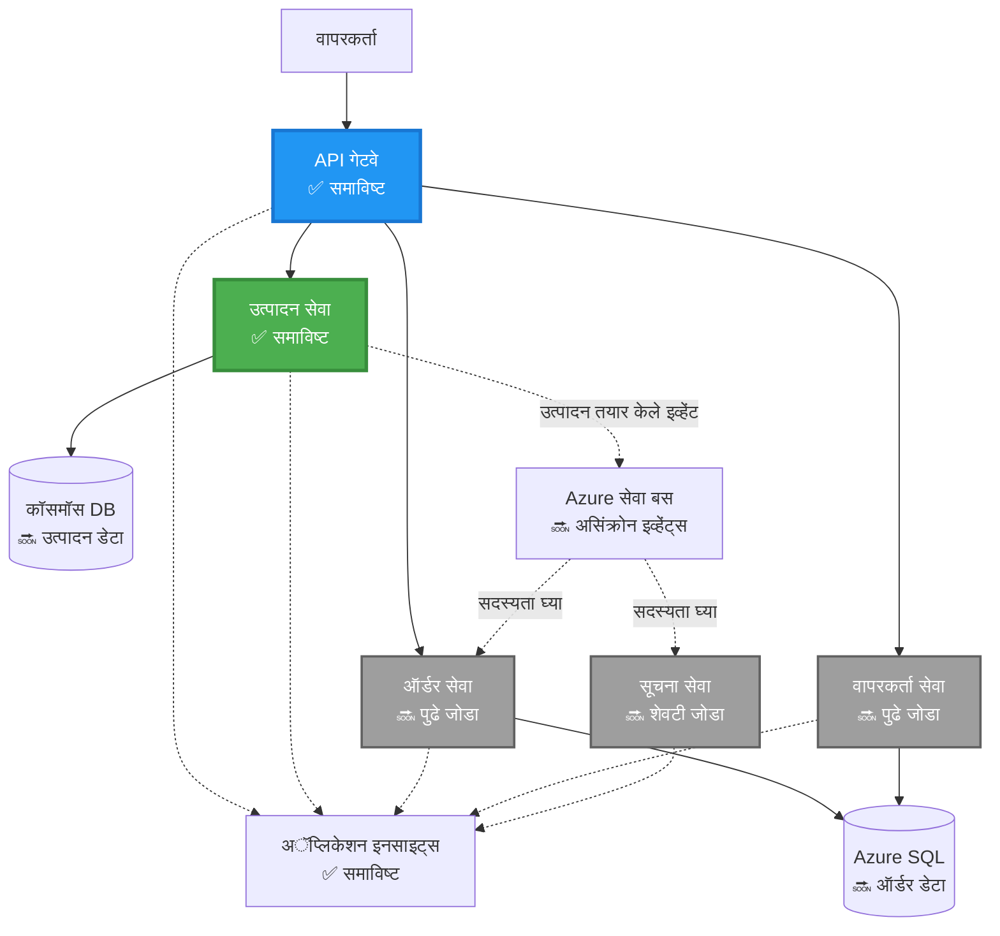
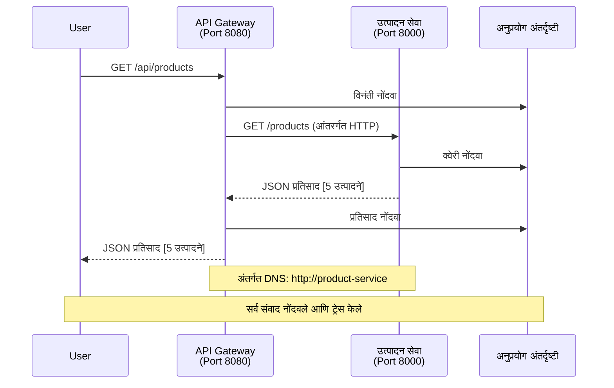

# मायक्रोसर्व्हिस आर्किटेक्चर - कंटेनर अॅप उदाहरण

⏱️ **अनुमानित वेळ**: २५-३५ मिनिटे | 💰 **अनुमानित खर्च**: ~$५०-१००/महिना | ⭐ **जटिलता**: प्रगत

**📚 शिकण्याचा मार्ग:**
- ← मागील: [सिंपल फ्लास्क API](../../../../examples/container-app/simple-flask-api) - सिंगल कंटेनरची मूलभूत माहिती
- 🎯 **तुम्ही येथे आहात**: मायक्रोसर्व्हिस आर्किटेक्चर (२-सर्व्हिस फाउंडेशन)
- → पुढे: [AI इंटिग्रेशन](../../../../docs/ai-foundry) - तुमच्या सेवांमध्ये बुद्धिमत्ता जोडा
- 🏠 [कोर्स होम](../../README.md)

---

एक **सोपे पण कार्यक्षम** मायक्रोसर्व्हिस आर्किटेक्चर, AZD CLI वापरून Azure Container Apps वर डिप्लॉय केलेले. हे उदाहरण सेवा-ते-सेवा संवाद, कंटेनर ऑर्केस्ट्रेशन, आणि मॉनिटरिंगसह २-सर्व्हिस सेटअपचे प्रात्यक्षिक देते.

> **📚 शिकण्याचा दृष्टिकोन**: हे उदाहरण एका मिनिमल २-सर्व्हिस आर्किटेक्चरपासून (API गेटवे + बॅकएंड सर्व्हिस) सुरू होते, जे तुम्ही प्रत्यक्षात डिप्लॉय करू शकता आणि शिकू शकता. या पायाभूत गोष्टींमध्ये प्रवीण झाल्यानंतर, आम्ही संपूर्ण मायक्रोसर्व्हिस इकोसिस्टममध्ये विस्तारासाठी मार्गदर्शन प्रदान करतो.

## तुम्ही काय शिकाल

हे उदाहरण पूर्ण करून, तुम्ही:
- Azure Container Apps वर एकाधिक कंटेनर डिप्लॉय कराल
- अंतर्गत नेटवर्किंगसह सेवा-ते-सेवा संवाद अंमलात आणाल
- पर्यावरण-आधारित स्केलिंग आणि हेल्थ चेक्स कॉन्फिगर कराल
- Application Insights सह वितरित अनुप्रयोगांचे मॉनिटरिंग कराल
- मायक्रोसर्व्हिस डिप्लॉयमेंट पॅटर्न आणि सर्वोत्तम पद्धती समजून घ्याल
- सोप्या ते जटिल आर्किटेक्चरमध्ये प्रगत विस्तार शिकाल

## आर्किटेक्चर

### टप्पा १: आपण काय तयार करत आहोत (या उदाहरणात समाविष्ट)


**घटक तपशील:**

| घटक | उद्देश | प्रवेश | संसाधने |
|------|--------|-------|----------|
| **API गेटवे** | बाह्य विनंत्या बॅकएंड सेवांकडे रूट करतो | सार्वजनिक (HTTPS) | १ vCPU, २GB RAM, २-२० प्रतिकृती |
| **प्रॉडक्ट सर्व्हिस** | इन-मेमरी डेटासह प्रॉडक्ट कॅटलॉग व्यवस्थापित करते | फक्त अंतर्गत | ०.५ vCPU, १GB RAM, १-१० प्रतिकृती |
| **Application Insights** | केंद्रीकृत लॉगिंग आणि वितरित ट्रेसिंग | Azure पोर्टल | १-२ GB/महिना डेटा इनजेशन |

**सोपे का सुरू करावे?**
- ✅ पटकन डिप्लॉय करा आणि समजून घ्या (२५-३५ मिनिटे)
- ✅ जटिलतेशिवाय मुख्य मायक्रोसर्व्हिस पॅटर्न शिका
- ✅ कार्यरत कोड जो तुम्ही बदलू आणि प्रयोग करू शकता
- ✅ शिकण्यासाठी कमी खर्च (~$५०-१००/महिना वि $३००-१४००/महिना)
- ✅ डेटाबेस आणि मेसेज क्यूज जोडण्यापूर्वी आत्मविश्वास निर्माण करा

**उदाहरण**: याला गाडी चालवायला शिकण्यासारखे समजा. तुम्ही रिकाम्या पार्किंग लॉटपासून (२ सेवा) सुरुवात करता, मूलभूत गोष्टी शिकता, आणि नंतर शहराच्या वाहतुकीत (५+ सेवा डेटाबेससह) प्रगती करता.

### टप्पा २: भविष्यातील विस्तार (संदर्भ आर्किटेक्चर)

२-सर्व्हिस आर्किटेक्चरमध्ये प्रवीण झाल्यानंतर, तुम्ही याचा विस्तार करू शकता:


"विस्तार मार्गदर्शक" विभागात चरण-दर-चरण सूचना पहा.

## समाविष्ट वैशिष्ट्ये

✅ **सेवा शोध**: कंटेनरमधील स्वयंचलित DNS-आधारित शोध  
✅ **लोड बॅलन्सिंग**: प्रतिकृतींमध्ये अंगभूत लोड बॅलन्सिंग  
✅ **ऑटो-स्केलिंग**: HTTP विनंत्यांवर आधारित स्वतंत्र सेवा स्केलिंग  
✅ **हेल्थ मॉनिटरिंग**: दोन्ही सेवांसाठी लायव्हनेस आणि रेडीनेस प्रॉब्स  
✅ **वितरित लॉगिंग**: Application Insights सह केंद्रीकृत लॉगिंग  
✅ **अंतर्गत नेटवर्किंग**: सुरक्षित सेवा-ते-सेवा संवाद  
✅ **कंटेनर ऑर्केस्ट्रेशन**: स्वयंचलित डिप्लॉयमेंट आणि स्केलिंग  
✅ **शून्य-डाउनटाइम अपडेट्स**: रिव्हिजन व्यवस्थापनासह रोलिंग अपडेट्स  

## पूर्वअटी

### आवश्यक साधने

सुरुवात करण्यापूर्वी, तुमच्याकडे ही साधने स्थापित आहेत याची खात्री करा:

1. **[Azure Developer CLI (azd)](https://learn.microsoft.com/azure/developer/azure-developer-cli/install-azd)** (आवृत्ती १.०.० किंवा त्याहून अधिक)
   ```bash
   azd version
   # अपेक्षित आउटपुट: azd आवृत्ती 1.0.0 किंवा उच्च
   ```

2. **[Azure CLI](https://learn.microsoft.com/cli/azure/install-azure-cli)** (आवृत्ती २.५०.० किंवा त्याहून अधिक)
   ```bash
   az --version
   # अपेक्षित आउटपुट: azure-cli 2.50.0 किंवा उच्च
   ```

3. **[Docker](https://www.docker.com/get-started)** (स्थानिक विकास/चाचणीसाठी - ऐच्छिक)
   ```bash
   docker --version
   # अपेक्षित आउटपुट: Docker आवृत्ती 20.10 किंवा त्याहून अधिक
   ```

### तुमची सेटअप सत्यापित करा

तुम्ही तयार आहात याची खात्री करण्यासाठी हे आदेश चालवा:

```bash
# Azure Developer CLI तपासा
azd version
# ✅ अपेक्षित: azd आवृत्ती 1.0.0 किंवा उच्च

# Azure CLI तपासा
az --version
# ✅ अपेक्षित: azure-cli 2.50.0 किंवा उच्च

# Docker तपासा (ऐच्छिक)
docker --version
# ✅ अपेक्षित: Docker आवृत्ती 20.10 किंवा उच्च
```

**यशस्वी निकष**: सर्व आदेश किमान किंवा त्याहून अधिक आवृत्ती क्रमांक परत करतात.

### Azure आवश्यकता

- सक्रिय **Azure सदस्यता** ([फ्री खाते तयार करा](https://azure.microsoft.com/free/))
- तुमच्या सदस्यत्वामध्ये संसाधने तयार करण्याची परवानगी
- सदस्यत्व किंवा संसाधन गटावर **Contributor** भूमिका

### ज्ञान पूर्वअटी

हे एक **प्रगत-स्तराचे** उदाहरण आहे. तुम्हाला:
- [सिंपल फ्लास्क API उदाहरण](../../../../examples/container-app/simple-flask-api) पूर्ण केलेले असावे
- मायक्रोसर्व्हिस आर्किटेक्चरची मूलभूत समज असावी
- REST APIs आणि HTTP ची ओळख असावी
- कंटेनर संकल्पनांची समज असावी

**कंटेनर अॅप्ससाठी नवीन?** मूलभूत गोष्टी शिकण्यासाठी प्रथम [सिंपल फ्लास्क API उदाहरण](../../../../examples/container-app/simple-flask-api) सुरू करा.

## जलद प्रारंभ (चरण-दर-चरण)

### चरण १: क्लोन करा आणि नेव्हिगेट करा

```bash
git clone https://github.com/microsoft/AZD-for-beginners.git
cd AZD-for-beginners/examples/microservices
```

**✓ यशस्वी तपासणी**: `azure.yaml` दिसत असल्याची खात्री करा:
```bash
ls
# अपेक्षित: README.md, azure.yaml, infra/, src/
```

### चरण २: Azure सह प्रमाणीकरण करा

```bash
azd auth login
```

हे Azure प्रमाणीकरणासाठी तुमचा ब्राउझर उघडते. तुमच्या Azure क्रेडेन्शियल्ससह साइन इन करा.

**✓ यशस्वी तपासणी**: तुम्हाला हे दिसले पाहिजे:
```
Logged in to Azure.
```

### चरण ३: पर्यावरण प्रारंभ करा

```bash
azd init
```

**तुम्हाला दिसणारे प्रॉम्प्ट्स**:
- **पर्यावरण नाव**: एक लहान नाव प्रविष्ट करा (उदा., `microservices-dev`)
- **Azure सदस्यता**: तुमची सदस्यता निवडा
- **Azure स्थान**: एक प्रदेश निवडा (उदा., `eastus`, `westeurope`)

**✓ यशस्वी तपासणी**: तुम्हाला हे दिसले पाहिजे:
```
SUCCESS: New project initialized!
```

### चरण ४: पायाभूत सुविधा आणि सेवा डिप्लॉय करा

```bash
azd up
```

**काय घडते** (८-१२ मिनिटे लागतात):

```mermaid
graph LR
    A[azd up] --> B[रिसोर्स ग्रुप तयार करा]
    B --> C[कंटेनर रजिस्ट्रि तैनात करा]
    C --> D[लॉग अॅनालिटिक्स तैनात करा]
    D --> E[अॅप इनसाइट्स तैनात करा]
    E --> F[कंटेनर वातावरण तयार करा]
    F --> G[API गेटवे इमेज तयार करा]
    F --> H[प्रॉडक्ट सर्व्हिस इमेज तयार करा]
    G --> I[रजिस्ट्रि मध्ये पुश करा]
    H --> I
    I --> J[API गेटवे तैनात करा]
    I --> K[प्रॉडक्ट सर्व्हिस तैनात करा]
    J --> L[इन्ग्रेस आणि हेल्थ चेक्स कॉन्फिगर करा]
    K --> L
    L --> M[तैनाती पूर्ण ✓]
    
    style A fill:#2196F3,stroke:#1976D2,stroke-width:3px,color:#fff
    style M fill:#4CAF50,stroke:#388E3C,stroke-width:3px,color:#fff
```


**✓ यशस्वी तपासणी**: तुम्हाला हे दिसले पाहिजे:
```
SUCCESS: Your application was deployed to Azure in X minutes Y seconds.
Endpoint: https://api-gateway-<unique-id>.azurecontainerapps.io
```

**⏱️ वेळ**: ८-१२ मिनिटे

### चरण ५: डिप्लॉयमेंटची चाचणी करा

```bash
# गेटवे एंडपॉइंट मिळवा
GATEWAY_URL=$(azd env get-values | grep API_GATEWAY_URL | cut -d '=' -f2 | tr -d '"')

# API गेटवेची आरोग्य स्थिती तपासा
curl $GATEWAY_URL/health
```

**✅ अपेक्षित आउटपुट**:
```json
{
  "status": "healthy",
  "service": "api-gateway",
  "timestamp": "2025-11-19T10:30:00Z"
}
```

**गेटवेद्वारे प्रॉडक्ट सर्व्हिसची चाचणी करा**:
```bash
# उत्पादने सूचीबद्ध करा
curl $GATEWAY_URL/api/products
```

**✅ अपेक्षित आउटपुट**:
```json
[
  {"id":1,"name":"Laptop","price":999.99,"stock":50},
  {"id":2,"name":"Mouse","price":29.99,"stock":200},
  {"id":3,"name":"Keyboard","price":79.99,"stock":150}
]
```

**✓ यशस्वी तपासणी**: दोन्ही एंडपॉइंट्स त्रुटीशिवाय JSON डेटा परत करतात.

---

**🎉 अभिनंदन!** तुम्ही Azure वर मायक्रोसर्व्हिस आर्किटेक्चर डिप्लॉय केले आहे!

## प्रकल्प संरचना

सर्व अंमलबजावणी फायली समाविष्ट आहेत—हे एक पूर्ण, कार्यरत उदाहरण आहे:

```
microservices/
│
├── README.md                         # This file
├── azure.yaml                        # AZD configuration
├── .gitignore                        # Git ignore patterns
│
├── infra/                           # Infrastructure as Code (Bicep)
│   ├── main.bicep                   # Main orchestration
│   ├── abbreviations.json           # Naming conventions
│   ├── core/                        # Shared infrastructure
│   │   ├── container-apps-environment.bicep  # Container environment + registry
│   │   └── monitor.bicep            # Application Insights + Log Analytics
│   └── app/                         # Service definitions
│       ├── api-gateway.bicep        # API Gateway container app
│       └── product-service.bicep    # Product Service container app
│
└── src/                             # Application source code
    ├── api-gateway/                 # Node.js API Gateway
    │   ├── app.js                   # Express server with routing
    │   ├── package.json             # Node dependencies
    │   └── Dockerfile               # Container definition
    └── product-service/             # Python Product Service
        ├── main.py                  # Flask API with product data
        ├── requirements.txt         # Python dependencies
        └── Dockerfile               # Container definition
```

**प्रत्येक घटक काय करतो:**

**पायाभूत सुविधा (infra/)**:
- `main.bicep`: सर्व Azure संसाधने आणि त्यांचे अवलंबित्व व्यवस्थापित करते
- `core/container-apps-environment.bicep`: कंटेनर अॅप्स पर्यावरण आणि Azure Container Registry तयार करते
- `core/monitor.bicep`: वितरित लॉगिंगसाठी Application Insights सेट करते
- `app/*.bicep`: स्केलिंग आणि हेल्थ चेक्ससह वैयक्तिक कंटेनर अॅप परिभाषा

**API गेटवे (src/api-gateway/)**:
- मागण्या बॅकएंड सेवांकडे रूट करणारी सार्वजनिक-समोरची सेवा
- लॉगिंग, त्रुटी हाताळणी, आणि विनंती फॉरवर्डिंग अंमलात आणते
- सेवा-ते-सेवा HTTP संवादाचे प्रात्यक्षिक देते

**प्रॉडक्ट सर्व्हिस (src/product-service/)**:
- प्रॉडक्ट कॅटलॉगसह अंतर्गत सेवा (सोपेपणासाठी इन-मेमरी)
- हेल्थ चेक्ससह REST API
- बॅकएंड मायक्रोसर्व्हिस पॅटर्नचे उदाहरण

## सेवांचे विहंगावलोकन

### API गेटवे (Node.js/Express)

**पोर्ट**: ८०८०  
**प्रवेश**: सार्वजनिक (बाह्य इनग्रेस)  
**उद्देश**: येणाऱ्या विनंत्या योग्य बॅकएंड सेवांकडे रूट करतो  

**एंडपॉइंट्स**:
- `GET /` - सेवा माहिती
- `GET /health` - हेल्थ चेक एंडपॉइंट
- `GET /api/products` - प्रॉडक्ट सर्व्हिसकडे फॉरवर्ड करा (सर्व सूचीबद्ध करा)
- `GET /api/products/:id` - प्रॉडक्ट सर्व्हिसकडे फॉरवर्ड करा (ID ने मिळवा)

**महत्त्वाची वैशिष्ट्ये**:
- axios सह विनंती रूटिंग
- केंद्रीकृत लॉगिंग
- त्रुटी हाताळणी आणि टाइमआउट व्यवस्थापन
- पर्यावरणीय चलांद्वारे सेवा शोध
- Application Insights एकत्रीकरण

**कोड हायलाइट** (`src/api-gateway/app.js`):
```javascript
// अंतर्गत सेवा संवाद
app.get('/api/products', async (req, res) => {
  const response = await axios.get(`${PRODUCT_SERVICE_URL}/products`, {
    timeout: 5000
  });
  res.json(response.data);
});
```

### प्रॉडक्ट सर्व्हिस (Python/Flask)

**पोर्ट**: ८०००  
**प्रवेश**: फक्त अंतर्गत (बाह्य इनग्रेस नाही)  
**उद्देश**: इन-मेमरी डेटासह प्रॉडक्ट कॅटलॉग व्यवस्थापित करते  

**एंडपॉइंट्स**:
- `GET /` - सेवा माहिती
- `GET /health` - हेल्थ चेक एंडपॉइंट
- `GET /products` - सर्व प्रॉडक्ट्स सूचीबद्ध करा
- `GET /products/<id>` - ID ने प्रॉडक्ट मिळवा

**महत्त्वाची वैशिष्ट्ये**:
- Flask सह RESTful API
- इन-मेमरी प्रॉडक्ट स्टोअर (सोपे, डेटाबेसची गरज नाही)
- प्रॉब्ससह हेल्थ मॉनिटरिंग
- संरचित लॉगिंग
- Application Insights एकत्रीकरण

**डेटा मॉडेल**:
```python
{
  "id": 1,
  "name": "Laptop",
  "description": "High-performance laptop",
  "price": 999.99,
  "stock": 50
}
```

**फक्त अंतर्गत का?**
प्रॉडक्ट सर्व्हिस सार्वजनिकपणे उघडलेली नाही. सर्व विनंत्या API गेटवेद्वारेच जाव्या लागतात, जे प्रदान करते:
- सुरक्षा: नियंत्रित प्रवेश बिंदू
- लवचिकता: क्लायंट्सवर परिणाम न करता बॅकएंड बदलू शकतो
- मॉनिटरिंग: केंद्रीकृत विनंती लॉगिंग

## सेवा संवाद समजून घेणे

### सेवांमध्ये संवाद कसा होतो


या उदाहरणात, API गेटवे प्रॉडक्ट सर्व्हिसशी **अंतर्गत HTTP कॉल्स** वापरून संवाद साधतो:

```javascript
// API गेटवे (src/api-gateway/app.js)
const PRODUCT_SERVICE_URL = process.env.PRODUCT_SERVICE_URL;

// अंतर्गत HTTP विनंती करा
const response = await axios.get(`${PRODUCT_SERVICE_URL}/products`);
```

**महत्त्वाचे मुद्दे**:

1. **DNS-आधारित शोध**: कंटेनर अॅप्स अंतर्गत सेवांसाठी स्वयंचलित DNS प्रदान करतो
   - प्रॉडक्ट सर्व्हिस FQDN: `product-service.internal.<environment>.azurecontainerapps.io`
   - सोपे केलेले: `http://product-service` (कंटेनर अॅप्स ते रिझॉल्व्ह करतो)

2. **सार्वजनिक प्रदर्शन नाही**: प्रॉडक्ट सर्व्हिसमध्ये `external: false` Bicep मध्ये आहे
   - फक्त कंटेनर अॅप्स पर्यावरणात प्रवेशयोग्य
   - इंटरनेटवरून पोहोचता येत नाही

3. **पर्यावरणीय चल**: सेवा URL डिप्लॉयमेंट वेळी इंजेक्ट केले जातात
   - Bicep अंतर्गत FQDN गेटवेवर पास करते
   - अनुप्रयोग कोडमध्ये हार्डकोडेड URL नाही

**उदाहरण**: याला ऑफिस रूम्ससारखे समजा. API गेटवे रिसेप्शन डेस्क आहे (सार्वजनिक-समोर), आणि प्रॉडक्ट सर्व्हिस ऑफिस रूम आहे (फक्त अंतर्गत). कोणत्याही ऑफिसमध्ये पोहोचण्यासाठी अभ्यागतांना रिसेप्शनमधून जावे लागते.
3. दोन्ही सेवा पुन्हा तैनात करा:

```bash
azd deploy product-service
azd deploy api-gateway
```

4. नवीन एन्डपॉइंटची चाचणी करा:

```bash
GATEWAY_URL=$(azd env get-values | grep API_GATEWAY_URL | cut -d '=' -f2 | tr -d '"')

# नवीन उत्पादन तयार करा
curl -X POST $GATEWAY_URL/api/products \
  -H "Content-Type: application/json" \
  -d '{"name":"USB Cable","price":9.99,"stock":500}'
```

**✅ अपेक्षित आउटपुट:**
```json
{"id":6,"name":"USB Cable","description":"","price":9.99,"stock":500}
```

5. यादीमध्ये दिसत असल्याची खात्री करा:

```bash
curl $GATEWAY_URL/api/products
# आता 6 उत्पादने दाखवली पाहिजेत ज्यामध्ये नवीन USB केबल समाविष्ट आहे
```

**यशस्वी निकष**:
- ✅ POST विनंती HTTP 201 परत करते
- ✅ नवीन उत्पादन GET /api/products यादीमध्ये दिसते
- ✅ उत्पादनाला ऑटो-इन्क्रिमेंटेड ID आहे

**वेळ**: 10-15 मिनिटे

---

### व्यायाम 2: ऑटोस्केलिंग नियम बदलणे ⭐⭐ (मध्यम)

**उद्दिष्ट**: प्रोडक्ट सर्विस अधिक आक्रमकपणे स्केल करण्यासाठी बदलणे

**सुरुवातीचा बिंदू**: `infra/app/product-service.bicep`

**पायऱ्या**:

1. `infra/app/product-service.bicep` उघडा आणि `scale` ब्लॉक शोधा (सुमारे ओळ 95)

2. बदल करा:
```bicep
scale: {
  minReplicas: 1
  maxReplicas: 10
  rules: [
    {
      name: 'http-scale-rule'
      http: {
        metadata: {
          concurrentRequests: '100'  // OLD
        }
      }
    }
  ]
}
```

ते:
```bicep
scale: {
  minReplicas: 2  // Always have 2 running
  maxReplicas: 20  // Allow more scaling
  rules: [
    {
      name: 'http-scale-rule'
      http: {
        metadata: {
          concurrentRequests: '20'  // Scale at lower threshold
        }
      }
    }
  ]
}
```

3. इन्फ्रास्ट्रक्चर पुन्हा तैनात करा:

```bash
azd up
```

4. नवीन स्केलिंग कॉन्फिगरेशन सत्यापित करा:

```bash
az containerapp show \
  --name $(azd env get-values | grep PRODUCT_SERVICE | head -1 | cut -d '/' -f5) \
  --resource-group $(azd env get-values | grep AZURE_RESOURCE_GROUP | cut -d '=' -f2 | tr -d '"') \
  --query "properties.template.scale" -o json
```

**✅ अपेक्षित आउटपुट:**
```json
{
  "minReplicas": 2,
  "maxReplicas": 20,
  "rules": [...]
}
```

5. लोडसह ऑटोस्केलिंगची चाचणी करा:

```bash
# समांतर विनंत्या तयार करा
for i in {1..500}; do curl $GATEWAY_URL/api/products & done

# स्केलिंग होत असल्याचे पहा
azd logs product-service --follow
# शोधा: कंटेनर अॅप्स स्केलिंग इव्हेंट्स
```

**यशस्वी निकष**:
- ✅ प्रोडक्ट सर्विस नेहमी किमान 2 प्रतिकृती चालवते
- ✅ लोड अंतर्गत, 2 पेक्षा जास्त प्रतिकृतींवर स्केल करते
- ✅ Azure पोर्टल नवीन स्केलिंग नियम दर्शवते

**वेळ**: 15-20 मिनिटे

---

### व्यायाम 3: कस्टम मॉनिटरिंग क्वेरी जोडा ⭐⭐ (मध्यम)

**उद्दिष्ट**: प्रोडक्ट API कार्यक्षमता ट्रॅक करण्यासाठी कस्टम Application Insights क्वेरी तयार करा

**पायऱ्या**:

1. Azure पोर्टलमध्ये Application Insights वर जा:
   - Azure पोर्टलमध्ये जा
   - तुमचा रिसोर्स ग्रुप शोधा (rg-microservices-*)
   - Application Insights रिसोर्सवर क्लिक करा

2. डाव्या मेनूमध्ये "Logs" वर क्लिक करा

3. ही क्वेरी तयार करा:

```kusto
requests
| where timestamp > ago(1h)
| where name contains "products"
| summarize 
    RequestCount = count(),
    AvgDuration = avg(duration),
    P95Duration = percentile(duration, 95),
    SuccessRate = 100.0 * countif(success == true) / count()
  by bin(timestamp, 5m)
| render timechart
```

4. क्वेरी चालवण्यासाठी "Run" वर क्लिक करा

5. क्वेरी सेव्ह करा:
   - "Save" वर क्लिक करा
   - नाव: "Product API Performance"
   - श्रेणी: "Performance"

6. टेस्ट ट्रॅफिक तयार करा:

```bash
for i in {1..100}; do curl $GATEWAY_URL/api/products; sleep 1; done
```

7. डेटा पाहण्यासाठी क्वेरी रीफ्रेश करा

**✅ अपेक्षित आउटपुट:**
- वेळोवेळी विनंती संख्या दर्शवणारा चार्ट
- सरासरी कालावधी < 500ms
- यश दर = 100%
- 5 मिनिटांच्या टाइम बिन्स

**यशस्वी निकष**:
- ✅ क्वेरी 100+ विनंत्या दर्शवते
- ✅ यश दर 100% आहे
- ✅ सरासरी कालावधी < 500ms
- ✅ चार्ट 5-मिनिट टाइम बिन्स दर्शवतो

**शिकण्याचा परिणाम**: कस्टम क्वेरीसह सेवा कार्यक्षमता कशी मॉनिटर करायची ते समजून घ्या

**वेळ**: 10-15 मिनिटे

---

### व्यायाम 4: Retry Logic लागू करा ⭐⭐⭐ (प्रगत)

**उद्दिष्ट**: प्रोडक्ट सर्विस तात्पुरती अनुपलब्ध असताना API Gateway मध्ये Retry Logic जोडा

**सुरुवातीचा बिंदू**: `src/api-gateway/app.js`

**पायऱ्या**:

1. Retry लायब्ररी इंस्टॉल करा:

```bash
cd src/api-gateway
npm install axios-retry --save
cd ../..
```

2. `src/api-gateway/app.js` अपडेट करा (axios आयात केल्यानंतर जोडा):

```javascript
const axiosRetry = require('axios-retry');

// पुनर्प्रयत्न लॉजिक कॉन्फिगर करा
axiosRetry(axios, {
  retries: 3,
  retryDelay: (retryCount) => {
    return retryCount * 1000; // 1 सेकंद, 2 सेकंद, 3 सेकंद
  },
  retryCondition: (error) => {
    // नेटवर्क त्रुटी किंवा 5xx प्रतिसादांवर पुनर्प्रयत्न करा
    return axiosRetry.isNetworkOrIdempotentRequestError(error) ||
           (error.response && error.response.status >= 500);
  }
});

console.log('Retry logic configured: 3 retries with exponential backoff');
```

3. API Gateway पुन्हा तैनात करा:

```bash
azd deploy api-gateway
```

4. सेवा अपयशाचे अनुकरण करून Retry वर्तनाची चाचणी करा:

```bash
# उत्पादन सेवा 0 वर स्केल करा (अपयशाची नक्कल करा)
az containerapp update \
  --name $(azd env get-values | grep PRODUCT_SERVICE | head -1 | cut -d '/' -f5) \
  --resource-group $(azd env get-values | grep AZURE_RESOURCE_GROUP | cut -d '=' -f2 | tr -d '"') \
  --min-replicas 0 \
  --max-replicas 0

# उत्पादने प्रवेश करण्याचा प्रयत्न करा (3 वेळा पुन्हा प्रयत्न करेल)
time curl -v $GATEWAY_URL/api/products
# निरीक्षण करा: प्रतिसाद ~6 सेकंद लागतो (1s + 2s + 3s पुन्हा प्रयत्न)

# उत्पादन सेवा पुनर्संचयित करा
az containerapp update \
  --name $(azd env get-values | grep PRODUCT_SERVICE | head -1 | cut -d '/' -f5) \
  --resource-group $(azd env get-values | grep AZURE_RESOURCE_GROUP | cut -d '=' -f2 | tr -d '"') \
  --min-replicas 1 \
  --max-replicas 10
```

5. Retry लॉग पहा:

```bash
azd logs api-gateway --tail 50
# पुन्हा प्रयत्न संदेश शोधा
```

**✅ अपेक्षित वर्तन:**
- विनंत्या अपयशी होण्यापूर्वी 3 वेळा Retry करतात
- प्रत्येक Retry अधिक वेळ थांबते (1s, 2s, 3s)
- सेवा पुन्हा सुरू झाल्यानंतर यशस्वी विनंत्या
- Retry प्रयत्न लॉगमध्ये दिसतात

**यशस्वी निकष**:
- ✅ विनंत्या अपयशी होण्यापूर्वी 3 वेळा Retry करतात
- ✅ प्रत्येक Retry अधिक वेळ थांबते (exponential backoff)
- ✅ सेवा पुन्हा सुरू झाल्यानंतर यशस्वी विनंत्या
- ✅ Retry प्रयत्न लॉगमध्ये दिसतात

**शिकण्याचा परिणाम**: मायक्रोसर्व्हिसेसमधील लवचिकता पॅटर्न समजून घ्या (circuit breakers, retries, timeouts)

**वेळ**: 20-25 मिनिटे

---

## ज्ञान तपासणी

हे उदाहरण पूर्ण केल्यानंतर, तुमचे ज्ञान सत्यापित करा:

### 1. सेवा संवाद ✓

तुमचे ज्ञान तपासा:
- [ ] API Gateway प्रोडक्ट सर्विस कसे शोधते हे तुम्ही स्पष्ट करू शकता का? (DNS-आधारित सेवा शोध)
- [ ] प्रोडक्ट सर्विस डाउन असल्यास काय होते? (Gateway 503 त्रुटी परत करते)
- [ ] तुम्ही तिसरी सेवा कशी जोडाल? (नवीन Bicep फाइल तयार करा, मुख्य.bicep मध्ये जोडा, src फोल्डर तयार करा)

**हँड्स-ऑन सत्यापन**:
```bash
# सेवा अपयश अनुकरण करा
az containerapp update --name <product-service-name> --min-replicas 0 --max-replicas 0
curl $GATEWAY_URL/api/products
# ✅ अपेक्षित: 503 सेवा अनुपलब्ध

# सेवा पुनर्संचयित करा
az containerapp update --name <product-service-name> --min-replicas 1 --max-replicas 10
```

### 2. मॉनिटरिंग आणि निरीक्षण ✓

तुमचे ज्ञान तपासा:
- [ ] वितरित लॉग्स कुठे दिसतात? (Azure पोर्टलमधील Application Insights)
- [ ] धीम्या विनंत्या कशा ट्रॅक करायच्या? (Kusto क्वेरी: `requests | where duration > 1000`)
- [ ] कोणत्या सेवेमुळे त्रुटी झाली हे तुम्ही ओळखू शकता का? (लॉग्समधील `cloud_RoleName` फील्ड तपासा)

**हँड्स-ऑन सत्यापन**:
```bash
# धीम्या विनंतीचे अनुकरण तयार करा
curl "$GATEWAY_URL/api/products?delay=2000"

# धीम्या विनंत्यांसाठी Application Insights क्वेरी करा
# Azure Portal → Application Insights → Logs येथे जा
# चालवा: requests | where duration > 1000 | project timestamp, name, duration, cloud_RoleName
```

### 3. स्केलिंग आणि कार्यक्षमता ✓

तुमचे ज्ञान तपासा:
- [ ] ऑटोस्केलिंग कशामुळे ट्रिगर होते? (HTTP एकत्रित विनंती नियम: Gateway साठी 50, प्रोडक्ट साठी 100)
- [ ] सध्या किती प्रतिकृती चालू आहेत? (`az containerapp revision list` सह तपासा)
- [ ] प्रोडक्ट सर्विस 5 प्रतिकृतींवर कसे स्केल कराल? (Bicep मध्ये minReplicas अपडेट करा)

**हँड्स-ऑन सत्यापन**:
```bash
# ऑटोस्केलिंग चाचणीसाठी लोड तयार करा
for i in {1..1000}; do curl $GATEWAY_URL/api/products & done

# प्रतिकृती वाढताना पहा
azd logs api-gateway --follow
# ✅ अपेक्षित: लॉगमध्ये स्केलिंग इव्हेंट्स पहा
```

**यशस्वी निकष**: तुम्ही सर्व प्रश्नांची उत्तरे देऊ शकता आणि हँड्स-ऑन कमांडसह सत्यापित करू शकता.

---

## खर्च विश्लेषण

### अंदाजित मासिक खर्च (या 2-सेवा उदाहरणासाठी)

| संसाधन | कॉन्फिगरेशन | अंदाजित खर्च |
|----------|--------------|----------------|
| API Gateway | 2-20 प्रतिकृती, 1 vCPU, 2GB RAM | $30-150 |
| प्रोडक्ट सर्विस | 1-10 प्रतिकृती, 0.5 vCPU, 1GB RAM | $15-75 |
| कंटेनर रजिस्ट्रि | बेसिक टियर | $5 |
| Application Insights | 1-2 GB/महिना | $5-10 |
| लॉग अॅनालिटिक्स | 1 GB/महिना | $3 |
| **एकूण** | | **$58-243/महिना** |

### वापरानुसार खर्चाचे विभाजन

**हलका ट्रॅफिक** (चाचणी/शिकणे): ~$60/महिना
- API Gateway: 2 प्रतिकृती × 24/7 = $30
- प्रोडक्ट सर्विस: 1 प्रतिकृती × 24/7 = $15
- मॉनिटरिंग + रजिस्ट्रि = $13

**मध्यम ट्रॅफिक** (लहान उत्पादन): ~$120/महिना
- API Gateway: 5 सरासरी प्रतिकृती = $75
- प्रोडक्ट सर्विस: 3 सरासरी प्रतिकृती = $45
- मॉनिटरिंग + रजिस्ट्रि = $13

**जास्त ट्रॅफिक** (गर्दीचे कालखंड): ~$240/महिना
- API Gateway: 15 सरासरी प्रतिकृती = $225
- प्रोडक्ट सर्विस: 8 सरासरी प्रतिकृती = $120
- मॉनिटरिंग + रजिस्ट्रि = $13

### खर्च कमी करण्याचे टिप्स

1. **विकसनासाठी शून्यावर स्केल करा**:
   ```bicep
   scale: {
     minReplicas: 0  // Save $30-40/month when not in use
     maxReplicas: 10
   }
   ```

2. **Cosmos DB साठी Consumption Plan वापरा** (तुम्ही ते जोडल्यावर):
   - फक्त वापरासाठी पैसे द्या
   - किमान शुल्क नाही

3. **Application Insights सॅम्पलिंग सेट करा**:
   ```javascript
   appInsights.defaultClient.config.samplingPercentage = 50; // विनंत्यांपैकी 50% नमुना
   ```

4. **आवश्यक नसल्यास साफ करा**:
   ```bash
   azd down --force --purge
   ```

### फ्री टियर पर्याय

शिकणे/चाचणीसाठी विचार करा:
- ✅ Azure फ्री क्रेडिट्स वापरा ($200 पहिल्या 30 दिवसांसाठी नवीन खात्यांसह)
- ✅ किमान प्रतिकृती ठेवा (सुमारे 50% खर्च वाचतो)
- ✅ चाचणीनंतर हटवा (कोणतेही चालू शुल्क नाही)
- ✅ शिकण्याच्या सत्रांमध्ये शून्यावर स्केल करा

**उदाहरण**: हे उदाहरण 2 तास/दिवस × 30 दिवस चालवणे = ~$5/महिना ऐवजी $60/महिना

---

## समस्या निवारण जलद संदर्भ

### समस्या: `azd up` "Subscription not found" त्रुटीने अपयशी ठरते

**उपाय**:
```bash
# स्पष्ट सदस्यता सह पुन्हा लॉगिन करा
az account set --subscription <your-subscription-id>
azd env set AZURE_SUBSCRIPTION_ID <your-subscription-id>
azd up
```

### समस्या: API Gateway 503 "Product service unavailable" परत करते

**तपासा**:
```bash
# उत्पादन सेवा लॉग्स तपासा
azd logs product-service --tail 50

# उत्पादन सेवा आरोग्य तपासा
az containerapp show \
  --name $(azd env get-values | grep PRODUCT_SERVICE | head -1 | cut -d '/' -f5) \
  --resource-group $(azd env get-values | grep AZURE_RESOURCE_GROUP | cut -d '=' -f2 | tr -d '"') \
  --query "properties.runningStatus"
```

**सामान्य कारणे**:
1. प्रोडक्ट सर्विस सुरू झाली नाही (Python त्रुटींसाठी लॉग्स तपासा)
2. हेल्थ चेक अपयशी (तुमचा `/health` एन्डपॉइंट कार्यरत आहे का ते सत्यापित करा)
3. कंटेनर इमेज बिल्ड अपयशी (रजिस्ट्रि मध्ये इमेज तपासा)

### समस्या: ऑटोस्केलिंग कार्य करत नाही

**तपासा**:
```bash
# वर्तमान प्रतिकृती संख्या तपासा
az containerapp revision list \
  --name $(azd env get-values | grep API_GATEWAY | head -1 | cut -d '/' -f5) \
  --resource-group $(azd env get-values | grep AZURE_RESOURCE_GROUP | cut -d '=' -f2 | tr -d '"') \
  --query "[].properties.replicas"

# चाचणीसाठी लोड तयार करा
for i in {1..1000}; do curl $GATEWAY_URL/api/products & done

# स्केलिंग इव्हेंट्स पहा
azd logs api-gateway --follow | grep -i scale
```

**सामान्य कारणे**:
1. स्केल नियम ट्रिगर करण्यासाठी लोड पुरेसे नाही (50 पेक्षा जास्त एकत्रित विनंत्या आवश्यक)
2. जास्तीत जास्त प्रतिकृती आधीच पोहोचल्या आहेत (Bicep कॉन्फिगरेशन तपासा)
3. Bicep मध्ये स्केल नियम चुकीचा कॉन्फिगर केला आहे (concurrentRequests मूल्य सत्यापित करा)

### समस्या: Application Insights लॉग्स दर्शवत नाही

**तपासा**:
```bash
# कनेक्शन स्ट्रिंग सेट आहे का ते सत्यापित करा
azd env get-values | grep APPLICATIONINSIGHTS

# सेवा टेलिमेट्री पाठवत आहेत का ते तपासा
az monitor app-insights component show \
  --app $(azd env get-values | grep APPLICATIONINSIGHTS_NAME | cut -d '=' -f2 | tr -d '"') \
  --resource-group $(azd env get-values | grep AZURE_RESOURCE_GROUP | cut -d '=' -f2 | tr -d '"') \
  --query "properties.InstrumentationKey"
```

**सामान्य कारणे**:
1. कंटेनरला कनेक्शन स्ट्रिंग पास केला नाही (पर्यावरणीय व्हेरिएबल्स तपासा)
2. Application Insights SDK कॉन्फिगर केलेले नाही (कोडमधील आयात सत्यापित करा)
3. टेलिमेट्री ब्लॉक करणारा फायरवॉल (दुर्मिळ, नेटवर्क नियम तपासा)

### समस्या: Docker बिल्ड स्थानिक पातळीवर अपयशी ठरते

**तपासा**:
```bash
# API गेटवे बिल्ड तपासा
cd src/api-gateway
docker build -t test-gateway .

# प्रोडक्ट सर्विस बिल्ड तपासा
cd ../product-service
docker build -t test-product .
```

**सामान्य कारणे**:
1. package.json/requirements.txt मध्ये हरवलेली dependencies
2. Dockerfile सिंटॅक्स त्रुटी
3. dependencies डाउनलोड करताना नेटवर्क समस्या

**अजून अडचण आहे?** [सामान्य समस्या मार्गदर्शक](../../docs/troubleshooting/common-issues.md) किंवा [Azure Container Apps Troubleshooting](https://learn.microsoft.com/azure/container-apps/troubleshooting) पहा

---

## साफसफाई

चालू शुल्क टाळण्यासाठी, सर्व संसाधने हटवा:

```bash
azd down --force --purge
```

**पुष्टीकरण प्रॉम्प्ट**:
```
? Total resources to delete: 6, are you sure you want to continue? (y/N)
```

`y` टाइप करा पुष्टी करण्यासाठी.

**काय हटवले जाते**:
- कंटेनर अॅप्स वातावरण
- दोन्ही कंटेनर अॅप्स (Gateway आणि प्रोडक्ट सर्विस)
- कंटेनर रजिस्ट्रि
- Application Insights
- लॉग अॅनालिटिक्स वर्कस्पेस
- रिसोर्स ग्रुप

**✓ साफसफाई सत्यापित करा**:
```bash
az group list --query "[?starts_with(name,'rg-microservices')]" --output table
```

रिक्त परत येणे आवश्यक आहे.

---

## विस्तार मार्गदर्शक: 2 ते 5+ सेवा

तुम्ही हे 2-सेवा आर्किटेक्चर मास्टर केल्यानंतर, विस्तार कसा करायचा:

### टप्पा 1: डेटाबेस टिकवणे जोडा (पुढील पाऊल)

**प्रोडक्ट सर्विससाठी Cosmos DB जोडा**:

1. `infra/core/cosmos.bicep` तयार करा:
   ```bicep
   resource cosmosAccount 'Microsoft.DocumentDB/databaseAccounts@2023-04-15' = {
     name: name
     location: location
     kind: 'GlobalDocumentDB'
     properties: {
       databaseAccountOfferType: 'Standard'
       consistencyPolicy: { defaultConsistencyLevel: 'Session' }
       locations: [{ locationName: location, failoverPriority: 0 }]
     }
   }
   ```

2. प्रोडक्ट सर्विसला इन-मेमरी डेटाच्या ऐवजी Azure Cosmos DB Python SDK वापरण्यासाठी अपडेट करा

3. अंदाजित अतिरिक्त खर्च: ~$25/महिना (serverless)

### टप्पा 2: तिसरी सेवा जोडा (Order Management)

**Order Service तयार करा**:

1. नवीन फोल्डर: `src/order-service/` (Python/Node.js/C#)
2. नवीन Bicep: `infra/app/order-service.bicep`
3. API Gateway अपडेट करा `/api/orders` रूट करण्यासाठी
4. ऑर्डर टिकवण्यासाठी Azure SQL Database जोडा

**आर्किटेक्चर बनते**:
```
API Gateway → Product Service (Cosmos DB)
           → Order Service (Azure SQL)
```

### टप्पा 3: Async Communication जोडा (Service Bus)

**इव्हेंट-ड्रिव्हन आर्किटेक्चर लागू करा**:

1. Azure Service Bus जोडा: `infra/core/servicebus.bicep`
2. प्रोडक्ट सर्विस "ProductCreated" इव्हेंट्स प्रकाशित करते
3. Order Service प्रोडक्ट इव्हेंट्सची सदस्यता घेते
4. इव्हेंट्स प्रक्रिया करण्यासाठी Notification Service जोडा

**पॅटर्न**: Request/Response (HTTP) + Event-Driven (Service Bus)

### टप्पा 4: वापरकर्ता प्रमाणीकरण जोडा

**User Service लागू करा**:

1. `src/user-service/` तयार करा (Go/Node.js)
2. Azure AD B2C किंवा कस्टम JWT प्रमाणीकरण जोडा
3. API Gateway टोकन्स सत्यापित करते रूटिंगपूर्वी
4. सेवा वापरकर्ता परवानग्या तपासतात

### टप्पा 5: उत्पादन तयारी

**हे घटक जोडा**:
- ✅ Azure Front Door (जागतिक लोड बॅलन्सिंग)
- ✅ Azure Key Vault (गुपित व्यवस्थापन)
- ✅ Azure Monitor Workbooks (कस्टम डॅशबोर्ड)
- ✅ CI/CD Pipeline (GitHub Actions)
- ✅ Blue-Green Deployments
- ✅ सर्व सेवांसाठी Managed Identity

**पूर्ण उत्पादन आर्किटेक्चर खर्च**: ~$300-1,400/महिना

---

## अधिक जाणून घ्या

### संबंधित दस्तऐवज
- [Azure Container Apps Documentation](https://learn.microsoft.com/azure/container-apps/)
- [Microservices Architecture Guide](https://learn.microsoft.com/azure/architecture/guide/architecture-styles/microservices)
- [Application Insights for Distributed Tracing](https://learn.microsoft.com/azure/azure-monitor/app/distributed-tracing)
- [Azure Developer CLI Documentation](https://learn.microsoft.com/azure/developer/azure-developer-cli/)

### या कोर्समधील पुढील पायऱ्या
- ← मागील: [Simple Flask API](../../../../examples/container-app/simple-flask-api) - सुरुवातीचे सिंगल-कंटेनर उदाहरण
- → पुढील: [AI Integration Guide](../../../../docs/ai-foundry) - AI क्षमता जोडा
- 🏠 [कोर्स होम](../../README.md)

### तुलना: काय कधी वापरायचे

| वैशिष्ट्य | सिंगल कंटेनर | मायक्रोसर्व्हिसेस (हे) | Kubernetes (AKS) |
|---------|-----------------|---------------------|------------------|
| **वापर प्रकरण** | साधे अॅप्स | जटिल अॅप्स | एंटरप्राइझ अॅप्स |
| **स्केलेबिलिटी** | सिंगल सेवा | प्रति-सेवा स्केलिंग | जास्तीत जास्त लवचिकता |
| **जटिलता** | कमी | मध्यम | उच्च |
| **टीम आकार** | 1-3 विकसक | 3-10 विकसक | 10+ विकसक |
| **खर्च** | ~$15-50/महिना | ~$60-250/महिना | ~$150-500/महिना |
| **तैनाती वेळ** | 5-10 मिनिटे | 8-12 मिनिटे | 15-30 मिनिटे |
| **सर्वोत्तम उपयोगासाठी** | MVPs, प्रोटोटाइप्स | उत्पादन अ‍ॅप्स | मल्टी-क्लाउड, प्रगत नेटवर्किंग |

**शिफारस**: कंटेनर अ‍ॅप्ससह सुरुवात करा (हा उदाहरण), AKS वर जा फक्त तुम्हाला Kubernetes-विशिष्ट वैशिष्ट्यांची आवश्यकता असल्यास.

---

## वारंवार विचारले जाणारे प्रश्न

**प्रश्न: फक्त 2 सेवा का, 5+ का नाही?**  
उत्तर: शैक्षणिक प्रगती. जटिलता वाढवण्यापूर्वी सोप्या उदाहरणासह मूलभूत गोष्टी (सेवा संवाद, मॉनिटरिंग, स्केलिंग) समजून घ्या. तुम्ही येथे शिकलेले नमुने 100-सेवा आर्किटेक्चरवर लागू होतात.

**प्रश्न: मी स्वतः अधिक सेवा जोडू शकतो का?**  
उत्तर: नक्कीच! वरील विस्तार मार्गदर्शक अनुसरण करा. प्रत्येक नवीन सेवा त्याच नमुन्याचे अनुसरण करते: src फोल्डर तयार करा, Bicep फाइल तयार करा, azure.yaml अपडेट करा, तैनात करा.

**प्रश्न: हे उत्पादनासाठी तयार आहे का?**  
उत्तर: हे एक मजबूत पाया आहे. उत्पादनासाठी, जोडा: व्यवस्थापित ओळख, Key Vault, स्थिर डेटाबेस, CI/CD पाइपलाइन, मॉनिटरिंग अलर्ट्स आणि बॅकअप रणनीती.

**प्रश्न: Dapr किंवा इतर सेवा जाळे का वापरू नये?**  
उत्तर: शिकण्यासाठी सोपे ठेवा. एकदा तुम्हाला मूळ कंटेनर अ‍ॅप्स नेटवर्किंग समजले की, तुम्ही प्रगत परिस्थितीसाठी (स्टेट मॅनेजमेंट, pub/sub, बाइंडिंग्स) Dapr जोडू शकता.

**प्रश्न: मी स्थानिकपणे डीबग कसे करू?**  
उत्तर: Docker सह स्थानिकपणे सेवा चालवा:  
```bash
cd src/api-gateway
docker build -t local-gateway .
docker run -p 8080:8080 -e PRODUCT_SERVICE_URL=http://localhost:8000 local-gateway
```


**प्रश्न: मी वेगवेगळ्या प्रोग्रामिंग भाषांचा वापर करू शकतो का?**  
उत्तर: होय! हे उदाहरण Node.js (गेटवे) + Python (प्रॉडक्ट सेवा) दाखवते. तुम्ही कंटेनर्समध्ये चालणाऱ्या कोणत्याही भाषांचा मिश्रण करू शकता: C#, Go, Java, Ruby, PHP, इत्यादी.

**प्रश्न: माझ्याकडे Azure क्रेडिट्स नसल्यास काय करावे?**  
उत्तर: Azure फ्री टियर वापरा (नवीन खात्यांसाठी पहिल्या 30 दिवसांत $200 क्रेडिट्स मिळतात) किंवा थोड्या चाचणी कालावधीसाठी तैनात करा आणि लगेच हटवा. हे उदाहरण सुमारे $2/दिवस खर्च करते.

**प्रश्न: हे Azure Kubernetes Service (AKS) पेक्षा वेगळे कसे आहे?**  
उत्तर: कंटेनर अ‍ॅप्स सोपे आहे (Kubernetes ज्ञानाची आवश्यकता नाही) पण कमी लवचिक आहे. AKS तुम्हाला पूर्ण Kubernetes नियंत्रण देते पण अधिक कौशल्याची आवश्यकता असते. कंटेनर अ‍ॅप्ससह सुरुवात करा, आवश्यक असल्यास AKS वर जा.

**प्रश्न: मी हे विद्यमान Azure सेवांसह वापरू शकतो का?**  
उत्तर: होय! तुम्ही विद्यमान डेटाबेस, स्टोरेज अकाउंट्स, Service Bus इत्यादींशी कनेक्ट करू शकता. नवीन संसाधने तयार करण्याऐवजी विद्यमान संसाधनांचा संदर्भ देण्यासाठी Bicep फाइल्स अपडेट करा.

---

> **🎓 शिक्षण मार्ग सारांश**: तुम्ही स्वयंचलित स्केलिंग, अंतर्गत नेटवर्किंग, केंद्रीकृत मॉनिटरिंग आणि उत्पादनासाठी तयार नमुन्यांसह मल्टी-सर्व्हिस आर्किटेक्चर तैनात करणे शिकले आहे. हा पाया तुम्हाला जटिल वितरित प्रणाली आणि एंटरप्राइझ मायक्रोसर्व्हिसेस आर्किटेक्चरसाठी तयार करतो.

**📚 कोर्स नेव्हिगेशन:**
- ← मागील: [सिंपल Flask API](../../../../examples/container-app/simple-flask-api)
- → पुढील: [डेटाबेस इंटिग्रेशन उदाहरण](../../../../database-app)
- 🏠 [कोर्स होम](../../README.md)
- 📖 [कंटेनर अ‍ॅप्स सर्वोत्तम पद्धती](../../docs/deployment/deployment-guide.md)

---

**✨ अभिनंदन!** तुम्ही मायक्रोसर्व्हिसेस उदाहरण पूर्ण केले आहे. तुम्हाला Azure कंटेनर अ‍ॅप्सवर वितरित अ‍ॅप्लिकेशन्स तयार करणे, तैनात करणे आणि मॉनिटर करणे कसे करायचे ते समजले आहे. AI क्षमता जोडण्यासाठी तयार आहात? [AI इंटिग्रेशन मार्गदर्शक](../../../../docs/ai-foundry) पहा!

---

<!-- CO-OP TRANSLATOR DISCLAIMER START -->
**अस्वीकरण**:  
हा दस्तऐवज AI भाषांतर सेवा [Co-op Translator](https://github.com/Azure/co-op-translator) वापरून भाषांतरित करण्यात आला आहे. आम्ही अचूकतेसाठी प्रयत्नशील असलो तरी, कृपया लक्षात ठेवा की स्वयंचलित भाषांतरे त्रुटी किंवा अचूकतेच्या अभावाने युक्त असू शकतात. मूळ भाषेतील दस्तऐवज हा अधिकृत स्रोत मानला जावा. महत्त्वाच्या माहितीसाठी, व्यावसायिक मानवी भाषांतराची शिफारस केली जाते. या भाषांतराचा वापर करून उद्भवलेल्या कोणत्याही गैरसमज किंवा चुकीच्या अर्थासाठी आम्ही जबाबदार राहणार नाही.
<!-- CO-OP TRANSLATOR DISCLAIMER END -->