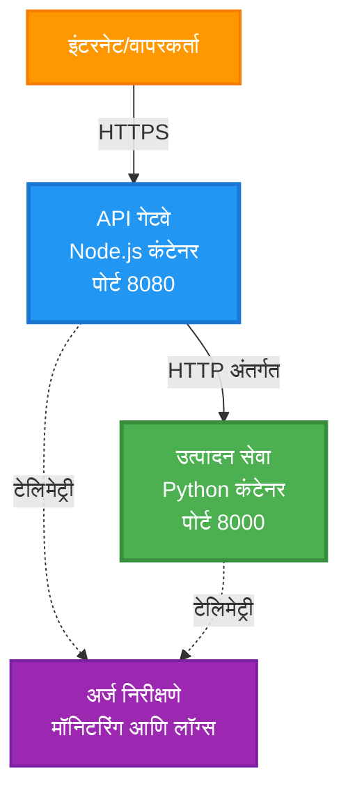
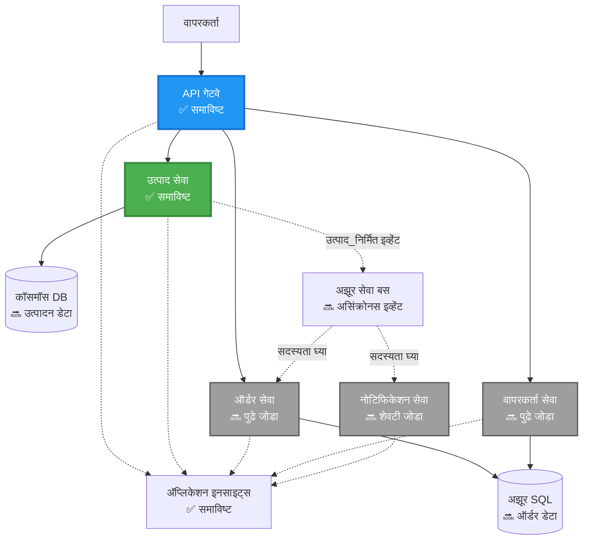
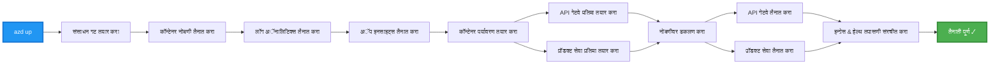
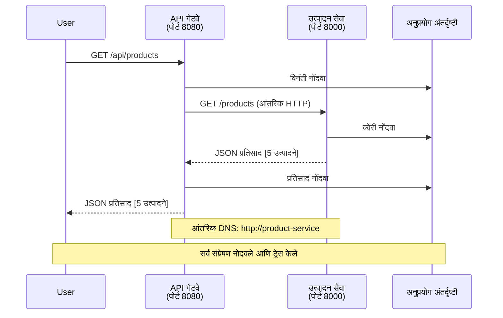

# मायक्रोसर्व्हिस आर्किटेक्चर - कंटेनर अॅप उदाहरण

⏱️ **अंदाजे वेळ**: २५-३५ मिनिटे | 💰 **अंदाजे खर्च**: ~\$५०-१००/महिना | ⭐ **कठीणाई**: प्रगत

**📚 शिकण्याचा मार्ग:**
- ← मागील: [सिंपल फ्लास्क API](../../../../examples/container-app/simple-flask-api) - सिंगल कंटेनर मूलतत्त्वे
- 🎯 **आपण येथे आहात**: मायक्रोसर्व्हिस आर्किटेक्चर (२-सेवा फाउंडेशन)
- → पुढे: [AI इंटीग्रेशन](../../../../docs/ai-foundry) - आपल्या सेवांमध्ये बुद्धिमत्ता जोडा
- 🏠 [कोर्स होम](../../README.md)

---

एक **सोप्या पण कार्यक्षम** मायक्रोसर्व्हिस आर्किटेक्चर जे Azure Container Apps वर AZD CLI वापरून डिप्लॉय केले आहे. हे उदाहरण सेवा-ते-सेवा संवाद, कंटेनर ऑर्केस्ट्रेशन, आणि प्रॅक्टिकल २-सेवा सेटअपसह मॉनिटरिंग दर्शवते.

> **📚 शिकण्याची पद्धत**: हे उदाहरण मिनिमल २-सेवा आर्किटेक्चर (API गेटवे + बॅकेंड सेवा) पासून सुरू होते जे तुम्ही प्रत्यक्ष डिप्लॉय करू शकता आणि शिकू शकता. या फाउंडेशनमध्ये पारंगत झाल्यावर, आम्ही पूर्ण मायक्रोसर्व्हिस इकोसिस्टममध्ये विस्तार करण्यासाठी मार्गदर्शन देतो.

## तुम्ही काय शिकणार आहात

हे उदाहरण पूर्ण केल्याने, तुम्ही:
- Azure Container Apps मध्ये एकाधिक कंटेनर डिप्लॉय कराल
- अंतर्गत नेटवर्किंगसह सेवा-ते-सेवा संवाद अंमलात आणाल
- एन्व्हायर्नमेंट-आधारित स्केलिंग आणि हेल्थ चेक कॉन्फिगर कराल
- Application Insights वापरून वितरित अनुप्रयोग मॉनिटर कराल
- मायक्रोसर्व्हिस डिप्लॉयमेंट पॅटर्न आणि सर्वोत्तम प्रथा समजून घ्याल
- सोप्या पासून क्लिष्ट आर्किटेक्चरपर्यंत प्रोग्रेसिव्ह विस्तार शिकाल

## आर्किटेक्चर

### टप्पा १: आपण काय तयार करत आहोत (हे उदाहरणामध्ये समाविष्ट)


```mermaid
graph TB
    Internet[इंटरनेट/वापरकर्ता]
    Gateway[API गेटवे<br/>Node.js कंटेनर<br/>पोर्ट 8080]
    Product[उत्पादन सेवा<br/>Python कंटेनर<br/>पोर्ट 8000]
    AppInsights[अर्ज निरीक्षणे<br/>मॉनिटरिंग आणि लॉग्स]
    
    Internet -->|HTTPS| Gateway
    Gateway -->|HTTP अंतर्गत| Product
    Gateway -.->|टेलिमेट्री| AppInsights
    Product -.->|टेलिमेट्री| AppInsights
    
    style Gateway fill:#2196F3,stroke:#1976D2,stroke-width:3px,color:#fff
    style Product fill:#4CAF50,stroke:#388E3C,stroke-width:3px,color:#fff
    style Internet fill:#FF9800,stroke:#F57C00,stroke-width:2px,color:#fff
    style AppInsights fill:#9C27B0,stroke:#7B1FA2,stroke-width:2px,color:#fff
```
**कंपोनंट तपशील:**

| कंपोनंट | उद्दिष्ट | प्रवेश | संसाधने |
|-----------|---------|--------|-----------|
| **API Gateway** | बाह्य विनंत्या बॅकेंड सेवांकडे मार्गदर्शित करते | सार्वजनिक (HTTPS) | 1 vCPU, 2GB RAM, 2-20 प्रतिकृती |
| **Product Service** | इन-मेमारी डेटासह उत्पादन कॅटलॉग व्यवस्थापित करते | फक्त अंतर्गत | 0.5 vCPU, 1GB RAM, 1-10 प्रतिकृती |
| **Application Insights** | केंद्रीकृत लॉगिंग आणि वितरित ट्रेसिंग | Azure पोर्टल | 1-2 GB/महिना डेटा इनजेशन |

**का सोपे सुरुवात करावे?**
- ✅ जलद डिप्लॉय आणि समजून घ्या (२५-३५ मिनिटे)
- ✅ क्लिष्टता न ठेवता मूळ मायक्रोसर्व्हिस पॅटर्न्स शिका
- ✅ काम करणारा कोड जो तुम्ही बदलू आणि प्रयोग करू शकता
- ✅ शिकण्यासाठी कमी खर्च (~\$५०-१००/महिना विरुद्ध \$३००-१४००/महिना)
- ✅ डेटाबेस आणि मेसेज क्यूशिवाय आत्मविश्वास वाढवा

**समानता**: हे वाहन चालवायला शिकण्यासारखे आहे. तुम्ही रिकाम्या पार्किंग लोटसह (२ सेवा) सुरू करता, मूलतत्त्वे शिकता, आणि नंतर शहराच्या ट्रॅफिककडे (५+ सेवा डेटाबेससह) प्रगती करता.

### टप्पा २: भविष्यातील विस्तार (संदर्भ आर्किटेक्चर)

ज्यावेळी तुम्ही २-सेवा आर्किटेक्चरमध्ये पारंगत व्हाल, तेव्हा तुम्ही विस्तार करू शकता:


```mermaid
graph TB
    User[वापरकर्ता]
    Gateway[API गेटवे<br/>✅ समाविष्ट]
    Product[उत्पाद सेवा<br/>✅ समाविष्ट]
    Order[ऑर्डर सेवा<br/>🔜 पुढे जोडा]
    UserSvc[वापरकर्ता सेवा<br/>🔜 पुढे जोडा]
    Notify[नोटिफिकेशन सेवा<br/>🔜 शेवटी जोडा]
    
    CosmosDB[(कॉसमॉस DB<br/>🔜 उत्पादन डेटा)]
    AzureSQL[(अझूर SQL<br/>🔜 ऑर्डर डेटा)]
    ServiceBus[अझूर सेवा बस<br/>🔜 असिंक्रोनस इव्हेंट]
    AppInsights[अ‍ॅप्लिकेशन इनसाइट्स<br/>✅ समाविष्ट]
    
    User --> Gateway
    Gateway --> Product
    Gateway --> Order
    Gateway --> UserSvc
    
    Product --> CosmosDB
    Order --> AzureSQL
    UserSvc --> AzureSQL
    
    Product -.->|उत्पाद_निर्मित इव्हेंट| ServiceBus
    ServiceBus -.->|सदस्यता घ्या| Notify
    ServiceBus -.->|सदस्यता घ्या| Order
    
    Gateway -.-> AppInsights
    Product -.-> AppInsights
    Order -.-> AppInsights
    UserSvc -.-> AppInsights
    Notify -.-> AppInsights
    
    style Product fill:#4CAF50,stroke:#388E3C,stroke-width:3px,color:#fff
    style Gateway fill:#2196F3,stroke:#1976D2,stroke-width:3px,color:#fff
    style Order fill:#9E9E9E,stroke:#616161,stroke-width:2px,color:#fff
    style UserSvc fill:#9E9E9E,stroke:#616161,stroke-width:2px,color:#fff
    style Notify fill:#9E9E9E,stroke:#616161,stroke-width:2px,color:#fff
```
टप्प्याटप्प्याने निर्देशांसाठी शेवटी "विस्तार गाइड" विभाग पहा.

## समाविष्ट वैशिष्ट्ये

✅ **सेवा शोध**: कंटेनरमधील स्वयंचलित DNS-आधारित शोध  
✅ **लोड बॅलन्सिंग**: रेप्लिकांसाठी बिल्ट-इन लोड बॅलन्सिंग  
✅ **ऑटो-स्केलिंग**: HTTP विनंत्यांवर आधारित स्वतंत्र स्केलिंग  
✅ **हेल्थ मॉनिटरिंग**: दोन्ही सेवांसाठी लाइव्हनेस आणि रेडीनेस प्रोब्स  
✅ **वितरित लॉगिंग**: Application Insights सह केंद्रीकृत लॉगिंग  
✅ **अंतर्गत नेटवर्किंग**: सुरक्षित सेवा-सेवा संवाद  
✅ **कंटेनर ऑर्केस्ट्रेशन**: स्वयंचलित डिप्लॉयमेंट आणि स्केलिंग  
✅ **झीरो-डाउनटाइम अपडेट्स**: रिव्हिजन व्यवस्थापनासह रोलिंग अपडेट्स  

## आवश्यकताः

### आवश्यक साधने

सुरू करण्यापूर्वी, हे साधने इन्स्टॉल आहेत याची खात्री करा:

1. **[Azure Developer CLI (azd)](https://learn.microsoft.com/azure/developer/azure-developer-cli/install-azd)** (संस्करण १.०.० किंवा त्याहून अधिक)
   ```bash
   azd version
   # अपेक्षित आउटपुट: azd आवृत्ती 1.0.0 किंवा उच्चतर
   ```

2. **[Azure CLI](https://learn.microsoft.com/cli/azure/install-azure-cli)** (संस्करण २.५०.० किंवा त्याहून अधिक)
   ```bash
   az --version
   # अपेक्षित आउटपुट: azure-cli 2.50.0 किंवा त्याहून अधिक
   ```

3. **[Docker](https://www.docker.com/get-started)** (स्थानिक विकास/चाचणीसाठी - ऐच्छिक)
   ```bash
   docker --version
   # अपेक्षित आउटपुट: डॉकर आवृत्ती 20.10 किंवा त्याहून अधिक
   ```

### तुमची तयारी तपासा

तयार असल्याची पुष्टी करण्यासाठी खालील आदेश चालवा:

```bash
# Azure Developer CLI तपासा
azd version
# ✅ अपेक्षित: azd आवृत्ती 1.0.0 किंवा त्यापेक्षा वर

# Azure CLI तपासा
az --version
# ✅ अपेक्षित: azure-cli 2.50.0 किंवा त्यापेक्षा वर

# Docker तपासा (ऐच्छिक)
docker --version
# ✅ अपेक्षित: Docker आवृत्ती 20.10 किंवा त्यापेक्षा वर
```

**यशस्वी निकष**: सर्व आदेशांनी किमान आवृत्ती किंवा त्याहून अधिकची आवृत्ती दर्शवावी.

### Azure आवश्यकताः

- सक्रिय **Azure सदस्यता** ([मुफ्त खाते तयार करा](https://azure.microsoft.com/free/))
- सदस्यतेत संसाधने तयार करण्याची परवानगी
- सदस्यता किंवा संसाधन समूहावर **Contributor** भूमिका

### ज्ञान आवश्यकताः

हे एक **प्रगत स्तराचे** उदाहरण आहे. तुम्ही असावे:
- [सिंपल फ्लास्क API उदाहरण](../../../../examples/container-app/simple-flask-api) पूर्ण केलेले
- मायक्रोसर्व्हिस आर्किटेक्चरची मूलभूत माहिती
- REST API आणि HTTP ची ओळख
- कंटेनर संकल्पनांचे समज

**कंटेनर अॅप्समध्ये नवीन?** सुरुवातीला [सिंपल फ्लास्क API उदाहरण](../../../../examples/container-app/simple-flask-api) वापरून मूलतत्त्वे शिका.

## जलद प्रारंभ (टप्प्याटप्प्याने)

### टप्पा १: क्लोन करा आणि नेव्हिगेट करा

```bash
git clone https://github.com/microsoft/AZD-for-beginners.git
cd AZD-for-beginners/examples/microservices
```

**✓ यशस्वी तपासणी**: खालील `azure.yaml` बघा:
```bash
ls
# अपेक्षित: README.md, azure.yaml, infra/, src/
```

### टप्पा २: Azure सह प्रमाणीकृत व्हा

```bash
azd auth login
```

हे Azure प्रमाणीकृतीसाठी तुमचा ब्राउझर उघडेल. तुमचे Azure क्रेडेंशियल वापरून साइन इन करा.

**✓ यशस्वी तपासणी**: तुम्हाला खाली दिसेल:
```
Logged in to Azure.
```

### टप्पा ३: एन्व्हायर्नमेंट प्रारंभ करा

```bash
azd init
```

**प्रॉम्प्ट्स जे तुम्हाला दिसतील**:
- **एन्व्हायर्नमेंट नाव**: छोटं नाव द्या (उदा., `microservices-dev`)
- **Azure सदस्यता**: तुमची सदस्यता निवडा
- **Azure स्थान**: एखादे क्षेत्र निवडा (उदा., `eastus`, `westeurope`)

**✓ यशस्वी तपासणी**: तुम्हाला हे दिसेल:
```
SUCCESS: New project initialized!
```

### टप्पा ४: इन्फ्रास्ट्रक्चर आणि सेवा डिप्लॉय करा

```bash
azd up
```

**काय होते** (८-१२ मिनिटे लागतात):


```mermaid
graph LR
    A[azd up] --> B[संसाधन गट तयार करा]
    B --> C[कॉन्टेनर नोंदणी तैनात करा]
    C --> D[लॉग अॅनालिटिक्स तैनात करा]
    D --> E[अॅप इनसाइट्स तैनात करा]
    E --> F[कॉन्टेनर पर्यावरण तयार करा]
    F --> G[API गेटवे प्रतिमा तयार करा]
    F --> H[प्रॉडक्ट सेवा प्रतिमा तयार करा]
    G --> I[नोंदणीवर ढकलण करा]
    H --> I
    I --> J[API गेटवे तैनात करा]
    I --> K[प्रॉडक्ट सेवा तैनात करा]
    J --> L[इन्ग्रेस & हेल्थ तपासणी संरचीत करा]
    K --> L
    L --> M[तैनाती पूर्ण ✓]
    
    style A fill:#2196F3,stroke:#1976D2,stroke-width:3px,color:#fff
    style M fill:#4CAF50,stroke:#388E3C,stroke-width:3px,color:#fff
```
**✓ यशस्वी तपासणी**: तुम्हाला हे दिसेल:
```
SUCCESS: Your application was deployed to Azure in X minutes Y seconds.
Endpoint: https://api-gateway-<unique-id>.azurecontainerapps.io
```

**⏱️ वेळ**: ८-१२ मिनिटे

### टप्पा ५: डिप्लॉयमेंट चाचणी करा

```bash
# गेटवे एन्डपॉइंट मिळवा
GATEWAY_URL=$(azd env get-values | grep API_GATEWAY_URL | cut -d '=' -f2 | tr -d '"')

# API गेटवे आरोग्याची चाचणी करा
curl $GATEWAY_URL/health
```

**✅ अपेक्षित आउटपुट:**
```json
{
  "status": "healthy",
  "service": "api-gateway",
  "timestamp": "2025-11-19T10:30:00Z"
}
```

**गेटवे मधून प्रॉडक्ट सेवा चाचणी:**
```bash
# उत्पादने यादी करा
curl $GATEWAY_URL/api/products
```

**✅ अपेक्षित आउटपुट:**
```json
[
  {"id":1,"name":"Laptop","price":999.99,"stock":50},
  {"id":2,"name":"Mouse","price":29.99,"stock":200},
  {"id":3,"name":"Keyboard","price":79.99,"stock":150}
]
```

**✓ यशस्वी तपासणी**: दोन्ही एंडपॉइंट्स त्रुटीशिवाय JSON डेटा परत करतात.

---

**🎉 अभिनंदन!** तुम्ही Azure वर मायक्रोसर्व्हिस आर्किटेक्चर डिप्लॉय केले आहे!

## प्रोजेक्ट स्ट्रक्चर

सर्व इंप्लिमेंटेशन फाइल्स समाविष्ट आहेत—हे पूर्ण, कार्यरत उदाहरण आहे:

```
microservices/
│
├── README.md                         # This file
├── azure.yaml                        # AZD configuration
├── .gitignore                        # Git ignore patterns
│
├── infra/                           # Infrastructure as Code (Bicep)
│   ├── main.bicep                   # Main orchestration
│   ├── abbreviations.json           # Naming conventions
│   ├── core/                        # Shared infrastructure
│   │   ├── container-apps-environment.bicep  # Container environment + registry
│   │   └── monitor.bicep            # Application Insights + Log Analytics
│   └── app/                         # Service definitions
│       ├── api-gateway.bicep        # API Gateway container app
│       └── product-service.bicep    # Product Service container app
│
└── src/                             # Application source code
    ├── api-gateway/                 # Node.js API Gateway
    │   ├── app.js                   # Express server with routing
    │   ├── package.json             # Node dependencies
    │   └── Dockerfile               # Container definition
    └── product-service/             # Python Product Service
        ├── main.py                  # Flask API with product data
        ├── requirements.txt         # Python dependencies
        └── Dockerfile               # Container definition
```

**प्रत्येक कंपोनंट काय करतं:**

**इन्फ्रास्ट्रक्चर (infra/):**
- `main.bicep`: सर्व Azure संसाधने आणि त्यांचे अवलंबित्वे व्यवस्थापित करते
- `core/container-apps-environment.bicep`: कंटेनर अॅप्स एन्व्हायर्नमेंट आणि Azure कंटेनर रजिस्ट्री तयार करते
- `core/monitor.bicep`: वितरित लॉगिंगसाठी Application Insights सेटअप करते
- `app/*.bicep`: स्वतंत्र कंटेनर अॅप डिफिनिशन्स त्यांचा स्केलिंग आणि हेल्थ चेकसह

**API Gateway (src/api-gateway/):**
- बॅकेंड सेवांकडे विनंत्या मार्गदर्शित करणारी सार्वजनिक सेवा
- लॉगिंग, त्रुटी हाताळणी, आणि विनंती पाठवणं अंमलात आणते
- सेवा-सेवा HTTP संवाद दाखवते

**Product Service (src/product-service/):**
- उत्पादन कॅटलॉगसह अंतर्गत सेवा (सोपेसाठी इन-मेमारी)
- REST API हेल्थ चेकसह
- बॅकेंड मायक्रोसर्व्हिस पॅटर्नचे उदाहरण

## सेवा आढावा

### API Gateway (Node.js/Express)

**पोर्ट**: ८०८०  
**प्रवेश**: सार्वजनिक (बाह्य प्रवेश)  
**उद्दिष्ट**: येणाऱ्या विनंत्यांना योग्य बॅकेंड सेवांकडे मार्गदर्शित करणे  

**एंडपॉइंट्स**:
- `GET /` - सेवा माहिती
- `GET /health` - हेल्थ चेक एंडपॉइंट
- `GET /api/products` - प्रॉडक्ट सेवेकडे अग्रेषित करा (सर्वांची यादी)
- `GET /api/products/:id` - प्रॉडक्ट सेवेकडे अग्रेषित करा (आयडी द्वारे)

**महत्वाची वैशिष्ट्ये**:
- विनंती मार्गदर्शन axios सह
- केंद्रीकृत लॉगिंग
- त्रुटी हाताळणी आणि टाइमआउट व्यवस्थापन
- पर्यावरण चरांद्वारे सेवा शोध
- Application Insights एकत्रीकरण

**कोड हायलाइट** (`src/api-gateway/app.js`):
```javascript
// अंतर्गत सेवा संवाद
app.get('/api/products', async (req, res) => {
  const response = await axios.get(`${PRODUCT_SERVICE_URL}/products`, {
    timeout: 5000
  });
  res.json(response.data);
});
```

### Product Service (Python/Flask)

**पोर्ट**: ८०००  
**प्रवेश**: फक्त अंतर्गत (बाह्य प्रवेश नाही)  
**उद्दिष्ट**: इन-मेमारी डेटासह उत्पादन कॅटलॉग व्यवस्थापित करणे  

**एंडपॉइंट्स**:
- `GET /` - सेवा माहिती
- `GET /health` - हेल्थ चेक एंडपॉइंट
- `GET /products` - सर्व उत्पादनांची यादी
- `GET /products/<id>` - आयडी द्वारे उत्पादन मिळवा

**महत्वाची वैशिष्ट्ये**:
- Flask सह RESTful API
- इन-मेमारी उत्पादन स्टोअर (सोपं, डेटाबेसची आवश्यकता नाही)
- हेल्थ मॉनिटरिंग प्रोब्ससह
- संरचित लॉगिंग
- Application Insights एकत्रीकरण

**डेटा मॉडेल**:
```python
{
  "id": 1,
  "name": "Laptop",
  "description": "High-performance laptop",
  "price": 999.99,
  "stock": 50
}
```

**का फक्त अंतर्गत?**
प्रॉडक्ट सेवा सार्वजनिकपणे उघडलेली नाही. सर्व विनंत्या API गेटवे मार्गे कराव्यात, जे प्रदान करते:
- सुरक्षा: नियंत्रित प्रवेश बिंदू
- लवचीकता: क्लायंट्सवर परिणाम न करता बॅकेंड बदलण्याची मुभा
- मॉनिटरिंग: केंद्रीकृत विनंती लॉगिंग

## सेवा संवाद समजून घेणे

### सेवा कशाप्रकारे संवाद करतात


```mermaid
sequenceDiagram
    participant User
    participant Gateway as API गेटवे<br/>(पोर्ट 8080)
    participant Product as उत्पादन सेवा<br/>(पोर्ट 8000)
    participant AI as अनुप्रयोग अंतर्दृष्टी
    
    User->>Gateway: GET /api/products
    Gateway->>AI: विनंती नोंदवा
    Gateway->>Product: GET /products (आंतरिक HTTP)
    Product->>AI: क्वेरी नोंदवा
    Product-->>Gateway: JSON प्रतिसाद [5 उत्पादने]
    Gateway->>AI: प्रतिसाद नोंदवा
    Gateway-->>User: JSON प्रतिसाद [5 उत्पादने]
    
    Note over Gateway,Product: आंतरिक DNS: http://product-service
    Note over User,AI: सर्व संप्रेषण नोंदवले आणि ट्रेस केले
```
या उदाहरणात, API Gateway Product Service शी **आंतरिक HTTP कॉल्स** वापरून संवाद साधते:

```javascript
// API गेटवे (src/api-gateway/app.js)
const PRODUCT_SERVICE_URL = process.env.PRODUCT_SERVICE_URL;

// आंतरिक HTTP विनंती करा
const response = await axios.get(`${PRODUCT_SERVICE_URL}/products`);
```

**महत्त्वाची मुद्दे**:

1. **DNS-आधारित शोध**: कंटेनर अॅप्स स्वयंचलितपणे अंतर्गत सेवांसाठी DNS प्रदान करतात
   - प्रॉडक्ट सेवा FQDN: `product-service.internal.<environment>.azurecontainerapps.io`
   - सोप्या भाषेत: `http://product-service` (कंटेनर अॅप्स ते विभाजन करते)

2. **कोणतीही सार्वजनिक उघडकी नाही**: प्रॉडक्ट सेवेवर बीसेपमध्ये `external: false` आहे
   - फक्त कंटेनर अॅप्स वातावरणातील उपलब्ध
   - इंटरनेटवरून पोहोचता येत नाही

3. **एन्व्हायर्नमेंट व्हेरिएबल्स**: सेवा URLs डिप्लॉयमेंट वेळी इंजेक्ट केले जातात
   - बीसेप गेटवेवर अंतर्गत FQDN पास करतो
   - अ‍ॅप्लिकेशन कोडमध्ये हार्डकोडेड URLs नाहीत

**समानता**: हे ऑफिसच्या खोल्यांसारखं समजा. API Gateway ही रिसेप्शन डेस्क आहे (सार्वजनिक), आणि प्रॉडक्ट सेवा अंतर्गत ऑफिस खोली आहे. प्रत्येकाला रिसेप्शनमधूनच प्रवेश मिळतो.

## डिप्लॉयमेंट पर्याय

### पूर्ण डिप्लॉयमेंट (शिफारसीय)

```bash
# पायाभूत सुविधा आणि दोन्ही सेवा तैनात करा
azd up
```

यामुळे डिप्लॉय होईल:
1. कंटेनर अॅप्स वातावरण
2. Application Insights
3. कंटेनर रजिस्ट्री
4. API Gateway कंटेनर
5. Product Service कंटेनर

**वेळ**: ८-१२ मिनिटे

### स्वतंत्र सेवा डिप्लॉय करा

```bash
# फक्त एक सेवा तैनात करा (प्रारंभिक azd up नंतर)
azd deploy api-gateway

# किंवा उत्पादन सेवा तैनात करा
azd deploy product-service
```

**वापर केस**: जेव्हा आपण एखाद्या सेवेतील कोड अपडेट केलेला असेल आणि फक्त तीच सेवा पुन्हा डिप्लॉय करायची असेल.

### कॉन्फिगरेशन अपडेट करा

```bash
# स्केलिंग पॅरामिटर्स बदला
azd env set GATEWAY_MAX_REPLICAS 30

# नवीन संरचनेसह पुन्हा तैनात करा
azd up
```

## कॉन्फिगरेशन

### स्केलिंग कॉन्फिगरेशन

दोन्ही सेवा त्यांच्या बीसेप फाइल्समध्ये HTTP-आधारित ऑटोस्केलिंगसाठी कॉन्फिगर आहेत:

**API Gateway**:
- किमान प्रतिकृती: 2 (उपलब्धतेसाठी किमान २)
- कमाल प्रतिकृती: 20
- स्केल ट्रिगर: प्रती प्रतिकृती 50 समकालीन विनंत्या

**Product Service**:
- किमान प्रतिकृती: 1 (गरज पडल्यास शून्यापर्यंत स्केल होऊ शकते)
- कमाल प्रतिकृती: 10
- स्केल ट्रिगर: प्रती प्रतिकृती 100 समकालीन विनंत्या

**स्केलिंग सानुकूल करा** (`infra/app/*.bicep` मध्ये):
```bicep
scale: {
  minReplicas: 1
  maxReplicas: 10
  rules: [
    {
      name: 'http-scale-rule'
      http: {
        metadata: {
          concurrentRequests: '100'  // Adjust this
        }
      }
    }
  ]
}
```

### संसाधन वाटप

**API Gateway**:
- CPU: 1.0 vCPU
- मेमरी: 2 GiB
- कारण: सर्व बाह्य ट्रॅफिक हाताळतो

**Product Service**:
- CPU: 0.5 vCPU
- मेमरी: 1 GiB
- कारण: हलक्या वजनाचा इन-मेमारी ऑपरेशन्स

### हेल्थ चेक्स

दोन्ही सेवांमध्ये लाइव्हनेस आणि रेडीनेस प्रोब्स समाविष्ट:

```bicep
probes: [
  {
    type: 'Liveness'
    httpGet: {
      path: '/health'
      port: 8080
    }
    initialDelaySeconds: 10
    periodSeconds: 30
  }
  {
    type: 'Readiness'
    httpGet: {
      path: '/health'
      port: 8080
    }
    initialDelaySeconds: 5
    periodSeconds: 10
  }
]
```

**याचा अर्थ काय आहे**:
- **लाइव्हनेस**: जर हेल्थ चेक फेल झाला तर कंटेनर अॅप्स कंटेनर पुन्हा सुरू करतो
- **रेडीनेस**: तयार नसल्यास कंटेनर अॅप्स त्या प्रतिकृतीकडे ट्रॅफिक पाठवणे थांबवतो

## मॉनिटरिंग आणि निरीक्षण

### सेवा लॉग्स पहा

```bash
# azd monitor वापरून लॉग पाहा
azd monitor --logs

# किंवा विशिष्ट कंटेनर अॅपसाठी Azure CLI वापरा:
# API गेटवे कडून लॉग प्रवाहित करा
az containerapp logs show --name api-gateway --resource-group $RG_NAME --follow

# अलीकडील उत्पादन सेवा लॉग पाहा
az containerapp logs show --name product-service --resource-group $RG_NAME --tail 100
```

**अपेक्षित आउटपुट**:
```
[api-gateway] API Gateway listening on port 8080
[api-gateway] Product Service URL: http://product-service
[api-gateway] GET /api/products 200 - 45ms
[product-service] Retrieved 5 products
```

### Application Insights क्वेरीज

Azure पोर्टलमध्ये Application Insights मध्ये प्रवेश करा आणि नंतर हे क्वेरीज चालवा:

**हळु विनंत्या शोधा**:
```kusto
requests
| where timestamp > ago(1h)
| where duration > 1000  // Requests taking >1 second
| summarize count() by name, cloud_RoleName
| order by count_ desc
```

**सेवा-ते-सेवा कॉल्स ट्रॅक करा**:
```kusto
dependencies
| where timestamp > ago(1h)
| where type == "Http"
| project timestamp, name, target, duration, success
| order by timestamp desc
```

**सेवेनुसार त्रुटी दर**:
```kusto
exceptions
| where timestamp > ago(24h)
| summarize errorCount = count() by cloud_RoleName, type
| order by errorCount desc
```

**वेळोवेळी विनंतीचा व्हॉल्यूम**:
```kusto
requests
| where timestamp > ago(1h)
| summarize requestCount = count() by bin(timestamp, 5m), cloud_RoleName
| render timechart
```

### मॉनिटरिंग डॅशबोर्डमध्ये प्रवेश

```bash
# अनुप्रयोग अंतर्दृष्टी तपशील मिळवा
azd env get-values | grep APPLICATIONINSIGHTS

# Azure पोर्टल मॉनिटरिंग उघडा
az monitor app-insights component show \
  --app $(azd env get-values | grep APPLICATIONINSIGHTS_CONNECTION_STRING | cut -d '=' -f2) \
  --resource-group $(azd env get-values | grep AZURE_RESOURCE_GROUP | cut -d '=' -f2) \
  --query "appId" -o tsv
```

### लाइव्ह मेट्रिक्स

1. Azure पोर्टलमध्ये Application Insights पर्यंत जा
2. "Live Metrics" क्लिक करा
3. रिअल-टाइम विनंत्या, अपयशी आणि कामगिरी बघा
4. चाचणीसाठी खालील चालवा: `curl $(azd env get-values | grep API_GATEWAY_URL | cut -d '=' -f2 | tr -d '"')/api/products`

## व्यावहारिक सराव

### सराव १: नवीन प्रॉडक्ट एंडपॉइंट जोडा ⭐ (सोपं)

**उद्दिष्ट**: नवीन उत्पादने तयार करण्यासाठी POST एंडपॉइंट जोडा

**सुरुवातीचा बिंदू**: `src/product-service/main.py`

**पावले**:

1. `main.py` मधील `get_product` फंक्शननंतर हा एंडपॉइंट जोडा:

```python
@app.route('/products', methods=['POST'])
def create_product():
    """Create a new product"""
    data = request.get_json()
    
    # आवश्यक फील्ड्सची सत्यता तपासा
    if not data or 'name' not in data or 'price' not in data:
        return jsonify({'error': 'Missing required fields: name, price'}), 400
    
    new_id = max(p['id'] for p in products) + 1
    new_product = {
        'id': new_id,
        'name': data['name'],
        'description': data.get('description', ''),
        'price': float(data['price']),
        'stock': int(data.get('stock', 0))
    }
    products.append(new_product)
    logger.info(f"Created product {new_id}")
    return jsonify(new_product), 201
```

2. API Gateway (`src/api-gateway/app.js`) मध्ये POST रूट जोडा:

```javascript
// GET /api/products मार्गानंतर हे जोडा
app.post('/api/products', async (req, res) => {
  try {
    console.log(`Forwarding POST request to ${PRODUCT_SERVICE_URL}/products`);
    const response = await axios.post(`${PRODUCT_SERVICE_URL}/products`, req.body, {
      timeout: 5000
    });
    res.status(201).json(response.data);
  } catch (error) {
    console.error('Error calling product service:', error.message);
    res.status(503).json({
      error: 'Product service unavailable',
      message: error.message
    });
  }
});
```

3. दोन्ही सेवांना पुन्हा तैनात करा:

```bash
azd deploy product-service
azd deploy api-gateway
```

4. नवीन एंडपॉइंटची चाचणी करा:

```bash
GATEWAY_URL=$(azd env get-values | grep API_GATEWAY_URL | cut -d '=' -f2 | tr -d '"')

# नवीन उत्पादन तयार करा
curl -X POST $GATEWAY_URL/api/products \
  -H "Content-Type: application/json" \
  -d '{"name":"USB Cable","price":9.99,"stock":500}'
```

**✅ अपेक्षित आउटपुट:**
```json
{"id":6,"name":"USB Cable","description":"","price":9.99,"stock":500}
```

5. सूचीमध्ये दिसते का ते तपासा:

```bash
curl $GATEWAY_URL/api/products
# आता नवीन USB केबलसह 6 उत्पादने दाखवावी
```

**यशाची निकषे**:
- ✅ POST विनंती HTTP 201 परत करते
- ✅ नवीन उत्पादन GET /api/products सूचीमध्ये दिसते
- ✅ उत्पादनाला ऑटो-इन्क्रीमेंटेड ID आहे

**वेळ**: 10-15 मिनिटे

---

### व्यायाम 2: ऑटोस्केलिंग नियम सुधारित करा ⭐⭐ (मध्यम)

**उद्दिष्ट**: उत्पादन सेवा अधिक जबरदस्त स्केल करण्यासाठी बदला

**प्रारंभ बिंदू**: `infra/app/product-service.bicep`

**टप्पे**:

1. `infra/app/product-service.bicep` उघडा आणि `scale` ब्लॉक शोधा (सुमारे ओळ 95)

2. बदल करा:
```bicep
scale: {
  minReplicas: 1
  maxReplicas: 10
  rules: [
    {
      name: 'http-scale-rule'
      http: {
        metadata: {
          concurrentRequests: '100'  // OLD
        }
      }
    }
  ]
}
```

मध्ये:
```bicep
scale: {
  minReplicas: 2  // Always have 2 running
  maxReplicas: 20  // Allow more scaling
  rules: [
    {
      name: 'http-scale-rule'
      http: {
        metadata: {
          concurrentRequests: '20'  // Scale at lower threshold
        }
      }
    }
  ]
}
```

3. पायाभूत सुविधा पुन्हा तैनात करा:

```bash
azd up
```

4. नवीन स्केलिंग कॉन्फिगरेशन तपासा:

```bash
az containerapp show \
  --name $(azd env get-values | grep PRODUCT_SERVICE | head -1 | cut -d '/' -f5) \
  --resource-group $(azd env get-values | grep AZURE_RESOURCE_GROUP | cut -d '=' -f2 | tr -d '"') \
  --query "properties.template.scale" -o json
```

**✅ अपेक्षित आउटपुट:**
```json
{
  "minReplicas": 2,
  "maxReplicas": 20,
  "rules": [...]
}
```

5. लोडसह ऑटोस्केलिंगची चाचणी करा:

```bash
# समांतर विनंत्या तयार करा
for i in {1..500}; do curl $GATEWAY_URL/api/products & done

# Azure CLI वापरून स्केलिंग कसे होते ते पहा
az containerapp logs show --name product-service --resource-group $RG_NAME --follow
# शोधा: कंटेनर अॅप्स स्केलिंग इव्हेंट्स
```

**यशाची निकषे**:
- ✅ उत्पादन सेवा नेहमी किमान 2 प्रतिकृती चालवते
- ✅ लोडवर, 2 पेक्षा जास्त प्रतिकृतींवर स्केल करते
- ✅ Azure पोर्टल नवीन स्केलिंग नियम दाखवते

**वेळ**: 15-20 मिनिटे

---

### व्यायाम 3: कस्टम मॉनिटरिंग क्वेरी जोडा ⭐⭐ (मध्यम)

**उद्दिष्ट**: उत्पादन API कार्यक्षमता ट्रॅक करण्यासाठी कस्टम Application Insights क्वेरी तयार करा

**टप्पे**:

1. Azure पोर्टलमध्ये Application Insights वर जा:
   - Azure पोर्टलमध्ये जा
   - आपला रिसोर्स ग्रुप शोधा (rg-microservices-*)
   - Application Insights रिसोर्स क्लिक करा

2. डाव्या मेनूमध्ये "Logs" क्लिक करा

3. ही क्वेरी तयार करा:

```kusto
requests
| where timestamp > ago(1h)
| where name contains "products"
| summarize 
    RequestCount = count(),
    AvgDuration = avg(duration),
    P95Duration = percentile(duration, 95),
    SuccessRate = 100.0 * countif(success == true) / count()
  by bin(timestamp, 5m)
| render timechart
```

4. क्वेरी चालविण्यासाठी "Run" क्लिक करा

5. क्वेरी जतन करा:
   - "Save" क्लिक करा
   - नाव: "Product API Performance"
   - वर्ग: "Performance"

6. चाचणी ट्रॅफिक निर्माण करा:

```bash
for i in {1..100}; do curl $GATEWAY_URL/api/products; sleep 1; done
```

7. डेटा पाहण्यासाठी क्वेरी रिफ्रेश करा

**✅ अपेक्षित आउटपुट:**
- विनंतीं संख्या वेळेनुसार दर्शवणारा चार्ट
- सरासरी कालावधी < 500ms
- यशस्वी दर = 100%
- 5 मिनिटांच्या वेळ बिन्स

**यश निकषे**:
- ✅ क्वेरी 100+ विनंत्या दर्शवते
- ✅ यश दर 100% आहे
- ✅ सरासरी कालावधी < 500ms
- ✅ चार्ट 5 मिनिटे वेळ बिन्स दर्शवते

**शिकण्याचा फायदा**: कस्टम क्वेरीजसह सेवा कार्यक्षमता कशी मॉनिटर करावी हे समजून घ्या

**वेळ**: 10-15 मिनिटे

---

### व्यायाम 4: रीट्राय लॉजिक राबवा ⭐⭐⭐ (प्रगत)

**उद्दिष्ट**: उत्पादक सेवा तात्पुरती अनुपलब्ध असताना API गेटवे मध्ये रीट्राय लॉजिक जोडा

**प्रारंभ बिंदू**: `src/api-gateway/app.js`

**टप्पे**:

1. रीट्राय लायब्ररी इंस्टॉल करा:

```bash
cd src/api-gateway
npm install axios-retry --save
cd ../..
```

2. `src/api-gateway/app.js` अपडेट करा (axios आयातीनंतर जोडा):

```javascript
const axiosRetry = require('axios-retry');

// पुन्हा प्रयत्न करण्याचा तर्क सानुकूलित करा
axiosRetry(axios, {
  retries: 3,
  retryDelay: (retryCount) => {
    return retryCount * 1000; // 1से, 2से, 3से
  },
  retryCondition: (error) => {
    // नेटवर्क त्रुटी किंवा 5xx प्रतिसादांवर पुन्हा प्रयत्न करा
    return axiosRetry.isNetworkOrIdempotentRequestError(error) ||
           (error.response && error.response.status >= 500);
  }
});

console.log('Retry logic configured: 3 retries with exponential backoff');
```

3. API गेटवे पुन्हा तैनात करा:

```bash
azd deploy api-gateway
```

4. सेवा अयशस्वी होण्याचा अनुकरण करून रीट्राय वागणूक तपासा:

```bash
# उत्पादन सेवा 0 वर स्केल करा (अयशस्वीपणा अनुकरण करा)
az containerapp update \
  --name $(azd env get-values | grep PRODUCT_SERVICE | head -1 | cut -d '/' -f5) \
  --resource-group $(azd env get-values | grep AZURE_RESOURCE_GROUP | cut -d '=' -f2 | tr -d '"') \
  --min-replicas 0 \
  --max-replicas 0

# उत्पादनांमध्ये प्रवेश करण्याचा प्रयत्न करा (3 वेळा पुन्हा प्रयत्न करेल)
time curl -v $GATEWAY_URL/api/products
# निरीक्षण करा: प्रतिसादाला सुमारे 6 सेकंद लागतो (1s + 2s + 3s पुन्हा प्रयत्न)

# उत्पादन सेवा पुनर्संचयित करा
az containerapp update \
  --name $(azd env get-values | grep PRODUCT_SERVICE | head -1 | cut -d '/' -f5) \
  --resource-group $(azd env get-values | grep AZURE_RESOURCE_GROUP | cut -d '=' -f2 | tr -d '"') \
  --min-replicas 1 \
  --max-replicas 10
```

5. रीट्राय लॉग पहा:

```bash
az containerapp logs show --name api-gateway --resource-group $RG_NAME --tail 50
# शोधा: पुन्हा प्रयत्न करण्याच्या संदेशांसाठी
```

**✅ अपेक्षित वागणूक:**
- विनंत्या अयशस्वी होण्यापूर्वी 3 वेळा रीट्राय होतात
- प्रत्येक रीट्रायसाठी अधिक वेळ थांबविला जातो (1s, 2s, 3s)
- सेवा पुन्हा चालू झाल्यानंतर विनंत्या यशस्वी होतात
- लॉगमध्ये रीट्राय प्रयत्न दिसतात

**यश निकषे**:
- ✅ विनंत्या अयशस्वी होण्यापूर्वी 3 रीट्राय होतात
- ✅ प्रत्येक रीट्राय अधिक वेळ थांबवते (घातांक वाढ)
- ✅ सेवा पुनःसंचयानंतर यशस्वी विनंत्या
- ✅ लॉगमध्ये रीट्राय प्रयत्न दिसतात

**शिकण्याचा फायदा**: मायक्रोसर्व्हिसेसमधील टिकाऊपणाचे नमुने समजून घ्या (सर्किट ब्रेकर्स, रीट्राय, टाइमआउट)

**वेळ**: 20-25 मिनिटे

---

## ज्ञान तपासणी

हा उदाहरण पूर्ण केल्यानंतर, आपले समज तपासा:

### 1. सेवा संवाद ✓

आपले ज्ञान तपासा:
- [ ] API गेटवे कसा उत्पादक सेवा शोधतो? (DNS-आधारित सेवा शोध)
- [ ] उत्पादक सेवा डाऊन असल्यास काय होते? (गेटवे 503 त्रुटी परत करतो)
- [ ] तुम्ही तिसरी सेवा कशी जोडाल? (नवीन बायसेप फाइल तयार करा, main.bicep मध्ये जोडा, src फोल्डर तयार करा)

**प्रायोगिक तपासणी:**
```bash
# सेवा अयशस्वी असल्याची नक्कल करा
az containerapp update --name <product-service-name> --min-replicas 0 --max-replicas 0
curl $GATEWAY_URL/api/products
# ✅ अपेक्षित: 503 सेवा उपलब्ध नाही

# सेवा पुन्हा स्थापित करा
az containerapp update --name <product-service-name> --min-replicas 1 --max-replicas 10
```

### 2. मॉनिटरिंग आणि निरीक्षण ✓

आपले ज्ञान तपासा:
- [ ] वितरीत लॉग कुठे पाहता? (Azure पोर्टलमधील Application Insights)
- [ ] हळू विनंत्या कशा ट्रॅक करता? (Kusto क्वेरी: `requests | where duration > 1000`)
- [ ] कोणती सेवा त्रुटी निर्माण करते हे कसे ओळखाल? (लॉगमधील `cloud_RoleName` क्षेत्र तपासा)

**प्रायोगिक तपासणी:**
```bash
# हळू विनंती सिम्युलेशन तयार करा
curl "$GATEWAY_URL/api/products?delay=2000"

# हळू विनंत्यांसाठी Application Insights मध्ये क्वेरी करा
# Azure पोर्टल → Application Insights → Logs या ठिकाणी जा
# चालवा: requests | where duration > 1000 | project timestamp, name, duration, cloud_RoleName
```

### 3. स्केलिंग आणि कार्यक्षमता ✓

आपले ज्ञान तपासा:
- [ ] ऑटोस्केलिंग काय सुरू करते? (HTTP समकालिक विनंती नियम: गेटवे साठी 50, उत्पादनासाठी 100)
- [ ] सध्या किती प्रतिकृती चालू आहेत? (`az containerapp revision list` वापरून तपासा)
- [ ] उत्पादन सेवा 5 प्रतिकृती कशी स्केल करतील? (बायसेपमध्ये minReplicas अपडेट करा)

**प्रायोगिक तपासणी:**
```bash
# ऑटोस्केलिंग तपासण्यासाठी लोड तयार करा
for i in {1..1000}; do curl $GATEWAY_URL/api/products & done

# Azure CLI वापरून रेप्लिका वाढ पाहा
az containerapp logs show --name api-gateway --resource-group $RG_NAME --follow
# ✅ अपेक्षित: लॉगमध्ये स्केलिंग इव्हेंट्स पहा
```

**यशाची निकषे**: आपण सर्व प्रश्नांची उत्तरे देऊ शकता आणि प्रायोगिक कमांड्ससह तपासणी करू शकता.

---

## खर्च विश्लेषण

### अंदाजे मासिक खर्च (या 2-सेवा उदाहरणासाठी)

| स्रोत | कॉन्फिगरेशन | अंदाजे खर्च |
|----------|--------------|----------------|
| API गेटवे | 2-20 प्रतिकृती, 1 vCPU, 2GB RAM | $30-150 |
| उत्पादन सेवा | 1-10 प्रतिकृती, 0.5 vCPU, 1GB RAM | $15-75 |
| कंटेनर रजिस्ट्री | बेसिक स्तर | $5 |
| Application Insights | 1-2 GB/मासा | $5-10 |
| लॉग अ‍ॅनालिटिक्स | 1 GB/मासा | $3 |
| **एकूण** | | **$58-243/मासा** |

### वापरानुसार खर्चाचे विभाजन

**कमी ट्रॅफिक** (चाचणी/शिका): ~ $60/मासा
- API गेटवे: 2 प्रतिकृती × 24/7 = $30
- उत्पादन सेवा: 1 प्रतिकृती × 24/7 = $15
- मॉनिटरिंग + रजिस्ट्री = $13

**मध्यम ट्रॅफिक** (लहान उत्पादन): ~ $120/मासा
- API गेटवे: सरासरी 5 प्रतिकृती = $75
- उत्पादन सेवा: सरासरी 3 प्रतिकृती = $45
- मॉनिटरिंग + रजिस्ट्री = $13

**उच्च ट्रॅफिक** (व्यस्त काळ): ~ $240/मासा
- API गेटवे: सरासरी 15 प्रतिकृती = $225
- उत्पादन सेवा: सरासरी 8 प्रतिकृती = $120
- मॉनिटरिंग + रजिस्ट्री = $13

### खर्च कमी करण्याचे टिप्स

1. **विकासासाठी झिरो स्केल करा**:
   ```bicep
   scale: {
     minReplicas: 0  // Save $30-40/month when not in use
     maxReplicas: 10
   }
   ```

2. **Cosmos DB साठी वापर वाढ योजना वापरा** (तुम्ही ते जोडल्यावर):
   - जे वापराल तेच भरा
   - कोणताही किमान शुल्क नाही

3. **Application Insights साठी सॅम्पलिंग सेट करा**:
   ```javascript
   appInsights.defaultClient.config.samplingPercentage = 50; // विनंत्यांपैकी ५०% नमुना करा
   ```

4. **गरज नसल्यास साफसफाई करा**:
   ```bash
   azd down --force --purge
   ```

### मोफत स्तर पर्याय

शिकण्यासाठी/चाचणीसाठी, विचार करा:
- ✅ Azure मोफत क्रेडिट वापरा ($200 प्रथम 30 दिवसांसाठी नवीन खात्यांसाठी)
- ✅ किमान प्रतिकृतीवर ठेवा (सुमारे 50% खर्च बचत)
- ✅ चाचणी नंतर हटवा (कोणतेही चालू शुल्क नाही)
- ✅ शिक्षण सत्रांदरम्यान झिरो स्केल करा

**उदाहरण**: दररोज 2 तास × 30 दिवस चालवल्यास ~ $5/मासा होईल, $60/मासाऐवजी

---

## तांत्रिक समस्या जलद संदर्भ

### समस्या: `azd up` "Subscription not found" त्रुटी देते

**सोल्यूशन**:
```bash
# स्पष्ट सदस्यत्वासह पुन्हा लॉगिन करा
az account set --subscription <your-subscription-id>
azd env set AZURE_SUBSCRIPTION_ID <your-subscription-id>
azd up
```

### समस्या: API गेटवे 503 "Product service unavailable" परत करते

**निदान**:
```bash
# Azure CLI वापरून उत्पादन सेवा लॉग तपासा
az containerapp logs show --name product-service --resource-group $RG_NAME --tail 50

# उत्पादन सेवेचा आरोग्य तपासा
az containerapp show \
  --name $(azd env get-values | grep PRODUCT_SERVICE | head -1 | cut -d '/' -f5) \
  --resource-group $(azd env get-values | grep AZURE_RESOURCE_GROUP | cut -d '=' -f2 | tr -d '"') \
  --query "properties.runningStatus"
```

**सामान्य कारणे**:
1. उत्पादन सेवा सुरू नाही (Python त्रुटींसाठी लॉग तपासा)
2. हेल्थ चेक फेल होते (`/health` एंडपॉइंट तपासा)
3. कंटेनर इमेज बिल्ड असफल (रजिस्ट्रीत इमेज तपासा)

### समस्या: ऑटोस्केलिंग कार्यरत नाही

**निदान**:
```bash
# वर्तमान रेप्लिका संख्या तपासा
az containerapp revision list \
  --name $(azd env get-values | grep API_GATEWAY | head -1 | cut -d '/' -f5) \
  --resource-group $(azd env get-values | grep AZURE_RESOURCE_GROUP | cut -d '=' -f2 | tr -d '"') \
  --query "[].properties.replicas"

# चाचणीसाठी लोड तयार करा
for i in {1..1000}; do curl $GATEWAY_URL/api/products & done

# Azure CLI वापरून स्केलिंग इव्हेंट्स पहा
az containerapp logs show --name api-gateway --resource-group $RG_NAME --follow | grep -i scale
```

**सामान्य कारणे**:
1. स्केल नियमासाठी लोड पुरेसा नाही (>50 समकालिक विनंत्या आवश्यक)
2. कमाल प्रतिकृती आधीच पोहोचल्या आहेत (बायसेप कॉन्फिग तपासा)
3. बायसेपमध्ये स्केल नियम चुकीचा कॉन्फिगर केला आहे (concurrentRequests मूल्य तपासा)

### समस्या: Application Insights लॉग दाखवत नाही

**निदान**:
```bash
# कनेक्शन स्ट्रिंग सेट आहे का ते तपासा
azd env get-values | grep APPLICATIONINSIGHTS

# सेवा टेलिमेट्री पाठवत आहेत का ते तपासा
az monitor app-insights component show \
  --app $(azd env get-values | grep APPLICATIONINSIGHTS_NAME | cut -d '=' -f2 | tr -d '"') \
  --resource-group $(azd env get-values | grep AZURE_RESOURCE_GROUP | cut -d '=' -f2 | tr -d '"') \
  --query "properties.InstrumentationKey"
```

**सामान्य कारणे**:
1. कंटेनरला कनेक्शन स्ट्रिंग दिलेली नाही (पर्यावरण चल तपासा)
2. Application Insights SDK कॉन्फिगर नाही (कोडमधील आयात तपासा)
3. फायरवॉल टेलिमेट्री ब्लॉक करत आहे (कमी प्रमाणात, नेटवर्क नियम तपासा)

### समस्या: डॉकर बिल्ड स्थानिकरित्या अयशस्वी

**निदान**:
```bash
# API गेटवे बिल्डची चाचणी करा
cd src/api-gateway
docker build -t test-gateway .

# प्रॉडक्ट सर्व्हिस बिल्डची चाचणी करा
cd ../product-service
docker build -t test-product .
```

**सामान्य कारणे**:
1. package.json/requirements.txt मध्ये अवलंबित्वे गहाळ
2. Dockerfile सिंटॅक्स त्रुटी
3. अवलंबित्वे डाउनलोड करताना नेटवर्क समस्या

**अजून अडचण आहे?** पहा [सामान्य समस्या मार्गदर्शक](../../docs/chapter-07-troubleshooting/common-issues.md) किंवा [Azure कंटेनर अ‍ॅप्स तांत्रिक समस्या](https://learn.microsoft.com/azure/container-apps/troubleshooting)

---

## साफसफाई

चालू शुल्क टाळण्यासाठी सर्व स्रोत हटवा:

```bash
azd down --force --purge
```

**पुष्टीकरण सूचना**:
```
? Total resources to delete: 6, are you sure you want to continue? (y/N)
```

`y` टाइप करा पुष्टीसाठी.

**काय हटवले जाईल**:
- कंटेनर अ‍ॅप्स वातावरण
- दोन्ही कंटेनर अ‍ॅप्स (गेटवे व उत्पादन सेवा)
- कंटेनर रजिस्ट्री
- Application Insights
- लॉग अ‍ॅनालिटिक्स कार्यक्षेत्र
- रिसोर्स ग्रुप

**✓ साफसफाईची पुष्टी करा**:
```bash
az group list --query "[?starts_with(name,'rg-microservices')]" --output table
```

रिकामी परतविले पाहिजे.

---

## विस्तार मार्गदर्शक: 2 ते 5+ सेवांपर्यंत

तुम्ही हा 2-सेवा आर्किटेक्चर अचूक हाताळल्यावर, कसं वाढवायचं हे येथे आहे:

### टप्पा 1: डेटाबेस टिकवणूक जोडा (पुढचा टप्पा)

**उत्पादन सेवेसाठी Cosmos DB जोडा**:

1. `infra/core/cosmos.bicep` तयार करा:
   ```bicep
   resource cosmosAccount 'Microsoft.DocumentDB/databaseAccounts@2023-04-15' = {
     name: name
     location: location
     kind: 'GlobalDocumentDB'
     properties: {
       databaseAccountOfferType: 'Standard'
       consistencyPolicy: { defaultConsistencyLevel: 'Session' }
       locations: [{ locationName: location, failoverPriority: 0 }]
     }
   }
   ```

2. उत्पादन सेवा इतरांच्या ऐवजी Azure Cosmos DB Python SDK वापर असे ठेवा

3. अंदाजे अतिरिक्त खर्च: ~ $25/मास (सर्व्हरलेस)

### टप्पा 2: तिसरी सेवा जोडा (ऑर्डर व्यवस्थापन)

**ऑर्डर सेवा तयार करा**:

1. नवीन फोल्डर: `src/order-service/` (Python/Node.js/C#)
2. नवीन बायसेप: `infra/app/order-service.bicep`
3. API गेटवे अपडेट करा `/api/orders` मार्गदर्शनासाठी
4. ऑर्डर टिकवण्यासाठी Azure SQL डेटाबेस जोडा

**आर्किटेक्चर असे बनेल**:
```
API Gateway → Product Service (Cosmos DB)
           → Order Service (Azure SQL)
```

### टप्पा 3: असिंक्रोनस संवाद जोडा (सेवा बस)

**ईव्हेंट-चालित आर्किटेक्चर अमलात आणा**:

1. Azure सेवा बस जोडा: `infra/core/servicebus.bicep`
2. उत्पादन सेवा "ProductCreated" ईव्हेंट प्रकाशित करते
3. ऑर्डर सेवा उत्पादन ईव्हेंटसाठी सबस्क्राइब करते
4. ईव्हेंटस प्रक्रिया करण्यासाठी सूचना सेवा जोडा

**नमुना**: विनंती/प्रतिसाद (HTTP) + ईव्हेंट-चालित (सेवा बस)

### टप्पा 4: वापरकर्ता प्रमाणीकरण जोडा

**वापरकर्ता सेवा अमलात आणा**:

1. `src/user-service/` तयार करा (Go/Node.js)
2. Azure AD B2C किंवा कस्टम JWT प्रमाणीकरण जोडा
3. API गेटवे मार्गदर्शनापूर्वी टोकन सत्यापित करते
4. सेवांनी वापरकर्ता परवानग्या तपासाव्यात

### टप्पा 5: उत्पादनासाठी तयार

**हे घटक जोडा**:
- ✅ Azure Front Door (जागतिक लोड बॅलन्सिंग)
- ✅ Azure Key Vault (सिक्रेट व्यवस्थापन)
- ✅ Azure Monitor Workbooks (कस्टम डॅशबोर्ड)
- ✅ CI/CD पाइपलाइन (GitHub Actions)
- ✅ ब्लू-ग्रीन डिप्लॉयमेंट्स
- ✅ सर्व सेवांसाठी व्यवस्थापित ओळख

**पूर्ण उत्पादन आर्किटेक्चरचा खर्च**: ~ $300-1,400/मास

---

## अधिक माहिती

### संबंधित दस्तऐवज
- [Azure कंटेनर अ‍ॅप्स दस्तऐवज](https://learn.microsoft.com/azure/container-apps/)
- [मायक्रोसर्व्हिसेस आर्किटेक्चर मार्गदर्शक](https://learn.microsoft.com/azure/architecture/guide/architecture-styles/microservices)
- [वितरणीय ट्रेसिंगसाठी Application Insights](https://learn.microsoft.com/azure/azure-monitor/app/distributed-tracing)
- [Azure डेव्हलपर CLI दस्तऐवज](https://learn.microsoft.com/azure/developer/azure-developer-cli/)

### या कोर्समधील पुढील टप्पे
- ← मागील: [साधी Flask API](../../../../examples/container-app/simple-flask-api) - सुरुवातीचा एक-सिंगल कंटेनर उदाहरण
- → पुढील: [AI इंटीग्रेशन मार्गदर्शक](../../../../docs/ai-foundry) - AI क्षमता जोडा
- 🏠 [कोर्स मुख्यपृष्ठ](../../README.md)

### तुलना: कुठे काय वापरायचे

| वैशिष्ट्य | एकल कंटेनर | मायक्रोसर्व्हिसेस (हे) | Kubernetes (AKS) |
|---------|-----------------|---------------------|------------------|
| **वापर केस** | सोपे अॅप्स | गुंतागुंतीचे अॅप्स | एंटरप्राइझ अॅप्स |
| **स्केलेबिलिटी** | एकल सेवा | प्रति-सेवा स्केलिंग | कमाल लवचिकता |
| **गुंतागुंत** | कमी | मध्यम | जास्त |
| **संघ आकार** | 1-3 विकसक | 3-10 विकसक | 10+ विकसक |
| **खर्च** | ~ $15-50/मास | ~ $60-250/मास | ~ $150-500/मास |
| **तैनाती वेळ** | 5-10 मिनिटे | 8-12 मिनिटे | 15-30 मिनिटे |
| **सर्वोत्तमासाठी** | MVPs, प्रोटोटाइप | उत्पादन अनुप्रयोग | मल्टी-क्लाउड, प्रगत नेटवर्किंग |

**शिफारस**: कंटेनर अ‍ॅप्ससह प्रारंभ करा (हा उदाहरण), केवळ Kubernetes-विशिष्ट वैशिष्ट्यांसाठी AKS कडे जा.

---

## वारंवार विचारले जाणारे प्रश्न

**प्र: 5+ ऐवजी फक्त 2 सेवा का?**  
उ: शैक्षणिक प्रगती. क्लिष्टता वाढवण्यापूर्वी एक सोप्या उदाहरणासह मूलभूत गोष्टी (सेवा संवाद, निरीक्षण, स्केलिंग) शिकून घ्या. येथे जे नमुने तुम्ही शिकता ते 100-सेवा आर्किटेक्चरवर लागू होतात.

**प्र: मी स्वतः अधिक सेवा जोडू शकतो का?**  
उ: नक्कीच! वरील विस्तार मार्गदर्शकाचे पालन करा. प्रत्येक नवीन सेवा त्याच नमुन्यानुसार चालते: src फोल्डर तयार करा, Bicep फाईल तयार करा, azure.yaml अद्यतनित करा, तैनात करा.

**प्र: हे उत्पादनासाठी तयार आहे का?**  
उ: हे मजबूत पाया आहे. उत्पादनासाठी जोडावयाचे: व्यवस्थापित ओळख, Key Vault, कायमस्वरूपी डेटाबेस, CI/CD पाईपलाईन, निरीक्षण सूचना, आणि बॅकअप धोरण.

**प्र: Dapr किंवा इतर सेवा मेष का वापरायचा नाही?**  
उ: शिकण्यासाठी सोपे ठेवा. एकदा तुम्हाला नेटिव्ह कंटेनर अ‍ॅप्स नेटवर्किंग कळल्यावर, प्रगत परिस्थितीसाठी (स्टेट मॅनेजमेंट, पब/सब, बाइंडिंग्ज) Dapr वर आधारित करता येईल.

**प्र: मी स्थानिकरित्या कसे डिबग करू?**  
उ: Docker सह सेवा स्थानिकरित्या चालवा:  
```bash
cd src/api-gateway
docker build -t local-gateway .
docker run -p 8080:8080 -e PRODUCT_SERVICE_URL=http://localhost:8000 local-gateway
```
  
**प्र: वेगवेगळ्या प्रोग्रामिंग भाषा वापरू शकतो का?**  
उ: होय! हे उदाहरण Node.js (गेटवे) + Python (उत्पादन सेवा) दाखवते. कंटेनरमध्ये चालणाऱ्या कोणत्याही भाषांचा वापर करू शकता: C#, Go, Java, Ruby, PHP, इ.

**प्र: माझ्याकडे Azure क्रेडिट्स नसल्यास काय?**  
उ: Azure मोफत टियर वापरा (नवीन खात्यांसाठी पहिल्या 30 दिवसांत $200 क्रेडिट्स) किंवा लवकर तपासणीसाठी तैनात करा आणि लगेच हटवा. हे उदाहरण सुमारे ~$2/दिवस खर्च करते.

**प्र: हे Azure Kubernetes Service (AKS) पेक्षा कसे वेगळे आहे?**  
उ: कंटेनर अ‍ॅप्स अधिक सोपे (Kubernetes ज्ञान नको) पण कमी लवचिक आहेत. AKS पूर्ण Kubernetes नियंत्रण देते परंतु अधिक कौशल्य आवश्यक आहे. कंटेनर अ‍ॅप्ससह प्रारंभ करा, आवश्यकता असल्यास AKS कडे जा.

**प्र: मी हे विद्यमान Azure सेवांसह वापरू शकतो का?**  
उ: होय! विद्यमान डेटाबेस, स्टोरेज खाते, सर्व्हिस बस इत्यादीशी कनेक्ट करू शकता. नवीन संसाधने तयार करण्याऐवजी विद्यमान संसाधनांचा संदर्भ देण्यासाठी Bicep फाईल्स अद्यतनित करा.

---

> **🎓 शिकण्याचा मार्ग सारांश**: तुम्ही स्वयंचलित स्केलिंग, आंतर नेटवर्किंग, केंद्रीकृत निरीक्षण व उत्पादन-तयार नमुन्यांसह बहु-सेवा आर्किटेक्चर तैनात करणे शिकलात. हे पाया क्लिष्ट वितरित प्रणाली व एंटरप्राइज मायक्रोसर्व्हिसेस आर्किटेक्चर तयार करते.

**📚 अभ्यासक्रम नेव्हिगेशन:**  
- ← मागील: [Simple Flask API](../../../../examples/container-app/simple-flask-api)  
- → पुढील: [Database Integration Example](../../../../database-app)  
- 🏠 [अभ्यासक्रम गृहपृष्ठ](../../README.md)  
- 📖 [कंटेनर अ‍ॅप्स सर्वोत्तम पद्धती](../../docs/chapter-04-infrastructure/deployment-guide.md)  

---

**✨ अभिनंदन!** आपण मायक्रोसर्व्हिसेस उदाहरण पूर्ण केले आहे. आता तुम्हाला Azure कंटेनर अ‍ॅप्सवर वितरित अनुप्रयोग तयार, तैनात आणि निरीक्षण कसे करावे यात पारंगतता आहे. AI क्षमता जोडायला तयार आहात? [AI Integration Guide](../../../../docs/ai-foundry) पहा!

---

<!-- CO-OP TRANSLATOR DISCLAIMER START -->
**अस्वीकरण**:
ही कागदपत्र [Co-op Translator](https://github.com/Azure/co-op-translator) या AI अनुवाद सेवेद्वारे अनुवादित करण्यात आली आहे. आम्ही अचूकतेसाठी प्रयत्न करतो, तरी कृपया लक्षात ठेवा की स्वयंचलित अनुवादांमध्ये त्रुटी किंवा असत्यता असू शकतात. मूळ कागदपत्र त्याच्या मूळ भाषेत अधिकृत स्त्रोत मानले जावे. महत्त्वाची माहिती साठी व्यावसायिक मानवी अनुवाद शिफारस केली जाते. या अनुवादाच्या वापरामुळे उद्भवलेल्या कोणत्याही गैरसमजुती किंवा चुकीच्या अर्थलाभासाठी आम्ही जबाबदार नाही.
<!-- CO-OP TRANSLATOR DISCLAIMER END -->