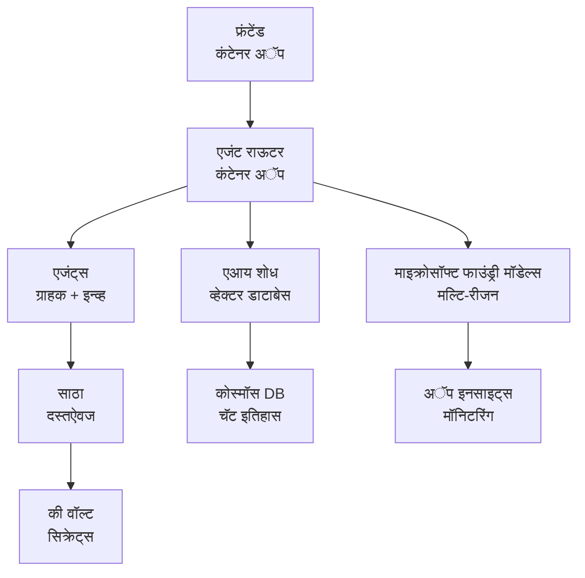

# रिटेल मल्टी-एजंट सोल्यूशन - इन्फ्रास्ट्रक्चर टेम्पलेट

**अध्याय ५: उत्पादन विराम पॅकेज**  
- **📚 कोर्स होम**: [AZD For Beginners](../../README.md)  
- **📖 संबंधित अध्याय**: [अध्याय ५: मल्टी-एजंट एआय सोल्यूशन्स](../../README.md#-chapter-5-multi-agent-ai-solutions-advanced)  
- **📝 घटना मार्गदर्शक**: [पूर्ण आर्किटेक्चर](../retail-scenario.md)  
- **🎯 जलद तैनात करणे**: [वन-क्लिक तैनाती](../../../../examples/retail-multiagent-arm-template)  

> **⚠️ फक्त इन्फ्रास्ट्रक्चर टेम्पलेट**  
> हा ARM टेम्पलेट **Azure संसाधने** मल्टी-एजंट सिस्टमसाठी तैनात करतो.  
>  
> **काय तैनात होते (१५-२५ मिनिटे):**  
> - ✅ मायक्रोसॉफ्ट फाउंड्री मॉडेल्स (gpt-4.1, gpt-4.1-मिनी, ३ प्रदेशांमध्ये एम्बेडिंग्स)  
> - ✅ AI Search सेवा (रिक्त, इंडेक्स निर्मितीसाठी तयार)  
> - ✅ कंटेनर अ‍ॅप्स (प्लेसहोल्डर इमेजेस, तुमच्या कोडसाठी तयार)  
> - ✅ स्टोरेज, कॉस्मॉस DB, की व्हॉल्ट, अ‍ॅप्लिकेशन इनसाइट्स  
>  
> **काय समाविष्ट नाही (विकास आवश्यक):**  
> - ❌ एजंट अंमलबजावणी कोड (कस्टमर एजंट, इन्व्हेंटरी एजंट)  
> - ❌ राऊटिंग लॉजिक आणि API एंडपॉइंट्स  
> - ❌ फ्रंटेंड चॅट UI  
> - ❌ शोध इंडेक्स स्कीमा आणि डेटापाईपलाइन्स  
> - ❌ **मोजलेला विकास प्रयत्न: ८०-१२० तास**  
>  
> **हा टेम्पलेट वापरा जर:**  
> - ✅ तुम्हाला मल्टी-एजंट प्रोजेक्टसाठी Azure इन्फ्रास्ट्रक्चर प्राव्हिजन करायचे आहे  
> - ✅ एजंट अंमलबजावणी स्वतंत्रपणे विकसित करायची आहे  
> - ✅ उत्पादन-तयार इन्फ्रास्ट्रक्चर बेसलाइन हवा आहे  
>  
> **वापरू नका जर:**  
> - ❌ तुम्हाला लगेच काम करणारा मल्टी-एजंट डेमो अपेक्षित असेल  
> - ❌ तुम्हाला पूर्ण अ‍ॅप्लिकेशन कोड उदाहरणे पाहिजेत  

## आढावा

हा डिरेक्टरी मल्टी-एजंट कस्टमर सपोर्ट सिस्टमसाठी **इन्फ्रास्ट्रक्चर फाउंडेशन** तैनात करण्यासाठी संपूर्ण Azure Resource Manager (ARM) टेम्पलेट समाविष्ट करते. टेम्पलेट योग्यरित्या कॉन्फिगर केलेल्या आणि आंतरकनेक्टेड सर्व आवश्यक Azure सेवा प्रदान करते, तुमच्या अॅप्लिकेशन विकासासाठी तयार.

**तैनाती नंतर, तुमच्याकडे असेल:** उत्पादनासाठी तयार Azure इन्फ्रास्ट्रक्चर  
**सिंستم पूर्ण करण्यासाठी आवश्यक:** एजंट कोड, फ्रंटेंड UI, आणि डेटा कॉन्फिगरेशन (पहा [आर्किटेक्चर मार्गदर्शक](../retail-scenario.md))  

## 🎯 काय तैनात होते

### मुख्य इन्फ्रास्ट्रक्चर (तैनाती नंतर स्थिती)

✅ **मायक्रोसॉफ्ट फाउंड्री मॉडेल्स सेवा** (API कॉलसाठी तयार)  
  - प्राथमिक प्रदेश: gpt-4.1 तैनात (२०K TPM क्षमता)  
  - दुय्यम प्रदेश: gpt-4.1-मिनी तैनात (१०K TPM क्षमता)  
  - तृतीयक प्रदेश: टेक्स्ट एम्बेडिंग मॉडेल (३०K TPM क्षमता)  
  - मूल्यमापन प्रदेश: gpt-4.1 ग्रेडर मॉडेल (१५K TPM क्षमता)  
  - **स्थिती:** पूर्ण कार्यक्षम - तत्काळ API कॉल करता येतो  

✅ **Azure AI Search** (रिक्त - कॉन्फिगरेशनसाठी तयार)  
  - व्हेक्टर शोध क्षमता सक्षम  
  - स्टँडर्ड टियरसह १ पार्टिशन, १ प्रतिकृती  
  - **स्थिती:** सेवा चालू आहे, परंतु इंडेक्स तयार करणे आवश्यक आहे  
  - **कारवाई आवश्यक:** तुमच्या स्कीमासह शोध इंडेक्स तयार करा  

✅ **Azure स्टोरेज अकाउंट** (रिक्त - अपलोडसाठी तयार)  
  - ब्लॉब कंटेनर्स: `documents`, `uploads`  
  - सुरक्षित कॉन्फिगरेशन (केवळ HTTPS, सार्वजनिक प्रवेश नाही)  
  - **स्थिती:** फायली स्वीकारण्यासाठी तयार  
  - **कारवाई आवश्यक:** तुमचा उत्पादन डेटा आणि दस्तऐवज अपलोड करा  

⚠️ **कंटेनर अ‍ॅप्स एन्व्हायर्नमेंट** (प्लेसहोल्डर इमेजेस तैनात)  
  - एजंट राऊटर अ‍ॅप (nginx डीफॉल्ट इमेज)  
  - फ्रंटेंड अ‍ॅप (nginx डीफॉल्ट इमेज)  
  - ऑटो-स्केलिंग कॉन्फिगर (०-१० इंस्टन्सेस)  
  - **स्थिती:** प्लेसहोल्डर कंटेनर्स चालू आहेत  
  - **कारवाई आवश्यक:** तुमचे एजंट अ‍ॅप्लिकेशन्स तयार करा आणि तैनात करा  

✅ **Azure Cosmos DB** (रिक्त - डेटासाठी तयार)  
  - डेटाबेस आणि कंटेनर पूर्व-कॉन्फिगर केलेले  
  - कमी विलंब ऑपरेशन्ससाठी ऑप्टिमाइज़्ड  
  - TTL स्वयंचलित क्लिनअपसाठी सक्षम  
  - **स्थिती:** चॅट इतिहास साठवण्यासाठी तयार  

✅ **Azure Key Vault** (ऐच्छिक - रहस्यांसाठी तयार)  
  - सॉफ्ट डिलीट सक्षम  
  - व्यवस्थापित ओळखांसाठी RBAC कॉन्फिगर केलेले  
  - **स्थिती:** API कीस आणि कनेक्शन स्ट्रिंग्ससाठी तयार  

✅ **Application Insights** (ऐच्छिक - देखरेख सक्रिय)  
  - लॉग अ‍ॅनालिटिक्स कार्यक्षेत्राशी जोडलेले  
  - सानुकूल मेट्रिक्स आणि अलर्ट कॉन्फिगर केलेले  
  - **स्थिती:** तुमच्या अ‍ॅप्समधून टेलिमेट्री स्वीकारण्यासाठी तयार  

✅ **Document Intelligence** (API कॉलसाठी तयार)  
  - उत्पादन कार्यभारांसाठी S0 टियर  
  - **स्थिती:** अपलोड केलेले दस्तऐवज प्रक्रिया करण्यासाठी तयार  

✅ **Bing Search API** (API कॉलसाठी तयार)  
  - रिअल-टाइम शोधांसाठी S1 टियर  
  - **स्थिती:** वेब शोध क्वेरीजसाठी तयार  

### तैनाती मोड्स

| मोड | OpenAI क्षमता | कंटेनर इंस्टन्सेस | शोध टियर | स्टोरेज पुनरावृत्ती | उत्तमासाठी |
|------|-----------------|---------------------|-------------|-------------------|----------|
| **मिनिमल** | १०K-२०K TPM | ०-२ प्रतिकृती | बेसिक | LRS (लोकल) | विकास/चाचणी, शिकणे, पुरावा-आधार |
| **स्टँडर्ड** | ३०K-६०K TPM | २-५ प्रतिकृती | स्टँडर्ड | ZRS (झोन) | उत्पादन, मध्यम ट्रॅफिक (<१०K वापरकर्ते) |
| **प्रिमियम** | ८०K-१५०K TPM | ५-१० प्रतिकृती, झोन-रेडंडंट | प्रिमियम | GRS (जिओ) | एंटरप्राइज, उच्च ट्रॅफिक (>१०K वापरकर्ते), ९९.९९% SLA |

**खर्चाचा परिणाम:**  
- **मिनिमल → स्टँडर्ड:** सुमारे ४ पट खर्च वाढ ($१००-३७०/महिना → $४२०-१४५०/महिना)  
- **स्टँडर्ड → प्रिमियम:** सुमारे ३ पट खर्च वाढ ($४२०-१४५०/महिना → $११५०-३५००/महिना)  
- **निवड आधारावर:** अपेक्षित लोड, SLA आवश्यकता, बजेट मर्यादा  

**क्षमता नियोजन:**  
- **TPM (टोकन्स प्रति मिनिट):** सर्व मॉडेल तैनातींवर एकूण  
- **कंटेनर इंस्टन्सेस:** ऑटो-स्केलिंग श्रेणी (किंवा किमान-जास्तीत जास्त प्रतिकृती)  
- **शोध टियर:** क्वेरी कार्यक्षमता आणि इंडेक्स आकार मर्यादा प्रभावित करते  

## 📋 पूर्वअट

### आवश्यक साधने  
१. **Azure CLI** (आवृत्ती 2.50.0 किंवा अधिक)  
   ```bash
   az --version  # आवृत्ती तपासा
   az login      # प्रमाणीकरण करा
   ```
  
२. **सक्रिय Azure सदस्यत्व** (मालक किंवा योगदानकर्ता प्रवेशासह)  
   ```bash
   az account show  # सदस्यता तपासा
   ```
  

### आवश्यक Azure कोटा  

तैनातीपूर्वी, तुमच्या लक्षित प्रदेशांमध्ये पुरेशी कोटा आहे की नाही ते तपासा:  

```bash
# आपल्या विभागात Microsoft Foundry मॉडेल्सची उपलब्धता तपासा
az cognitiveservices account list-skus \
  --kind OpenAI \
  --location eastus2

# OpenAI कोटा तपासा (gpt-4.1 साठी उदाहरण)
az cognitiveservices usage list \
  --location eastus2 \
  --query "[?name.value=='OpenAI.Standard.gpt-4.1']"

# कंटेनर अ‍ॅप्स कोटा तपासा
az provider show \
  --namespace Microsoft.App \
  --query "resourceTypes[?resourceType=='managedEnvironments'].locations"
```
  
**किमान आवश्यक कोटा:**  
- **मायक्रोसॉफ्ट फाउंड्री मॉडेल्स:** ३-४ मॉडेल तैनात प्रदेशांमध्ये  
  - gpt-4.1: २०K TPM (टोकन्स प्रति मिनिट)  
  - gpt-4.1-मिनी: १०K TPM  
  - text-embedding-ada-002: ३०K TPM  
  - **टीप:** काही प्रदेशांमध्ये gpt-4.1 साठी प्रतीक्षा यादी असू शकते - पहा [मॉडेल उपलब्धता](https://learn.microsoft.com/azure/ai-services/openai/concepts/models)  
- **कंटेनर अ‍ॅप्स:** व्यवस्थापित पर्यावरण + २-१० कंटेनर इंस्टन्सेस  
- **AI Search:** स्टँडर्ड टियर (बेसिक व्हेक्टर शोधासाठी अपुरी)  
- **Cosmos DB:** स्टँडर्ड प्राव्हिजन्ड थ्रूपुट  

**कोटा अपुरी असल्यास:**  
१. Azure पोर्टल → कोटा → वाढीची विनंती करा  
२. किंवा Azure CLI वापरा:  
   ```bash
   az support tickets create \
     --ticket-name "OpenAI-Quota-Increase" \
     --severity "minimal" \
     --description "Request quota increase for Microsoft Foundry Models gpt-4.1 in eastus2"
   ```
  
३. उपलब्धतेसह पर्यायी प्रदेशांचा विचार करा  

## 🚀 जलद तैनाती

### पर्याय १: Azure CLI वापरून

```bash
# टेम्पलेट फाइल्स क्लोन करा किंवा डाउनलोड करा
git clone <repository-url>
cd examples/retail-multiagent-arm-template

# तैनाती स्क्रिप्टसाठी कार्यान्वित परवानगी द्या
chmod +x deploy.sh

# पूर्वनिर्धारित सेटिंग्जसह तैनात करा
./deploy.sh -g myResourceGroup

# प्रीमियम वैशिष्ट्यांसह उत्पादनासाठी तैनात करा
./deploy.sh -g myProdRG -e prod -m premium -l eastus2
```
  

### पर्याय २: Azure पोर्टल वापरून

[](https://portal.azure.com/#create/Microsoft.Template/uri/https%3A%2F%2Fraw.githubusercontent.com%2Fmicrosoft%2Fazd-for-beginners%2Fmain%2Fexamples%2Fretail-multiagent-arm-template%2Fazuredeploy.json)  

### पर्याय ३: थेट Azure CLI वापरून

```bash
# संसाधन समूह तयार करा
az group create --name myResourceGroup --location eastus2

# साचा तैनात करा
az deployment group create \
  --resource-group myResourceGroup \
  --template-file azuredeploy.json \
  --parameters azuredeploy.parameters.json
```
  

## ⏱️ तैनाती वेळापत्रक

### काय अपेक्षित आहे

| टप्पा | कालावधी | काय होते |
|-------|----------|--------------|
| **टेम्पलेट सत्यापन** | ३०-६० सेकंद | Azure ARM टेम्पलेट सिंटॅक्स आणि पॅरामीटर्स सत्यापित करते |
| **रिसोर्स ग्रुप स्थापना** | १०-२० सेकंद | रिसोर्स ग्रुप तयार करते (आवश्यक असल्यास) |
| **OpenAI प्राव्हिजनिंग** | ५-८ मिनिटे | ३-४ OpenAI अकाउंटस तयार करते आणि मॉडेल्स तैनात करते |
| **कंटेनर अ‍ॅप्स** | ३-५ मिनिटे | एन्व्हायर्नमेंट तयार करते आणि प्लेसहोल्डर कंटेनर तैनात करते |
| **शोध व स्टोरेज** | २-४ मिनिटे | AI Search सेवा आणि स्टोरेज अकाउंटस तयार करते |
| **Cosmos DB** | २-३ मिनिटे | डेटाबेस तयार करते आणि कंटेनर कॉन्फिगर करते |
| **देखरेख सेटअप** | २-३ मिनिटे | Application Insights आणि Log Analytics सेट करते |
| **RBAC कॉन्फिगरेशन** | १-२ मिनिटे | व्यवस्थापित ओळखी आणि परवानग्या कॉन्फिगर करते |
| **एकूण तैनाती** | **१५-२५ मिनिटे** | संपूर्ण इन्फ्रास्ट्रक्चर तयार |  

**तैनाती नंतर:**  
- ✅ **इन्फ्रास्ट्रक्चर तयार:** सर्व Azure सेवा प्राव्हिजन्ड व चालू  
- ⏱️ **अ‍ॅप्लिकेशन विकास:** ८०-१२० तास (तुमची जबाबदारी)  
- ⏱️ **इंडेक्स कॉन्फिगरेशन:** १५-३० मिनिटे (तुमच्या स्कीमासाठी आवश्यक)  
- ⏱️ **डेटा अपलोड:** डेटासेट आकारानुसार बदलते  
- ⏱️ **चाचणी आणि सत्यापना:** २-४ तास  

---

## ✅ तैनाती यशस्वीता तपासा

### टप्पा १: संसाधन प्राव्हिजनिंग तपासा (२ मिनिटे)

```bash
# सर्व संसाधने यशस्वीपणे तैनात झाली आहेत याची पुष्टी करा
az resource list \
  --resource-group myResourceGroup \
  --query "[?provisioningState!='Succeeded'].{Name:name, Status:provisioningState, Type:type}" \
  --output table
```
  
**अपेक्षित:** रिक्त तालिका (सर्व संसाधने "यशस्वी" स्थिती दर्शवितात)  

### टप्पा २: मायक्रोसॉफ्ट फाउंड्री मॉडेल तैनाती तपासा (३ मिनिटे)

```bash
# सर्व OpenAI खाते यादी करा
az cognitiveservices account list \
  --resource-group myResourceGroup \
  --query "[?kind=='OpenAI'].{Name:name, Location:location, Status:properties.provisioningState}" \
  --output table

# मुख्य प्रदेशासाठी मॉडेल राबविण्याची तपासणी करा
OPENAI_NAME=$(az cognitiveservices account list \
  --resource-group myResourceGroup \
  --query "[?kind=='OpenAI'] | [0].name" -o tsv)

az cognitiveservices account deployment list \
  --name $OPENAI_NAME \
  --resource-group myResourceGroup \
  --output table
```
  
**अपेक्षित:**  
- ३-४ OpenAI अकाउंट्स (प्राथमिक, दुय्यम, तृतीयक, मूल्यमापन प्रदेश)  
- १-२ मॉडेल तैनाती प्रति अकाउंट (gpt-4.1, gpt-4.1-मिनी, text-embedding-ada-002)  

### टप्पा ३: इन्फ्रास्ट्रक्चर एंडपॉइंट्स तपासा (५ मिनिटे)

```bash
# कंटेनर अ‍ॅप URL मिळवा
az containerapp list \
  --resource-group myResourceGroup \
  --query "[].{Name:name, URL:properties.configuration.ingress.fqdn, Status:properties.runningStatus}" \
  --output table

# राउटर एंडपॉइंट चाचणी करा (ठांवधारक प्रतिमा प्रतिसाद देईल)
ROUTER_URL=$(az containerapp show \
  --name retail-router \
  --resource-group myResourceGroup \
  --query "properties.configuration.ingress.fqdn" -o tsv)

echo "Testing: https://$ROUTER_URL"
curl -I https://$ROUTER_URL || echo "Container running (placeholder image - expected)"
```
  
**अपेक्षित:**  
- कंटेनर अ‍ॅप्स "रनिंग" स्थिती दर्शवितात  
- प्लेसहोल्डर nginx HTTP 200 किंवा 404 प्रतिसाद देतो (अद्याप अ‍ॅप्लिकेशन कोड नाही)  

### टप्पा ४: मायक्रोसॉफ्ट फाउंड्री मॉडेल API प्रवेश तपासा (३ मिनिटे)

```bash
# OpenAI एंडपॉइंट आणि किल्ली मिळवा
OPENAI_ENDPOINT=$(az cognitiveservices account show \
  --name $OPENAI_NAME \
  --resource-group myResourceGroup \
  --query "properties.endpoint" -o tsv)

OPENAI_KEY=$(az cognitiveservices account keys list \
  --name $OPENAI_NAME \
  --resource-group myResourceGroup \
  --query "key1" -o tsv)

# gpt-4.1 डिप्लॉयमेंटची चाचणी करा
curl "${OPENAI_ENDPOINT}openai/deployments/gpt-4.1/chat/completions?api-version=2024-08-01-preview" \
  -H "Content-Type: application/json" \
  -H "api-key: $OPENAI_KEY" \
  -d '{
    "messages": [{"role": "user", "content": "Say hello"}],
    "max_tokens": 10
  }'
```
  
**अपेक्षित:** JSON प्रतिसाद चर्चे पूर्णतेसह (OpenAI कार्यरत असल्याचे पुष्टी)  

### काय काम करते विरुद्ध काय नाही

**✅ तैनाती नंतर कार्यरत:**  
- मायक्रोसॉफ्ट फाउंड्री मॉडेल्स तैनात आणि API कॉल्स स्वीकारत आहेत  
- AI Search सेवा चालू (रिक्त, अजून इंडेक्स नाही)  
- कंटेनर अ‍ॅप्स चालू (प्लेसहोल्डर nginx इमेजेस)  
- स्टोरेज अकाउंट्स प्रवेशयोग्य व अपलोडसाठी तयार  
- Cosmos DB डेटा ऑपरेशन्ससाठी तयार  
- Application Insights इन्फ्रास्ट्रक्चर टेलिमेट्री गोळा करत आहे  
- की व्हॉल्ट रहस्य संचयनासाठी तयार  

**❌ अजून काम करत नाही (विकास आवश्यक):**  
- एजंट एंडपॉइंट्स (अॅप्लिकेशन कोड अजून तैनात नाही)  
- चॅट कार्यक्षमता (फ्रंटेंड + बॅकेंड अंमलबजावणी आवश्यक)  
- शोध क्वेरिज (अजून शोध इंडेक्स तयार नाही)  
- दस्तऐवज प्रक्रिया पाईपलाइन (डेटा अपलोड नाही)  
- कस्टम टेलिमेट्री (अ‍ॅप्लिकेशन इन्स्ट्रुमेंटेशन आवश्यक)  

**पुढील टप्पे:** [पोस्ट-तैनात कॉन्फिगरेशन](../../../../examples/retail-multiagent-arm-template) पाहा तुमचे अ‍ॅप्लिकेशन विकसित व तैनात करण्यासाठी  

---

## ⚙️ कॉन्फिगरेशन पर्याय

### टेम्पलेट पॅरामीटर्स

| पॅरामीटर | प्रकार | डीफॉल्ट | वर्णन |
|-----------|--------|---------|-------|
| `projectName` | स्ट्रिंग | "retail" | सर्व संसाधन नावांसाठी प्रिफिक्स |
| `location` | स्ट्रिंग | रिसोर्स ग्रुप स्थान | प्राथमिक तैनाती प्रदेश |
| `secondaryLocation` | स्ट्रिंग | "westus2" | मल्टी-रेजिन तैनातीसाठी दुय्यम प्रदेश |
| `tertiaryLocation` | स्ट्रिंग | "francecentral" | एम्बेडिंग मॉडेलसाठी प्रदेश |
| `environmentName` | स्ट्रिंग | "dev" | पर्यावरणाचे नामांकन (dev/staging/prod) |
| `deploymentMode` | स्ट्रिंग | "standard" | तैनाती कॉन्फिगरेशन (minimal/standard/premium) |
| `enableMultiRegion` | bool | true | मल्टी-रेजिन तैनाती सक्षम करा |
| `enableMonitoring` | bool | true | Application Insights आणि लॉगिंग सक्रिय करा |
| `enableSecurity` | bool | true | की व्हॉल्ट आणि वाढीव सिक्युरिटी सक्षम करा |

### पॅरामीटर्स सानुकूलित करणे

`azuredeploy.parameters.json` संपादित करा:  

```json
{
  "$schema": "https://schema.management.azure.com/schemas/2019-04-01/deploymentParameters.json#",
  "contentVersion": "1.0.0.0",
  "parameters": {
    "projectName": {
      "value": "mycompany"
    },
    "environmentName": {
      "value": "prod"
    },
    "deploymentMode": {
      "value": "premium"
    },
    "location": {
      "value": "eastus2"
    }
  }
}
```
  

## 🏗️ आर्किटेक्चर आढावा



## 📖 तैनाती स्क्रिप्ट वापर

`deploy.sh` स्क्रिप्ट एक संवादात्मक तैनाती अनुभव प्रदान करते:  

```bash
# मदत दाखवा
./deploy.sh --help

# मूलभूत तैनाती
./deploy.sh -g myResourceGroup

# सानुकूल सेटिंग्जसह प्रगत तैनाती
./deploy.sh \
  -g myProductionRG \
  -p companyname \
  -e prod \
  -m premium \
  -l eastus2

# बहु-प्रदेशाशिवाय विकास तैनाती
./deploy.sh \
  -g myDevRG \
  -e dev \
  -m minimal \
  --no-multi-region \
  --no-security
```
  

### स्क्रिप्ट वैशिष्ट्ये

- ✅ **पूर्वअटींचे सत्यापन** (Azure CLI, लॉगिन स्थिती, टेम्पलेट फायली)  
- ✅ **रिसोर्स ग्रुप व्यवस्थापन** (जर नसेल तर तयार करते)  
- ✅ **टेम्पलेट सत्यापन** तैनातीपूर्वी  
- ✅ **प्रगती तपासणी** रंगीत आउटपुटसह  
- ✅ **तैनाती आउटपुट्स** प्रदर्शित करणे  
- ✅ **पोस्ट-तैनाती मार्गदर्शन**  

## 📊 तैनाती देखरेख

### तैनाती स्थिती तपासा

```bash
# वितरणांची यादी करा
az deployment group list --resource-group myResourceGroup --output table

# वितरण तपशील मिळवा
az deployment group show \
  --resource-group myResourceGroup \
  --name retail-deployment-YYYYMMDD-HHMMSS

# वितरण प्रगतीवर लक्ष ठेवा
az deployment group create \
  --resource-group myResourceGroup \
  --template-file azuredeploy.json \
  --parameters azuredeploy.parameters.json \
  --verbose
```
  

### तैनाती आउटपुट्स

यशस्वी तैनाती नंतर खालील आउटपुट्स उपलब्ध आहेत:  

- **फ्रंटेंड URL:** वेब इंटरफेससाठी सार्वजनिक एंडपॉइंट  
- **राऊटर URL:** एजंट राऊटरसाठी API एंडपॉइंट  
- **OpenAI एंडपॉइंट्स:** प्राथमिक आणि दुय्यम OpenAI सेवा एंडपॉइंट्स  
- **शोध सेवा:** Azure AI Search सेवा एंडपॉइंट  
- **स्टोरेज अकाउंट:** दस्तऐवजांसाठी स्टोरेज अकाउंटचे नाव  
- **की व्हॉल्ट:** की व्हॉल्टचे नाव (जर सक्षम असेल तर)  
- **अ‍ॅप्लिकेशन इनसाइट्स:** देखरेख सेवेचे नाव (जर सक्षम असेल तर)  

## 🔧 पोस्ट-तैनाती: पुढील टप्पे
> **📝 महत्त्वाचे:** इन्फ्रास्ट्रक्चर तैनात केले गेले आहे, परंतु तुम्हाला अनुप्रयोग कोड विकसित आणि तैनात करणे आवश्यक आहे.

### टप्पा 1: एजंट अनुप्रयोग विकसित करा (तुमची जबाबदारी)

ARM टेम्पलेट **रिकामी कंटेनर अॅप्स** तयार करते ज्यात प्लेसहोल्डर nginx प्रतिमा असतात. तुम्हाला यासाठी करावे लागेल:

**आवश्यक विकास:**
1. **एजंट अंमलबजावणी** (30-40 तास)
   - ग्राहक सेवा एजंट ज्यात gpt-4.1 एकत्रीकरण आहे
   - इन्व्हेंटरी एजंट ज्यात gpt-4.1-मिनी एकत्रीकरण आहे
   - एजंट राउटिंग लॉजिक

2. **फ्रंटेंड विकास** (20-30 तास)
   - चॅट इंटरफेस UI (React/Vue/Angular)
   - फाइल अपलोड कार्यक्षमता
   - प्रतिसाद रेंडरिंग आणि फॉरमॅटिंग

3. **बॅकएंड सेवा** (12-16 तास)
   - FastAPI किंवा Express राउटर
   - प्रमाणीकरण मिडलवेयर
   - टेलिमेट्री एकत्रीकरण

**पहा:** [Architecture Guide](../retail-scenario.md) सविस्तर अंमलबजावणी नमुने आणि कोड उदाहरणांसाठी

### टप्पा 2: AI शोध सूची सेट करा (15-30 मिनिटे)

तुमच्या डेटा मॉडेलशी जुळणारी शोध सूची तयार करा:

```bash
# शोध सेवा तपशील मिळवा
SEARCH_NAME=$(az search service list \
  --resource-group myResourceGroup \
  --query "[0].name" -o tsv)

SEARCH_KEY=$(az search admin-key show \
  --service-name $SEARCH_NAME \
  --resource-group myResourceGroup \
  --query "primaryKey" -o tsv)

# आपल्या स्कीमासह निर्देशांक तयार करा (उदाहरण)
curl -X POST "https://${SEARCH_NAME}.search.windows.net/indexes?api-version=2023-11-01" \
  -H "Content-Type: application/json" \
  -H "api-key: ${SEARCH_KEY}" \
  -d '{
    "name": "products",
    "fields": [
      {"name": "id", "type": "Edm.String", "key": true},
      {"name": "title", "type": "Edm.String", "searchable": true},
      {"name": "content", "type": "Edm.String", "searchable": true},
      {"name": "category", "type": "Edm.String", "filterable": true},
      {"name": "content_vector", "type": "Collection(Edm.Single)", 
       "searchable": true, "dimensions": 1536, "vectorSearchProfile": "default"}
    ],
    "vectorSearch": {
      "algorithms": [{"name": "default", "kind": "hnsw"}],
      "profiles": [{"name": "default", "algorithm": "default"}]
    }
  }'
```

**साधने:**
- [AI Search Index Schema Design](https://learn.microsoft.com/azure/search/search-what-is-an-index)
- [Vector Search Configuration](https://learn.microsoft.com/azure/search/vector-search-how-to-create-index)

### टप्पा 3: तुमचा डेटा अपलोड करा (वेळ वेगळी)

एकदा तुमच्याकडे उत्पादन डेटा आणि दस्तऐवज असले की:

```bash
# संग्रहण खात्याचे तपशील मिळवा
STORAGE_NAME=$(az storage account list \
  --resource-group myResourceGroup \
  --query "[0].name" -o tsv)

STORAGE_KEY=$(az storage account keys list \
  --account-name $STORAGE_NAME \
  --resource-group myResourceGroup \
  --query "[0].value" -o tsv)

# आपले दस्तऐवज अपलोड करा
az storage blob upload-batch \
  --destination documents \
  --source /path/to/your/product/docs \
  --account-name $STORAGE_NAME \
  --account-key $STORAGE_KEY

# उदाहरण: एकाच फाइल अपलोड करा
az storage blob upload \
  --container-name documents \
  --name "product-manual.pdf" \
  --file /path/to/product-manual.pdf \
  --account-name $STORAGE_NAME \
  --account-key $STORAGE_KEY
```

### टप्पा 4: तुमचे अनुप्रयोग तयार करा आणि तैनात करा (8-12 तास)

एकदा तुम्ही तुमचा एजंट कोड विकसित केला की:

```bash
# 1. Azure कंटेनर रजिस्ट्री तयार करा (आवश्यक असल्यास)
az acr create \
  --name myregistry \
  --resource-group myResourceGroup \
  --sku Basic

# 2. एजंट राउटर इमेज तयार करा आणि पुश करा
docker build -t myregistry.azurecr.io/agent-router:v1 /path/to/your/router/code
az acr login --name myregistry
docker push myregistry.azurecr.io/agent-router:v1

# 3. फ्रंटेंड इमेज तयार करा आणि पुश करा
docker build -t myregistry.azurecr.io/frontend:v1 /path/to/your/frontend/code
docker push myregistry.azurecr.io/frontend:v1

# 4. आपल्या इमेजेससह कंटेनर ॲप्स अपडेट करा
az containerapp update \
  --name retail-router \
  --resource-group myResourceGroup \
  --image myregistry.azurecr.io/agent-router:v1

az containerapp update \
  --name retail-frontend \
  --resource-group myResourceGroup \
  --image myregistry.azurecr.io/frontend:v1

# 5. पर्यावरणीय चल सेट करा
az containerapp update \
  --name retail-router \
  --resource-group myResourceGroup \
  --set-env-vars \
    OPENAI_ENDPOINT=secretref:openai-endpoint \
    OPENAI_KEY=secretref:openai-key \
    SEARCH_ENDPOINT=secretref:search-endpoint \
    SEARCH_KEY=secretref:search-key
```

### टप्पा 5: तुमचे अनुप्रयोग चाचणी करा (2-4 तास)

```bash
# आपल्या अनुप्रयोगाचा URL मिळवा
ROUTER_URL=$(az containerapp show \
  --name retail-router \
  --resource-group myResourceGroup \
  --query "properties.configuration.ingress.fqdn" -o tsv)

# एजंट एंडपॉइंटची चाचणी करा (एकदा आपला कोड डिप्लॉय झाल्यानंतर)
curl -X POST "https://${ROUTER_URL}/chat" \
  -H "Content-Type: application/json" \
  -d '{
    "message": "Hello, I need help with my order",
    "agent": "customer"
  }'

# अनुप्रयोगाचे लॉग तपासा
az containerapp logs show \
  --name retail-router \
  --resource-group myResourceGroup \
  --follow
```

### अंमलबजावणी साधने

**आर्किटेक्चर आणि डिझाइन:**
- 📖 [Complete Architecture Guide](../retail-scenario.md) - सविस्तर अंमलबजावणी नमुने
- 📖 [Multi-Agent Design Patterns](https://learn.microsoft.com/azure/architecture/ai-ml/guide/multi-agent-systems)

**कोड उदाहरणे:**
- 🔗 [Microsoft Foundry Models Chat Sample](https://github.com/Azure-Samples/azure-search-openai-demo) - RAG नमुना
- 🔗 [Semantic Kernel](https://github.com/microsoft/semantic-kernel) - एजंट फ्रेमवर्क (C#)
- 🔗 [LangChain Azure](https://github.com/langchain-ai/langchain) - एजंट ऑर्केस्ट्रेशन (Python)
- 🔗 [AutoGen](https://github.com/microsoft/autogen) - मल्टी-एजंट संभाषणे

**अनुमानित एकूण प्रयत्न:**
- इन्फ्रास्ट्रक्चर तैनाती: 15-25 मिनिटे (✅ पूर्ण)
- अनुप्रयोग विकास: 80-120 तास (🔨 तुमचे काम)
- चाचणी आणि ऑप्टिमायझेशन: 15-25 तास (🔨 तुमचे काम)

## 🛠️ समस्या निवारण

### सामान्य समस्या

#### 1. Microsoft Foundry Models कोटा ओलांडला

```bash
# सध्याच्या कोटा वापराची तपासणी करा
az cognitiveservices usage list --location eastus2

# कोटा वाढीची विनंती करा
az support tickets create \
  --ticket-name "OpenAI-Quota-Increase" \
  --severity "minimal" \
  --description "Request quota increase for Microsoft Foundry Models in region X"
```

#### 2. कंटेनर अॅप्स तैनात करणे अयशस्वी

```bash
# कंटेनर अॅप लॉग तपासा
az containerapp logs show \
  --name retail-router \
  --resource-group myResourceGroup \
  --follow

# कंटेनर अॅप पुनः सुरू करा
az containerapp revision restart \
  --name retail-router \
  --resource-group myResourceGroup
```

#### 3. शोध सेवा सुरुवात

```bash
# शोध सेवा स्थिती तपासा
az search service show \
  --name <search-service-name> \
  --resource-group myResourceGroup

# शोध सेवा संलग्नता तपासा
curl -X GET "https://<search-service-name>.search.windows.net/indexes?api-version=2023-11-01" \
  -H "api-key: <search-admin-key>"
```

### तैनात पडताळणी

```bash
# सर्व संसाधने तयार असल्याची खात्री करा
az resource list \
  --resource-group myResourceGroup \
  --output table

# संसाधनांच्या आरोग्याची तपासणी करा
az resource list \
  --resource-group myResourceGroup \
  --query "[?provisioningState!='Succeeded'].{Name:name, Status:provisioningState, Type:type}" \
  --output table
```

## 🔐 सुरक्षा विचार

### की व्यवस्थापन
- सर्व गुपिते Azure Key Vault मध्ये संग्रहित केली जातात (सक्रिय केल्यावर)
- कंटेनर अॅप्स प्रमाणीकरणासाठी व्यवस्थापित ओळख वापरतात
- स्टोरेज खाते सुरक्षित डीफॉल्टसह (फक्त HTTPS, सार्वजनिक ब्लॉब प्रवेश नाही)

### नेटवर्क सुरक्षा
- कंटेनर अॅप्स शक्य तिथे आंतरिक नेटवर्किंग वापरतात
- शोध सेवा खासगी एंडपॉइंट्स पर्यायासह कॉन्फिगर केलेली
- Cosmos DB आवश्यक कमीत कमी परवानग्यांसह कॉन्फिगर केलेले

### RBAC कॉन्फिगरेशन
```bash
# व्यवस्थापित ओळखीसाठी आवश्यक भूमिका नियुक्त करा
az role assignment create \
  --assignee <container-app-managed-identity> \
  --role "Cognitive Services OpenAI User" \
  --scope <openai-resource-id>
```

## 💰 खर्च ऑप्टिमायझेशन

### खर्च अंदाज (मासिक, USD)

| मोड | OpenAI | कंटेनर अॅप्स | शोध | स्टोरेज | एकूण अंदाज |
|------|--------|----------------|--------|---------|------------|
| मिनिमल | $50-200 | $20-50 | $25-100 | $5-20 | $100-370 |
| स्टँडर्ड | $200-800 | $100-300 | $100-300 | $20-50 | $420-1450 |
| प्रीमियम | $500-2000 | $300-800 | $300-600 | $50-100 | $1150-3500 |

### खर्च निरीक्षण

```bash
# बजेट अलर्ट सेट करा
az consumption budget create \
  --account-name <subscription-id> \
  --budget-name "retail-budget" \
  --amount 500 \
  --time-grain Monthly \
  --start-date 2024-01-01 \
  --end-date 2024-12-31
```

## 🔄 अद्यतने आणि देखभाल

### टेम्पलेट अद्यतने
- ARM टेम्पलेट फाइल्ससाठी आवृत्ती नियंत्रण वापरा
- बदल प्रथम विकास वातावरणात तपासा
- अद्यतनांसाठी इन्क्रीमेंटल डिप्लॉयमेंट मोड वापरा

### साधन अद्यतने
```bash
# नवीन पॅरामीटर्ससह अद्ययावत करा
az deployment group create \
  --resource-group myResourceGroup \
  --template-file azuredeploy.json \
  --parameters azuredeploy.parameters.json \
  --mode Incremental
```

### बॅकअप आणि पुनर्प्राप्ती
- Cosmos DB स्वयंचलित बॅकअप सक्रिय
- Key Vault सॉफ्ट डिलीटसाठी सक्रिय
- कंटेनर अॅप आवृत्त्या रोलबॅकसाठी राखून ठेवल्या जातात

## 📞 समर्थन

- **टेम्पलेट समस्या:** [GitHub Issues](https://github.com/microsoft/azd-for-beginners/issues)
- **Azure समर्थन:** [Azure Support Portal](https://portal.azure.com/#blade/Microsoft_Azure_Support/HelpAndSupportBlade)
- **समुदाय:** [Azure AI Discord](https://discord.gg/microsoft-azure)

---

**⚡ तुमचा मल्टी-एजंट सोल्यूशन तैनात करण्यासाठी तयार आहात?**

सुरू करा: `./deploy.sh -g myResourceGroup`

---

<!-- CO-OP TRANSLATOR DISCLAIMER START -->
**अस्वीकरण**:
हा दस्तऐवज AI अनुवाद सेवा [Co-op Translator](https://github.com/Azure/co-op-translator) वापरून अनुवादित करण्यात आला आहे. आम्ही अचूकतेसाठी प्रयत्न करतो, तरीही कृपया लक्षात घ्या की स्वयंचलित अनुवादांमध्ये चुका किंवा अचूकतेतील त्रुटी असू शकतात. मूळ दस्तऐवज त्याच्या स्थानिक भाषेत अधिकृत स्रोत मानला जाण्याचा आग्रह आहे. महत्त्वाच्या माहितींसाठी व्यावसायिक मानवी अनुवाद करण्याची शिफारस केली जाते. या अनुवादाचा वापर केल्यामुळे झालेल्या कोणत्याही गैरसमजुती किंवा चुकीच्या अर्थ लावणीबद्दल आम्ही जबाबदार नाही.
<!-- CO-OP TRANSLATOR DISCLAIMER END -->