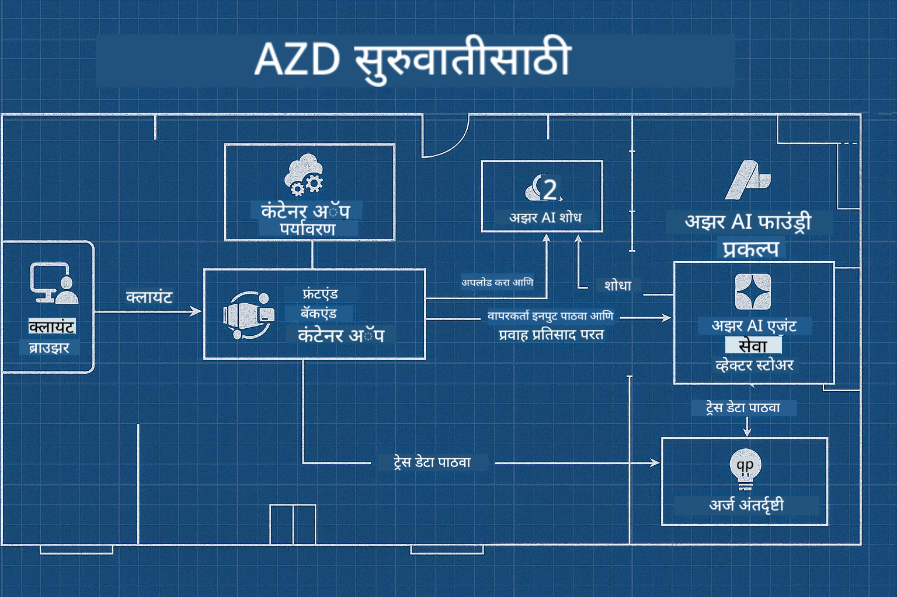

<!--
CO_OP_TRANSLATOR_METADATA:
{
  "original_hash": "245d24997bbcf2bae93bb2a503845d37",
  "translation_date": "2025-09-23T11:49:07+00:00",
  "source_file": "workshop/README.md",
  "language_code": "mr"
}
-->
# AI विकसकांसाठी AZD कार्यशाळा

## AZD टेम्पलेट्स

तुमच्या विशिष्ट गरजांसाठी एंटरप्राइझ-ग्रेड AI अॅप्लिकेशन सोल्यूशन तयार करणे म्हणजे तुमचे स्वतःचे घर बांधण्यासारखे आहे. तुम्ही स्वतः डिझाइन करू शकता, विटा-विटांनी बांधू शकता आणि ते सर्व गव्हर्नन्स आणि विकास मार्गदर्शक तत्त्वांचे पालन करते याची जबाबदारी घेऊ शकता.

**किंवा ....**

तुम्ही अशा आर्किटेक्टसोबत काम करू शकता जो तुम्हाला सुरुवातीच्या घरासाठी _ब्लूप्रिंट_ देऊ शकतो आणि नंतर तुमच्या गरजेनुसार ते _कस्टमाइझ_ करण्यासाठी तुमच्यासोबत काम करू शकतो. यामुळे तुम्हाला **तुमच्या घराला** खास बनवण्यावर लक्ष केंद्रित करता येते, आणि वायरिंग, प्लंबिंग आणि इतर अवलंबित्वे तज्ञांकडून सांभाळली जातात.

**[AI App Templates](https://ai.azure.com/templates)** यामागील दृष्टिकोन हाच आहे - वेगवेगळ्या प्रकारच्या AI अॅप्लिकेशन "घरे" तयार करण्यासाठी ब्लूप्रिंट्सची मालिका, जी तुमच्या मुख्य गरजा आणि अवलंबित्वांवर आधारित असते.

## टेम्पलेट कस्टमायझेशन

हे टेम्पलेट्स [Azure AI Foundry](https://ai.azure.com) सोबत काम करण्यासाठी डिझाइन केले आहेत. या प्लॅटफॉर्मला तुमचा "बिल्डिंग कॉन्ट्रॅक्टर" समजा, ज्यामध्ये तुमच्या कामासाठी लागणारे सर्व संसाधने, साधने आणि कौशल्ये उपलब्ध आहेत!

तुम्हाला फक्त [तुमचे सुरुवातीचे टेम्पलेट्स](https://learn.microsoft.com/en-us/azure/ai-foundry/how-to/develop/ai-template-get-started) निवडायचे आहेत. उदाहरणार्थ, आम्ही _Get Started with AI Agents_ टेम्पलेटवर लक्ष केंद्रित करू, जे तुम्हाला AI Search, Red Teaming, Evaluations, Tracing, Monitoring आणि बरेच काही यांसारख्या वैशिष्ट्यांसाठी तयार केलेले "Agentic AI Home" तयार करण्यात मदत करेल!



तुम्हाला फक्त आर्किटेक्टसोबत वेळ ठरवायची आहे, जो तुम्हाला कस्टमायझेशन प्रक्रियेत मार्गदर्शन करेल. [GitHub Copilot for Azure](https://learn.microsoft.com/en-us/azure/developer/github-copilot-azure/get-started) तुमचा मार्गदर्शक होऊ शकतो. फक्त "त्याच्याशी चॅट करा" आणि:

- तुमच्या टेम्पलेटमधील Azure वैशिष्ट्यांबद्दल जाणून घ्या  
- Azure संसाधने तैनात करा  
- तुमच्या डिप्लॉयमेंटबद्दल माहिती मिळवा  
- समस्या निदान आणि निराकरण करा!  

या कार्यशाळेत, आपण विद्यमान टेम्पलेट _डिकन्स्ट्रक्ट_ कसे करायचे (ते काय प्रदान करते हे शिकण्यासाठी), नंतर ते _कस्टमाइझ_ कसे करायचे (आपल्या गरजांसाठी) - एकावेळी एक पाऊल शिकू.

AI Templates **काम करतात** - कार्यशाळा पूर्ण करून तुम्ही **ते तुमचं बनवायला शिकाल**

----

**कार्यशाळा नेव्हिगेशन**
- **📚 कोर्स होम**: [AZD For Beginners](../README.md)
- **📖 संबंधित अध्याय**: [Chapter 1](../README.md#-chapter-1-foundation--quick-start), [Chapter 2](../README.md#-chapter-2-ai-first-development-recommended-for-ai-developers), आणि [Chapter 5](../README.md#-chapter-5-multi-agent-ai-solutions-advanced) समाविष्ट आहे
- **🛠️ प्रॅक्टिकल लॅब**: [AI Workshop Lab](../docs/ai-foundry/ai-workshop-lab.md)
- **🚀 पुढील पावले**: [Workshop Lab Modules](../../../workshop)

Azure Developer CLI (AZD) शिकण्यासाठी आणि AI अॅप्लिकेशन डिप्लॉयमेंटवर लक्ष केंद्रित करण्यासाठी या हँड्स-ऑन कार्यशाळेत आपले स्वागत आहे. ही कार्यशाळा तुम्हाला AZD च्या मूलभूत गोष्टींपासून उत्पादन-तयार AI सोल्यूशन्स डिप्लॉय करण्यापर्यंत घेऊन जाईल.

## कार्यशाळेचा आढावा

**कालावधी:** 2-3 तास  
**स्तर:** नवशिक्या ते मध्यम  
**पूर्वअट:** Azure, कमांड लाइन टूल्स आणि AI संकल्पनांचे मूलभूत ज्ञान

### तुम्ही काय शिकाल

- **AZD मूलतत्त्वे**: AZD सह Infrastructure as Code समजून घेणे  
- 🤖 **AI सेवा एकत्रीकरण**: Azure OpenAI, AI Search आणि इतर AI सेवा तैनात करणे  
- **कंटेनर डिप्लॉयमेंट**: Azure Container Apps वापरून AI अॅप्लिकेशन्स तैनात करणे  
- **सुरक्षा सर्वोत्तम पद्धती**: Managed Identity आणि सुरक्षित कॉन्फिगरेशन लागू करणे  
- **मॉनिटरिंग आणि निरीक्षण**: AI वर्कलोडसाठी Application Insights सेट करणे  
- **उत्पादन पद्धती**: एंटरप्राइझ-तयार डिप्लॉयमेंट धोरणे  

## कार्यशाळेची रचना

### मॉड्यूल 1: AZD फाउंडेशन्स (30 मिनिटे)
- AZD स्थापित करणे आणि कॉन्फिगर करणे  
- AZD प्रकल्प संरचना समजून घेणे  
- तुमची पहिली AZD डिप्लॉयमेंट  
- **लॅब**: एक साधे वेब अॅप्लिकेशन तैनात करा  

### मॉड्यूल 2: Azure OpenAI एकत्रीकरण (45 मिनिटे)
- Azure OpenAI संसाधने सेट करणे  
- मॉडेल डिप्लॉयमेंट धोरणे  
- API प्रवेश आणि प्रमाणीकरण कॉन्फिगर करणे  
- **लॅब**: GPT-4 सह चॅट अॅप्लिकेशन तैनात करा  

### मॉड्यूल 3: RAG अॅप्लिकेशन्स (45 मिनिटे)
- Azure AI Search एकत्रीकरण  
- Azure Document Intelligence सह दस्तऐवज प्रक्रिया  
- व्हेक्टर एम्बेडिंग्ज आणि सिमॅंटिक सर्च  
- **लॅब**: दस्तऐवज Q&A प्रणाली तयार करा  

### मॉड्यूल 4: उत्पादन डिप्लॉयमेंट (30 मिनिटे)
- कंटेनर अॅप्स कॉन्फिगरेशन  
- स्केलिंग आणि कार्यक्षमता ऑप्टिमायझेशन  
- मॉनिटरिंग आणि लॉगिंग  
- **लॅब**: निरीक्षणासह उत्पादनात तैनात करा  

### मॉड्यूल 5: प्रगत पद्धती (15 मिनिटे)
- मल्टी-एन्व्हायर्नमेंट डिप्लॉयमेंट  
- CI/CD एकत्रीकरण  
- खर्च ऑप्टिमायझेशन धोरणे  
- **समारोप**: उत्पादन तयारी चेकलिस्ट  

## पूर्वअट

### आवश्यक साधने

कृपया कार्यशाळेपूर्वी ही साधने स्थापित करा:

```bash
# Azure Developer CLI
curl -fsSL https://aka.ms/install-azd.sh | bash

# Azure CLI
curl -sL https://aka.ms/InstallAzureCLIDeb | sudo bash

# Git
sudo apt-get install git

# Docker
curl -fsSL https://get.docker.com -o get-docker.sh
sudo sh get-docker.sh

# Python 3.10+
sudo apt-get install python3.10 python3.10-venv python3-pip
```

### Azure खाते सेटअप

1. **Azure सदस्यता**: [फ्री साइन अप करा](https://azure.microsoft.com/free/)  
2. **Azure OpenAI प्रवेश**: [प्रवेशासाठी विनंती करा](https://aka.ms/oai/access)  
3. **आवश्यक परवानग्या**:  
   - सदस्यता किंवा संसाधन गटावर Contributor भूमिका  
   - User Access Administrator (RBAC असाइनमेंटसाठी)  

### पूर्वअट सत्यापित करा

तुमची सेटअप सत्यापित करण्यासाठी हा स्क्रिप्ट चालवा:

```bash
#!/bin/bash
echo "Verifying workshop prerequisites..."

# Check AZD installation
if command -v azd &> /dev/null; then
    echo "✅ Azure Developer CLI: $(azd --version)"
else
    echo "❌ Azure Developer CLI not found"
fi

# Check Azure CLI
if command -v az &> /dev/null; then
    echo "✅ Azure CLI: $(az --version | head -n1)"
else
    echo "❌ Azure CLI not found"
fi

# Check Docker
if command -v docker &> /dev/null; then
    echo "✅ Docker: $(docker --version)"
else
    echo "❌ Docker not found"
fi

# Check Python
if command -v python3 &> /dev/null; then
    echo "✅ Python: $(python3 --version)"
else
    echo "❌ Python 3 not found"
fi

# Check Azure login
if az account show &> /dev/null; then
    echo "✅ Azure: Logged in as $(az account show --query user.name -o tsv)"
else
    echo "❌ Azure: Not logged in (run 'az login')"
fi

echo "Setup verification complete!"
```

## कार्यशाळेची सामग्री

### लॅब सराव

प्रत्येक मॉड्यूलमध्ये स्टार्ट कोड आणि स्टेप-बाय-स्टेप सूचना असलेल्या हँड्स-ऑन लॅब्स समाविष्ट आहेत:

- **[lab-1-azd-basics/](../../../workshop/lab-1-azd-basics)** - तुमची पहिली AZD डिप्लॉयमेंट  
- **[lab-2-openai-chat/](../../../workshop/lab-2-openai-chat)** - Azure OpenAI सह चॅट अॅप्लिकेशन  
- **[lab-3-rag-search/](../../../workshop/lab-3-rag-search)** - AI Search सह RAG अॅप्लिकेशन  
- **[lab-4-production/](../../../workshop/lab-4-production)** - उत्पादन डिप्लॉयमेंट पद्धती  
- **[lab-5-advanced/](../../../workshop/lab-5-advanced)** - प्रगत डिप्लॉयमेंट परिस्थिती  

### संदर्भ सामग्री

- **[AI Foundry Integration Guide](../docs/ai-foundry/azure-ai-foundry-integration.md)** - सर्वसमावेशक एकत्रीकरण पद्धती  
- **[AI Model Deployment Guide](../docs/ai-foundry/ai-model-deployment.md)** - मॉडेल डिप्लॉयमेंट सर्वोत्तम पद्धती  
- **[Production AI Practices](../docs/ai-foundry/production-ai-practices.md)** - एंटरप्राइझ डिप्लॉयमेंट पद्धती  
- **[AI Troubleshooting Guide](../docs/troubleshooting/ai-troubleshooting.md)** - सामान्य समस्या आणि उपाय  

### नमुना टेम्पलेट्स

सामान्य AI परिस्थितीसाठी जलद प्रारंभ टेम्पलेट्स:

```
workshop/templates/
├── minimal-chat/          # Basic OpenAI chat app
├── rag-application/       # RAG with AI Search
├── multi-model/          # Multiple AI services
└── production-ready/     # Enterprise template
```

## सुरुवात कशी करावी

### पर्याय 1: GitHub Codespaces (शिफारस केलेले)

कार्यशाळा सुरू करण्याचा सर्वात जलद मार्ग:

[](https://github.com/codespaces/new?hide_repo_select=true&ref=main&repo=YOUR_REPO_ID)

### पर्याय 2: स्थानिक विकास

1. **कार्यशाळा रेपॉजिटरी क्लोन करा:**
```bash
git clone https://github.com/YOUR_ORG/AZD-for-beginners.git
cd AZD-for-beginners/workshop
```

2. **Azure मध्ये लॉगिन करा:**
```bash
az login
azd auth login
```

3. **लॅब 1 पासून सुरू करा:**
```bash
cd lab-1-azd-basics
cat README.md  # Follow the instructions
```

### पर्याय 3: प्रशिक्षक-नेतृत्व कार्यशाळा

जर तुम्ही प्रशिक्षक-नेतृत्व सत्रात सहभागी होत असाल:

- 🎥 **कार्यशाळा रेकॉर्डिंग**: [मागणीनुसार उपलब्ध](https://aka.ms/azd-ai-workshop)  
- 💬 **Discord समुदाय**: [थेट समर्थनासाठी सामील व्हा](https://aka.ms/foundry/discord)  
- **कार्यशाळा अभिप्राय**: [तुमचा अनुभव शेअर करा](https://aka.ms/azd-workshop-feedback)  

## कार्यशाळेची वेळापत्रक

### स्व-गतीने शिकणे (3 तास)

```
⏰ 00:00 - 00:30  Module 1: AZD Foundations
⏰ 00:30 - 01:15  Module 2: Azure OpenAI Integration
⏰ 01:15 - 02:00  Module 3: RAG Applications
⏰ 02:00 - 02:30  Module 4: Production Deployment
⏰ 02:30 - 02:45  Module 5: Advanced Patterns
⏰ 02:45 - 03:00  Q&A and Next Steps
```

### प्रशिक्षक-नेतृत्व सत्र (2.5 तास)

```
⏰ 00:00 - 00:15  Welcome & Prerequisites Check
⏰ 00:15 - 00:40  Module 1: Live Demo + Lab
⏰ 00:40 - 01:20  Module 2: OpenAI Integration
⏰ 01:20 - 01:30  Break
⏰ 01:30 - 02:10  Module 3: RAG Applications
⏰ 02:10 - 02:30  Module 4: Production Patterns
⏰ 02:30 - 02:45  Module 5: Advanced Topics
⏰ 02:45 - 03:00  Q&A and Resources
```

## यशाचे निकष

कार्यशाळेच्या शेवटी, तुम्ही हे करू शकाल:

✅ **AZD टेम्पलेट्स वापरून AI अॅप्लिकेशन्स तैनात करा**  
✅ **योग्य सुरक्षेसह Azure OpenAI सेवा कॉन्फिगर करा**  
✅ **Azure AI Search एकत्रीकरणासह RAG अॅप्लिकेशन्स तयार करा**  
✅ **एंटरप्राइझ AI वर्कलोडसाठी उत्पादन पद्धती लागू करा**  
✅ **AI अॅप्लिकेशन डिप्लॉयमेंट मॉनिटर आणि समस्या सोडवा**  
✅ **AI वर्कलोडसाठी खर्च ऑप्टिमायझेशन धोरणे लागू करा**  

## समुदाय आणि समर्थन

### कार्यशाळेदरम्यान

- 🙋 **प्रश्न**: कार्यशाळा चॅट वापरा किंवा हात वर करा  
- 🐛 **समस्या**: [समस्या निवारण मार्गदर्शक](../docs/troubleshooting/ai-troubleshooting.md) तपासा  
- **टीप्स**: इतर सहभागींसोबत शोध सामायिक करा  

### कार्यशाळेनंतर

- 💬 **Discord**: [Azure AI Foundry समुदाय](https://aka.ms/foundry/discord)  
- **GitHub Issues**: [टेम्पलेट समस्या नोंदवा](https://github.com/YOUR_ORG/AZD-for-beginners/issues)  
- 📧 **अभिप्राय**: [कार्यशाळा मूल्यांकन फॉर्म](https://aka.ms/azd-workshop-feedback)  

## पुढील पावले

### शिकणे सुरू ठेवा

1. **प्रगत परिस्थिती**: [मल्टी-रीजन डिप्लॉयमेंट्स](../docs/ai-foundry/production-ai-practices.md#multi-region-deployment) एक्सप्लोर करा  
2. **CI/CD एकत्रीकरण**: [GitHub Actions वर्कफ्लोज](../docs/deployment/github-actions.md) सेट करा  
3. **कस्टम टेम्पलेट्स**: तुमचे स्वतःचे [AZD टेम्पलेट्स](../docs/getting-started/custom-templates.md) तयार करा  

### तुमच्या प्रकल्पांमध्ये लागू करा

1. **मूल्यमापन**: आमचा [तयारी चेकलिस्ट](./production-readiness-checklist.md) वापरा  
2. **टेम्पलेट्स**: आमच्या [AI-विशिष्ट टेम्पलेट्स](../../../workshop/templates) सह प्रारंभ करा  
3. **समर्थन**: [Azure AI Foundry Discord](https://aka.ms/foundry/discord) मध्ये सामील व्हा  

### तुमचे यश सामायिक करा

- ⭐ **रेपॉजिटरीला स्टार द्या** जर ही कार्यशाळा तुम्हाला मदत झाली असेल  
- 🐦 **सोशल मीडियावर शेअर करा** #AzureDeveloperCLI #AzureAI सह  
- 📝 **ब्लॉग पोस्ट लिहा** तुमच्या AI डिप्लॉयमेंट प्रवासाबद्दल  

---

## कार्यशाळा अभिप्राय

तुमचा अभिप्राय आम्हाला कार्यशाळेचा अनुभव सुधारण्यास मदत करतो:

| पैलू | रेटिंग (1-5) | टिप्पण्या |
|------|--------------|-----------|
| सामग्री गुणवत्ता | ⭐⭐⭐⭐⭐ | |
| हँड्स-ऑन लॅब्स | ⭐⭐⭐⭐⭐ | |
| दस्तऐवजीकरण | ⭐⭐⭐⭐⭐ | |
| अडचणीची पातळी | ⭐⭐⭐⭐⭐ | |
| एकूण अनुभव | ⭐⭐⭐⭐⭐ | |

**अभिप्राय सबमिट करा**: [कार्यशाळा मूल्यांकन फॉर्म](https://aka.ms/azd-workshop-feedback)

---

**मागील:** [AI Troubleshooting Guide](../docs/troubleshooting/ai-troubleshooting.md) | **पुढील:** [Lab 1: AZD Basics](../../../workshop/lab-1-azd-basics) सुरू करा

**AZD सह AI अॅप्लिकेशन्स तयार करण्यास तयार आहात?**

[Lab 1: AZD Foundations सुरू करा →](./lab-1-azd-basics/README.md)

---

