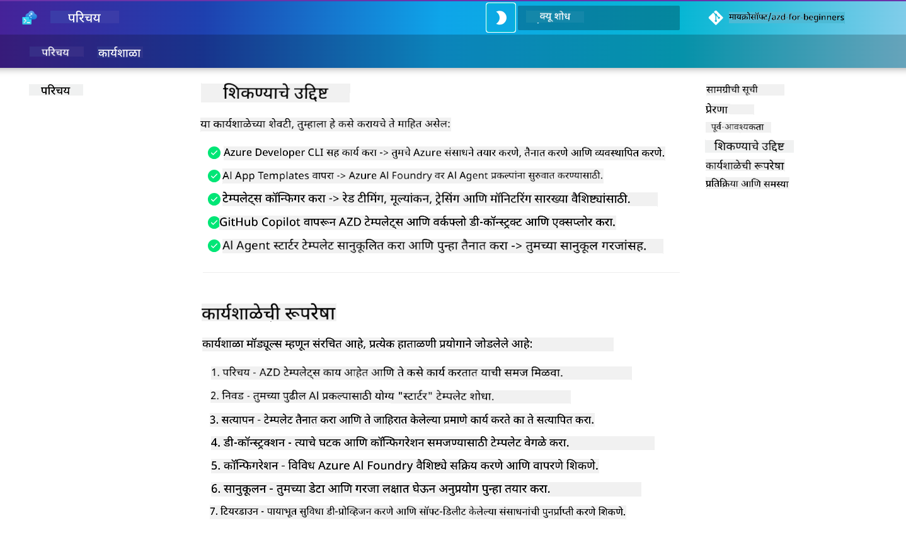

<!--
CO_OP_TRANSLATOR_METADATA:
{
  "original_hash": "9cc966416ab431c38b2ab863884b196c",
  "translation_date": "2025-09-24T13:30:56+00:00",
  "source_file": "workshop/README.md",
  "language_code": "mr"
}
-->
# AI विकसकांसाठी AZD कार्यशाळा

Azure Developer CLI (AZD) शिकण्यासाठी आणि AI अनुप्रयोग तैनातीवर लक्ष केंद्रित करण्यासाठी या हाताळणी कार्यशाळेत आपले स्वागत आहे. ही कार्यशाळा तुम्हाला AZD टेम्पलेट्सचा व्यावहारिक अनुभव मिळवण्यासाठी 3 टप्प्यांमध्ये मदत करते:

1. **शोध** - तुमच्यासाठी योग्य टेम्पलेट शोधा.
1. **तैनात करा** - तैनात करा आणि ते कार्यरत असल्याची खात्री करा.
1. **सानुकूलन** - बदल करा आणि ते तुमच्यासाठी योग्य बनवा!

या कार्यशाळेदरम्यान, तुम्हाला मुख्य विकसक साधने आणि कार्यप्रवाहांची ओळख करून दिली जाईल, ज्यामुळे तुमच्या संपूर्ण विकास प्रवासाला गती मिळेल.

<br/>

## ब्राउझर-आधारित मार्गदर्शक

कार्यशाळेचे धडे Markdown मध्ये आहेत. तुम्ही GitHub मध्ये थेट नेव्हिगेट करू शकता - किंवा खालील स्क्रीनशॉटमध्ये दाखवल्याप्रमाणे ब्राउझर-आधारित पूर्वावलोकन सुरू करू शकता.



या पर्यायाचा वापर करण्यासाठी - रेपॉझिटरी तुमच्या प्रोफाइलवर फोर्क करा आणि GitHub Codespaces सुरू करा. एकदा VS Code टर्मिनल सक्रिय झाल्यावर, हा आदेश टाइप करा:

```bash title="" linenums="0"
mkdocs serve > /dev/null 2>&1 &
```

काही सेकंदांत, तुम्हाला एक पॉप-अप संवाद दिसेल. `ब्राउझरमध्ये उघडा` पर्याय निवडा. वेब-आधारित मार्गदर्शक आता नवीन ब्राउझर टॅबमध्ये उघडेल. या पूर्वावलोकनाचे काही फायदे:

1. **अंतर्गत शोध** - कीवर्ड किंवा धडे पटकन शोधा.
1. **कॉपी आयकॉन** - कोडब्लॉक्सवर होवर करा आणि हा पर्याय पहा.
1. **थीम टॉगल** - डार्क आणि लाइट थीममध्ये स्विच करा.
1. **मदत मिळवा** - फूटरमधील Discord आयकॉनवर क्लिक करा आणि सामील व्हा!

<br/>

## कार्यशाळेचा आढावा

**कालावधी:** 3-4 तास  
**स्तर:** नवशिक्या ते मध्यम  
**पूर्वतयारी:** Azure, AI संकल्पना, VS Code आणि कमांड-लाइन साधनांची ओळख.

ही एक हाताळणी कार्यशाळा आहे जिथे तुम्ही प्रत्यक्ष कृती करून शिकता. एकदा तुम्ही व्यायाम पूर्ण केल्यावर, सुरक्षा आणि उत्पादकता सर्वोत्तम पद्धतींमध्ये तुमचा शिक्षण प्रवास सुरू ठेवण्यासाठी AZD For Beginners अभ्यासक्रमाचा आढावा घेण्याची शिफारस केली जाते.

| वेळ| मॉड्यूल  | उद्दिष्ट |
|:---|:---|:---|
| 15 मिनिटे | [परिचय](docs/instructions/0-Introduction.md) | उद्दिष्टे समजून घ्या |
| 30 मिनिटे | [AI टेम्पलेट निवडा](docs/instructions/1-Select-AI-Template.md) | पर्याय शोधा आणि स्टार्टर निवडा | 
| 30 मिनिटे | [AI टेम्पलेट सत्यापित करा](docs/instructions/2-Validate-AI-Template.md) | Azure वर डिफॉल्ट सोल्यूशन तैनात करा |
| 30 मिनिटे | [AI टेम्पलेट विघटन करा](docs/instructions/3-Deconstruct-AI-Template.md) | रचना आणि कॉन्फिगरेशन एक्सप्लोर करा |
| 30 मिनिटे | [AI टेम्पलेट कॉन्फिगर करा](docs/instructions/4-Configure-AI-Template.md) | उपलब्ध वैशिष्ट्ये सक्रिय करा आणि वापरून पहा |
| 30 मिनिटे | [AI टेम्पलेट सानुकूलित करा](docs/instructions/5-Customize-AI-Template.md) | टेम्पलेट तुमच्या गरजेनुसार बदला |
| 30 मिनिटे | [इन्फ्रास्ट्रक्चर काढा](docs/instructions/6-Teardown-Infrastructure.md) | संसाधने साफ करा आणि सोडा |
| 15 मिनिटे | [गोष्टींचा आढावा आणि पुढील पावले](docs/instructions/7-Wrap-up.md) | शिक्षण संसाधने, कार्यशाळा आव्हान |

<br/>

## तुम्ही काय शिकाल

AZD टेम्पलेटला Azure AI Foundry वर एंड-टू-एंड विकासासाठी विविध क्षमता आणि साधने एक्सप्लोर करण्यासाठी एक शिक्षण सॅंडबॉक्स म्हणून विचार करा. कार्यशाळा संपल्यानंतर, तुम्हाला या संदर्भातील विविध साधने आणि संकल्पनांची सहज समज मिळेल.

| संकल्पना  | उद्दिष्ट |
|:---|:---|
| **Azure Developer CLI** | साधन आदेश आणि कार्यप्रवाह समजून घ्या |
| **AZD टेम्पलेट्स**| प्रकल्प रचना आणि कॉन्फिगरेशन समजून घ्या |
| **Azure AI Agent**| Azure AI Foundry प्रकल्प तैनात करा |
| **Azure AI Search**| एजंट्ससह संदर्भ अभियांत्रिकी सक्षम करा |
| **Observability**| ट्रेसिंग, मॉनिटरिंग आणि मूल्यांकन एक्सप्लोर करा |
| **Red Teaming**| विरोधी चाचणी आणि उपाय एक्सप्लोर करा |

<br/>

## कार्यशाळेची रचना

कार्यशाळा टेम्पलेट शोधण्यापासून ते तैनात करणे, विघटन करणे आणि सानुकूलित करणे - अधिकृत [Getting Started with AI Agents](https://github.com/Azure-Samples/get-started-with-ai-agents) स्टार्टर टेम्पलेटचा आधार म्हणून प्रवास घेण्यासाठी रचलेली आहे.

### [मॉड्यूल 1: AI टेम्पलेट निवडा](docs/instructions/1-Select-AI-Template.md) (30 मिनिटे)

- AI टेम्पलेट्स म्हणजे काय?
- AI टेम्पलेट्स कुठे सापडू शकतात?
- AI एजंट्स तयार करण्यास सुरुवात कशी करावी?
- **लॅब**: GitHub Codespaces सह क्विकस्टार्ट

### [मॉड्यूल 2: AI टेम्पलेट सत्यापित करा](docs/instructions/2-Validate-AI-Template.md) (30 मिनिटे)

- AI टेम्पलेट आर्किटेक्चर म्हणजे काय?
- AZD विकास कार्यप्रवाह म्हणजे काय?
- AZD विकासासाठी मदत कशी मिळवायची?
- **लॅब**: AI एजंट्स टेम्पलेट तैनात करा आणि सत्यापित करा

### [मॉड्यूल 3: AI टेम्पलेट विघटन करा](docs/instructions/3-Deconstruct-AI-Template.md) (30 मिनिटे)

- तुमचे वातावरण `.azure/` मध्ये एक्सप्लोर करा
- तुमची संसाधन सेटअप `infra/` मध्ये एक्सप्लोर करा
- तुमचे AZD कॉन्फिगरेशन `azure.yaml` मध्ये एक्सप्लोर करा
- **लॅब**: पर्यावरणीय व्हेरिएबल्स बदला आणि पुन्हा तैनात करा

### [मॉड्यूल 4: AI टेम्पलेट कॉन्फिगर करा](docs/instructions/4-Configure-AI-Template.md) (30 मिनिटे)
- एक्सप्लोर करा: Retrieval Augmented Generation
- एक्सप्लोर करा: Agent Evaluation & Red Teaming
- एक्सप्लोर करा: Tracing & Monitoring
- **लॅब**: AI Agent + Observability एक्सप्लोर करा

### [मॉड्यूल 5: AI टेम्पलेट सानुकूलित करा](docs/instructions/5-Customize-AI-Template.md) (30 मिनिटे)
- परिभाषित करा: PRD सह परिदृश्य आवश्यकता
- कॉन्फिगर करा: AZD साठी पर्यावरणीय व्हेरिएबल्स
- अंमलात आणा: अतिरिक्त कार्यांसाठी लाइफसायकल हुक्स
- **लॅब**: माझ्या परिदृश्यासाठी टेम्पलेट सानुकूलित करा

### [मॉड्यूल 6: इन्फ्रास्ट्रक्चर काढा](docs/instructions/6-Teardown-Infrastructure.md) (30 मिनिटे)
- पुनरावलोकन: AZD टेम्पलेट्स म्हणजे काय?
- पुनरावलोकन: Azure Developer CLI का वापरायचा?
- पुढील पावले: वेगळे टेम्पलेट वापरून पहा!
- **लॅब**: इन्फ्रास्ट्रक्चर डीप्रोव्हिजन करा आणि साफ करा

<br/>

## कार्यशाळा आव्हान

तुम्हाला स्वतःला अधिक करण्याचे आव्हान द्यायचे आहे का? येथे काही प्रकल्प सूचना आहेत - किंवा तुमच्या कल्पना आमच्यासोबत शेअर करा!!

| प्रकल्प | वर्णन |
|:---|:---|
|1. **एक जटिल AI टेम्पलेट विघटन करा** | आम्ही रेखाटलेला कार्यप्रवाह आणि साधने वापरा आणि वेगळ्या AI सोल्यूशन टेम्पलेट तैनात, सत्यापित आणि सानुकूलित करू शकता का ते पहा. _तुम्ही काय शिकलात?_|
|2. **तुमच्या परिदृश्यासह सानुकूलित करा**  | वेगळ्या परिदृश्यासाठी PRD (Product Requirements Document) लिहिण्याचा प्रयत्न करा. मग GitHub Copilot चा वापर करून तुमच्या टेम्पलेट रेपोमध्ये Agent Model मध्ये जा - आणि त्याला तुमच्यासाठी सानुकूलन कार्यप्रवाह तयार करण्यास सांगा. _तुम्ही काय शिकलात? तुम्ही या सूचनांमध्ये सुधारणा कशी करू शकता?_|
| | |

## अभिप्राय आहे का?

1. या रेपॉझिटरीवर एक समस्या पोस्ट करा - `Workshop` टॅग करा.
1. Azure AI Foundry Discord मध्ये सामील व्हा - तुमच्या सहकाऱ्यांशी कनेक्ट व्हा!


| | | 
|:---|:---|
| **📚 कोर्स होम**| [AZD For Beginners](../README.md)|
| **📖 दस्तऐवज** | [AI टेम्पलेट्ससह सुरुवात करा](https://learn.microsoft.com/en-us/azure/ai-foundry/how-to/develop/ai-template-get-started)|
| **🛠️AI टेम्पलेट्स** | [Azure AI Foundry Templates](https://ai.azure.com/templates) |
|**🚀 पुढील पावले** | [आव्हान स्वीकारा](../../../workshop) |
| | |

<br/>

---

**मागील:** [AI Troubleshooting Guide](../docs/troubleshooting/ai-troubleshooting.md) | **पुढील:** [लॅब 1: AZD मूलभूत गोष्टी](../../../workshop/lab-1-azd-basics)

**AZD सह AI अनुप्रयोग तयार करण्यास सुरुवात करण्यासाठी तयार आहात?**

[लॅब 1: AZD Foundations सुरू करा →](./lab-1-azd-basics/README.md)

---

