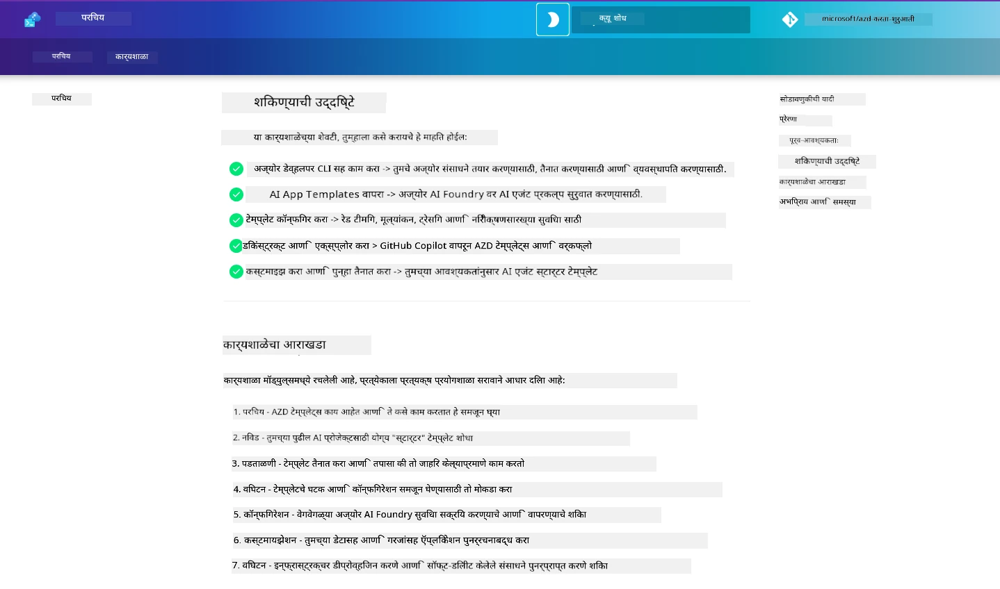

<div align="center">
  <div style="background: linear-gradient(135deg, #0078d4, #106ebe); border-radius: 10px; padding: 20px; margin: 20px 0; box-shadow: 0 4px 15px rgba(0, 120, 212, 0.3); border: 2px solid #005a9e;">
    <h2 style="color: white; margin: 0; font-size: 24px; text-shadow: 1px 1px 2px rgba(0,0,0,0.3);">
      🎯 एझेड फॉर एआय डेव्हलपर्स वर्कशॉप
    </h2>
    <p style="color: white; margin: 10px 0 0 0; font-size: 16px; text-shadow: 1px 1px 2px rgba(0,0,0,0.3);">
      <strong>एझ्योर डेव्हलपर CLI सह AI अनुप्रयोग तयार करण्यासाठी एक प्रत्यक्ष कार्यशाळा.</strong><br>
      AZD टेम्प्लेट्स आणि AI डिप्लॉयमेंट वर्कफ्लोजमध्ये पारंगत होण्यासाठी 7 मॉड्यूल पूर्ण करा.
    </p>
    <div style="margin-top: 15px;">
      <span style="background: rgba(255,255,255,0.2); padding: 5px 10px; border-radius: 15px; color: white; font-size: 14px;">
        📅 शेवटचा अपडेट: फेब्रुवारी 2026
      </span>
    </div>
  </div>
</div>

# एझेड फॉर एआय डेव्हलपर्स वर्कशॉप

एझ्योर डेव्हलपर CLI (AZD) शिकण्यासाठी प्रत्यक्ष कार्यशाळेत आपले स्वागत आहे ज्याचा केंद्रबिंदू AI अनुप्रयोग डिप्लॉयमेंट आहे. ही कार्यशाळा आपल्याला AZD टेम्प्लेट्सची प्रत्यक्ष समज 3 टप्प्यांत घेऊन जाण्यास मदत करते:

1. **शोध** - आपल्या साठी योग्य टेम्प्लेट शोधा.
1. **डिप्लॉयमेंट** - डिप्लॉय करा आणि ते कार्य करत असल्याची खात्री करा.
1. **सानुकूलन** - स्वतःसाठी बदल करा आणि पुनरावृत्ती करा!

या कार्यशाळेच्या कालावधीत, आपण मुख्य डेव्हलपर साधने आणि वर्कफ्लोजची ओळख करून दिली जाईल, ज्यामुळे आपली एकूण विकास प्रक्रिया सुलभ होईल.

<br/>

## ब्राउझर-आधारित मार्गदर्शक

कार्यशाळेची धडे Markdown मध्ये आहेत. आपण त्यांना GitHub मध्ये थेट शोधू शकता - किंवा खालील स्क्रीनशॉटमध्ये दाखवलेल्या प्रमाणे ब्राउझर-आधारित पूर्वावलोकन सुरू करू शकता.



या पर्यायाचा वापर करण्यासाठी - रिपॉझिटरी आपल्या प्रोफाईलमध्ये फोर्क करा, आणि GitHub Codespaces सुरू करा. एकदा VS कोड टर्मिनल सक्रिय झाल्यावर, हा कमांड टाइप करा:

```bash title="" linenums="0"
mkdocs serve > /dev/null 2>&1 &
```

काही सेकंदांत, आपण एक पॉप-अप संवाद पाहाल. `ब्राउझरमध्ये उघडा` पर्याय निवडा. वेब-आधारित मार्गदर्शक आता नवीन ब्राउझर टॅबमध्ये उघडेल. या पूर्वावलोकनाचे काही फायदे:

1. **बिल्ट-इन शोध** - कीवर्ड्स किंवा धडे पटकन शोधा.
1. **कॉपी आयकॉन** - कोडब्लॉक्सवर होवर करा ही पर्याय दिसेल.
1. **थीम टॉगल** - डार्क आणि लाईट थीममध्ये स्विच करा.
1. **मदत मिळवा** - पायथ्याशी असलेल्या Discord आयकॉनवर क्लिक करून सामील व्हा!

<br/>

## कार्यशाळेचा आढावा

**कालावधी:** 3-4 तास  
**पातळी:** प्रारंभिक ते मध्यम  
**पूर्वअटी:** Azure, AI संकल्पना, VS Code आणि कमांड-लाइन साधनांच्या परिचयाची आवश्यकता.

ही एक प्रत्यक्ष कार्यशाळा आहे जिथे आपण प्रत्यक्ष करून शिकता. एकदा आपण व्यायाम पूर्ण केल्यावर, आम्ही AZD फॉर बिगिनर्स अभ्यासक्रम पुनरावलोकन करण्याची शिफारस करतो ज्यामुळे आपण सुरक्षा व उत्पादकता सर्वोत्तम पद्धतींमध्ये आपल्या शिकण्याची यात्रा सुरू ठेवू शकता.

| वेळ| मॉड्यूल  | उद्दिष्ट |
|:---|:---|:---|
| 15 मिनिटे | [परिचय](docs/instructions/0-Introduction.md) | वेदिका तयार करा, उद्दिष्टे समजून घ्या |
| 30 मिनिटे | [AI टेम्प्लेट निवडा](docs/instructions/1-Select-AI-Template.md) | पर्याय शोधा आणि सुरुवातीची निवड करा | 
| 30 मिनिटे | [AI टेम्प्लेट सत्यापित करा](docs/instructions/2-Validate-AI-Template.md) | Azure वर डीफॉल्ट सोल्यूशन डिप्लॉय करा |
| 30 मिनिटे | [AI टेम्प्लेट डीकन्स्ट्रक्ट करा](docs/instructions/3-Deconstruct-AI-Template.md) | संरचना आणि कॉन्फिगरेशन तपासा |
| 30 मिनिटे | [AI टेम्प्लेट कॉन्फिगर करा](docs/instructions/4-Configure-AI-Template.md) | सक्रिय करा आणि उपलब्ध वैशिष्ट्ये वापरून पाहा |
| 30 मिनिटे | [AI टेम्प्लेट सानुकूलित करा](docs/instructions/5-Customize-AI-Template.md) | टेम्प्लेट आपल्या गरजेनुसार अनुकूलित करा |
| 30 मिनिटे | [इन्फ्रास्ट्रक्चर हटवा](docs/instructions/6-Teardown-Infrastructure.md) | संसाधने साफ करा आणि मुक्त करा |
| 15 मिनिटे | [समीक्षा आणि पुढील पायऱ्या](docs/instructions/7-Wrap-up.md) | शिक्षण संसाधने, कार्यशाळा आव्हान |

<br/>

## आपण काय शिकाल

AZD टेम्प्लेटला Microsoft Foundry वरील अखंड विकासासाठी विविध साधने आणि क्षमता शोधण्यासाठी शिकण्याचा सॅंडबॉक्स म्हणून विचार करा. या कार्यशाळेच्या अखेरीस, आपल्याला या संदर्भातील विविध साधने आणि संकल्पनांबाबत अंतर्ज्ञान प्राप्त झालेले असावे.

| संकल्पना  | उद्दिष्ट |
|:---|:---|
| **Azure Developer CLI** | साधनांचे कमांड्स आणि कार्यपद्धती समजून घ्या |
| **AZD टेम्प्लेट्स**| प्रोजेक्ट रचना आणि कॉन्फिगरेशन समजून घ्या |
| **Azure AI एजंट**| Microsoft Foundry प्रोजेक्ट साठी प्राव्हिजन व डिप्लॉय करा |
| **Azure AI सर्च**| एजंट्ससह संदर्भ अभियांत्रण सक्षम करा |
| **निरीक्षणीयता**| ट्रेसिंग, मॉनिटरींग आणि मूल्यमापनांचा अभ्यास करा |
| **रेड टीमिंग**| प्रतिस्पर्धात्मक चाचणी आणि प्रतिबंध यांचा अभ्यास करा |

<br/>

## कार्यशाळेची रचना

ही कार्यशाळा आपल्याला टेम्प्लेट शोध, डिप्लॉयमेंट, विघटन, आणि सानुकूलनाच्या प्रवासावर घेऊन जाते - अधिकृत [Getting Started with AI Agents](https://github.com/Azure-Samples/get-started-with-ai-agents) स्टार्टर टेम्प्लेटचा आधार घेऊन.

### [मॉड्यूल 1: AI टेम्प्लेट निवडा](docs/instructions/1-Select-AI-Template.md) (30 मिनिटे)

- AI टेम्प्लेट काय आहेत?
- AI टेम्प्लेट कुठे सापडतील?
- AI एजंट्स तयार करण्यासाठी कसे सुरुवात करावी?
- **लॅब**: GitHub Codespaces सह जलद प्रारंभ

### [मॉड्यूल 2: AI टेम्प्लेट सत्यापित करा](docs/instructions/2-Validate-AI-Template.md) (30 मिनिटे)

- AI टेम्प्लेट आर्किटेक्चर काय आहे?
- AZD विकास कार्यप्रवाह काय आहे?
- AZD विकासासाठी मदत कशी मिळवायची?
- **लॅब**: AI एजंट्स टेम्प्लेट डिप्लॉय आणि सत्यापित करा

### [मॉड्यूल 3: AI टेम्प्लेट डीकन्स्ट्रक्ट करा](docs/instructions/3-Deconstruct-AI-Template.md) (30 मिनिटे)

- `.azure/` मध्ये तुमचे वातावरण तपासा
- `infra/` मध्ये तुमची संसाधन व्यवस्था तपासा
- `azure.yaml`s मध्ये AZD कॉन्फिगरेशन तपासा
- **लॅब**: वातावरण बदलून पुन्हा डिप्लॉय करा

### [मॉड्यूल 4: AI टेम्प्लेट कॉन्फिगर करा](docs/instructions/4-Configure-AI-Template.md) (30 मिनिटे)
- रिस्ट्रिव्हल ऑगमेंटेड जनरेशन तपासा
- एजंट मूल्यांकन आणि रेड टीमिंग तपासा
- ट्रेसिंग आणि मॉनिटरींग तपासा
- **लॅब**: AI एजंट + निरीक्षणीयता तपासा

### [मॉड्यूल 5: AI टेम्प्लेट सानुकूलित करा](docs/instructions/5-Customize-AI-Template.md) (30 मिनिटे)
- PRD सह परिदृश्य आवश्यकतांची व्याख्या करा
- AZD साठी वातावरणाच्या चलांची कॉन्फिगरेशन करा
- अतिरिक्त कामांसाठी लाइफसायकल हुक्स अंमलात आणा
- **लॅब**: माझ्या परिदृश्यासाठी टेम्प्लेट सानुकूलित करा

### [मॉड्यूल 6: इन्फ्रास्ट्रक्चर हटवा](docs/instructions/6-Teardown-Infrastructure.md) (30 मिनिटे)
- पुनरावलोकन: AZD टेम्प्लेट काय आहेत?
- पुनरावलोकन: Azure Developer CLI वापरण्याचे फायदे काय आहेत?
- पुढील पावले: वेगळा टेम्प्लेट वापरून पहा!
- **लॅब**: इन्फ्रास्ट्रक्चर हटवा आणि साफसफाई करा

<br/>

## कार्यशाळा आव्हान

आपण स्वतःला अधिक आव्हान देऊ इच्छिता? येथे काही प्रकल्प सूचविले आहेत - किंवा आपले कल्पना आमच्यासोबत शेअर करा!!

| प्रकल्प | वर्णन |
|:---|:---|
|1. **एक क्लिष्ट AI टेम्प्लेट डीकन्स्ट्रक्ट करा** | आम्ही नमूद केलेल्या वर्कफ्लो आणि साधनांचा वापर करून वेगळा AI सोल्यूशन टेम्प्लेट डिप्लॉय, सत्यापित आणि सानुकूलित करू शकाल काय? _आपण काय शिकलात?_|
|2. **आपल्या परिदृश्यासह सानुकूलित करा**  | वेगळ्या परिदृश्यासाठी PRD (उत्पादन आवश्यकतांचे दस्तऐवज) तयार करण्याचा प्रयत्न करा. नंतर GitHub Copilot वापरून Agent Model मध्ये आपला टेम्प्लेट रिपॉजिटरी वापरा - आणि त्याला सानुकूलन वर्कफ्लो तयार करण्यास म्हणा. _आपण काय शिकलात? या सूचनांमध्ये आपण कशी सुधारणा करू शकता?_|
| | |

## अभिप्राय आहे का?

1. या रिपोवर एक समस्या पोस्ट करा - सोयीसाठी `Workshop` टॅग वापरा.
1. Microsoft Foundry Discord मध्ये सामील व्हा - आपल्या सहकाऱ्यांशी संपर्क करा!


| | | 
|:---|:---|
| **📚 कोर्स होम**| [AZD For Beginners](../README.md)|
| **📖 दस्तऐवजीकरण** | [AI टेम्प्लेट्ससह प्रारंभ करा](https://learn.microsoft.com/en-us/azure/ai-foundry/how-to/develop/ai-template-get-started)|
| **🛠️AI टेम्प्लेट्स** | [Microsoft Foundry टेम्प्लेट्स](https://ai.azure.com/templates) |
|**🚀 पुढील पावले** | [वर्कशॉप सुरू करा](../../../workshop) |
| | |

<br/>

---

**नेव्हिगेशन:** [मुख्य कोर्स](../README.md) | [परिचय](docs/instructions/0-Introduction.md) | [मॉड्यूल 1: टेम्प्लेट निवडा](docs/instructions/1-Select-AI-Template.md)

**AZD सह AI अनुप्रयोग तयार करण्यासाठी तयार आहात का?**

[वर्कशॉप सुरू करा: परिचय →](docs/instructions/0-Introduction.md)

---

<!-- CO-OP TRANSLATOR DISCLAIMER START -->
**अस्वीकरण**:
हा दस्तऐवज AI अनुवाद सेवा [Co-op Translator](https://github.com/Azure/co-op-translator) च्या सहाय्याने अनुवादित केला आहे. आम्ही अचूकतेसाठी प्रयत्नशील आहोत, परंतु कृपया लक्षात घ्या की स्वयंचलित अनुवादात चूका किंवा गैरसमज होऊ शकतात. मूळ दस्तऐवज त्याच्या स्थानिक भाषेत अधिकृत स्रोत मानला जावा. महत्त्वाच्या माहितीकरिता व्यावसायिक मानवी अनुवादाचा सल्ला दिला जातो. या अनुवादाच्या वापरातून उद्भवणाऱ्या कोणत्याही गैरसमज किंवा गैरअर्थासाठी आम्ही जबाबदार नाही.
<!-- CO-OP TRANSLATOR DISCLAIMER END -->