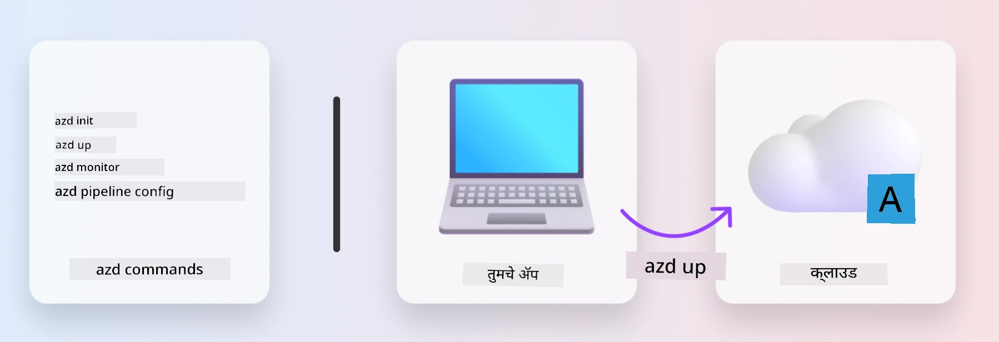
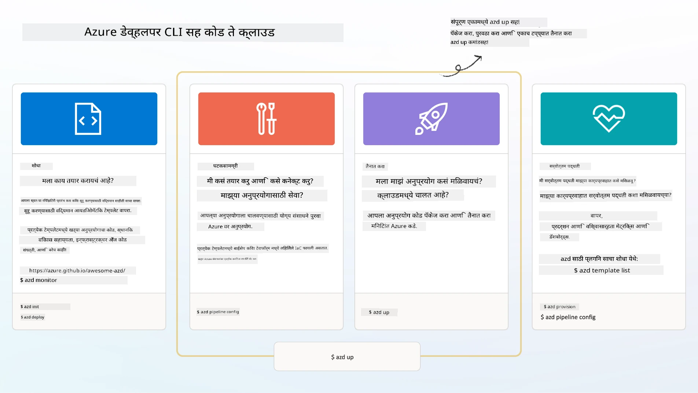

# 1. टेम्पलेट निवडा

!!! tip "या मॉड्युलच्या शेवटी आपण हे करू शकाल"

    - [ ] AZD टेम्पलेट काय आहेत हे वर्णन करा
    - [ ] AI साठी AZD टेम्पलेट शोधा आणि वापरा
    - [ ] AI Agents टेम्पलेटसह सुरू करा
    - [ ] **Lab 1:** Codespaces किंवा dev कंटेनरमध्ये AZD क्विकस्टार्ट

---

## 1. बांधकामदाराची उपमा

नवीन एंटरप्राइझ-तयार AI अनुप्रयोग _शून्यातून_ तयार करणे भयंकर वाटू शकते. हे आपल्या नवीन घराला स्वतः दगड-दगड करून बांधण्यासारखेच आहे. होय, हे करता येते! पण हे अपेक्षित अंतिम निकाल मिळविण्याचा सर्वात प्रभावी मार्ग नाही!

त्याऐवजी, आपण बहुतेकदा विद्यमान _डिझाईन ब्ल्यूप्रिंट_ पासून सुरू करतो, आणि त्यानुसार आपल्या वैयक्तिक गरजांसाठी ते सानुकूल करण्यासाठी आर्किटेक्टबरोबर काम करतो. आणि बुद्धिमान अनुप्रयोग तयार करताना नेमका तोच दृष्टिकोन घ्यावा.

पण हे डिझाईन ब्ल्यूप्रिंट कुठे मिळतील? आणि आपल्याला असा आर्किटेक्ट कसा मिळेल जो आपल्याला हे ब्ल्यूप्रिंट कसे सानुकूल करायचे आणि स्वतः तैनात कसे करायचे ते शिकवायला इच्छुक असेल? या वर्कशॉपमध्ये, आम्ही आपणास तीन तंत्रज्ञानांशी परिचित करून देऊन त्या प्रश्नांची उत्तरे देतो:

1. [Azure Developer CLI](https://aka.ms/azd) - एक ओपन-सोर्स साधन जे स्थानिक विकास (build) पासून क्लाउड तैनाती (ship) पर्यंतच्या विकसक मार्गाला वेग देते.
1. [Microsoft Foundry Templates](https://ai.azure.com/templates) - AI सोल्यूशन आर्किटेक्चर तैनात करण्यासाठी सॅम्पल कोड, इन्फ्रास्ट्रक्चर आणि कॉन्फिगरेशन फाइल्स असलेली प्रमाणित ओपन-सोर्स रेपॉझिटरी.
1. [GitHub Copilot Agent Mode](https://code.visualstudio.com/docs/copilot/chat/chat-agent-mode) - Azure ज्ञानावर आधारित एक कोडिंग एजंट, जो नैसर्गिक भाषेचा वापर करून कोडबेसमध्ये नेव्हिगेट करण्यात आणि बदल करण्यात आपली मार्गदर्शना करू शकतो.

या साधनांसह, आपण योग्य टेम्पलेट _शोधू_ शकतो, ते कार्य करते का ते सत्यापित करण्यासाठी ते _तैनात_ करू शकतो, आणि आपल्या विशिष्ट परिस्थितींसाठी ते _सानुकूल_ करू शकतो. चला सुरवात करूया आणि हे कसे काम करते ते शिकूया.

---

## 2. Azure Developer CLI

The [Azure Developer CLI](https://learn.microsoft.com/en-us/azure/developer/azure-developer-cli/) (or `azd`) हा एक ओपन-सोर्स कमांडलाइन टूल आहे जो आपल्या कोड-टू-क्लाउड प्रवासास वेग देऊ शकतो, आणि हा विकास-मैत्रीपूर्ण कमांड्सचा सेट प्रदान करतो जो आपल्या IDE (development) आणि CI/CD (devops) वातावरणांमध्ये सातत्याने कार्य करतो.

`azd` सह, आपली तैनाती प्रवास इतकी सोपी असू शकते:

- `azd init` - विद्यमान AZD टेम्पलेटमधून नवीन AI प्रोजेक्ट प्रारंभ करते.
- `azd up` - एका स्टेपमध्ये इन्फ्रास्ट्रक्चर प्रोव्हिजन आणि आपले अनुप्रयोग तैनात करते.
- `azd monitor` - आपल्या तैनात अनुप्रयोगासाठी रिअल-टाइम मॉनिटरिंग आणि डायग्नॉस्टिक्स मिळवा.
- `azd pipeline config` - Azure वर तैनाती स्वयंचलित करण्यासाठी CI/CD पाइपलाइन्स सेटअप करा.

**🎯 | EXERCISE**: <br/> आपल्या सध्याच्या वर्कशॉप वातावरणात `azd` कमांडलाइन टूल एक्सप्लोर करा. हे GitHub Codespaces, एक dev कंटेनर, किंवा पूर्व-आवश्यकतांसह स्थानिक क्लोन असू शकते. काय साधन करू शकते हे पाहण्यासाठी खालील कमांड टाइप करून प्रारंभ करा:

```bash title="" linenums="0"
azd help
```



---

## 3. AZD टेम्पलेट

`azd` हे साध्य करण्यासाठी, त्याला कोणते इन्फ्रास्ट्रक्चर प्रोव्हिजन करायचे आहे, कोणती कॉन्फिगरेशन सेटिंग्स लागू करायच्या आहेत, आणि कोणते अनुप्रयोग तैनात करायचे आहेत हे माहित असणे आवश्यक आहे. ह्याच ठिकाणी [AZD templates](https://learn.microsoft.com/en-us/azure/developer/azure-developer-cli/azd-templates?tabs=csharp) उपयुक्त ठरतात.

AZD टेम्पलेट्स ओपन-सोर्स रेपॉझिटरीज असतात जे सॅम्पल कोडसह इन्फ्रास्ट्रक्चर आणि कॉन्फिगरेशन फाइल्स एकत्र करतात ज्या सोल्यूशन आर्किटेक्चर तैनात करण्यासाठी आवश्यक असतात.
Infrastructure-as-Code (IaC) पद्धतीचा वापर करून, ते टेम्पलेट रिसोर्स परिभाषा आणि कॉन्फिगरेशन सेटिंग्जना आवृत्ती-नियंत्रित (source control) करण्यास अनुमती देतात (जसे अ‍ॅप सोर्स कोडसाठी) - ज्यामुळे त्या प्रोजेक्टच्या वापरकर्त्यांसाठी पुन्हा वापरता येणारी आणि सातत्यपूर्ण वर्कफ्लोज तयार होतात.

आपल्या परिस्थितीसाठी AZD टेम्पलेट तयार करताना किंवा पुन्हा वापरताना, या प्रश्नांचा विचार करा:

1. आपण काय तयार करत आहात? → त्यासाठी कोणतेही स्टार्टर कोड असलेले टेम्पलेट आहे का?
1. आपले सोल्यूशन कसे आर्किटेक्ट आहे? → आवश्यक रिसोर्सेस असलेले टेम्पलेट आहे का?
1. आपले सोल्यूशन कसे तैनात केले जाते? → `azd deploy` सह प्री/पोस्ट-प्रोसेसिंग हुक्स विचारात घ्या!
1. आपण हे आणखी कसे ऑप्टिमाइझ करू शकता? → बिल्ट-इन मॉनिटरिंग आणि ऑटोमेशन पाइपलाइन्स बद्दल विचार करा!

**🎯 | EXERCISE**: <br/> 
[Awesome AZD](https://azure.github.io/awesome-azd/) गॅलरीला भेट द्या आणि फिल्टर्स वापरून सध्या उपलब्ध 250+ टेम्पलेट एक्सप्लोर करा. पाहा की आपल्याला आपल्या परिस्थितीच्या गरजांशी जुळणारे कोणते टेम्पलेट सापडते का.



---

## 4. AI ऍप टेम्पलेट्स

AI-समर्थित अनुप्रयोगांसाठी, Microsoft विशेष टेम्पलेट्स प्रदान करतो ज्यात **Microsoft Foundry** आणि **Foundry Agents** समाविष्ट आहेत. हे टेम्पलेट्स बुद्धिमान, उत्पादन-तैयार अनुप्रयोग तयार करण्याचा आपला मार्ग वेगवान करतात.

### Microsoft Foundry & Foundry Agents Templates

खालीलमधून एक टेम्पलेट निवडा आणि तैनात करा. प्रत्येक टेम्पलेट [Awesome AZD](https://azure.github.io/awesome-azd/) वर उपलब्ध आहे आणि एका कमांडने इनिशियलाइझ केले जाऊ शकते.

| Template | Description | Deploy Command |
|----------|-------------|----------------|
| **[RAG सह AI चॅट](https://azure.github.io/awesome-azd/?tags=ai&tags=rag)** | Microsoft Foundry वापरून Retrieval Augmented Generation सह चॅट अनुप्रयोग | `azd init -t azure-samples/azure-search-openai-demo` |
| **[Foundry Agent Service Starter](https://azure.github.io/awesome-azd/?tags=ai&tags=agents)** | स्वायत्त कामे पार पाडण्यासाठी Foundry Agents सह AI एजंट तयार करा | `azd init -t azure-samples/foundry-agent-service-starter` |
| **[Multi-Agent Orchestration](https://azure.github.io/awesome-azd/?tags=ai&tags=agents)** | क्लिष्ट वर्कफ्लोजसाठी अनेक Foundry Agents समन्वयित करा | `azd init -t azure-samples/multi-agent-orchestration` |
| **[AI Document Intelligence](https://azure.github.io/awesome-azd/?tags=ai&tags=document)** | Microsoft Foundry मॉडेल्स वापरून दस्तऐवज काढा आणि विश्लेषण करा | `azd init -t azure-samples/ai-document-processing` |
| **[Conversational AI Bot](https://azure.github.io/awesome-azd/?tags=ai&tags=bot)** | Microsoft Foundry एकत्रिकरणासह बुद्धिमान चॅटबॉट तयार करा | `azd init -t azure-samples/ai-chat-protocol` |
| **[AI Image Generation](https://azure.github.io/awesome-azd/?tags=ai&tags=dalle)** | Microsoft Foundry द्वारे DALL-E वापरून प्रतिमा निर्माण करा | `azd init -t azure-samples/ai-image-generation` |
| **[Semantic Kernel Agent](https://azure.github.io/awesome-azd/?tags=ai&tags=semantic-kernel)** | Foundry Agents सह Semantic Kernel वापरून AI एजंट्स | `azd init -t azure-samples/semantic-kernel-agent` |
| **[AutoGen Multi-Agent](https://azure.github.io/awesome-azd/?tags=ai&tags=autogen)** | AutoGen फ्रेमवर्क वापरून मल्टी-एजंट सिस्टीम्स | `azd init -t azure-samples/autogen-multi-agent` |

### जलद प्रारंभ

1. **टेम्पलेट ब्राउझ करा**: [https://azure.github.io/awesome-azd/](https://azure.github.io/awesome-azd/) ला भेट द्या आणि `AI`, `Agents`, किंवा `Microsoft Foundry` ने फिल्टर करा
2. **आपले टेम्पलेट निवडा**: आपल्याच्या वापराच्या प्रकरणाशी जुळणारे टेम्पलेट निवडा
3. **इनिशियलाइझ करा**: आपल्या निवडलेल्या टेम्पलेटसाठी `azd init` कमांड चालवा
4. **तैनात करा**: प्रोव्हिजन आणि तैनात करण्यासाठी `azd up` चालवा

**🎯 | EXERCISE**: <br/>
आपल्या परिस्थितीनुसार वरील टेम्पलेटपैकी एक निवडा:

- **चॅटबोट तयार करायचा आहे?** → **RAG सह AI चॅट** किंवा **Conversational AI Bot** वापरून प्रारंभ करा
- **स्वायत्त एजंट हवे आहेत?** → **Foundry Agent Service Starter** किंवा **Multi-Agent Orchestration** वापरून पहा
- **दस्तऐवज प्रक्रिया करायची आहे?** → **AI Document Intelligence** वापरा
- **AI कोडिंग सहाय्य हवे आहे?** → **Semantic Kernel Agent** किंवा **AutoGen Multi-Agent** तपासा

```bash title="Example: Deploy the AI Chat with RAG template" linenums="0"
azd init -t azure-samples/azure-search-openai-demo
azd up
```

!!! info "अधिक टेम्पलेट एक्सप्लोर करा"
    The [Awesome AZD Gallery](https://azure.github.io/awesome-azd/) मध्ये 250+ टेम्पलेट्स आहेत. भाषा, फ्रेमवर्क, आणि Azure सेवा यांच्या विशिष्ट आवश्यकतांना जुळणारी टेम्पलेट शोधण्यासाठी फिल्टर्स वापरा.

---

<!-- CO-OP TRANSLATOR DISCLAIMER START -->
**अस्वीकरण**:
हा दस्तऐवज एआय अनुवाद सेवा [Co-op Translator](https://github.com/Azure/co-op-translator) वापरून अनुवादित केला गेला आहे. आम्ही अचूकतेसाठी प्रयत्न करतो, परंतु कृपया लक्षात घ्या की स्वयंचलित अनुवादांमध्ये चुका किंवा अचूकतेचा अभाव असू शकतो. मूळ दस्तऐवज त्याच्या मूळ भाषेत अधिकृत स्रोत म्हणून समजला जावा. महत्त्वाच्या माहितीसाठी व्यावसायिक मानवी अनुवाद करणे शिफारस केले जाते. या अनुवादाच्या वापरामुळे उद्भवणाऱ्या कोणत्याही गैरसमजुतींसाठी किंवा चुकीच्या अर्थ लावल्याबद्दल आम्ही जबाबदार नाही.
<!-- CO-OP TRANSLATOR DISCLAIMER END -->