# 2. टेम्पलेटची वैधता तपासा

!!! tip "या मॉड्यूलच्या शेवटी तुम्ही सक्षम असाल"

    - [ ] AI सोल्यूशन आर्किटेक्चरचे विश्लेषण करा
    - [ ] AZD डिप्लॉयमेंट वर्कफ्लो समजून घ्या
    - [ ] AZD वापराबद्दल मदत मिळवण्यासाठी GitHub Copilot वापरा
    - [ ] **प्रयोगशाळा 2:** AI एजंट्स टेम्पलेट डिप्लॉय करा आणि वैधता तपासा

---

## 1. परिचय

[Azure Developer CLI](https://learn.microsoft.com/en-us/azure/developer/azure-developer-cli/) किंवा `azd` हे एक ओपन-सोर्स कमांडलाइन टूल आहे जे Azure वर अॅप्लिकेशन्स तयार करताना आणि डिप्लॉय करताना डेव्हलपर वर्कफ्लो सुलभ करते.

[AZD Templates](https://learn.microsoft.com/azure/developer/azure-developer-cli/azd-templates) हे मानक रिपॉझिटरीज आहेत ज्यामध्ये नमुना अॅप्लिकेशन कोड, _इन्फ्रास्ट्रक्चर कोड_ अॅसेट्स आणि `azd` कॉन्फिगरेशन फाइल्स समाविष्ट आहेत, जे एकत्रित सोल्यूशन आर्किटेक्चर तयार करतात. इन्फ्रास्ट्रक्चरची प्रोव्हिजनिंग `azd provision` कमांड इतकी सोपी होते - तर `azd up` वापरल्याने तुम्ही इन्फ्रास्ट्रक्चर **आणि** तुमचे अॅप्लिकेशन एकाच वेळी डिप्लॉय करू शकता!

यामुळे, तुमच्या अॅप्लिकेशन डेव्हलपमेंट प्रक्रियेला सुरुवात करणे इतके सोपे होते की तुमच्या अॅप्लिकेशन आणि इन्फ्रास्ट्रक्चरच्या गरजांनुसार सर्वात जवळचा _AZD Starter टेम्पलेट_ शोधणे - आणि नंतर तुमच्या परिस्थितीच्या गरजेनुसार रिपॉझिटरी सानुकूलित करणे.

सुरुवात करण्यापूर्वी, Azure Developer CLI इंस्टॉल केले आहे याची खात्री करूया.

1. VS Code टर्मिनल उघडा आणि हा कमांड टाइप करा:

      ```bash title="" linenums="0"
      azd version
      ```

1. तुम्हाला असे काहीतरी दिसेल!

      ```bash title="" linenums="0"
      azd version 1.19.0 (commit b3d68cea969b2bfbaa7b7fa289424428edb93e97)
      ```

**आता तुम्ही azd सह टेम्पलेट निवडण्यासाठी आणि डिप्लॉय करण्यासाठी तयार आहात**

---

## 2. टेम्पलेट निवड

Azure AI Foundry प्लॅटफॉर्ममध्ये [शिफारस केलेल्या AZD टेम्पलेट्सचा संच](https://learn.microsoft.com/en-us/azure/ai-foundry/how-to/develop/ai-template-get-started) आहे जो _मल्टी-एजंट वर्कफ्लो ऑटोमेशन_ आणि _मल्टी-मोडल कंटेंट प्रोसेसिंग_ यासारख्या लोकप्रिय सोल्यूशन परिस्थितींचा समावेश करतो. तुम्ही Azure AI Foundry पोर्टलला भेट देऊन हे टेम्पलेट्स शोधू शकता.

1. [https://ai.azure.com/templates](https://ai.azure.com/templates) ला भेट द्या
1. Azure AI Foundry पोर्टलमध्ये लॉग इन करा - तुम्हाला असे काहीतरी दिसेल.

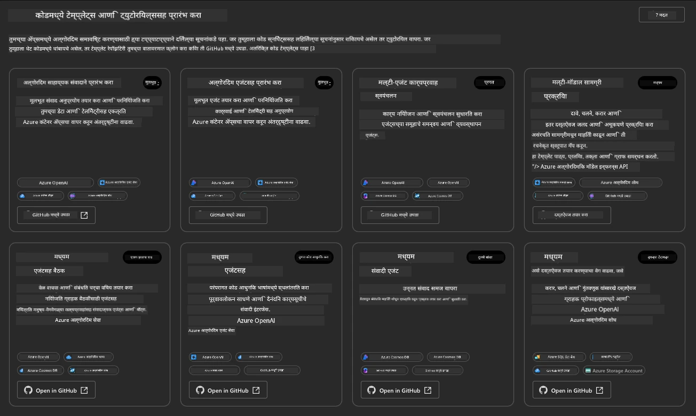

**Basic** पर्याय हे तुमचे स्टार्टर टेम्पलेट्स आहेत:

1. [ ] [Get Started with AI Chat](https://github.com/Azure-Samples/get-started-with-ai-chat) जे Azure Container Apps वर तुमच्या डेटासह एक मूलभूत चॅट अॅप्लिकेशन डिप्लॉय करते. मूलभूत AI चॅटबॉट परिस्थिती एक्सप्लोर करण्यासाठी याचा वापर करा.
1. [X] [Get Started with AI Agents](https://github.com/Azure-Samples/get-started-with-ai-agents) जे Azure AI Agent Service सह एक मानक AI Agent देखील डिप्लॉय करते. टूल्स आणि मॉडेल्सचा समावेश असलेल्या एजंटिक AI सोल्यूशन्सशी परिचित होण्यासाठी याचा वापर करा.

दुसऱ्या लिंकला नवीन ब्राउझर टॅबमध्ये भेट द्या (किंवा संबंधित कार्डसाठी `Open in GitHub` क्लिक करा). तुम्हाला या AZD टेम्पलेटसाठी रिपॉझिटरी दिसेल. README एक्सप्लोर करण्यासाठी एक मिनिट घ्या. अॅप्लिकेशन आर्किटेक्चर असे दिसते:

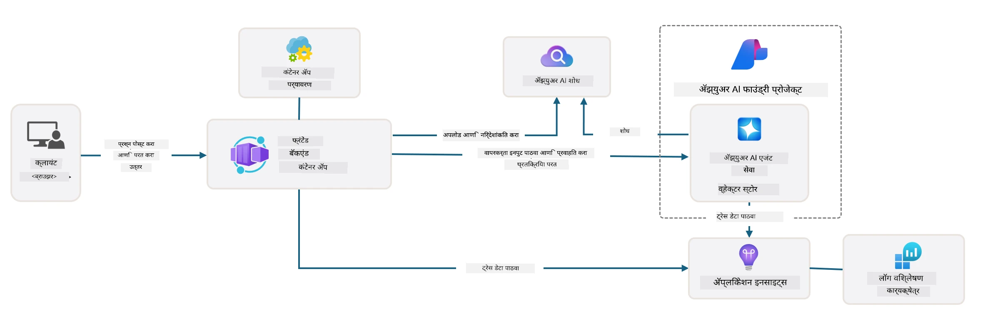

---

## 3. टेम्पलेट सक्रिय करणे

चला हे टेम्पलेट डिप्लॉय करण्याचा प्रयत्न करूया आणि ते वैध आहे याची खात्री करूया. आम्ही [Getting Started](https://github.com/Azure-Samples/get-started-with-ai-agents?tab=readme-ov-file#getting-started) विभागातील मार्गदर्शक तत्त्वांचे अनुसरण करू.

1. [या लिंकवर क्लिक करा](https://github.com/codespaces/new/Azure-Samples/get-started-with-ai-agents) - `Create codespace` ही डीफॉल्ट कृती पुष्टी करा
1. हे नवीन ब्राउझर टॅब उघडते - GitHub Codespaces सत्र पूर्ण लोड होण्याची प्रतीक्षा करा
1. Codespaces मध्ये VS Code टर्मिनल उघडा - खालील कमांड टाइप करा:

   ```bash title="" linenums="0"
   azd up
   ```

या वर्कफ्लो चरण पूर्ण करा:

1. तुम्हाला Azure मध्ये लॉग इन करण्यास सांगितले जाईल - प्रमाणीकरणासाठी सूचना अनुसरण करा
1. तुमच्यासाठी एक अद्वितीय वातावरण नाव प्रविष्ट करा - उदा., मी `nitya-mshack-azd` वापरले
1. हे `.azure/` फोल्डर तयार करेल - तुम्हाला env नावासह एक उपफोल्डर दिसेल
1. तुम्हाला सबस्क्रिप्शन नाव निवडण्यास सांगितले जाईल - डीफॉल्ट निवडा
1. तुम्हाला लोकेशनसाठी विचारले जाईल - `East US 2` वापरा

आता, प्रोव्हिजनिंग पूर्ण होण्याची प्रतीक्षा करा. **याला 10-15 मिनिटे लागतात**

1. पूर्ण झाल्यावर, तुमच्या कन्सोलमध्ये SUCCESS संदेश दिसेल:

      ```bash title="" linenums="0"
      SUCCESS: Your up workflow to provision and deploy to Azure completed in 10 minutes 17 seconds.
      ```
1. तुमच्या Azure पोर्टलमध्ये आता त्या env नावासह प्रोव्हिजन केलेला रिसोर्स ग्रुप असेल:

      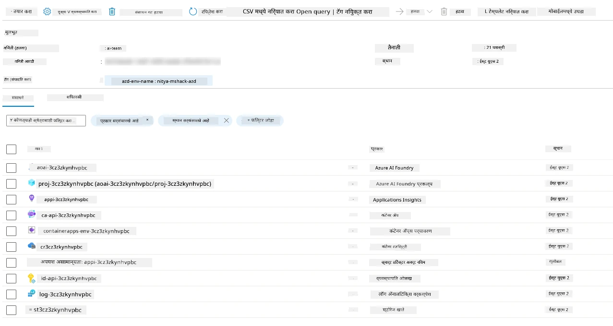

1. **तुम्ही आता डिप्लॉय केलेल्या इन्फ्रास्ट्रक्चर आणि अॅप्लिकेशनची वैधता तपासण्यासाठी तयार आहात**.

---

## 4. टेम्पलेटची वैधता तपासा

1. Azure Portal [Resource Groups](https://portal.azure.com/#browse/resourcegroups) पृष्ठाला भेट द्या - विचारल्यास लॉग इन करा
1. तुमच्या वातावरणाच्या नावासाठी RG वर क्लिक करा - तुम्हाला वरील पृष्ठ दिसेल

      - Azure Container Apps रिसोर्सवर क्लिक करा
      - _Essentials_ विभागातील (वर उजवीकडे) Application Url वर क्लिक करा

1. तुम्हाला होस्ट केलेले अॅप्लिकेशन फ्रंट-एंड UI असे दिसेल:

   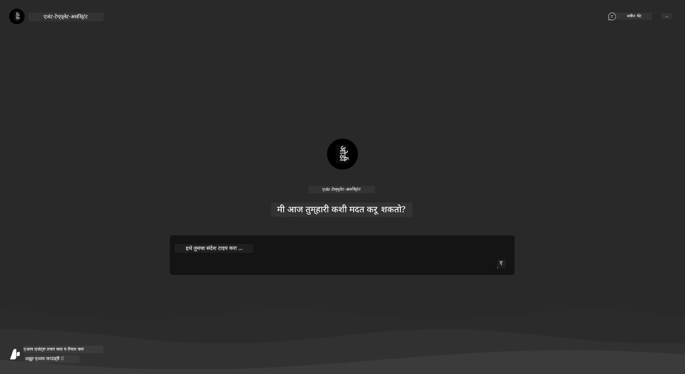

1. काही [नमुना प्रश्न](https://github.com/Azure-Samples/get-started-with-ai-agents/blob/main/docs/sample_questions.md) विचारण्याचा प्रयत्न करा

      1. विचारा: ```What is the capital of France?``` 
      1. विचारा: ```What's the best tent under $200 for two people, and what features does it include?```

1. तुम्हाला खाली दाखवलेल्या उत्तरांसारखे उत्तर मिळेल. _पण हे कसे कार्य करते?_ 

      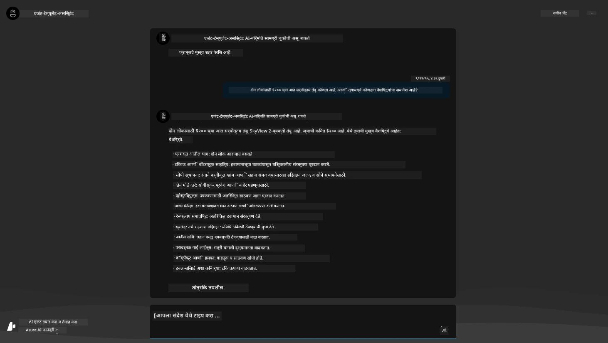

---

## 5. एजंटची वैधता तपासा

Azure Container App एक एंडपॉइंट डिप्लॉय करते जे Azure AI Foundry प्रकल्पात या टेम्पलेटसाठी प्रोव्हिजन केलेल्या AI Agent शी कनेक्ट होते. याचा अर्थ काय आहे ते पाहूया.

1. तुमच्या रिसोर्स ग्रुपसाठी Azure Portal _Overview_ पृष्ठावर परत जा

1. त्या यादीतील `Azure AI Foundry` रिसोर्सवर क्लिक करा

1. तुम्हाला हे दिसेल. `Go to Azure AI Foundry Portal` बटणावर क्लिक करा. 
   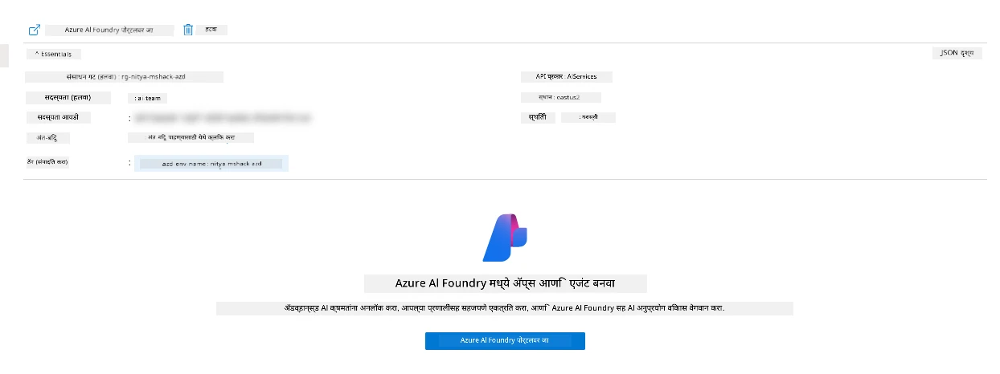

1. तुम्हाला तुमच्या AI अॅप्लिकेशनसाठी Foundry Project पृष्ठ दिसेल
   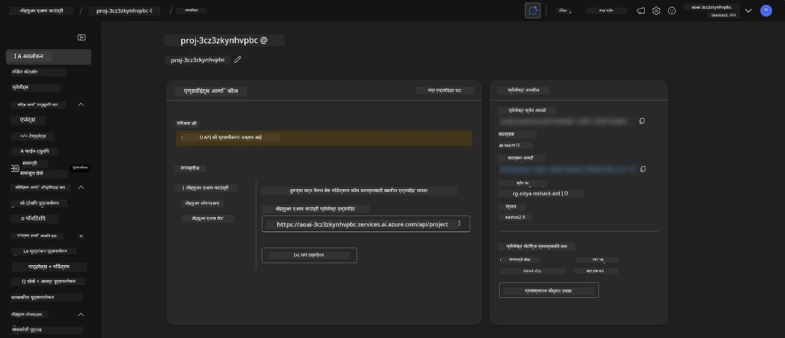

1. `Agents` वर क्लिक करा - तुम्हाला तुमच्या प्रकल्पात प्रोव्हिजन केलेला डीफॉल्ट एजंट दिसेल
   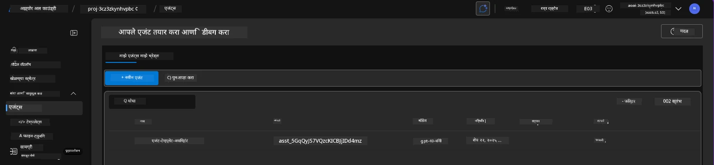

1. त्याची निवड करा - आणि तुम्हाला एजंट तपशील दिसेल. खालील गोष्टी लक्षात ठेवा:

      - एजंट नेहमी File Search वापरतो (नेहमी)
      - एजंट `Knowledge` सूचित करते की त्याने 32 फाइल्स अपलोड केल्या आहेत (फाइल शोधासाठी)
      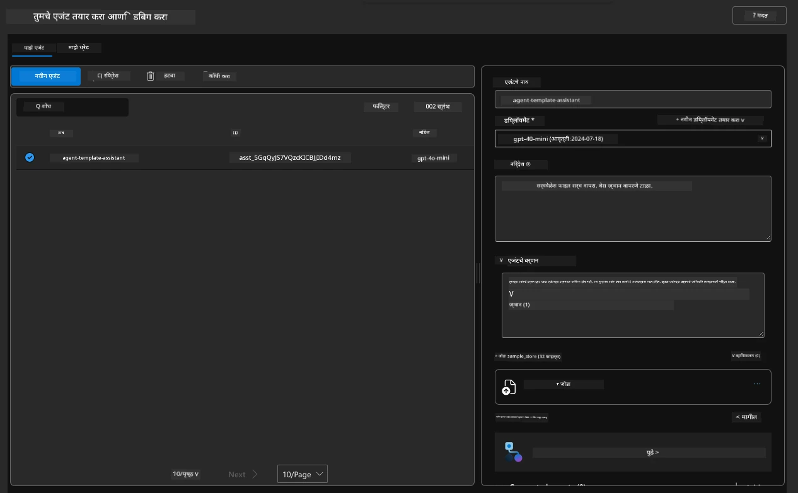

1. डाव्या मेनूमधील `Data+indexes` पर्याय शोधा आणि तपशीलांसाठी क्लिक करा. 

      - तुम्हाला ज्ञानासाठी अपलोड केलेल्या 32 डेटा फाइल्स दिसतील.
      - या `src/files` अंतर्गत 12 ग्राहक फाइल्स आणि 20 उत्पादन फाइल्सशी संबंधित असतील 
      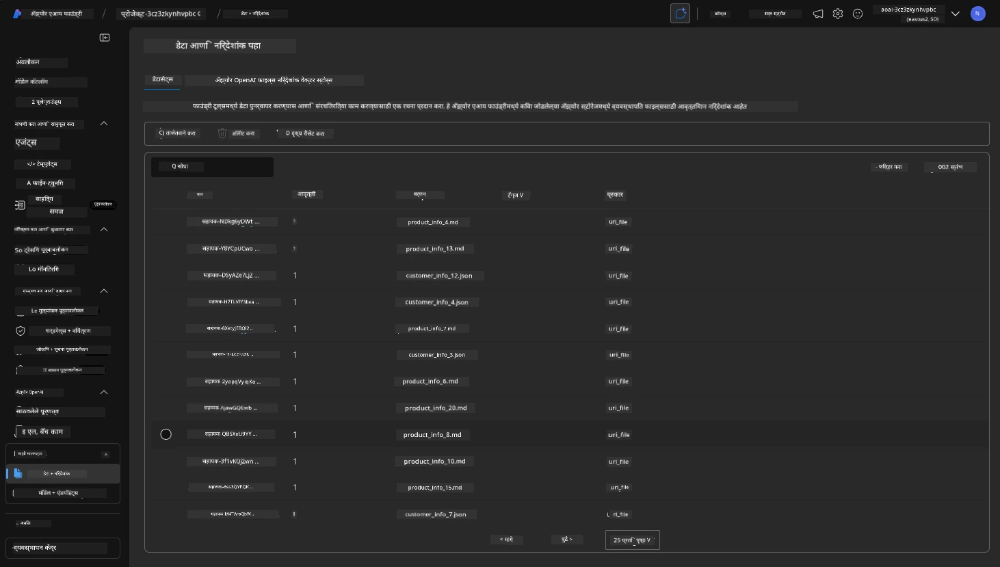

**तुम्ही एजंट ऑपरेशनची वैधता तपासली!**

1. एजंट प्रतिसाद त्या फाइल्समधील ज्ञानावर आधारित आहेत.
1. तुम्ही आता त्या डेटाशी संबंधित प्रश्न विचारू शकता आणि आधारित प्रतिसाद मिळवू शकता.
1. उदाहरण: `customer_info_10.json` "Amanda Perez" ने केलेल्या 3 खरेदींचे वर्णन करते

Container App एंडपॉइंटसह ब्राउझर टॅब पुन्हा पहा आणि विचारा: `What products does Amanda Perez own?`. तुम्हाला असे काहीतरी दिसेल:

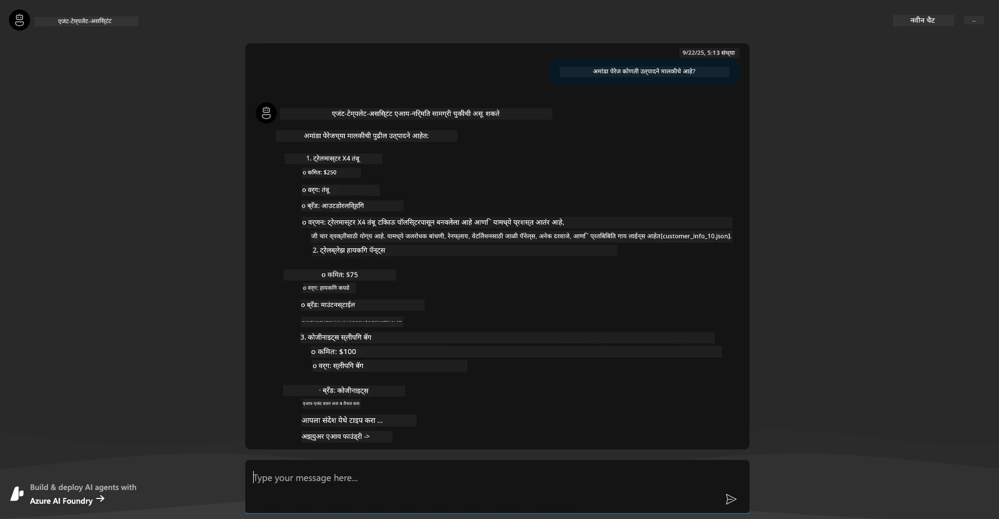

---

## 6. एजंट प्लेग्राउंड

Azure AI Foundry च्या क्षमतांसाठी थोडी अधिक अंतर्ज्ञान तयार करूया, एजंटला एजंट्स प्लेग्राउंडमध्ये फिरवून पाहूया.

1. Azure AI Foundry मधील `Agents` पृष्ठावर परत जा - डीफॉल्ट एजंट निवडा
1. `Try in Playground` पर्यायावर क्लिक करा - तुम्हाला असे प्लेग्राउंड UI मिळेल
1. तोच प्रश्न विचारा: `What products does Amanda Perez own?`

    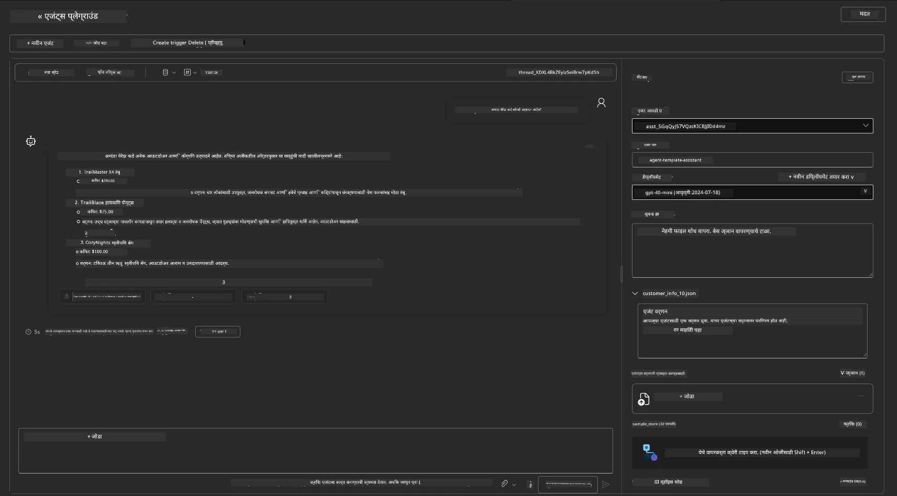

तुम्हाला तोच (किंवा तत्सम) प्रतिसाद मिळतो - परंतु तुम्हाला अतिरिक्त माहिती देखील मिळते जी तुम्हाला तुमच्या एजंटिक अॅपची गुणवत्ता, खर्च आणि कार्यक्षमता समजून घेण्यासाठी वापरता येते. उदाहरणार्थ:

1. लक्षात ठेवा की प्रतिसाद "ग्राउंड" करण्यासाठी वापरलेल्या डेटा फाइल्सचा उल्लेख करतो
1. या फाइल लेबल्सपैकी कोणत्याहीवर होवर करा - तुमच्या क्वेरी आणि प्रदर्शित प्रतिसादाशी डेटा जुळतो का?

तुम्हाला प्रतिसादाखाली _stats_ पंक्ती देखील दिसते.

1. कोणत्याही मेट्रिकवर होवर करा - उदा., Safety. तुम्हाला असे काहीतरी दिसेल
1. प्रतिसादाच्या सुरक्षिततेच्या स्तरासाठी तुमच्या अंतर्ज्ञानाशी जुळणारे मूल्यांकन रेटिंग आहे का?

      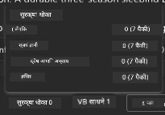

---x

## 7. अंगभूत निरीक्षणक्षमता

निरीक्षणक्षमता म्हणजे तुमच्या अॅप्लिकेशनला डिबग करण्यासाठी आणि ऑप्टिमाइझ करण्यासाठी त्याच्या ऑपरेशन्स समजून घेण्यासाठी डेटा तयार करण्यासाठी साधनसंपत्ती देणे. यासाठी एक भावना मिळवण्यासाठी:

1. `View Run Info` बटणावर क्लिक करा - तुम्हाला हा दृश्य दिसेल. हे [Agent tracing](https://learn.microsoft.com/en-us/azure/ai-foundry/how-to/develop/trace-agents-sdk#view-trace-results-in-the-azure-ai-foundry-agents-playground) चे उदाहरण आहे. _तुम्ही Thread Logs वर क्लिक करून टॉप-लेव्हल मेनूमध्ये हे दृश्य देखील मिळवू शकता_.

   - एजंटने गुंतवलेल्या रन स्टेप्स आणि टूल्सची भावना मिळवा
   - प्रतिसादासाठी एकूण टोकन संख्या (vs. आउटपुट टोकन वापर) समजून घ्या
   - लेटन्सी समजून घ्या आणि अंमलबजावणीत वेळ कुठे खर्च केला जात आहे

      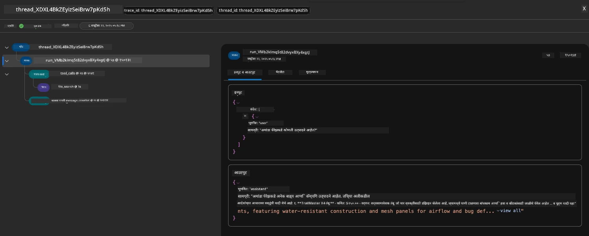

1. `Metadata` टॅबवर क्लिक करा जे रनसाठी अतिरिक्त गुणधर्म दर्शवते, जे नंतर समस्या डिबग करण्यासाठी उपयुक्त संदर्भ प्रदान करू शकते.   

      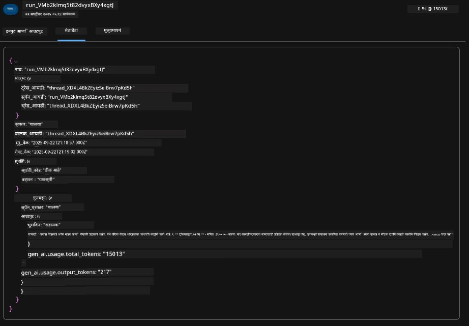

1. `Evaluations` टॅबवर क्लिक करा जे एजंट प्रतिसादावर केलेल्या स्व-मूल्यांकन दर्शवते. यामध्ये सुरक्षिततेचे मूल्यांकन (उदा., Self-harm) आणि एजंट-विशिष्ट मूल्यांकन (उदा., Intent resolution, Task adherence) समाविष्ट आहे.

      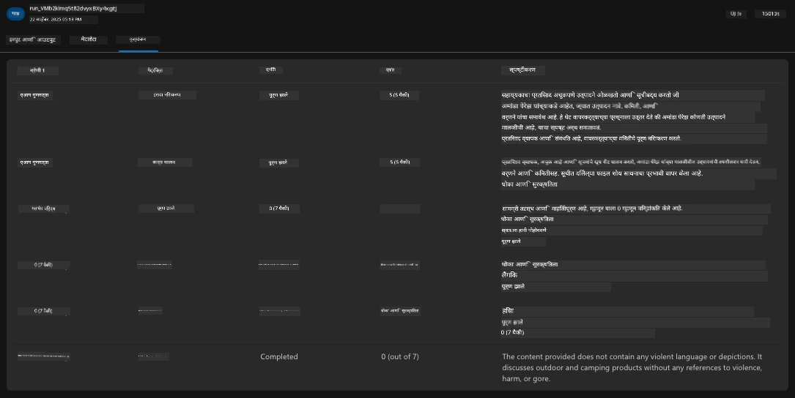

1. शेवटचे पण महत्त्वाचे, साइडबार मेनूमध्ये `Monitoring` टॅबवर क्लिक करा.

      - प्रदर्शित पृष्ठातील `Resource usage` टॅब निवडा - आणि मेट्रिक्स पहा.
      - खर्च (टोकन्स) आणि लोड (रिक्वेस्ट्स) च्या बाबतीत अॅप्लिकेशन वापर ट्रॅक करा.
      - पहिल्या बाइट (इनपुट प्रोसेसिंग) आणि शेवटच्या बाइट (आउटपुट) पर्यंत अॅप्लिकेशन लेटन्सी ट्रॅक करा.

      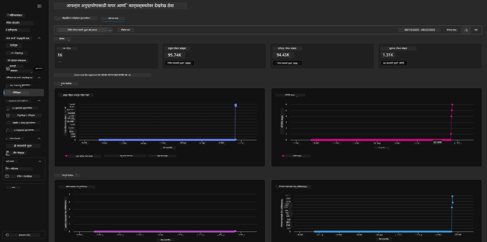

---

## 8. पर्यावरणीय व्हेरिएबल्स

आतापर्यंत, आम्ही ब्राउझरमध्ये डिप्लॉयमेंट पाहिले आहे - आणि आमचे इन्फ्रास्ट्रक्चर प्रोव्हिजन केले आहे आणि अॅप्लिकेशन कार्यरत आहे याची वैधता तपासली आहे. परंतु अॅप्लिकेशन _कोड-फर्स्ट_ सह कार्य करण्यासाठी, आम्हाला या संसाधनांसह कार्य करण्यासाठी आवश्यक असलेल्या संबंधित व्हेरिएबल्ससह आमचे स्थानिक विकास वातावरण कॉन्फिगर करणे आवश्यक आहे. `azd` वापरणे सोपे करते.

1. Azure Developer CLI [पर्यावरणीय व्हेरिएबल्स वापरते](https://learn.microsoft.com/en-us/azure/developer/azure-developer-cli/manage-environment-variables?tabs=bash) अॅप्लिकेशन डिप्लॉयमेंटसाठी कॉन्फिगरेशन सेटिंग्ज स्टोअर आणि व्यवस्थापित करण्यासाठी.

1. पर्यावरणीय व्हेरिएबल्स `.azure/<env-name>/.env` मध्ये संग्रहित केल्या जातात - हे त्यांना डिप्लॉयमेंट दरम्यान वापरलेल्या `env-name` पर्यावरणात स्कोप करते आणि तुम्हाला त्याच रिपॉझिटरीमधील वेगवेगळ्या डिप्लॉयमेंट लक्ष्यांमधील वातावरण वेगळे करण्यात मदत करते.

1. पर्यावरणीय व्हेरिएबल्स स्वयंचलितपणे लोड केल्या जातात जेव्हा `azd` कमांड विशिष्ट कमांड अंमलात आणतो (उदा., `azd up`). लक्षात ठेवा की `azd` स्वयंचलितपणे _OS-स्तरीय_ पर्यावरणीय व्हेरिएबल्स वाचत नाही (उदा., शेलमध्ये सेट केलेले) - त्याऐवजी स्क्रिप्टमध्ये माहिती हस्तांतरित करण्यासाठी `azd set env` आणि `azd get env` वापरा.

चला काही कमांड्स वापरून पाहूया:

1. या वातावरणातील `azd` साठी सेट केलेले सर्व पर्यावरणीय व्हेरिएबल्स मिळवा:

      ```bash title="" linenums="0"
      azd env get-values
      ```
      
      तुम्हाला असे काहीतरी दिसेल:

      ```bash title="" linenums="0"
      AZURE_AI_AGENT_DEPLOYMENT_NAME="gpt-4o-mini"
      AZURE_AI_AGENT_NAME="agent-template-assistant"
      AZURE_AI_EMBED_DEPLOYMENT_NAME="text-embedding-3-small"
      AZURE_AI_EMBED_DIMENSIONS=100
      ...
      ```

1. विशिष्ट मूल्य मिळवा - उदा., मला जाणून घ्यायचे आहे की आम्ही `AZURE_AI_AGENT_MODEL_NAME` मूल्य सेट केले आहे का

      ```bash title="" linenums="0"
      azd env get-value AZURE_AI_AGENT_MODEL_NAME 
      ```
      
      तुम्हाला असे काहीतरी दिसेल - ते डीफॉल्टनुसार सेट केलेले नव्हते!

      ```bash title="" linenums="0"
      ERROR: key 'AZURE_AI_AGENT_MODEL_NAME' not found in the environment values
      ```

1. `azd` साठी नवीन पर्यावरणीय व्हेरिएबल सेट करा. येथे, आम्ही एजंट मॉडेलचे नाव अपडेट करतो. _टीप: केलेले कोणतेही बदल त्वरित `.azure/<env-name>/.env` फाइलमध्ये प्रतिबिंबित होतील._

      ```bash title="" linenums="0"
      azd env set AZURE_AI_AGENT_MODEL_NAME gpt-4.1
      azd env set AZURE_AI_AGENT_MODEL_VERSION 2025-04-14
      azd env set AZURE_AI_AGENT_DEPLOYMENT_CAPACITY 150
      ```

      आता, आम्हाला मूल्य सेट केलेले सापडले पाहिजे:

      ```bash title="" linenums="0"
      azd env get-value AZURE_AI_AGENT_MODEL_NAME 
      ```

1. लक्षात ठेवा की काही संसाधने स्थिर असतात (उदा., मॉडेल डिप्लॉयमेंट्स) आणि त्यांना फक्त `azd up` पेक्षा अधिक आवश्यक असेल. बदललेल्या env vars सह मूळ डिप्लॉयमेंट काढून टाकण्याचा आणि पुन्हा डिप्लॉय करण्याचा प्रयत्न करूया.

1. **Refresh** जर तुम्ही पूर्वी azd टेम्पलेट वापरून इन्फ्रास्ट्रक्चर डिप्लॉय केले असेल - तुम्ही या कमांडचा वापर करून तुमच्या Azure डिप्लॉयमेंटच्या वर्तमान स्थितीवर आधारित तुमच्या स्थानिक पर्यावरणीय व्हेरिएबल्सची स्थित
      ```bash title="" linenums="0"
      azd env refresh
      ```

      हे दोन किंवा अधिक स्थानिक विकास वातावरणांमध्ये पर्यावरणीय व्हेरिएबल्स _सिंक_ करण्याचा एक प्रभावी मार्ग आहे (उदा., अनेक विकसकांसह टीम) - तैनात केलेल्या पायाभूत सुविधांना पर्यावरणीय व्हेरिएबल्सच्या स्थितीसाठी आधार म्हणून वापरण्याची परवानगी देते. टीम सदस्य फक्त व्हेरिएबल्स _रिफ्रेश_ करून पुन्हा समक्रमित होऊ शकतात.

---

## 9. अभिनंदन 🏆

तुम्ही एक संपूर्ण कार्यप्रवाह पूर्ण केला जिथे तुम्ही:

- [X] तुम्हाला वापरायचा असलेला AZD टेम्पलेट निवडला
- [X] GitHub Codespaces सह टेम्पलेट सुरू केला
- [X] टेम्पलेट तैनात केला आणि त्याचे कार्य यशस्वीपणे पडताळले

---

