# 2. टेम्पलेट सत्यापित करा

> मार्च 2026 मध्ये `azd 1.23.12` सह पडताळले.

!!! tip "या मॉड्यूलच्या शेवटी आपण हे करू शकाल"

    - [ ] AI सोल्यूशन आर्किटेक्चरचे विश्लेषण करा
    - [ ] AZD डिप्लॉयमेंट वर्कफ्लो समजून घ्या
    - [ ] AZD वापरासाठी मदत मिळविण्यास GitHub Copilot वापरा
    - [ ] **प्रयोगशाळा 2:** AI Agents टेम्पलेट तैनात करा आणि सत्यापित करा

---


## 1. परिचय

[Azure Developer CLI](https://learn.microsoft.com/en-us/azure/developer/azure-developer-cli/) किंवा `azd` हे एक ओपन-सोर्स कमांड-लाइन साधन आहे जे Azure वर अनुप्रयोग तयार आणि तैनात करताना डेव्हलपरच्या वर्कफ्लोला सुलभ करते. 

[AZD Templates](https://learn.microsoft.com/azure/developer/azure-developer-cli/azd-templates) हे मानकीकृत रेपॉझिटरी आहेत ज्यात नमुना अनुप्रयोग कोड, _infrastructure-as-code_ मालमत्ता, आणि `azd` कॉन्फिगरेशन फायली एका सुसंगत सोल्यूशन आर्किटेक्चरसाठी समाविष्ट असतात. इन्फ्रास्ट्रक्चर पुरवठा करणे `azd provision` कमांड इतके सोपे होते - तर `azd up` वापरल्यास आपण एकाच वेळी इन्फ्रास्ट्रक्चर पुरवठा **आणि** आपल्या अनुप्रयोगाचे तैनाती करू शकता!

यामुळे, आपल्या अनुप्रयोग विकास प्रक्रियेची सुरुवात करण्यासाठी योग्य _AZD Starter template_ शोधणे जे आपल्या अनुप्रयोग आणि इन्फ्रास्ट्रक्चरची गरज जवळपास पूर्ण करते - नंतर रेपॉझिटरी आपल्या परिस्थितीच्या आवश्यकता नुसार सानुकूल करणे इतकेच सोपे होते.

आपण सुरू करण्यापूर्वी, चला पाहूया की आपल्या प्रणालीवर Azure Developer CLI स्थापित आहे की नाही.

1. VS Code टर्मिनल उघडा आणि हा कमांड टाइप करा:

      ```bash title="" linenums="0"
      azd version
      ```

1. आपल्याला काहीतरी असे दिसेल!

      ```bash title="" linenums="0"
      azd version 1.23.12 (commit <current-build>)
      ```

**आपण आता azd वापरून टेम्पलेट निवडून तैनात करण्यास तयार आहात**

---

## 2. टेम्पलेट निवड

Microsoft Foundry प्लॅटफॉर्म सोबत [शिफारस केलेल्या AZD टेम्पलेट्सचा संच](https://learn.microsoft.com/en-us/azure/ai-foundry/how-to/develop/ai-template-get-started) येतो जो बहुतेक सोल्यूशन परिदृश्य जसे की _मल्टि-एजंट वर्कफ्लो ऑटोमेशन_ आणि _मल्टि-मॉडल कंटेंट प्रोसेसिंग_ या कव्हर करतो. आपण हे टेम्पलेट्स Microsoft Foundry पोर्टलवर जाऊन देखील शोधू शकता.

1. भेट द्या [https://ai.azure.com/templates](https://ai.azure.com/templates)
1. विचारणा आल्यावर Microsoft Foundry पोर्टलमध्ये लॉगिन करा - आपल्याला काहीतरी असे दिसेल.

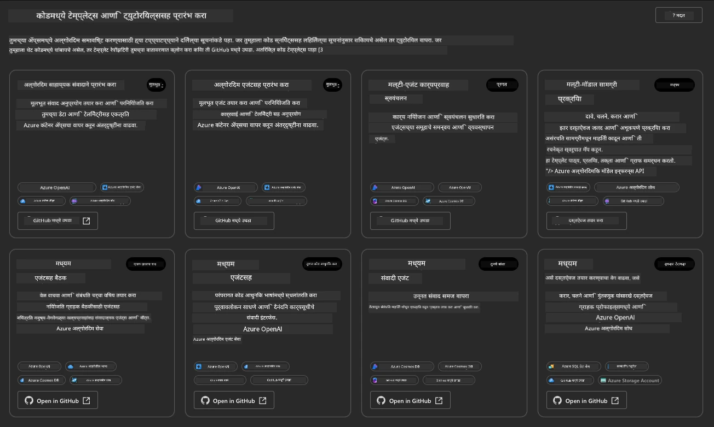


**Basic** पर्याय हे तुमचे प्रारंभिक टेम्पलेट्स आहेत:

1. [ ] [Get Started with AI Chat](https://github.com/Azure-Samples/get-started-with-ai-chat) जे एक मूलभूत चॅट अनुप्रयोग _तुमच्या डेटासह_ Azure Container Apps वर तैनात करते. हे एक मूलभूत AI चॅटबॉट परिदृश्य एक्सप्लोर करण्यासाठी वापरा.
1. [X] [Get Started with AI Agents](https://github.com/Azure-Samples/get-started-with-ai-agents) जे Foundry Agents सह एक स्टँडर्ड AI एजंट देखील तैनात करते. टूल्स आणि मॉडेल्स समाविष्ट असलेल्या एजंटिक AI सोल्यूशन्सशी परिचित होण्यासाठी हे वापरा.

दुसऱ्या लिंकला नवीन ब्राउझर टॅबमध्ये भेट द्या (किंवा संबंधित कार्डसाठी `Open in GitHub` क्लिक करा). आपल्याला या AZD टेम्पलेटसाठी रेपॉझिटरी दिसेल. README तपासण्यास काही वेळ घ्या. अनुप्रयोग आर्किटेक्चर असे दिसते:

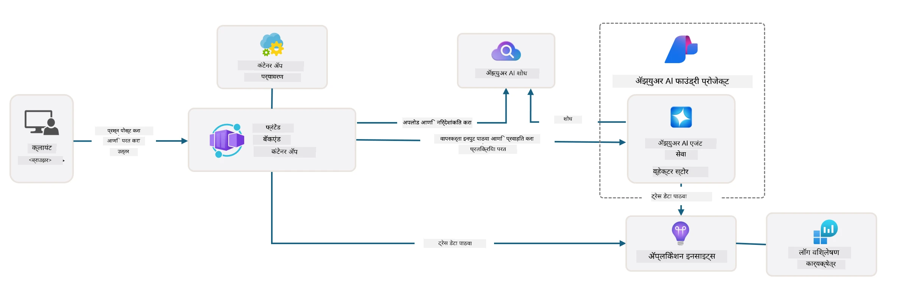

---

## 3. टेम्पलेट सक्रिय करणे

आता आपण हे टेम्पलेट तैनात करून ते वैध आहे का ते पाहूया. आपण [Getting Started](https://github.com/Azure-Samples/get-started-with-ai-agents?tab=readme-ov-file#getting-started) विभागातील मार्गदर्शकांचे अनुसरण करू.

1. टेम्पलेट रेपॉझिटरीसाठी एक कार्यरत वातावरण निवडा:

      - **GitHub Codespaces**: या लिंकवर क्लिक करा [this link](https://github.com/codespaces/new/Azure-Samples/get-started-with-ai-agents) आणि `Create codespace` पुष्टी करा
      - **Local clone or dev container**: `Azure-Samples/get-started-with-ai-agents` क्लोन करा आणि ते VS Code मध्ये उघडा

1. VS Code टर्मिनल तयार होईपर्यंत प्रतीक्षा करा, नंतर खालील कमांड टाइप करा:

   ```bash title="" linenums="0"
   azd up
   ```

या चालू होणाऱ्या वर्कफ्लो पायऱ्या पूर्ण करा:

1. आपल्याला Azure मध्ये लॉग इन करण्यास विचारले जाईल - प्रमाणीकरणासाठी सूचनांचे अनुसरण करा
1. आपल्या साठी एक यूनिक एन्व्हायर्नमेंट नाव प्रविष्ट करा - उदा., मीने `nitya-mshack-azd` वापरले
1. यामुळे एक `.azure/` फोल्डर तयार होईल - आपण env नावासह एक सबफोल्डर पाहाल
1. आपल्याला सबस्क्रिप्शन नाव निवडण्यास विचारले जाईल - डीफॉल्ट निवडा
1. आपल्याला एका लोकेशनसाठी विचारले जाईल - `East US 2` वापरा

आता, provisioning पूर्ण होईपर्यंत प्रतीक्षा करा. **हे 10-15 मिनिटे घेतात**

1. झाल्यावर, आपल्या कन्सोलमध्ये खालील प्रमाणे SUCCESS संदेश दिसेल:
      ```bash title="" linenums="0"
      SUCCESS: Your up workflow to provision and deploy to Azure completed in 10 minutes 17 seconds.
      ```
1. आपल्या Azure पोर्टलमध्ये आता त्या env नावाने provision केलेला resource group असेल:

      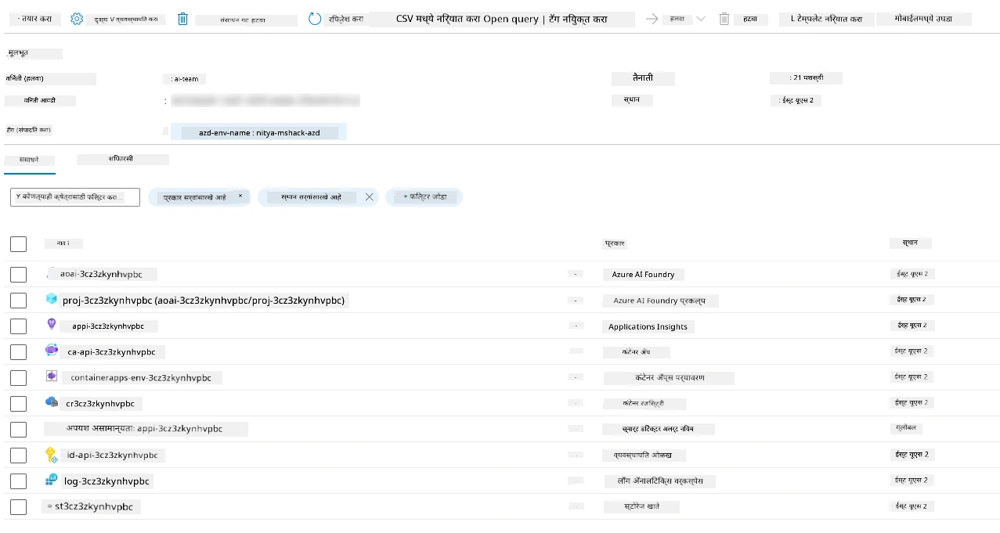

1. **आपण आता तैनात केलेले इन्फ्रास्ट्रक्चर आणि अनुप्रयोग सत्यापित करण्यास तयार आहात**.

---

## 4. टेम्पलेट पडताळणी

1. Azure Portal [Resource Groups](https://portal.azure.com/#browse/resourcegroups) पृष्ठ भेट द्या - विचारणा आल्यास लॉग इन करा
1. आपल्या एन्व्हायर्नमेंट नावासाठी RG वर क्लिक करा - आपण वरील पृष्ठ पाहाल

      - Azure Container Apps रिसोर्सवर क्लिक करा
      - _Essentials_ विभागातील Application Url वर क्लिक करा (वर उजवीकडे)

1. आपल्याला हा होस्ट केलेला अनुप्रयोग फ्रंट-एंड UI असा दिसायला हवा:

   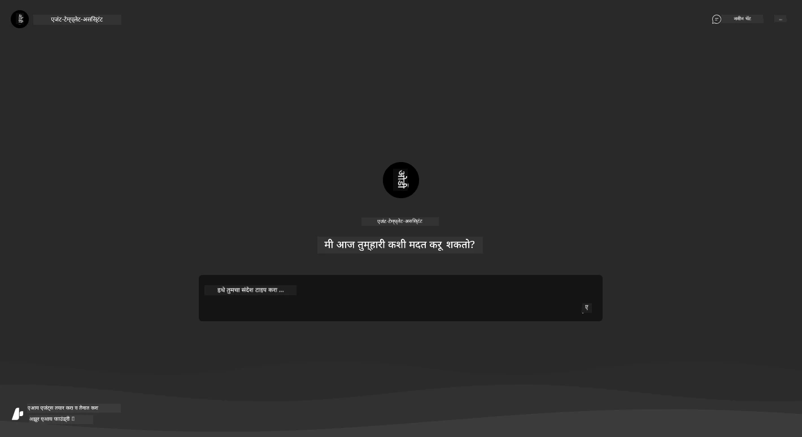

1. काही [नमुना प्रश्न](https://github.com/Azure-Samples/get-started-with-ai-agents/blob/main/docs/sample_questions.md) विचारून पहा

      1. विचाराः ```What is the capital of France?``` 
      1. विचाराः ```What's the best tent under $200 for two people, and what features does it include?```

1. आपल्याला खाली दाखवल्याप्रमाणे साधारणपणे समान उत्तरे मिळावीत. _पण हे कसे कार्य करते?_ 

      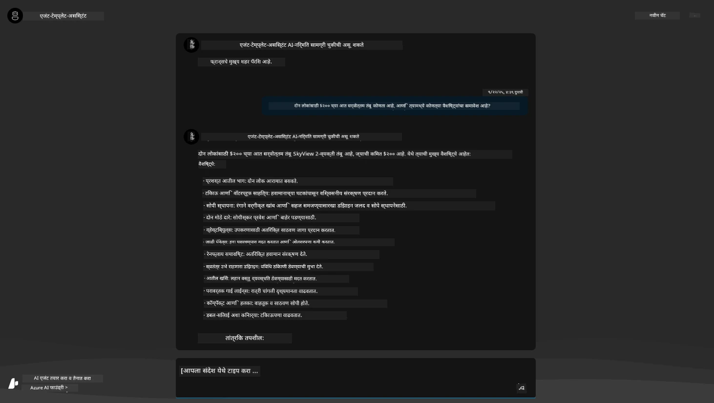

---

## 5.  एजंट पडताळणी

Azure Container App एक एंडपॉइंट तैनात करते जो या टेम्पलेटसाठी Microsoft Foundry प्रोजेक्टमध्ये provision केलेल्या AI Agent शी कनेक्ट होतो. चला पाहूया याचा काय अर्थ होतो.

1. आपल्या resource group च्या Azure Portal _Overview_ पृष्ठावर परत या

1. त्या यादीतील `Microsoft Foundry` रिसोर्सवर क्लिक करा

1. आपल्याला हे दिसले पाहिजे. `Go to Microsoft Foundry Portal` बटणावर क्लिक करा. 
   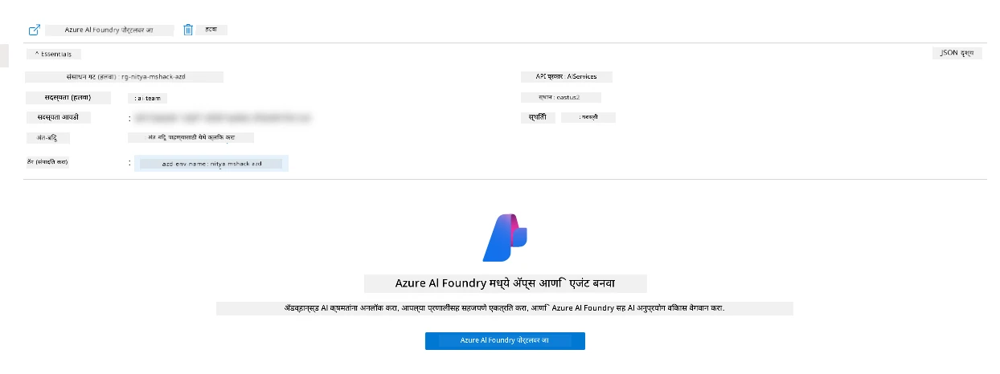

1. आपल्या AI अनुप्रयोगासाठी Foundry Project पृष्ठ दिसेल
   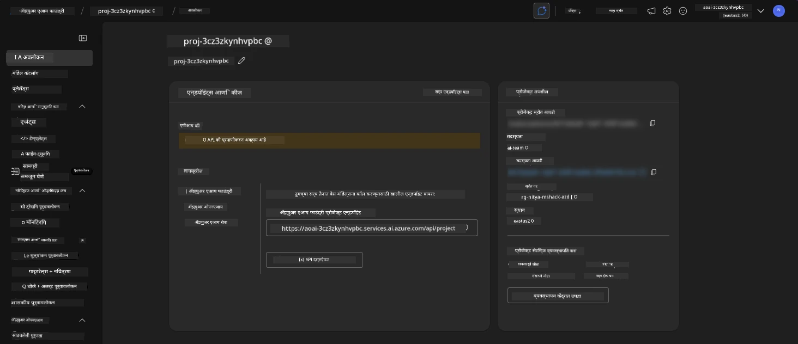

1. `Agents` वर क्लिक करा - आपल्या प्रोजेक्टमध्ये डीफॉल्ट एजंट provision झालेला दिसेल
   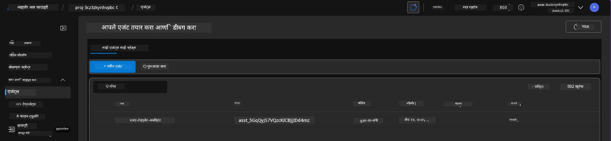

1. ते निवडा - आणि आपण एजंट तपशील पाहाल. खालील लक्षात घ्या:

      - एजंट डिफॉल्टनुसार File Search वापरतो (सदैव)
      - एजंटचे `Knowledge` दर्शविते की त्यात 32 फायली अपलोड केल्या आहेत (file search साठी)
      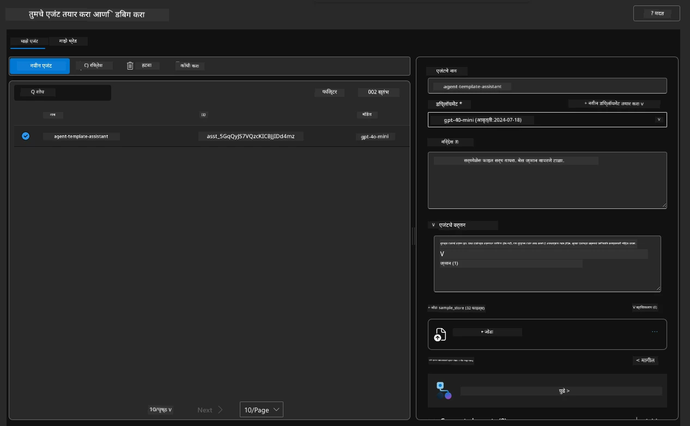

1. डाव्या मेनूमध्ये `Data+indexes` पर्याय शोधा आणि तपशीलांसाठी क्लिक करा. 

      - आपल्याला ज्ञानासाठी अपलोड केलेल्या 32 डेटा फायली दिसतील.
      - हे `src/files` अंतर्गत 12 ग्राहक फायली आणि 20 उत्पादने फायलींशी सुसंगत असतील 
      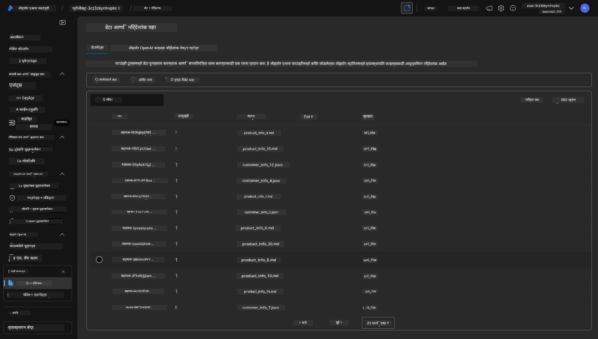

**आपण एजंटचे ऑपरेशन सत्यापित केले!** 

1. एजंट प्रतिसाद त्या फायलींमधील ज्ञानावर आधारभूत आहेत. 
1. आपण आता त्या डेटाशी संबंधित प्रश्न विचारू शकता, आणि आधारभूत प्रतिसाद मिळवू शकता.
1. उदाहरण: `customer_info_10.json` हे "Amanda Perez" द्वारा केलेल्या 3 खरेदीचे वर्णन करते

Container App एंडपॉइंट असलेल्या ब्राउझर टॅबवर परत जा आणि विचारा: `What products does Amanda Perez own?`. आपल्याला काहीतरी असे दिसावे:

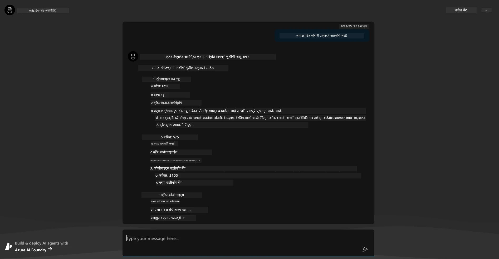

---

## 6. एजंट प्लेग्राऊंड

Microsoft Foundry ची क्षमतांची आणखी थोडी अंतर्ज्ञान मिळवूया, एजंटला Agents Playground मध्ये चालवून पाहून.

1. Microsoft Foundry मधील `Agents` पृष्ठावर परत जा - डीफॉल्ट एजंट निवडा
1. `Try in Playground` पर्यायावर क्लिक करा - आपल्याला अशा प्रकारचे Playground UI मिळेल
1. त्याच प्रश्नाला विचारा: `What products does Amanda Perez own?`

    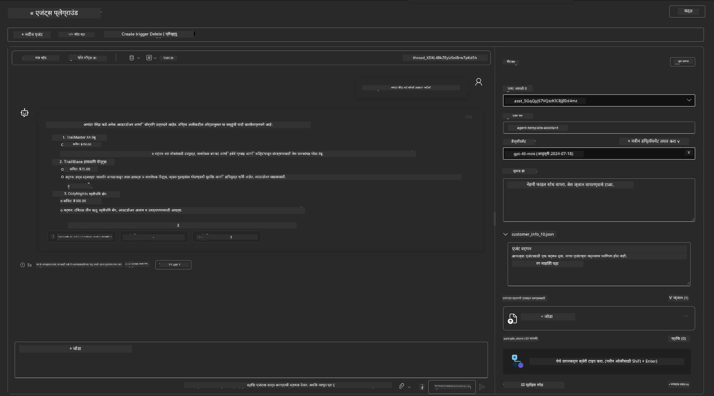

आपण समान (किंवा समान प्रकारचे) उत्तर मिळवाल - परंतु आपण एजंटिक अ‍ॅपची गुणवत्ता, खर्च आणि कार्यक्षमता समजून घेण्यासाठी अतिरिक्त माहिती देखील मिळवाल. उदाहरणार्थ:

1. लक्षात घ्या की प्रतिसाद आधारभूत करण्यासाठी वापरलेल्या डेटा फायली उद्धृत केल्या आहेत
1. या फाइल लेबलवर हवर करा - हे डेटा आपल्या क्वेरी आणि दर्शविलेल्या प्रतिसादाशी जुळते का ते तपासा

आपण प्रतिसादाखाली एक _stats_ ओळ देखील पाहता.

1. कोणत्याही मेट्रिकवर हवर करा - उदा., Safety. आपल्याला अशा प्रकारचे काही दिसेल
1. मुल्यमापन केलेले रेटिंग आपल्या प्रतिसाद सुरक्षिततेच्या आकलनाशी जुळते का?

      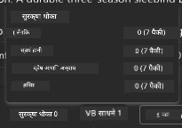

---

## 7. अंतर्निहित निरीक्षणक्षमता

निरीक्षण म्हणजे आपल्या अनुप्रयोगात असे उपकरण लावणे जे डेटा निर्माण करते आणि त्याचा वापर कार्ये समजून घेण्यासाठी, डीबग करण्यासाठी आणि ऑप्टिमाइझ करण्यासाठी केला जाऊ शकतो. याची अनुभूती घेण्यासाठी:

1. `View Run Info` बटणावर क्लिक करा - आपल्याला हा दृष्य दिसेल. हे Agent tracing चा एक उदहारण आहे. _आपण हे दृश्य Thread Logs वर टॉप-लेव्हल मेनूमधील क्लिक करूनही पाहू शकता_.

   - रन स्टेप्स आणि एजंटने वापरलेली टूल्स समजून घ्या
   - प्रतिसादासाठी एकूण Token मोजणी (v.s. output tokens वापर) समजून घ्या
   - लेटन्सी आणि अंमलबजावणीमध्ये वेळ कुठे जात आहे हे समजून घ्या

      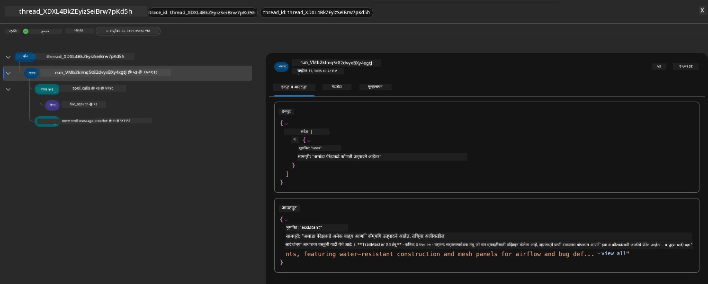

1. रनसाठी अतिरिक्त संदर्भ मिळविण्यासाठी `Metadata` टॅबवर क्लिक करा, जे नंतर समस्यांचे डीबगिंग करताना उपयुक्त असू शकते.   

      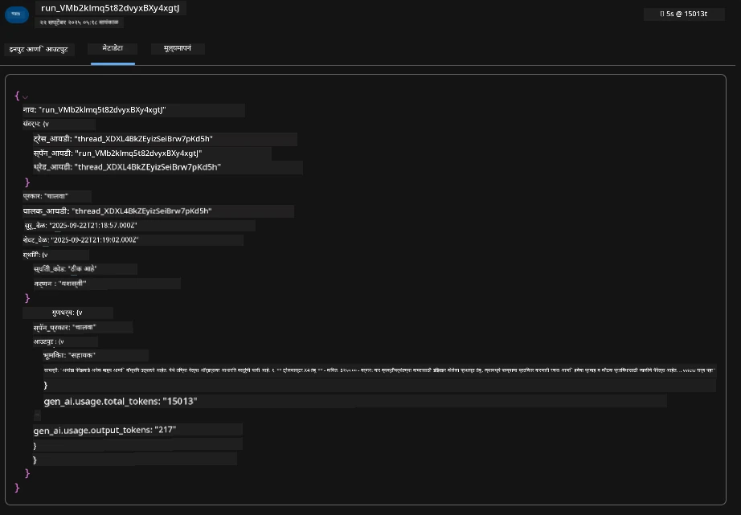


1. `Evaluations` टॅबवर क्लिक करा जे एजंट प्रतिसादावर केलेली स्वयंचलित मूल्यमापन दाखवते. यात सुरक्षा मूल्यांकन (उदा., Self-harm) आणि एजंट-विशिष्ट मूल्यांकन (उदा., Intent resolution, Task adherence) समाविष्ट आहेत.

      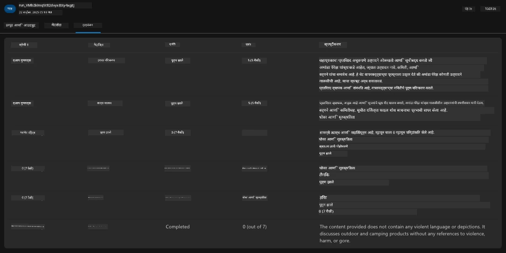

1. शेवटचे आणि महत्त्वाचे, साइडबार मेनूमध्ये `Monitoring` टॅबवर क्लिक करा.

      - प्रदर्शित पृष्ठात `Resource usage` टॅब निवडा - आणि मेट्रिक्स पहा.
      - खर्च (tokens) आणि लोड (requests) यांच्या दृष्टीने अनुप्रयोग उपयोग ट्रॅक करा.
      - इनपुट प्रक्रिया (प्रथम बाइटपर्यंतचा विलंब) आणि आउटपुट (शेवटच्या बाइटपर्यंतचा विलंब) या दृष्टीने अनुप्रयोग लेटन्सी ट्रॅक करा.

      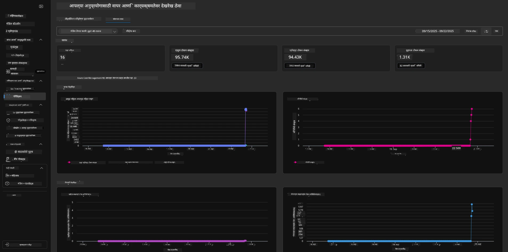

---

## 8. पर्यावरण चल (Environment Variables)

अतापर्यंत, आपण ब्राउझरमध्ये तैनाती करून चाललो आहोत - आणि आपण सत्यापित केले की आपले इन्फ्रास्ट्रक्चर पुरवठा झाले आहे आणि अनुप्रयोग कार्यरत आहे. परंतु कोड-प्रथम पद्धतीने अनुप्रयोगासोबत काम करण्यासाठी, आपल्याला स्थानिक विकास वातावरण संबंधित रिसोर्सेसशी काम करण्यासाठी आवश्यक संबंधित बदलणे कॉन्फिगर करणे आवश्यक आहे. `azd` वापरून हे सोपे होते.

1. Azure Developer CLI [पर्यावरण चल वापरते](https://learn.microsoft.com/en-us/azure/developer/azure-developer-cli/manage-environment-variables?tabs=bash) अनुप्रयोग तैनातीसाठी कॉन्फिगरेशन सेटिंग्ज साठवण्यासाठी आणि व्यवस्थापित करण्यासाठी.

1. पर्यावरण चल `.azure/<env-name>/.env` मध्ये साठवले जातात - हे त्यांना तैनाती दरम्यान वापरल्या गेलेल्या `env-name` एन्व्हायर्नमेंटसाठी स्कोप करते आणि त्याच रेपॉझिटरीतील विविध डिप्लॉयमेंट लक्ष्यांसाठी वातावरण वेगळे ठेवण्यात मदत करते.

1. `azd` कमांड जेव्हा विशिष्ट कमांड अंमलात आणते (उदा., `azd up`) तेव्हा पर्यावरण चल आपोआप लोड केली जातात. लक्षात ठेवा की `azd` ऑपरेटिंग सिस्टीम-स्तराच्या पर्यावरण चल (उदा., शेलमध्ये सेट केलेले) आपोआप वाचत नाही - त्याऐवजी स्क्रिप्टमध्ये माहिती हस्तांतरित करण्यासाठी `azd set env` आणि `azd get env` वापरा.


चला काही कमांड्स आजमावूया:

1. या एन्व्हायर्नमेंटसाठी `azd` साठी सेट केलेली सर्व पर्यावरण चल मिळवा:

      ```bash title="" linenums="0"
      azd env get-values
      ```
      
      आपल्याला काहीतरी असे दिसेल:

      ```bash title="" linenums="0"
      AZURE_AI_AGENT_DEPLOYMENT_NAME="gpt-4.1-mini"
      AZURE_AI_AGENT_NAME="agent-template-assistant"
      AZURE_AI_EMBED_DEPLOYMENT_NAME="text-embedding-3-small"
      AZURE_AI_EMBED_DIMENSIONS=100
      ...
      ```

1. विशिष्ट मूल्य मिळवा - उदा., मला माहित करायचे आहे की आपण `AZURE_AI_AGENT_MODEL_NAME` मूल्य सेट केले आहे का

      ```bash title="" linenums="0"
      azd env get-value AZURE_AI_AGENT_MODEL_NAME 
      ```
      
      आपल्याला काहीतरी असे दिसेल - डीफॉल्टनुसार ते सेट केलेले नव्हते!

      ```bash title="" linenums="0"
      ERROR: key 'AZURE_AI_AGENT_MODEL_NAME' not found in the environment values
      ```

1. `azd` साठी नवीन पर्यावरण चल सेट करा. येथे, आपण एजंट मॉडेल नाव अद्यतनित करतो. _नोट: केलेल्या कोणत्याही बदलांचा प्रतिबिंब त्वरित `.azure/<env-name>/.env` फाइलमध्ये दिसेल._

      ```bash title="" linenums="0"
      azd env set AZURE_AI_AGENT_MODEL_NAME gpt-4.1
      azd env set AZURE_AI_AGENT_MODEL_VERSION 2025-04-14
      azd env set AZURE_AI_AGENT_DEPLOYMENT_CAPACITY 150
      ```

      आता, आपण पाहू की मूल्य सेट केलेले आहे:

      ```bash title="" linenums="0"
      azd env get-value AZURE_AI_AGENT_MODEL_NAME 
      ```

1. लक्षात ठेवा की काही रिसोर्सेस कायमस्वरूपी असतात (उदा., मॉडेल तैनाती) आणि पुन्हा तैनात करण्यासाठी फक्त `azd up` पेक्षा अधिक प्रक्रिया आवश्यक असू शकते. चला मूळ तैनाती नष्ट करून बदललेल्या env vars सह पुन्हा तैनात करण्याचा प्रयत्न करुया.

1. **रिफ्रेश** जर आपण पूर्वी azd टेम्पलेट वापरून इन्फ्रास्ट्रक्चर तैनात केले असेल - तर आपण आपल्या स्थानिक ENV बदलणारे Azure तैनातीच्या चालू स्थितीवर आधारित या कमांडने रीफ्रेश करू शकता:

      ```bash title="" linenums="0"
      azd env refresh
      ```

      हे दोन किंवा अधिक स्थानिक विकास वातावरणांमध्ये (उदा., अनेक विकसक असलेली टीम) एन्व्हायर्नमेंट व्हेरिएबल्स _सिंक_ करण्याचा एक सामर्थ्यशाली मार्ग आहे - रोलआउट केलेल्या पायाभूत सुविधांना एन्व्हायर्नमेंट व्हेरिएबल्सच्या स्थितीसाठी मूळ सत्य म्हणून कार्य करण्याची परवानगी देते. टीम सदस्य फक्त व्हेरिएबल्स _रिफ्रेश_ करून पुन्हा सिंक होतात.

---

## 9. अभिनंदन 🏆

आपण नुकतेच एक अंत-पर्यंत कार्यप्रवाह पूर्ण केला आहे ज्यामध्ये आपण:

- [X] आपण वापरू इच्छित AZD टेम्पलेट निवडले
- [X] टेम्पलेटला समर्थित विकास वातावरणात उघडले
- [X] टेम्पलेट तैनात केले आणि ते कार्य करते याची पडताळणी केली

---

<!-- CO-OP TRANSLATOR DISCLAIMER START -->
**अस्वीकरण**:
हा दस्तऐवज AI अनुवाद सेवा [Co-op Translator](https://github.com/Azure/co-op-translator) वापरून अनुवादित केला आहे. आम्ही अचूकतेसाठी प्रयत्न करतो, तरी कृपया लक्षात घ्या की स्वयंचलित अनुवादांमध्ये त्रुटी किंवा अचूकतेतील उणीवा असू शकतात. मूळ दस्तऐवज त्याच्या मूळ भाषेत अधिकृत स्रोत मानला जावा. महत्त्वाच्या माहितीसाठी व्यावसायिक मानवी अनुवादाची शिफारस केली जाते. या अनुवादाच्या वापरामुळे उद्भवणाऱ्या कोणत्याही गैरसमजुतींबद्दल किंवा चुकीच्या अर्थनिर्देशांबद्दल आम्ही जबाबदार नाही.
<!-- CO-OP TRANSLATOR DISCLAIMER END -->