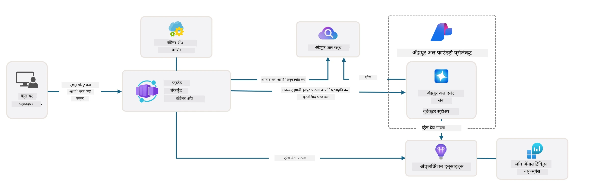

# 3. एक टेम्पलेट विकृतीकरण करा

!!! tip "या मॉड्यूलच्या शेवटी तुम्हाला खालील गोष्टी करता येतील"

    - [ ] Azure सहाय्यासाठी MCP सर्व्हरंसह GitHub Copilot सक्रिय करा
    - [ ] AZD टेम्पलेट फोल्डर संरचना आणि घटक समजून घ्या
    - [ ] इन्फ्रास्ट्रक्चर-एज-कोड (Bicep) संघटन पद्धती शोधा
    - [ ] **प्रयोगशाळा 3:** GitHub Copilot वापरून रेपॉझिटरी आर्किटेक्चर समजून घ्या आणि तपासा 

---


AZD टेम्पलेट्स आणि Azure Developer CLI (`azd`) सह आपण मानकृत रेपॉझिटरीजसह आमच्या AI विकास प्रवासाला पटकन सुरुवात करू शकतो, जे सॅम्पल कोड, इन्फ्रास्ट्रक्चर आणि कॉन्फिगरेशन फाईल्स प्रदान करतात - तैनात करण्यासाठी तयार _स्टार्टर_ प्रकल्पाच्या स्वरूपात.

**पण आता, आपल्याला प्रकल्पाची रचना आणि कोडबेस समजून घेणे आवश्यक आहे - आणि AZD टेम्पलेट सानुकूलित करता येणे आवश्यक आहे - AZD ची कोणतीही पूर्वानुभव किंवा समज न घेता!**

---

## 1. GitHub Copilot सक्रिय करा

### 1.1 GitHub Copilot Chat इन्स्टॉल करा

आता [GitHub Copilot with Agent Mode](https://code.visualstudio.com/docs/copilot/chat/chat-agent-mode) शोधण्याची वेळ आली आहे. आता आपण नैसर्गिक भाषेत आपले कार्य उच्च पातळीवर वर्णन करू शकतो, आणि अंमलबजावणीसाठी मदत मिळवू शकतो. या प्रयोगशाळेसाठी, आपण [Copilot Free plan](https://github.com/github-copilot/signup) वापरणार आहोत ज्यामध्ये पूर्णता आणि चॅट इंटरॅक्शन्ससाठी मासिक मर्यादा आहे.

एक्सटेंशन मार्केटप्लेसवरून इन्स्टॉल केले जाऊ शकते, परंतु ते आधीच तुमच्या Codespaces पर्यावरणात उपलब्ध असावे. _Copilot आयकॉन ड्रॉप-डाउनमधून `Open Chat` क्लिक करा - आणि `What can you do?` सारखे प्रॉम्प्ट टाइप करा_ - तुम्हाला लॉगिन करण्यास सांगितले जाऊ शकते. **GitHub Copilot Chat तयार आहे**.

### 1.2. MCP सर्व्हर इन्स्टॉल करा

Agent मोड प्रभावी होण्यासाठी, त्याला आवश्यक ज्ञान मिळवण्यासाठी किंवा क्रिया करण्यासाठी योग्य साधनांपर्यंत प्रवेश हवा असतो. येथे MCP सर्व्हर मदत करू शकतात. आपण खालील सर्व्हर कॉन्फिगर करू:

1. [Azure MCP Server](../../../../../workshop/docs/instructions)
1. [Microsoft Docs MCP Server](../../../../../workshop/docs/instructions)

हे सक्रिय करण्यासाठी:

1. `.vscode/mcp.json` नावाची फाइल तयार करा जर ती अस्तित्वात नसेल तर
1. खालील मजकूर त्या फाईलमध्ये कॉपी करा - आणि सर्व्हर सुरू करा!
   ```json title=".vscode/mcp.json"
   {
      "servers": {
         "Azure MCP Server": {
            "command": "npx",
            "args": [
            "-y",
            "@azure/mcp@latest",
            "server",
            "start"
            ]
         },
         "microsoft.docs.mcp": {
            "type": "http",
            "url": "https://learn.microsoft.com/api/mcp"
         }
      }
   }
   ```

??? warning "आपल्याला `npx` न स्थापित असल्याचा त्रुटी येऊ शकतो (दुरुस्ती साठी विस्तारासाठी क्लिक करा)"

      दुरुस्त करण्यासाठी, `.devcontainer/devcontainer.json` फाइल ओपन करा आणि फिचर्स विभागात खालील ओळ जोडा. नंतर कंटेनर पुन्हा तयार करा. आता तुम्ही `npx` इन्स्टॉल केलेले पाहाल.

      ```title="" linenums="0"
         "features": {
            "ghcr.io/devcontainers/features/node:1": {},
            ...
         },
      ```

---

### 1.3. GitHub Copilot Chat चाचणी करा

**प्रथम VS Code कमांड लाइनमधून Azure सह प्रमाणित करण्यासाठी `az login` वापरा.**

आपण आता आपल्या Azure सबस्क्रिप्शन स्थितीची चौकशी करू शकता, आणि तैनात केलेल्या संसाधनांबाबत किंवा कॉन्फिगरेशनबाबत प्रश्न विचारू शकता. हे प्रॉम्प्ट वापरून पहा:

1. `List my Azure resource groups`
1. `#foundry list my current deployments`

तसेच आपण Azure दस्तऐवजीकरणाबाबत प्रश्न विचारू शकता आणि Microsoft Docs MCP सर्व्हरवर आधारित प्रत्युत्तर मिळवू शकता. हे प्रॉम्प्ट वापरून पहा:

1. `#microsoft_docs_search What is Azure Developer CLI?`
1. `#microsoft_docs_search Show me a Python tutorial to chat with deployed model`

किंवा एखादे कार्य पूर्ण करण्यासाठी कोड स्निपेट्स विचारू शकता. हा प्रॉम्प्ट वापरून पहा.

1. `Give me a Python code example that uses AAD for an interactive chat client`

`Ask` मोडमध्ये, हा कोड पुरवतो ज्याला आपण कॉपी-पेस्ट करून वापरू शकता. `Agent` मोडमध्ये, हे कदाचित एक पाऊल पुढे जाऊन संबंधित संसाधने तयार करू शकते - सेटअप स्क्रिप्ट्स आणि दस्तऐवजीकरणासह - तुम्हाला ते कार्य पूर्ण करण्यात मदत करण्यासाठी.

**आता तुम्हाला टेम्पलेट रेपॉझिटरी एक्सप्लोर करण्यासाठी सज्ज आहात**

---

## 2. आर्किटेक्चर विकृतीकरण करा

??? prompt "विचारा: docs/images/architecture.png मधील अनुप्रयोग आर्किटेक्चर 1 परिच्छेदात समजावून सांगा"

      हा अनुप्रयोग Azure वर तयार केलेला AI चालित चॅट अनुप्रयोग आहे जो आधुनिक एजंट-आधारित आर्किटेक्चर दाखवतो. सोल्यूशनचे केंद्र Azure कंटेनर अॅप आहे जे मुख्य अनुप्रयोग कोड होस्ट करते, जे वापरकर्त्याच्या इनपुटची प्रक्रिया करून AI एजंटद्वारे बुद्धिमान प्रतिसाद तयार करते.
      
      आर्किटेक्चर Microsoft Foundry Project वर आधारित आहे ज्यामुळे AI क्षमता प्राप्त होतात, जे Azure AI सेवा जोडते ज्या मूलभूत भाषेच्या मॉडेल्स (जसे की gpt-4.1-mini) आणि एजंट कार्यक्षमतेसाठी कार्य करतात. वापरकर्त्याचे संवाद React-आधारित फ्रंटएंडद्वारे FastAPI बॅकएंडपर्यंत जातात ज्यामुळे AI एजंट सेवा संवाद साधून संदर्भात्मक प्रतिसाद तयार केला जातो.
      
      प्रणालीत ज्ञान पुनर्प्राप्ती क्षमता समाविष्ट आहे जिथे एजंट फाईल सर्च किंवा Azure AI Search सेवा वापरून अपलोड केलेल्या दस्तऐवजांमधून माहिती मिळवू शकतो आणि उद्धृत करू शकतो.
      
      ऑपरेशनल उत्कृष्टतेसाठी, आर्किटेक्चर Application Insights आणि Log Analytics Workspace द्वारे ट्रेसिंग, लॉगिंग आणि कार्यक्षमता सुधारणा यासाठी व्यापक निरीक्षण समाविष्ट करते.
      
      Azure Storage अनुप्रयोग डेटा आणि फाईल अपलोडसाठी ब्लॉब स्टोरेज प्रदान करते, तर Managed Identity Azure संसाधनांदरम्यान सुरक्षित प्रवेश सुनिश्चित करते ज्यासाठी क्रेडेन्शियल्स साठवण्याची गरज नाही. संपूर्ण सोल्यूशन स्केलेबल आणि देखभालीसाठी डिझाइन केलेले आहे, कंटेनराइज्ड अनुप्रयोग मागणीवर आधारित आपोआप स्केल होतो व Azure च्या व्यवस्थापित सेवांद्वारे इनबिल्ट सुरक्षा, निरीक्षण व CI/CD क्षमता पुरवतो.



---

## 3. रेपॉझिटरी रचना

!!! prompt "विचारा: टेम्पलेट फोल्डर संरचना समजावून सांगा. दृश्यात्मक श्रेणीबद्ध आराखड्याने सुरु करा."

??? info "उत्तर: दृश्यात्मक श्रेणीबद्ध आराखडा"

      ```bash title="" 
      get-started-with-ai-agents/
      ├── 📋 कॉन्फिगरेशन & सेटअप
      │   ├── azure.yaml                    # Azure Developer CLI कॉन्फिगरेशन
      │   ├── docker-compose.yaml           # स्थानिक विकास कंटेनर्स
      │   ├── pyproject.toml                # Python प्रकल्प कॉन्फिगरेशन
      │   ├── requirements-dev.txt          # विकासासाठी अवलंबित्वे
      │   └── .devcontainer/                # VS Code डेव्ह कंटेनर सेटअप
      │
      ├── 🏗️ इन्फ्रास्ट्रक्चर (infra/)
      │   ├── main.bicep                    # मुख्य इन्फ्रास्ट्रक्चर टेम्पलेट
      │   ├── api.bicep                     # API-विशिष्ट संसाधने
      │   ├── main.parameters.json          # इन्फ्रास्ट्रक्चर पॅरामीटर्स
      │   └── core/                         # मॉड्यूलर इन्फ्रास्ट्रक्चर घटक
      │       ├── ai/                       # AI सेवा कॉन्फिगरेशन
      │       ├── host/                     # होस्टिंग इन्फ्रास्ट्रक्चर
      │       ├── monitor/                  # निरीक्षण आणि लॉगिंग
      │       ├── search/                   # Azure AI Search सेटअप
      │       ├── security/                 # सुरक्षा आणि ओळख
      │       └── storage/                  # स्टोरेज अकाउंट कॉन्फिगरेशन
      │
      ├── 💻 अनुप्रयोग स्रोत (src/)
      │   ├── api/                          # बॅकएंड API
      │   │   ├── main.py                   # FastAPI अनुप्रयोग प्रवेश
      │   │   ├── routes.py                 # API मार्ग परिभाषा
      │   │   ├── search_index_manager.py   # शोध कार्यक्षमता
      │   │   ├── data/                     # API डेटा हाताळणी
      │   │   ├── static/                   # स्थिर वेब संसाधने
      │   │   └── templates/                # HTML टेम्पलेट्स
      │   ├── frontend/                     # React/TypeScript फ्रंटएंड
      │   │   ├── package.json              # Node.js अवलंबित्वे
      │   │   ├── vite.config.ts            # Vite बिल्ड कॉन्फिगरेशन
      │   │   └── src/                      # फ्रंटएंड स्रोत कोड
      │   ├── data/                         # नमुना डेटा फाईल्स
      │   │   └── embeddings.csv            # पूर्वनिर्धारित एम्बेडिंग्ज
      │   ├── files/                        # ज्ञानाधारित फाईल्स
      │   │   ├── customer_info_*.json      # ग्राहक डेटा नमुने
      │   │   └── product_info_*.md         # उत्पादन दस्तऐवज
      │   ├── Dockerfile                    # कंटेनर कॉन्फिगरेशन
      │   └── requirements.txt              # Python अवलंबित्वे
      │
      ├── 🔧 ऑटोमेशन & स्क्रिप्ट्स (scripts/)
      │   ├── postdeploy.sh/.ps1           # पोस्ट-तैनाती सेटअप
      │   ├── setup_credential.sh/.ps1     # क्रेडेन्शियल कॉन्फिगरेशन
      │   ├── validate_env_vars.sh/.ps1    # पर्यावरण व्हेरिएबल वैधता
      │   └── resolve_model_quota.sh/.ps1  # मॉडेल कोटा व्यवस्थापन
      │
      ├── 🧪 चाचणी आणि मूल्यांकन
      │   ├── tests/                        # युनिट व एकत्रीकरण चाचण्या
      │   │   └── test_search_index_manager.py
      │   ├── evals/                        # एजंट मूल्यांकन फ्रेमवर्क
      │   │   ├── evaluate.py               # मूल्यांकन रन्नर
      │   │   ├── eval-queries.json         # चाचणी प्रश्न
      │   │   └── eval-action-data-path.json
      │   ├── sandbox/                      # विकास खेळ जमीन
      │   │   ├── 1-quickstart.py           # सुरुवातीसाठी उदाहरणे
      │   │   └── aad-interactive-chat.py   # प्रमाणीकरण उदाहरणे
      │   └── airedteaming/                 # AI सुरक्षा मूल्यांकन
      │       └── ai_redteaming.py          # रेड टीम चाचणी
      │
      ├── 📚 दस्तऐवजीकरण (docs/)
      │   ├── deployment.md                 # तैनाती मार्गदर्शक
      │   ├── local_development.md          # स्थानिक सेटअप सूचना
      │   ├── troubleshooting.md            # सामान्य समस्या व उपाय
      │   ├── azure_account_setup.md        # Azure पूर्वआवश्यकता
      │   └── images/                       # दस्तऐवज साधने
      │
      └── 📄 प्रकल्प मेटाडेटा
         ├── README.md                     # प्रकल्प आढावा
         ├── CODE_OF_CONDUCT.md           # समुदाय मार्गदर्शक तत्त्वे
         ├── CONTRIBUTING.md              # योगदान मार्गदर्शक
         ├── LICENSE                      # परवानगी अटी
         └── next-steps.md                # पोस्ट-तैनाती सूचना
      ```

### 3.1. मुख्य अनुप्रयोग आर्किटेक्चर

हा टेम्पलेट एक **फुल-स्टॅक वेब अनुप्रयोग** पॅटर्न अनुसरतो ज्यामध्ये:

- **बॅकएंड**: Python FastAPI सह Azure AI समाकलन
- **फ्रंटएंड**: TypeScript/React सह Vite बिल्ड सिस्टम
- **इन्फ्रास्ट्रक्चर**: Azure Bicep टेम्पलेट्स क्लाउड संसाधनांसाठी
- **कंटेनरायझेशन**: सुसंगत तैनातीसाठी Docker

### 3.2 इन्फ्रा एज कोड (bicep)

इन्फ्रास्ट्रक्चर स्तर **Azure Bicep** टेम्पलेट्सने मॉड्यूलरली संघटित आहे:

   - **`main.bicep`**: सर्व Azure संसाधने एकत्रित करते
   - **`core/` मॉड्यूल्स**: विविध सेवांसाठी पुनर्वापरयोग्य घटक
      - AI सेवा (Microsoft Foundry मॉडेल्स, AI Search)
      - कंटेनर होस्टिंग (Azure कंटेनर अॅप्स)
      - निरीक्षण (Application Insights, Log Analytics)
      - सुरक्षा (Key Vault, Managed Identity)

### 3.3 अनुप्रयोग स्रोत (`src/`)

**बॅकएंड API (`src/api/`)**:

- FastAPI आधारित REST API
- Foundry Agents समाकलन
- ज्ञान पुनर्प्राप्तीसाठी शोध निर्देशिका व्यवस्थापन
- फाईल अपलोड आणि प्रक्रिया क्षमता

**फ्रंटएंड (`src/frontend/`)**:

- आधुनिक React/TypeScript SPA
- वेगवान विकास आणि ऑप्टिमाइझ्ड बिल्डसाठी Vite
- एजंट संवादासाठी चॅट इंटरफेस

**ज्ञान आधार (`src/files/`)**:

- ग्राहक आणि उत्पादन डेटा नमुने
- फाईल-आधारित ज्ञान पुनर्प्राप्ती प्रदर्शित करते
- JSON व Markdown स्वरूपातील उदाहरणे


### 3.4 DevOps & ऑटोमेशन

**स्क्रिप्ट्स (`scripts/`)**:

- क्रॉस-प्लॅटफॉर्म PowerShell आणि Bash स्क्रिप्ट्स
- पर्यावरण वैधता आणि सेटअप
- पोस्ट-तैनाती कॉन्फिगरेशन
- मॉडेल कोटा व्यवस्थापन

**Azure Developer CLI समाकलन**:

- `azd` वर्कफ्लोसाठी `azure.yaml` कॉन्फिगरेशन
- स्वयंचलित पुरवठा आणि तैनाती
- पर्यावरण व्हेरिएबल व्यवस्थापन

### 3.5 चाचणी आणि गुणवत्ता हमी

**मूल्यांकन फ्रेमवर्क (`evals/`)**:

- एजंट कार्यक्षमता मूल्यांकन
- क्वेरी-प्रतिक्रिया गुणवत्ता चाचणी
- स्वयंचलित मूल्यमापन प्रक्रिया

**AI सुरक्षा (`airedteaming/`)**:

- AI सुरक्षिततेसाठी रेड टीम चाचणी
- सुरक्षा दोषांचे स्कॅनिंग
- जबाबदार AI पद्धती

---

## 4. अभिनंदन 🏆

आपण GitHub Copilot Chat MCP सर्व्हरांसह वापरून रेपॉझिटरी तपासली.

- [X] Azure साठी GitHub Copilot सक्रिय केले
- [X] अनुप्रयोग आर्किटेक्चर समजले
- [X] AZD टेम्पलेट संरचना एक्सप्लोर केली

हे तुम्हाला या टेम्पलेटसाठी _इन्फ्रास्ट्रक्चर एज कोड_ मालमत्ता समजण्यास मदत करते. पुढे, आपण AZD साठी कॉन्फिगरेशन फाइल पाहू.

---

<!-- CO-OP TRANSLATOR DISCLAIMER START -->
**अस्वीकरण**:  
हा दस्तऐवज AI भाषांतर सेवेचा वापर करून अनुवादित केला आहे [Co-op Translator](https://github.com/Azure/co-op-translator). आम्ही अचूकतेसाठी प्रयत्नशील आहोत, तरी कृपया लक्षात ठेवा की स्वयंचलित अनुवादांमध्ये त्रुटी किंवा अचूकतेची कमतरता असू शकते. मूळ दस्तऐवज त्याच्या स्थानिक भाषेत अधिकृत स्रोत मानला जावा. महत्वाच्या माहितीसाठी व्यावसायिक मानवी अनुवाद शिफारसीय आहे. या अनुवादाच्या वापरामुळे उद्भवलेल्या कोणत्याही गैरसमजुतींसाठी किंवा चुकांसाठी आम्ही जबाबदार नाही आहोत.
<!-- CO-OP TRANSLATOR DISCLAIMER END -->