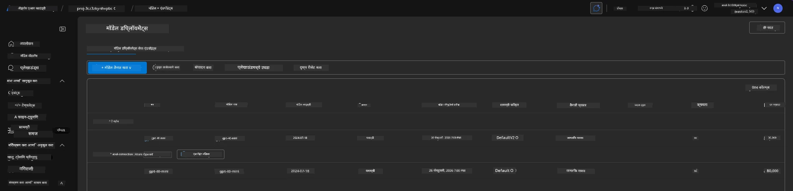
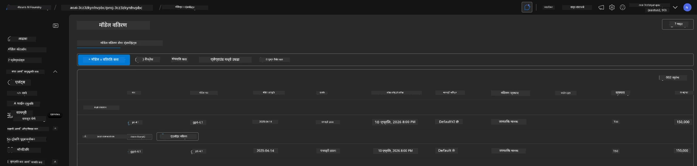

# 6. इन्फ्रास्ट्रक्चर समाप्त करा

!!! tip "या मॉड्यूलच्या शेवटी आपण सक्षम असाल"

    - [ ] संसाधन स्वच्छता आणि खर्च व्यवस्थापनाचे महत्त्व समजून घ्या
    - [ ] `azd down` वापरून इन्फ्रास्ट्रक्चर सुरक्षितपणे डीप्रोव्हिजन करा
    - [ ] आवश्यक असल्यास सॉफ्ट-डिलीट केलेल्या कॉग्निटिव्ह सर्व्हिसेस पुनर्प्राप्त करा
    - [ ] **प्रयोगशाळा 6:** Azure संसाधने स्वच्छ करा आणि काढून टाकले गेले याची पुष्टी करा

---

## बोनस व्यायाम

आपण प्रोजेक्ट काढून टाकण्यापूर्वी, काही वेळ घ्या आणि मुक्त अन्वेषण करा.

!!! info "या अन्वेषण प्रॉम्प्ट्सचा प्रयत्न करा"

    **GitHub Copilot सह प्रयोग करा:**
    
    1. विचारा: `मल्टि-एजंट परिस्थितीसाठी मी इतर कोणते AZD टेम्प्लेट वापरू शकतो?`
    2. विचारा: `आरोग्यसेवा वापर केसासाठी एजंट सूचना मला कशा सानुकूल करता येतील?`
    3. विचारा: `खर्च ऑप्टिमायझेशनसाठी कोणती पर्यावरण चल नियंत्रित करतात?`
    
    **Azure पोर्टल अन्वेषण करा:**
    
    1. आपल्या डिप्लॉयमेंटसाठी Application Insights मेट्रिक्स तपासा
    2. प्रावधान केलेल्या संसाधनांसाठी खर्च विश्लेषण तपासा
    3. Microsoft Foundry पोर्टल एजंट प्लेग्राउंड पुन्हा एकदा अन्वेषण करा

---

## इन्फ्रास्ट्रक्चर डीप्रोव्हिजन करा

1. इन्फ्रास्ट्रक्चर काढून टाकणे इतके सोपे आहे:
      
      ```bash title="" linenums="0"
      azd down --purge
      ```
1. `--purge` फलकाने हे सुद्धा सुनिश्चित होते की सॉफ्ट-डिलीट केलेले कॉग्निटिव्ह सर्व्हिसेस संसाधने देखील काढून टाकली जातील, ज्यामुळे या संसाधनांकडून धारण केलेली कोटा सोडली जाते. पूर्ण झाल्यावर आपण अशा काहीतरी बघाल:
      
      ```bash title="" linenums="0"
      ? Total resources to delete: 11, are you sure you want to continue? Yes
      Deleting your resources can take some time.
      (✓) Done: Deleted resource group rg-nitya-mshack-azd
      (✓) Done: Purging Cognitive Account: aoai-3cz3zkynhvpbc

      SUCCESS: Your application was removed from Azure in 11 minutes 4 seconds.
      ```

1. (पर्यायाने) जर आपण आता पुन्हा `azd up` चालवले तर, आपण पाहाल की gpt-4.1 मॉडेल डिप्लॉय होते कारण पर्यावरण चल स्थानिक `.azure` फोल्डरमध्ये बदल केला गेला (आणि जतन केला गेला) होता. 

      ही आहे मॉडेल डिप्लॉयमेंट्स **मूळ** स्थितीत:

      

      आणि ही आहे **नंतर** स्थिती:
      

---

<!-- CO-OP TRANSLATOR DISCLAIMER START -->
**सूचना**:
हा दस्तऐवज AI अनुवाद सेवा [Co-op Translator](https://github.com/Azure/co-op-translator) वापरून अनुवादित करण्यात आला आहे. आम्ही अचूकतेसाठी प्रयत्न करतो, तरीही कृत्रिम अनुवादात चुका किंवा निराकरणे असू शकतात. मूळ दस्तऐवज त्याच्या मूळ भाषेत अधिकृत स्रोत मानला जातो. महत्त्वाच्या माहिती साठी व्यावसायिक मानवी अनुवाद घेतला पाहिजे. या अनुवादाच्या वापरामुळे झालेल्या कोणत्याही गैरसमजुती किंवा चुकीसाठी आम्ही जबाबदार नाही.
<!-- CO-OP TRANSLATOR DISCLAIMER END -->