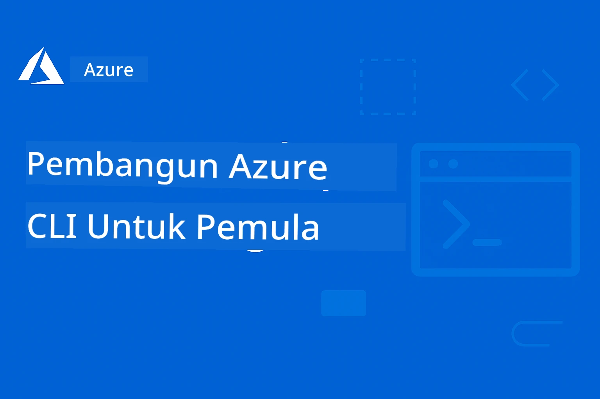

# AZD Untuk Pemula: Perjalanan Pembelajaran Berstruktur

 

[](https://GitHub.com/microsoft/azd-for-beginners/watchers/)
[](https://GitHub.com/microsoft/azd-for-beginners/network/)
[](https://GitHub.com/microsoft/azd-for-beginners/stargazers/)

[](https://discord.gg/microsoft-azure)
[](https://discord.gg/nTYy5BXMWG)

## Memulakan Kursus Ini

Ikuti langkah-langkah ini untuk memulakan perjalanan pembelajaran AZD anda:

1. **Fork Repositori**: Klik [](https://GitHub.com/microsoft/azd-for-beginners/fork)
2. **Clone Repositori**: `git clone https://github.com/microsoft/azd-for-beginners.git`
3. **Sertai Komuniti**: [Komuniti Discord Azure](https://discord.com/invite/ByRwuEEgH4) untuk sokongan pakar
4. **Pilih Laluan Pembelajaran Anda**: Pilih bab di bawah yang sesuai dengan tahap pengalaman anda

### Sokongan Pelbagai Bahasa

#### Terjemahan Automatik (Sentiasa Dikemaskini)

<!-- CO-OP TRANSLATOR LANGUAGES TABLE START -->
[Arabic](../ar/README.md) | [Bengali](../bn/README.md) | [Bulgarian](../bg/README.md) | [Burmese (Myanmar)](../my/README.md) | [Chinese (Simplified)](../zh-CN/README.md) | [Chinese (Traditional, Hong Kong)](../zh-HK/README.md) | [Chinese (Traditional, Macau)](../zh-MO/README.md) | [Chinese (Traditional, Taiwan)](../zh-TW/README.md) | [Croatian](../hr/README.md) | [Czech](../cs/README.md) | [Danish](../da/README.md) | [Dutch](../nl/README.md) | [Estonian](../et/README.md) | [Finnish](../fi/README.md) | [French](../fr/README.md) | [German](../de/README.md) | [Greek](../el/README.md) | [Hebrew](../he/README.md) | [Hindi](../hi/README.md) | [Hungarian](../hu/README.md) | [Indonesian](../id/README.md) | [Italian](../it/README.md) | [Japanese](../ja/README.md) | [Kannada](../kn/README.md) | [Korean](../ko/README.md) | [Lithuanian](../lt/README.md) | [Malay](./README.md) | [Malayalam](../ml/README.md) | [Marathi](../mr/README.md) | [Nepali](../ne/README.md) | [Nigerian Pidgin](../pcm/README.md) | [Norwegian](../no/README.md) | [Persian (Farsi)](../fa/README.md) | [Polish](../pl/README.md) | [Portuguese (Brazil)](../pt-BR/README.md) | [Portuguese (Portugal)](../pt-PT/README.md) | [Punjabi (Gurmukhi)](../pa/README.md) | [Romanian](../ro/README.md) | [Russian](../ru/README.md) | [Serbian (Cyrillic)](../sr/README.md) | [Slovak](../sk/README.md) | [Slovenian](../sl/README.md) | [Spanish](../es/README.md) | [Swahili](../sw/README.md) | [Swedish](../sv/README.md) | [Tagalog (Filipino)](../tl/README.md) | [Tamil](../ta/README.md) | [Telugu](../te/README.md) | [Thai](../th/README.md) | [Turkish](../tr/README.md) | [Ukrainian](../uk/README.md) | [Urdu](../ur/README.md) | [Vietnamese](../vi/README.md)

> **Lebih Suka Clone Secara Tempatan?**

> Repositori ini merangkumi lebih 50 terjemahan bahasa yang secara signifikan meningkatkan saiz muat turun. Untuk clone tanpa terjemahan, gunakan sparse checkout:
> ```bash
> git clone --filter=blob:none --sparse https://github.com/microsoft/AZD-for-beginners.git
> cd AZD-for-beginners
> git sparse-checkout set --no-cone '/*' '!translations' '!translated_images'
> ```
> Ini memberikan anda segala yang anda perlukan untuk menyelesaikan kursus dengan muat turun yang jauh lebih pantas.
<!-- CO-OP TRANSLATOR LANGUAGES TABLE END -->

## Gambaran Keseluruhan Kursus

Kuasi Azure Developer CLI (azd) melalui bab berstruktur yang direka untuk pembelajaran progresif. **Fokus khusus pada penerapan aplikasi AI dengan integrasi Microsoft Foundry.**

### Mengapa Kursus Ini Penting untuk Pembangun Moden

Berdasarkan pandangan komuniti Microsoft Foundry Discord, **45% pembangun ingin menggunakan AZD untuk beban kerja AI** tetapi menghadapi cabaran dengan:
- Seni bina AI pelbagai perkhidmatan yang kompleks
- Amalan terbaik penerapan AI produksi  
- Integrasi dan konfigurasi perkhidmatan AI Azure
- Pengoptimuman kos untuk beban kerja AI
- Penyelesaian masalah isu penerapan khusus AI

### Objektif Pembelajaran

Dengan menyelesaikan kursus berstruktur ini, anda akan:
- **Menguasai Asas AZD**: Konsep utama, pemasangan, dan konfigurasi
- **Menerapkan Aplikasi AI**: Gunakan AZD dengan perkhidmatan Microsoft Foundry
- **Melaksanakan Infrastruktur sebagai Kod**: Mengurus sumber Azure dengan templat Bicep
- **Menyelesaikan Masalah Penerapan**: Atasi isu lazim dan debug masalah
- **Mengoptimumkan untuk Produksi**: Keselamatan, penskalaan, pemantauan, dan pengurusan kos
- **Membangun Penyelesaian Multi-Ejen**: Terapkan seni bina AI kompleks

## 📚 Bab Pembelajaran

*Pilih laluan pembelajaran berdasarkan tahap pengalaman dan matlamat*

### 🚀 Bab 1: Asas & Permulaan Pantas
**Prasyarat**: Langganan Azure, pengetahuan asas baris perintah  
**Tempoh**: 30-45 minit  
**Kekompleksan**: ⭐

#### Apa Yang Akan Anda Pelajari
- Memahami asas Azure Developer CLI
- Memasang AZD pada platform anda
- Penerapan pertama yang berjaya

#### Sumber Pembelajaran
- **🎯 Mula Di Sini**: [Apa itu Azure Developer CLI?](../..)
- **📖 Teori**: [Asas AZD](docs/getting-started/azd-basics.md) - Konsep dan terminologi utama
- **⚙️ Persediaan**: [Pemasangan & Persediaan](docs/getting-started/installation.md) - Panduan khusus platform
- **🛠️ Praktikal**: [Projek Pertama Anda](docs/getting-started/first-project.md) - Tutorial langkah demi langkah
- **📋 Rujukan Pantas**: [Lembaran Perintah Ringkas](resources/cheat-sheet.md)

#### Latihan Praktikal
```bash
# Semakan pemasangan pantas
azd version

# Lancarkan aplikasi pertama anda
azd init --template todo-nodejs-mongo
azd up
```

**💡 Hasil Bab**: Berjaya menerapkan aplikasi web mudah ke Azure menggunakan AZD

**✅ Pengesahan Kejayaan:**
```bash
# Selepas menyelesaikan Bab 1, anda sepatutnya dapat:
azd version              # Menunjukkan versi yang dipasang
azd init --template todo-nodejs-mongo  # Memulakan projek
azd up                  # Menghantar ke Azure
azd show                # Memaparkan URL aplikasi yang sedang berjalan
# Aplikasi dibuka dalam pelayar dan berfungsi
azd down --force --purge  # Membersihkan sumber daya
```

**📊 Masa Pelaburan:** 30-45 minit  
**📈 Tahap Kemahiran Selepas:** Boleh menerapkan aplikasi asas secara berdikari

**✅ Pengesahan Kejayaan:**
```bash
# Selepas selesai Bab 1, anda harus dapat:
azd version              # Menunjukkan versi yang dipasang
azd init --template todo-nodejs-mongo  # Memulakan projek
azd up                  # Menyediakan ke Azure
azd show                # Memaparkan URL aplikasi yang sedang berjalan
# Aplikasi dibuka dalam pelayar dan berfungsi
azd down --force --purge  # Membersihkan sumber daya
```

**📊 Masa Pelaburan:** 30-45 minit  
**📈 Tahap Kemahiran Selepas:** Boleh menerapkan aplikasi asas secara berdikari

---

### 🤖 Bab 2: Pembangunan AI-Pertama (Disyorkan untuk Pembangun AI)
**Prasyarat**: Bab 1 selesai  
**Tempoh**: 1-2 jam  
**Kekompleksan**: ⭐⭐

#### Apa Yang Akan Anda Pelajari
- Integrasi Microsoft Foundry dengan AZD
- Menerapkan aplikasi berkuasa AI
- Memahami konfigurasi perkhidmatan AI

#### Sumber Pembelajaran
- **🎯 Mula Di Sini**: [Integrasi Microsoft Foundry](docs/microsoft-foundry/microsoft-foundry-integration.md)
- **📖 Corak**: [Penerapan Model AI](docs/microsoft-foundry/ai-model-deployment.md) - Terapkan dan urus model AI
- **🛠️ Bengkel**: [Makmal Bengkel AI](docs/microsoft-foundry/ai-workshop-lab.md) - Sediakan penyelesaian AI anda sedia AZD
- **🎥 Panduan Interaktif**: [Bahan Bengkel](workshop/README.md) - Pembelajaran berasaskan pelayar dengan MkDocs * Persekitaran DevContainer
- **📋 Templat**: [Templat Microsoft Foundry](../..)
- **📝 Contoh**: [Contoh Penerapan AZD](examples/README.md)

#### Latihan Praktikal
```bash
# Lancarkan aplikasi AI pertama anda
azd init --template azure-search-openai-demo
azd up

# Cuba templat AI tambahan
azd init --template openai-chat-app-quickstart
azd init --template agent-openai-python-prompty
```

**💡 Hasil Bab**: Terapkan dan konfigurasikan aplikasi chat berkuasa AI dengan kemampuan RAG

**✅ Pengesahan Kejayaan:**
```bash
# Selepas Bab 2, anda sepatutnya boleh:
azd init --template azure-search-openai-demo
azd up
# Uji antara muka sembang AI
# Tanyakan soalan dan terima jawapan berkuasa AI dengan sumber
# Sahkan integrasi carian berfungsi
azd monitor  # Periksa Application Insights menunjukkan telemetri
azd down --force --purge
```

**📊 Masa Pelaburan:** 1-2 jam  
**📈 Tahap Kemahiran Selepas:** Boleh menerapkan dan mengkonfigurasi aplikasi AI sedia produksi  
**💰 Kesedaran Kos:** Fahami kos dev $80-150/bulan, kos produksi $300-3500/bulan

#### 💰 Pertimbangan Kos untuk Penerapan AI

**Persekitaran Pembangunan (Anggaran $80-150/bulan):**
- Azure OpenAI (Bayar-berdasarkan-guna): $0-50/bulan (bergantung penggunaan token)
- AI Search (tahap asas): $75/bulan
- Container Apps (Penggunaan): $0-20/bulan
- Penyimpanan (Standard): $1-5/bulan

**Persekitaran Produksi (Anggaran $300-3,500+/bulan):**
- Azure OpenAI (PTU untuk prestasi konsisten): $3,000+/bulan ATAU Bayar-berdasarkan-guna dengan volum tinggi
- AI Search (tahap standard): $250/bulan
- Container Apps (Dedicated): $50-100/bulan
- Application Insights: $5-50/bulan
- Penyimpanan (Premium): $10-50/bulan

**💡 Tips Pengoptimuman Kos:**
- Gunakan **Tahap Percuma** Azure OpenAI untuk pembelajaran (termasuk 50,000 token/bulan)
- Jalankan `azd down` untuk melepaskan sumber apabila tidak membangunkan secara aktif
- Mula dengan bil berasaskan penggunaan, naik taraf ke PTU hanya untuk produksi
- Gunakan `azd provision --preview` untuk anggaran kos sebelum penerapan
- Aktifkan auto-scaling: bayar hanya untuk penggunaan sebenar

**Pemantauan Kos:**
```bash
# Semak anggaran kos bulanan
azd provision --preview

# Pantau kos sebenar dalam Portal Azure
az consumption budget list --resource-group <your-rg>
```

---

### ⚙️ Bab 3: Konfigurasi & Pengesahan
**Prasyarat**: Bab 1 selesai  
**Tempoh**: 45-60 minit  
**Kekompleksan**: ⭐⭐

#### Apa Yang Akan Anda Pelajari
- Konfigurasi dan pengurusan persekitaran
- Amalan terbaik pengesahan dan keselamatan
- Penamaan dan pengorganisasian sumber

#### Sumber Pembelajaran
- **📖 Konfigurasi**: [Panduan Konfigurasi](docs/getting-started/configuration.md) - Persediaan persekitaran
- **🔐 Keselamatan**: [Corak pengesahan dan identiti terurus](docs/getting-started/authsecurity.md) - Corak pengesahan
- **📝 Contoh**: [Contoh Aplikasi Pangkalan Data](examples/database-app/README.md) - Contoh Pangkalan Data AZD

#### Latihan Praktikal
- Konfigurasikan pelbagai persekitaran (dev, staging, prod)
- Sediakan pengesahan identiti terurus
- Laksanakan konfigurasi khusus persekitaran

**💡 Hasil Bab**: Mengurus pelbagai persekitaran dengan pengesahan dan keselamatan yang betul

---

### 🏗️ Bab 4: Infrastruktur sebagai Kod & Penerapan
**Prasyarat**: Bab 1-3 selesai  
**Tempoh**: 1-1.5 jam  
**Kekompleksan**: ⭐⭐⭐

#### Apa Yang Akan Anda Pelajari
- Corak penerapan lanjutan
- Infrastruktur sebagai Kod dengan Bicep
- Strategi penyediaan sumber

#### Sumber Pembelajaran
- **📖 Penerapan**: [Panduan Penerapan](docs/deployment/deployment-guide.md) - Aliran kerja lengkap
- **🏗️ Penyediaan**: [Penyediaan Sumber](docs/deployment/provisioning.md) - Pengurusan sumber Azure
- **📝 Contoh**: [Contoh Aplikasi Container](../../examples/container-app) - Penerapan bercontainer

#### Latihan Praktikal
- Cipta templat Bicep tersuai
- Terapkan aplikasi pelbagai perkhidmatan
- Laksanakan strategi penerapan biru-hijau

**💡 Hasil Bab**: Terapkan aplikasi pelbagai perkhidmatan kompleks menggunakan templat infrastruktur tersuai

---

### 🎯 Bab 5: Penyelesaian AI Multi-Ejen (Lanjutan)
**Prasyarat**: Bab 1-2 selesai  
**Tempoh**: 2-3 jam  
**Kekompleksan**: ⭐⭐⭐⭐
#### Apa Yang Akan Anda Pelajari
- Corak seni bina ejen berbilang
- Orkestrasi dan koordinasi ejen
- Penempatan AI sedia untuk produksi

#### Sumber Pembelajaran
- **🤖 Projek Pilihan**: [Penyelesaian Ejen Berbilang Runcit](examples/retail-scenario.md) - Pelaksanaan lengkap
- **🛠️ Templat ARM**: [Pakej Templat ARM](../../examples/retail-multiagent-arm-template) - Penempatan satu klik
- **📖 Seni Bina**: [Corak koordinasi pelbagai ejen](/docs/pre-deployment/coordination-patterns.md) - Corak

#### Latihan Praktikal
```bash
# Melaksanakan penyelesaian multi-ejen runcit lengkap
cd examples/retail-multiagent-arm-template
./deploy.sh

# Terokai konfigurasi ejen
az deployment group show --resource-group <rg-name> --name <deployment-name>
```

**💡 Hasil Bab**: Mengendalikan dan mengurus penyelesaian AI ejen berbilang sedia produksi dengan ejen Pelanggan dan Inventori

---

### 🔍 Bab 6: Pengesahan & Perancangan Pra-Penempatan
**Prasyarat**: Bab 4 selesai  
**Tempoh**: 1 jam  
**Kerumitan**: ⭐⭐

#### Apa Yang Akan Anda Pelajari
- Perancangan kapasiti dan pengesahan sumber
- Strategi pemilihan SKU
- Pemeriksaan pra-penerbangan dan automasi

#### Sumber Pembelajaran
- **📊 Perancangan**: [Perancangan Kapasiti](docs/pre-deployment/capacity-planning.md) - Pengesahan sumber
- **💰 Pemilihan**: [Pemilihan SKU](docs/pre-deployment/sku-selection.md) - Pilihan berkesan kos
- **✅ Pengesahan**: [Pemeriksaan Pra-Penerbangan](docs/pre-deployment/preflight-checks.md) - Skrip automatik

#### Latihan Praktikal
- Jalankan skrip pengesahan kapasiti
- Optimumkan pemilihan SKU untuk kos
- Laksanakan pemeriksaan pra-penempatan automatik

**💡 Hasil Bab**: Sahkan dan optimumkan penempatan sebelum pelaksanaan

---

### 🚨 Bab 7: Penyelesaian Masalah & Pengendalian Ralat
**Prasyarat**: Mana-mana bab penempatan selesai  
**Tempoh**: 1-1.5 jam  
**Kerumitan**: ⭐⭐

#### Apa Yang Akan Anda Pelajari
- Pendekatan debugging sistematik
- Isu biasa dan penyelesaian
- Penyelesaian masalah khusus AI

#### Sumber Pembelajaran
- **🔧 Isu Biasa**: [Isu Biasa](docs/troubleshooting/common-issues.md) - Soalan Lazim dan penyelesaian
- **🕵️ Panduan Debugging**: [Panduan Debugging](docs/troubleshooting/debugging.md) - Strategi langkah demi langkah
- **🤖 Isu AI**: [Penyelesaian Masalah Khusus AI](docs/troubleshooting/ai-troubleshooting.md) - Masalah perkhidmatan AI

#### Latihan Praktikal
- Mendiagnosis kegagalan penempatan
- Menyelesaikan masalah pengesahan
- Debugkan sambungan perkhidmatan AI

**💡 Hasil Bab**: Mendiagnosis dan menyelesaikan isu penempatan biasa secara bebas

---

### 🏢 Bab 8: Corak Produksi & Perusahaan
**Prasyarat**: Bab 1-4 selesai  
**Tempoh**: 2-3 jam  
**Kerumitan**: ⭐⭐⭐⭐

#### Apa Yang Akan Anda Pelajari
- Strategi penempatan produksi
- Corak keselamatan perusahaan
- Pemantauan dan pengoptimuman kos

#### Sumber Pembelajaran
- **🏭 Produksi**: [Amalan Terbaik AI Produksi](docs/microsoft-foundry/production-ai-practices.md) - Corak perusahaan
- **📝 Contoh**: [Contoh Microservices](../../examples/microservices) - Seni bina kompleks
- **📊 Pemantauan**: [Integrasi Application Insights](docs/pre-deployment/application-insights.md) - Pemantauan

#### Latihan Praktikal
- Laksanakan corak keselamatan perusahaan
- Sediakan pemantauan menyeluruh
- Tempatkan ke produksi dengan tadbir urus yang betul

**💡 Hasil Bab**: Mengendalikan aplikasi siap perusahaan dengan keupayaan produksi penuh

---

## 🎓 Ringkasan Bengkel: Pengalaman Pembelajaran Praktikal

> **⚠️ STATUS BENGKEL: Pembangunan Aktif**  
> Bahan bengkel sedang dibangunkan dan diperhalusi. Modul teras berfungsi, tetapi sebahagian bahagian lanjutan belum lengkap. Kami sedang berusaha menyelesaikan semua kandungan. [Jejak kemajuan →](workshop/README.md)

### Bahan Bengkel Interaktif
**Pembelajaran praktikal menyeluruh dengan alat berasaskan pelayar dan latihan berpandu**

Bahan bengkel kami menyediakan pengalaman pembelajaran terstruktur dan interaktif yang melengkapkan kurikulum berasaskan bab di atas. Bengkel ini direka untuk pembelajaran kendiri dan sesi yang dikendalikan pengajar.

#### 🛠️ Ciri-ciri Bengkel
- **Antara Muka Berasaskan Pelayar**: Bengkel lengkap dikuasakan MkDocs dengan fungsi cari, salin, dan tema
- **Integrasi GitHub Codespaces**: Tetapan persekitaran pembangunan satu klik
- **Laluan Pembelajaran Terstruktur**: 7 langkah latihan berpandu (jumlah 3.5 jam)
- **Penemuan → Penempatan → Penyesuaian**: Metodologi progresif
- **Persekitaran DevContainer Interaktif**: Alat dan kebergantungan siap konfigurasikan

#### 📚 Struktur Bengkel
Bengkel mengikuti metodologi **Penemuan → Penempatan → Penyesuaian**:

1. **Fasa Penemuan** (45 min)  
   - Terokai templat dan perkhidmatan Microsoft Foundry  
   - Fahami corak seni bina pelbagai ejen  
   - Semak keperluan dan prasyarat penempatan  

2. **Fasa Penempatan** (2 jam)  
   - Hands-on penempatan aplikasi AI dengan AZD  
   - Konfigurasikan perkhidmatan dan titik akhir Azure AI  
   - Laksanakan corak keselamatan dan pengesahan  

3. **Fasa Penyesuaian** (45 min)  
   - Ubah aplikasi untuk kes penggunaan khusus  
   - Optimumkan untuk penempatan produksi  
   - Laksanakan pemantauan dan pengurusan kos  

#### 🚀 Bermula dengan Bengkel
```bash
# Pilihan 1: GitHub Codespaces (Disyorkan)
# Klik "Kod" → "Cipta ruang kod pada main" dalam repositori

# Pilihan 2: Pembangunan Tempatan
git clone https://github.com/microsoft/azd-for-beginners.git
cd azd-for-beginners/workshop
# Ikuti arahan persediaan dalam workshop/README.md
```

#### 🎯 Hasil Pembelajaran Bengkel
Dengan menamatkan bengkel, peserta akan:  
- **Menempatkan Aplikasi AI Produksi**: Gunakan AZD dengan perkhidmatan Microsoft Foundry  
- **Menguasai Seni Bina Ejen Berbilang**: Laksanakan penyelesaian ejen AI berkoordinasi  
- **Implementasi Amalan Keselamatan Terbaik**: Konfigurasikan pengesahan dan kawalan akses  
- **Optimumkan Untuk Skala**: Reka bentuk penempatan yang kos efektif dan berprestasi  
- **Selesaikan Masalah Penempatan**: Menyelesaikan isu umum secara bebas  

#### 📖 Sumber Bengkel
- **🎥 Panduan Interaktif**: [Bahan Bengkel](workshop/README.md) - Persekitaran pembelajaran berasaskan pelayar  
- **📋 Arahan Langkah demi Langkah**: [Latihan Berpandu](../../workshop/docs/instructions) - Panduan terperinci  
- **🛠️ Makmal Bengkel AI**: [Makmal Bengkel AI](docs/microsoft-foundry/ai-workshop-lab.md) - Latihan berfokus AI  
- **💡 Mula Cepat**: [Panduan Persediaan Bengkel](workshop/README.md#quick-start) - Konfigurasi persekitaran  

**Sesuai untuk**: Latihan korporat, kursus universiti, pembelajaran kendiri, dan bootcamp pembangun.

---

## 📖 Apa Itu Azure Developer CLI?

Azure Developer CLI (azd) ialah antara muka baris perintah berorientasikan pembangun yang mempercepat proses pembinaan dan penempatan aplikasi ke Azure. Ia menyediakan:

- **Penempatan berasaskan templat** - Gunakan templat pra-bina untuk corak aplikasi biasa  
- **Infrastruktur sebagai Kod** - Urus sumber Azure menggunakan Bicep atau Terraform  
- **Aliran kerja terintegrasi** - Lancar mengurus penyediaan, penempatan, dan pemantauan aplikasi  
- **Mesra pembangun** - Dioptimumkan untuk produktiviti dan pengalaman pembangun  

### **AZD + Microsoft Foundry: Sesuai Untuk Penempatan AI**

**Kenapa AZD untuk Penyelesaian AI?** AZD menangani cabaran utama pembangun AI:

- **Templat Sedia AI** - Templat pra-konfigurasi untuk Azure OpenAI, Perkhidmatan Kognitif, dan beban ML  
- **Penempatan AI Selamat** - Corak keselamatan terbina dalam untuk perkhidmatan AI, kunci API, dan titik akhir model  
- **Corak AI Produksi** - Amalan terbaik untuk penempatan aplikasi AI yang boleh diskala dan kos efektif  
- **Aliran Kerja AI Sepenuhnya** - Dari pembangunan model hingga penempatan produksi dengan pemantauan betul  
- **Pengoptimuman Kos** - Strategi pengagihan dan skala sumber pintar untuk beban kerja AI  
- **Integrasi Microsoft Foundry** - Sambungan lancar ke katalog model dan titik akhir Microsoft Foundry  

---

## 🎯 Perpustakaan Templat & Contoh

### Pilihan: Templat Microsoft Foundry
**Mulakan di sini jika anda menempatkan aplikasi AI!**

> **Nota:** Templat ini menunjukkan pelbagai corak AI. Ada yang sampel Azure luaran, ada yang pelaksanaan tempatan.

| Templat | Bab | Kerumitan | Perkhidmatan | Jenis |
|----------|---------|------------|----------|------|
| [**Mulakan dengan AI chat**](https://github.com/Azure-Samples/get-started-with-ai-chat) | Bab 2 | ⭐⭐ | AzureOpenAI + API Inference Model AI Azure + Pencarian AI Azure + Azure Container Apps + Application Insights | Luaran |
| [**Mulakan dengan ejen AI**](https://github.com/Azure-Samples/get-started-with-ai-agents) | Bab 2 | ⭐⭐ | Perkhidmatan Ejen AI Azure + AzureOpenAI + Pencarian AI Azure + Azure Container Apps + Application Insights| Luaran |
| [**Demo Azure Search + OpenAI**](https://github.com/Azure-Samples/azure-search-openai-demo) | Bab 2 | ⭐⭐ | AzureOpenAI + Pencarian AI Azure + Perkhidmatan Aplikasi + Penyimpanan | Luaran |
| [**Permulaan Pantas OpenAI Chat App**](https://github.com/Azure-Samples/openai-chat-app-quickstart) | Bab 2 | ⭐ | AzureOpenAI + Container Apps + Application Insights | Luaran |
| [**Agent OpenAI Python Prompty**](https://github.com/Azure-Samples/agent-openai-python-prompty) | Bab 5 | ⭐⭐⭐ | AzureOpenAI + Fungsi Azure + Prompty | Luaran |
| [**Contoso Chat RAG**](https://github.com/Azure-Samples/contoso-chat) | Bab 8 | ⭐⭐⭐⭐ | AzureOpenAI + Pencarian AI + Cosmos DB + Container Apps | Luaran |
| [**Penyelesaian Ejen Berbilang Runcit**](examples/retail-scenario.md) | Bab 5 | ⭐⭐⭐⭐ | AzureOpenAI + Pencarian AI + Penyimpanan + Container Apps + Cosmos DB | **Tempatan** |

### Pilihan: Senario Pembelajaran Lengkap
**Templat aplikasi sedia produksi yang dipetakan ke bab pembelajaran**

| Templat | Bab Pembelajaran | Kerumitan | Pembelajaran Utama |
|----------|------------------|------------|--------------|
| [**openai-chat-app-quickstart**](https://github.com/Azure-Samples/openai-chat-app-quickstart) | Bab 2 | ⭐ | Corak penempatan AI asas |
| [**azure-search-openai-demo**](https://github.com/Azure-Samples/azure-search-openai-demo) | Bab 2 | ⭐⭐ | Pelaksanaan RAG dengan Pencarian AI Azure |
| [**ai-document-processing**](https://github.com/Azure-Samples/ai-document-processing) | Bab 4 | ⭐⭐ | Integrasi Kecerdasan Dokumen |
| [**agent-openai-python-prompty**](https://github.com/Azure-Samples/agent-openai-python-prompty) | Bab 5 | ⭐⭐⭐ | Rangka kerja ejen dan pemanggilan fungsi |
| [**contoso-chat**](https://github.com/Azure-Samples/contoso-chat) | Bab 8 | ⭐⭐⭐ | Orkestrasi AI perusahaan |
| [**retail-multi-agent-solution**](examples/retail-scenario.md) | Bab 5 | ⭐⭐⭐⭐ | Seni bina ejen berbilang dengan ejen Pelanggan dan Inventori |

### Pembelajaran Mengikut Jenis Contoh

> **📌 Contoh Tempatan vs. Luaran:**  
> **Contoh Tempatan** (dalam repositori ini) = Sedia untuk digunakan segera  
> **Contoh Luaran** (Sampel Azure) = Klon dari repositori pautan

#### Contoh Tempatan (Sedia Digunakan)
- [**Penyelesaian Ejen Berbilang Runcit**](examples/retail-scenario.md) - Pelaksanaan lengkap sedia produksi dengan templat ARM  
  - Seni bina ejen berbilang (Ejen Pelanggan + Inventori)  
  - Pemantauan dan penilaian menyeluruh  
  - Penempatan satu klik melalui templat ARM  

#### Contoh Tempatan - Aplikasi Kontena (Bab 2-5)
**Contoh penempatan kontena menyeluruh dalam repositori ini:**  
- [**Contoh Aplikasi Kontena**](examples/container-app/README.md) - Panduan lengkap penempatan berasaskan kontena  
  - [API Flask ringkas](../../examples/container-app/simple-flask-api) - API REST asas dengan skala ke sifar  
  - [Seni bina Microservices](../../examples/container-app/microservices) - Penempatan multi-perkhidmatan sedia produksi  
  - Corak permulaan pantas, produksi, dan lanjutan  
  - Panduan pemantauan, keselamatan, dan pengoptimuman kos  

#### Contoh Luaran - Aplikasi Mudah (Bab 1-2)
**Klon repositori Sampel Azure ini untuk bermula:**  
- [Aplikasi Web Mudah - Node.js + MongoDB](https://github.com/Azure-Samples/todo-nodejs-mongo) - Corak penempatan asas  
- [Laman Web Statik - SPA React](https://github.com/Azure-Samples/todo-csharp-sql-swa-func) - Penempatan kandungan statik  
- [Aplikasi Kontena - Python Flask](https://github.com/Azure-Samples/container-apps-store-api-microservice) - Penempatan API REST  

#### Contoh Luaran - Integrasi Pangkalan Data (Bab 3-4)  
- [Aplikasi Pangkalan Data - C# + SQL](https://github.com/Azure-Samples/todo-csharp-sql) - Corak sambungan pangkalan data  
- [Fungsi + Cosmos DB](https://github.com/Azure-Samples/todo-python-mongo-swa-func) - Aliran kerja data serverless  

#### Contoh Luaran - Corak Lanjutan (Bab 4-8)
- [Microservices Java](https://github.com/Azure-Samples/java-microservices-aca-lab) - Seni bina multi-perkhidmatan  
- [Tugas Aplikasi Kontena](https://github.com/Azure-Samples/container-apps-jobs) - Pemprosesan latar belakang  
- [Saluran ML Perusahaan](https://github.com/Azure-Samples/mlops-v2) - Corak ML sedia produksi  

### Koleksi Templat Luaran
- [**Galeri Templat AZD Rasmi**](https://azure.github.io/awesome-azd/) - Koleksi terpilih templat rasmi dan komuniti
- [**Templat Azure Developer CLI**](https://learn.microsoft.com/en-us/azure/developer/azure-developer-cli/azd-templates) - Dokumentasi templat Microsoft Learn
- [**Direktori Contoh**](examples/README.md) - Contoh pembelajaran tempatan dengan penjelasan terperinci

---

## 📚 Sumber Pembelajaran & Rujukan

### Rujukan Pantas
- [**Lembaran Cepat Perintah**](resources/cheat-sheet.md) - Perintah azd penting yang disusun mengikut bab
- [**Glosari**](resources/glossary.md) - Istilah Azure dan azd  
- [**Soalan Lazim**](resources/faq.md) - Soalan biasa yang disusun mengikut bab pembelajaran
- [**Panduan Belajar**](resources/study-guide.md) - Latihan amali menyeluruh

### Bengkel Praktikal
- [**Makmal Bengkel AI**](docs/microsoft-foundry/ai-workshop-lab.md) - Jadikan penyelesaian AI anda boleh dideploy menggunakan AZD (2-3 jam)
- [**Panduan Bengkel Interaktif**](workshop/README.md) - Bengkel berbasis pelayar dengan MkDocs dan Persekitaran DevContainer
- [**Jejak Pembelajaran Berstruktur**](../../workshop/docs/instructions) - Latihan berpandukan 7 langkah (Penemuan → Penyebaran → Penyesuaian)
- [**Bengkel AZD Untuk Pemula**](workshop/README.md) - Bahan bengkel praktikal lengkap dengan integrasi GitHub Codespaces

### Sumber Pembelajaran Luar
- Dokumentasi Azure Developer CLI (https://learn.microsoft.com/en-us/azure/developer/azure-developer-cli/)
- Pusat Seni Bina Azure (https://learn.microsoft.com/en-us/azure/architecture/)
- Kalkulator Harga Azure (https://azure.microsoft.com/pricing/calculator/)
- Status Azure (https://status.azure.com/)

---

## 🔧 Panduan Pantas Penyelesaian Masalah

**Isu biasa yang dihadapi pemula dan penyelesaian segera:**

### ❌ "azd: arahan tidak dijumpai"

```bash
# Pasang AZD dahulu
# Windows (PowerShell):
winget install microsoft.azd

# macOS:
brew tap azure/azd && brew install azd

# Linux:
curl -fsSL https://aka.ms/install-azd.sh | bash

# Sahkan pemasangan
azd version
```

### ❌ "Tiada langganan dijumpai" atau "Langganan tidak ditetapkan"

```bash
# Senaraikan langganan yang tersedia
az account list --output table

# Tetapkan langganan lalai
az account set --subscription "<subscription-id-or-name>"

# Tetapkan untuk persekitaran AZD
azd env set AZURE_SUBSCRIPTION_ID "<subscription-id>"

# Sahkan
az account show
```

### ❌ "InsufficientQuota" atau "Kuota melebihi had"

```bash
# Cuba rantau Azure yang berbeza
azd env set AZURE_LOCATION "westus2"
azd up

# Atau gunakan SKU yang lebih kecil dalam pembangunan
# Sunting infra/main.parameters.json:
{
  "sku": "B1"  // Instead of "P1V2"
}
```

### ❌ "azd up" gagal separuh jalan

```bash
# Pilihan 1: Bersihkan dan cuba semula
azd down --force --purge
azd up

# Pilihan 2: Baiki infrastruktur sahaja
azd provision

# Pilihan 3: Semak log terperinci
azd show
azd logs
```

### ❌ "Pengesahan gagal" atau "Token tamat tempoh"

```bash
# Sahkan semula
az logout
az login

azd auth logout
azd auth login

# Sahkan pengesahan
az account show
```

### ❌ "Sumber sudah wujud" atau konflik penamaan

```bash
# AZD menjana nama unik, tetapi jika berlaku konflik:
azd down --force --purge

# Kemudian cuba semula dengan persekitaran baru
azd env new dev-v2
azd up
```

### ❌ Penyebaran templat mengambil masa terlalu lama

**Masa menunggu biasa:**
- Apl web ringkas: 5-10 minit
- Apl dengan pangkalan data: 10-15 minit
- Aplikasi AI: 15-25 minit (Penyediaan OpenAI lambat)

```bash
# Semak kemajuan
azd show

# Jika tersekat >30 minit, semak Portal Azure:
azd monitor
# Cari penyebaran yang gagal
```

### ❌ "Kebenaran ditolak" atau "Dilarang"

```bash
# Semak peranan Azure anda
az role assignment list --assignee $(az account show --query user.name -o tsv)

# Anda memerlukan sekurang-kurangnya peranan "Contributor"
# Minta pentadbir Azure anda untuk memberikan:
# - Contributor (untuk sumber)
# - Pentadbir Akses Pengguna (untuk tugasan peranan)
```

### ❌ Tidak dapat mencari URL aplikasi yang disebarkan

```bash
# Papar semua titik akhir perkhidmatan
azd show

# Atau buka Portal Azure
azd monitor

# Semak perkhidmatan tertentu
azd env get-values
# Cari pembolehubah *_URL
```

### 📚 Sumber Penyelesaian Masalah Penuh

- **Panduan Isu Lazim:** [Penyelesaian Terperinci](docs/troubleshooting/common-issues.md)
- **Isu Khusus AI:** [Penyelesaian Masalah AI](docs/troubleshooting/ai-troubleshooting.md)
- **Panduan Debug:** [Debug langkah demi langkah](docs/troubleshooting/debugging.md)
- **Dapatkan Bantuan:** [Azure Discord](https://discord.gg/microsoft-azure) #azure-developer-cli

---

## 🔧 Panduan Pantas Penyelesaian Masalah

**Isu biasa yang dihadapi pemula dan penyelesaian segera:**

<details>
<summary><strong>❌ "azd: arahan tidak dijumpai"</strong></summary>

```bash
# Pasang AZD dahulu
# Windows (PowerShell):
winget install microsoft.azd

# macOS:
brew tap azure/azd && brew install azd

# Linux:
curl -fsSL https://aka.ms/install-azd.sh | bash

# Sahkan pemasangan
azd version
```
</details>

<details>
<summary><strong>❌ "Tiada langganan dijumpai" atau "Langganan tidak ditetapkan"</strong></summary>

```bash
# Senaraikan langganan yang tersedia
az account list --output table

# Tetapkan langganan lalai
az account set --subscription "<subscription-id-or-name>"

# Tetapkan untuk persekitaran AZD
azd env set AZURE_SUBSCRIPTION_ID "<subscription-id>"

# Sahkan
az account show
```
</details>

<details>
<summary><strong>❌ "InsufficientQuota" atau "Kuota melebihi had"</strong></summary>

```bash
# Cuba rantau Azure yang berbeza
azd env set AZURE_LOCATION "westus2"
azd up

# Atau gunakan SKU yang lebih kecil dalam pembangunan
# Edit infra/main.parameters.json:
{
  "sku": "B1"  // Instead of "P1V2"
}
```
</details>

<details>
<summary><strong>❌ "azd up" gagal separuh jalan</strong></summary>

```bash
# Pilihan 1: Bersihkan dan cuba semula
azd down --force --purge
azd up

# Pilihan 2: Betulkan infrastruktur sahaja
azd provision

# Pilihan 3: Semak log terperinci
azd show
azd logs
```
</details>

<details>
<summary><strong>❌ "Pengesahan gagal" atau "Token tamat tempoh"</strong></summary>

```bash
# Sahkan semula
az logout
az login

azd auth logout
azd auth login

# Sahkan pengesahan
az account show
```
</details>

<details>
<summary><strong>❌ "Sumber sudah wujud" atau konflik penamaan</strong></summary>

```bash
# AZD menghasilkan nama unik, tetapi jika berlaku konflik:
azd down --force --purge

# Kemudian cuba semula dengan persekitaran baru
azd env new dev-v2
azd up
```
</details>

<details>
<summary><strong>❌ Penyebaran templat mengambil masa terlalu lama</strong></summary>

**Masa menunggu biasa:**
- Apl web ringkas: 5-10 minit
- Apl dengan pangkalan data: 10-15 minit
- Aplikasi AI: 15-25 minit (Penyediaan OpenAI lambat)

```bash
# Semak kemajuan
azd show

# Jika tersekat >30 minit, semak Portal Azure:
azd monitor
# Cari penempatan yang gagal
```
</details>

<details>
<summary><strong>❌ "Kebenaran ditolak" atau "Dilarang"</strong></summary>

```bash
# Semak peranan Azure anda
az role assignment list --assignee $(az account show --query user.name -o tsv)

# Anda memerlukan sekurang-kurangnya peranan "Contributor"
# Minta pentadbir Azure anda memberikan:
# - Contributor (untuk sumber)
# - User Access Administrator (untuk penugasan peranan)
```
</details>

<details>
<summary><strong>❌ Tidak dapat mencari URL aplikasi yang disebarkan</strong></summary>

```bash
# Paparkan semua titik akhir perkhidmatan
azd show

# Atau buka Portal Azure
azd monitor

# Periksa perkhidmatan tertentu
azd env get-values
# Cari pemboleh ubah *_URL
```
</details>

### 📚 Sumber Penyelesaian Masalah Penuh

- **Panduan Isu Lazim:** [Penyelesaian Terperinci](docs/troubleshooting/common-issues.md)
- **Isu Khusus AI:** [Penyelesaian Masalah AI](docs/troubleshooting/ai-troubleshooting.md)
- **Panduan Debug:** [Debug langkah demi langkah](docs/troubleshooting/debugging.md)
- **Dapatkan Bantuan:** [Azure Discord](https://discord.gg/microsoft-azure) #azure-developer-cli

---

## 🎓 Penyempurnaan Kursus & Pensijilan

### Penjejakan Kemajuan
Jejaki kemajuan pembelajaran anda melalui setiap bab:

- [ ] **Bab 1**: Asas & Mula Pantas ✅
- [ ] **Bab 2**: Pembangunan AI-Pertama ✅  
- [ ] **Bab 3**: Konfigurasi & Pengesahan ✅
- [ ] **Bab 4**: Infrastruktur sebagai Kod & Penyebaran ✅
- [ ] **Bab 5**: Penyelesaian AI Pelbagai Agen ✅
- [ ] **Bab 6**: Pengesahan & Perancangan Pracetak ✅
- [ ] **Bab 7**: Penyelesaian Masalah & Debugging ✅
- [ ] **Bab 8**: Corak Pengeluaran & Perusahaan ✅

### Pengesahan Pembelajaran
Setelah menamatkan setiap bab, sahkan pengetahuan anda dengan:
1. **Latihan Praktikal**: Selesaikan penyebaran praktikal bab tersebut
2. **Semakan Pengetahuan**: Semak bahagian FAQ untuk bab anda
3. **Perbincangan Komuniti**: Kongsi pengalaman anda dalam Azure Discord
4. **Bab Seterusnya**: Beralih ke tahap kerumitan seterusnya

### Manfaat Menyelesaikan Kursus
Setelah menamatkan semua bab, anda akan mendapat:
- **Pengalaman Pengeluaran**: Penyebaran aplikasi AI sebenar ke Azure
- **Kemahiran Profesional**: Kebolehan penyebaran bersedia perusahaan  
- **Pengiktirafan Komuniti**: Ahli aktif komuniti pembangun Azure
- **Kemajuan Kerjaya**: Kepakaran AZD dan penyebaran AI yang diminati

---

## 🤝 Komuniti & Sokongan

### Dapatkan Bantuan & Sokongan
- **Isu Teknikal**: [Laporkan pepijat dan minta ciri](https://github.com/microsoft/azd-for-beginners/issues)
- **Soalan Pembelajaran**: [Komuniti Microsoft Azure Discord](https://discord.gg/microsoft-azure) dan [](https://discord.gg/nTYy5BXMWG)
- **Bantuan Khusus AI**: Sertai [](https://discord.gg/nTYy5BXMWG)
- **Dokumentasi**: [Dokumentasi rasmi Azure Developer CLI](https://learn.microsoft.com/en-us/azure/developer/azure-developer-cli/)

### Pandangan Komuniti dari Microsoft Foundry Discord

**Keputusan Terkini Undian dari Saluran #Azure:**
- **45%** pembangun ingin menggunakan AZD untuk beban kerja AI
- **Cabaran utama**: Penyebaran multi-perkhidmatan, pengurusan kelayakan, kesediaan pengeluaran  
- **Permintaan terbanyak**: Templat khusus AI, panduan penyelesaian masalah, amalan terbaik

**Sertai komuniti kami untuk:**
- Berkongsi pengalaman AZD + AI dan dapatkan bantuan
- Akses pratonton awal templat AI baru
- Menyumbang kepada amalan terbaik penyebaran AI
- Mempengaruhi pembangunan ciri AI + AZD masa hadapan

### Menyumbang kepada Kursus
Kami mengalu-alukan sumbangan! Sila baca [Panduan Menyumbang](CONTRIBUTING.md) untuk maklumat tentang:
- **Penambahbaikan Kandungan**: Memperbaiki bab dan contoh sedia ada
- **Contoh Baru**: Tambah senario dunia sebenar dan templat  
- **Terjemahan**: Membantu mengekalkan sokongan pelbagai bahasa
- **Laporan Pepijat**: Menambah ketepatan dan kejelasan
- **Standard Komuniti**: Ikuti garis panduan komuniti inklusif kami

---

## 📄 Maklumat Kursus

### Lesen
Projek ini dilesenkan di bawah Lesen MIT - lihat fail [LICENSE](../../LICENSE) untuk perincian.

### Sumber Pembelajaran Microsoft Berkaitan

Pasukan kami menghasilkan kursus pembelajaran menyeluruh lain:

<!-- CO-OP TRANSLATOR OTHER COURSES START -->
### LangChain
[](https://aka.ms/langchain4j-for-beginners)
[](https://aka.ms/langchainjs-for-beginners?WT.mc_id=m365-94501-dwahlin)
[](https://github.com/microsoft/langchain-for-beginners?WT.mc_id=m365-94501-dwahlin)
---

### Azure / Edge / MCP / Agen
[](https://github.com/microsoft/AZD-for-beginners?WT.mc_id=academic-105485-koreyst)
[](https://github.com/microsoft/edgeai-for-beginners?WT.mc_id=academic-105485-koreyst)
[](https://github.com/microsoft/mcp-for-beginners?WT.mc_id=academic-105485-koreyst)
[](https://github.com/microsoft/ai-agents-for-beginners?WT.mc_id=academic-105485-koreyst)

---
 
### Siri AI Generatif
[](https://github.com/microsoft/generative-ai-for-beginners?WT.mc_id=academic-105485-koreyst)
[-9333EA?style=for-the-badge&labelColor=E5E7EB&color=9333EA)](https://github.com/microsoft/Generative-AI-for-beginners-dotnet?WT.mc_id=academic-105485-koreyst)
[-C084FC?style=for-the-badge&labelColor=E5E7EB&color=C084FC)](https://github.com/microsoft/generative-ai-for-beginners-java?WT.mc_id=academic-105485-koreyst)
[-E879F9?style=for-the-badge&labelColor=E5E7EB&color=E879F9)](https://github.com/microsoft/generative-ai-with-javascript?WT.mc_id=academic-105485-koreyst)

---
 
### Pembelajaran Teras
---
 
### Siri Copilot

---

## 🗺️ Navigasi Kursus

**🚀 Sedia untuk Mula Belajar?**

**Pemula**: Mulakan dengan [Bab 1: Asas & Mula Pantas](../..)  
**Pembangun AI**: Terus ke [Bab 2: Pembangunan AI-Pertama](../..)  
**Pembangun Berpengalaman**: Mulakan dengan [Bab 3: Konfigurasi & Pengesahan](../..)

**Langkah Seterusnya**: [Mula Bab 1 - Asas AZD](docs/getting-started/azd-basics.md) →

---

<!-- CO-OP TRANSLATOR DISCLAIMER START -->
**Penafian**:
Dokumen ini telah diterjemahkan menggunakan perkhidmatan terjemahan AI [Co-op Translator](https://github.com/Azure/co-op-translator). Walaupun kami berusaha untuk ketepatan, sila maklum bahawa terjemahan automatik mungkin mengandungi kesilapan atau ketidaktepatan. Dokumen asal dalam bahasa asalnya hendaklah dianggap sebagai sumber yang sahih. Untuk maklumat penting, terjemahan profesional oleh manusia adalah disyorkan. Kami tidak bertanggungjawab terhadap sebarang salah faham atau tafsiran yang salah yang timbul daripada penggunaan terjemahan ini.
<!-- CO-OP TRANSLATOR DISCLAIMER END -->