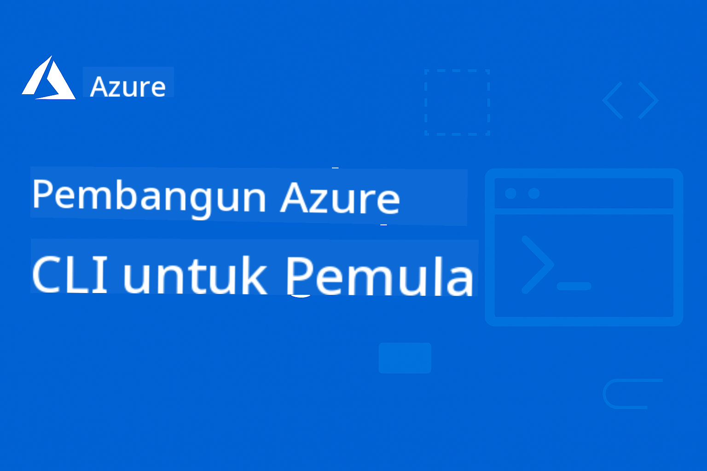

<!--
CO_OP_TRANSLATOR_METADATA:
{
  "original_hash": "068c87cc2641a81ca353ad7064ff326a",
  "translation_date": "2026-01-01T18:03:00+00:00",
  "source_file": "README.md",
  "language_code": "ms"
}
-->
# AZD Untuk Pemula: Perjalanan Pembelajaran Berstruktur

 

[](https://GitHub.com/microsoft/azd-for-beginners/watchers/)
[](https://GitHub.com/microsoft/azd-for-beginners/network/)
[](https://GitHub.com/microsoft/azd-for-beginners/stargazers/)

[](https://discord.gg/microsoft-azure)
[](https://discord.gg/nTYy5BXMWG)

## Mula dengan Kursus Ini

Ikuti langkah-langkah ini untuk memulakan perjalanan pembelajaran AZD anda:

1. **Fork Repositori**: Klik [](https://GitHub.com/microsoft/azd-for-beginners/fork)
2. **Klon Repositori**: `git clone https://github.com/microsoft/azd-for-beginners.git`
3. **Sertai Komuniti**: [Azure Discord Communities](https://discord.com/invite/ByRwuEEgH4) untuk sokongan pakar
4. **Pilih Laluan Pembelajaran Anda**: Pilih bab di bawah yang sesuai dengan tahap pengalaman anda

### Sokongan Berbilang Bahasa

#### Terjemahan Automatik (Sentiasa Dikemas kini)

<!-- CO-OP TRANSLATOR LANGUAGES TABLE START -->
[Arab](../ar/README.md) | [Bengali](../bn/README.md) | [Bulgaria](../bg/README.md) | [Bahasa Burma (Myanmar)](../my/README.md) | [Cina (Ringkas)](../zh/README.md) | [Cina (Tradisional, Hong Kong)](../hk/README.md) | [Cina (Tradisional, Macau)](../mo/README.md) | [Cina (Tradisional, Taiwan)](../tw/README.md) | [Croatia](../hr/README.md) | [Czech](../cs/README.md) | [Denmark](../da/README.md) | [Belanda](../nl/README.md) | [Estonia](../et/README.md) | [Finland](../fi/README.md) | [Perancis](../fr/README.md) | [Jerman](../de/README.md) | [Yunani](../el/README.md) | [Ibrani](../he/README.md) | [Hindi](../hi/README.md) | [Hungaria](../hu/README.md) | [Indonesia](../id/README.md) | [Itali](../it/README.md) | [Jepun](../ja/README.md) | [Kannada](../kn/README.md) | [Korea](../ko/README.md) | [Lithuania](../lt/README.md) | [Melayu](./README.md) | [Malayalam](../ml/README.md) | [Marathi](../mr/README.md) | [Nepali](../ne/README.md) | [Pidgin Nigeria](../pcm/README.md) | [Norwegia](../no/README.md) | [Parsi (Farsi)](../fa/README.md) | [Poland](../pl/README.md) | [Portugis (Brazil)](../br/README.md) | [Portugis (Portugal)](../pt/README.md) | [Punjabi (Gurmukhi)](../pa/README.md) | [Romania](../ro/README.md) | [Rusia](../ru/README.md) | [Serbia (Cyrillic)](../sr/README.md) | [Slovakia](../sk/README.md) | [Slovenia](../sl/README.md) | [Sepanyol](../es/README.md) | [Swahili](../sw/README.md) | [Swedia](../sv/README.md) | [Tagalog (Filipino)](../tl/README.md) | [Tamil](../ta/README.md) | [Telugu](../te/README.md) | [Thai](../th/README.md) | [Turki](../tr/README.md) | [Ukraina](../uk/README.md) | [Urdu](../ur/README.md) | [Vietnam](../vi/README.md)
<!-- CO-OP TRANSLATOR LANGUAGES TABLE END -->

## Gambaran Kursus

Menguasai Azure Developer CLI (azd) melalui bab-bab berstruktur yang direka untuk pembelajaran progresif. **Fokus khas pada penyebaran aplikasi AI dengan integrasi Microsoft Foundry.**

### Kenapa Kursus Ini Penting untuk Pembangun Moden

Berdasarkan pandangan komuniti Discord Microsoft Foundry, **45% pembangun ingin menggunakan AZD untuk beban kerja AI** tetapi menghadapi cabaran dengan:
- Seni bina AI berbilang perkhidmatan yang kompleks
- Amalan terbaik penyebaran AI untuk pengeluaran  
- Integrasi dan konfigurasi perkhidmatan Azure AI
- Pengoptimuman kos untuk beban kerja AI
- Penyelesaian masalah isu penyebaran khusus AI

### Objektif Pembelajaran

Dengan menyelesaikan kursus berstruktur ini, anda akan:
- **Kuasi Asas AZD**: Konsep teras, pemasangan, dan konfigurasi
- **Sebarkan Aplikasi AI**: Gunakan AZD dengan perkhidmatan Microsoft Foundry
- **Laksanakan Infrastruktur sebagai Kod**: Urus sumber Azure dengan templat Bicep
- **Selesaikan Masalah Penyebaran**: Menyelesaikan isu biasa dan memebug masalah
- **Optimumkan untuk Pengeluaran**: Keselamatan, penskalaan, pemantauan, dan pengurusan kos
- **Bina Penyelesaian Multi-Ejen**: Sebarkan seni bina AI yang kompleks

## 📚 Bab Pembelajaran

*Pilih laluan pembelajaran anda berdasarkan tahap pengalaman dan matlamat*

### 🚀 Bab 1: Asas & Permulaan Pantas
**Prasyarat**: Langganan Azure, pengetahuan asas baris arahan  
**Tempoh**: 30-45 minit  
**Kerumitan**: ⭐

#### Apa Yang Akan Anda Pelajari
- Memahami asas Azure Developer CLI
- Memasang AZD pada platform anda
- Penyebaran berjaya pertama anda

#### Sumber Pembelajaran
- **🎯 Mulakan Di Sini**: [Apakah Azure Developer CLI?](../..)
- **📖 Teori**: [Asas AZD](docs/getting-started/azd-basics.md) - Konsep teras dan istilah
- **⚙️ Persediaan**: [Pemasangan & Persediaan](docs/getting-started/installation.md) - Panduan khusus platform
- **🛠️ Amali**: [Projek Pertama Anda](docs/getting-started/first-project.md) - Tutorial langkah demi langkah
- **📋 Rujukan Pantas**: [Lembaran Rujukan Arahan](resources/cheat-sheet.md)

#### Latihan Praktikal
```bash
# Semakan pemasangan pantas
azd version

# Sebarkan aplikasi pertama anda
azd init --template todo-nodejs-mongo
azd up
```

**💡 Hasil Bab**: Berjaya menyebarkan aplikasi web ringkas ke Azure menggunakan AZD

**✅ Pengesahan Kejayaan:**
```bash
# Selepas menyelesaikan Bab 1, anda sepatutnya dapat:
azd version              # Memaparkan versi yang dipasang
azd init --template todo-nodejs-mongo  # Memulakan projek
azd up                  # Menyebarkan ke Azure
azd show                # Memaparkan URL aplikasi yang sedang berjalan
# Aplikasi dibuka dalam pelayar dan berfungsi
azd down --force --purge  # Membersihkan sumber daya
```

**📊 Masa Pelaburan:** 30-45 minit  
**📈 Tahap Kemahiran Selepas:** Boleh menyebarkan aplikasi asas secara berdikari

**✅ Pengesahan Kejayaan:**
```bash
# Selepas menyelesaikan Bab 1, anda sepatutnya dapat:
azd version              # Memaparkan versi yang dipasang
azd init --template todo-nodejs-mongo  # Memulakan projek
azd up                  # Menyebarkan ke Azure
azd show                # Memaparkan URL aplikasi yang sedang berjalan
# Aplikasi dibuka di penyemak imbas dan berfungsi
azd down --force --purge  # Membersihkan sumber
```

**📊 Masa Pelaburan:** 30-45 minit  
**📈 Tahap Kemahiran Selepas:** Boleh menyebarkan aplikasi asas secara berdikari

---

### 🤖 Bab 2: Pembangunan Berfokus AI (Disyorkan untuk Pembangun AI)
**Prasyarat**: Bab 1 diselesaikan  
**Tempoh**: 1-2 jam  
**Kerumitan**: ⭐⭐

#### Apa Yang Akan Anda Pelajari
- Integrasi Microsoft Foundry dengan AZD
- Menyebarkan aplikasi berkuasa AI
- Memahami konfigurasi perkhidmatan AI

#### Sumber Pembelajaran
- **🎯 Mulakan Di Sini**: [Integrasi Microsoft Foundry](docs/microsoft-foundry/microsoft-foundry-integration.md)
- **📖 Corak**: [Penyebaran Model AI](docs/microsoft-foundry/ai-model-deployment.md) - Menyebarkan dan mengurus model AI
- **🛠️ Bengkel**: [Makmal Bengkel AI](docs/microsoft-foundry/ai-workshop-lab.md) - Jadikan penyelesaian AI anda sedia AZD
- **🎥 Panduan Interaktif**: [Bahan Bengkel](workshop/README.md) - Pembelajaran berasaskan pelayar dengan MkDocs * DevContainer Environment
- **📋 Templat**: [Templat Microsoft Foundry](../..)
- **📝 Contoh**: [Contoh Penyebaran AZD](examples/README.md)

#### Latihan Praktikal
```bash
# Lancarkan aplikasi AI pertama anda
azd init --template azure-search-openai-demo
azd up

# Cuba templat AI tambahan
azd init --template openai-chat-app-quickstart
azd init --template agent-openai-python-prompty
```

**💡 Hasil Bab**: Menyebarkan dan mengkonfigurasi aplikasi sembang berkuasa AI dengan kebolehan RAG

**✅ Pengesahan Kejayaan:**
```bash
# Selepas Bab 2, anda sepatutnya boleh:
azd init --template azure-search-openai-demo
azd up
# Uji antara muka sembang AI
# Ajukan soalan dan dapatkan respons dikuasakan AI beserta sumber
# Sahkan integrasi carian berfungsi
azd monitor  # Periksa Application Insights memaparkan telemetri
azd down --force --purge
```

**📊 Masa Pelaburan:** 1-2 jam  
**📈 Tahap Kemahiran Selepas:** Boleh menyebarkan dan mengkonfigurasi aplikasi AI yang sedia untuk pengeluaran  
**💰 Kesedaran Kos:** Fahami kos pembangunan $80-150/bulan, kos pengeluaran $300-3500/bulan

#### 💰 Pertimbangan Kos untuk Penyebaran AI

**Persekitaran Pembangunan (Dianggarkan $80-150/bulan):**
- Azure OpenAI (Bayar-sebagai-anda-guna): $0-50/bulan (berdasarkan penggunaan token)
- AI Search (aras Asas): $75/bulan
- Container Apps (Penggunaan): $0-20/bulan
- Penyimpanan (Standard): $1-5/bulan

**Persekitaran Pengeluaran (Dianggarkan $300-3,500+/bulan):**
- Azure OpenAI (PTU untuk prestasi konsisten): $3,000+/bulan ATAU Bayar-sebagai-anda-guna dengan volum tinggi
- AI Search (aras Standard): $250/bulan
- Container Apps (Dedicated): $50-100/bulan
- Application Insights: $5-50/bulan
- Penyimpanan (Premium): $10-50/bulan

**💡 Petua Pengoptimuman Kos:**
- Gunakan **Tier Percuma** Azure OpenAI untuk pembelajaran (50,000 token/bulan disertakan)
- Jalankan `azd down` untuk melepaskan sumber apabila tidak sedang membangunkan
- Mula dengan pengebilan berasaskan penggunaan, naik taraf ke PTU hanya untuk pengeluaran
- Gunakan `azd provision --preview` untuk menganggarkan kos sebelum penyebaran
- Dayakan auto-scaling: bayar hanya untuk penggunaan sebenar

**Pemantauan Kos:**
```bash
# Semak anggaran kos bulanan
azd provision --preview

# Pantau kos sebenar di Portal Azure
az consumption budget list --resource-group <your-rg>
```

---

### ⚙️ Bab 3: Konfigurasi & Pengesahan
**Prasyarat**: Bab 1 diselesaikan  
**Tempoh**: 45-60 minit  
**Kerumitan**: ⭐⭐

#### Apa Yang Akan Anda Pelajari
- Konfigurasi dan pengurusan persekitaran
- Pengesahan dan amalan keselamatan terbaik
- Penamaan dan pengurusan organisasi sumber

#### Sumber Pembelajaran
- **📖 Konfigurasi**: [Panduan Konfigurasi](docs/getting-started/configuration.md) - Persediaan persekitaran
- **🔐 Keselamatan**: [Corak pengesahan dan identiti terurus](docs/getting-started/authsecurity.md) - Corak pengesahan
- **📝 Contoh**: [Contoh Aplikasi Pangkalan Data](examples/database-app/README.md) - Contoh Pangkalan Data AZD

#### Latihan Praktikal
- Konfigurasikan pelbagai persekitaran (dev, staging, prod)
- Sediakan pengesahan identiti terurus
- Laksanakan konfigurasi khusus persekitaran

**💡 Hasil Bab**: Urus pelbagai persekitaran dengan pengesahan dan keselamatan yang betul

---

### 🏗️ Bab 4: Infrastruktur sebagai Kod & Penyebaran
**Prasyarat**: Bab 1-3 diselesaikan  
**Tempoh**: 1-1.5 jam  
**Kerumitan**: ⭐⭐⭐

#### Apa Yang Akan Anda Pelajari
- Corak penyebaran lanjutan
- Infrastruktur sebagai Kod dengan Bicep
- Strategi penyediaan sumber

#### Sumber Pembelajaran
- **📖 Penyebaran**: [Panduan Penyebaran](docs/deployment/deployment-guide.md) - Aliran kerja lengkap
- **🏗️ Penyediaan**: [Penyediaan Sumber](docs/deployment/provisioning.md) - Pengurusan sumber Azure
- **📝 Contoh**: [Contoh Aplikasi Kontena](../../examples/container-app) - Penyebaran berasaskan kontena

#### Latihan Praktikal
- Buat templat Bicep tersuai
- Sebarkan aplikasi berbilang perkhidmatan
- Laksanakan strategi penyebaran blue-green

**💡 Hasil Bab**: Menyebarkan aplikasi berbilang perkhidmatan yang kompleks menggunakan templat infrastruktur tersuai

---

### 🎯 Bab 5: Penyelesaian AI Multi-Ejen (Lanjutan)
**Prasyarat**: Bab 1-2 diselesaikan  
**Tempoh**: 2-3 jam  
**Kerumitan**: ⭐⭐⭐⭐

#### Apa Yang Akan Anda Pelajari
- Corak seni bina multi-ejen
- Orkestrasi dan koordinasi ejen
- Penyebaran AI sedia untuk pengeluaran

#### Sumber Pembelajaran
- **🤖 Projek Terpilih**: [Penyelesaian Multi-Ejen Runcit](examples/retail-scenario.md) - Pelaksanaan lengkap
- **🛠️ ARM Templates**: [ARM Template Package](../../examples/retail-multiagent-arm-template) - Penerapan satu klik
- **📖 Architecture**: [Multi-agent coordination patterns](/docs/pre-deployment/coordination-patterns.md) - Corak

#### Practical Exercises
```bash
# Lancarkan penyelesaian runcit berbilang ejen yang lengkap
cd examples/retail-multiagent-arm-template
./deploy.sh

# Terokai konfigurasi ejen
az deployment group show --resource-group <rg-name> --name <deployment-name>
```

**💡 Chapter Outcome**: Terapkan dan urus penyelesaian AI ejen berbilang yang sedia untuk produksi dengan ejen Pelanggan dan Inventori

---

### 🔍 Chapter 6: Pengesahan Pra-Penerapan & Perancangan
**Prasyarat**: Bab 4 diselesaikan  
**Tempoh**: 1 jam  
**Kerumitan**: ⭐⭐

#### Apa yang Akan Anda Pelajari
- Perancangan kapasiti dan pengesahan sumber
- Strategi pemilihan SKU
- Semakan pra-penerapan dan automasi

#### Sumber Pembelajaran
- **📊 Perancangan**: [Capacity Planning](docs/pre-deployment/capacity-planning.md) - Pengesahan sumber
- **💰 Pemilihan**: [SKU Selection](docs/pre-deployment/sku-selection.md) - Pilihan kos efektif
- **✅ Pengesahan**: [Pre-flight Checks](docs/pre-deployment/preflight-checks.md) - Skrip automatik

#### Latihan Praktikal
- Jalankan skrip pengesahan kapasiti
- Optimumkan pemilihan SKU untuk kos
- Laksanakan semakan pra-penerapan automatik

**💡 Hasil Bab**: Sahkan dan optimumkan penerapan sebelum pelaksanaan

---

### 🚨 Chapter 7: Penyelesaian Masalah & Peng-debug
**Prasyarat**: Mana-mana bab penerapan diselesaikan  
**Tempoh**: 1-1.5 jam  
**Kerumitan**: ⭐⭐

#### Apa yang Akan Anda Pelajari
- Pendekatan debug sistematik
- Isu biasa dan penyelesaiannya
- Penyelesaian masalah khusus AI

#### Sumber Pembelajaran
- **🔧 Isu Biasa**: [Common Issues](docs/troubleshooting/common-issues.md) - Soalan Lazim dan penyelesaian
- **🕵️ Peng-debug**: [Debugging Guide](docs/troubleshooting/debugging.md) - Strategi langkah demi langkah
- **🤖 Isu AI**: [AI-Specific Troubleshooting](docs/troubleshooting/ai-troubleshooting.md) - Masalah perkhidmatan AI

#### Latihan Praktikal
- Diagnosis kegagalan penerapan
- Selesaikan isu pengesahan
- Debugkan sambungan perkhidmatan AI

**💡 Hasil Bab**: Secara berdikari mendiagnosis dan menyelesaikan isu penerapan biasa

---

### 🏢 Chapter 8: Corak Produksi & Perusahaan
**Prasyarat**: Bab 1-4 diselesaikan  
**Tempoh**: 2-3 jam  
**Kerumitan**: ⭐⭐⭐⭐

#### Apa yang Akan Anda Pelajari
- Strategi penerapan produksi
- Corak keselamatan perusahaan
- Pemantauan dan pengoptimuman kos

#### Sumber Pembelajaran
- **🏭 Produksi**: [Production AI Best Practices](docs/microsoft-foundry/production-ai-practices.md) - Corak perusahaan
- **📝 Contoh**: [Microservices Example](../../examples/microservices) - Seni bina kompleks
- **📊 Pemantauan**: [Application Insights integration](docs/pre-deployment/application-insights.md) - Pemantauan

#### Latihan Praktikal
- Laksanakan corak keselamatan perusahaan
- Sediakan pemantauan menyeluruh
- Terapkan ke produksi dengan tadbir urus yang betul

**💡 Hasil Bab**: Terapkan aplikasi sedia perusahaan dengan keupayaan produksi penuh

---

## 🎓 Gambaran Bengkel: Pengalaman Pembelajaran Praktikal

> **⚠️ STATUS BENGKEL: Dalam Pembangunan Aktif**  
> Bahan bengkel sedang dibangunkan dan disempurnakan. Modul teras berfungsi, tetapi beberapa bahagian lanjutan masih belum lengkap. Kami sedanggiat bekerja untuk menyelesaikan semua kandungan. [Jejak kemajuan →](workshop/README.md)

### Bahan Bengkel Interaktif
**Pembelajaran praktikal menyeluruh dengan alat berasaskan pelayar dan latihan berpandukan**

Bahan bengkel kami menyediakan pengalaman pembelajaran berstruktur dan interaktif yang melengkapkan kurikulum berasaskan bab di atas. Bengkel ini direka untuk pembelajaran sendiri dan sesi dikendalikan tenaga pengajar.

#### 🛠️ Ciri-ciri Bengkel
- **Antara Muka Berasaskan Pelayar**: Bengkel MkDocs penuh dengan carian, salin, dan ciri tema
- **Integrasi GitHub Codespaces**: Satu klik untuk sediakan persekitaran pembangunan
- **Laluan Pembelajaran Berstruktur**: 7 langkah latihan berpandukan (3.5 jam jumlah)
- **Discovery → Deployment → Customization**: Metodologi progresif
- **Persekitaran DevContainer Interaktif**: Alat dan pergantungan pra-konfig

#### 📚 Struktur Bengkel
Bengkel mengikuti metodologi **Penemuan → Penerapan → Penyesuaian**:

1. **Fasa Penemuan** (45 min)
   - Terokai templat dan perkhidmatan Microsoft Foundry
   - Fahami corak seni bina ejen berbilang
   - Semak keperluan penerapan dan prasyarat

2. **Fasa Penerapan** (2 jam)
   - Penerapan praktikal aplikasi AI dengan AZD
   - Konfigurasikan perkhidmatan Azure AI dan titik akhir
   - Laksanakan corak keselamatan dan pengesahan

3. **Fasa Penyesuaian** (45 min)
   - Ubah suai aplikasi untuk kes penggunaan tertentu
   - Optimumkan untuk penerapan produksi
   - Laksanakan pemantauan dan pengurusan kos

#### 🚀 Memulakan Bengkel
```bash
# Pilihan 1: GitHub Codespaces (Disyorkan)
# Klik "Code" → "Create codespace on main" dalam repositori

# Pilihan 2: Pembangunan Tempatan
git clone https://github.com/microsoft/azd-for-beginners.git
cd azd-for-beginners/workshop
# Ikuti arahan penyediaan dalam workshop/README.md
```

#### 🎯 Hasil Pembelajaran Bengkel
Dengan menyelesaikan bengkel, peserta akan:
- **Menerapkan Aplikasi AI untuk Produksi**: Gunakan AZD dengan perkhidmatan Microsoft Foundry
- **Menguasai Seni Bina Ejen Berbilang**: Laksanakan penyelesaian ejen AI yang berkoordinasi
- **Laksanakan Amalan Terbaik Keselamatan**: Konfigurasikan pengesahan dan kawalan akses
- **Optimumkan untuk Skala**: Reka bentuk penerapan kos efektif dan berprestasi
- **Selesaikan Masalah Penerapan**: Menyelesaikan isu biasa secara berdikari

#### 📖 Sumber Bengkel
- **🎥 Panduan Interaktif**: [Workshop Materials](workshop/README.md) - Persekitaran pembelajaran berasaskan pelayar
- **📋 Arahan Langkah demi Langkah**: [Guided Exercises](../../workshop/docs/instructions) - Panduan terperinci
- **🛠️ Makmal Bengkel AI**: [AI Workshop Lab](docs/microsoft-foundry/ai-workshop-lab.md) - Latihan fokus AI
- **💡 Mula Cepat**: [Workshop Setup Guide](workshop/README.md#quick-start) - Konfigurasi persekitaran

**Sesuai untuk**: Latihan korporat, kursus universiti, pembelajaran kendiri, dan bootcamp pembangun.

---

## 📖 Apakah Azure Developer CLI?

Azure Developer CLI (azd) ialah antara muka baris perintah berfokuskan pembangun yang mempercepatkan proses membina dan menerapkan aplikasi ke Azure. Ia menyediakan:

- **Penerapan berasaskan templat** - Gunakan templat pra-bina untuk corak aplikasi biasa
- **Infrastruktur sebagai Kod** - Urus sumber Azure menggunakan Bicep atau Terraform  
- **Aliran kerja bersepadu** - Sediakan, terapkan, dan pantau aplikasi dengan lancar
- **Mesra pembangun** - Dioptimumkan untuk produktiviti dan pengalaman pembangun

### **AZD + Microsoft Foundry: Sesuai untuk Penerapan AI**

**Mengapa AZD untuk Penyelesaian AI?** AZD menangani cabaran utama yang dihadapi pembangun AI:

- **Templat Sedia AI** - Templat pra-konfig untuk Azure OpenAI, Cognitive Services, dan beban kerja ML
- **Penerapan AI Selamat** - Corak keselamatan terbina untuk perkhidmatan AI, kunci API, dan titik akhir model  
- **Corak AI Sedia Produksi** - Amalan terbaik untuk penerapan aplikasi AI yang boleh diskala dan kos efektif
- **Aliran Kerja AI Menyeluruh** - Dari pembangunan model ke penerapan produksi dengan pemantauan yang betul
- **Pengoptimuman Kos** - Peruntukan sumber pintar dan strategi penskalaan untuk beban kerja AI
- **Integrasi Microsoft Foundry** - Sambungan lancar ke katalog model dan titik akhir Microsoft Foundry

---

## 🎯 Perpustakaan Templat & Contoh

### Sorotan: Templat Microsoft Foundry
**Mula di sini jika anda sedang menerapkan aplikasi AI!**

> **Nota:** Templat ini mempamerkan pelbagai corak AI. Sesetengahnya ialah Azure Samples luaran, yang lain ialah pelaksanaan tempatan.

| Templat | Bab | Kerumitan | Perkhidmatan | Jenis |
|---------|-----|-----------|--------------|-------|
| [**Get started with AI chat**](https://github.com/Azure-Samples/get-started-with-ai-chat) | Bab 2 | ⭐⭐ | AzureOpenAI + Azure AI Model Inference API + Azure AI Search + Azure Container Apps + Application Insights | Luaran |
| [**Get started with AI agents**](https://github.com/Azure-Samples/get-started-with-ai-agents) | Bab 2 | ⭐⭐ | Azure AI Agent Service + AzureOpenAI + Azure AI Search + Azure Container Apps + Application Insights| Luaran |
| [**Azure Search + OpenAI Demo**](https://github.com/Azure-Samples/azure-search-openai-demo) | Bab 2 | ⭐⭐ | AzureOpenAI + Azure AI Search + App Service + Storage | Luaran |
| [**OpenAI Chat App Quickstart**](https://github.com/Azure-Samples/openai-chat-app-quickstart) | Bab 2 | ⭐ | AzureOpenAI + Container Apps + Application Insights | Luaran |
| [**Agent OpenAI Python Prompty**](https://github.com/Azure-Samples/agent-openai-python-prompty) | Bab 5 | ⭐⭐⭐ | AzureOpenAI + Azure Functions + Prompty | Luaran |
| [**Contoso Chat RAG**](https://github.com/Azure-Samples/contoso-chat) | Bab 8 | ⭐⭐⭐⭐ | AzureOpenAI + AI Search + Cosmos DB + Container Apps | Luaran |
| [**Retail Multi-Agent Solution**](examples/retail-scenario.md) | Bab 5 | ⭐⭐⭐⭐ | AzureOpenAI + AI Search + Storage + Container Apps + Cosmos DB | **Tempatan** |

### Sorotan: Senario Pembelajaran Lengkap
**Templat aplikasi sedia-produksi dipetakan ke bab pembelajaran**

| Templat | Bab Pembelajaran | Kerumitan | Pembelajaran Utama |
|---------|------------------|-----------|--------------------|
| [**openai-chat-app-quickstart**](https://github.com/Azure-Samples/openai-chat-app-quickstart) | Bab 2 | ⭐ | Corak penerapan AI asas |
| [**azure-search-openai-demo**](https://github.com/Azure-Samples/azure-search-openai-demo) | Bab 2 | ⭐⭐ | Pelaksanaan RAG dengan Azure AI Search |
| [**ai-document-processing**](https://github.com/Azure-Samples/ai-document-processing) | Bab 4 | ⭐⭐ | Integrasi Document Intelligence |
| [**agent-openai-python-prompty**](https://github.com/Azure-Samples/agent-openai-python-prompty) | Bab 5 | ⭐⭐⭐ | Rangka kerja ejen dan pemanggilan fungsi |
| [**contoso-chat**](https://github.com/Azure-Samples/contoso-chat) | Bab 8 | ⭐⭐⭐ | Orkestrasi AI perusahaan |
| [**retail-multi-agent-solution**](examples/retail-scenario.md) | Bab 5 | ⭐⭐⭐⭐ | Seni bina ejen berbilang dengan ejen Pelanggan dan Inventori |

### Pembelajaran mengikut Jenis Contoh

> **📌 Contoh Tempatan vs. Luaran:**  
> **Contoh Tempatan** (dalam repo ini) = Sedia digunakan serta-merta  
> **Contoh Luaran** (Azure Samples) = Klon dari repositori pautan

#### Contoh Tempatan (Sedia Digunakan)
- [**Retail Multi-Agent Solution**](examples/retail-scenario.md) - Pelaksanaan lengkap sedia-produksi dengan templat ARM
  - Seni bina ejen berbilang (Ejen Pelanggan + Inventori)
  - Pemantauan dan penilaian menyeluruh
  - Penerapan satu klik melalui templat ARM

#### Contoh Tempatan - Aplikasi Kontena (Bab 2-5)
**Contoh penerapan kontena menyeluruh dalam repositori ini:**
- [**Container App Examples**](examples/container-app/README.md) - Panduan lengkap untuk penerapan berasaskan kontena
  - [Simple Flask API](../../examples/container-app/simple-flask-api) - API REST asas dengan skala-ke-nol
  - [Microservices Architecture](../../examples/container-app/microservices) - Penerapan multi-perkhidmatan sedia-produksi
  - Permulaan Pantas, Produksi, dan corak penerapan Lanjutan
  - Panduan pemantauan, keselamatan, dan pengoptimuman kos

#### Contoh Luaran - Aplikasi Ringkas (Bab 1-2)
**Klon repositori Azure Samples ini untuk bermula:**
- [Simple Web App - Node.js + MongoDB](https://github.com/Azure-Samples/todo-nodejs-mongo) - Corak penerapan asas
- [Static Website - React SPA](https://github.com/Azure-Samples/todo-csharp-sql-swa-func) - Penerapan kandungan statik
- [Container App - Python Flask](https://github.com/Azure-Samples/container-apps-store-api-microservice) - Penerapan API REST

#### Contoh Luaran - Integrasi Pangkalan Data (Bab 3-4)  
- [Database App - C# + SQL](https://github.com/Azure-Samples/todo-csharp-sql) - Corak sambungan pangkalan data
- [Functions + Cosmos DB](https://github.com/Azure-Samples/todo-python-mongo-swa-func) - Aliran kerja data tanpa pelayan

#### Contoh Luaran - Corak Lanjutan (Bab 4-8)
- [Java Microservices](https://github.com/Azure-Samples/java-microservices-aca-lab) - Seni bina multi-perkhidmatan
- [Container Apps Jobs](https://github.com/Azure-Samples/container-apps-jobs) - Pemprosesan latar belakang  
- [Enterprise ML Pipeline](https://github.com/Azure-Samples/mlops-v2) - Corak ML sedia-produksi

### Koleksi Templat Luaran
- [**Official AZD Template Gallery**](https://azure.github.io/awesome-azd/) - Koleksi kurasi templat rasmi dan komuniti
- [**Azure Developer CLI Templates**](https://learn.microsoft.com/en-us/azure/developer/azure-developer-cli/azd-templates) - Dokumentasi templat Microsoft Learn
- [**Examples Directory**](examples/README.md) - Contoh pembelajaran tempatan dengan penjelasan terperinci

---

## 📚 Sumber Pembelajaran & Rujukan

### Rujukan Pantas
- [**Lembaran Rujukan Perintah**](resources/cheat-sheet.md) - Perintah azd penting disusun mengikut bab
- [**Glosari**](resources/glossary.md) - Terminologi Azure dan azd  
- [**Soalan Lazim (FAQ)**](resources/faq.md) - Soalan lazim disusun mengikut bab pembelajaran
- [**Panduan Kajian**](resources/study-guide.md) - Latihan amali yang komprehensif

### Bengkel Praktikal
- [**Makmal Bengkel AI**](docs/microsoft-foundry/ai-workshop-lab.md) - Jadikan penyelesaian AI anda boleh dideploy dengan AZD (2-3 jam)
- [**Panduan Bengkel Interaktif**](workshop/README.md) - Bengkel berasaskan pelayar dengan MkDocs dan Persekitaran DevContainer
- [**Laluan Pembelajaran Berstruktur**](../../workshop/docs/instructions) -7-step latihan berpandu (Discovery → Deployment → Customization)
- [**Bengkel AZD Untuk Pemula**](workshop/README.md) - Bahan bengkel praktikal lengkap dengan integrasi GitHub Codespaces

### Sumber Pembelajaran Luar
- [Dokumentasi Azure Developer CLI](https://learn.microsoft.com/en-us/azure/developer/azure-developer-cli/)
- [Pusat Seni Bina Azure](https://learn.microsoft.com/en-us/azure/architecture/)
- [Kalkulator Harga Azure](https://azure.microsoft.com/pricing/calculator/)
- [Status Azure](https://status.azure.com/)

---

## 🔧 Panduan Penyelesaian Masalah Pantas

**Isu biasa yang dihadapi pemula dan penyelesaian segera:**

### ❌ "azd: command not found"

```bash
# Pasang AZD terlebih dahulu
# Windows (PowerShell):
winget install microsoft.azd

# macOS:
brew tap azure/azd && brew install azd

# Linux:
curl -fsSL https://aka.ms/install-azd.sh | bash

# Sahkan pemasangan
azd version
```

### ❌ "No subscription found" or "Subscription not set"

```bash
# Senaraikan langganan yang tersedia
az account list --output table

# Tetapkan langganan lalai
az account set --subscription "<subscription-id-or-name>"

# Tetapkan untuk persekitaran AZD
azd env set AZURE_SUBSCRIPTION_ID "<subscription-id>"

# Sahkan
az account show
```

### ❌ "InsufficientQuota" or "Quota exceeded"

```bash
# Cuba rantau Azure yang berbeza
azd env set AZURE_LOCATION "westus2"
azd up

# Atau gunakan SKU yang lebih kecil semasa pembangunan
# Sunting infra/main.parameters.json:
{
  "sku": "B1"  // Instead of "P1V2"
}
```

### ❌ "azd up" fails halfway through

```bash
# Pilihan 1: Bersihkan dan cuba semula
azd down --force --purge
azd up

# Pilihan 2: Hanya betulkan infrastruktur
azd provision

# Pilihan 3: Semak log terperinci
azd show
azd logs
```

### ❌ "Authentication failed" or "Token expired"

```bash
# Sahkan semula
az logout
az login

azd auth logout
azd auth login

# Sahkan pengesahan
az account show
```

### ❌ "Resource already exists" or naming conflicts

```bash
# AZD menghasilkan nama unik, tetapi jika berlaku konflik:
azd down --force --purge

# Kemudian cuba semula dengan persekitaran baru
azd env new dev-v2
azd up
```

### ❌ Template deployment taking too long

**Normal wait times:**
- Simple web app: 5-10 minutes
- App with database: 10-15 minutes
- AI applications: 15-25 minutes (OpenAI provisioning is slow)

```bash
# Semak kemajuan
azd show

# Jika tersekat >30 minit, semak Portal Azure:
azd monitor
# Cari penyebaran yang gagal
```

### ❌ "Permission denied" or "Forbidden"

```bash
# Periksa peranan Azure anda
az role assignment list --assignee $(az account show --query user.name -o tsv)

# Anda memerlukan sekurang-kurangnya peranan "Contributor"
# Minta pentadbir Azure anda untuk memberikan:
# - Contributor (untuk sumber)
# - User Access Administrator (untuk penetapan peranan)
```

### ❌ Can't find deployed application URL

```bash
# Tunjukkan semua titik akhir perkhidmatan
azd show

# Atau buka Portal Azure
azd monitor

# Semak perkhidmatan tertentu
azd env get-values
# Cari pembolehubah *_URL
```

### 📚 Sumber Penyelesaian Masalah Lengkap

- **Panduan Isu Biasa:** [Penyelesaian Terperinci](docs/troubleshooting/common-issues.md)
- **Isu Khusus AI:** [Penyelesaian Masalah AI](docs/troubleshooting/ai-troubleshooting.md)
- **Panduan Pengesan Ralat:** [Pengesan Ralat Langkah demi Langkah](docs/troubleshooting/debugging.md)
- **Dapatkan Bantuan:** [Azure Discord](https://discord.gg/microsoft-azure) #azure-developer-cli

---

## 🔧 Panduan Penyelesaian Masalah Pantas

**Isu biasa yang dihadapi pemula dan penyelesaian segera:**

<details>
<summary><strong>❌ "azd: command not found"</strong></summary>

```bash
# Pasang AZD terlebih dahulu
# Windows (PowerShell):
winget install microsoft.azd

# macOS:
brew tap azure/azd && brew install azd

# Linux:
curl -fsSL https://aka.ms/install-azd.sh | bash

# Sahkan pemasangan
azd version
```
</details>

<details>
<summary><strong>❌ "No subscription found" or "Subscription not set"</strong></summary>

```bash
# Senaraikan langganan yang tersedia
az account list --output table

# Tetapkan langganan lalai
az account set --subscription "<subscription-id-or-name>"

# Tetapkan untuk persekitaran AZD
azd env set AZURE_SUBSCRIPTION_ID "<subscription-id>"

# Sahkan
az account show
```
</details>

<details>
<summary><strong>❌ "InsufficientQuota" or "Quota exceeded"</strong></summary>

```bash
# Cuba rantau Azure yang berbeza
azd env set AZURE_LOCATION "westus2"
azd up

# Atau gunakan SKU yang lebih kecil semasa pembangunan
# Sunting infra/main.parameters.json:
{
  "sku": "B1"  // Instead of "P1V2"
}
```
</details>

<details>
<summary><strong>❌ "azd up" fails halfway through</strong></summary>

```bash
# Pilihan 1: Bersihkan dan cuba semula
azd down --force --purge
azd up

# Pilihan 2: Baiki infrastruktur sahaja
azd provision

# Pilihan 3: Periksa log terperinci
azd show
azd logs
```
</details>

<details>
<summary><strong>❌ "Authentication failed" or "Token expired"</strong></summary>

```bash
# Autentikasi semula
az logout
az login

azd auth logout
azd auth login

# Sahkan autentikasi
az account show
```
</details>

<details>
<summary><strong>❌ "Resource already exists" or naming conflicts</strong></summary>

```bash
# AZD menghasilkan nama unik, tetapi jika berlaku konflik:
azd down --force --purge

# Kemudian cuba semula dengan persekitaran baru
azd env new dev-v2
azd up
```
</details>

<details>
<summary><strong>❌ Template deployment taking too long</strong></summary>

**Normal wait times:**
- Simple web app: 5-10 minutes
- App with database: 10-15 minutes
- AI applications: 15-25 minutes (OpenAI provisioning is slow)

```bash
# Periksa kemajuan
azd show

# Jika tersekat lebih daripada 30 minit, semak Portal Azure:
azd monitor
# Cari penyebaran yang gagal
```
</details>

<details>
<summary><strong>❌ "Permission denied" or "Forbidden"</strong></summary>

```bash
# Periksa peranan Azure anda
az role assignment list --assignee $(az account show --query user.name -o tsv)

# Anda memerlukan sekurang-kurangnya peranan "Contributor"
# Minta pentadbir Azure anda untuk memberikan:
# - Contributor (untuk sumber)
# - User Access Administrator (untuk penugasan peranan)
```
</details>

<details>
<summary><strong>❌ Can't find deployed application URL</strong></summary>

```bash
# Tunjukkan semua titik akhir perkhidmatan
azd show

# Atau buka Azure Portal
azd monitor

# Semak perkhidmatan tertentu
azd env get-values
# Cari pembolehubah *_URL
```
</details>

### 📚 Sumber Penyelesaian Masalah Lengkap

- **Panduan Isu Biasa:** [Penyelesaian Terperinci](docs/troubleshooting/common-issues.md)
- **Isu Khusus AI:** [Penyelesaian Masalah AI](docs/troubleshooting/ai-troubleshooting.md)
- **Panduan Pengesan Ralat:** [Pengesan Ralat Langkah demi Langkah](docs/troubleshooting/debugging.md)
- **Dapatkan Bantuan:** [Azure Discord](https://discord.gg/microsoft-azure) #azure-developer-cli

---

## 🎓 Tamat Kursus & Pensijilan

### Penjejakan Kemajuan
Jejaki kemajuan pembelajaran anda melalui setiap bab:

- [ ] **Bab 1**: Asas & Mula Pantas ✅
- [ ] **Bab 2**: Pembangunan Berfokus AI ✅  
- [ ] **Bab 3**: Konfigurasi & Pengesahan ✅
- [ ] **Bab 4**: Infrastruktur sebagai Kod & Penyebaran ✅
- [ ] **Bab 5**: Penyelesaian AI Multi-Ejen ✅
- [ ] **Bab 6**: Pengesahan & Perancangan Pra-Penyebaran ✅
- [ ] **Bab 7**: Penyelesaian Masalah & Pengesan Ralat ✅
- [ ] **Bab 8**: Corak Pengeluaran & Perusahaan ✅

### Pengesahan Pembelajaran
Selepas menamatkan setiap bab, sahkan pengetahuan anda dengan:
1. **Latihan Praktikal**: Selesaikan penyebaran praktikal bab tersebut
2. **Semakan Pengetahuan**: Semak bahagian FAQ untuk bab anda
3. **Perbincangan Komuniti**: Kongsi pengalaman anda di Azure Discord
4. **Bab Seterusnya**: Bergerak ke tahap kerumitan seterusnya

### Manfaat Tamat Kursus
Setelah menamatkan semua bab, anda akan mempunyai:
- **Pengalaman Pengeluaran**: Telah menerapkan aplikasi AI sebenar ke Azure
- **Kemahiran Profesional**: Kebolehan penyebaran sedia perusahaan  
- **Pengiktirafan Komuniti**: Ahli aktif komuniti pembangun Azure
- **Kemajuan Kerjaya**: Kepakaran AZD dan penyebaran AI yang tinggi permintaan

---

## 🤝 Komuniti & Sokongan

### Dapatkan Bantuan & Sokongan
- **Isu Teknikal**: [Laporkan pepijat dan minta ciri](https://github.com/microsoft/azd-for-beginners/issues)
- **Soalan Pembelajaran**: [Komuniti Microsoft Azure Discord](https://discord.gg/microsoft-azure) and [](https://discord.gg/nTYy5BXMWG)
- **Bantuan Khusus AI**: Sertai [](https://discord.gg/nTYy5BXMWG)
- **Dokumentasi**: [Dokumentasi rasmi Azure Developer CLI](https://learn.microsoft.com/en-us/azure/developer/azure-developer-cli/)

### Pandangan Komuniti dari Microsoft Foundry Discord

**Keputusan Undian Terkini dari Saluran #Azure:**
- **45%** pembangun ingin menggunakan AZD untuk beban kerja AI
- **Cabaran utama**: Penyebaran pelbagai perkhidmatan, pengurusan kelayakan, kesediaan produksi  
- **Paling banyak diminta**: Templat khusus AI, panduan penyelesaian masalah, amalan terbaik

**Sertai komuniti kami untuk:**
- Kongsi pengalaman AZD + AI anda dan dapatkan bantuan
- Akses pratonton awal templat AI baharu
- Menyumbang kepada amalan terbaik penyebaran AI
- Mempengaruhi pembangunan ciri AI + AZD pada masa hadapan

### Menyumbang kepada Kursus
Kami mengalu-alukan sumbangan! Sila baca Panduan Menyumbang kami untuk butiran tentang:
- **Penambahbaikan Kandungan**: Tingkatkan bab dan contoh sedia ada
- **Contoh Baru**: Tambah senario dunia sebenar dan templat  
- **Terjemahan**: Bantu menyelenggara sokongan pelbagai bahasa
- **Laporan Pepijat**: Tingkatkan ketepatan dan kejelasan
- **Standard Komuniti**: Ikuti garis panduan komuniti inklusif kami

---

## 📄 Maklumat Kursus

### Lesen
Projek ini dilesenkan di bawah Lesen MIT - lihat fail [LICENSE](../../LICENSE) untuk butiran.

### Sumber Pembelajaran Microsoft Berkaitan

Pasukan kami menghasilkan kursus pembelajaran komprehensif lain:

<!-- CO-OP TRANSLATOR OTHER COURSES START -->
### LangChain
[](https://aka.ms/langchain4j-for-beginners)
[](https://aka.ms/langchainjs-for-beginners?WT.mc_id=m365-94501-dwahlin)

---

### Azure / Edge / MCP / Agents
[](https://github.com/microsoft/AZD-for-beginners?WT.mc_id=academic-105485-koreyst)
[](https://github.com/microsoft/edgeai-for-beginners?WT.mc_id=academic-105485-koreyst)
[](https://github.com/microsoft/mcp-for-beginners?WT.mc_id=academic-105485-koreyst)
[](https://github.com/microsoft/ai-agents-for-beginners?WT.mc_id=academic-105485-koreyst)

---
 
### Siri AI Generatif
[](https://github.com/microsoft/generative-ai-for-beginners?WT.mc_id=academic-105485-koreyst)
[-9333EA?style=for-the-badge&labelColor=E5E7EB&color=9333EA)](https://github.com/microsoft/Generative-AI-for-beginners-dotnet?WT.mc_id=academic-105485-koreyst)
[-C084FC?style=for-the-badge&labelColor=E5E7EB&color=C084FC)](https://github.com/microsoft/generative-ai-for-beginners-java?WT.mc_id=academic-105485-koreyst)
[-E879F9?style=for-the-badge&labelColor=E5E7EB&color=E879F9)](https://github.com/microsoft/generative-ai-with-javascript?WT.mc_id=academic-105485-koreyst)

---
 
### Pembelajaran Teras
[](https://aka.ms/ml-beginners?WT.mc_id=academic-105485-koreyst)
[](https://aka.ms/datascience-beginners?WT.mc_id=academic-105485-koreyst)
[](https://aka.ms/ai-beginners?WT.mc_id=academic-105485-koreyst)
[](https://github.com/microsoft/Security-101?WT.mc_id=academic-96948-sayoung)
[](https://aka.ms/webdev-beginners?WT.mc_id=academic-105485-koreyst)
[](https://aka.ms/iot-beginners?WT.mc_id=academic-105485-koreyst)
[](https://github.com/microsoft/xr-development-for-beginners?WT.mc_id=academic-105485-koreyst)

---
 
### Siri Copilot
[](https://aka.ms/GitHubCopilotAI?WT.mc_id=academic-105485-koreyst)
[](https://github.com/microsoft/mastering-github-copilot-for-dotnet-csharp-developers?WT.mc_id=academic-105485-koreyst)
[](https://github.com/microsoft/CopilotAdventures?WT.mc_id=academic-105485-koreyst)
<!-- CO-OP TRANSLATOR OTHER COURSES END -->

---

## 🗺️ Navigasi Kursus

**🚀 Bersedia untuk Mula Belajar?**

**Pemula**: Mula dengan [Bab 1: Asas & Mula Pantas](../..)  
**Pembangun AI**: Terus ke [Bab 2: Pembangunan Berorientasikan AI](../..)  
**Pembangun Berpengalaman**: Mulakan dengan [Bab 3: Konfigurasi & Pengesahan](../..)

**Langkah Seterusnya**: [Mula Bab 1 - Asas AZD](docs/getting-started/azd-basics.md) →

---

<!-- CO-OP TRANSLATOR DISCLAIMER START -->
Penafian:
Dokumen ini telah diterjemahkan menggunakan perkhidmatan terjemahan AI Co-op Translator (https://github.com/Azure/co-op-translator). Walaupun kami berusaha mencapai ketepatan, sila ambil perhatian bahawa terjemahan automatik mungkin mengandungi kesilapan atau ketidaktepatan. Dokumen asal dalam bahasa asalnya hendaklah dianggap sebagai sumber autoritatif. Untuk maklumat yang kritikal, disyorkan mendapatkan penterjemahan profesional oleh manusia. Kami tidak bertanggungjawab ke atas sebarang salah faham atau salah tafsiran yang timbul akibat penggunaan terjemahan ini.
<!-- CO-OP TRANSLATOR DISCLAIMER END -->