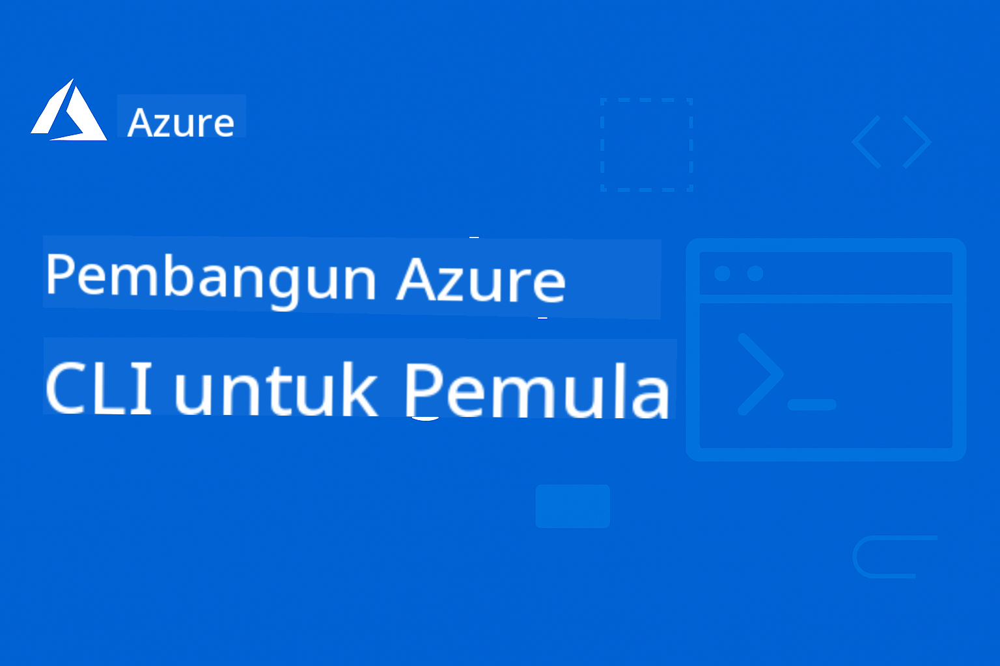

<!--
CO_OP_TRANSLATOR_METADATA:
{
  "original_hash": "3bd0e0644b110276e4364eb753ddcef8",
  "translation_date": "2025-09-09T21:05:24+00:00",
  "source_file": "README.md",
  "language_code": "ms"
}
-->
# AZD Untuk Pemula

 

Ikuti langkah-langkah berikut untuk mula menggunakan sumber ini:
1. **Fork Repositori**: Klik [](https://GitHub.com/microsoft/azd-for-beginners/fork)
2. **Clone Repositori**:   `git clone https://github.com/microsoft/azd-for-beginners.git`
3. [**Sertai Komuniti Discord Azure dan berhubung dengan pakar serta pembangun lain**](https://discord.com/invite/ByRwuEEgH4)

### 🌐 Sokongan Pelbagai Bahasa

#### Disokong melalui GitHub Action (Automatik & Sentiasa Terkini)

[French](../fr/README.md) | [Spanish](../es/README.md) | [German](../de/README.md) | [Russian](../ru/README.md) | [Arabic](../ar/README.md) | [Persian (Farsi)](../fa/README.md) | [Urdu](../ur/README.md) | [Chinese (Simplified)](../zh/README.md) | [Chinese (Traditional, Macau)](../mo/README.md) | [Chinese (Traditional, Hong Kong)](../hk/README.md) | [Chinese (Traditional, Taiwan)](../tw/README.md) | [Japanese](../ja/README.md) | [Korean](../ko/README.md) | [Hindi](../hi/README.md) | [Bengali](../bn/README.md) | [Marathi](../mr/README.md) | [Nepali](../ne/README.md) | [Punjabi (Gurmukhi)](../pa/README.md) | [Portuguese (Portugal)](../pt/README.md) | [Portuguese (Brazil)](../br/README.md) | [Italian](../it/README.md) | [Polish](../pl/README.md) | [Turkish](../tr/README.md) | [Greek](../el/README.md) | [Thai](../th/README.md) | [Swedish](../sv/README.md) | [Danish](../da/README.md) | [Norwegian](../no/README.md) | [Finnish](../fi/README.md) | [Dutch](../nl/README.md) | [Hebrew](../he/README.md) | [Vietnamese](../vi/README.md) | [Indonesian](../id/README.md) | [Malay](./README.md) | [Tagalog (Filipino)](../tl/README.md) | [Swahili](../sw/README.md) | [Hungarian](../hu/README.md) | [Czech](../cs/README.md) | [Slovak](../sk/README.md) | [Romanian](../ro/README.md) | [Bulgarian](../bg/README.md) | [Serbian (Cyrillic)](../sr/README.md) | [Croatian](../hr/README.md) | [Slovenian](../sl/README.md) | [Ukrainian](../uk/README.md) | [Burmese (Myanmar)](../my/README.md)

**Jika anda ingin menambah sokongan bahasa lain, senarai bahasa yang disokong tersedia [di sini](https://github.com/Azure/co-op-translator/blob/main/getting_started/supported-languages.md)**

## Pengenalan

Selamat datang ke panduan komprehensif untuk Azure Developer CLI (azd). Repositori ini direka untuk membantu pembangun pada semua peringkat, daripada pelajar hingga pembangun profesional, mempelajari dan menguasai Azure Developer CLI untuk penyebaran awan yang efisien. Sumber pembelajaran yang terstruktur ini menyediakan pengalaman langsung dengan penyebaran awan Azure, penyelesaian masalah biasa, dan pelaksanaan amalan terbaik untuk penyebaran templat AZD yang berjaya.

## Matlamat Pembelajaran

Dengan bekerja melalui repositori ini, anda akan:
- Menguasai asas dan konsep utama Azure Developer CLI
- Belajar menyebarkan dan menyediakan sumber Azure menggunakan Infrastructure as Code
- Membangunkan kemahiran penyelesaian masalah untuk isu penyebaran AZD yang biasa
- Memahami pengesahan pra-penyebaran dan perancangan kapasiti
- Melaksanakan amalan terbaik keselamatan dan strategi pengoptimuman kos
- Meningkatkan keyakinan dalam menyebarkan aplikasi sedia produksi ke Azure

## Hasil Pembelajaran

Selepas melengkapkan kursus ini, anda akan dapat:
- Memasang, mengkonfigurasi, dan menggunakan Azure Developer CLI dengan berjaya
- Membuat dan menyebarkan aplikasi menggunakan templat AZD
- Menyelesaikan masalah pengesahan, infrastruktur, dan penyebaran
- Melakukan pemeriksaan pra-penyebaran termasuk perancangan kapasiti dan pemilihan SKU
- Melaksanakan amalan terbaik pemantauan, keselamatan, dan pengurusan kos
- Mengintegrasikan aliran kerja AZD ke dalam pipeline CI/CD

## Kandungan

- [Apa itu Azure Developer CLI?](../..)
- [Permulaan Pantas](../..)
- [Dokumentasi](../..)
- [Contoh & Templat](../..)
- [Sumber](../..)
- [Menyumbang](../..)

## Apa itu Azure Developer CLI?

Azure Developer CLI (azd) ialah antara muka baris perintah yang berpusatkan pembangun yang mempercepatkan proses membina dan menyebarkan aplikasi ke Azure. Ia menyediakan:

- **Penyebaran berasaskan templat** - Gunakan templat pra-bina untuk corak aplikasi biasa
- **Infrastructure as Code** - Urus sumber Azure menggunakan Bicep atau Terraform
- **Aliran kerja bersepadu** - Menyediakan, menyebarkan, dan memantau aplikasi dengan lancar
- **Mesra pembangun** - Dioptimumkan untuk produktiviti dan pengalaman pembangun

## Permulaan Pantas

### Prasyarat
- Langganan Azure
- Azure CLI dipasang
- Git (untuk mengklon templat)

### Pemasangan
```bash
# Windows (PowerShell)
powershell -ex AllSigned -c "Invoke-RestMethod 'https://aka.ms/install-azd.ps1' | Invoke-Expression"

# macOS/Linux
curl -fsSL https://aka.ms/install-azd.sh | bash
```

### Penyebaran Pertama Anda
```bash
# Initialize a new project
azd init --template todo-nodejs-mongo

# Provision Azure resources and deploy
azd up
```

## Dokumentasi

### Memulakan
- [**Asas AZD**](docs/getting-started/azd-basics.md) - Konsep dan istilah utama
- [**Pemasangan & Persediaan**](docs/getting-started/installation.md) - Panduan pemasangan khusus platform
- [**Konfigurasi**](docs/getting-started/configuration.md) - Persediaan persekitaran dan pengesahan
- [**Projek Pertama Anda**](docs/getting-started/first-project.md) - Tutorial langkah demi langkah

### Penyebaran & Penyediaan
- [**Panduan Penyebaran**](docs/deployment/deployment-guide.md) - Aliran kerja penyebaran lengkap
- [**Penyediaan Sumber**](docs/deployment/provisioning.md) - Pengurusan sumber Azure

### Pemeriksaan Pra-Penyebaran
- [**Perancangan Kapasiti**](docs/pre-deployment/capacity-planning.md) - Pengesahan kapasiti sumber Azure
- [**Pemilihan SKU**](docs/pre-deployment/sku-selection.md) - Memilih SKU Azure yang sesuai
- [**Pemeriksaan Pra-Penerbangan**](docs/pre-deployment/preflight-checks.md) - Skrip pengesahan automatik

### Penyelesaian Masalah
- [**Isu Biasa**](docs/troubleshooting/common-issues.md) - Masalah yang sering ditemui dan penyelesaiannya
- [**Panduan Debugging**](docs/troubleshooting/debugging.md) - Strategi debugging langkah demi langkah

## Contoh & Templat

### Templat Permulaan
- [**Aplikasi Web Mudah**](../../examples/simple-web-app) - Penyebaran aplikasi web Node.js asas
- [**Laman Web Statik**](../../examples/static-website) - Hosting laman web statik pada Azure Storage
- [**Aplikasi Kontena**](../../examples/container-app) - Penyebaran aplikasi yang dikontena
- [**Aplikasi Pangkalan Data**](../../examples/database-app) - Aplikasi web dengan integrasi pangkalan data

### Senario Lanjutan
- [**Mikroservis**](../../examples/microservices) - Seni bina aplikasi pelbagai perkhidmatan
- [**Fungsi Tanpa Pelayan**](../../examples/serverless-function) - Penyebaran Azure Functions
- [**Contoh Konfigurasi**](../../examples/configurations) - Corak konfigurasi yang boleh digunakan semula

## Sumber

### Rujukan Pantas
- [**Lembaran Cheat Perintah**](resources/cheat-sheet.md) - Perintah azd penting
- [**Glosari**](resources/glossary.md) - Istilah Azure dan azd
- [**FAQ**](resources/faq.md) - Soalan lazim
- [**Panduan Pembelajaran**](resources/study-guide.md) - Objektif pembelajaran komprehensif dan latihan praktikal

### Sumber Luaran
- [Dokumentasi Azure Developer CLI](https://learn.microsoft.com/en-us/azure/developer/azure-developer-cli/)
- [Pusat Seni Bina Azure](https://learn.microsoft.com/en-us/azure/architecture/)
- [Kalkulator Harga Azure](https://azure.microsoft.com/pricing/calculator/)
- [Status Azure](https://status.azure.com/)

## Laluan Pembelajaran

### Untuk Pelajar & Pemula
1. Mulakan dengan [Asas AZD](docs/getting-started/azd-basics.md)
2. Ikuti [Panduan Pemasangan](docs/getting-started/installation.md)
3. Lengkapkan [Projek Pertama Anda](docs/getting-started/first-project.md)
4. Berlatih dengan [Contoh Aplikasi Web Mudah](../../examples/simple-web-app)

### Untuk Pembangun
1. Semak [Panduan Konfigurasi](docs/getting-started/configuration.md)
2. Kajian [Panduan Penyebaran](docs/deployment/deployment-guide.md)
3. Kerja melalui [Contoh Aplikasi Pangkalan Data](../../examples/database-app)
4. Terokai [Contoh Aplikasi Kontena](../../examples/container-app)

### Untuk Jurutera DevOps
1. Kuasai [Penyediaan Sumber](docs/deployment/provisioning.md)
2. Laksanakan [Pemeriksaan Pra-Penerbangan](docs/pre-deployment/preflight-checks.md)
3. Berlatih [Perancangan Kapasiti](docs/pre-deployment/capacity-planning.md)
4. Contoh Lanjutan [Mikroservis](../../examples/microservices)

## Menyumbang

Kami mengalu-alukan sumbangan! Sila baca [Panduan Menyumbang](CONTRIBUTING.md) untuk maklumat lanjut tentang:
- Cara mengemukakan isu dan permintaan ciri
- Garis panduan sumbangan kod
- Penambahbaikan dokumentasi
- Piawaian komuniti

## Sokongan

- **Isu**: [Laporkan pepijat dan minta ciri](https://github.com/microsoft/azd-for-beginners/issues)
- **Perbincangan**: [Komuniti Discord Microsoft Azure Q&A dan perbincangan](https://discord.gg/microsoft-azure)
- **E-mel**: Untuk pertanyaan peribadi
- **Microsoft Learn**: [Dokumentasi rasmi Azure Developer CLI](https://learn.microsoft.com/en-us/azure/developer/azure-developer-cli/)

## Lesen

Projek ini dilesenkan di bawah Lesen MIT - lihat fail [LICENSE](../../LICENSE) untuk butiran.

## 🎒 Kursus Lain

Pasukan kami menghasilkan kursus lain! Lihat:

- [**BARU** Model Context Protocol (MCP) Untuk Pemula](https://github.com/microsoft/mcp-for-beginners?WT.mc_id=academic-105485-koreyst)
- [AI Agents untuk Pemula](https://github.com/microsoft/ai-agents-for-beginners?WT.mc_id=academic-105485-koreyst)
- [Generative AI untuk Pemula menggunakan .NET](https://github.com/microsoft/Generative-AI-for-beginners-dotnet?WT.mc_id=academic-105485-koreyst)
- [Generative AI untuk Pemula](https://github.com/microsoft/generative-ai-for-beginners?WT.mc_id=academic-105485-koreyst)
- [Generative AI untuk Pemula menggunakan Java](https://github.com/microsoft/generative-ai-for-beginners-java?WT.mc_id=academic-105485-koreyst)
- [ML untuk Pemula](https://aka.ms/ml-beginners?WT.mc_id=academic-105485-koreyst)
- [Data Science untuk Pemula](https://aka.ms/datascience-beginners?WT.mc_id=academic-105485-koreyst)
- [AI untuk Pemula](https://aka.ms/ai-beginners?WT.mc_id=academic-105485-koreyst)
- [Keselamatan Siber untuk Pemula](https://github.com/microsoft/Security-101??WT.mc_id=academic-96948-sayoung)
- [Web Dev untuk Pemula](https://aka.ms/webdev-beginners?WT.mc_id=academic-105485-koreyst)
- [IoT untuk Pemula](https://aka.ms/iot-beginners?WT.mc_id=academic-105485-koreyst)
- [Pembangunan XR untuk Pemula](https://github.com/microsoft/xr-development-for-beginners?WT.mc_id=academic-105485-koreyst)
- [Menguasai GitHub Copilot untuk Pengaturcaraan Berpasangan AI](https://aka.ms/GitHubCopilotAI?WT.mc_id=academic-105485-koreyst)
- [Menguasai GitHub Copilot untuk Pembangun C#/.NET](https://github.com/microsoft/mastering-github-copilot-for-dotnet-csharp-developers?WT.mc_id=academic-105485-koreyst)
- [Pilih Pengembaraan Copilot Anda Sendiri](https://github.com/microsoft/CopilotAdventures?WT.mc_id=academic-105485-koreyst)

---

**Navigasi**
- **Pelajaran Seterusnya**: [Asas AZD](docs/getting-started/azd-basics.md)

---

**Penafian**:  
Dokumen ini telah diterjemahkan menggunakan perkhidmatan terjemahan AI [Co-op Translator](https://github.com/Azure/co-op-translator). Walaupun kami berusaha untuk memastikan ketepatan, sila ambil perhatian bahawa terjemahan automatik mungkin mengandungi kesilapan atau ketidaktepatan. Dokumen asal dalam bahasa asalnya harus dianggap sebagai sumber yang berwibawa. Untuk maklumat yang kritikal, terjemahan manusia profesional adalah disyorkan. Kami tidak bertanggungjawab atas sebarang salah faham atau salah tafsir yang timbul daripada penggunaan terjemahan ini.