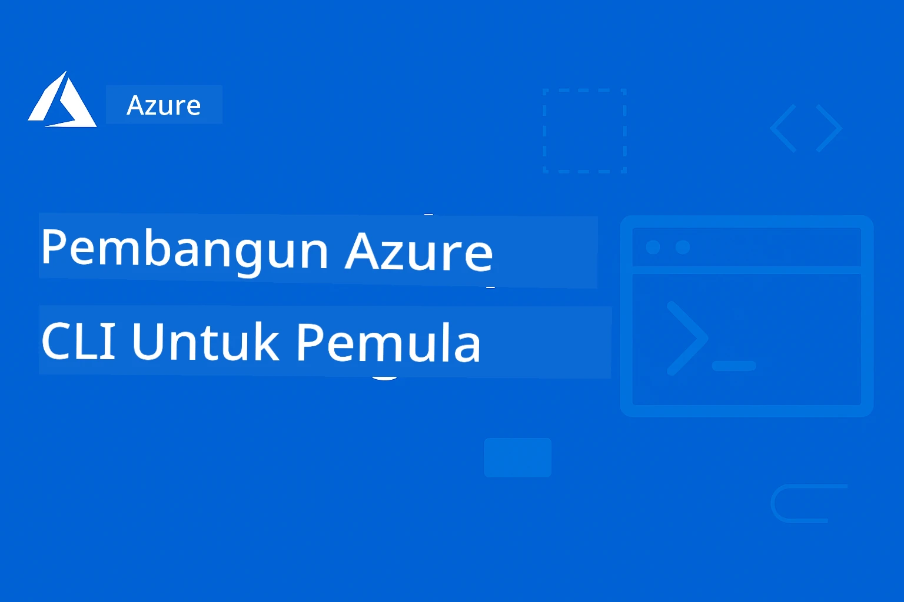

# AZD Untuk Pemula: Perjalanan Pembelajaran Berstruktur

 

[](https://GitHub.com/microsoft/azd-for-beginners/watchers/)
[](https://GitHub.com/microsoft/azd-for-beginners/network/)
[](https://GitHub.com/microsoft/azd-for-beginners/stargazers/)

[](https://discord.gg/microsoft-azure)
[](https://discord.gg/nTYy5BXMWG)

---

### Terjemahan Automatik (Sentiasa Terkini)

<!-- CO-OP TRANSLATOR LANGUAGES TABLE START -->
[Arabic](../ar/README.md) | [Bengali](../bn/README.md) | [Bulgarian](../bg/README.md) | [Burmese (Myanmar)](../my/README.md) | [Chinese (Simplified)](../zh-CN/README.md) | [Chinese (Traditional, Hong Kong)](../zh-HK/README.md) | [Chinese (Traditional, Macau)](../zh-MO/README.md) | [Chinese (Traditional, Taiwan)](../zh-TW/README.md) | [Croatian](../hr/README.md) | [Czech](../cs/README.md) | [Danish](../da/README.md) | [Dutch](../nl/README.md) | [Estonian](../et/README.md) | [Finnish](../fi/README.md) | [French](../fr/README.md) | [German](../de/README.md) | [Greek](../el/README.md) | [Hebrew](../he/README.md) | [Hindi](../hi/README.md) | [Hungarian](../hu/README.md) | [Indonesian](../id/README.md) | [Italian](../it/README.md) | [Japanese](../ja/README.md) | [Kannada](../kn/README.md) | [Korean](../ko/README.md) | [Lithuanian](../lt/README.md) | [Malay](./README.md) | [Malayalam](../ml/README.md) | [Marathi](../mr/README.md) | [Nepali](../ne/README.md) | [Nigerian Pidgin](../pcm/README.md) | [Norwegian](../no/README.md) | [Persian (Farsi)](../fa/README.md) | [Polish](../pl/README.md) | [Portuguese (Brazil)](../pt-BR/README.md) | [Portuguese (Portugal)](../pt-PT/README.md) | [Punjabi (Gurmukhi)](../pa/README.md) | [Romanian](../ro/README.md) | [Russian](../ru/README.md) | [Serbian (Cyrillic)](../sr/README.md) | [Slovak](../sk/README.md) | [Slovenian](../sl/README.md) | [Spanish](../es/README.md) | [Swahili](../sw/README.md) | [Swedish](../sv/README.md) | [Tagalog (Filipino)](../tl/README.md) | [Tamil](../ta/README.md) | [Telugu](../te/README.md) | [Thai](../th/README.md) | [Turkish](../tr/README.md) | [Ukrainian](../uk/README.md) | [Urdu](../ur/README.md) | [Vietnamese](../vi/README.md)

> **Lebih Suka Klon Tempatan?**
>
> Repositori ini merangkumi lebih 50+ terjemahan bahasa yang meningkatkan saiz muat turun dengan ketara. Untuk mengklon tanpa terjemahan, gunakan sparse checkout:
>
> **Bash / macOS / Linux:**
> ```bash
> git clone --filter=blob:none --sparse https://github.com/microsoft/AZD-for-beginners.git
> cd AZD-for-beginners
> git sparse-checkout set --no-cone '/*' '!translations' '!translated_images'
> ```
>
> **CMD (Windows):**
> ```cmd
> git clone --filter=blob:none --sparse https://github.com/microsoft/AZD-for-beginners.git
> cd AZD-for-beginners
> git sparse-checkout set --no-cone "/*" "!translations" "!translated_images"
> ```
>
> Ini memberikan anda semua yang anda perlukan untuk menyelesaikan kursus dengan muat turun yang lebih pantas.
<!-- CO-OP TRANSLATOR LANGUAGES TABLE END -->

## 🆕 Apa Yang Baru dalam azd Hari Ini

Azure Developer CLI telah berkembang melebihi aplikasi web tradisional dan API. Hari ini, azd adalah alat tunggal untuk menyebarkan **mana-mana** aplikasi ke Azure—termasuk aplikasi berkuasa AI dan agen pintar.

Ini bermakna untuk anda:

- **Agen AI kini adalah beban kerja azd yang utama.** Anda boleh memulakan, menyebarkan, dan mengurus projek agen AI menggunakan aliran kerja `azd init` → `azd up` yang sama yang anda sudah tahu.
- **Integrasi Microsoft Foundry** membawa penyebaran model, hosting agen, dan konfigurasi perkhidmatan AI terus ke dalam ekosistem templat azd.
- **Aliran kerja teras tidak berubah.** Sama ada anda menyebarkan aplikasi todo, mikroservis, atau penyelesaian AI multi-agen, arahan tetap sama.

Jika anda pernah menggunakan azd sebelum ini, sokongan AI adalah lanjutan semula jadi—bukan alat berasingan atau laluan lanjutan. Jika anda baru bermula, anda akan belajar satu aliran kerja yang berfungsi untuk semuanya.

---

## 🚀 Apakah Azure Developer CLI (azd)?

**Azure Developer CLI (azd)** adalah alat baris perintah mesra pembangun yang memudahkan penyebaran aplikasi ke Azure. Daripada membuat dan menyambung bertaburan sumber Azure secara manual, anda boleh menyebarkan keseluruhan aplikasi dengan satu arahan.

### Keajaiban `azd up`

```bash
# Perintah tunggal ini melakukan semuanya:
# ✅ Mencipta semua sumber Azure
# ✅ Mengkonfigurasi rangkaian dan keselamatan
# ✅ Membina kod aplikasi anda
# ✅ Menerapkan ke Azure
# ✅ Memberi anda URL yang berfungsi
azd up
```

**Itu sahaja!** Tiada klik portal Azure, tiada templat ARM kompleks untuk dipelajari terlebih dahulu, tiada konfigurasi manual - hanya aplikasi yang berfungsi di Azure.

---

## ❓ Azure Developer CLI vs Azure CLI: Apa Bezanya?

Ini adalah soalan paling biasa yang ditanya pemula. Berikut jawapan yang mudah:

| Ciri | **Azure CLI (`az`)** | **Azure Developer CLI (`azd`)** |
|---------|---------------------|--------------------------------|
| **Tujuan** | Mengurus sumber Azure individu | Menyebarkan aplikasi lengkap |
| **Pendekatan** | Fokus kepada infrastruktur | Fokus kepada aplikasi |
| **Contoh** | `az webapp create --name myapp...` | `azd up` |
| **Lengkung Pembelajaran** | Perlu tahu perkhidmatan Azure | Cuma tahu aplikasi anda |
| **Sesuai Untuk** | DevOps, Infrastruktur | Pembangun, Prototaip |

### Analogi Mudah

- **Azure CLI** seperti mempunyai semua alat untuk membina rumah - tukul, gergaji, paku. Anda boleh membina apa saja, tetapi perlu tahu pembinaan.
- **Azure Developer CLI** seperti mengupah kontraktor - anda terangkan apa yang anda mahu, dan mereka mengurus pembinaan.

### Bila Gunakan Setiap Satu

| Senario | Gunakan Ini |
|----------|----------|
| "Saya mahu menyebarkan aplikasi web saya dengan cepat" | `azd up` |
| "Saya perlu buat akaun storan sahaja" | `az storage account create` |
| "Saya membina aplikasi AI penuh" | `azd init --template azure-search-openai-demo` |
| "Saya perlu debug sumber Azure tertentu" | `az resource show` |
| "Saya mahu penyebaran sedia produksi dalam beberapa minit" | `azd up --environment production` |

### Mereka Berfungsi Bersama!

AZD menggunakan Azure CLI di belakang tabir. Anda boleh gunakan kedua-duanya:
```bash
# Sebarkan aplikasi anda dengan AZD
azd up

# Kemudian laraskan sumber tertentu dengan Azure CLI
az webapp config set --name myapp --always-on true
```

---

## 🌟 Cari Templat dalam Awesome AZD

Jangan mula dari kosong! **Awesome AZD** adalah koleksi komuniti templat sedia untuk disebarkan:

| Sumber | Penerangan |
|----------|-------------|
| 🔗 [**Galeri Awesome AZD**](https://azure.github.io/awesome-azd/) | Layari 200+ templat dengan penyebaran satu klik |
| 🔗 [**Hantar Templat**](https://github.com/Azure/awesome-azd/issues) | Sumbangkan templat anda sendiri kepada komuniti |
| 🔗 [**Repositori GitHub**](https://github.com/Azure/awesome-azd) | Bintang dan teroka sumber |

### Templat AI Popular dari Awesome AZD

```bash
# Sembang RAG dengan Model Microsoft Foundry + Carian AI
azd init --template azure-search-openai-demo

# Aplikasi Sembang AI Pantas
azd init --template openai-chat-app-quickstart

# Ejen AI dengan Ejen Foundry
azd init --template get-started-with-ai-agents
```

---

## 🎯 Memulakan dalam 3 Langkah

### Langkah 1: Pasang AZD (2 minit)

**Windows:**
```powershell
winget install microsoft.azd
```

**macOS:**
```bash
brew tap azure/azd && brew install azd
```

**Linux:**
```bash
curl -fsSL https://aka.ms/install-azd.sh | bash
```

### Langkah 2: Log Masuk ke Azure

```bash
azd auth login
```

### Langkah 3: Sebarkan Aplikasi Pertama Anda

```bash
# Inisialisasi dari templat
azd init --template todo-nodejs-mongo

# Terbitkan ke Azure (mencipta segala-galanya!)
azd up
```

**🎉 Itu sahaja!** Aplikasi anda kini aktif di Azure.

### Bersihkan (Jangan Lupa!)

```bash
# Remove all resources when done experimenting
azd down --force --purge
```

---

## 📚 Cara Menggunakan Kursus Ini

Kursus ini direka untuk **pembelajaran berperingkat** - mulakan di mana anda selesa dan teruskan naik:

| Pengalaman Anda | Mulakan Di Sini |
|-----------------|------------|
| **Baru dalam Azure** | [Bab 1: Asas](#-chapter-1-foundation--quick-start) |
| **Tahu Azure, baru dengan AZD** | [Bab 1: Asas](#-chapter-1-foundation--quick-start) |
| **Mahukan aplikasi AI** | [Bab 2: Pembangunan AI-Pertama](#-chapter-2-ai-first-development-recommended-for-ai-developers) |
| **Mahukan latihan praktikal** | [🎓 Bengkel Interaktif](workshop/README.md) - makmal terpandu 3-4 jam |
| **Perlu pola produksi** | [Bab 8: Produksi & Perusahaan](#-chapter-8-production--enterprise-patterns) |

### Persediaan Pantas

1. **Fork Repositori Ini**: [](https://GitHub.com/microsoft/azd-for-beginners/fork)
2. **Clone Ia**: `git clone https://github.com/YOUR-USERNAME/azd-for-beginners.git`
3. **Dapatkan Bantuan**: [Komuniti Discord Azure](https://discord.com/invite/ByRwuEEgH4)

> **Lebih Suka Klon Tempatan?**

> Repositori ini merangkumi lebih 50+ terjemahan bahasa yang meningkatkan saiz muat turun dengan ketara. Untuk mengklon tanpa terjemahan, gunakan sparse checkout:
> ```bash
> git clone --filter=blob:none --sparse https://github.com/microsoft/AZD-for-beginners.git
> cd AZD-for-beginners
> git sparse-checkout set --no-cone '/*' '!translations' '!translated_images'
> ```
> Ini memberikan anda semua yang anda perlukan untuk menyelesaikan kursus dengan muat turun yang lebih pantas.


## Gambaran Kursus

Kuasi Azure Developer CLI (azd) melalui bab berstruktur yang direka untuk pembelajaran berperingkat. **Fokus khas pada penyebaran aplikasi AI dengan integrasi Microsoft Foundry.**

### Kenapa Kursus Ini Penting untuk Pembangun Moden

Berdasarkan pandangan komuniti Microsoft Foundry Discord, **45% pembangun mahu menggunakan AZD untuk beban kerja AI** tetapi menghadapi cabaran dengan:
- Seni bina AI pelbagai perkhidmatan yang kompleks
- Amalan terbaik penyebaran AI produksi  
- Integrasi dan konfigurasi perkhidmatan Azure AI
- Pengoptimuman kos untuk beban kerja AI
- Penyelesaian masalah penyebaran khusus AI

### Objektif Pembelajaran

Dengan menyelesaikan kursus berstruktur ini, anda akan:
- **Menguasai Asas AZD**: Konsep teras, pemasangan, dan konfigurasi
- **Menyebarkan Aplikasi AI**: Gunakan AZD dengan perkhidmatan Microsoft Foundry
- **Melaksanakan Infrastruktur sebagai Kod**: Urus sumber Azure dengan templat Bicep
- **Menyelesaikan Masalah Penyebaran**: Atasi isu biasa dan debug masalah
- **Mengoptimum untuk Produksi**: Keselamatan, penskalaan, pemantauan, dan pengurusan kos
- **Membina Penyelesaian Multi-Agen**: Sebarkan seni bina AI kompleks

## 🗺️ Peta Kursus: Navigasi Pantas Mengikut Bab

Setiap bab mempunyai README khusus dengan objektif pembelajaran, permulaan pantas, dan latihan:

| Bab | Topik | Pelajaran | Tempoh | Kompleksiti |
|---------|-------|---------|----------|------------|
| **[Bab 1: Asas](docs/chapter-01-foundation/README.md)** | Memulakan | [Asas AZD](docs/chapter-01-foundation/azd-basics.md) &#124; [Pemasangan](docs/chapter-01-foundation/installation.md) &#124; [Projek Pertama](docs/chapter-01-foundation/first-project.md) | 30-45 min | ⭐ |
| **[Bab 2: Pembangunan AI](docs/chapter-02-ai-development/README.md)** | Aplikasi AI-Pertama | [Integrasi Foundry](docs/chapter-02-ai-development/microsoft-foundry-integration.md) &#124; [Ejen AI](docs/chapter-02-ai-development/agents.md) &#124; [Penerapan Model](docs/chapter-02-ai-development/ai-model-deployment.md) &#124; [Bengkel](docs/chapter-02-ai-development/ai-workshop-lab.md) | 1-2 jam | ⭐⭐ |
| **[Bab 3: Konfigurasi](docs/chapter-03-configuration/README.md)** | Pengesahan & Keselamatan | [Konfigurasi](docs/chapter-03-configuration/configuration.md) &#124; [Pengesahan & Keselamatan](docs/chapter-03-configuration/authsecurity.md) | 45-60 minit | ⭐⭐ |
| **[Bab 4: Infrastruktur](docs/chapter-04-infrastructure/README.md)** | IaC & Penerapan | [Panduan Penerapan](docs/chapter-04-infrastructure/deployment-guide.md) &#124; [Penyediaan](docs/chapter-04-infrastructure/provisioning.md) | 1-1.5 jam | ⭐⭐⭐ |
| **[Bab 5: Multi-Ejen](docs/chapter-05-multi-agent/README.md)** | Penyelesaian Ejen AI | [Senario Runcit](examples/retail-scenario.md) &#124; [Corak Penyelarasan](docs/chapter-06-pre-deployment/coordination-patterns.md) | 2-3 jam | ⭐⭐⭐⭐ |
| **[Bab 6: Pra-Penerapan](docs/chapter-06-pre-deployment/README.md)** | Perancangan & Pengesahan | [Semakan Pra-Penerbangan](docs/chapter-06-pre-deployment/preflight-checks.md) &#124; [Perancangan Kapasiti](docs/chapter-06-pre-deployment/capacity-planning.md) &#124; [Pemilihan SKU](docs/chapter-06-pre-deployment/sku-selection.md) &#124; [App Insights](docs/chapter-06-pre-deployment/application-insights.md) | 1 jam | ⭐⭐ |
| **[Bab 7: Penyelesaian Masalah](docs/chapter-07-troubleshooting/README.md)** | Nyahpepijat & Baiki | [Isu Biasa](docs/chapter-07-troubleshooting/common-issues.md) &#124; [Nyahpepijat](docs/chapter-07-troubleshooting/debugging.md) &#124; [Isu AI](docs/chapter-07-troubleshooting/ai-troubleshooting.md) | 1-1.5 jam | ⭐⭐ |
| **[Bab 8: Pengeluaran](docs/chapter-08-production/README.md)** | Corak Enterprise | [Amalan Pengeluaran](docs/chapter-08-production/production-ai-practices.md) | 2-3 jam | ⭐⭐⭐⭐ |
| **[🎓 Bengkel](workshop/README.md)** | Makmal Praktikal | [Pengenalan](workshop/docs/instructions/0-Introduction.md) &#124; [Pemilihan](workshop/docs/instructions/1-Select-AI-Template.md) &#124; [Pengesahan](workshop/docs/instructions/2-Validate-AI-Template.md) &#124; [Deconstruksi](workshop/docs/instructions/3-Deconstruct-AI-Template.md) &#124; [Konfigurasi](workshop/docs/instructions/4-Configure-AI-Template.md) &#124; [Penyesuaian](workshop/docs/instructions/5-Customize-AI-Template.md) &#124; [Pembongkaran](workshop/docs/instructions/6-Teardown-Infrastructure.md) &#124; [Penutupan](workshop/docs/instructions/7-Wrap-up.md) | 3-4 jam | ⭐⭐ |

**Jumlah Tempoh Kursus:** ~10-14 jam | **Perkembangan Kemahiran:** Pemula → Sedia Untuk Pengeluaran

---

## 📚 Bab Pembelajaran

*Pilih laluan pembelajaran anda berdasarkan tahap pengalaman dan matlamat*

### 🚀 Bab 1: Asas & Mula Cepat
**Prasyarat**: Langganan Azure, pengetahuan asas baris perintah  
**Tempoh**: 30-45 minit  
**Kerumitan**: ⭐

#### Apa Yang Akan Anda Pelajari
- Memahami asas Azure Developer CLI
- Memasang AZD pada platform anda
- Penerapan pertama anda yang berjaya

#### Sumber Pembelajaran
- **🎯 Mula di Sini**: [Apakah Azure Developer CLI?](#what-is-azure-developer-cli)
- **📖 Teori**: [Asas AZD](docs/chapter-01-foundation/azd-basics.md) - Konsep dan terminologi utama
- **⚙️ Persediaan**: [Pemasangan & Persediaan](docs/chapter-01-foundation/installation.md) - Panduan khusus platform
- **🛠️ Praktikal**: [Projek Pertama Anda](docs/chapter-01-foundation/first-project.md) - Tutorial langkah demi langkah
- **📋 Rujukan Pantas**: [Lembaran Contoh Arahan](resources/cheat-sheet.md)

#### Latihan Praktikal
```bash
# Pemeriksaan pemasangan pantas
azd version

# Pasang aplikasi pertama anda
azd init --template todo-nodejs-mongo
azd up
```

**💡 Hasil Bab**: Berjaya menerapkan aplikasi web mudah ke Azure menggunakan AZD

**✅ Pengesahan Kejayaan:**
```bash
# Selepas menamatkan Bab 1, anda harus dapat:
azd version              # Menunjukkan versi yang dipasang
azd init --template todo-nodejs-mongo  # Memulakan projek
azd up                  # Melaksanakan ke Azure
azd show                # Memaparkan URL aplikasi yang sedang berjalan
# Aplikasi dibuka dalam pelayar dan berfungsi
azd down --force --purge  # Membersihkan sumber daya
```

**📊 Pelaburan Masa:** 30-45 minit  
**📈 Tahap Kemahiran Selepas:** Boleh menerapkan aplikasi asas secara berdikari
**📈 Tahap Kemahiran Selepas:** Boleh menerapkan aplikasi asas secara berdikari

---

### 🤖 Bab 2: Pembangunan AI-Pertama (Disyorkan untuk Pembangun AI)
**Prasyarat**: Bab 1 selesai  
**Tempoh**: 1-2 jam  
**Kerumitan**: ⭐⭐

#### Apa Yang Akan Anda Pelajari
- Integrasi Microsoft Foundry dengan AZD
- Menerapkan aplikasi berkuasa AI
- Memahami konfigurasi perkhidmatan AI

#### Sumber Pembelajaran
- **🎯 Mula di Sini**: [Integrasi Microsoft Foundry](docs/chapter-02-ai-development/microsoft-foundry-integration.md)
- **🤖 Ejen AI**: [Panduan Ejen AI](docs/chapter-02-ai-development/agents.md) - Terapkan ejen bijak dengan AZD
- **📖 Corak**: [Penerapan Model AI](docs/chapter-02-ai-development/ai-model-deployment.md) - Terap dan urus model AI
- **🛠️ Bengkel**: [Makmal Bengkel AI](docs/chapter-02-ai-development/ai-workshop-lab.md) - Jadikan penyelesaian AI anda sedia AZD
- **🎥 Panduan Interaktif**: [Bahan Bengkel](workshop/README.md) - Pembelajaran berasaskan pelayar dengan MkDocs * Persekitaran DevContainer
- **📋 Templat**: [Templat Microsoft Foundry](#sumber-bengkel)
- **📝 Contoh**: [Contoh Penerapan AZD](examples/README.md)

#### Latihan Praktikal
```bash
# Lancarkan aplikasi AI pertama anda
azd init --template azure-search-openai-demo
azd up

# Cuba templat AI tambahan
azd init --template openai-chat-app-quickstart
azd init --template agent-openai-python-prompty
```

**💡 Hasil Bab**: Terap dan konfigurasikan aplikasi sembang berkuasa AI dengan keupayaan RAG

**✅ Pengesahan Kejayaan:**
```bash
# Selepas Bab 2, anda sepatutnya boleh:
azd init --template azure-search-openai-demo
azd up
# Uji antara muka sembang AI
# Tanyakan soalan dan dapatkan jawapan dikuasakan AI dengan sumber
# Sahkan penyepaduan carian berfungsi
azd monitor  # Periksa Application Insights menunjukkan telemetri
azd down --force --purge
```

**📊 Pelaburan Masa:** 1-2 jam  
**📈 Tahap Kemahiran Selepas:** Boleh menerapkan dan mengkonfigurasi aplikasi AI sedia untuk pengeluaran  
**💰 Kesedaran Kos:** Fahami kos pembangunan $80-150/bulan, kos pengeluaran $300-3500/bulan

#### 💰 Pertimbangan Kos untuk Penerapan AI

**Persekitaran Pembangunan (Anggaran $80-150/bulan):**
- Model Microsoft Foundry (Bayar mengikut penggunaan): $0-50/bulan (berdasarkan penggunaan token)
- Carian AI (peringkat asas): $75/bulan
- Aplikasi Kontena (Penggunaan): $0-20/bulan
- Penyimpanan (Standard): $1-5/bulan

**Persekitaran Pengeluaran (Anggaran $300-3,500+/bulan):**
- Model Microsoft Foundry (PTU untuk prestasi konsisten): $3,000+/bulan ATAU Bayar mengikut penggunaan dengan jumlah besar
- Carian AI (peringkat standard): $250/bulan
- Aplikasi Kontena (Didedikasikan): $50-100/bulan
- Application Insights: $5-50/bulan
- Penyimpanan (Premium): $10-50/bulan

**💡 Petua Pengoptimalan Kos:**
- Gunakan Model Microsoft Foundry **Tier Percuma** untuk pembelajaran (Azure OpenAI 50,000 token/bulan termasuk)
- Jalankan `azd down` untuk membatalkan peruntukan sumber apabila tidak membangun aktif
- Mulakan dengan pengebilan berdasarkan penggunaan, naik taraf ke PTU hanya untuk pengeluaran
- Gunakan `azd provision --preview` untuk anggaran kos sebelum penerapan
- Aktifkan auto-scaling: bayar hanya untuk penggunaan sebenar

**Pemantauan Kos:**
```bash
# Semak anggaran kos bulanan
azd provision --preview

# Pantau kos sebenar dalam Portal Azure
az consumption budget list --resource-group <your-rg>
```

---

### ⚙️ Bab 3: Konfigurasi & Pengesahan
**Prasyarat**: Bab 1 selesai  
**Tempoh**: 45-60 minit  
**Kerumitan**: ⭐⭐

#### Apa Yang Akan Anda Pelajari
- Konfigurasi dan pengurusan persekitaran
- Amalan terbaik pengesahan dan keselamatan
- Penamaan dan pengurusan sumber

#### Sumber Pembelajaran
- **📖 Konfigurasi**: [Panduan Konfigurasi](docs/chapter-03-configuration/configuration.md) - Persediaan persekitaran
- **🔐 Keselamatan**: [Corak pengesahan dan identiti terurus](docs/chapter-03-configuration/authsecurity.md) - Corak pengesahan
- **📝 Contoh**: [Contoh Aplikasi Pangkalan Data](examples/database-app/README.md) - Contoh Pangkalan Data AZD

#### Latihan Praktikal
- Konfigurasikan pelbagai persekitaran (dev, staging, prod)
- Sediakan pengesahan identiti terurus
- Laksanakan konfigurasi khusus persekitaran

**💡 Hasil Bab**: Urus pelbagai persekitaran dengan pengesahan dan keselamatan yang betul

---

### 🏗️ Bab 4: Infrastruktur sebagai Kod & Penerapan
**Prasyarat**: Bab 1-3 selesai  
**Tempoh**: 1-1.5 jam  
**Kerumitan**: ⭐⭐⭐

#### Apa Yang Akan Anda Pelajari
- Corak penerapan lanjutan
- Infrastruktur sebagai Kod menggunakan Bicep
- Strategi penyediaan sumber

#### Sumber Pembelajaran
- **📖 Penerapan**: [Panduan Penerapan](docs/chapter-04-infrastructure/deployment-guide.md) - Aliran kerja lengkap
- **🏗️ Penyediaan**: [Penyediaan Sumber](docs/chapter-04-infrastructure/provisioning.md) - Pengurusan sumber Azure
- **📝 Contoh**: [Contoh Aplikasi Kontena](../../examples/container-app) - Penerapan berasaskan kontena

#### Latihan Praktikal
- Buat templat Bicep tersuai
- Terap aplikasi berbilang perkhidmatan
- Laksanakan strategi penerapan biru-hijau

**💡 Hasil Bab**: Terap aplikasi berbilang perkhidmatan yang kompleks menggunakan templat infrastruktur tersuai

---

### 🎯 Bab 5: Penyelesaian AI Multi-Ejen (Lanjutan)
**Prasyarat**: Bab 1-2 selesai  
**Tempoh**: 2-3 jam  
**Kerumitan**: ⭐⭐⭐⭐

#### Apa Yang Akan Anda Pelajari
- Corak seni bina multi-ejen
- Orkestrasi dan penyelarasan ejen
- Penerapan AI sedia pengeluaran

#### Sumber Pembelajaran
- **🤖 Projek Terpilih**: [Penyelesaian Multi-Ejen Runcit](examples/retail-scenario.md) - Pelaksanaan lengkap
- **🛠️ Templat ARM**: [Pakej Templat ARM](../../examples/retail-multiagent-arm-template) - Penerapan satu klik
- **📖 Seni Bina**: [Corak penyelarasan multi-ejen](docs/chapter-06-pre-deployment/coordination-patterns.md) - Corak

#### Latihan Praktikal
```bash
# Lancarkan penyelesaian multi-ejen runcit lengkap
cd examples/retail-multiagent-arm-template
./deploy.sh

# Terokai konfigurasi ejen
az deployment group show --resource-group <rg-name> --name <deployment-name>
```

**💡 Hasil Bab**: Terap dan urus penyelesaian AI multi-ejen sedia pengeluaran dengan ejen Pelanggan dan Inventori

---

### 🔍 Bab 6: Pengesahan & Perancangan Pra-Penerapan
**Prasyarat**: Bab 4 selesai  
**Tempoh**: 1 jam  
**Kerumitan**: ⭐⭐

#### Apa Yang Akan Anda Pelajari
- Perancangan kapasiti dan pengesahan sumber
- Strategi pemilihan SKU
- Semakan pra-penerbangan dan automasi

#### Sumber Pembelajaran
- **📊 Perancangan**: [Perancangan Kapasiti](docs/chapter-06-pre-deployment/capacity-planning.md) - Pengesahan sumber
- **💰 Pemilihan**: [Pemilihan SKU](docs/chapter-06-pre-deployment/sku-selection.md) - Pilihan kos efektif
- **✅ Pengesahan**: [Semakan Pra-Penerbangan](docs/chapter-06-pre-deployment/preflight-checks.md) - Skrip automatik

#### Latihan Praktikal
- Jalankan skrip pengesahan kapasiti
- Optimakan pemilihan SKU untuk kos
- Laksanakan semakan automatik pra-penerapan

**💡 Hasil Bab**: Sahkan dan optimakan penerapan sebelum pelaksanaan

---

### 🚨 Bab 7: Penyelesaian Masalah & Nyahpepijat
**Prasyarat**: Mana-mana bab penerapan selesai  
**Tempoh**: 1-1.5 jam  
**Kerumitan**: ⭐⭐

#### Apa Yang Akan Anda Pelajari
- Pendekatan nyahpepijat sistematik
- Isu biasa dan penyelesaian
- Penyelesaian masalah khusus AI

#### Sumber Pembelajaran
- **🔧 Isu Biasa**: [Isu Biasa](docs/chapter-07-troubleshooting/common-issues.md) - Soalan lazim dan penyelesaian
- **🕵️ Nyahpepijat**: [Panduan Nyahpepijat](docs/chapter-07-troubleshooting/debugging.md) - Strategi langkah demi langkah
- **🤖 Isu AI**: [Penyelesaian Masalah AI](docs/chapter-07-troubleshooting/ai-troubleshooting.md) - Masalah perkhidmatan AI

#### Latihan Praktikal
- Diagnosis kegagalan penerapan
- Selesaikan isu pengesahan
- Nyahpepijat sambungan perkhidmatan AI

**💡 Hasil Bab**: Mendiagnosis dan menyelesaikan isu penerapan biasa secara berdikari

---

### 🏢 Bab 8: Pengeluaran & Corak Enterprise
**Prasyarat**: Bab 1-4 selesai  
**Tempoh**: 2-3 jam  
**Kerumitan**: ⭐⭐⭐⭐

#### Apa Yang Akan Anda Pelajari
- Strategi penerapan pengeluaran
- Corak keselamatan enterprise
- Pemantauan dan pengoptimalan kos

#### Sumber Pembelajaran
- **🏭 Pengeluaran**: [Amalan Terbaik AI Pengeluaran](docs/chapter-08-production/production-ai-practices.md) - Corak perusahaan  
- **📝 Contoh**: [Contoh Mikrosistem](../../examples/microservices) - Seni bina kompleks  
- **📊 Pemantauan**: [Integrasi Application Insights](docs/chapter-06-pre-deployment/application-insights.md) - Pemantauan  

#### Latihan Praktikal  
- Laksanakan corak keselamatan perusahaan  
- Tetapkan pemantauan menyeluruh  
- Gunakan pengeluaran dengan tadbir urus yang betul  

**💡 Hasil Bab**: Gunakan aplikasi bersedia perusahaan dengan keupayaan pengeluaran penuh  

---

## 🎓 Gambaran Keseluruhan Bengkel: Pengalaman Pembelajaran Praktikal  

> **⚠️ STATUS BENGKEL: Pembangunan Aktif**  
> Bahan bengkel sedang dibangunkan dan diperhalusi. Modul teras berfungsi, tetapi beberapa bahagian lanjutan belum lengkap. Kami sedang berusaha melengkapkan semua kandungan. [Ikuti kemajuan →](workshop/README.md)  

### Bahan Bengkel Interaktif  
**Pembelajaran praktikal komprehensif dengan alat berasaskan pelayar dan latihan berpandu**  

Bahan bengkel kami menyediakan pengalaman pembelajaran interaktif yang terstruktur sesuai dengan kurikulum berasaskan bab di atas. Bengkel ini direka untuk pembelajaran kendiri dan sesi dipimpin pengajar.  

#### 🛠️ Ciri-ciri Bengkel  
- **Antara Muka Berasaskan Pelayar**: Bengkel berkuasa MkDocs lengkap dengan ciri carian, salin, dan tema  
- **Integrasi GitHub Codespaces**: Satu klik untuk menyediakan persekitaran pembangunan  
- **Jalur Pembelajaran Berstruktur**: 8 modul latihan berpandu (3-4 jam keseluruhan)  
- **Metodologi Progresif**: Pengenalan → Pemilihan → Pengesahan → Pecahan → Konfigurasi → Sesuaikan → Penyahpasangan → Penutup  
- **Persekitaran DevContainer Interaktif**: Alat dan kebergantungan telah dikonfigurasi awal  

#### 📚 Struktur Modul Bengkel  
Bengkel mengikuti **metodologi progresif 8 modul** yang membimbing anda dari penemuan hingga penguasaan pengeluaran:  

| Modul | Topik | Apa yang Akan Anda Lakukan | Tempoh |  
|--------|-------|----------------------------|----------|  
| **0. Pengenalan** | Gambaran Bengkel | Fahami objektif pembelajaran, prasyarat, dan struktur bengkel | 15 min |  
| **1. Pemilihan** | Penemuan Templat | Terokai templat AZD dan pilih templat AI yang sesuai untuk senario anda | 20 min |  
| **2. Pengesahan** | Gunakan & Sahkan | Gunakan templat dengan `azd up` dan sahkan infrastrukturnya berfungsi | 30 min |  
| **3. Pecahan** | Fahami Struktur | Gunakan GitHub Copilot untuk menerokai seni bina templat, fail Bicep, dan organisasi kod | 30 min |  
| **4. Konfigurasi** | Pendalaman azure.yaml | Kuasai konfigurasi `azure.yaml`, cangkuk kitaran hayat, dan pembolehubah persekitaran | 30 min |  
| **5. Sesuaikan** | Jadikan Milik Anda | Aktifkan Carian AI, penjejakan, penilaian, dan sesuaikan untuk senario anda | 45 min |  
| **6. Penyahpasangan** | Bersihkan | Nyahprovokasi sumber dengan selamat menggunakan `azd down --purge` | 15 min |  
| **7. Penutup** | Langkah Seterusnya | Semak pencapaian, konsep utama, dan teruskan perjalanan pembelajaran anda | 15 min |  

**Aliran Bengkel:**  
```
Introduction → Selection → Validation → Deconstruction → Configuration → Customization → Teardown → Wrap-up
     ↓            ↓           ↓              ↓               ↓              ↓            ↓           ↓
  Overview    Find the     Deploy &      Explore        Master         Customize     Clean up    Review &
             right        verify        code &        azure.yaml      for your      resources   next steps
             template                   structure                     scenario
```
  
#### 🚀 Memulakan Bengkel  
```bash
# Pilihan 1: GitHub Codespaces (Disyorkan)
# Klik "Kod" → "Cipta codespace pada main" dalam repositori

# Pilihan 2: Pembangunan Tempatan
git clone https://github.com/microsoft/azd-for-beginners.git
cd azd-for-beginners/workshop
# Ikuti arahan persediaan dalam workshop/README.md
```
  
#### 🎯 Hasil Pembelajaran Bengkel  
Dengan melengkapkan bengkel, peserta akan:  
- **Menggunakan Aplikasi AI Pengeluaran**: Gunakan AZD dengan perkhidmatan Microsoft Foundry  
- **Menguasai Seni Bina Multi-Ejen**: Laksanakan penyelesaian ejen AI yang berkoordinasi  
- **Laksanakan Amalan Terbaik Keselamatan**: Konfigurasikan pengesahan dan kawalan akses  
- **Optimakan Skala**: Mereka bentuk penggunaan kos efektif dan berprestasi tinggi  
- **Selesaikan Masalah Pengeluaran**: Atasi isu biasa secara berdikari  

#### 📖 Sumber Bengkel  
- **🎥 Panduan Interaktif**: [Bahan Bengkel](workshop/README.md) - Persekitaran pembelajaran berasaskan pelayar  
- **📋 Arahan Modul demi Modul**:  
  - [0. Pengenalan](workshop/docs/instructions/0-Introduction.md) - Gambaran bengkel dan objektif  
  - [1. Pemilihan](workshop/docs/instructions/1-Select-AI-Template.md) - Cari dan pilih templat AI  
  - [2. Pengesahan](workshop/docs/instructions/2-Validate-AI-Template.md) - Gunakan dan sahkan templat  
  - [3. Pecahan](workshop/docs/instructions/3-Deconstruct-AI-Template.md) - Terokai seni bina templat  
  - [4. Konfigurasi](workshop/docs/instructions/4-Configure-AI-Template.md) - Kuasai azure.yaml  
  - [5. Sesuaikan](workshop/docs/instructions/5-Customize-AI-Template.md) - Sesuaikan untuk senario anda  
  - [6. Penyahpasangan](workshop/docs/instructions/6-Teardown-Infrastructure.md) - Bersihkan sumber  
  - [7. Penutup](workshop/docs/instructions/7-Wrap-up.md) - Semak dan langkah seterusnya  
- **🛠️ Makmal Bengkel AI**: [Makmal Bengkel AI](docs/chapter-02-ai-development/ai-workshop-lab.md) - Latihan fokus AI  
- **💡 Mula Pantas**: [Panduan Persediaan Bengkel](workshop/README.md#quick-start) - Konfigurasi persekitaran  

**Sesuai untuk**: Latihan korporat, kursus universiti, pembelajaran kendiri, dan kem bootcamp pembangun.  

---

## 📖 Pendalaman: Keupayaan AZD  

Selain asas, AZD menyediakan ciri berkuasa untuk pengeluaran:  

- **Pengeluaran Berasaskan Templat** - Gunakan templat bina siap untuk corak aplikasi biasa  
- **Infrastruktur sebagai Kod** - Urus sumber Azure menggunakan Bicep atau Terraform  
- **Aliran Kerja Terpadu** - Sediakan, gunakan, dan pantau aplikasi dengan lancar  
- **Mesra Pembangun** - Dioptimumkan untuk produktiviti dan pengalaman pembangun  

### **AZD + Microsoft Foundry: Sesuai untuk Pengeluaran AI**  

**Mengapa AZD untuk Penyelesaian AI?** AZD menangani cabaran utama yang dihadapi pembangun AI:  

- **Templat Sedia AI** - Templat pra-konfigurasi untuk Model Microsoft Foundry, Perkhidmatan Kognitif, dan beban kerja ML  
- **Pengeluaran AI Selamat** - Corak keselamatan terbina dalam untuk perkhidmatan AI, kunci API, dan titik akhir model  
- **Corak AI Pengeluaran** - Amalan terbaik untuk pengeluaran aplikasi AI yang skala dan kos efektif  
- **Aliran Kerja AI Menyeluruh** - Dari pembangunan model ke pengeluaran dengan pemantauan betul  
- **Pengoptimuman Kos** - Strategi peruntukan sumber pintar dan penskalaan beban kerja AI  
- **Integrasi Microsoft Foundry** - Sambungan lancar ke katalog model Microsoft Foundry dan titik akhir  

---

## 🎯 Perpustakaan Templat & Contoh  

### Pilihan: Templat Microsoft Foundry  
**Mulakan di sini jika anda ingin menggunakan aplikasi AI!**  

> **Nota:** Templat ini menunjukkan pelbagai corak AI. Ada yang sampel Azure luaran, ada yang implementasi tempatan.  

| Templat | Bab | Kerumitan | Perkhidmatan | Jenis |  
|----------|---------|------------|----------|------|  
| [**Mulakan dengan sembang AI**](https://github.com/Azure-Samples/get-started-with-ai-chat) | Bab 2 | ⭐⭐ | AzureOpenAI + Azure AI Model Inference API + Azure AI Search + Azure Container Apps + Application Insights | Luaran |  
| [**Mulakan dengan ejen AI**](https://github.com/Azure-Samples/get-started-with-ai-agents) | Bab 2 | ⭐⭐ | Foundry Agents + AzureOpenAI + Azure AI Search + Azure Container Apps + Application Insights| Luaran |  
| [**Demo Azure Search + OpenAI**](https://github.com/Azure-Samples/azure-search-openai-demo) | Bab 2 | ⭐⭐ | AzureOpenAI + Azure AI Search + App Service + Storage | Luaran |  
| [**Mula Cepat Aplikasi Sembang OpenAI**](https://github.com/Azure-Samples/openai-chat-app-quickstart) | Bab 2 | ⭐ | AzureOpenAI + Container Apps + Application Insights | Luaran |  
| [**Ejen OpenAI Python Prompty**](https://github.com/Azure-Samples/agent-openai-python-prompty) | Bab 5 | ⭐⭐⭐ | AzureOpenAI + Azure Functions + Prompty | Luaran |  
| [**Contoso Chat RAG**](https://github.com/Azure-Samples/contoso-chat) | Bab 8 | ⭐⭐⭐⭐ | AzureOpenAI + AI Search + Cosmos DB + Container Apps | Luaran |  
| [**Penyelesaian Multi-Ejen Runcit**](examples/retail-scenario.md) | Bab 5 | ⭐⭐⭐⭐ | AzureOpenAI + AI Search + Storage + Container Apps + Cosmos DB | **Lokal** |  

### Pilihan: Senario Pembelajaran Lengkap  
**Templat aplikasi sedia pengeluaran dipetakan dengan bab pembelajaran**  

| Templat | Bab Pembelajaran | Kerumitan | Pembelajaran Utama |  
|----------|------------------|------------|--------------|  
| [**openai-chat-app-quickstart**](https://github.com/Azure-Samples/openai-chat-app-quickstart) | Bab 2 | ⭐ | Corak pengeluaran AI asas |  
| [**azure-search-openai-demo**](https://github.com/Azure-Samples/azure-search-openai-demo) | Bab 2 | ⭐⭐ | Pelaksanaan RAG dengan Azure AI Search |  
| [**ai-document-processing**](https://github.com/Azure-Samples/ai-document-processing) | Bab 4 | ⭐⭐ | Integrasi Kecerdasan Dokumen |  
| [**agent-openai-python-prompty**](https://github.com/Azure-Samples/agent-openai-python-prompty) | Bab 5 | ⭐⭐⭐ | Rangka kerja ejen dan pemanggilan fungsi |  
| [**contoso-chat**](https://github.com/Azure-Samples/contoso-chat) | Bab 8 | ⭐⭐⭐ | Orkestrasi AI perusahaan |  
| [**retail-multi-agent-solution**](examples/retail-scenario.md) | Bab 5 | ⭐⭐⭐⭐ | Seni bina multi-ejen dengan ejen Pelanggan dan Inventori |  

### Pembelajaran Mengikut Jenis Contoh  

> **📌 Contoh Lokal vs. Luaran:**  
> **Contoh Lokal** (dalam repositori ini) = Sedia guna dengan segera  
> **Contoh Luaran** (Sampel Azure) = Salin dari repositori berkaitan  

#### Contoh Lokal (Sedia Guna)  
- [**Penyelesaian Multi-Ejen Runcit**](examples/retail-scenario.md) - Implementasi sedia pengeluaran lengkap dengan templat ARM  
  - Seni bina multi-ejen (Ejen Pelanggan + Inventori)  
  - Pemantauan dan penilaian menyeluruh  
  - Penggunaan satu klik melalui templat ARM  

#### Contoh Lokal - Aplikasi Kontena (Bab 2-5)  
**Contoh pengeluaran kontena komprehensif dalam repositori ini:**  
- [**Contoh Aplikasi Kontena**](examples/container-app/README.md) - Panduan lengkap pengeluaran berasaskan kontena  
  - [API Flask Mudah](../../examples/container-app/simple-flask-api) - API REST asas dengan skala ke sifar  
  - [Seni Bina Mikrosistem](../../examples/container-app/microservices) - Pengeluaran pelbagai perkhidmatan bersedia  
  - Corak Mula Cepat, Pengeluaran, dan Lanjutan  
  - Panduan pemantauan, keselamatan, dan pengoptimuman kos  

#### Contoh Luaran - Aplikasi Mudah (Bab 1-2)  
**Salin repositori Sampel Azure ini untuk memulakan:**  
- [Aplikasi Web Mudah - Node.js + MongoDB](https://github.com/Azure-Samples/todo-nodejs-mongo) - Corak pengeluaran asas  
- [Laman Web Statik - React SPA](https://github.com/Azure-Samples/todo-csharp-sql-swa-func) - Pengeluaran kandungan statik  
- [Aplikasi Kontena - Python Flask](https://github.com/Azure-Samples/container-apps-store-api-microservice) - Pengeluaran API REST  

#### Contoh Luaran - Integrasi Pangkalan Data (Bab 3-4)  
- [Aplikasi Pangkalan Data - C# + SQL](https://github.com/Azure-Samples/todo-csharp-sql) - Corak sambungan pangkalan data  
- [Fungsi + Cosmos DB](https://github.com/Azure-Samples/todo-python-mongo-swa-func) - Aliran kerja data tanpa pelayan  

#### Contoh Luaran - Corak Lanjutan (Bab 4-8)  
- [Mikrosistem Java](https://github.com/Azure-Samples/java-microservices-aca-lab) - Seni bina pelbagai perkhidmatan  
- [Tugasan Aplikasi Kontena](https://github.com/Azure-Samples/container-apps-jobs) - Pemprosesan latar belakang  
- [Saluran ML Perusahaan](https://github.com/Azure-Samples/mlops-v2) - Corak ML sedia pengeluaran  

### Koleksi Templat Luaran  
- [**Galeri Templat AZD Rasmi**](https://azure.github.io/awesome-azd/) - Koleksi terpilih templat rasmi dan komuniti  
- [**Templat Azure Developer CLI**](https://learn.microsoft.com/en-us/azure/developer/azure-developer-cli/azd-templates) - Dokumentasi templat Microsoft Learn  
- [**Direktori Contoh**](examples/README.md) - Contoh pembelajaran tempatan dengan penjelasan terperinci  

---

## 📚 Sumber & Rujukan Pembelajaran  

### Rujukan Pantas  
- [**Skrip Perintah**](resources/cheat-sheet.md) - Perintah azd penting diatur mengikut bab  
- [**Glosari**](resources/glossary.md) - Terminologi Azure dan azd  
- [**Soalan Lazim**](resources/faq.md) - Soalan biasa diatur mengikut bab pembelajaran  
- [**Panduan Kajian**](resources/study-guide.md) - Latihan praktikal komprehensif  

### Bengkel Praktikal  
- [**Makmal Bengkel AI**](docs/chapter-02-ai-development/ai-workshop-lab.md) - Jadikan penyelesaian AI anda sedia guna AZD (2-3 jam)  
- [**Bengkel Interaktif**](workshop/README.md) - Latihan berpandu 8 modul dengan MkDocs dan GitHub Codespaces  
  - Susun: Pengenalan → Pemilihan → Pengesahan → Pecahan → Konfigurasi → Sesuaikan → Penyahpasangan → Penutup  

### Sumber Pembelajaran Luaran  
- [Dokumentasi Azure Developer CLI](https://learn.microsoft.com/en-us/azure/developer/azure-developer-cli/)
- [Pusat Seni Bina Azure](https://learn.microsoft.com/en-us/azure/architecture/)
- [Kalkulator Harga Azure](https://azure.microsoft.com/pricing/calculator/)
- [Status Azure](https://status.azure.com/)

### Kemahiran Ejen AI untuk Penyunting Anda
- [**Kemahiran Microsoft Azure di skills.sh**](https://skills.sh/microsoft/github-copilot-for-azure) - 37 kemahiran ejen terbuka untuk Azure AI, Foundry, penyebaran, diagnostik, pengoptimuman kos, dan banyak lagi. Pasang dalam GitHub Copilot, Cursor, Claude Code, atau mana-mana ejen yang disokong:
  ```bash
  npx skills add microsoft/github-copilot-for-azure
  ```

---

## 🔧 Panduan Penyelesaian Masalah Pantas

**Isu biasa yang dihadapi pemula dan penyelesaian segera:**

<details>
<summary><strong>❌ "azd: arahan tidak ditemui"</strong></summary>

```bash
# Pasang AZD dahulu
# Windows (PowerShell):
winget install microsoft.azd

# macOS:
brew tap azure/azd && brew install azd

# Linux:
curl -fsSL https://aka.ms/install-azd.sh | bash

# Sahkan pemasangan
azd version
```
</details>

<details>
<summary><strong>❌ "Tiada langganan ditemui" atau "Langganan tidak ditetapkan"</strong></summary>

```bash
# Senaraikan langganan yang tersedia
az account list --output table

# Tetapkan langganan lalai
az account set --subscription "<subscription-id-or-name>"

# Tetapkan untuk persekitaran AZD
azd env set AZURE_SUBSCRIPTION_ID "<subscription-id>"

# Sahkan
az account show
```
</details>

<details>
<summary><strong>❌ "Kuota Tidak Cukup" atau "Kuota telah melebihi"</strong></summary>

```bash
# Cuba wilayah Azure yang berbeza
azd env set AZURE_LOCATION "westus2"
azd up

# Atau gunakan SKU yang lebih kecil dalam pembangunan
# Sunting infra/main.parameters.json:
{
  "sku": "B1"  // Instead of "P1V2"
}
```
</details>

<details>
<summary><strong>❌ "azd up" gagal di tengah jalan</strong></summary>

```bash
# Pilihan 1: Bersihkan dan cuba semula
azd down --force --purge
azd up

# Pilihan 2: Betulkan infrastruktur sahaja
azd provision

# Pilihan 3: Semak status terperinci
azd show

# Pilihan 4: Semak log dalam Azure Monitor
azd monitor --logs
```
</details>

<details>
<summary><strong>❌ "Pengesahan gagal" atau "Token tamat tempoh"</strong></summary>

```bash
# Sahkan semula
az logout
az login

azd auth logout
azd auth login

# Sahkan pengesahan
az account show
```
</details>

<details>
<summary><strong>❌ "Sumber sudah wujud" atau konflik penamaan</strong></summary>

```bash
# AZD menghasilkan nama unik, tetapi jika berlaku konflik:
azd down --force --purge

# Kemudian cuba lagi dengan persekitaran baru
azd env new dev-v2
azd up
```
</details>

<details>
<summary><strong>❌ Penyebaran templat mengambil masa terlalu lama</strong></summary>

**Masa menunggu biasa:**
- Aplikasi web mudah: 5-10 minit
- Aplikasi dengan pangkalan data: 10-15 minit
- Aplikasi AI: 15-25 minit (penyediaan OpenAI lambat)

```bash
# Semak kemajuan
azd show

# Jika tersekat >30 minit, semak Portal Azure:
azd monitor
# Cari penempatan yang gagal
```
</details>

<details>
<summary><strong>❌ "Kebenaran ditolak" atau "Dilarang"</strong></summary>

```bash
# Semak peranan Azure anda
az role assignment list --assignee $(az account show --query user.name -o tsv)

# Anda memerlukan sekurang-kurangnya peranan "Contributor"
# Minta pentadbir Azure anda untuk memberi kebenaran:
# - Contributor (untuk sumber)
# - Pentadbir Akses Pengguna (untuk penugasan peranan)
```
</details>

<details>
<summary><strong>❌ Tidak dapat mencari URL aplikasi yang disebarkan</strong></summary>

```bash
# Tunjukkan semua titik akhir perkhidmatan
azd show

# Atau buka Azure Portal
azd monitor

# Semak perkhidmatan tertentu
azd env get-values
# Cari pembolehubah *_URL
```
</details>

### 📚 Sumber Penyelesaian Masalah Lengkap

- **Panduan Isu Umum:** [Penyelesaian Terperinci](docs/chapter-07-troubleshooting/common-issues.md)
- **Isu Khusus AI:** [Penyelesaian Masalah AI](docs/chapter-07-troubleshooting/ai-troubleshooting.md)
- **Panduan Pengesanan:** [Pengesan Langkah demi Langkah](docs/chapter-07-troubleshooting/debugging.md)
- **Dapatkan Bantuan:** [Azure Discord](https://discord.gg/microsoft-azure) #azure-developer-cli

---

## 🎓 Penyelesaian Kursus & Pensijilan

### Penjejakan Kemajuan
Jejak kemajuan pembelajaran anda melalui setiap bab:

- [ ] **Bab 1**: Asas & Permulaan Pantas ✅
- [ ] **Bab 2**: Pembangunan AI-Pertama ✅  
- [ ] **Bab 3**: Konfigurasi & Pengesahan ✅
- [ ] **Bab 4**: Infrastruktur sebagai Kod & Penyebaran ✅
- [ ] **Bab 5**: Penyelesaian AI Multi-Ejen ✅
- [ ] **Bab 6**: Pengesahan & Perancangan Pra-Penyebaran ✅
- [ ] **Bab 7**: Penyelesaian Masalah & Pengesanan ✅
- [ ] **Bab 8**: Pola Pengeluaran & Perusahaan ✅

### Pengesahan Pembelajaran
Setelah menyiapkan setiap bab, sahkan pengetahuan anda dengan:
1. **Latihan Praktikal**: Lengkapkan penyebaran praktikal bab tersebut
2. **Semakan Pengetahuan**: Semak seksyen FAQ untuk bab anda
3. **Perbincangan Komuniti**: Kongsi pengalaman anda di Azure Discord
4. **Bab Seterusnya**: Terus ke tahap kerumitan berikutnya

### Manfaat Penyelesaian Kursus
Setelah menamatkan semua bab, anda akan mempunyai:
- **Pengalaman Pengeluaran**: Menyebarkan aplikasi AI sebenar ke Azure
- **Kemahiran Profesional**: Keupayaan penyebaran siap perusahaan  
- **Pengiktirafan Komuniti**: Ahli aktif komuniti pembangun Azure
- **Kemajuan Kerjaya**: Kepakaran AZD dan penyebaran AI yang dicari

---

## 🤝 Komuniti & Sokongan

### Dapatkan Bantuan & Sokongan
- **Isu Teknikal**: [Laporkan pepijat dan minta ciri](https://github.com/microsoft/azd-for-beginners/issues)
- **Soalan Pembelajaran**: [Komuniti Discord Microsoft Azure](https://discord.gg/microsoft-azure) dan [](https://discord.gg/nTYy5BXMWG)
- **Bantuan Khusus AI**: Sertai [](https://discord.gg/nTYy5BXMWG)
- **Dokumentasi**: [Dokumentasi rasmi Azure Developer CLI](https://learn.microsoft.com/en-us/azure/developer/azure-developer-cli/)

### Pandangan Komuniti dari Microsoft Foundry Discord

**Keputusan Terkini Tinju dari Saluran #Azure:**
- **45%** pembangun mahu menggunakan AZD untuk beban kerja AI
- **Cabaran utama**: Penyebaran multi-perkhidmatan, pengurusan kelayakan, kesediaan pengeluaran  
- **Permintaan terbanyak**: Templat khusus AI, panduan penyelesaian masalah, amalan terbaik

**Sertailah komuniti kami untuk:**
- Kongsi pengalaman AZD + AI dan dapat bantuan
- Akses pratonton awal templat AI baru
- Menyumbang kepada amalan terbaik penyebaran AI
- Mempengaruhi pembangunan ciri AI + AZD masa depan

### Menyumbang kepada Kursus
Kami mengalu-alukan sumbangan! Sila baca [Panduan Menyumbang](CONTRIBUTING.md) untuk maklumat mengenai:
- **Penambahbaikan Kandungan**: Meningkatkan bab dan contoh sedia ada
- **Contoh Baru**: Tambah senario dunia sebenar dan templat  
- **Terjemahan**: Membantu mengekalkan sokongan pelbagai bahasa
- **Laporan Pepijat**: Memperbaiki ketepatan dan kejelasan
- **Standard Komuniti**: Mengikuti garis panduan komuniti inklusif kami

---

## 📄 Maklumat Kursus

### Lesen
Projek ini dilesenkan di bawah Lesen MIT - lihat fail [LICENSE](../../LICENSE) untuk butiran.

### Sumber Pembelajaran Microsoft Berkaitan

Pasukan kami menghasilkan kursus pembelajaran komprehensif lain:

<!-- CO-OP TRANSLATOR OTHER COURSES START -->
### LangChain
[](https://aka.ms/langchain4j-for-beginners)
[](https://aka.ms/langchainjs-for-beginners?WT.mc_id=m365-94501-dwahlin)
[](https://github.com/microsoft/langchain-for-beginners?WT.mc_id=m365-94501-dwahlin)
---

### Azure / Edge / MCP / Ejen
[](https://github.com/microsoft/AZD-for-beginners?WT.mc_id=academic-105485-koreyst)
[](https://github.com/microsoft/edgeai-for-beginners?WT.mc_id=academic-105485-koreyst)
[](https://github.com/microsoft/mcp-for-beginners?WT.mc_id=academic-105485-koreyst)
[](https://github.com/microsoft/ai-agents-for-beginners?WT.mc_id=academic-105485-koreyst)

---
 
### Siri AI Generatif
[](https://github.com/microsoft/generative-ai-for-beginners?WT.mc_id=academic-105485-koreyst)
[-9333EA?style=for-the-badge&labelColor=E5E7EB&color=9333EA)](https://github.com/microsoft/Generative-AI-for-beginners-dotnet?WT.mc_id=academic-105485-koreyst)
[-C084FC?style=for-the-badge&labelColor=E5E7EB&color=C084FC)](https://github.com/microsoft/generative-ai-for-beginners-java?WT.mc_id=academic-105485-koreyst)
[-E879F9?style=for-the-badge&labelColor=E5E7EB&color=E879F9)](https://github.com/microsoft/generative-ai-with-javascript?WT.mc_id=academic-105485-koreyst)

---
 
### Pembelajaran Teras
[](https://aka.ms/ml-beginners?WT.mc_id=academic-105485-koreyst)
[](https://aka.ms/datascience-beginners?WT.mc_id=academic-105485-koreyst)
[](https://aka.ms/ai-beginners?WT.mc_id=academic-105485-koreyst)
[](https://github.com/microsoft/Security-101?WT.mc_id=academic-96948-sayoung)
[](https://aka.ms/webdev-beginners?WT.mc_id=academic-105485-koreyst)
[](https://aka.ms/iot-beginners?WT.mc_id=academic-105485-koreyst)
[](https://github.com/microsoft/xr-development-for-beginners?WT.mc_id=academic-105485-koreyst)

---
 
### Siri Copilot
[](https://aka.ms/GitHubCopilotAI?WT.mc_id=academic-105485-koreyst)
[](https://github.com/microsoft/mastering-github-copilot-for-dotnet-csharp-developers?WT.mc_id=academic-105485-koreyst)
[](https://github.com/microsoft/CopilotAdventures?WT.mc_id=academic-105485-koreyst)
<!-- CO-OP TRANSLATOR OTHER COURSES END -->

---

## 🗺️ Navigasi Kursus

**🚀 Sedia untuk Mula Belajar?**

**Pemula**: Mula dengan [Bab 1: Asas & Permulaan Pantas](#-chapter-1-foundation--quick-start)  
**Pembangun AI**: Terus ke [Bab 2: Pembangunan AI-Pertama](#-chapter-2-ai-first-development-recommended-for-ai-developers)  
**Pembangun Berpengalaman**: Mulakan dengan [Bab 3: Konfigurasi & Pengesahan](#️-chapter-3-configuration--authentication)

**Langkah Seterusnya**: [Mula Bab 1 - Asas AZD](docs/chapter-01-foundation/azd-basics.md) →

---

<!-- CO-OP TRANSLATOR DISCLAIMER START -->
**Penafian**:  
Dokumen ini telah diterjemahkan menggunakan perkhidmatan terjemahan AI [Co-op Translator](https://github.com/Azure/co-op-translator). Walaupun kami berusaha untuk ketepatan, sila ambil perhatian bahawa terjemahan automatik mungkin mengandungi kesilapan atau ketidaktepatan. Dokumen asal dalam bahasa asalnya hendaklah dianggap sebagai sumber yang sahih. Untuk maklumat penting, terjemahan profesional oleh manusia adalah disarankan. Kami tidak bertanggungjawab atas sebarang salah faham atau salah tafsir yang timbul daripada penggunaan terjemahan ini.
<!-- CO-OP TRANSLATOR DISCLAIMER END -->