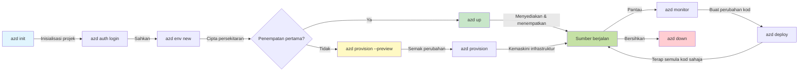
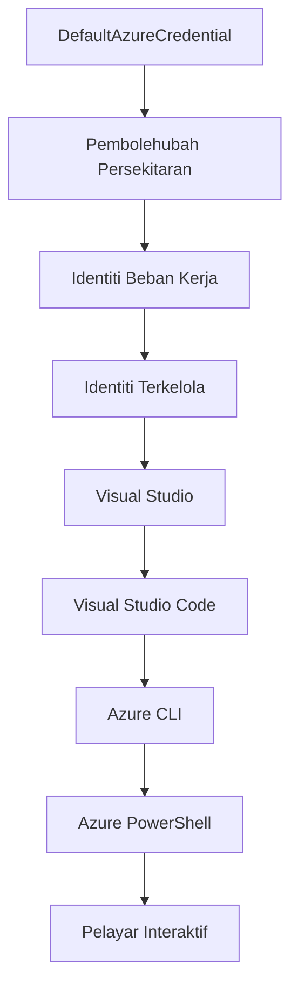

# AZD Basics - Memahami Azure Developer CLI

# AZD Basics - Konsep Teras dan Asas

**Navigasi Bab:**
- **📚 Laman Utama Kursus**: [AZD Untuk Pemula](../../README.md)
- **📖 Bab Semasa**: Bab 1 - Asas & Permulaan Pantas
- **⬅️ Sebelumnya**: [Gambaran Keseluruhan Kursus](../../README.md#-chapter-1-foundation--quick-start)
- **➡️ Seterusnya**: [Pemasangan & Persediaan](installation.md)
- **🚀 Bab Seterusnya**: [Bab 2: Pembangunan Utama AI](../chapter-02-ai-development/microsoft-foundry-integration.md)

## Pengenalan

Pelajaran ini memperkenalkan anda kepada Azure Developer CLI (azd), alat baris perintah yang kuat yang mempercepat perjalanan anda dari pembangunan setempat ke penyebaran Azure. Anda akan mempelajari konsep asas, ciri teras, dan memahami bagaimana azd memudahkan penyebaran aplikasi asli awan.

## Matlamat Pembelajaran

Menjelang akhir pelajaran ini, anda akan:
- Memahami apa itu Azure Developer CLI dan tujuan utamanya
- Mempelajari konsep teras templat, persekitaran, dan perkhidmatan
- Meneroka ciri utama termasuk pembangunan berasaskan templat dan Infrastruktur sebagai Kod
- Memahami struktur projek azd dan aliran kerja
- Bersedia untuk memasang dan mengkonfigurasi azd untuk persekitaran pembangunan anda

## Hasil Pembelajaran

Setelah menyelesaikan pelajaran ini, anda akan dapat:
- Menjelaskan peranan azd dalam aliran kerja pembangunan awan moden
- Mengenal pasti komponen struktur projek azd
- Menerangkan bagaimana templat, persekitaran, dan perkhidmatan berfungsi bersama
- Memahami faedah Infrastruktur sebagai Kod dengan azd
- Mengenal pasti pelbagai arahan azd dan tujuan mereka

## Apa itu Azure Developer CLI (azd)?

Azure Developer CLI (azd) adalah alat baris perintah yang direka untuk mempercepat perjalanan anda dari pembangunan setempat ke penyebaran Azure. Ia memudahkan proses membina, menyebar, dan mengurus aplikasi asli awan di Azure.

### Apa yang Boleh Anda Sebarkan dengan azd?

azd menyokong pelbagai jenis beban kerja—dan senarainya terus berkembang. Hari ini, anda boleh menggunakan azd untuk menyebarkan:

| Jenis Beban Kerja | Contoh | Aliran Kerja Sama? |
|-------------------|--------|--------------------|
| **Aplikasi tradisional** | Apl web, REST API, tapak statik | ✅ `azd up` |
| **Perkhidmatan dan mikroperkhidmatan** | Container Apps, Function Apps, backend pelbagai perkhidmatan | ✅ `azd up` |
| **Aplikasi yang dikuasakan AI** | Apl sembang dengan Model Microsoft Foundry, penyelesaian RAG dengan AI Search | ✅ `azd up` |
| **Ejen pintar** | Ejen dihoskan oleh Foundry, orkestrasi pelbagai ejen | ✅ `azd up` |

Intinya adalah bahawa **kitaran hayat azd tetap sama tidak kira apa yang anda sebarkan**. Anda memulakan projek, menyediakan infrastruktur, menyebar kod, memantau aplikasi anda, dan membersihkan—sama ada laman web mudah atau ejen AI yang canggih.

Kesinambungan ini adalah menurut reka bentuk. azd menganggap kebolehan AI sebagai satu lagi jenis perkhidmatan yang boleh digunakan oleh aplikasi anda, bukan sesuatu yang berbeza secara fundamental. Titik akhir sembang yang disokong oleh Model Microsoft Foundry, dari perspektif azd, hanyalah satu lagi perkhidmatan untuk dikonfigurasi dan disebar.

### 🎯 Mengapa Menggunakan AZD? Perbandingan Dunia Sebenar

Mari kita bandingkan penyebaran apl web mudah dengan pangkalan data:

#### ❌ TANPA AZD: Penyebaran Azure Manual (30+ minit)

```bash
# Langkah 1: Cipta kumpulan sumber
az group create --name myapp-rg --location eastus

# Langkah 2: Cipta Pelan Perkhidmatan Apl
az appservice plan create --name myapp-plan \
  --resource-group myapp-rg \
  --sku B1 --is-linux

# Langkah 3: Cipta Apl Web
az webapp create --name myapp-web-unique123 \
  --resource-group myapp-rg \
  --plan myapp-plan \
  --runtime "NODE:18-lts"

# Langkah 4: Cipta akaun Cosmos DB (10-15 minit)
az cosmosdb create --name myapp-cosmos-unique123 \
  --resource-group myapp-rg \
  --kind MongoDB

# Langkah 5: Cipta pangkalan data
az cosmosdb mongodb database create \
  --account-name myapp-cosmos-unique123 \
  --resource-group myapp-rg \
  --name tododb

# Langkah 6: Cipta koleksi
az cosmosdb mongodb collection create \
  --account-name myapp-cosmos-unique123 \
  --resource-group myapp-rg \
  --database-name tododb \
  --name todos

# Langkah 7: Dapatkan rentetan sambungan
CONN_STR=$(az cosmosdb keys list \
  --name myapp-cosmos-unique123 \
  --resource-group myapp-rg \
  --type connection-strings \
  --query "connectionStrings[0].connectionString" -o tsv)

# Langkah 8: Konfigurasikan tetapan apl
az webapp config appsettings set \
  --name myapp-web-unique123 \
  --resource-group myapp-rg \
  --settings MONGODB_URI="$CONN_STR"

# Langkah 9: Hidupkan log
az webapp log config --name myapp-web-unique123 \
  --resource-group myapp-rg \
  --application-logging filesystem \
  --detailed-error-messages true

# Langkah 10: Sediakan Application Insights
az monitor app-insights component create \
  --app myapp-insights \
  --location eastus \
  --resource-group myapp-rg

# Langkah 11: Pautkan App Insights ke Apl Web
INSTRUMENTATION_KEY=$(az monitor app-insights component show \
  --app myapp-insights \
  --resource-group myapp-rg \
  --query "instrumentationKey" -o tsv)

az webapp config appsettings set \
  --name myapp-web-unique123 \
  --resource-group myapp-rg \
  --settings APPINSIGHTS_INSTRUMENTATIONKEY="$INSTRUMENTATION_KEY"

# Langkah 12: Bina aplikasi secara tempatan
npm install
npm run build

# Langkah 13: Cipta pakej pengeluaran
zip -r app.zip . -x "*.git*" "node_modules/*"

# Langkah 14: Keluarkan aplikasi
az webapp deployment source config-zip \
  --resource-group myapp-rg \
  --name myapp-web-unique123 \
  --src app.zip

# Langkah 15: Tunggu dan doa ia berfungsi 🙏
# (Tiada pengesahan automatik, ujian manual diperlukan)
```

**Masalah:**
- ❌ 15+ arahan untuk diingat dan dilaksanakan mengikut urutan
- ❌ 30-45 minit kerja manual
- ❌ Mudah melakukan kesilapan (typo, parameter salah)
- ❌ Rentetan sambungan didedahkan dalam sejarah terminal
- ❌ Tiada rollback automatik jika sesuatu gagal
- ❌ Sukar untuk ditembusi oleh ahli pasukan
- ❌ Berbeza setiap kali (tidak boleh diulang)

#### ✅ DENGAN AZD: Penyebaran Automatik (5 arahan, 10-15 minit)

```bash
# Langkah 1: Mula dari templat
azd init --template todo-nodejs-mongo

# Langkah 2: Mengesahkan
azd auth login

# Langkah 3: Cipta persekitaran
azd env new dev

# Langkah 4: Pratonton perubahan (pilihan tetapi disyorkan)
azd provision --preview

# Langkah 5: Lancarkan semuanya
azd up

# ✨ Selesai! Segalanya telah dilancarkan, dikonfigurasi, dan dipantau
```

**Kelebihan:**
- ✅ **5 arahan** berbanding 15+ langkah manual
- ✅ **10-15 minit** masa keseluruhan (kebanyakannya menunggu Azure)
- ✅ **Kurang kesilapan manual** - aliran kerja berasaskan templat yang konsisten
- ✅ **Pengendalian rahsia selamat** - banyak templat menggunakan storan rahsia yang dikendalikan Azure
- ✅ **Penyebaran boleh diulang** - aliran kerja sama setiap kali
- ✅ **Boleh dihasilkan semula sepenuhnya** - hasil sama setiap masa
- ✅ **Sedia untuk pasukan** - sesiapa boleh menyebar dengan arahan yang sama
- ✅ **Infrastruktur sebagai Kod** - templat Bicep yang dikawal versi
- ✅ **Pemantauan terbina dalam** - Application Insights dikonfigurasikan secara automatik

### 📊 Pengurangan Masa & Ralat

| Metrik | Penyebaran Manual | Penyebaran AZD | Peningkatan |
|:-------|:------------------|:---------------|:------------|
| **Arahan** | 15+ | 5 | 67% kurang |
| **Masa** | 30-45 min | 10-15 min | 60% lebih cepat |
| **Kadar Ralat** | ~40% | <5% | Pengurangan 88% |
| **Konsistensi** | Rendah (manual) | 100% (automatik) | Sempurna |
| **Onboarding Pasukan** | 2-4 jam | 30 minit | 75% lebih cepat |
| **Masa Rollback** | 30+ min (manual) | 2 min (automatik) | 93% lebih cepat |

## Konsep Teras

### Templat
Templat adalah asas bagi azd. Ia mengandungi:
- **Kod aplikasi** - Kod sumber dan pergantungan anda
- **Definisi infrastruktur** - Sumber Azure yang ditakrifkan dalam Bicep atau Terraform
- **Fail konfigurasi** - Tetapan dan pembolehubah persekitaran
- **Skrip penyebaran** - Aliran kerja penyebaran automatik

### Persekitaran
Persekitaran mewakili sasaran penyebaran yang berbeza:
- **Pembangunan** - Untuk ujian dan pembangunan
- **Staging** - Persekitaran pra-produksi
- **Produksi** - Persekitaran produksi langsung

Setiap persekitaran mengekalkan:
- Kumpulan sumber Azure sendiri
- Tetapan konfigurasi
- Keadaan penyebaran

### Perkhidmatan
Perkhidmatan adalah blok binaan aplikasi anda:
- **Frontend** - Aplikasi web, SPA
- **Backend** - API, mikroperkhidmatan
- **Pangkalan data** - Penyelesaian penyimpanan data
- **Storan** - Penyimpanan fail dan blob

## Ciri Utama

### 1. Pembangunan Berpandukan Templat
```bash
# Layari templat yang tersedia
azd template list

# Mula daripada templat
azd init --template <template-name>
```

### 2. Infrastruktur sebagai Kod
- **Bicep** - Bahasa khusus domain Azure
- **Terraform** - Alat infrastruktur multi-awan
- **Templat ARM** - Templat Pengurus Sumber Azure

### 3. Aliran Kerja Bersepadu
```bash
# Aliran kerja penyebaran lengkap
azd up            # Sediakan + Sebarkan ini adalah tanpa sentuhan untuk persediaan kali pertama

# 🧪 BARU: Pratonton perubahan infrastruktur sebelum penyebaran (SELAMAT)
azd provision --preview    # Simulasikan penyebaran infrastruktur tanpa membuat perubahan

azd provision     # Cipta sumber Azure jika anda mengemas kini infrastruktur gunakan ini
azd deploy        # Sebarkan kod aplikasi atau susun semula kod aplikasi setelah kemas kini
azd down          # Bersihkan sumber
```

#### 🛡️ Perancangan Infrastruktur Selamat dengan Pratonton
Arahan `azd provision --preview` adalah perubahan permainan untuk penyebaran yang selamat:
- **Analisis dry-run** - Menunjukkan apa yang akan dibuat, diubah, atau dipadam
- **Risiko sifar** - Tiada perubahan sebenar dibuat ke persekitaran Azure anda
- **Kerjasama Pasukan** - Kongsi keputusan pratonton sebelum penyebaran
- **Anggaran kos** - Fahami kos sumber sebelum komitmen

```bash
# Contoh aliran kerja pratonton
azd provision --preview           # Lihat apa yang akan berubah
# Semak hasilnya, bincang dengan pasukan
azd provision                     # Terapkan perubahan dengan keyakinan
```

### 📊 Visual: Aliran Kerja Pembangunan AZD



**Penjelasan Aliran Kerja:**
1. **Init** - Mulakan dengan templat atau projek baru
2. **Auth** - Sahkan dengan Azure
3. **Persekitaran** - Cipta persekitaran penyebaran terpencil
4. **Preview** - 🆕 Sentiasa pratonton perubahan infrastruktur dahulu (amalan selamat)
5. **Provision** - Cipta/kemas kini sumber Azure
6. **Deploy** - Tolak kod aplikasi anda
7. **Monitor** - Perhatikan prestasi aplikasi
8. **Iterate** - Buat perubahan dan sebarkan semula kod
9. **Cleanup** - Alih keluar sumber apabila selesai

### 4. Pengurusan Persekitaran
```bash
# Cipta dan urus persekitaran
azd env new <environment-name>
azd env select <environment-name>
azd env list
```

### 5. Sambungan dan Arahan AI

azd menggunakan sistem sambungan untuk menambah keupayaan melebihi CLI teras. Ini amat berguna untuk beban kerja AI:

```bash
# Senaraikan sambungan yang tersedia
azd extension list

# Pasang sambungan ejen Foundry
azd extension install azure.ai.agents

# Mulakan projek ejen AI dari manifest
azd ai agent init -m agent-manifest.yaml

# Uji ejen yang telah diterapkan (menunjukkan latensi dan masa-ke-byte-pertama)
azd ai agent invoke

# Mulakan pelayan MCP untuk pembangunan dibantu AI (Alpha)
azd mcp start
```

**Kitaran hayat ejen, dari mula hingga akhir.** Sebaik sahaja anda memasang `azure.ai.agents`, satu aliran kerja membawa anda dari idea ke ejen yang sedang berjalan dan dipantau. Anda tidak perlu semua ini pada hari pertama—cuma ketahui ia wujud:

| Tahap | Arahan | Apa yang dilakukan |
|-------|---------|--------------------|
| **Scaffold** | `azd ai agent init -m <manifest>` | Jana projek ejen dari manifesto |
| **Test** | `azd ai agent invoke` | Panggil ejen dan lihat masa tindak balas |
| **Measure** | `azd ai agent eval generate` | Cipta dataset penilaian untuk ejen |
| **Improve** | `azd ai agent optimize` | Optimumkan arahan ejen berdasarkan data anda |
| **Inspect** | `azd ai agent endpoint show` | Lihat konfigurasi titik akhir langsung |
| **Clean up** | `azd ai agent delete` | Padamkan ejen dihoskan dan semua versinya |

> Sambungan dibincangkan secara terperinci dalam [Bab 2: Pembangunan Utama AI](../chapter-02-ai-development/agents.md) dan rujukan [Arahan AZD AI CLI](../chapter-08-production/production-ai-practices.md#azd-ai-cli-commands-and-extensions).

## 📁 Struktur Projek

Struktur projek azd tipikal:
```
my-app/
├── .azd/                    # azd configuration
│   └── config.json
├── .azure/                  # Azure deployment artifacts
├── .devcontainer/          # Development container config
├── .github/workflows/      # GitHub Actions
├── .vscode/               # VS Code settings
├── infra/                 # Infrastructure code
│   ├── main.bicep        # Main infrastructure template
│   ├── main.parameters.json
│   └── modules/          # Reusable modules
├── src/                  # Application source code
│   ├── api/             # Backend services
│   └── web/             # Frontend application
├── azure.yaml           # azd project configuration
└── README.md
```

## 🔧 Fail Konfigurasi

### azure.yaml
Fail konfigurasi projek utama:
```yaml
name: my-awesome-app
metadata:
  template: my-template@1.0.0

services:
  web:
    project: ./src/web
    language: js
    host: appservice
  api:
    project: ./src/api
    language: js
    host: appservice

hooks:
  preprovision:
    shell: pwsh
    run: echo "Preparing to provision..."
```

### .azure/config.json
Konfigurasi khusus persekitaran:
```json
{
  "version": 1,
  "defaultEnvironment": "dev",
  "environments": {
    "dev": {
      "subscriptionId": "your-subscription-id",
      "location": "eastus"
    }
  }
}
```

## 🎪 Aliran Kerja Umum dengan Latihan Praktikal

> **💡 Petua Pembelajaran:** Ikuti latihan ini mengikut urutan untuk membina kemahiran AZD anda secara berperingkat.

### 🎯 Latihan 1: Mulakan Projek Pertama Anda

**Matlamat:** Cipta projek AZD dan teroka strukturnya

**Langkah-langkah:**
```bash
# Gunakan template yang terbukti
azd init --template todo-nodejs-mongo

# Terokai fail yang dijana
ls -la  # Lihat semua fail termasuk yang tersembunyi

# Fail utama yang dibuat:
# - azure.yaml (konfigurasi utama)
# - infra/ (kod infrastruktur)
# - src/ (kod aplikasi)
```

**✅ Berjaya:** Anda mempunyai direktori azure.yaml, infra/, dan src/

---

### 🎯 Latihan 2: Sebarkan ke Azure

**Matlamat:** Lengkapkan penyebaran hujung ke hujung

**Langkah-langkah:**
```bash
# 1. Sahkan
az login && azd auth login

# 2. Cipta persekitaran
azd env new dev
azd env set AZURE_LOCATION eastus

# 3. Pratonton perubahan (DISYORKAN)
azd provision --preview

# 4. Lancarkan semuanya
azd up

# 5. Sahkan pelancaran
azd show    # Lihat URL aplikasi anda
```

**Masa Dijangka:** 10-15 minit  
**✅ Berjaya:** URL aplikasi terbuka dalam pelayar

---

### 🎯 Latihan 3: Pelbagai Persekitaran

**Matlamat:** Sebarkan ke dev dan staging

**Langkah-langkah:**
```bash
# Sudah mempunyai dev, buat staging
azd env new staging
azd env set AZURE_LOCATION westus2
azd up

# Bertukar antara mereka
azd env list
azd env select dev
```

**✅ Berjaya:** Dua kumpulan sumber berasingan di Portal Azure

---

### 🛡️ Bersihkan Papan: `azd down --force --purge`

Apabila anda perlu menetapkan semula sepenuhnya:

```bash
azd down --force --purge
```

**Apa yang dilakukan:**
- `--force`: Tiada arahan pengesahan
- `--purge`: Memadam semua keadaan tempatan dan sumber Azure

**Gunakan apabila:**
- Penyebaran gagal separuh jalan
- Menukar projek
- Perlu permulaan baru

---

## 🎪 Rujukan Aliran Kerja Asal

### Memulakan Projek Baru
```bash
# Kaedah 1: Gunakan templat sedia ada
azd init --template todo-nodejs-mongo

# Kaedah 2: Mula dari awal
azd init

# Kaedah 3: Gunakan direktori semasa
azd init .
```

### Kitaran Pembangunan
```bash
# Sediakan persekitaran pembangunan
azd auth login
azd env new dev
azd env select dev

# Lancarkan semuanya
azd up

# Buat perubahan dan lancarkan semula
azd deploy

# Bersihkan apabila selesai
azd down --force --purge # arahan dalam Azure Developer CLI adalah **reset keras** untuk persekitaran anda—terutama berguna apabila anda menyelesaikan penyebaran yang gagal, membersihkan sumber yang terbiar, atau menyediakan untuk pelancaran semula yang baru.
```

## Memahami `azd down --force --purge`
Arahan `azd down --force --purge` adalah cara yang kuat untuk sepenuhnya membongkar persekitaran azd anda dan semua sumber yang berkaitan. Berikut pecahan apa yang dilakukan setiap bendera:
```
--force
```
- Melangkau arahan pengesahan.
- Berguna untuk automasi atau skrip di mana input manual tidak boleh dilakukan.
- Memastikan pembongkaran berjalan tanpa gangguan, walaupun CLI mengesan ketidakkonsistenan.

```
--purge
```
Memadam **semua metadata berkaitan**, termasuk:
Keadaan persekitaran  
Folder `.azure` tempatan  
Maklumat penyebaran yang di-cache  
Menghalang azd daripada "mengingati" penyebaran sebelumnya, yang boleh menyebabkan isu seperti kumpulan sumber yang tidak sepadan atau rujukan registri yang usang.


### Mengapa gunakan kedua-duanya?
Apabila anda terhenti dengan `azd up` disebabkan keadaan tertinggal atau penyebaran sebahagian, gabungan ini memastikan **permulaan bersih**.

Ia amat membantu selepas penghapusan sumber manual di portal Azure atau apabila menukar templat, persekitaran, atau konvensyen penamaan kumpulan sumber.


### Mengurus Pelbagai Persekitaran
```bash
# Buat persekitaran persediaan
azd env new staging
azd env select staging
azd up

# Tukar kembali ke dev
azd env select dev

# Bandingkan persekitaran
azd env list
```

## 🔐 Pengesahan dan Kredensial

Memahami pengesahan adalah penting untuk penyebaran azd yang berjaya. Azure menggunakan pelbagai kaedah pengesahan, dan azd menggunakan rantaian kredensial yang sama seperti alat Azure lain.

### Pengesahan Azure CLI (`az login`)

Sebelum menggunakan azd, anda perlu mengesahkan dengan Azure. Kaedah paling biasa adalah menggunakan Azure CLI:

```bash
# Log masuk interaktif (membuka pelayar)
az login

# Log masuk dengan penyewa tertentu
az login --tenant <tenant-id>

# Log masuk dengan peranan perkhidmatan
az login --service-principal -u <app-id> -p <password> --tenant <tenant-id>

# Semak status log masuk semasa
az account show

# Senaraikan langganan yang tersedia
az account list --output table

# Tetapkan langganan lalai
az account set --subscription <subscription-id>
```

### Aliran Pengesahan
1. **Log Masuk Interaktif**: Membuka pelayar lalai anda untuk pengesahan
2. **Aliran Kod Peranti**: Untuk persekitaran tanpa akses pelayar
3. **Principal Perkhidmatan**: Untuk automasi dan senario CI/CD
4. **Identiti Terurus**: Untuk aplikasi yang dihoskan di Azure

### Rantaian DefaultAzureCredential

`DefaultAzureCredential` adalah jenis kredensial yang menyediakan pengalaman pengesahan yang dipermudahkan dengan secara automatik mencuba pelbagai sumber kredensial dalam urutan tertentu:

#### Urutan Rantaian Kredensial


#### 1. Pembolehubah Persekitaran
```bash
# Tetapkan pemboleh ubah persekitaran untuk prinsipal perkhidmatan
export AZURE_CLIENT_ID="<app-id>"
export AZURE_CLIENT_SECRET="<password>"
export AZURE_TENANT_ID="<tenant-id>"
```

#### 2. Identiti Beban Kerja (Kubernetes/GitHub Actions)
Digunakan secara automatik di:
- Azure Kubernetes Service (AKS) dengan Identiti Beban Kerja
- GitHub Actions dengan persekutuan OIDC
- Senario identiti bersekutu lain

#### 3. Identiti Terurus
Untuk sumber Azure seperti:
- Mesin Maya
- App Service
- Azure Functions
- Container Instances

```bash
# Periksa jika berjalan pada sumber Azure dengan identiti terurus
az account show --query "user.type" --output tsv
# Pulangan: "servicePrincipal" jika menggunakan identiti terurus
```

#### 4. Integrasi Alat Pembangun
- **Visual Studio**: Automatik menggunakan akaun yang log masuk
- **VS Code**: Menggunakan kredensial sambungan Akaun Azure
- **Azure CLI**: Menggunakan kredensial `az login` (paling biasa untuk pembangunan setempat)

### Persediaan Pengesahan AZD

```bash
# Kaedah 1: Gunakan Azure CLI (Disyorkan untuk pembangunan)
az login
azd auth login  # Menggunakan kelayakan Azure CLI sedia ada

# Kaedah 2: Pengesahan azd secara langsung
azd auth login --use-device-code  # Untuk persekitaran tanpa kepala

# Kaedah 3: Semak status pengesahan
azd auth login --check-status

# Kaedah 4: Log keluar dan sahkan semula
azd auth logout
azd auth login
```

### Amalan Terbaik Pengesahan

#### Untuk Pembangunan Setempat
```bash
# 1. Log masuk dengan Azure CLI
az login

# 2. Sahkan langganan yang betul
az account show
az account set --subscription "Your Subscription Name"

# 3. Gunakan azd dengan kelayakan sedia ada
azd auth login
```

#### Untuk Saluran CI/CD
```yaml
# GitHub Actions example
- name: Azure Login
  uses: azure/login@v1
  with:
    creds: ${{ secrets.AZURE_CREDENTIALS }}

- name: Deploy with azd
  run: |
    azd auth login --client-id ${{ secrets.AZURE_CLIENT_ID }} \
                    --client-secret ${{ secrets.AZURE_CLIENT_SECRET }} \
                    --tenant-id ${{ secrets.AZURE_TENANT_ID }}
    azd up --no-prompt
```

#### Untuk Persekitaran Pengeluaran
- Gunakan **Identiti Terurus** apabila menjalankan pada sumber Azure
- Gunakan **Perkhidmatan Prinsipal** untuk senario automasi
- Elakkan menyimpan kelayakan dalam kod atau fail konfigurasi
- Gunakan **Azure Key Vault** untuk konfigurasi sensitif

### Isu dan Penyelesaian Pengesahan yang Biasa

#### Isu: "Tiada langganan ditemui"
```bash
# Penyelesaian: Tetapkan langganan lalai
az account list --output table
az account set --subscription "<subscription-id>"
azd env set AZURE_SUBSCRIPTION_ID "<subscription-id>"
```

#### Isu: "Kebenaran tidak mencukupi"
```bash
# Penyelesaian: Semak dan tetapkan peranan yang diperlukan
az role assignment list --assignee $(az account show --query user.name --output tsv)

# Peranan biasa yang diperlukan:
# - Penyumbang (untuk pengurusan sumber)
# - Pentadbir Akses Pengguna (untuk penetapan peranan)
```

#### Isu: "Token tamat tempoh"
```bash
# Penyelesaian: Autentikasi semula
az logout
az login
azd auth logout
azd auth login
```

### Pengesahan dalam Pelbagai Senario

#### Pembangunan Tempatan
```bash
# Akaun pembangunan peribadi
az login
azd auth login
```

#### Pembangunan Pasukan
```bash
# Gunakan penyewa khusus untuk organisasi
az login --tenant contoso.onmicrosoft.com
azd auth login
```

#### Senario Pelbagai Penyewa
```bash
# Bertukar antara penyewa
az login --tenant tenant1.onmicrosoft.com
# Lancarkan ke penyewa 1
azd up

az login --tenant tenant2.onmicrosoft.com  
# Lancarkan ke penyewa 2
azd up
```

### Pertimbangan Keselamatan

1. **Penyimpanan Kelayakan**: Jangan simpan kelayakan dalam kod sumber
2. **Had Skop**: Gunakan prinsip keistimewaan paling rendah untuk perkhidmatan prinsipal
3. **Putaran Token**: Putar rahsia perkhidmatan prinsipal secara berkala
4. **Jejak Audit**: Pantau aktiviti pengesahan dan penerapan
5. **Keselamatan Rangkaian**: Gunakan titik akhir peribadi apabila boleh

### Penyelesaian Masalah Pengesahan

```bash
# Selesaikan masalah pengesahan
azd auth login --check-status
az account show
az account get-access-token

# Arahan diagnostik biasa
whoami                          # Konteks pengguna semasa
az ad signed-in-user show      # Butiran pengguna Microsoft Entra ID
az group list                  # Uji akses sumber daya
```

## Memahami `azd down --force --purge`

### Penemuan
```bash
azd template list              # Layari templat
azd template show <template>   # Butiran templat
azd init --help               # Pilihan penginisian
```

### Pengurusan Projek
```bash
azd show                     # Gambaran keseluruhan projek
azd env list                # Persekitaran tersedia dan lalai yang dipilih
azd config show            # Tetapan konfigurasi
```

### Pemantauan
```bash
azd monitor                  # Buka pemantauan portal Azure
azd monitor --logs           # Lihat log aplikasi
azd monitor --live           # Lihat metrik langsung
azd pipeline config          # Sediakan CI/CD
```

## Amalan Terbaik

### 1. Gunakan Nama yang Bermakna
```bash
# Baik
azd env new production-east
azd init --template web-app-secure

# Elakkan
azd env new env1
azd init --template template1
```

### 2. Manfaatkan Templat
- Mula dengan templat sedia ada
- Sesuaikan mengikut keperluan anda
- Cipta templat boleh guna semula untuk organisasi anda

### 3. Pengasingan Persekitaran
- Gunakan persekitaran berasingan untuk dev/staging/prod
- Jangan deploy terus ke pengeluaran dari mesin tempatan
- Gunakan saluran CI/CD untuk deployment pengeluaran

### 4. Pengurusan Konfigurasi
- Gunakan pembolehubah persekitaran untuk data sensitif
- Simpan konfigurasi dalam kawalan versi
- Dokumen tetapan khusus persekitaran

## Perkembangan Pembelajaran

### Pemula (Minggu 1-2)
1. Pasang azd dan sahkan
2. Deploy templat mudah
3. Fahami struktur projek
4. Pelajari arahan asas (up, down, deploy)

### Pertengahan (Minggu 3-4)
1. Sesuaikan templat
2. Urus pelbagai persekitaran
3. Fahami kod infrastruktur
4. Sediakan saluran CI/CD

### Lanjutan (Minggu 5+)
1. Cipta templat tersuai
2. Corak infrastruktur lanjutan
3. Deploy pelbagai rantau
4. Konfigurasi kelas perusahaan

## Langkah Seterusnya

**📖 Teruskan Bab 1 Pembelajaran:**
- [Pemasangan & Persediaan](installation.md) - Pasang dan konfigurasi azd
- [Projek Pertama Anda](first-project.md) - Lengkapkan tutorial praktikal
- [Panduan Konfigurasi](configuration.md) - Pilihan konfigurasi lanjutan

**🎯 Sedia untuk Bab Seterusnya?**
- [Bab 2: Pembangunan AI-Pertama](../chapter-02-ai-development/microsoft-foundry-integration.md) - Mulakan bina aplikasi AI

## Sumber Tambahan

- [Gambaran Keseluruhan Azure Developer CLI](https://learn.microsoft.com/en-us/azure/developer/azure-developer-cli/)
- [Galeri Templat](https://azure.github.io/awesome-azd/)
- [Contoh Komuniti](https://github.com/Azure-Samples)

---

## 🙋 Soalan Lazim

### Soalan Am

**S: Apakah perbezaan antara AZD dan Azure CLI?**

J: Azure CLI (`az`) digunakan untuk mengurus sumber Azure individu. AZD (`azd`) digunakan untuk mengurus aplikasi keseluruhan:

```bash
# Azure CLI - Pengurusan sumber pada tahap rendah
az webapp create --name myapp --resource-group rg
az sql server create --name myserver --resource-group rg
# ...banyak lagi arahan diperlukan

# AZD - Pengurusan pada tahap aplikasi
azd up  # Melancarkan keseluruhan aplikasi dengan semua sumber
```

**Fikirkan seperti ini:**
- `az` = Mengendalikan batu Lego individu
- `azd` = Bekerja dengan set Lego lengkap

---

**S: Adakah saya perlu tahu Bicep atau Terraform untuk menggunakan AZD?**

J: Tidak! Mula dengan templat:
```bash
# Gunakan templat sedia ada - tidak perlu pengetahuan IaC
azd init --template todo-nodejs-mongo
azd up
```

Anda boleh belajar Bicep kemudian untuk sesuaikan infrastruktur. Templat menyediakan contoh yang berfungsi untuk dipelajari.

---

**S: Berapa kos menjalankan templat AZD?**

J: Kos berbeza mengikut templat. Kebanyakan templat pembangunan berharga $50-150/bulan:

```bash
# Pratonton kos sebelum melaksanakan
azd provision --preview

# Sentiasa bersihkan apabila tidak digunakan
azd down --force --purge  # Menghapuskan semua sumber daya
```

**Tip Pro:** Gunakan tahap percuma apabila ada:
- App Service: tahap F1 (Percuma)
- Microsoft Foundry Models: Azure OpenAI 50,000 token/bulan percuma
- Cosmos DB: tahap 1000 RU/s percuma

---

**S: Bolehkah saya menggunakan AZD dengan sumber Azure sedia ada?**

J: Ya, tetapi lebih mudah mula dari awal. AZD berfungsi terbaik apabila menguruskan siklus hayat penuh. Untuk sumber sedia ada:

```bash
# Pilihan 1: Import sumber yang sedia ada (lanjutan)
azd init
# Kemudian ubah infra/ untuk merujuk sumber yang sedia ada

# Pilihan 2: Mula dari awal (disyorkan)
azd init --template matching-your-stack
azd up  # Mewujudkan persekitaran baru
```

---

**S: Bagaimana saya kongsikan projek saya dengan rakan sepasukan?**

J: Komit projek AZD ke Git (tetapi JANGAN folder .azure):

```bash
# Sudah dalam .gitignore secara lalai
.azure/        # Mengandungi rahsia dan data persekitaran
*.env          # Pembolehubah persekitaran

# Ahli pasukan kemudian:
git clone <your-repo>
azd auth login
azd env new <their-name>-dev
azd up
```

Semua orang mendapat infrastruktur yang sama daripada templat yang sama.

---

### Soalan Penyelesaian Masalah

**S: "azd up" gagal separuh jalan. Apa patut saya buat?**

J: Semak ralat, perbaiki, kemudian cuba semula:

```bash
# Lihat log terperinci
azd show

# Pembetulan biasa:

# 1. Jika kuota melebihi:
azd env set AZURE_LOCATION "westus2"  # Cuba wilayah berbeza

# 2. Jika konflik nama sumber:
azd down --force --purge  # Mulakan semula
azd up  # Cuba semula

# 3. Jika pengesahan tamat:
az login
azd auth login
azd up
```

**Isu paling biasa:** Langganan Azure salah dipilih
```bash
az account list --output table
az account set --subscription "<correct-subscription>"
```

---

**S: Bagaimana saya deploy hanya perubahan kod tanpa reprovisioning?**

J: Gunakan `azd deploy` bukan `azd up`:

```bash
azd up          # Kali pertama: menyediakan + melancarkan (perlahan)

# Buat perubahan kod...

azd deploy      # Kali berikutnya: hanya melancarkan (pantas)
```

Perbandingan kelajuan:
- `azd up`: 10-15 minit (provision infrastruktur)
- `azd deploy`: 2-5 minit (kod sahaja)

---

**S: Bolehkah saya sesuaikan templat infrastruktur?**

J: Ya! Edit fail Bicep dalam `infra/`:

```bash
# Selepas azd init
cd infra/
code main.bicep  # Sunting dalam VS Code

# Pratonton perubahan
azd provision --preview

# Terapkan perubahan
azd provision
```

**Tip:** Mula dengan kecil - tukar SKU dahulu:
```bicep
// infra/main.bicep
sku: {
  name: 'B1'  // Change to 'P1V2' for production
}
```

---

**S: Bagaimana saya padamkan semua yang dicipta AZD?**

J: Satu arahan padam semua sumber:

```bash
azd down --force --purge

# Ini memadam:
# - Semua sumber Azure
# - Kumpulan sumber
# - Keadaan persekitaran tempatan
# - Data penyebaran yang disimpan dalam cache
```

**Sentiasa jalankan bila:**
- Tamat ujian templat
- Bertukar projek lain
- Mahu mula dari awal

**Penjimatan kos:** Memadam sumber tidak digunakan = tiada caj

---

**S: Apa jadi kalau saya terpadam sumber dalam Azure Portal secara tidak sengaja?**

J: Status AZD boleh terkeluar dari sinkron. Gunakan pendekatan bersih:

```bash
# 1. Buang keadaan tempatan
azd down --force --purge

# 2. Mula semula
azd up

# Alternatif: Biarkan AZD mengesan dan membaiki
azd provision  # Akan mencipta sumber yang hilang
```

---

### Soalan Lanjutan

**S: Bolehkah saya guna AZD dalam saluran CI/CD?**

J: Ya! Contoh GitHub Actions:

```yaml
# .github/workflows/deploy.yml
name: Deploy with AZD

on:
  push:
    branches: [main]

jobs:
  deploy:
    runs-on: ubuntu-latest
    steps:
      - uses: actions/checkout@v2
      
      - name: Install azd
        run: curl -fsSL https://aka.ms/install-azd.sh | bash
      
      - name: Azure Login
        run: |
          azd auth login \
            --client-id ${{ secrets.AZURE_CLIENT_ID }} \
            --client-secret ${{ secrets.AZURE_CLIENT_SECRET }} \
            --tenant-id ${{ secrets.AZURE_TENANT_ID }}
      
      - name: Deploy
        run: azd up --no-prompt
```

---

**S: Bagaimana saya kendalikan rahsia dan data sensitif?**

J: AZD integrasi automatik dengan Azure Key Vault:

```bash
# Rahsia disimpan dalam Key Vault, bukan dalam kod
azd env set DATABASE_PASSWORD "$(openssl rand -base64 32)"

# AZD secara automatik:
# 1. Mencipta Key Vault
# 2. Menyimpan rahsia
# 3. Memberi akses aplikasi melalui Identiti Terurus
# 4. Menyuntik semasa masa jalanan
```

**Jangan pernah komit:**
- Folder `.azure/` (mengandungi data persekitaran)
- Fail `.env` (rahsia tempatan)
- Rentetan sambungan

---

**S: Bolehkah saya deploy ke pelbagai rantau?**

J: Ya, cipta persekitaran untuk setiap rantau:

```bash
# Persekitaran Timur AS
azd env new prod-eastus
azd env set AZURE_LOCATION eastus
azd up

# Persekitaran Barat Eropah
azd env new prod-westeurope
azd env set AZURE_LOCATION westeurope
azd up

# Setiap persekitaran adalah bebas
azd env list
```

Untuk aplikasi multi-rantau sebenar, sesuaikan templat Bicep untuk deploy ke pelbagai rantau serentak.

---

**S: Di mana saya boleh dapat bantuan jika tersekat?**

1. **Dokumentasi AZD:** https://learn.microsoft.com/azure/developer/azure-developer-cli/
2. **Isu GitHub:** https://github.com/Azure/azure-dev/issues
3. **Discord:** [Azure Discord](https://discord.gg/microsoft-azure) - saluran #azure-developer-cli
4. **Stack Overflow:** Tag `azure-developer-cli`
5. **Kursus Ini:** [Panduan Penyelesaian Masalah](../chapter-07-troubleshooting/common-issues.md)

**Tip Pro:** Sebelum bertanya, jalankan:
```bash
azd show       # Menunjukkan keadaan semasa
azd version    # Menunjukkan versi anda
```
Sertakan maklumat ini dalam soalan anda untuk bantuan lebih cepat.

---

## 🎓 Apa Seterusnya?

Anda kini faham asas AZD. Pilih laluan anda:

### 🎯 Untuk Pemula:
1. **Seterusnya:** [Pemasangan & Persediaan](installation.md) - Pasang AZD pada mesin anda
2. **Kemudian:** [Projek Pertama Anda](first-project.md) - Deploy aplikasi pertama anda
3. **Latih:** Selesaikan ketiga-tiga latihan dalam pelajaran ini

### 🚀 Untuk Pembangun AI:
1. **Langkau ke:** [Bab 2: Pembangunan AI-Pertama](../chapter-02-ai-development/microsoft-foundry-integration.md)
2. **Deploy:** Mulakan dengan `azd init --template get-started-with-ai-chat`
3. **Belajar:** Bina sambil deploy

### 🏗️ Untuk Pembangun Berpengalaman:
1. **Ulangkaji:** [Panduan Konfigurasi](configuration.md) - Tetapan lanjutan
2. **Terokai:** [Infrastruktur sebagai Kod](../chapter-04-infrastructure/provisioning.md) - Pengajian mendalam Bicep
3. **Bina:** Cipta templat tersuai untuk stack anda

---

**Navigasi Bab:**
- **📚 Rumah Kursus**: [AZD Untuk Pemula](../../README.md)
- **📖 Bab Semasa**: Bab 1 - Asas & Mula Pantas  
- **⬅️ Sebelum**: [Gambaran Kursus](../../README.md#-chapter-1-foundation--quick-start)
- **➡️ Seterusnya**: [Pemasangan & Persediaan](installation.md)
- **🚀 Bab Seterusnya**: [Bab 2: Pembangunan AI-Pertama](../chapter-02-ai-development/microsoft-foundry-integration.md)

---

<!-- CO-OP TRANSLATOR DISCLAIMER START -->
**Penafian**:
Dokumen ini telah diterjemahkan menggunakan perkhidmatan terjemahan AI [Co-op Translator](https://github.com/Azure/co-op-translator). Walaupun kami berusaha untuk ketepatan, sila ambil maklum bahawa terjemahan automatik mungkin mengandungi kesilapan atau ketidaktepatan. Dokumen asal dalam bahasa asalnya harus dianggap sebagai sumber yang sahih. Untuk maklumat penting, terjemahan oleh manusia profesional adalah disyorkan. Kami tidak bertanggungjawab terhadap sebarang salah faham atau salah tafsir yang timbul daripada penggunaan terjemahan ini.
<!-- CO-OP TRANSLATOR DISCLAIMER END -->