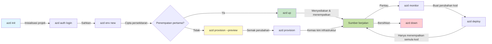
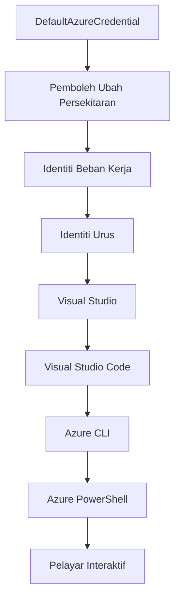

# AZD Asas - Memahami Azure Developer CLI

# AZD Asas - Konsep Teras dan Asas

**Navigasi Bab:**
- **📚 Laman Utama Kursus**: [AZD Untuk Pemula](../../README.md)
- **📖 Bab Semasa**: Bab 1 - Asas & Mula Dengan Cepat
- **⬅️ Sebelumnya**: [Gambaran Kursus](../../README.md#-chapter-1-foundation--quick-start)
- **➡️ Seterusnya**: [Pemasangan & Persediaan](installation.md)
- **🚀 Bab Seterusnya**: [Bab 2: Pembangunan AI-Pertama](../chapter-02-ai-development/microsoft-foundry-integration.md)

## Pengenalan

Pelajaran ini memperkenalkan anda kepada Azure Developer CLI (azd), alat baris arahan yang kuat yang mempercepat perjalanan anda dari pembangunan tempatan ke penyebaran Azure. Anda akan mempelajari konsep asas, ciri teras, dan memahami bagaimana azd mempermudah penyebaran aplikasi asli awan.

## Matlamat Pembelajaran

Pada akhir pelajaran ini, anda akan:
- Memahami apa itu Azure Developer CLI dan tujuan utamanya
- Mempelajari konsep teras templat, persekitaran, dan perkhidmatan
- Meneroka ciri utama termasuk pembangunan berasaskan templat dan Infrastruktur sebagai Kod
- Memahami struktur projek azd dan aliran kerja
- Bersedia memasang dan mengkonfigurasi azd untuk persekitaran pembangunan anda

## Hasil Pembelajaran

Selepas menamatkan pelajaran ini, anda akan dapat:
- Menjelaskan peranan azd dalam aliran kerja pembangunan awan moden
- Mengenal pasti komponen struktur projek azd
- Menghuraikan bagaimana templat, persekitaran, dan perkhidmatan berfungsi bersama
- Memahami manfaat Infrastruktur sebagai Kod dengan azd
- Mengenal pasti perintah azd yang berbeza dan tujuannya

## Apa itu Azure Developer CLI (azd)?

Azure Developer CLI (azd) ialah alat baris arahan yang direka untuk mempercepat perjalanan anda dari pembangunan tempatan ke penyebaran Azure. Ia mempermudah proses membina, menyebar, dan mengurus aplikasi asli awan di Azure.

### Apa Yang Boleh Anda Sebarkan dengan azd?

azd menyokong pelbagai jenis beban kerja—dan senarainya terus berkembang. Hari ini, anda boleh menggunakan azd untuk menyebarkan:

| Jenis Beban Kerja | Contoh | Aliran Kerja Sama? |
|-------------------|--------|--------------------|
| **Aplikasi tradisional** | Aplikasi web, REST API, laman statik | ✅ `azd up` |
| **Perkhidmatan dan mikroperkhidmatan** | Container Apps, Function Apps, backend multi-perkhidmatan | ✅ `azd up` |
| **Aplikasi berkuasa AI** | Aplikasi chat dengan Model Microsoft Foundry, solusi RAG dengan AI Search | ✅ `azd up` |
| **Ejen Pintar** | Ejen hos Foundry, pengorchestratan multi-ejen | ✅ `azd up` |

Intipati utama ialah **kitar hayat azd tetap sama tidak kira apa yang anda sebarkan**. Anda memulakan projek, menyiapkan infrastruktur, menyebar kod anda, memantau aplikasi, dan membersihkan—sama ada ia laman web mudah atau ejen AI canggih.

Kesinambungan ini adalah berdasarkan reka bentuk. azd menganggap keupayaan AI sebagai satu lagi jenis perkhidmatan yang boleh digunakan aplikasi anda, bukan sesuatu yang berbeza secara asas. Titik chat yang disokong oleh Model Microsoft Foundry, dari perspektif azd, hanyalah satu lagi perkhidmatan untuk dikonfigurasi dan disebar.

### 🎯 Kenapa Guna AZD? Perbandingan Dunia Sebenar

Mari kita bandingkan penyebaran aplikasi web mudah dengan pangkalan data:

#### ❌ TANPA AZD: Penyebaran Azure Manual (30+ minit)

```bash
# Langkah 1: Cipta kumpulan sumber
az group create --name myapp-rg --location eastus

# Langkah 2: Cipta Pelan Perkhidmatan Aplikasi
az appservice plan create --name myapp-plan \
  --resource-group myapp-rg \
  --sku B1 --is-linux

# Langkah 3: Cipta Aplikasi Web
az webapp create --name myapp-web-unique123 \
  --resource-group myapp-rg \
  --plan myapp-plan \
  --runtime "NODE:18-lts"

# Langkah 4: Cipta akaun Cosmos DB (10-15 minit)
az cosmosdb create --name myapp-cosmos-unique123 \
  --resource-group myapp-rg \
  --kind MongoDB

# Langkah 5: Cipta pangkalan data
az cosmosdb mongodb database create \
  --account-name myapp-cosmos-unique123 \
  --resource-group myapp-rg \
  --name tododb

# Langkah 6: Cipta koleksi
az cosmosdb mongodb collection create \
  --account-name myapp-cosmos-unique123 \
  --resource-group myapp-rg \
  --database-name tododb \
  --name todos

# Langkah 7: Dapatkan rentetan sambungan
CONN_STR=$(az cosmosdb keys list \
  --name myapp-cosmos-unique123 \
  --resource-group myapp-rg \
  --type connection-strings \
  --query "connectionStrings[0].connectionString" -o tsv)

# Langkah 8: Konfigurasikan tetapan aplikasi
az webapp config appsettings set \
  --name myapp-web-unique123 \
  --resource-group myapp-rg \
  --settings MONGODB_URI="$CONN_STR"

# Langkah 9: Aktifkan pencatatan
az webapp log config --name myapp-web-unique123 \
  --resource-group myapp-rg \
  --application-logging filesystem \
  --detailed-error-messages true

# Langkah 10: Tetapkan Application Insights
az monitor app-insights component create \
  --app myapp-insights \
  --location eastus \
  --resource-group myapp-rg

# Langkah 11: Pautkan App Insights ke Aplikasi Web
INSTRUMENTATION_KEY=$(az monitor app-insights component show \
  --app myapp-insights \
  --resource-group myapp-rg \
  --query "instrumentationKey" -o tsv)

az webapp config appsettings set \
  --name myapp-web-unique123 \
  --resource-group myapp-rg \
  --settings APPINSIGHTS_INSTRUMENTATIONKEY="$INSTRUMENTATION_KEY"

# Langkah 12: Bina aplikasi secara tempatan
npm install
npm run build

# Langkah 13: Cipta pakej penyebaran
zip -r app.zip . -x "*.git*" "node_modules/*"

# Langkah 14: Sebarkan aplikasi
az webapp deployment source config-zip \
  --resource-group myapp-rg \
  --name myapp-web-unique123 \
  --src app.zip

# Langkah 15: Tunggu dan berdoa ia berfungsi 🙏
# (Tiada pengesahan automatik, ujian manual diperlukan)
```

**Masalah:**
- ❌ 15+ arahan yang perlu diingat dan dilaksanakan mengikut urutan
- ❌ 30-45 minit kerja manual
- ❌ Mudah membuat kesilapan (taip salah, parameter salah)
- ❌ String sambungan terdedah dalam sejarah terminal
- ❌ Tiada rollback automatik jika berlaku kegagalan
- ❌ Sukar untuk digandakan untuk ahli pasukan
- ❌ Berbeza setiap masa (tidak boleh dihasilkan semula)

#### ✅ DENGAN AZD: Penyebaran Automatik (5 arahan, 10-15 minit)

```bash
# Langkah 1: Mulakan dari templat
azd init --template todo-nodejs-mongo

# Langkah 2: Sahkan
azd auth login

# Langkah 3: Buat persekitaran
azd env new dev

# Langkah 4: Pratonton perubahan (pilihan tetapi disyorkan)
azd provision --preview

# Langkah 5: Deploy semuanya
azd up

# ✨ Selesai! Semua telah dipasang, dikonfigurasikan, dan dipantau
```

**Manfaat:**
- ✅ **5 arahan** berbanding 15+ langkah manual
- ✅ **10-15 minit** masa keseluruhan (kebanyakan menunggu Azure)
- ✅ **Tiada ralat** - automatik dan diuji
- ✅ **Rahsia diurus dengan selamat** melalui Key Vault
- ✅ **Rollback automatik** jika berlaku kegagalan
- ✅ **Boleh dihasilkan semula sepenuhnya** - hasil sama setiap masa
- ✅ **Sedia untuk pasukan** - sesiapa boleh menyebar dengan arahan sama
- ✅ **Infrastruktur sebagai Kod** - templat Bicep dikawal versi
- ✅ **Pemantauan terbina dalam** - Application Insights dikonfigurasi automatik

### 📊 Pengurangan Masa & Ralat

| Metik | Penyebaran Manual | Penyebaran AZD | Penambahbaikan |
|:------|:------------------|:--------------|:--------------|
| **Arahan** | 15+ | 5 | 67% kurang |
| **Masa** | 30-45 min | 10-15 min | 60% lebih pantas |
| **Kadar Ralat** | ~40% | <5% | 88% pengurangan |
| **Konsistensi** | Rendah (manual) | 100% (automatik) | Sempurna |
| **Pengambilan Pasukan** | 2-4 jam | 30 minit | 75% lebih pantas |
| **Masa Rollback** | 30+ min (manual) | 2 min (automatik) | 93% lebih pantas |

## Konsep Teras

### Templat  
Templat adalah asas azd. Ia mengandungi:  
- **Kod aplikasi** - Kod sumber dan kebergantungan anda  
- **Definisi infrastruktur** - Sumber Azure yang ditakrifkan dalam Bicep atau Terraform  
- **Fail konfigurasi** - Tetapan dan pembolehubah persekitaran  
- **Skrip penyebaran** - Aliran kerja penyebaran automatik  

### Persekitaran  
Persekitaran mewakili sasaran penyebaran yang berbeza:  
- **Pembangunan** - Untuk ujian dan pembangunan  
- **Staging** - Persekitaran pra-produksi  
- **Produksi** - Persekitaran produksi langsung  

Setiap persekitaran mengekalkan:  
- Kumpulan sumber Azure sendiri  
- Tetapan konfigurasi  
- Keadaan penyebaran  

### Perkhidmatan  
Perkhidmatan adalah blok binaan aplikasi anda:  
- **Frontend** - Aplikasi web, SPA  
- **Backend** - API, mikroperkhidmatan  
- **Pangkalan data** - Penyelesaian penyimpanan data  
- **Penyimpanan** - Penyimpanan fail dan blob  

## Ciri Utama

### 1. Pembangunan Berasaskan Templat  
```bash
# Semak imbas templat yang tersedia
azd template list

# Mula dari templat
azd init --template <template-name>
```
  
### 2. Infrastruktur sebagai Kod  
- **Bicep** - bahasa domain khusus Azure  
- **Terraform** - alat infrastruktur pelbagai awan  
- **Templat ARM** - templat Azure Resource Manager  

### 3. Aliran Kerja Terpadu  
```bash
# Aliran kerja penyebaran lengkap
azd up            # Penyediaan + Penyebaran ini adalah tanpa sentuhan untuk tetapan kali pertama

# 🧪 BARU: Pratonton perubahan infrastruktur sebelum penyebaran (SELAMAT)
azd provision --preview    # Mensimulasikan penyebaran infrastruktur tanpa membuat perubahan

azd provision     # Cipta sumber Azure jika anda mengemas kini infrastruktur gunakan ini
azd deploy        # Sebarkan kod aplikasi atau sebarkan semula kod aplikasi setelah kemas kini
azd down          # Bersihkan sumber
```
  
#### 🛡️ Perancangan Infrastruktur Selamat dengan Pratonton  
Perintah `azd provision --preview` ialah perubahan permainan untuk penyebaran selamat:  
- **Analisis dry-run** - Menunjukkan apa yang akan dibuat, diubah, atau dipadam  
- **Tiada risiko** - Tiada perubahan sebenar dibuat pada persekitaran Azure anda  
- **Kerjasama pasukan** - Kongsi keputusan pratonton sebelum penyebaran  
- **Anggaran kos** - Fahami kos sumber sebelum komitmen  

```bash
# Templat pratonton contoh
azd provision --preview           # Lihat apa yang akan berubah
# Semak output, bincang dengan pasukan
azd provision                     # Terapkan perubahan dengan yakin
```
  
### 📊 Visual: Aliran Kerja Pembangunan AZD  


**Penjelasan Aliran Kerja:**  
1. **Init** - Mulakan dengan templat atau projek baru  
2. **Auth** - Sahkan dengan Azure  
3. **Environment** - Cipta persekitaran penyebaran yang terasing  
4. **Preview** - 🆕 Sentiasa pratonton perubahan infrastruktur dahulu (amalan selamat)  
5. **Provision** - Cipta/kemas kini sumber Azure  
6. **Deploy** - Tolak kod aplikasi anda  
7. **Monitor** - Perhatikan prestasi aplikasi  
8. **Iterate** - Buat perubahan dan sebar semula kod  
9. **Cleanup** - Buang sumber apabila selesai  

### 4. Pengurusan Persekitaran  
```bash
# Cipta dan urus persekitaran
azd env new <environment-name>
azd env select <environment-name>
azd env list
```
  
### 5. Sambungan dan Perintah AI  

azd menggunakan sistem sambungan untuk menambah keupayaan melebihi CLI teras. Ini amat berguna untuk beban kerja AI:  

```bash
# Senaraikan sambungan yang tersedia
azd extension list

# Pasang sambungan agen Foundry
azd extension install azure.ai.agents

# Mulakan projek agen AI dari manifest
azd ai agent init -m agent-manifest.yaml

# Mulakan pelayan MCP untuk pembangunan dibantu AI (Alpha)
azd mcp start
```
  
> Sambungan diterangkan dengan terperinci dalam [Bab 2: Pembangunan AI-Pertama](../chapter-02-ai-development/agents.md) dan rujukan [Perintah AZD AI CLI](../chapter-08-production/production-ai-practices.md#azd-ai-cli-commands-and-extensions).

## 📁 Struktur Projek

Struktur projek azd tipikal:  
```
my-app/
├── .azd/                    # azd configuration
│   └── config.json
├── .azure/                  # Azure deployment artifacts
├── .devcontainer/          # Development container config
├── .github/workflows/      # GitHub Actions
├── .vscode/               # VS Code settings
├── infra/                 # Infrastructure code
│   ├── main.bicep        # Main infrastructure template
│   ├── main.parameters.json
│   └── modules/          # Reusable modules
├── src/                  # Application source code
│   ├── api/             # Backend services
│   └── web/             # Frontend application
├── azure.yaml           # azd project configuration
└── README.md
```
  
## 🔧 Fail Konfigurasi

### azure.yaml  
Fail konfigurasi projek utama:  
```yaml
name: my-awesome-app
metadata:
  template: my-template@1.0.0

services:
  web:
    project: ./src/web
    language: js
    host: appservice
  api:
    project: ./src/api
    language: js
    host: appservice

hooks:
  preprovision:
    shell: pwsh
    run: echo "Preparing to provision..."
```
  
### .azure/config.json  
Konfigurasi khusus persekitaran:  
```json
{
  "version": 1,
  "defaultEnvironment": "dev",
  "environments": {
    "dev": {
      "subscriptionId": "your-subscription-id",
      "location": "eastus"
    }
  }
}
```
  
## 🎪 Aliran Kerja Biasa dengan Latihan Praktikal  

> **💡 Petua Pembelajaran:** Ikuti latihan ini mengikut urutan untuk membina kemahiran AZD anda secara progresif.

### 🎯 Latihan 1: Mulakan Projek Pertama Anda

**Matlamat:** Cipta projek AZD dan terokai strukturnya  

**Langkah:**  
```bash
# Gunakan templat yang terbukti
azd init --template todo-nodejs-mongo

# Terokai fail yang telah dijana
ls -la  # Lihat semua fail termasuk yang tersembunyi

# Fail utama yang dicipta:
# - azure.yaml (konfigurasi utama)
# - infra/ (kod infrastruktur)
# - src/ (kod aplikasi)
```
  
**✅ Berjaya:** Anda mempunyai direktori azure.yaml, infra/, dan src/  

---

### 🎯 Latihan 2: Sebar ke Azure

**Matlamat:** Lengkapkan penyebaran hujung-ke-hujung  

**Langkah:**  
```bash
# 1. Sahkan
az login && azd auth login

# 2. Cipta persekitaran
azd env new dev
azd env set AZURE_LOCATION eastus

# 3. Pratonton perubahan (DANALISAAKAN)
azd provision --preview

# 4. Sebarkan segala-galanya
azd up

# 5. Sahkan penyebaran
azd show    # Lihat URL aplikasi anda
```
  
**Jangka Masa Dijangka:** 10-15 minit  
**✅ Berjaya:** URL aplikasi dibuka dalam pelayar  

---

### 🎯 Latihan 3: Pelbagai Persekitaran

**Matlamat:** Sebar ke dev dan staging  

**Langkah:**  
```bash
# Sudah ada dev, buat staging
azd env new staging
azd env set AZURE_LOCATION westus2
azd up

# Tukar antara mereka
azd env list
azd env select dev
```
  
**✅ Berjaya:** Dua kumpulan sumber berasingan dalam Azure Portal  

---

### 🛡️ Bersih Bersih: `azd down --force --purge`

Apabila anda perlu reset sepenuhnya:  

```bash
azd down --force --purge
```
  
**Apa yang dilakukan:**  
- `--force`: Tiada arahan pengesahan  
- `--purge`: Memadam semua keadaan tempatan dan sumber Azure  

**Gunakan apabila:**  
- Penyebaran gagal di tengah jalan  
- Bertukar projek  
- Perlukan permulaan baru  

---

## 🎪 Rujukan Aliran Kerja Asal

### Memulakan Projek Baru  
```bash
# Kaedah 1: Gunakan templat yang sedia ada
azd init --template todo-nodejs-mongo

# Kaedah 2: Mula dari awal
azd init

# Kaedah 3: Gunakan direktori semasa
azd init .
```
  
### Kitaran Pembangunan  
```bash
# Sediakan persekitaran pembangunan
azd auth login
azd env new dev
azd env select dev

# Sebarkan semuanya
azd up

# Buat perubahan dan sebarkan semula
azd deploy

# Bersihkan apabila selesai
azd down --force --purge # arahan dalam Azure Developer CLI adalah **reset keras** untuk persekitaran anda—terutamanya berguna apabila anda menyelesaikan masalah penempatan yang gagal, membersihkan sumber yang yatim, atau menyediakan untuk penyebaran semula yang baru.
```
  
## Memahami `azd down --force --purge`  
Perintah `azd down --force --purge` adalah cara yang kuat untuk membongkar sepenuhnya persekitaran azd anda dan semua sumber yang berkaitan. Berikut pecahan apa yang dilakukan setiap flag:  
```
--force
```
  
- Mengabaikan arahan pengesahan.  
- Berguna untuk automasi atau skrip di mana input manual tidak boleh dilakukan.  
- Memastikan pembongkaran berjalan tanpa gangguan, walaupun CLI mengesan ketidakkonsistenan.  

```
--purge
```
  
Memadam **semua metadata yang berkaitan**, termasuk:  
Keadaan persekitaran  
Folder `.azure` tempatan  
Maklumat penyebaran cache  
Mengelakkan azd daripada "mengingati" penyebaran sebelumnya, yang boleh menyebabkan isu seperti kumpulan sumber tidak sepadan atau rujukan registri lapuk.  

### Kenapa guna kedua-duanya?  
Apabila anda tersekat dengan `azd up` kerana keadaan yang masih ada atau penyebaran separa, gabungan ini memastikan **start bersih**.

Ia amat berguna selepas pemadaman sumber manual dalam portal Azure atau apabila bertukar templat, persekitaran, atau konvensyen penamaan kumpulan sumber.  

### Mengurus Pelbagai Persekitaran  
```bash
# Cipta persekitaran staging
azd env new staging
azd env select staging
azd up

# Tukar kembali ke dev
azd env select dev

# Bandingkan persekitaran
azd env list
```
  
## 🔐 Pengesahan dan Kredensial

Memahami pengesahan adalah penting untuk kejayaan penyebaran azd. Azure menggunakan pelbagai kaedah pengesahan, dan azd memanfaatkan rantai kredensial yang sama digunakan oleh alat Azure lain.

### Pengesahan Azure CLI (`az login`)

Sebelum menggunakan azd, anda perlu mengesahkan dengan Azure. Kaedah paling biasa ialah menggunakan Azure CLI:  

```bash
# Log masuk interaktif (buka pelayar)
az login

# Log masuk dengan penyewa tertentu
az login --tenant <tenant-id>

# Log masuk dengan prinsip perkhidmatan
az login --service-principal -u <app-id> -p <password> --tenant <tenant-id>

# Semak status log masuk semasa
az account show

# Senaraikan langganan yang tersedia
az account list --output table

# Tetapkan langganan lalai
az account set --subscription <subscription-id>
```
  
### Aliran Pengesahan  
1. **Log masuk Interaktif**: Membuka pelayar lalai anda untuk pengesahan  
2. **Aliran Kod Peranti**: Untuk persekitaran tanpa akses pelayar  
3. **Principle Perkhidmatan**: Untuk automasi dan senario CI/CD  
4. **Identiti Terurus**: Untuk aplikasi yang dihoskan Azure  

### Rantai DefaultAzureCredential

`DefaultAzureCredential` ialah jenis kredensial yang menyediakan pengalaman pengesahan mudah dengan secara automatik mencuba pelbagai sumber kredensial mengikut urutan tertentu:

#### Urutan Rantai Kredensial  

#### 1. Pembolehubah Persekitaran  
```bash
# Tetapkan pembolehubah persekitaran untuk prinsipal perkhidmatan
export AZURE_CLIENT_ID="<app-id>"
export AZURE_CLIENT_SECRET="<password>"
export AZURE_TENANT_ID="<tenant-id>"
```
  
#### 2. Identiti Beban Kerja (Kubernetes/GitHub Actions)  
Digunakan secara automatik dalam:  
- Azure Kubernetes Service (AKS) dengan Workload Identity  
- GitHub Actions dengan federasi OIDC  
- Senario identiti bersekutu lain  

#### 3. Identiti Terurus  
Untuk sumber Azure seperti:  
- Mesin Maya  
- App Service  
- Azure Functions  
- Container Instances  

```bash
# Semak jika berjalan pada sumber Azure dengan identiti terurus
az account show --query "user.type" --output tsv
# Mengembalikan: "servicePrincipal" jika menggunakan identiti terurus
```
  
#### 4. Integrasi Alat Pembangun  
- **Visual Studio**: Secara automatik menggunakan akaun yang masuk  
- **VS Code**: Menggunakan kredensial sambungan Azure Account  
- **Azure CLI**: Menggunakan kredensial `az login` (paling biasa untuk pembangunan tempatan)  

### Persediaan Pengesahan AZD  

```bash
# Kaedah 1: Gunakan Azure CLI (Disyorkan untuk pembangunan)
az login
azd auth login  # Menggunakan kelayakan Azure CLI yang sedia ada

# Kaedah 2: Pengesahan azd terus
azd auth login --use-device-code  # Untuk persekitaran tanpa kepala

# Kaedah 3: Semak status pengesahan
azd auth login --check-status

# Kaedah 4: Log keluar dan sahkan semula
azd auth logout
azd auth login
```
  
### Amalan Terbaik Pengesahan  

#### Untuk Pembangunan Tempatan  
```bash
# 1. Log masuk dengan Azure CLI
az login

# 2. Sahkan langganan yang betul
az account show
az account set --subscription "Your Subscription Name"

# 3. Gunakan azd dengan kelayakan sedia ada
azd auth login
```
  
#### Untuk Saluran CI/CD  
```yaml
# GitHub Actions example
- name: Azure Login
  uses: azure/login@v1
  with:
    creds: ${{ secrets.AZURE_CREDENTIALS }}

- name: Deploy with azd
  run: |
    azd auth login --client-id ${{ secrets.AZURE_CLIENT_ID }} \
                    --client-secret ${{ secrets.AZURE_CLIENT_SECRET }} \
                    --tenant-id ${{ secrets.AZURE_TENANT_ID }}
    azd up --no-prompt
```
  
#### Untuk Persekitaran Produksi  
- Gunakan **Identiti Terurus** semasa menjalankan pada sumber Azure  
- Gunakan **Principle Perkhidmatan** untuk senario automasi  
- Elakkan menyimpan kredensial dalam kod atau fail konfigurasi  
- Gunakan **Azure Key Vault** untuk konfigurasi sensitif  

### Isu dan Penyelesaian Pengesahan Biasa  

#### Isu: "Langganan tidak dijumpai"  
```bash
# Penyelesaian: Tetapkan langganan lalai
az account list --output table
az account set --subscription "<subscription-id>"
azd env set AZURE_SUBSCRIPTION_ID "<subscription-id>"
```
  
#### Isu: "Kebenaran tidak mencukupi"  
```bash
# Penyelesaian: Semak dan tetapkan peranan yang diperlukan
az role assignment list --assignee $(az account show --query user.name --output tsv)

# Peranan yang diperlukan biasa:
# - Penyumbang (untuk pengurusan sumber)
# - Pentadbir Akses Pengguna (untuk tugasan peranan)
```
  
#### Isu: "Token telah tamat tempoh"  
```bash
# Penyelesaian: Sahkan semula
az logout
az login
azd auth logout
azd auth login
```
  
### Pengesahan dalam Senario Berbeza  

#### Pembangunan Tempatan  
```bash
# Akaun pembangunan peribadi
az login
azd auth login
```
  
#### Pembangunan Pasukan  
```bash
# Gunakan penyewa tertentu untuk organisasi
az login --tenant contoso.onmicrosoft.com
azd auth login
```
  
#### Senario Multi-penyewa  
```bash
# Tukar antara penyewa
az login --tenant tenant1.onmicrosoft.com
# Hantar ke penyewa 1
azd up

az login --tenant tenant2.onmicrosoft.com  
# Hantar ke penyewa 2
azd up
```
  
### Pertimbangan Keselamatan
1. **Penyimpanan Kredensial**: Jangan sekali-kali menyimpan kredensial dalam kod sumber  
2. **Had Skop**: Gunakan prinsip hak keistimewaan paling minimum untuk prinsipal perkhidmatan  
3. **Putaran Token**: Putar rahsia prinsipal perkhidmatan secara berkala  
4. **Jejak Audit**: Pantau aktiviti pengesahan dan penyebaran  
5. **Keselamatan Rangkaian**: Gunakan titik akhir peribadi apabila boleh  

### Penyelesaian Masalah Pengesahan

```bash
# Selesaikan masalah pengesahan
azd auth login --check-status
az account show
az account get-access-token

# Arahan diagnostik biasa
whoami                          # Konteks pengguna semasa
az ad signed-in-user show      # Butiran pengguna Azure AD
az group list                  # Uji akses sumber
```

## Memahami `azd down --force --purge`

### Penemuan
```bash
azd template list              # Layari templat
azd template show <template>   # Butiran templat
azd init --help               # Pilihan inisialisasi
```

### Pengurusan Projek
```bash
azd show                     # Gambaran keseluruhan projek
azd env show                 # Persekitaran semasa
azd config list             # Tetapan konfigurasi
```

### Pemantauan
```bash
azd monitor                  # Buka pemantauan portal Azure
azd monitor --logs           # Lihat log aplikasi
azd monitor --live           # Lihat metrik langsung
azd pipeline config          # Tetapkan CI/CD
```

## Amalan Terbaik

### 1. Gunakan Nama Bermakna
```bash
# Baik
azd env new production-east
azd init --template web-app-secure

# Elakkan
azd env new env1
azd init --template template1
```

### 2. Manfaatkan Templat
- Mulakan dengan templat sedia ada  
- Sesuaikan mengikut keperluan anda  
- Cipta templat boleh guna semula untuk organisasi anda  

### 3. Pengasingan Persekitaran
- Gunakan persekitaran berasingan untuk dev/staging/prod  
- Jangan sekali-kali deploy terus ke pengeluaran dari mesin tempatan  
- Gunakan pipeline CI/CD untuk penyebaran pengeluaran  

### 4. Pengurusan Konfigurasi
- Gunakan pembolehubah persekitaran untuk data sensitif  
- Simpan konfigurasi dalam kawalan versi  
- Dokumenkan tetapan khusus persekitaran  

## Progres Pembelajaran

### Pemula (Minggu 1-2)
1. Pasang azd dan sahkan identiti  
2. Sebarkan templat mudah  
3. Fahami struktur projek  
4. Belajar arahan asas (up, down, deploy)  

### Pertengahan (Minggu 3-4)
1. Sesuaikan templat  
2. Urus pelbagai persekitaran  
3. Fahami kod infrastruktur  
4. Sediakan pipeline CI/CD  

### Lanjutan (Minggu 5+)
1. Cipta templat khusus  
2. Corak infrastruktur lanjutan  
3. Penyebaran pelbagai rantau  
4. Konfigurasi tahap perusahaan  

## Langkah Seterusnya

**📖 Teruskan Pembelajaran Bab 1:**  
- [Pemasangan & Penetapan](installation.md) - Pasang dan konfigurasikan azd  
- [Projek Pertama Anda](first-project.md) - Lengkapkan tutorial amali  
- [Panduan Konfigurasi](configuration.md) - Pilihan konfigurasi lanjutan  

**🎯 Sedia untuk Bab Seterusnya?**  
- [Bab 2: Pembangunan AI-Pertama](../chapter-02-ai-development/microsoft-foundry-integration.md) - Mula bina aplikasi AI  

## Sumber Tambahan

- [Gambaran Keseluruhan Azure Developer CLI](https://learn.microsoft.com/en-us/azure/developer/azure-developer-cli/)  
- [Galeri Templat](https://azure.github.io/awesome-azd/)  
- [Contoh Komuniti](https://github.com/Azure-Samples)  

---

## 🙋 Soalan Lazim

### Soalan Umum

**S: Apa beza AZD dan Azure CLI?**

J: Azure CLI (`az`) untuk mengurus sumber Azure individu. AZD (`azd`) untuk menguruskan aplikasi keseluruhan:  

```bash
# Azure CLI - Pengurusan sumber tahap rendah
az webapp create --name myapp --resource-group rg
az sql server create --name myserver --resource-group rg
# ...banyak lagi arahan diperlukan

# AZD - Pengurusan tahap aplikasi
azd up  # Mengedar seluruh aplikasi dengan semua sumber daya
```
  
**Fikirkan begini:**  
- `az` = Operasi pada kepingan Lego individu  
- `azd` = Bekerja dengan set Lego lengkap  

---

**S: Perlukah saya tahu Bicep atau Terraform untuk guna AZD?**

J: Tidak! Mula dengan templat:  
```bash
# Gunakan templat sedia ada - tiada pengetahuan IaC diperlukan
azd init --template todo-nodejs-mongo
azd up
```
  
Anda boleh belajar Bicep kemudian untuk sesuaikan infrastruktur. Templat menyediakan contoh kerja untuk dipelajari.  

---

**S: Berapa kos jalankan templat AZD?**

J: Kos berbeza mengikut templat. Kebanyakan templat pembangunan berharga $50-150/bulan:  

```bash
# Pratonton kos sebelum penghantaran
azd provision --preview

# Sentiasa bersihkan apabila tidak digunakan
azd down --force --purge  # Mengeluarkan semua sumber
```
  
**Petua profesional:** Gunakan tahap percuma jika ada:  
- App Service: tahap F1 (Percuma)  
- Model Microsoft Foundry: Azure OpenAI 50,000 token/bulan percuma  
- Cosmos DB: tahap RU/s 1000 percuma  

---

**S: Bolehkah saya gunakan AZD dengan sumber Azure sedia ada?**

J: Boleh, tapi lebih mudah mula dari awal. AZD berfungsi terbaik apabila mengurus kitar hayat penuh. Untuk sumber sedia ada:  

```bash
# Pilihan 1: Import sumber yang sedia ada (lanjutan)
azd init
# Kemudian ubah infra/ untuk merujuk sumber yang sedia ada

# Pilihan 2: Mula dari awal (disyorkan)
azd init --template matching-your-stack
azd up  # Membuat persekitaran baru
```
  
---

**S: Bagaimana nak kongsi projek dengan rakan sepasukan?**

J: Komit projek AZD ke Git (tapi TIDAK folder .azure):  

```bash
# Sudah dalam .gitignore secara lalai
.azure/        # Mengandungi rahsia dan data persekitaran
*.env          # Pembolehubah persekitaran

# Ahli pasukan kemudian:
git clone <your-repo>
azd auth login
azd env new <their-name>-dev
azd up
```
  
Semua orang akan dapat infrastruktur identik daripada templat yang sama.  

---

### Soalan Menyelesaikan Masalah

**S: "azd up" gagal separuh jalan. Apa yang perlu saya buat?**

J: Semak ralat, betulkan, kemudian cuba semula:  

```bash
# Lihat log terperinci
azd show

# Pembetulan biasa:

# 1. Jika kuota melebihi:
azd env set AZURE_LOCATION "westus2"  # Cuba wilayah berbeza

# 2. Jika konflik nama sumber:
azd down --force --purge  # Mula semula
azd up  # Cuba semula

# 3. Jika kebenaran tamat:
az login
azd auth login
azd up
```
  
**Isu paling biasa:** Pilih langganan Azure salah  
```bash
az account list --output table
az account set --subscription "<correct-subscription>"
```
  
---

**S: Bagaimana nak deploy hanya perubahan kod tanpa reprovis?**

J: Gunakan `azd deploy` bukannya `azd up`:  

```bash
azd up          # Kali pertama: penyediaan + penerapan (perlahan)

# Buat perubahan kod...

azd deploy      # Kali berikutnya: hanya penerapan (pantas)
```
  
Perbandingan kelajuan:  
- `azd up`: 10-15 minit (menyediakan infrastruktur)  
- `azd deploy`: 2-5 minit (kod sahaja)  

---

**S: Bolehkah saya sesuaikan templat infrastruktur?**

J: Boleh! Sunting fail Bicep dalam `infra/`:  

```bash
# Selepas azd init
cd infra/
code main.bicep  # Sunting dalam VS Code

# Pratonton perubahan
azd provision --preview

# Terapkan perubahan
azd provision
```
  
**Petua:** Mulakan kecil – tukar SKU dahulu:  
```bicep
// infra/main.bicep
sku: {
  name: 'B1'  // Change to 'P1V2' for production
}
```
  
---

**S: Bagaimana nak buang semua yang AZD cipta?**

J: Satu arahan boleh keluarkan semua sumber:  

```bash
azd down --force --purge

# Ini memadam:
# - Semua sumber Azure
# - Kumpulan sumber
# - Keadaan persekitaran tempatan
# - Data pelaksanaan yang disimpan dalam cache
```
  
**Sentiasa jalankan ini bila:**  
- Tamat menguji templat  
- Tukar ke projek lain  
- Nak mula baru  

**Penjimatan kos:** Padam sumber tidak digunakan = tiada caj  

---

**S: Apa jika saya terpadam sumber secara tidak sengaja dalam Azure Portal?**

J: Status AZD boleh tidak sinkron. Gunakan pendekatan papan putih:  

```bash
# 1. Buang keadaan tempatan
azd down --force --purge

# 2. Mulakan semula
azd up

# Alternatif: Biarkan AZD mengesan dan membaiki
azd provision  # Akan mencipta sumber yang hilang
```
  
---

### Soalan Lanjutan

**S: Bolehkah saya guna AZD dalam pipeline CI/CD?**

J: Boleh! Contoh GitHub Actions:  

```yaml
# .github/workflows/deploy.yml
name: Deploy with AZD

on:
  push:
    branches: [main]

jobs:
  deploy:
    runs-on: ubuntu-latest
    steps:
      - uses: actions/checkout@v2
      
      - name: Install azd
        run: curl -fsSL https://aka.ms/install-azd.sh | bash
      
      - name: Azure Login
        run: |
          azd auth login \
            --client-id ${{ secrets.AZURE_CLIENT_ID }} \
            --client-secret ${{ secrets.AZURE_CLIENT_SECRET }} \
            --tenant-id ${{ secrets.AZURE_TENANT_ID }}
      
      - name: Deploy
        run: azd up --no-prompt
```
  
---

**S: Bagaimana saya urus rahsia dan data sensitif?**

J: AZD secara automatik integrasi dengan Azure Key Vault:  

```bash
# Rahsia disimpan di Key Vault, bukan dalam kod
azd env set DATABASE_PASSWORD "$(openssl rand -base64 32)"

# AZD secara automatik:
# 1. Membuat Key Vault
# 2. Menyimpan rahsia
# 3. Memberi akses aplikasi melalui Identiti Terurus
# 4. Menyuntik semasa masa jalanan
```
  
**Jangan sekali-kali komit:**  
- Folder `.azure/` (mengandungi data persekitaran)  
- Fail `.env` (rahsia tempatan)  
- Rentetan sambungan  

---

**S: Bolehkah saya deploy ke pelbagai rantau?**

J: Boleh, cipta persekitaran bagi setiap rantau:  

```bash
# Persekitaran Timur AS
azd env new prod-eastus
azd env set AZURE_LOCATION eastus
azd up

# Persekitaran Barat Eropah
azd env new prod-westeurope
azd env set AZURE_LOCATION westeurope
azd up

# Setiap persekitaran adalah bebas
azd env list
```
  
Untuk aplikasi pelbagai rantau sebenar, sesuaikan templat Bicep untuk deploy ke pelbagai rantau serentak.  

---

**S: Di mana saya boleh dapat bantuan jika tersekat?**

1. **Dokumentasi AZD:** https://learn.microsoft.com/azure/developer/azure-developer-cli/  
2. **Isu GitHub:** https://github.com/Azure/azure-dev/issues  
3. **Discord:** [Azure Discord](https://discord.gg/microsoft-azure) - saluran #azure-developer-cli  
4. **Stack Overflow:** Tag `azure-developer-cli`  
5. **Kursus Ini:** [Panduan Penyelesaian Masalah](../chapter-07-troubleshooting/common-issues.md)  

**Petua profesional:** Sebelum bertanya, jalankan:  
```bash
azd show       # Menunjukkan keadaan semasa
azd version    # Menunjukkan versi anda
```
  
Sertakan maklumat ini dalam soalan untuk bantuan lebih cepat.  

---

## 🎓 Apa Seterusnya?

Kini anda faham asas AZD. Pilih laluan anda:

### 🎯 Untuk Pemula:  
1. **Seterusnya:** [Pemasangan & Penetapan](installation.md) - Pasang AZD di mesin anda  
2. **Kemudian:** [Projek Pertama Anda](first-project.md) - Deploy aplikasi pertama anda  
3. **Latihan:** Lengkapkan ketiga-tiga latihan dalam pelajaran ini  

### 🚀 Untuk Pembangun AI:  
1. **Langkau ke:** [Bab 2: Pembangunan AI-Pertama](../chapter-02-ai-development/microsoft-foundry-integration.md)  
2. **Deploy:** Mula dengan `azd init --template get-started-with-ai-chat`  
3. **Belajar:** Bina sambil anda deploy  

### 🏗️ Untuk Pembangun Berpengalaman:  
1. **Semak:** [Panduan Konfigurasi](configuration.md) - Tetapan lanjutan  
2. **Terokai:** [Infrastruktur sebagai Kod](../chapter-04-infrastructure/provisioning.md) - Pendalaman Bicep  
3. **Bina:** Cipta templat khusus untuk set anda  

---

**Navigasi Bab:**  
- **📚 Halaman Utama Kursus**: [AZD Untuk Pemula](../../README.md)  
- **📖 Bab Semasa**: Bab 1 - Asas & Permulaan Pantas  
- **⬅️ Sebelumnya**: [Gambaran Keseluruhan Kursus](../../README.md#-chapter-1-foundation--quick-start)  
- **➡️ Seterusnya**: [Pemasangan & Penetapan](installation.md)  
- **🚀 Bab Seterusnya**: [Bab 2: Pembangunan AI-Pertama](../chapter-02-ai-development/microsoft-foundry-integration.md)

---

<!-- CO-OP TRANSLATOR DISCLAIMER START -->
**Penafian**:  
Dokumen ini telah diterjemahkan menggunakan perkhidmatan terjemahan AI [Co-op Translator](https://github.com/Azure/co-op-translator). Walaupun kami berusaha untuk ketepatan, sila maklum bahawa terjemahan automatik mungkin mengandungi kesilapan atau ketidaktepatan. Dokumen asal dalam bahasa asalnya harus dianggap sebagai sumber yang sahih. Untuk maklumat penting, terjemahan manusia profesional adalah disyorkan. Kami tidak bertanggungjawab atas sebarang salah faham atau salah tafsir yang timbul daripada penggunaan terjemahan ini.
<!-- CO-OP TRANSLATOR DISCLAIMER END -->