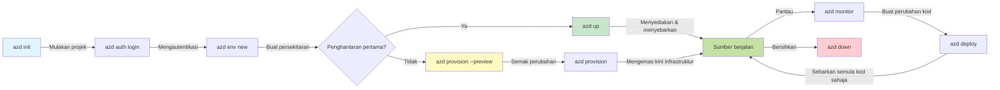
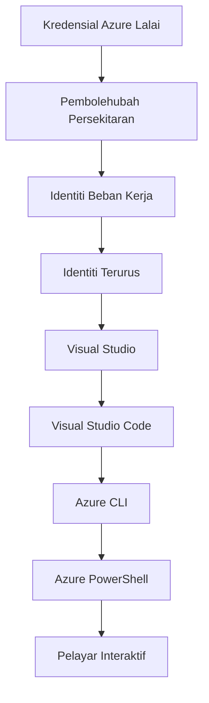

# AZD Asas - Memahami Azure Developer CLI

# AZD Asas - Konsep Teras dan Asas

**Navigasi Bab:**
- **📚 Laman Kursus**: [AZD For Beginners](../../README.md)
- **📖 Bab Semasa**: Bab 1 - Asas & Mula Pantas
- **⬅️ Sebelum**: [Course Overview](../../README.md#-chapter-1-foundation--quick-start)
- **➡️ Seterusnya**: [Installation & Setup](installation.md)
- **🚀 Bab Seterusnya**: [Chapter 2: AI-First Development](../chapter-02-ai-development/microsoft-foundry-integration.md)

## Pengenalan

Pelajaran ini memperkenalkan anda kepada Azure Developer CLI (azd), alat baris perintah yang kuat yang mempercepatkan perjalanan anda dari pembangunan tempatan ke penyebaran Azure. Anda akan mempelajari konsep asas, ciri teras, dan memahami bagaimana azd mempermudah penyebaran aplikasi cloud-native.

## Matlamat Pembelajaran

Pada akhir pelajaran ini, anda akan:
- Memahami apa itu Azure Developer CLI dan tujuan utamanya
- Mempelajari konsep teras templat, persekitaran, dan perkhidmatan
- Meneroka ciri utama termasuk pembangunan berpandukan templat dan Infrastruktur sebagai Kod
- Memahami struktur projek azd dan aliran kerjanya
- Bersedia untuk memasang dan mengkonfigurasi azd untuk persekitaran pembangunan anda

## Hasil Pembelajaran

Selepas menyelesaikan pelajaran ini, anda akan dapat:
- Menjelaskan peranan azd dalam aliran kerja pembangunan awan moden
- Mengenal pasti komponen struktur projek azd
- Menggambarkan bagaimana templat, persekitaran, dan perkhidmatan berfungsi bersama
- Memahami manfaat Infrastruktur sebagai Kod dengan azd
- Mengenal pasti arahan azd yang berbeza dan tujuan mereka

## Apakah Azure Developer CLI (azd)?

Azure Developer CLI (azd) adalah alat baris perintah yang direka untuk mempercepatkan perjalanan anda dari pembangunan tempatan ke penyebaran Azure. Ia mempermudah proses membina, menyebarkan, dan mengurus aplikasi cloud-native di Azure.

### 🎯 Mengapa Menggunakan AZD? Perbandingan Dunia Sebenar

Mari bandingkan penyebaran aplikasi web ringkas dengan pangkalan data:

#### ❌ TANPA AZD: Penyebaran Azure Manual (30+ minit)

```bash
# Langkah 1: Cipta kumpulan sumber
az group create --name myapp-rg --location eastus

# Langkah 2: Cipta Pelan App Service
az appservice plan create --name myapp-plan \
  --resource-group myapp-rg \
  --sku B1 --is-linux

# Langkah 3: Cipta Aplikasi Web
az webapp create --name myapp-web-unique123 \
  --resource-group myapp-rg \
  --plan myapp-plan \
  --runtime "NODE:18-lts"

# Langkah 4: Cipta akaun Cosmos DB (10-15 minit)
az cosmosdb create --name myapp-cosmos-unique123 \
  --resource-group myapp-rg \
  --kind MongoDB

# Langkah 5: Cipta pangkalan data
az cosmosdb mongodb database create \
  --account-name myapp-cosmos-unique123 \
  --resource-group myapp-rg \
  --name tododb

# Langkah 6: Cipta koleksi
az cosmosdb mongodb collection create \
  --account-name myapp-cosmos-unique123 \
  --resource-group myapp-rg \
  --database-name tododb \
  --name todos

# Langkah 7: Dapatkan rentetan sambungan
CONN_STR=$(az cosmosdb keys list \
  --name myapp-cosmos-unique123 \
  --resource-group myapp-rg \
  --type connection-strings \
  --query "connectionStrings[0].connectionString" -o tsv)

# Langkah 8: Konfigurasikan tetapan aplikasi
az webapp config appsettings set \
  --name myapp-web-unique123 \
  --resource-group myapp-rg \
  --settings MONGODB_URI="$CONN_STR"

# Langkah 9: Dayakan pencatatan
az webapp log config --name myapp-web-unique123 \
  --resource-group myapp-rg \
  --application-logging filesystem \
  --detailed-error-messages true

# Langkah 10: Sediakan Application Insights
az monitor app-insights component create \
  --app myapp-insights \
  --location eastus \
  --resource-group myapp-rg

# Langkah 11: Pautkan App Insights ke Aplikasi Web
INSTRUMENTATION_KEY=$(az monitor app-insights component show \
  --app myapp-insights \
  --resource-group myapp-rg \
  --query "instrumentationKey" -o tsv)

az webapp config appsettings set \
  --name myapp-web-unique123 \
  --resource-group myapp-rg \
  --settings APPINSIGHTS_INSTRUMENTATIONKEY="$INSTRUMENTATION_KEY"

# Langkah 12: Bina aplikasi secara tempatan
npm install
npm run build

# Langkah 13: Cipta pakej penyebaran
zip -r app.zip . -x "*.git*" "node_modules/*"

# Langkah 14: Sebarkan aplikasi
az webapp deployment source config-zip \
  --resource-group myapp-rg \
  --name myapp-web-unique123 \
  --src app.zip

# Langkah 15: Tunggu dan berdoa semoga ia berfungsi 🙏
# (Tiada pengesahan automatik, ujian manual diperlukan)
```

**Masalah:**
- ❌ 15+ arahan untuk diingati dan dilaksanakan mengikut urutan
- ❌ 30-45 minit kerja manual
- ❌ Mudah membuat kesilapan (typo, parameter salah)
- ❌ String sambungan terdedah dalam sejarah terminal
- ❌ Tiada pembalikan automatik jika sesuatu gagal
- ❌ Sukar ditiru oleh ahli pasukan
- ❌ Berbeza setiap kali (tidak boleh dihasilkan semula)

#### ✅ DENGAN AZD: Penyebaran Automatik (5 arahan, 10-15 minit)

```bash
# Langkah 1: Inisialisasi dari templat
azd init --template todo-nodejs-mongo

# Langkah 2: Sahkan
azd auth login

# Langkah 3: Cipta persekitaran
azd env new dev

# Langkah 4: Pratonton perubahan (pilihan tetapi disyorkan)
azd provision --preview

# Langkah 5: Sebarkan semuanya
azd up

# ✨ Selesai! Semuanya telah disebarkan, dikonfigurasi, dan dipantau
```

**Manfaat:**
- ✅ **5 arahan** vs. 15+ langkah manual
- ✅ **10-15 minit** jumlah masa (kebanyakannya menunggu Azure)
- ✅ **Tiada ralat** - automatik dan diuji
- ✅ **Rahasia diurus dengan selamat** via Key Vault
- ✅ **Pembalikan automatik** apabila berlaku kegagalan
- ✅ **Boleh dihasilkan semula sepenuhnya** - hasil sama setiap kali
- ✅ **Sedia untuk pasukan** - sesiapa boleh menyebarkan dengan arahan yang sama
- ✅ **Infrastruktur sebagai Kod** - templat Bicep dikawal versi
- ✅ **Pemantauan terbina dalam** - Application Insights dikonfigurasikan secara automatik

### 📊 Pengurangan Masa & Kadar Ralat

| Metrik | Penyebaran Manual | Penyebaran AZD | Peningkatan |
|:-------|:------------------|:---------------|:------------|
| **Arahan** | 15+ | 5 | 67% lebih sedikit |
| **Masa** | 30-45 min | 10-15 min | 60% lebih pantas |
| **Kadar Ralat** | ~40% | <5% | 88% pengurangan |
| **Konsistensi** | Rendah (manual) | 100% (automatik) | Sempurna |
| **Pengenalan Pasukan** | 2-4 jam | 30 minit | 75% lebih pantas |
| **Masa Pembalikan** | 30+ min (manual) | 2 min (automatik) | 93% lebih pantas |

## Konsep Teras

### Templat
Templat adalah asas azd. Mereka mengandungi:
- **Kod aplikasi** - Kod sumber dan kebergantungan anda
- **Definisi infrastruktur** - Sumber Azure yang ditakrifkan dalam Bicep atau Terraform
- **Fail konfigurasi** - Tetapan dan pembolehubah persekitaran
- **Skrip penyebaran** - Aliran kerja penyebaran automatik

### Persekitaran
Persekitaran mewakili sasaran penyebaran yang berbeza:
- **Pembangunan** - Untuk pengujian dan pembangunan
- **Staging** - Persekitaran pra-produksi
- **Produksi** - Persekitaran produksi langsung

Setiap persekitaran mengekalkan sendiri:
- Kumpulan sumber Azure
- Tetapan konfigurasi
- Keadaan penyebaran

### Perkhidmatan
Perkhidmatan adalah blok pembinaan aplikasi anda:
- **Frontend** - Aplikasi web, SPA
- **Backend** - API, mikroservis
- **Pangkalan data** - Penyelesaian penyimpanan data
- **Stor** - Penyimpanan fail dan blob

## Ciri-ciri Utama

### 1. Pembangunan Dipacu Templat
```bash
# Telusuri templat yang tersedia
azd template list

# Mulakan daripada templat
azd init --template <template-name>
```

### 2. Infrastruktur sebagai Kod
- **Bicep** - bahasa khusus domain Azure
- **Terraform** - alat infrastruktur pelbagai awan
- **ARM Templates** - templat Azure Resource Manager

### 3. Aliran Kerja Terpadu
```bash
# Aliran kerja penyebaran lengkap
azd up            # Penyediaan + Penyebaran ini tanpa campur tangan untuk tetapan kali pertama

# 🧪 BARU: Pratonton perubahan infrastruktur sebelum penyebaran (SELAMAT)
azd provision --preview    # Simulasikan penyebaran infrastruktur tanpa membuat perubahan

azd provision     # Buat sumber Azure; jika anda mengemas kini infrastruktur, gunakan ini
azd deploy        # Sebarkan kod aplikasi atau sebarkan semula kod aplikasi selepas kemas kini
azd down          # Bersihkan sumber
```

#### 🛡️ Perancangan Infrastruktur Selamat dengan Pratonton
Perintah `azd provision --preview` adalah satu perubahan permainan untuk penyebaran yang selamat:
- **Analisis dry-run** - Menunjukkan apa yang akan dibuat, diubah, atau dipadam
- **Risiko sifar** - Tiada perubahan sebenar dibuat pada persekitaran Azure anda
- **Kerjasama pasukan** - Kongsi hasil pratonton sebelum penyebaran
- **Anggaran kos** - Fahami kos sumber sebelum membuat komitmen

```bash
# Contoh aliran kerja pratonton
azd provision --preview           # Lihat apa yang akan berubah
# Semak hasil, bincang dengan pasukan
azd provision                     # Terapkan perubahan dengan yakin
```

### 📊 Visual: Aliran Kerja Pembangunan AZD


**Penjelasan Aliran Kerja:**
1. **Init** - Mula dengan templat atau projek baru
2. **Auth** - Sahkan dengan Azure
3. **Environment** - Cipta persekitaran penyebaran terasing
4. **Preview** - 🆕 Sentiasa pratonton perubahan infrastruktur terlebih dahulu (amalan selamat)
5. **Provision** - Buat/kemas kini sumber Azure
6. **Deploy** - Tolak kod aplikasi anda
7. **Monitor** - Amati prestasi aplikasi
8. **Iterate** - Lakukan perubahan dan sebarkan semula kod
9. **Cleanup** - Alih keluar sumber apabila selesai

### 4. Pengurusan Persekitaran
```bash
# Cipta dan urus persekitaran
azd env new <environment-name>
azd env select <environment-name>
azd env list
```

## 📁 Struktur Projek

Struktur projek azd tipikal:
```
my-app/
├── .azd/                    # azd configuration
│   └── config.json
├── .azure/                  # Azure deployment artifacts
├── .devcontainer/          # Development container config
├── .github/workflows/      # GitHub Actions
├── .vscode/               # VS Code settings
├── infra/                 # Infrastructure code
│   ├── main.bicep        # Main infrastructure template
│   ├── main.parameters.json
│   └── modules/          # Reusable modules
├── src/                  # Application source code
│   ├── api/             # Backend services
│   └── web/             # Frontend application
├── azure.yaml           # azd project configuration
└── README.md
```

## 🔧 Fail Konfigurasi

### azure.yaml
Fail konfigurasi utama projek:
```yaml
name: my-awesome-app
metadata:
  template: my-template@1.0.0

services:
  web:
    project: ./src/web
    language: js
    host: appservice
  api:
    project: ./src/api
    language: js
    host: appservice

hooks:
  preprovision:
    shell: pwsh
    run: echo "Preparing to provision..."
```

### .azure/config.json
Konfigurasi khusus persekitaran:
```json
{
  "version": 1,
  "defaultEnvironment": "dev",
  "environments": {
    "dev": {
      "subscriptionId": "your-subscription-id",
      "location": "eastus"
    }
  }
}
```

## 🎪 Aliran Kerja Lazim dengan Latihan Amali

> **💡 Petua Pembelajaran:** Ikuti latihan ini mengikut urutan untuk membina kemahiran AZD anda secara progresif.

### 🎯 Latihan 1: Inisialisasikan Projek Pertama Anda

**Matlamat:** Buat projek AZD dan terokai strukturnya

**Langkah-langkah:**
```bash
# Gunakan templat yang terbukti
azd init --template todo-nodejs-mongo

# Terokai fail yang dijana
ls -la  # Lihat semua fail termasuk yang tersembunyi

# Fail utama yang dicipta:
# - azure.yaml (konfigurasi utama)
# - infra/ (kod infrastruktur)
# - src/ (kod aplikasi)
```

**✅ Berjaya:** Anda mempunyai fail azure.yaml, direktori infra/, dan src/

---

### 🎯 Latihan 2: Sebarkan ke Azure

**Matlamat:** Lengkapkan penyebaran hujung-ke-hujung

**Langkah-langkah:**
```bash
# 1. Sahkan
az login && azd auth login

# 2. Cipta persekitaran
azd env new dev
azd env set AZURE_LOCATION eastus

# 3. Pratonton perubahan (DISARANKAN)
azd provision --preview

# 4. Sebarkan semuanya
azd up

# 5. Sahkan penyebaran
azd show    # 6. Lihat URL aplikasi anda
```

**Anggaran Masa:** 10-15 minit  
**✅ Berjaya:** URL aplikasi terbuka dalam penyemak imbas

---

### 🎯 Latihan 3: Berbilang Persekitaran

**Matlamat:** Sebarkan ke dev dan staging

**Langkah-langkah:**
```bash
# Sudah ada dev, buat staging
azd env new staging
azd env set AZURE_LOCATION westus2
azd up

# Beralih antara mereka
azd env list
azd env select dev
```

**✅ Berjaya:** Dua kumpulan sumber berasingan di Azure Portal

---

### 🛡️ Bersih Sepenuhnya: `azd down --force --purge`

Apabila anda perlu tetapkan semula sepenuhnya:

```bash
azd down --force --purge
```

**Apa yang dilakukannya:**
- `--force`: Tiada arahan pengesahan
- `--purge`: Memadam semua keadaan tempatan dan sumber Azure

**Gunakan apabila:**
- Penyebaran gagal di pertengahan jalan
- Menukar projek
- Memerlukan permulaan baru

---

## 🎪 Rujukan Aliran Kerja Asal

### Memulakan Projek Baru
```bash
# Kaedah 1: Gunakan templat sedia ada
azd init --template todo-nodejs-mongo

# Kaedah 2: Mula dari awal
azd init

# Kaedah 3: Gunakan direktori semasa
azd init .
```

### Kitaran Pembangunan
```bash
# Sediakan persekitaran pembangunan
azd auth login
azd env new dev
azd env select dev

# Sebarkan semuanya
azd up

# Buat perubahan dan sebarkan semula
azd deploy

# Bersihkan apabila selesai
azd down --force --purge # perintah dalam Azure Developer CLI adalah **set semula menyeluruh** untuk persekitaran anda—amat berguna apabila anda menyelesaikan masalah penyebaran yang gagal, membersihkan sumber yang terbiar, atau menyediakan untuk penyebaran semula yang bersih
```

## Memahami `azd down --force --purge`
Perintah `azd down --force --purge` adalah kaedah yang kuat untuk benar-benar membongkar persekitaran azd anda dan semua sumber yang berkaitan. Berikut adalah pecahan apa yang dilakukan oleh setiap penanda:
```
--force
```
- Melangkau arahan pengesahan.
- Berguna untuk automasi atau penulisan skrip di mana input manual tidak praktikal.
- Memastikan pemecahan diteruskan tanpa gangguan, walaupun CLI mengesan ketidakselarasan.

```
--purge
```
Menghapus **semua metadata berkaitan**, termasuk:
Keadaan persekitaran
Folder `.azure` tempatan
Maklumat penyebaran yang di-cache
Menghalang azd daripada "mengingati" penyebaran sebelumnya, yang boleh menyebabkan isu seperti kumpulan sumber yang tidak sepadan atau rujukan registri yang lapuk.


### Mengapa menggunakan kedua-duanya?
Apabila anda menghadapi masalah dengan `azd up` disebabkan keadaan yang tinggal atau penyebaran separa, gabungan ini memastikan satu **permulaan bersih**.

Ia sangat berguna selepas pemadaman sumber manual di portal Azure atau apabila menukar templat, persekitaran, atau konvensyen penamaan kumpulan sumber.

### Mengurus Berbilang Persekitaran
```bash
# Cipta persekitaran staging
azd env new staging
azd env select staging
azd up

# Beralih kembali ke dev
azd env select dev

# Bandingkan persekitaran
azd env list
```

## 🔐 Pengesahan dan Kredensial

Memahami pengesahan adalah penting untuk kejayaan penyebaran azd. Azure menggunakan pelbagai kaedah pengesahan, dan azd memanfaatkan rantaian kredensial yang sama digunakan oleh alat Azure lain.

### Pengesahan Azure CLI (`az login`)

Sebelum menggunakan azd, anda perlu mengesahkan dengan Azure. Kaedah paling biasa ialah menggunakan Azure CLI:

```bash
# Log masuk interaktif (membuka pelayar)
az login

# Log masuk dengan penyewa tertentu
az login --tenant <tenant-id>

# Log masuk dengan prinsipal perkhidmatan
az login --service-principal -u <app-id> -p <password> --tenant <tenant-id>

# Periksa status log masuk semasa
az account show

# Senaraikan langganan yang tersedia
az account list --output table

# Tetapkan langganan lalai
az account set --subscription <subscription-id>
```

### Aliran Pengesahan
1. **Log Masuk Interaktif**: Membuka pelayar lalai anda untuk pengesahan
2. **Aliran Kod Peranti**: Untuk persekitaran tanpa akses pelayar
3. **Prinsipal Perkhidmatan**: Untuk automasi dan senario CI/CD
4. **Managed Identity**: Untuk aplikasi yang dihoskan di Azure

### Rantaian DefaultAzureCredential

`DefaultAzureCredential` adalah jenis kredensial yang menyediakan pengalaman pengesahan yang dipermudahkan dengan mencuba secara automatik pelbagai sumber kredensial dalam susunan tertentu:

#### Susunan Rantaian Kredensial

#### 1. Pembolehubah Persekitaran
```bash
# Tetapkan pembolehubah persekitaran untuk prinsipal perkhidmatan
export AZURE_CLIENT_ID="<app-id>"
export AZURE_CLIENT_SECRET="<password>"
export AZURE_TENANT_ID="<tenant-id>"
```

#### 2. Workload Identity (Kubernetes/GitHub Actions)
Digunakan secara automatik di:
- Azure Kubernetes Service (AKS) dengan Workload Identity
- GitHub Actions dengan persekutuan OIDC
- Senario identiti persekutuan lain

#### 3. Managed Identity
Untuk sumber Azure seperti:
- Mesin Maya
- App Service
- Azure Functions
- Container Instances

```bash
# Periksa sama ada sedang dijalankan pada sumber Azure dengan identiti terurus
az account show --query "user.type" --output tsv
# Mengembalikan: "servicePrincipal" jika menggunakan identiti terurus
```

#### 4. Integrasi Alat Pembangun
- **Visual Studio**: Secara automatik menggunakan akaun yang masuk
- **VS Code**: Menggunakan kredensial sambungan Azure Account
- **Azure CLI**: Menggunakan kredensial `az login` (paling biasa untuk pembangunan tempatan)

### Penetapan Pengesahan AZD

```bash
# Kaedah 1: Gunakan Azure CLI (Disyorkan untuk pembangunan)
az login
azd auth login  # Menggunakan kelayakan Azure CLI yang sedia ada

# Kaedah 2: Pengesahan azd secara langsung
azd auth login --use-device-code  # Untuk persekitaran tanpa antara muka pengguna

# Kaedah 3: Semak status pengesahan
azd auth login --check-status

# Kaedah 4: Log keluar dan log masuk semula
azd auth logout
azd auth login
```

### Amalan Terbaik Pengesahan

#### Untuk Pembangunan Tempatan
```bash
# 1. Log masuk dengan Azure CLI
az login

# 2. Sahkan langganan yang betul
az account show
az account set --subscription "Your Subscription Name"

# 3. Gunakan azd dengan kredensial sedia ada
azd auth login
```

#### Untuk Saluran CI/CD
```yaml
# GitHub Actions example
- name: Azure Login
  uses: azure/login@v1
  with:
    creds: ${{ secrets.AZURE_CREDENTIALS }}

- name: Deploy with azd
  run: |
    azd auth login --client-id ${{ secrets.AZURE_CLIENT_ID }} \
                    --client-secret ${{ secrets.AZURE_CLIENT_SECRET }} \
                    --tenant-id ${{ secrets.AZURE_TENANT_ID }}
    azd up --no-prompt
```

#### Untuk Persekitaran Produksi
- Gunakan **Managed Identity** apabila dijalankan pada sumber Azure
- Gunakan **Service Principal** untuk senario automasi
- Elakkan menyimpan kredensial dalam kod atau fail konfigurasi
- Gunakan **Azure Key Vault** untuk konfigurasi sensitif

### Isu Pengesahan Biasa dan Penyelesaian

#### Isu: "No subscription found"
```bash
# Penyelesaian: Tetapkan langganan lalai
az account list --output table
az account set --subscription "<subscription-id>"
azd env set AZURE_SUBSCRIPTION_ID "<subscription-id>"
```

#### Isu: "Insufficient permissions"
```bash
# Penyelesaian: Semak dan tugaskan peranan yang diperlukan
az role assignment list --assignee $(az account show --query user.name --output tsv)

# Peranan yang biasa diperlukan:
# - Contributor (untuk pengurusan sumber)
# - User Access Administrator (untuk penugasan peranan)
```

#### Isu: "Token expired"
```bash
# Penyelesaian: Sahkan semula
az logout
az login
azd auth logout
azd auth login
```

### Pengesahan dalam Senario Berbeza

#### Pembangunan Tempatan
```bash
# Akaun pembangunan peribadi
az login
azd auth login
```

#### Pembangunan Berpasukan
```bash
# Gunakan penyewa tertentu untuk organisasi
az login --tenant contoso.onmicrosoft.com
azd auth login
```

#### Senario Multi-penyewa
```bash
# Beralih antara penyewa
az login --tenant tenant1.onmicrosoft.com
# Terapkan ke penyewa 1
azd up

az login --tenant tenant2.onmicrosoft.com  
# Terapkan ke penyewa 2
azd up
```

### Pertimbangan Keselamatan

1. **Penyimpanan Kredensial**: Jangan sekali-kali menyimpan kredensial dalam kod sumber
2. **Had Skop**: Gunakan prinsip hak paling minima untuk prinsipal perkhidmatan
3. **Putaran Token**: Putarkan rahsia prinsipal perkhidmatan secara berkala
4. **Jejak Audit**: Pantau aktiviti pengesahan dan penyebaran
5. **Keselamatan Rangkaian**: Gunakan endpoint peribadi apabila boleh

### Penyelesaian Masalah Pengesahan

```bash
# Mengesan dan membaiki isu pengesahan
azd auth login --check-status
az account show
az account get-access-token

# Perintah diagnostik biasa
whoami                          # Konteks pengguna semasa
az ad signed-in-user show      # Butiran pengguna Azure AD
az group list                  # Uji akses sumber
```

## Memahami `azd down --force --purge`

### Penemuan
```bash
azd template list              # Semak imbas templat
azd template show <template>   # Butiran templat
azd init --help               # Pilihan inisialisasi
```

### Pengurusan Projek
```bash
azd show                     # Gambaran keseluruhan projek
azd env show                 # Persekitaran semasa
azd config list             # Tetapan konfigurasi
```

### Pemantauan
```bash
azd monitor                  # Buka pemantauan Portal Azure
azd monitor --logs           # Lihat log aplikasi
azd monitor --live           # Lihat metrik masa nyata
azd pipeline config          # Sediakan CI/CD
```

## Amalan Terbaik

### 1. Gunakan Nama yang Bermakna
```bash
# Baik
azd env new production-east
azd init --template web-app-secure

# Elakkan
azd env new env1
azd init --template template1
```

### 2. Manfaatkan Templat
- Mula dengan templat sedia ada
- Sesuaikan mengikut keperluan anda
- Cipta templat boleh guna semula untuk organisasi anda

### 3. Pengasingan Persekitaran
- Gunakan persekitaran berasingan untuk dev/staging/prod
- Jangan sesekali menyebarkan terus ke produksi dari mesin tempatan
- Gunakan saluran CI/CD untuk penyebaran produksi

### 4. Pengurusan Konfigurasi
- Gunakan pembolehubah persekitaran untuk data sensitif
- Simpan konfigurasi dalam kawalan versi
- Dokumenkan tetapan khusus persekitaran

## Perkembangan Pembelajaran

### Pemula (Minggu 1-2)
1. Pasang azd dan sahkan
2. Sebarkan templat ringkas
3. Fahami struktur projek
4. Pelajari arahan asas (up, down, deploy)

### Pertengahan (Minggu 3-4)
1. Sesuaikan templat
2. Urus berbilang persekitaran
3. Fahami kod infrastruktur
4. Sediakan saluran CI/CD

### Lanjutan (Minggu 5+)
1. Cipta templat tersuai
2. Corak infrastruktur lanjutan
3. Penyebaran berbilang rantau
4. Konfigurasi setaraf perusahaan

## Langkah Seterusnya

**📖 Teruskan Pembelajaran Bab 1:**
- [Pemasangan & Persediaan](installation.md) - Pasang dan konfigurasikan azd
- [Projek Pertama Anda](first-project.md) - Lengkapkan tutorial praktikal
- [Panduan Konfigurasi](configuration.md) - Pilihan konfigurasi lanjutan

**🎯 Sedia untuk Bab Seterusnya?**
- [Bab 2: Pembangunan Berfokus AI](../chapter-02-ai-development/microsoft-foundry-integration.md) - Mula membina aplikasi AI

## Sumber Tambahan

- [Gambaran Keseluruhan Azure Developer CLI](https://learn.microsoft.com/en-us/azure/developer/azure-developer-cli/)
- [Galeri Templat](https://azure.github.io/awesome-azd/)
- [Contoh Komuniti](https://github.com/Azure-Samples)

---

## 🙋 Soalan Lazim

### Soalan Umum

**Q: Apa perbezaan antara AZD dan Azure CLI?**

A: Azure CLI (`az`) digunakan untuk mengurus sumber Azure secara individu. AZD (`azd`) digunakan untuk mengurus aplikasi secara keseluruhan:

```bash
# Azure CLI - Pengurusan sumber peringkat rendah
az webapp create --name myapp --resource-group rg
az sql server create --name myserver --resource-group rg
# ...memerlukan banyak lagi perintah

# AZD - Pengurusan peringkat aplikasi
azd up  # Menyebarkan seluruh aplikasi beserta semua sumber
```

**Fikirkan seperti ini:**
- `az` = Mengendalikan bata Lego individu
- `azd` = Bekerja dengan set Lego lengkap

---

**Q: Adakah saya perlu mengetahui Bicep atau Terraform untuk menggunakan AZD?**

A: Tidak! Mula dengan templat:
```bash
# Gunakan templat sedia ada - tiada pengetahuan IaC diperlukan
azd init --template todo-nodejs-mongo
azd up
```

Anda boleh belajar Bicep kemudian untuk menyesuaikan infrastruktur. Templat menyediakan contoh berfungsi untuk dipelajari.

---

**Q: Berapa kos untuk menjalankan templat AZD?**

A: Kos berbeza mengikut templat. Kebanyakan templat pembangunan berharga $50-150/bulan:

```bash
# Pratonton kos sebelum menyebarkan
azd provision --preview

# Sentiasa bersihkan apabila tidak digunakan
azd down --force --purge  # Mengalih keluar semua sumber
```

**Petua pro:** Gunakan lapisan percuma jika ada:
- App Service: F1 (Tahap Percuma)
- Azure OpenAI: 50,000 token/bulan percuma
- Cosmos DB: 1000 RU/s tahap percuma

---

**Q: Bolehkah saya menggunakan AZD dengan sumber Azure sedia ada?**

A: Ya, tetapi lebih mudah memulakan dari awal. AZD berfungsi terbaik apabila ia mengurus keseluruhan kitar hayat. Untuk sumber sedia ada:

```bash
# Pilihan 1: Import sumber sedia ada (lanjutan)
azd init
# Kemudian ubah suai infra/ untuk merujuk kepada sumber sedia ada

# Pilihan 2: Mula dari awal (disyorkan)
azd init --template matching-your-stack
azd up  # Mewujudkan persekitaran baru
```

---

**Q: Bagaimana saya berkongsi projek saya dengan rakan sepasukan?**

A: Commit projek AZD ke Git (tetapi JANGAN folder .azure):

```bash
# Sudah ada dalam .gitignore secara lalai
.azure/        # Mengandungi rahsia dan data persekitaran
*.env          # Pembolehubah persekitaran

# Ahli pasukan kemudian:
git clone <your-repo>
azd auth login
azd env new <their-name>-dev
azd up
```

Semua orang mendapat infrastruktur yang sama daripada templat yang sama.

---

### Soalan Penyelesaian Masalah

**Q: "azd up" gagal separuh jalan. Apa yang perlu saya lakukan?**

A: Semak ralat, betulkan, kemudian cuba semula:

```bash
# Lihat log terperinci
azd show

# Pembetulan biasa:

# 1. Jika kuota melebihi had:
azd env set AZURE_LOCATION "westus2"  # Cuba rantau lain

# 2. Jika konflik nama sumber:
azd down --force --purge  # Mula dari awal
azd up  # Cuba lagi

# 3. Jika pengesahan tamat tempoh:
az login
azd auth login
azd up
```

**Isu paling biasa:** Langganan Azure yang salah dipilih
```bash
az account list --output table
az account set --subscription "<correct-subscription>"
```

---

**Q: Bagaimana saya mengedar hanya perubahan kod tanpa penyediaan semula?**

A: Gunakan `azd deploy` bukan `azd up`:

```bash
azd up          # Kali pertama: penyediaan + penerapan (lambat)

# Buat perubahan kod...

azd deploy      # Kali berikutnya: hanya penerapan (cepat)
```

Perbandingan kelajuan:
- `azd up`: 10-15 minutes (menyediakan infrastruktur)
- `azd deploy`: 2-5 minutes (kod sahaja)

---

**Q: Bolehkah saya menyesuaikan templat infrastruktur?**

A: Ya! Edit fail Bicep dalam `infra/`:

```bash
# Selepas azd init
cd infra/
code main.bicep  # Sunting dalam VS Code

# Pratonton perubahan
azd provision --preview

# Terapkan perubahan
azd provision
```

**Petua:** Mula kecil - ubah SKU terlebih dahulu:
```bicep
// infra/main.bicep
sku: {
  name: 'B1'  // Change to 'P1V2' for production
}
```

---

**Q: Bagaimana saya memadam semua yang dibuat oleh AZD?**

A: Satu arahan memadam semua sumber:

```bash
azd down --force --purge

# Ini memadamkan:
# - Semua sumber Azure
# - Kumpulan sumber
# - Keadaan persekitaran tempatan
# - Data penyebaran yang disimpan dalam cache
```

**Sentiasa jalankan ini apabila:**
- Selesai menguji templat
- Beralih ke projek yang berbeza
- Mahu bermula semula

**Penjimatan kos:** Memadam sumber yang tidak digunakan = $0 caj

---

**Q: Apa jadi jika saya tersilap memadam sumber di Azure Portal?**

A: Keadaan AZD boleh menjadi tidak seiring. Pendekatan permulaan bersih:

```bash
# 1. Buang keadaan tempatan
azd down --force --purge

# 2. Mulakan dari awal
azd up

# Alternatif: Biarkan AZD mengesan dan membetulkan
azd provision  # Akan mencipta sumber yang hilang
```

---

### Soalan Lanjutan

**Q: Bolehkah saya menggunakan AZD dalam saluran CI/CD?**

A: Ya! Contoh GitHub Actions:

```yaml
# .github/workflows/deploy.yml
name: Deploy with AZD

on:
  push:
    branches: [main]

jobs:
  deploy:
    runs-on: ubuntu-latest
    steps:
      - uses: actions/checkout@v2
      
      - name: Install azd
        run: curl -fsSL https://aka.ms/install-azd.sh | bash
      
      - name: Azure Login
        run: |
          azd auth login \
            --client-id ${{ secrets.AZURE_CLIENT_ID }} \
            --client-secret ${{ secrets.AZURE_CLIENT_SECRET }} \
            --tenant-id ${{ secrets.AZURE_TENANT_ID }}
      
      - name: Deploy
        run: azd up --no-prompt
```

---

**Q: Bagaimana saya mengendalikan rahsia dan data sensitif?**

A: AZD berintegrasi dengan Azure Key Vault secara automatik:

```bash
# Rahsia disimpan dalam Key Vault, bukan dalam kod
azd env set DATABASE_PASSWORD "$(openssl rand -base64 32)"

# AZD secara automatik:
# 1. Mencipta Key Vault
# 2. Menyimpan rahsia
# 3. Memberi aplikasi akses melalui Identiti Terurus
# 4. Menyuntik semasa runtime
```

**Jangan sekali-kali commit:**
- `.azure/` folder (mengandungi data persekitaran)
- `.env` files (rahsia tempatan)
- Rentetan sambungan

---

**Q: Bolehkah saya mengedar ke berbilang rantau?**

A: Ya, buat persekitaran bagi setiap rantau:

```bash
# Persekitaran Timur AS
azd env new prod-eastus
azd env set AZURE_LOCATION eastus
azd up

# Persekitaran Eropah Barat
azd env new prod-westeurope
azd env set AZURE_LOCATION westeurope
azd up

# Setiap persekitaran adalah bebas
azd env list
```

Untuk aplikasi multi-rantau sebenar, sesuaikan templat Bicep untuk mengedar ke beberapa rantau serentak.

---

**Q: Di manakah saya boleh mendapatkan bantuan jika saya tersekat?**

1. **Dokumentasi AZD:** https://learn.microsoft.com/azure/developer/azure-developer-cli/
2. **Isu GitHub:** https://github.com/Azure/azure-dev/issues
3. **Discord:** [Azure Discord](https://discord.gg/microsoft-azure) - saluran #azure-developer-cli
4. **Stack Overflow:** Tag `azure-developer-cli`
5. **Kursus Ini:** [Panduan Penyelesaian Masalah](../chapter-07-troubleshooting/common-issues.md)

**Petua pro:** Sebelum bertanya, jalankan:
```bash
azd show       # Menunjukkan keadaan semasa
azd version    # Menunjukkan versi anda
```
Sertakan maklumat ini dalam soalan anda untuk bantuan lebih pantas.

---

## 🎓 Apa Seterusnya?

Anda kini memahami asas AZD. Pilih laluan anda:

### 🎯 Untuk Pemula:
1. **Seterusnya:** [Pemasangan & Persediaan](installation.md) - Pasang AZD pada mesin anda
2. **Kemudian:** [Projek Pertama Anda](first-project.md) - Edarkan aplikasi pertama anda
3. **Amalkan:** Selesaikan semua 3 latihan dalam pengajaran ini

### 🚀 Untuk Pembangun AI:
1. **Langkau ke:** [Bab 2: Pembangunan Berfokus AI](../chapter-02-ai-development/microsoft-foundry-integration.md)
2. **Edarkan:** Mulakan dengan `azd init --template get-started-with-ai-chat`
3. **Belajar:** Bina sambil anda mengedar

### 🏗️ Untuk Pembangun Berpengalaman:
1. **Semak:** [Panduan Konfigurasi](configuration.md) - Tetapan lanjutan
2. **Terokai:** [Infrastruktur sebagai Kod](../chapter-04-infrastructure/provisioning.md) - Kupasan mendalam Bicep
3. **Bina:** Cipta templat tersuai untuk tumpukan anda

---

**Navigasi Bab:**
- **📚 Laman Utama Kursus**: [AZD Untuk Pemula](../../README.md)
- **📖 Bab Semasa**: Bab 1 - Asas & Mula Pantas  
- **⬅️ Sebelum**: [Gambaran Kursus](../../README.md#-chapter-1-foundation--quick-start)
- **➡️ Seterusnya**: [Pemasangan & Persediaan](installation.md)
- **🚀 Bab Seterusnya**: [Bab 2: Pembangunan Berfokus AI](../chapter-02-ai-development/microsoft-foundry-integration.md)

---

<!-- CO-OP TRANSLATOR DISCLAIMER START -->
Penafian:
Dokumen ini telah diterjemahkan menggunakan perkhidmatan terjemahan AI Co-op Translator (https://github.com/Azure/co-op-translator). Walaupun kami berusaha untuk ketepatan, sila ambil maklum bahawa terjemahan automatik mungkin mengandungi ralat atau ketidaktepatan. Dokumen asal dalam bahasa asalnya hendaklah dianggap sebagai sumber yang muktamad. Untuk maklumat yang kritikal, disyorkan mendapatkan terjemahan profesional oleh penterjemah manusia. Kami tidak bertanggungjawab atas sebarang salah faham atau salah tafsir yang timbul akibat penggunaan terjemahan ini.
<!-- CO-OP TRANSLATOR DISCLAIMER END -->