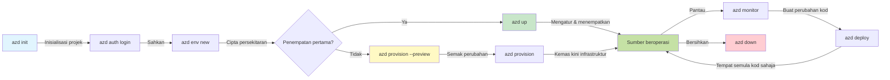
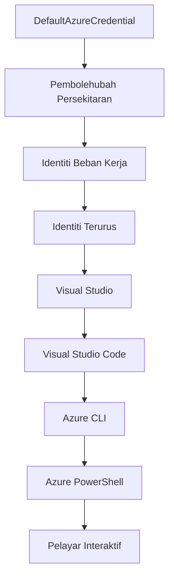

# AZD Asas - Memahami Azure Developer CLI

# AZD Asas - Konsep Teras dan Asas

**Navigasi Bab:**
- **📚 Laman Utama Kursus**: [AZD Untuk Pemula](../../README.md)
- **📖 Bab Semasa**: Bab 1 - Asas & Mula Pantas
- **⬅️ Sebelumnya**: [Gambaran Keseluruhan Kursus](../../README.md#-chapter-1-foundation--quick-start)
- **➡️ Seterusnya**: [Pemasangan & Persediaan](installation.md)
- **🚀 Bab Seterusnya**: [Bab 2: Pembangunan AI-Pertama](../chapter-02-ai-development/microsoft-foundry-integration.md)

## Pengenalan

Pelajaran ini memperkenalkan anda kepada Azure Developer CLI (azd), alat baris perintah yang berkuasa yang mempercepatkan perjalanan anda dari pembangunan tempatan ke penyebaran Azure. Anda akan mempelajari konsep asas, ciri teras, dan memahami bagaimana azd memudahkan penyebaran aplikasi berasaskan awan asli.

## Matlamat Pembelajaran

Menjelang akhir pelajaran ini, anda akan:
- Memahami apa itu Azure Developer CLI dan tujuan utamanya
- Mempelajari konsep teras templat, persekitaran, dan perkhidmatan
- Meneroka ciri utama termasuk pembangunan berasaskan templat dan Infrastruktur sebagai Kod
- Memahami struktur projek azd dan aliran kerja
- Bersedia untuk memasang dan mengkonfigurasi azd untuk persekitaran pembangunan anda

## Hasil Pembelajaran

Selepas menamatkan pelajaran ini, anda akan dapat:
- Menjelaskan peranan azd dalam aliran kerja pembangunan awan moden
- Mengenal pasti komponen struktur projek azd
- Menerangkan bagaimana templat, persekitaran, dan perkhidmatan berfungsi bersama
- Memahami manfaat Infrastruktur sebagai Kod dengan azd
- Mengenal pasti arahan azd yang berbeza dan tujuan mereka

## Apakah Azure Developer CLI (azd)?

Azure Developer CLI (azd) adalah alat baris perintah yang direka untuk mempercepat perjalanan anda dari pembangunan tempatan ke penyebaran Azure. Ia memudahkan proses membina, menyebar, dan mengurus aplikasi berasaskan awan asli pada Azure.

### Apa Yang Boleh Anda Sebarkan dengan azd?

azd menyokong pelbagai jenis beban kerja—dan senarainya semakin berkembang. Hari ini, anda boleh menggunakan azd untuk menyebarkan:

| Jenis Beban Kerja | Contoh | Aliran Kerja Sama? |
|---------------|----------|----------------|
| **Aplikasi tradisional** | Aplikasi web, REST API, tapak statik | ✅ `azd up` |
| **Perkhidmatan dan mikroperkhidmatan** | Aplikasi Kontena, Aplikasi Fungsi, backend berbilang perkhidmatan | ✅ `azd up` |
| **Aplikasi dikuasakan AI** | Aplikasi sembang dengan Model Microsoft Foundry, penyelesaian RAG dengan AI Search | ✅ `azd up` |
| **Ejen pintar** | Ejen hos Foundry, orkestrasi multi-ejen | ✅ `azd up` |

Intipati utamanya adalah bahawa **kitar hayat azd kekal sama tanpa mengira apa yang anda sebarkan**. Anda memulakan projek, menyediakan infrastruktur, menyebar kod anda, memantau aplikasi anda, dan membersihkan—sama ada ia laman web mudah atau ejen AI yang canggih.

Kesinambungan ini adalah mengikut reka bentuk. azd menganggap keupayaan AI sebagai satu lagi jenis perkhidmatan yang aplikasi anda boleh gunakan, bukan sesuatu yang berbeza secara asas. Titik hujung sembang yang disokong oleh Model Microsoft Foundry, dari perspektif azd, hanyalah satu lagi perkhidmatan untuk dikonfigurasi dan disebar.

### 🎯 Kenapa Gunakan AZD? Perbandingan Dunia Sebenar

Mari bandingkan penyebaran aplikasi web mudah dengan pangkalan data:

#### ❌ TANPA AZD: Penyebaran Azure Manual (30+ minit)

```bash
# Langkah 1: Cipta kumpulan sumber
az group create --name myapp-rg --location eastus

# Langkah 2: Cipta Pelan Perkhidmatan Aplikasi
az appservice plan create --name myapp-plan \
  --resource-group myapp-rg \
  --sku B1 --is-linux

# Langkah 3: Cipta Apl Web
az webapp create --name myapp-web-unique123 \
  --resource-group myapp-rg \
  --plan myapp-plan \
  --runtime "NODE:18-lts"

# Langkah 4: Cipta akaun Cosmos DB (10-15 minit)
az cosmosdb create --name myapp-cosmos-unique123 \
  --resource-group myapp-rg \
  --kind MongoDB

# Langkah 5: Cipta pangkalan data
az cosmosdb mongodb database create \
  --account-name myapp-cosmos-unique123 \
  --resource-group myapp-rg \
  --name tododb

# Langkah 6: Cipta koleksi
az cosmosdb mongodb collection create \
  --account-name myapp-cosmos-unique123 \
  --resource-group myapp-rg \
  --database-name tododb \
  --name todos

# Langkah 7: Dapatkan rentetan sambungan
CONN_STR=$(az cosmosdb keys list \
  --name myapp-cosmos-unique123 \
  --resource-group myapp-rg \
  --type connection-strings \
  --query "connectionStrings[0].connectionString" -o tsv)

# Langkah 8: Konfigurasikan tetapan apl
az webapp config appsettings set \
  --name myapp-web-unique123 \
  --resource-group myapp-rg \
  --settings MONGODB_URI="$CONN_STR"

# Langkah 9: Aktifkan pencatatan
az webapp log config --name myapp-web-unique123 \
  --resource-group myapp-rg \
  --application-logging filesystem \
  --detailed-error-messages true

# Langkah 10: Sediakan Application Insights
az monitor app-insights component create \
  --app myapp-insights \
  --location eastus \
  --resource-group myapp-rg

# Langkah 11: Pautkan App Insights ke Apl Web
INSTRUMENTATION_KEY=$(az monitor app-insights component show \
  --app myapp-insights \
  --resource-group myapp-rg \
  --query "instrumentationKey" -o tsv)

az webapp config appsettings set \
  --name myapp-web-unique123 \
  --resource-group myapp-rg \
  --settings APPINSIGHTS_INSTRUMENTATIONKEY="$INSTRUMENTATION_KEY"

# Langkah 12: Bina aplikasi secara tempatan
npm install
npm run build

# Langkah 13: Cipta pakej penyebaran
zip -r app.zip . -x "*.git*" "node_modules/*"

# Langkah 14: Sebarkan aplikasi
az webapp deployment source config-zip \
  --resource-group myapp-rg \
  --name myapp-web-unique123 \
  --src app.zip

# Langkah 15: Tunggu dan berdoa ia berjaya 🙏
# (Tiada pengesahan automatik, ujian manual diperlukan)
```

**Masalah:**
- ❌ Lebih 15 arahan untuk diingati dan dilaksanakan mengikut urutan
- ❌ Kerja manual 30-45 minit
- ❌ Mudah buat kesilapan (salah taip, parameter salah)
- ❌ Rentetan sambungan terdedah dalam sejarah terminal
- ❌ Tiada rollback automatik jika sesuatu gagal
- ❌ Sukar untuk ditiru oleh ahli pasukan
- ❌ Berbeza setiap kali (tidak boleh dihasilkan semula)

#### ✅ DENGAN AZD: Penyebaran Automatik (5 arahan, 10-15 minit)

```bash
# Langkah 1: Inisialisasi dari templat
azd init --template todo-nodejs-mongo

# Langkah 2: Pengesahan
azd auth login

# Langkah 3: Cipta persekitaran
azd env new dev

# Langkah 4: Pratonton perubahan (pilihan tetapi disyorkan)
azd provision --preview

# Langkah 5: Lancarkan semuanya
azd up

# ✨ Selesai! Semuanya telah dilancarkan, dikonfigurasi, dan dipantau
```

**Manfaat:**
- ✅ **5 arahan** berbanding lebih 15 langkah manual
- ✅ **10-15 minit** masa keseluruhan (selalunya menunggu Azure)
- ✅ **Kurang kesilapan manual** - aliran kerja konsisten berasaskan templat
- ✅ **Pengendalian rahsia selamat** - banyak templat menggunakan stor rahsia yang diurus Azure
- ✅ **Penyebaran boleh diulang** - aliran kerja sama setiap kali
- ✅ **Boleh dihasilkan semula sepenuhnya** - keputusan sama setiap kali
- ✅ **Sedia untuk pasukan** - sesiapa pun boleh menyebar dengan arahan sama
- ✅ **Infrastruktur sebagai Kod** - templat Bicep dikawal versi
- ✅ **Pemantauan terbina dalam** - Application Insights dikonfigurasi secara automatik

### 📊 Pengurangan Masa & Kesilapan

| Metrik | Penyebaran Manual | Penyebaran AZD | Peningkatan |
|:-------|:------------------|:---------------|:------------|
| **Arahan** | 15+ | 5 | 67% kurang |
| **Masa** | 30-45 min | 10-15 min | 60% lebih pantas |
| **Kadar Ralat** | ~40% | <5% | Pengurangan 88% |
| **Konsistensi** | Rendah (manual) | 100% (automatik) | Sempurna |
| **Penglibatan Pasukan** | 2-4 jam | 30 minit | 75% lebih pantas |
| **Masa Rollback** | 30+ min (manual) | 2 min (automatik) | 93% lebih pantas |

## Konsep Teras

### Templat
Templat adalah asas kepada azd. Ia mengandungi:
- **Kod aplikasi** - Kod sumber dan kebergantungan anda
- **Definisi infrastruktur** - Sumber Azure yang ditakrifkan dalam Bicep atau Terraform
- **Fail konfigurasi** - Tetapan dan pembolehubah persekitaran
- **Skrip penyebaran** - Aliran kerja penyebaran automatik

### Persekitaran
Persekitaran mewakili sasaran penyebaran yang berbeza:
- **Pembangunan** - Untuk ujian dan pembangunan
- **Staging** - Persekitaran pra-produksi
- **Produksi** - Persekitaran produksi langsung

Setiap persekitaran menyelenggara:
- Kumpulan sumber Azure sendiri
- Tetapan konfigurasi
- Keadaan penyebaran

### Perkhidmatan
Perkhidmatan adalah blok binaan aplikasi anda:
- **Frontend** - Aplikasi web, SPA
- **Backend** - API, mikroperkhidmatan
- **Pangkalan data** - Penyelesaian penyimpanan data
- **Storan** - Penyimpanan fail dan blob

## Ciri Utama

### 1. Pembangunan Berasaskan Templat
```bash
# Layari templat yang ada
azd template list

# Mulakan dari templat
azd init --template <template-name>
```

### 2. Infrastruktur sebagai Kod
- **Bicep** - Bahasa khusus domain Azure
- **Terraform** - Alat infrastruktur multi-awan
- **ARM Templates** - Templat Pengurus Sumber Azure

### 3. Aliran Kerja Terpadu
```bash
# Aliran kerja penyebaran lengkap
azd up            # Penyediaan + Penyebaran ini adalah tanpa campur tangan untuk persediaan pertama kali

# 🧪 BARU: Pratayang perubahan infrastruktur sebelum penyebaran (SELAMAT)
azd provision --preview    # Mensimulasikan penyebaran infrastruktur tanpa membuat perubahan

azd provision     # Cipta sumber Azure jika anda mengemas kini infrastruktur gunakan ini
azd deploy        # Sebarkan kod aplikasi atau sebarkan semula kod aplikasi setelah kemas kini
azd down          # Bersihkan sumber
```

#### 🛡️ Rancangan Infrastruktur Selamat dengan Preview
Arahan `azd provision --preview` adalah perubahan permainan untuk penyebaran selamat:
- **Analisis dry-run** - Menunjukkan apa yang akan dibuat, diubah, atau dipadam
- **Risiko sifar** - Tiada perubahan sebenar dilakukan pada persekitaran Azure anda
- **Kerjasama pasukan** - Kongsi hasil preview sebelum penyebaran
- **Anggaran kos** - Fahami kos sumber sebelum membuat komitmen

```bash
# Contoh aliran kerja pratonton
azd provision --preview           # Lihat apa yang akan berubah
# Semak output, bincang dengan pasukan
azd provision                     # Terapkan perubahan dengan yakin
```

### 📊 Visual: Aliran Kerja Pembangunan AZD


**Penjelasan Aliran Kerja:**
1. **Init** - Mula dengan templat atau projek baru
2. **Auth** - Sahkan dengan Azure
3. **Persekitaran** - Cipta persekitaran penyebaran terasing
4. **Preview** - 🆕 Sentiasa pratonton perubahan infrastruktur dahulu (amalan selamat)
5. **Provision** - Cipta/kemas kini sumber Azure
6. **Deploy** - Hantar kod aplikasi anda
7. **Monitor** - Perhatikan prestasi aplikasi
8. **Iterate** - Buat perubahan dan sebar semula kod
9. **Cleanup** - Buang sumber apabila selesai

### 4. Pengurusan Persekitaran
```bash
# Cipta dan uruskan persekitaran
azd env new <environment-name>
azd env select <environment-name>
azd env list
```

### 5. Sambungan dan Arahan AI

azd menggunakan sistem sambungan untuk menambah keupayaan di luar CLI teras. Ini sangat berguna untuk beban kerja AI:

```bash
# Senaraikan sambungan yang tersedia
azd extension list

# Pasang sambungan ejen Foundry
azd extension install azure.ai.agents

# Inisialisasi projek ejen AI dari manifes
azd ai agent init -m agent-manifest.yaml

# Mulakan pelayan MCP untuk pembangunan dibantu AI (Alpha)
azd mcp start
```

> Sambungan diterangkan dengan terperinci dalam [Bab 2: Pembangunan AI-Pertama](../chapter-02-ai-development/agents.md) dan rujukan [Arahan AZD AI CLI](../chapter-08-production/production-ai-practices.md#azd-ai-cli-commands-and-extensions).

## 📁 Struktur Projek

Struktur projek azd tipikal:
```
my-app/
├── .azd/                    # azd configuration
│   └── config.json
├── .azure/                  # Azure deployment artifacts
├── .devcontainer/          # Development container config
├── .github/workflows/      # GitHub Actions
├── .vscode/               # VS Code settings
├── infra/                 # Infrastructure code
│   ├── main.bicep        # Main infrastructure template
│   ├── main.parameters.json
│   └── modules/          # Reusable modules
├── src/                  # Application source code
│   ├── api/             # Backend services
│   └── web/             # Frontend application
├── azure.yaml           # azd project configuration
└── README.md
```

## 🔧 Fail Konfigurasi

### azure.yaml
Fail konfigurasi utama projek:
```yaml
name: my-awesome-app
metadata:
  template: my-template@1.0.0

services:
  web:
    project: ./src/web
    language: js
    host: appservice
  api:
    project: ./src/api
    language: js
    host: appservice

hooks:
  preprovision:
    shell: pwsh
    run: echo "Preparing to provision..."
```

### .azure/config.json
Konfigurasi khusus persekitaran:
```json
{
  "version": 1,
  "defaultEnvironment": "dev",
  "environments": {
    "dev": {
      "subscriptionId": "your-subscription-id",
      "location": "eastus"
    }
  }
}
```

## 🎪 Aliran Kerja Umum dengan Latihan Praktikal

> **💡 Petua Pembelajaran:** Ikuti latihan ini mengikut urutan untuk membina kemahiran AZD anda secara berperingkat.

### 🎯 Latihan 1: Mulakan Projek Pertama Anda

**Matlamat:** Cipta projek AZD dan teroka strukturnya

**Langkah:**
```bash
# Gunakan templat yang terbukti
azd init --template todo-nodejs-mongo

# Terokai fail yang dihasilkan
ls -la  # Lihat semua fail termasuk yang tersembunyi

# Fail utama yang dicipta:
# - azure.yaml (konfigurasi utama)
# - infra/ (kod infrastruktur)
# - src/ (kod aplikasi)
```

**✅ Berjaya:** Anda mempunyai direktori azure.yaml, infra/, dan src/

---

### 🎯 Latihan 2: Sebarkan ke Azure

**Matlamat:** Lengkapkan penyebaran hujung ke hujung

**Langkah:**
```bash
# 1. Sahkan
az login && azd auth login

# 2. Cipta persekitaran
azd env new dev
azd env set AZURE_LOCATION eastus

# 3. Pratonton perubahan (DIGALAKKAN)
azd provision --preview

# 4. Sebarkan semuanya
azd up

# 5. Sahkan penyebaran
azd show    # Lihat URL aplikasi anda
```

**Masa Dijangka:** 10-15 minit  
**✅ Berjaya:** URL aplikasi dibuka dalam pelayar

---

### 🎯 Latihan 3: Pelbagai Persekitaran

**Matlamat:** Sebarkan ke dev dan staging

**Langkah:**
```bash
# Sudah ada dev, buat staging
azd env new staging
azd env set AZURE_LOCATION westus2
azd up

# Bertukar antara mereka
azd env list
azd env select dev
```

**✅ Berjaya:** Dua kumpulan sumber berasingan dalam Azure Portal

---

### 🛡️ Permulaan Bersih: `azd down --force --purge`

Apabila anda perlu reset sepenuhnya:

```bash
azd down --force --purge
```

**Apa yang dilakukan:**
- `--force`: Tiada arahan pengesahan
- `--purge`: Memadam semua keadaan tempatan dan sumber Azure

**Gunakan apabila:**
- Penyebaran gagal di tengah jalan
- Menukar projek
- Perlu permulaan baru

---

## 🎪 Rujukan Aliran Kerja Asal

### Memulakan Projek Baru
```bash
# Kaedah 1: Gunakan templat sedia ada
azd init --template todo-nodejs-mongo

# Kaedah 2: Mulakan dari awal
azd init

# Kaedah 3: Gunakan direktori semasa
azd init .
```

### Kitaran Pembangunan
```bash
# Sediakan persekitaran pembangunan
azd auth login
azd env new dev
azd env select dev

# Lancarkan semuanya
azd up

# Buat perubahan dan lancarkan semula
azd deploy

# Bersihkan apabila selesai
azd down --force --purge # arahan dalam Azure Developer CLI adalah **reset keras** untuk persekitaran anda—amat berguna apabila anda menyelesaikan masalah pelancaran yang gagal, membersihkan sumber yang terbiar, atau menyediakan untuk pelancaran semula yang baru.
```

## Memahami `azd down --force --purge`
Arahan `azd down --force --purge` adalah cara berkuasa untuk memecah sepenuhnya persekitaran azd anda dan semua sumber berkaitan. Berikut adalah pecahan setiap penanda:
```
--force
```
- Melangkau arahan pengesahan.
- Berguna untuk automasi atau skrip di mana input manual tidak praktikal.
- Memastikan proses pembongkaran berjalan tanpa gangguan, walaupun CLI mengesan ketidakkonsistenan.

```
--purge
```
Memadam **semua metadata berkaitan**, termasuk:
Keadaan persekitaran  
Folder `.azure` tempatan  
Maklumat penyebaran yang di-cache  
Menghalang azd daripada "mengingati" penyebaran sebelumnya, yang boleh menyebabkan isu seperti kumpulan sumber tidak sepadan atau rujukan pendaftar usang.

### Kenapa guna kedua-duanya?
Apabila anda menghadapi masalah dengan `azd up` kerana keadaan berlarutan atau penyebaran separa, kombinasi ini memastikan **permulaan bersih**.

Ia sangat membantu selepas pemadaman sumber manual di portal Azure atau apabila menukar templat, persekitaran, atau konvensyen penamaan kumpulan sumber.

### Mengurus Pelbagai Persekitaran
```bash
# Cipta persekitaran staging
azd env new staging
azd env select staging
azd up

# Tukar kembali ke dev
azd env select dev

# Bandingkan persekitaran
azd env list
```

## 🔐 Pengesahan dan Kredensial

Memahami pengesahan adalah penting untuk penyebaran azd yang berjaya. Azure menggunakan pelbagai kaedah pengesahan, dan azd memanfaatkan rangkaian kredensial yang sama digunakan oleh alat Azure lain.

### Pengesahan Azure CLI (`az login`)

Sebelum menggunakan azd, anda perlu mengesahkan dengan Azure. Kaedah paling biasa adalah menggunakan Azure CLI:

```bash
# Log masuk interaktif (buka pelayar)
az login

# Log masuk dengan penyewa tertentu
az login --tenant <tenant-id>

# Log masuk dengan prinsipal perkhidmatan
az login --service-principal -u <app-id> -p <password> --tenant <tenant-id>

# Semak status log masuk semasa
az account show

# Senaraikan langganan yang tersedia
az account list --output table

# Tetapkan langganan lalai
az account set --subscription <subscription-id>
```

### Aliran Pengesahan
1. **Log masuk Interaktif**: Membuka pelayar lalai untuk pengesahan
2. **Aliran Kod Peranti**: Untuk persekitaran tanpa akses pelayar
3. **Service Principal**: Untuk automasi dan senario CI/CD
4. **Managed Identity**: Untuk aplikasi yang dihoskan di Azure

### Rangkaian DefaultAzureCredential

`DefaultAzureCredential` adalah jenis kredensial yang menyediakan pengalaman pengesahan yang dipermudah dengan mencuba secara automatik pelbagai sumber kredensial dalam urutan tertentu:

#### Urutan Rangkaian Kredensial

#### 1. Pembolehubah Persekitaran
```bash
# Tetapkan pembolehubah persekitaran untuk prinsipal perkhidmatan
export AZURE_CLIENT_ID="<app-id>"
export AZURE_CLIENT_SECRET="<password>"
export AZURE_TENANT_ID="<tenant-id>"
```

#### 2. Identiti Beban Kerja (Kubernetes/GitHub Actions)
Digunakan secara automatik dalam:
- Azure Kubernetes Service (AKS) dengan Identiti Beban Kerja
- GitHub Actions dengan persekutuan OIDC
- Senario identiti persekutuan lain

#### 3. Identiti Terkelola
Untuk sumber Azure seperti:
- Mesin Maya
- App Service
- Azure Functions
- Container Instances

```bash
# Semak jika berjalan pada sumber Azure dengan identiti terurus
az account show --query "user.type" --output tsv
# Pulangan: "servicePrincipal" jika menggunakan identiti terurus
```

#### 4. Integrasi Alat Pembangun
- **Visual Studio**: Menggunakan akaun yang masuk secara automatik
- **VS Code**: Menggunakan kredensial sambungan Azure Account
- **Azure CLI**: Menggunakan kredensial `az login` (paling biasa untuk pembangunan tempatan)

### Persediaan Pengesahan AZD

```bash
# Kaedah 1: Gunakan Azure CLI (Disyorkan untuk pembangunan)
az login
azd auth login  # Menggunakan kelayakan Azure CLI sedia ada

# Kaedah 2: Pengesahan azd secara langsung
azd auth login --use-device-code  # Untuk persekitaran tanpa kepala

# Kaedah 3: Semak status pengesahan
azd auth login --check-status

# Kaedah 4: Log keluar dan sahkan semula
azd auth logout
azd auth login
```

### Amalan Terbaik Pengesahan

#### Untuk Pembangunan Tempatan
```bash
# 1. Log masuk dengan Azure CLI
az login

# 2. Sahkan langganan yang betul
az account show
az account set --subscription "Your Subscription Name"

# 3. Gunakan azd dengan kelayakan sedia ada
azd auth login
```

#### Untuk Saluran CI/CD
```yaml
# GitHub Actions example
- name: Azure Login
  uses: azure/login@v1
  with:
    creds: ${{ secrets.AZURE_CREDENTIALS }}

- name: Deploy with azd
  run: |
    azd auth login --client-id ${{ secrets.AZURE_CLIENT_ID }} \
                    --client-secret ${{ secrets.AZURE_CLIENT_SECRET }} \
                    --tenant-id ${{ secrets.AZURE_TENANT_ID }}
    azd up --no-prompt
```

#### Untuk Persekitaran Produksi
- Gunakan **Managed Identity** apabila menjalankan pada sumber Azure
- Gunakan **Service Principal** untuk senario automasi
- Elakkan menyimpan kredensial dalam kod atau fail konfigurasi
- Gunakan **Azure Key Vault** untuk konfigurasi sensitif

### Isu Umum Pengesahan dan Penyelesaian

#### Isu: "Tiada langganan ditemui"
```bash
# Penyelesaian: Tetapkan langganan lalai
az account list --output table
az account set --subscription "<subscription-id>"
azd env set AZURE_SUBSCRIPTION_ID "<subscription-id>"
```

#### Isu: "Kebenaran tidak mencukupi"
```bash
# Penyelesaian: Semak dan tetapkan peranan yang diperlukan
az role assignment list --assignee $(az account show --query user.name --output tsv)

# Peranan biasa yang diperlukan:
# - Penyumbang (untuk pengurusan sumber)
# - Pentadbir Akses Pengguna (untuk penetapan peranan)
```

#### Isu: "Token tamat tempoh"
```bash
# Penyelesaian: Sahkan semula
az logout
az login
azd auth logout
azd auth login
```

### Pengesahan dalam Senario Berbeza

#### Pembangunan Tempatan
```bash
# Akaun pembangunan peribadi
az login
azd auth login
```

#### Pembangunan Pasukan
```bash
# Gunakan penyewa khusus untuk organisasi
az login --tenant contoso.onmicrosoft.com
azd auth login
```

#### Senario Multi-penyewa
```bash
# Tukar antara penyewa
az login --tenant tenant1.onmicrosoft.com
# Lancarkan ke penyewa 1
azd up

az login --tenant tenant2.onmicrosoft.com  
# Lancarkan ke penyewa 2
azd up
```

### Pertimbangan Keselamatan
1. **Penyimpanan Kredensial**: Jangan pernah menyimpan kredensial dalam kod sumber  
2. **Had Skop**: Gunakan prinsip keistimewaan paling rendah untuk prinsip perkhidmatan  
3. **Putaran Token**: Putar rahsia prinsip perkhidmatan secara berkala  
4. **Jejak Audit**: Pantau aktiviti pengesahan dan penyebaran  
5. **Keselamatan Rangkaian**: Gunakan titik akhir peribadi apabila boleh  

### Penyelesaian Masalah Pengesahan

```bash
# Selesaikan isu pengesahan
azd auth login --check-status
az account show
az account get-access-token

# Arahan diagnostik biasa
whoami                          # Konteks pengguna semasa
az ad signed-in-user show      # Butiran pengguna Azure AD
az group list                  # Uji akses sumber
```
  
## Memahami `azd down --force --purge`  

### Penemuan  
```bash
azd template list              # Layari templat
azd template show <template>   # Butiran templat
azd init --help               # Pilihan inisialisasi
```
  
### Pengurusan Projek  
```bash
azd show                     # Gambaran projek
azd env list                # Persekitaran yang tersedia dan lalai yang dipilih
azd config show            # Tetapan konfigurasi
```
  
### Pemantauan  
```bash
azd monitor                  # Buka pemantauan portal Azure
azd monitor --logs           # Lihat log aplikasi
azd monitor --live           # Lihat metrik langsung
azd pipeline config          # Sediakan CI/CD
```
  
## Amalan Terbaik  

### 1. Gunakan Nama Bermakna  
```bash
# Baik
azd env new production-east
azd init --template web-app-secure

# Elakkan
azd env new env1
azd init --template template1
```
  
### 2. Manfaatkan Templat  
- Mulakan dengan templat yang sedia ada  
- Sesuaikan mengikut keperluan anda  
- Cipta templat yang boleh digunakan semula untuk organisasi anda  

### 3. Pengasingan Persekitaran  
- Gunakan persekitaran berasingan untuk pembangunan/ujian/produksi  
- Jangan sesekali menyebarkan terus ke produksi dari mesin tempatan  
- Gunakan pipeline CI/CD untuk penyebaran produksi  

### 4. Pengurusan Konfigurasi  
- Gunakan pembolehubah persekitaran untuk data sensitif  
- Simpan konfigurasi dalam kawalan versi  
- Dokumentasikan tetapan khusus persekitaran  

## Tahap Pembelajaran  

### Pemula (Minggu 1-2)  
1. Pasang azd dan sahkan identiti  
2. Sebarkan templat mudah  
3. Fahami struktur projek  
4. Pelajari arahan asas (up, down, deploy)  

### Pertengahan (Minggu 3-4)  
1. Sesuaikan templat  
2. Urus pelbagai persekitaran  
3. Fahami kod infrastruktur  
4. Sediakan pipeline CI/CD  

### Lanjutan (Minggu 5+)  
1. Cipta templat tersuai  
2. Corak infrastruktur lanjutan  
3. Penyebaran berbilang rantau  
4. Konfigurasi gred perusahaan  

## Langkah Seterusnya  

**📖 Teruskan Pembelajaran Bab 1:**  
- [Pemasangan & Persediaan](installation.md) - Pasang dan konfigurasi azd  
- [Projek Pertama Anda](first-project.md) - Lengkapkan tutorial praktikal  
- [Panduan Konfigurasi](configuration.md) - Pilihan konfigurasi lanjutan  

**🎯 Sedia untuk Bab Seterusnya?**  
- [Bab 2: Pembangunan Berasaskan AI](../chapter-02-ai-development/microsoft-foundry-integration.md) - Mulakan membina aplikasi AI  

## Sumber Tambahan  

- [Gambaran Keseluruhan Azure Developer CLI](https://learn.microsoft.com/en-us/azure/developer/azure-developer-cli/)  
- [Galeri Templat](https://azure.github.io/awesome-azd/)  
- [Contoh Komuniti](https://github.com/Azure-Samples)  

---

## 🙋 Soalan Lazim  

### Soalan Umum  

**S: Apakah perbezaan antara AZD dan Azure CLI?**  

J: Azure CLI (`az`) adalah untuk mengurus sumber Azure individu. AZD (`azd`) adalah untuk mengurus aplikasi secara keseluruhan:  

```bash
# Azure CLI - Pengurusan sumber tahap rendah
az webapp create --name myapp --resource-group rg
az sql server create --name myserver --resource-group rg
# ...banyak lagi arahan yang diperlukan

# AZD - Pengurusan tahap aplikasi
azd up  # Menghantar aplikasi penuh dengan semua sumber
```
  
**Fikirkan seperti ini:**  
- `az` = Mengendalikan kepingan Lego individu  
- `azd` = Bekerja dengan set Lego lengkap  

---  

**S: Perlukah saya tahu Bicep atau Terraform untuk menggunakan AZD?**  

J: Tidak! Mula dengan templat:  
```bash
# Gunakan templat yang sedia ada - tidak perlu pengetahuan IaC
azd init --template todo-nodejs-mongo
azd up
```
  
Anda boleh belajar Bicep kemudian untuk sesuaikan infrastruktur. Templat menyediakan contoh yang berfungsi untuk anda pelajari.  

---  

**S: Berapakah kos untuk menjalankan templat AZD?**  

J: Kos bergantung pada templat. Kebanyakannya templat pembangunan berharga $50-150/bulan:  

```bash
# Pratonton kos sebelum menyebarkan
azd provision --preview

# Sentiasa bersihkan apabila tidak digunakan
azd down --force --purge  # Menghapuskan semua sumber
```
  
**Tip pro:** Gunakan tahap percuma jika tersedia:  
- App Service: tahap F1 (Percuma)  
- Model Microsoft Foundry: Azure OpenAI 50,000 token/bulan percuma  
- Cosmos DB: tahap 1000 RU/s percuma  

---  

**S: Bolehkah saya gunakan AZD dengan sumber Azure yang sedia ada?**  

J: Boleh, tetapi lebih mudah mula baru. AZD berfungsi terbaik apabila menguruskan keseluruhan kitar hayat. Untuk sumber sedia ada:  

```bash
# Pilihan 1: Import sumber sedia ada (lanjutan)
azd init
# Kemudian ubah infra/ untuk merujuk sumber sedia ada

# Pilihan 2: Mulakan baru (disyorkan)
azd init --template matching-your-stack
azd up  # Membuat persekitaran baru
```
  
---  

**S: Bagaimana nak kongsi projek saya dengan rakan sepasukan?**  

J: Komit projek AZD ke Git (tetapi JANGAN folder .azure):  

```bash
# Sudah terdapat dalam .gitignore secara lalai
.azure/        # Mengandungi rahsia dan data persekitaran
*.env          # Pembolehubah persekitaran

# Ahli pasukan kemudian:
git clone <your-repo>
azd auth login
azd env new <their-name>-dev
azd up
```
  
Semua orang mendapat infrastruktur sama dari templat yang sama.  

---  

### Soalan Penyelesaian Masalah  

**S: "azd up" gagal separuh jalan. Apa patut saya buat?**  

J: Semak ralat, betulkan, kemudian cuba semula:  

```bash
# Lihat log terperinci
azd show

# Pembetulan biasa:

# 1. Jika kuota melebihi:
azd env set AZURE_LOCATION "westus2"  # Cuba wilayah berbeza

# 2. Jika konflik nama sumber:
azd down --force --purge  # Bersihkan semula
azd up  # Cuba semula

# 3. Jika pengesahan tamat:
az login
azd auth login
azd up
```
  
**Isu paling biasa:** Pilihan langganan Azure salah  
```bash
az account list --output table
az account set --subscription "<correct-subscription>"
```
  
---  

**S: Bagaimana nak hantar hanya perubahan kod tanpa reprovision?**  

J: Gunakan `azd deploy` dan bukan `azd up`:  

```bash
azd up          # Kali pertama: penyediaan + penyebaran (perlahan)

# Buat perubahan kod...

azd deploy      # Kali-kali berikutnya: hanya penyebaran (cepat)
```
  
Perbandingan kelajuan:  
- `azd up`: 10-15 minit (sediakan infrastruktur)  
- `azd deploy`: 2-5 minit (kod sahaja)  

---  

**S: Bolehkah saya sesuaikan templat infrastruktur?**  

J: Boleh! Edit fail Bicep dalam `infra/`:  

```bash
# Selepas azd init
cd infra/
code main.bicep  # Sunting dalam VS Code

# Pratonton perubahan
azd provision --preview

# Terapkan perubahan
azd provision
```
  
**Tip:** Mula kecil - ubah SKU dahulu:  
```bicep
// infra/main.bicep
sku: {
  name: 'B1'  // Change to 'P1V2' for production
}
```
  
---  

**S: Bagaimana saya hapus semua yang dibuat AZD?**  

J: Satu arahan untuk buang semua sumber:  

```bash
azd down --force --purge

# Ini memadamkan:
# - Semua sumber Azure
# - Kumpulan sumber
# - Keadaan persekitaran tempatan
# - Data pelaksanaan yang disimpan dalam cache
```
  
**Sentiasa jalankan ini bila:**  
- Selesai ujian templat  
- Berpindah ke projek lain  
- Mahu mula baru  

**Penjimatan kos:** Buang sumber tidak digunakan = caj $0  

---  

**S: Apa jadi jika saya tersilap hapus sumber di Azure Portal?**  

J: Status AZD mungkin tak sinkron. Gunakan pendekatan helaian bersih:  

```bash
# 1. Alih keluar keadaan tempatan
azd down --force --purge

# 2. Mula semula
azd up

# Alternatif: Biarkan AZD mengesan dan membaiki
azd provision  # Akan mencipta sumber yang hilang
```
  
---  

### Soalan Lanjutan  

**S: Bolehkah saya gunakan AZD dalam pipeline CI/CD?**  

J: Boleh! Contoh GitHub Actions:  

```yaml
# .github/workflows/deploy.yml
name: Deploy with AZD

on:
  push:
    branches: [main]

jobs:
  deploy:
    runs-on: ubuntu-latest
    steps:
      - uses: actions/checkout@v2
      
      - name: Install azd
        run: curl -fsSL https://aka.ms/install-azd.sh | bash
      
      - name: Azure Login
        run: |
          azd auth login \
            --client-id ${{ secrets.AZURE_CLIENT_ID }} \
            --client-secret ${{ secrets.AZURE_CLIENT_SECRET }} \
            --tenant-id ${{ secrets.AZURE_TENANT_ID }}
      
      - name: Deploy
        run: azd up --no-prompt
```
  
---  

**S: Bagaimana saya urus rahsia dan data sensitif?**  

J: AZD terintegrasi dengan Azure Key Vault secara automatik:  

```bash
# Rahsia disimpan dalam Key Vault, bukan dalam kod
azd env set DATABASE_PASSWORD "$(openssl rand -base64 32)"

# AZD secara automatik:
# 1. Mencipta Key Vault
# 2. Menyimpan rahsia
# 3. Memberi akses aplikasi melalui Identiti Terurus
# 4. Menyuntik semasa runtime
```
  
**Jangan sekali-kali komit:**  
- Folder `.azure/` (mengandungi data persekitaran)  
- Fail `.env` (rahsia tempatan)  
- Tali sambungan  

---  

**S: Bolehkah saya deploy ke pelbagai rantau?**  

J: Boleh, cipta persekitaran untuk setiap rantau:  

```bash
# Persekitaran Pantai Timur AS
azd env new prod-eastus
azd env set AZURE_LOCATION eastus
azd up

# Persekitaran Eropah Barat
azd env new prod-westeurope
azd env set AZURE_LOCATION westeurope
azd up

# Setiap persekitaran adalah bebas
azd env list
```
  
Untuk aplikasi berbilang rantau sebenar, sesuaikan templat Bicep untuk deploy ke banyak rantau serentak.  

---  

**S: Di mana saya boleh dapat bantuan jika tersekat?**  

1. **Dokumentasi AZD:** https://learn.microsoft.com/azure/developer/azure-developer-cli/  
2. **Isu GitHub:** https://github.com/Azure/azure-dev/issues  
3. **Discord:** [Azure Discord](https://discord.gg/microsoft-azure) - saluran #azure-developer-cli  
4. **Stack Overflow:** Tag `azure-developer-cli`  
5. **Kursus Ini:** [Panduan Penyelesaian Masalah](../chapter-07-troubleshooting/common-issues.md)  

**Tip pro:** Sebelum bertanya, jalankan:  
```bash
azd show       # Memaparkan keadaan semasa
azd version    # Memaparkan versi anda
```
  
Masukkan maklumat ini dalam soalan anda untuk bantuan lebih pantas.  

---  

## 🎓 Apa Seterusnya?  

Anda kini faham asas AZD. Pilih laluan anda:  

### 🎯 Untuk Pemula:  
1. **Seterusnya:** [Pemasangan & Persediaan](installation.md) - Pasang AZD di mesin anda  
2. **Kemudian:** [Projek Pertama Anda](first-project.md) - Deploy aplikasi pertama anda  
3. **Amalkan:** Lengkapkan semua 3 latihan dalam pelajaran ini  

### 🚀 Untuk Pembangun AI:  
1. **Langkau ke:** [Bab 2: Pembangunan Berasaskan AI](../chapter-02-ai-development/microsoft-foundry-integration.md)  
2. **Deploy:** Mula dengan `azd init --template get-started-with-ai-chat`  
3. **Belajar:** Bina sambil anda deploy  

### 🏗️ Untuk Pembangun Berpengalaman:  
1. **Semak:** [Panduan Konfigurasi](configuration.md) - Tetapan lanjutan  
2. **Teroka:** [Infrastruktur sebagai Kod](../chapter-04-infrastructure/provisioning.md) - Pendalaman Bicep  
3. **Bina:** Cipta templat tersuai untuk stack anda  

---  

**Navigasi Bab:**  
- **📚 Laman Utama Kursus**: [AZD Untuk Pemula](../../README.md)  
- **📖 Bab Semasa**: Bab 1 - Asas & Permulaan Cepat  
- **⬅️ Sebelumnya**: [Gambaran Keseluruhan Kursus](../../README.md#-chapter-1-foundation--quick-start)  
- **➡️ Seterusnya**: [Pemasangan & Persediaan](installation.md)  
- **🚀 Bab Seterusnya**: [Bab 2: Pembangunan Berasaskan AI](../chapter-02-ai-development/microsoft-foundry-integration.md)

---

<!-- CO-OP TRANSLATOR DISCLAIMER START -->
**Penafian**:  
Dokumen ini telah diterjemahkan menggunakan perkhidmatan terjemahan AI [Co-op Translator](https://github.com/Azure/co-op-translator). Walaupun kami berusaha untuk ketepatan, harap maklum bahawa terjemahan automatik mungkin mengandungi kesilapan atau ketidaktepatan. Dokumen asal dalam bahasa asalnya harus dianggap sebagai sumber yang sahih. Untuk maklumat penting, terjemahan profesional oleh manusia adalah disyorkan. Kami tidak bertanggungjawab atas sebarang salah faham atau salah tafsir yang timbul daripada penggunaan terjemahan ini.
<!-- CO-OP TRANSLATOR DISCLAIMER END -->