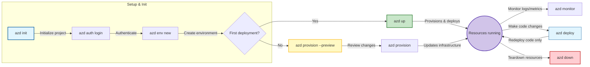
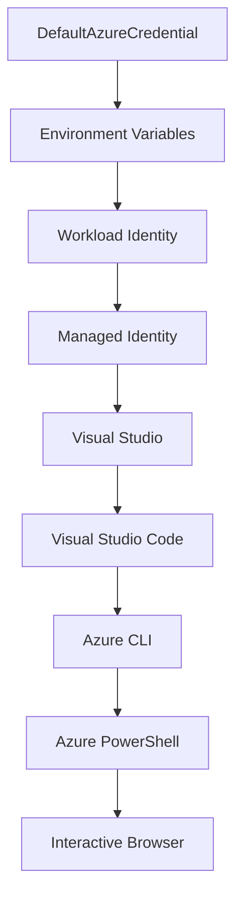

# Asas AZD - Konsep Teras dan Asas

**Navigasi Bab:**
- **📚 Laman Utama Kursus**: [AZD Untuk Pemula](../../README.md)
- **📖 Bab Semasa**: Bab 1 - Asas & Mula Cepat
- **⬅️ Sebelumnya**: [Gambaran Umum Kursus](../../README.md#-chapter-1-foundation--quick-start)
- **➡️ Seterusnya**: [Pemasangan & Penetapan](installation.md)
- **🚀 Bab Seterusnya**: [Bab 2: Pembangunan AI-Pertama](../chapter-02-ai-development/microsoft-foundry-integration.md)

## Pengenalan

> Disemak mengikut `azd 1.37.2` (November 2026). Perintah Bash menggunakan tempat letak yang dipetik yang anda mesti ganti. Aliran kerja templat menggunakan `.` untuk memulakan direktori semasa; tanpa argumen direktori, inisialisasi templat mencipta subdirektori dan tidak mengubah direktori kerja shell anda. Snipet lanjutan adalah ilustratif, bukan projek lengkap.

Pelajaran ini memperkenalkan anda kepada Azure Developer CLI (azd), alat baris perintah yang kuat yang mempercepat perjalanan anda dari pembangunan tempatan ke penempatan Azure. Anda akan mempelajari konsep asas, ciri utama, dan memahami bagaimana azd memudahkan penempatan aplikasi asli awan.

## Matlamat Pembelajaran

Menjelang akhir pelajaran ini, anda akan:
- Memahami apa itu Azure Developer CLI dan tujuan utamanya
- Mempelajari konsep teras templat, persekitaran, dan perkhidmatan
- Meneroka ciri utama termasuk pembangunan berasaskan templat dan Infrastruktur sebagai Kod
- Memahami struktur projek azd dan aliran kerjanya
- Bersedia untuk memasang dan mengkonfigurasi azd untuk persekitaran pembangunan anda

## Hasil Pembelajaran

Selepas menyelesaikan pelajaran ini, anda akan dapat:
- Menjelaskan peranan azd dalam aliran kerja pembangunan awan moden
- Mengenal pasti komponen struktur projek azd
- Menerangkan bagaimana templat, persekitaran, dan perkhidmatan berfungsi bersama
- Memahami manfaat Infrastruktur sebagai Kod dengan azd
- Mengenalpasti perintah azd yang berbeza dan tujuan mereka

## Apa itu Azure Developer CLI (azd)?

Azure Developer CLI (azd) adalah alat baris perintah yang direka untuk mempercepat perjalanan anda dari pembangunan tempatan ke penempatan Azure. Ia memudahkan proses membangun, menempatkan, dan mengurus aplikasi asli awan di Azure.

### Apa yang Boleh Anda Tempatkan dengan azd?

azd menyokong pelbagai beban kerja—dan senarai terus berkembang. Hari ini, anda boleh menggunakan azd untuk menempatkan:

| Jenis Beban Kerja | Contoh | Aliran Kerja Sama? |
|---------------|----------|----------------|
| **Aplikasi tradisional** | Aplikasi web, REST API, laman statik | ✅ `azd up` |
| **Perkhidmatan dan mikroperkhidmatan** | Aplikasi Bekas, Aplikasi Fungsi, belakang pelbagai perkhidmatan | ✅ `azd up` |
| **Aplikasi dipacu AI** | Aplikasi sembang dengan Model Foundry Microsoft, penyelesaian RAG dengan AI Search | ✅ `azd up` |
| **Ejen pintar** | Ejen hos Foundry, orkestra pelbagai ejen | ✅ `azd up` |

Intipati utama adalah bahawa **kitar hayat azd tetap sama tidak kira apa yang anda tempatkan**. Anda memulakan projek, menyediakan infrastruktur, menempatkan kod anda, memantau aplikasi anda, dan membersihkan—sama ada ia laman web mudah atau ejen AI yang canggih.

Kesinambungan ini adalah reka bentuk. azd menganggap keupayaan AI sebagai satu lagi jenis perkhidmatan yang aplikasi anda boleh gunakan, bukan sesuatu yang berbeza secara asas. Titik akhir sembang yang disokong oleh Model Foundry Microsoft adalah, dari perspektif azd, hanya perkhidmatan lain untuk dikonfigurasi dan ditempatkan.

### 🎯 Mengapa Gunakan AZD? Perbandingan Dunia Sebenar

Mari kita bandingkan penempatan aplikasi web mudah dengan pangkalan data:

#### ❌ TANPA AZD: Penempatan Azure Manual (30+ minit)

**Perbandingan Bash ilustratif, bukan permulaan aplikasi yang boleh dijalankan.** Ini menganggap kod aplikasi sedia ada, nama sumber unik, pengesahan Azure CLI, dan sebarang peluasan CLI yang diperlukan. Gunakan latihan templat di bawah untuk laluan menyokong hujung ke hujung.

```bash
# Step 1: Create resource group
az group create --name myapp-rg --location eastus

# Step 2: Create App Service Plan
az appservice plan create --name myapp-plan \
  --resource-group myapp-rg \
  --sku B1 --is-linux

# Step 3: Create Web App
az webapp create --name myapp-web-unique123 \
  --resource-group myapp-rg \
  --plan myapp-plan \
  --runtime "NODE:22-lts"

# Step 4: Create Cosmos DB account (10-15 minutes)
az cosmosdb create --name myapp-cosmos-unique123 \
  --resource-group myapp-rg \
  --kind MongoDB

# Step 5: Create database
az cosmosdb mongodb database create \
  --account-name myapp-cosmos-unique123 \
  --resource-group myapp-rg \
  --name tododb

# Step 6: Create collection
az cosmosdb mongodb collection create \
  --account-name myapp-cosmos-unique123 \
  --resource-group myapp-rg \
  --database-name tododb \
  --name todos

# Step 7: Get connection string
CONN_STR=$(az cosmosdb keys list \
  --name myapp-cosmos-unique123 \
  --resource-group myapp-rg \
  --type connection-strings \
  --query "connectionStrings[0].connectionString" -o tsv)

# Step 8: Configure app settings
az webapp config appsettings set \
  --name myapp-web-unique123 \
  --resource-group myapp-rg \
  --settings MONGODB_URI="$CONN_STR"

# Step 9: Enable logging
az webapp log config --name myapp-web-unique123 \
  --resource-group myapp-rg \
  --application-logging filesystem \
  --detailed-error-messages true

# Step 10: Set up Application Insights
az monitor app-insights component create \
  --app myapp-insights \
  --location eastus \
  --resource-group myapp-rg

# Step 11: Link App Insights to Web App
INSTRUMENTATION_KEY=$(az monitor app-insights component show \
  --app myapp-insights \
  --resource-group myapp-rg \
  --query "instrumentationKey" -o tsv)

az webapp config appsettings set \
  --name myapp-web-unique123 \
  --resource-group myapp-rg \
  --settings APPINSIGHTS_INSTRUMENTATIONKEY="$INSTRUMENTATION_KEY"

# Step 12: Build application locally
npm install
npm run build

# Step 13: Create deployment package
zip -r app.zip . -x "*.git*" "node_modules/*"

# Step 14: Deploy application
az webapp deployment source config-zip \
  --resource-group myapp-rg \
  --name myapp-web-unique123 \
  --src app.zip

# Step 15: Wait and pray it works 🙏
# (No automated validation, manual testing required)
```

**Masalah:**
- ❌ 15+ perintah untuk diingat dan dilaksanakan mengikut urutan
- ❌ 30-45 minit kerja manual
- ❌ Mudah melakukan kesilapan (salah taip, parameter salah)
- ❌ Kredensial memerlukan pengendalian eksplisit; log debug dan penjejakan shell boleh mendedahkan mereka
- ❌ Tiada rollback automatik jika sesuatu gagal
- ❌ Sukar untuk ditiru oleh ahli pasukan
- ❌ Berbeza setiap kali (tidak boleh diulang)

#### ✅ DENGAN AZD: Penempatan Automatik (5 perintah, 10-15 minit)

```bash
# Step 1: Initialize from template
azd init --template todo-nodejs-mongo .

# Step 2: Authenticate
azd auth login

# Step 3: Select the environment created during init
azd env select dev

# Step 4: Preview changes (optional but recommended)
azd provision --preview

# Step 5: Deploy everything
azd up

# ✨ Done! Everything is deployed, configured, and monitored
```

**Manfaat:**
- ✅ **5 perintah** vs. 15+ langkah manual
- ✅ **10-15 minit** masa keseluruhan (kebanyakannya menunggu Azure)
- ✅ **Kurang kesilapan manual** - aliran kerja konsisten berasaskan templat
- ✅ **Pengendalian rahsia selamat** - banyak templat menggunakan storan rahsia diurus Azure
- ✅ **Penempatan boleh diulang** - aliran kerja sama setiap kali
- ✅ **Definisi infrastruktur boleh diulang** - tertakluk pada kuota, ketersediaan rantau, dan versi templat
- ✅ **Sedia untuk pasukan** - sesiapa sahaja boleh menempatkan dengan perintah yang sama
- ✅ **Infrastruktur sebagai Kod** - templat Bicep dikawal versi
- ✅ **Pemantauan ditakrifkan templat** - Application Insights apabila dimasukkan dalam templat

### Masa dan Kebolehpercayaan

Masa di atas adalah anggaran, bukan penanda aras. azd mengurangkan perintah yang perlu anda koordinasi, tetapi tidak menjamin tempoh penempatan, menghapuskan kesilapan, atau menyediakan rollback aplikasi/pangkalan data automatik. Simpan versi berfungsi dalam kawalan sumber dan uji prosedur pemulihan.

## Konsep Teras

### Templat
Templat adalah asas azd. Ia mengandungi:
- **Kod aplikasi** - Kod sumber dan kebergantungan anda
- **Definisi infrastruktur** - Sumber Azure yang ditakrifkan dalam Bicep atau Terraform
- **Fail konfigurasi** - Tetapan dan pembolehubah persekitaran
- **Skrip penempatan** - Aliran kerja penempatan automatik

### Persekitaran
Persekitaran mewakili sasaran penempatan yang berbeza:
- **Pembangunan** - Untuk ujian dan pembangunan
- **Pentas** - Persekitaran pra-produksi
- **Produksi** - Persekitaran produksi langsung

Setiap persekitaran mengekalkan:
- Nama persekitaran dan nilai; pengasingan sumber bergantung pada templat infrastruktur
- Tetapan konfigurasi
- Status penempatan

### Perkhidmatan
Perkhidmatan dalam `azure.yaml` menerangkan komponen aplikasi yang boleh ditempatkan:
- **Frontend** - Aplikasi web, SPA
- **Backend** - API, mikroperkhidmatan

Pangkalan data dan storan biasanya disediakan sebagai sumber infrastruktur, bukan hos perkhidmatan yang dicipta seperti `host: postgres`.

## Ciri Utama

### 1. Pembangunan Berpandukan Templat
```bash
# Browse available templates
azd template list

# Initialize from a template
azd init --template "<template-name>" .
```

### 2. Infrastruktur sebagai Kod
- **Bicep** - Bahasa khusus domain Azure
- **Terraform** - Alat infrastruktur pelbagai awan
- Bicep disusun menjadi templat ARM; JSON ARM mentah bukan sebahagian daripada `infra.provider` terbina dalam.

### 3. Aliran Kerja Terpadu
```bash
# Complete deployment workflow
azd up            # Provision + Deploy this is hands off for first time setup

# 🧪 NEW: Preview infrastructure changes before deployment (SAFE)
azd provision --preview    # Simulate infrastructure deployment without making changes

azd provision     # Create Azure resources if you update the infrastructure use this
azd deploy        # Deploy application code or redeploy application code once update
azd down          # Clean up resources
```

#### 🛡️ Perancangan Infrastruktur Selamat dengan Pratonton
Perintah `azd provision --preview` adalah pembaharuan untuk penempatan selamat:
- **Analisis dry-run** - Menunjukkan apa yang akan dicipta, diubah, atau dipadam
- **Tiada aplikasi infrastruktur** - Menyemak perubahan penyedia; periksa kait projek dahulu, kerana kait boleh menjalankan perintah dengan kesan sampingan
- **Kerjasama pasukan** - Kongsi hasil pratonton sebelum penempatan
- **Input perancangan kos** - Periksa SKU yang dicadangkan, kemudian harga dengan Kalkulator Harga Azure; pratonton tidak mengira harga

```bash
# Example preview workflow
azd provision --preview           # See what will change
# Review the output, discuss with team
azd provision                     # Apply changes with confidence
```

### 📊 Visual: Aliran Kerja Pembangunan AZD


```mermaid
graph LR
    %% Initialization Phase
    subgraph Setup & Init
        A[azd init] -->|Initialize project| B[azd auth login]
        B -->|Authenticate| C[azd env new]
        C -->|Create environment| D{First deployment?}
    end

    %% Deployment Phase
    D -->|Yes| E[azd up]
    D -->|No| F[azd provision --preview]
    
    F -->|Review changes| G[azd provision]
    
    %% Operational Phase
    E -->|Provisions & deploys| H((Resources running))
    G -->|Updates infrastructure| H
    
    H -->|Monitor logs/metrics| I[azd monitor]
    
    %% Daily Dev Loop
    J[azd deploy] -->|Redeploy code only| H
    H -->|Make code changes| J
    
    %% Cleanup
    H -->|Teardown resources| K[azd down]

    %% Styling
    style A fill:#e1f5fe,stroke:#01579b,stroke-width:2px
    style E fill:#c8e6c9,stroke:#2e7d32,stroke-width:2px
    style F fill:#fff9c4,stroke:#fbc02d,stroke-width:2px
    style H fill:#d1c4e9,stroke:#512da8,stroke-width:2px
    style J fill:#e1f5fe,stroke:#01579b,stroke-width:1px
    style K fill:#ffcdd2,stroke:#c62828,stroke-width:2px
```

**Penjelasan Aliran Kerja:**
1. **Init** - Mula dengan templat atau projek baru
2. **Auth** - Sahkan dengan Azure
3. **Persekitaran** - Cipta persekitaran penempatan terasing
4. **Pratonton** - 🆕 Sentiasa pratonton perubahan infrastruktur dahulu (amalan selamat)
5. **Provision** - Cipta/kemas kini sumber Azure
6. **Deploy** - Tolak kod aplikasi anda
7. **Pantau** - Perhatikan prestasi aplikasi
8. **Ulang** - Buat perubahan dan tempatkan semula kod
9. **Bersihkan** - Alih keluar sumber apabila selesai

### 4. Pengurusan Persekitaran
```bash
# Create and manage environments
azd env new "<environment-name>"
azd env select "<environment-name>"
azd env list
```

### 5. Sambungan dan Perintah AI

azd menggunakan sistem sambungan untuk menambah keupayaan di luar CLI teras. Ini sangat berguna untuk beban kerja AI:

```bash
# List available extensions
azd extension list

# Install the GA Foundry bundle (requires azd >= 1.37.0)
azd ext install microsoft.foundry

# Initialize an AI agent project interactively
azd ai agent init

# Test a deployed agent (shows latency and time-to-first-byte)
azd ai agent invoke

# Start the MCP server for AI-assisted development (Alpha)
azd mcp start
```

**Kitar hayat ejen, dari awal hingga tamat.** Bundel GA `microsoft.foundry` termasuk `azure.ai.agents` dan enam sambungan teras lain. Pasang `azure.ai.evaluations` secara berasingan untuk penilaian. Gunakan `azd >= 1.37.0` untuk aliran kerja ini. Anda tidak perlu semuanya pada hari pertama:

| Tahap | Perintah | Apa yang Ia Lakukan |
|-------|---------|--------------|
| **Scaffold** | `azd ai agent init --template <path-to-azure.yaml>` | Gunakan templat projek ejen semasa |
| **Jalankan secara tempatan** | `azd ai agent run`, kemudian `azd ai agent invoke --local "Test prompt"` di terminal lain | Periksa aktiviti tempatan dalam Pemeriksa Ejen; panggilan model masih menggunakan Azure |
| **Deploy** | `azd deploy` | Untuk ejen hos mod kod, muat naik sumber untuk binaan Foundry jauh |
| **Uji** | `azd ai agent invoke` | Panggil ejen dan lihat masa tindak balas |
| **Ukur** | `azd ai eval init`, `generate`, `run start` | Konfigurasikan, tempatkan, dan jalankan penilaian menggunakan sambungan berasingan |
| **Baiki** | `azd ai agent optimize --eval <evaluation-name> --optimize-model <optimizer-deployment>` | Gunakan semula penilaian serasi untuk mengoptimumkan ejen |
| **Pemeriksaan** | `azd ai agent endpoint show` | Lihat konfigurasi titik akhir langsung |
| **Bersihkan** | `azd ai agent delete` | Padam ejen yang dihoskan dan semua versinya |

> Mula dengan [panduan ejen hos GA](../chapter-02-ai-development/microsoft-foundry-integration.md#hosted-agent-walkthrough-ga), yang merangkumi prasyarat, penyediaan, dan pembersihan selamat. Sambungan dibincangkan lanjut dalam rujukan [Perintah CLI AI AZD](../chapter-08-production/production-ai-practices.md#azd-ai-cli-commands-and-extensions).

## 📁 Struktur Projek

Struktur projek azd biasa:
```
my-app/
├── .azure/                  # Local environments and selected-environment config
│   ├── config.json
│   └── dev/.env
├── .devcontainer/          # Development container config
├── .github/workflows/      # GitHub Actions
├── .vscode/               # VS Code settings
├── infra/                 # Infrastructure code
│   ├── main.bicep        # Main infrastructure template
│   ├── main.parameters.json
│   └── modules/          # Reusable modules
├── src/                  # Application source code
│   ├── api/             # Backend services
│   └── web/             # Frontend application
├── azure.yaml           # azd project configuration
└── README.md
```

## 🔧 Fail Konfigurasi

### azure.yaml
Fail konfigurasi utama projek:
```yaml
name: my-awesome-app
metadata:
  template: my-template@1.0.0

services:
  web:
    project: ./src/web
    language: js
    host: appservice
  api:
    project: ./src/api
    language: js
    host: appservice

hooks:
  preprovision:
    shell: pwsh
    run: echo "Preparing to provision..."
```

### .azure/config.json
Pilihan persekitaran lalai tempatan projek (ilustratif; diurus oleh azd):
```json
{
  "defaultEnvironment": "dev"
}
```

## 🎪 Aliran Kerja Biasa dengan Latihan Praktikal

> **💡 Petua Pembelajaran:** Ikuti latihan ini mengikut urutan untuk membina kemahiran AZD anda secara berperingkat.

### 🎯 Latihan 1: Inisialisasi Projek Pertama Anda

**Matlamat:** Cipta projek AZD dan terokai strukturnya

**Langkah:**
```bash
# Use a proven template
mkdir azd-basics-practice
cd azd-basics-practice
# Choose "dev" for the environment name when prompted
azd init --template todo-nodejs-mongo .

# Explore the generated files
ls -la  # View all files including hidden ones

# Key files created:
# - azure.yaml (main config)
# - infra/ (infrastructure code)
# - src/ (application code)
```

**✅ Berjaya:** Anda mempunyai direktori azure.yaml, infra/, dan src/

---

### 🎯 Latihan 2: Tempatkan ke Azure

**Matlamat:** Lengkapkan penempatan hujung ke hujung

**Langkah:**
```bash
# 1. Authenticate
azd auth login

# 2. Select the dev environment created in Exercise 1
azd env select dev
azd env set AZURE_LOCATION eastus

# 3. Preview changes (RECOMMENDED)
azd provision --preview

# 4. Deploy everything
azd up

# 5. Verify deployment
azd show    # View your app URL
```

**Masa Dijangkakan:** 10-15 minit  
**✅ Berjaya:** URL aplikasi terbuka di pelayar

---

### 🎯 Latihan 3: Pelbagai Persekitaran

**Matlamat:** Tempatkan ke dev dan pentas

**Langkah:**
```bash
# Already have dev, create staging
azd env new staging
azd env set AZURE_LOCATION westus2
azd up

# Switch between them
azd env list
azd env select dev
```

**✅ Berjaya:** Dua kumpulan sumber berasingan dalam Portal Azure

**Pembersihan:** Latihan 3 mencipta penempatan bil kedua. Padam kedua-duanya selepas selesai:

```bash
azd down --environment dev
azd down --environment staging
```

---

### 🛡️ Pembersihan Merosakkan: `azd down --force --purge`

Apabila anda sengaja mahu memadamkan sumber Azure persekitaran yang dipilih:

```bash
azd down --force --purge
```

**Apa yang ia lakukan:**
- `--force`: Tiada arahan pengesahan
- `--purge`: Juga memadam secara kekal sumber soft-delete yang disokong (contoh Key Vault), jika perlindungan pembersihan mengizinkan. Ia tidak memadam direktori `.azure/` tempatan.

**Gunakan apabila:** selesai dengan persekitaran boleh buang. Jangan anggap pembersihan merosakkan sebagai tindak balas pertama kepada ralat pengesahan, kuota, atau konfigurasi.

---

## 🎪 Rujukan Aliran Kerja Asal

### Memulakan Projek Baru
```bash
# Method 1: Use existing template
azd init --template todo-nodejs-mongo .

# Method 2: Start from scratch
azd init

# Method 3: Use current directory
azd init .
```

### Kitaran Pembangunan
```bash
# Set up development environment
azd auth login
azd env new dev
azd env select dev

# Deploy everything
azd up

# Make changes and redeploy
azd deploy

# Clean up when done
azd down --force --purge # Deletes this environment's discovered Azure resources; review before forcing deletion.
```

## Memahami `azd down --force --purge`
Perintah `azd down --force --purge` adalah cara berkuasa untuk meruntuhkan sepenuhnya persekitaran azd anda dan semua sumber berkaitan. Berikut adalah pecahan bagi setiap bendera:
```
--force
```
- Langkau arahan pengesahan.
- Berguna untuk automasi atau skrip di mana input manual tidak praktikal.
- Tidak melepasi kebenaran, perlindungan pembersihan, atau kegagalan pemadaman.

```
--purge
```
Memadam secara kekal sumber Azure soft-deleted yang disokong tanpa pengesahan tambahan. Perlindungan pembersihan dan kebenaran masih terpakai. Ia **tidak** mengalih keluar persekitaran tempatan atau folder `.azure/`.


### Mengapa menggunakan kedua-duanya?
Gunakan kedua-duanya hanya apabila anda berniat memadam sumber Azure persekitaran yang dipilih dan memurnikan sumber yang boleh dipulihkan. Ini adalah pembersihan merosakkan, bukan pembaikan umum atau reset keadaan tempatan.

Ia sangat berguna selepas pemadaman sumber manual di portal Azure atau apabila bertukar templat, persekitaran, atau konvensyen penamaan kumpulan sumber.


### Mengurus Pelbagai Persekitaran
```bash
# Create staging environment
azd env new staging
azd env select staging
azd up

# Switch back to dev
azd env select dev

# Compare environments
azd env list
```

## 🔐 Pengesahan dan Kredensial

Bezakan pengesahan penempatan (`azd auth login`) daripada pengesahan SDK aplikasi (`DefaultAzureCredential`). Mereka berasingan. azd tidak menggunakan kredensial Azure CLI secara lalai.

### Pengesahan Azure CLI (`az login`)

Jalankan `azd auth login` untuk azd. Perintah Azure CLI berikut adalah pilihan dan mengesahkan perintah `az` secara berasingan:

```bash
# Interactive login (opens browser)
az login

# Login with specific tenant
az login --tenant "<tenant-id>"

# Login with service principal
az login --service-principal -u "<app-id>" -p "<password>" --tenant "<tenant-id>"

# Check current login status
az account show

# List available subscriptions
az account list --output table

# Set default subscription
az account set --subscription "<subscription-id>"
```

### Aliran Pengesahan
1. **Log masuk Interaktif**: Membuka pelayar lalai anda untuk pengesahan
2. **Aliran Kod Peranti**: Untuk persekitaran tanpa akses penyemak imbas
3. **Prinsipal Perkhidmatan**: Untuk senario automasi dan CI/CD
4. **Identiti Terurus**: Untuk aplikasi yang dihoskan di Azure

### Rantaian DefaultAzureCredential

`DefaultAzureCredential` adalah jenis kelayakan yang menyediakan pengalaman pengesahan yang dipermudahkan dengan mencuba secara automatik pelbagai sumber kelayakan mengikut susunan tertentu:

#### Rantaian Kelayakan SDK Aplikasi

Rantaian tepat bergantung pada bahasa SDK Identiti Azure, versi, pemalam yang dipasang, dan pilihan. Rajah ini bersifat konseptual, bukan urutan pengesahan azd tetap; SDK terkini juga boleh termasuk kelayakan Azure Developer CLI.

```mermaid
graph TD
    A[DefaultAzureCredential] --> B[Environment Variables]
    B --> C[Workload Identity]
    C --> D[Managed Identity]
    D --> E[Visual Studio]
    E --> F[Visual Studio Code]
    F --> G[Azure CLI]
    G --> H[Azure PowerShell]
    H --> I[Interactive Browser]
```

#### 1. Pembolehubah Persekitaran
```bash
# Set environment variables for service principal
export AZURE_CLIENT_ID="<app-id>"
export AZURE_CLIENT_SECRET="<password>"
export AZURE_TENANT_ID="<tenant-id>"
```

#### 2. Identiti Beban Kerja (Kubernetes/GitHub Actions)
Digunakan secara automatik dalam:
- Azure Kubernetes Service (AKS) dengan Identiti Beban Kerja
- GitHub Actions dengan persekutuan OIDC
- Senario identiti bersekutu lain

#### 3. Identiti Terurus
Untuk sumber Azure seperti:
- Mesin Maya
- Perkhidmatan Aplikasi
- Fungsi Azure
- Instans Kontena

```bash
# Inspect a deployed Container App's configured identity (requires az login)
az containerapp show --name "<app-name>" --resource-group "<rg-name>" --query identity
```

#### 4. Integrasi Alat Pembangun
- **Visual Studio**: Secara automatik menggunakan akaun yang log masuk
- **VS Code**: Sokongan bergantung pada SDK dan susunan broker/pemalam yang disokong
- **Azure CLI**: Menggunakan kelayakan `az login` (paling biasa untuk pembangunan tempatan)

### Tetapan Pengesahan AZD

```bash
# Method 1: Direct azd authentication (recommended)
azd auth login

# Method 2: Direct azd authentication
azd auth login --use-device-code  # For headless environments

# Method 3: Check authentication status
azd auth login --check-status

# Method 4: Logout and re-authenticate
azd auth logout
azd auth login
```

### Amalan Terbaik Pengesahan

#### Untuk Pembangunan Tempatan
```bash
# 1. Log in to azd
azd auth login

# 2. Select the subscription for this initialized environment
azd env set AZURE_SUBSCRIPTION_ID "<subscription-id>"

# 3. Check azd sign-in details (read the status message)
azd auth login --check-status
```

#### Untuk Saluran CI/CD
```yaml
# Partial GitHub Actions steps: assumes checkout, azd installation,
# required AZURE_* environment values, and pipeline secret configuration.
- name: Deploy with azd
  run: |
    azd auth login --client-id ${{ secrets.AZURE_CLIENT_ID }} \
                    --client-secret ${{ secrets.AZURE_CLIENT_SECRET }} \
                    --tenant-id ${{ secrets.AZURE_TENANT_ID }}
    azd up --no-prompt
```

#### Untuk Persekitaran Pengeluaran
- Gunakan **Identiti Terurus** apabila menjalankan pada sumber Azure
- Gunakan **Prinsipal Perkhidmatan** untuk senario automasi
- Elakkan menyimpan kelayakan dalam kod atau fail konfigurasi
- Gunakan **Azure Key Vault** untuk konfigurasi sensitif

### Isu Pengesahan Biasa dan Penyelesaiannya

#### Isu: "Tiada langganan ditemui"
```bash
# Solution: Set default subscription
az account list --output table
az account set --subscription "<subscription-id>"
azd env set AZURE_SUBSCRIPTION_ID "<subscription-id>"
```

#### Isu: "Kebenaran tidak mencukupi"
```bash
# Solution: Check and assign required roles
az role assignment list --assignee $(az account show --query user.name --output tsv)

# Common required roles:
# - Contributor (for resource management)
# - User Access Administrator (for role assignments)
```

#### Isu: "Token tamat tempoh"
```bash
# Solution: Re-authenticate
az logout
az login
azd auth logout
azd auth login
```

### Pengesahan dalam Senario Berbeza

#### Pembangunan Tempatan
```bash
# Personal development account
az login
azd auth login
```

#### Pembangunan Pasukan
```bash
# Use specific tenant for organization
az login --tenant contoso.onmicrosoft.com
azd auth login --tenant-id "<tenant-id>"
```

#### Senario Pelbagai Penyewa
```bash
# Switch between tenants
az login --tenant tenant1.onmicrosoft.com
azd auth login --tenant-id "<tenant-1-id>"
# Select an environment configured with tenant 1's subscription
azd env select tenant1-dev
# Deploy to tenant 1
azd up

az login --tenant tenant2.onmicrosoft.com  
azd auth login --tenant-id "<tenant-2-id>"
azd env select tenant2-dev
# Deploy to tenant 2
azd up
```

### Pertimbangan Keselamatan

1. **Penyimpanan Kelayakan**: Jangan sekali-kali menyimpan kelayakan dalam kod sumber
2. **Had Skop**: Gunakan prinsip keistimewaan paling sedikit untuk prinsipal perkhidmatan
3. **Putaran Token**: Putar rahsia prinsipal perkhidmatan secara berkala
4. **Jejak Audit**: Pantau aktiviti pengesahan dan penyebaran
5. **Keselamatan Rangkaian**: Gunakan titik akhir swasta bila boleh

### Penyelesaian Masalah Pengesahan

```bash
# Debug authentication issues
azd auth login --check-status
az account show
az account get-access-token

# Common diagnostic commands
whoami                          # Current user context
az ad signed-in-user show      # Microsoft Entra ID user details
az group list                  # Test resource access
```

## Penemuan Arahan

### Penemuan
```bash
azd template list              # Browse templates
azd template list --help       # Template discovery options
azd init --help               # Initialization options
```

### Pengurusan Projek
```bash
azd show                     # Project overview
azd env list                # Available environments and selected default
azd config show            # Configuration settings
```

### Pemantauan
```bash
azd monitor                  # Open Azure portal monitoring
azd monitor --logs           # View application logs
azd monitor --live           # View live metrics
azd pipeline config          # Set up CI/CD
```

## Amalan Terbaik

### 1. Gunakan Nama Bermakna
```bash
# Good
azd env new production-east
azd init --template todo-nodejs-mongo .

# Avoid
azd env new env1
azd init --template template1 .
```

### 2. Manfaatkan Templat
- Mulakan dengan templat sedia ada
- Sesuaikan mengikut keperluan anda
- Cipta templat boleh guna semula untuk organisasi anda

### 3. Pengasingan Persekitaran
- Gunakan persekitaran berasingan untuk dev/staging/prod
- Jangan sekali-kali memuat naik terus ke pengeluaran dari mesin tempatan
- Gunakan saluran CI/CD untuk penyebaran pengeluaran

### 4. Pengurusan Konfigurasi
- Gunakan identiti terurus dan Key Vault untuk rahsia; nilai `azd env set` biasa adalah teks jelas tempatan
- Simpan konfigurasi dalam kawalan versi
- Dokumentasikan tetapan khusus persekitaran

## Progres Pembelajaran

### Pemula (Minggu 1-2)
1. Pasang azd dan sahkan
2. Sebarkan templat mudah
3. Fahami struktur projek
4. Belajar arahan asas (up, down, deploy)

### Pertengahan (Minggu 3-4)
1. Sesuaikan templat
2. Uruskan pelbagai persekitaran
3. Fahami kod infrastruktur
4. Sediakan saluran CI/CD

### Lanjutan (Minggu 5+)
1. Cipta templat tersuai
2. Corak infrastruktur lanjutan
3. Penyebaran pelbagai rantau
4. Konfigurasi tahap perusahaan

## Langkah Seterusnya

**📖 Teruskan Pembelajaran Bab 1:**
- [Pemasangan & Penyediaan](installation.md) - Pasang dan konfigurasikan azd
- [Projek Pertama Anda](first-project.md) - Lengkapkan tutorial praktikal
- [Panduan Konfigurasi](../chapter-03-configuration/configuration.md) - Pilihan konfigurasi lanjutan

**🎯 Sedia untuk Bab Seterusnya?**
- [Bab 2: Pembangunan AI-Pertama](../chapter-02-ai-development/microsoft-foundry-integration.md) - Mulakan membina aplikasi AI

## Sumber Tambahan

- [Gambaran Keseluruhan Azure Developer CLI](https://learn.microsoft.com/en-us/azure/developer/azure-developer-cli/)
- [Galeri Templat](https://azure.github.io/awesome-azd/)
- [Contoh Komuniti](https://github.com/Azure-Samples)

---

## 🙋 Soalan Lazim

### Soalan Am

**S: Apakah perbezaan antara AZD dan Azure CLI?**

J: Azure CLI (`az`) untuk mengurus sumber Azure individu. AZD (`azd`) untuk mengurus aplikasi sepenuhnya:

```bash
# Azure CLI - Low-level resource management
az webapp create --name myapp --resource-group rg
az sql server create --name myserver --resource-group rg
# ...many more commands needed

# AZD - Application-level management
azd up  # Deploys entire app with all resources
```

**Fikirkan seperti ini:**
- `az` = Beroperasi pada bata Lego individu
- `azd` = Bekerja dengan set Lego lengkap

---

**S: Adakah saya perlu tahu Bicep atau Terraform untuk menggunakan AZD?**

J: Tidak! Mulakan dengan templat:
```bash
# Use existing template - no IaC knowledge needed
azd init --template todo-nodejs-mongo .
azd up
```

Anda boleh belajar Bicep kemudian untuk sesuaikan infrastruktur. Templat menyediakan contoh kerja untuk dipelajari.

---

**S: Berapa kos menjalankan templat AZD?**

J: Kos berbeza bergantung pada rantau, SKU, masa aktif, mod pangkalan data, dan penggunaan model. Persekitaran pembangunan boleh menyebabkan caj bulanan yang tinggi walaupun tidak aktif; jangan anggap julat universal $50-150:

```bash
# Preview resource changes (not prices)
azd provision --preview

# Always cleanup when not using
azd down --force --purge  # Removes all resources
```

**Petua Pro:** Gunakan tahap percuma jika ada:
- Perkhidmatan Aplikasi: tahap F1 (Percuma)
- Azure OpenAI: tiada token percuma bulanan yang dijamin secara umum; semak model dan harga tawaran semasa
- Cosmos DB: akaun throughput disediakan yang layak boleh memilih tahap percuma; templat serverless tidak layak automatik

---

**S: Bolehkah saya gunakan AZD dengan sumber Azure sedia ada?**

J: Ya, tetapi lebih mudah mula baru. AZD terbaik bila mengurus kitaran hidup penuh. Untuk sumber sedia ada:

```bash
# Option 1: Import existing resources (advanced)
azd init
# Then modify infra/ to reference existing resources

# Option 2: Start fresh (recommended)
azd init --template "<verified-template-name>" .
azd up  # Creates new environment
```

---

**S: Bagaimana saya kongsikan projek saya dengan rakan sepasukan?**

J: Serahkan projek AZD ke Git (tetapi TIDAK folder .azure):

```bash
# Already in .gitignore by default
.azure/        # Contains secrets and environment data
*.env          # Environment variables

# Team members then:
git clone "<your-repo>"
# Change into the cloned repository before running the remaining commands.
azd auth login
azd env new "<their-name>-dev"
azd up
```

Semua mendapat infrastruktur sama daripada templat yang sama.

---

### Soalan Penyelesaian Masalah

**S: "azd up" gagal separuh jalan. Apa saya buat?**

J: Semak ralat, betulkan, kemudian cuba lagi:

```bash
# Capture detailed diagnostics (redact sensitive values before sharing)
azd up --debug

# Common fixes:

# 1. If quota exceeded:
azd env set AZURE_LOCATION "westus2"  # Try different region

# 2. If resource name conflict:
azd down --force --purge  # Clean slate
azd up  # Retry

# 3. If auth expired:
az login
azd auth login
azd up
```

**Isu paling biasa:** Langganan Azure salah dipilih
```bash
az account list --output table
az account set --subscription "<correct-subscription>"
azd env set AZURE_SUBSCRIPTION_ID "<correct-subscription-id>"
```

---

**S: Bagaimana saya menyebarkan hanya perubahan kod tanpa reprovisioning?**

J: Gunakan `azd deploy` ganti `azd up`:

```bash
azd up          # First time: provision + deploy (slow)

# Make code changes...

azd deploy      # Subsequent times: deploy only (fast)
```

Perbandingan kelajuan:
- `azd up`: 10-15 minit (menyediakan infrastruktur)
- `azd deploy`: 2-5 minit (kod sahaja)

---

**S: Bolehkah saya sesuaikan templat infrastruktur?**

J: Ya! Edit fail Bicep dalam `infra/`:

```bash
# After azd init
cd infra/
code main.bicep  # Edit in VS Code

# Preview changes
azd provision --preview

# Apply changes
azd provision
```

**Petua:** Mulakan dengan kecil - tukar SKU dulu:
```bicep
// infra/main.bicep
sku: {
  name: 'B1'  // Change to 'P1V2' for production
}
```

---

**S: Bagaimana saya hapuskan semua yang AZD cipta?**

J: Satu arahan padam semua sumber:

```bash
azd down --force --purge

# This deletes:
# - Azure resources/resource groups discovered for the selected environment
# - Supported soft-deleted resources, if purge protection allows
# Local .azure files remain; shared/external resources may remain too.
```

**Sentiasa jalankan ini apabila:**
- Selesai menguji templat
- Berpindah ke projek lain
- Mahu bermula baru

**Semak kos:** Sahkan penghapusan dalam Azure dan semak sumber yang ditahan/dikongsi. Caj yang sudah dikenakan masih berkuat kuasa.

---

**S: Apa jika saya terpadam sumber secara tidak sengaja di Azure Portal?**

J: Keadaan AZD boleh tidak sepadan. Pendekatan papan bersih:

```bash
# 1. Delete remaining resources only if that is your intent
azd down --force --purge

# 2. Start fresh
azd up

# Alternative: Let AZD detect and fix
azd provision  # Will create missing resources
```

---

### Soalan Lanjutan

**S: Bolehkah saya gunakan AZD dalam saluran CI/CD?**

J: Ya! Contoh GitHub Actions:

```yaml
# .github/workflows/deploy.yml
name: Deploy with AZD

on:
  push:
    branches: [main]

jobs:
  deploy:
    runs-on: ubuntu-latest
    steps:
      - uses: actions/checkout@v4
      
      - name: Install azd
        run: curl -fsSL https://aka.ms/install-azd.sh | bash
      
      - name: Azure Login
        run: |
          azd auth login \
            --client-id ${{ secrets.AZURE_CLIENT_ID }} \
            --client-secret ${{ secrets.AZURE_CLIENT_SECRET }} \
            --tenant-id ${{ secrets.AZURE_TENANT_ID }}
      
      - name: Deploy
        env:
          AZURE_ENV_NAME: dev
          AZURE_LOCATION: ${{ vars.AZURE_LOCATION }}
          AZURE_SUBSCRIPTION_ID: ${{ vars.AZURE_SUBSCRIPTION_ID }}
        run: azd up --no-prompt
```

---

**S: Bagaimana saya kendalikan rahsia dan data sensitif?**

J: Gunakan Key Vault secara eksplisit. `azd env set` menulis nilai biasa ke fail persekitaran tempatan; ia tidak secara automatik mencipta vault, menugaskan peranan, atau menyuntik rahsia ke aplikasi anda.

```bash
# Interactive: create/select a Key Vault secret and save its reference
azd env set-secret DATABASE_PASSWORD
```

Anda perlu kebenaran vault yang sesuai. Infrastruktur/aplikasi anda masih perlu menyambungkan rahsia ke penggunanya dan memberikan akses identiti runtime. Jangan cetak nilai rahsia yang diselesaikan dalam log.

**Jangan sekali-kali komit:**
- Folder `.azure/` (mengandungi data persekitaran)
- Fail `.env` (rahsia tempatan)
- Rentetan sambungan

---

**S: Bolehkah saya menyebarkan ke pelbagai rantau?**

J: Ya, cipta persekitaran bagi setiap rantau:

```bash
# East US environment
azd env new prod-eastus
azd env set AZURE_LOCATION eastus
azd up

# West Europe environment
azd env new prod-westeurope
azd env set AZURE_LOCATION westeurope
azd up

# Each environment is independent
azd env list
```

Untuk aplikasi sebenar multi-rantau, sesuaikan templat Bicep untuk menyebar ke pelbagai rantau serentak.

---

**S: Di mana saya boleh dapatkan bantuan jika tersekat?**

1. **Dokumentasi AZD:** https://learn.microsoft.com/azure/developer/azure-developer-cli/
2. **Isu GitHub:** https://github.com/Azure/azure-dev/issues
3. **Discord:** [Azure Discord](https://discord.gg/microsoft-azure) - saluran #azure-developer-cli
4. **Stack Overflow:** Tag `azure-developer-cli`
5. **Kursus Ini:** [Panduan Penyelesaian Masalah](../chapter-07-troubleshooting/common-issues.md)

**Petua Pro:** Sebelum bertanya, jalankan:
```bash
azd show       # Shows current state
azd version    # Shows your version
```
Sertakan maklumat ini dalam soalan anda untuk bantuan lebih cepat.

---

## 🎓 Apa Seterusnya?

Anda kini faham asas AZD. Pilih laluan anda:

### 🎯 Untuk Pemula:
1. **Seterusnya:** [Pemasangan & Penyediaan](installation.md) - Pasang AZD di mesin anda
2. **Kemudian:** [Projek Pertama Anda](first-project.md) - Sebarkan aplikasi pertama anda
3. **Berlatih:** Selesaikan ketiga-tiga latihan dalam pelajaran ini

### 🚀 Untuk Pembangun AI:
1. **Langkau ke:** [Bab 2: Pembangunan AI-Pertama](../chapter-02-ai-development/microsoft-foundry-integration.md)
2. **Sebarkan:** Dalam direktori projek kosong, mulakan dengan `azd init --template get-started-with-ai-chat .`
3. **Belajar:** Bina sambil menyebar

### 🏗️ Untuk Pembangun Berpengalaman:
1. **Semak:** [Panduan Konfigurasi](../chapter-03-configuration/configuration.md) - Tetapan lanjutan
2. **Terokai:** [Infrastruktur sebagai Kod](../chapter-04-infrastructure/provisioning.md) - Kajian mendalam Bicep
3. **Bina:** Cipta templat tersuai untuk rangka anda

---

**Navigasi Bab:**
- **📚 Laman Utama Kursus**: [AZD Untuk Pemula](../../README.md)
- **📖 Bab Semasa**: Bab 1 - Asas & Mula Cepat  
- **⬅️ Sebelumnya**: [Gambaran Keseluruhan Kursus](../../README.md#-chapter-1-foundation--quick-start)
- **➡️ Seterusnya**: [Pemasangan & Penyediaan](installation.md)
- **🚀 Bab Seterusnya**: [Bab 2: Pembangunan AI-Pertama](../chapter-02-ai-development/microsoft-foundry-integration.md)

---

<!-- CO-OP TRANSLATOR DISCLAIMER START -->
**Penafian**:
Dokumen ini telah diterjemahkan menggunakan perkhidmatan terjemahan AI [Co-op Translator](https://github.com/Azure/co-op-translator). Walaupun kami berusaha untuk ketepatan, sila ambil maklum bahawa terjemahan automatik mungkin mengandungi kesilapan atau ketidaktepatan. Dokumen asal dalam bahasa asalnya harus dianggap sebagai sumber yang sahih. Untuk maklumat penting, terjemahan oleh manusia profesional adalah disyorkan. Kami tidak bertanggungjawab terhadap sebarang salah faham atau salah tafsir yang timbul daripada penggunaan terjemahan ini.
<!-- CO-OP TRANSLATOR DISCLAIMER END -->