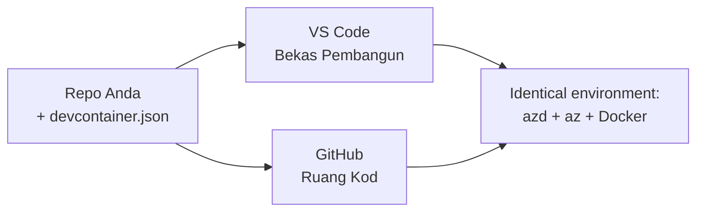

# Dev Containers & GitHub Codespaces untuk azd

**Navigasi Bab:**
- **📚 Laman Utama Kursus**: [AZD Untuk Pemula](../../README.md)
- **📖 Bab Semasa**: Bab 1 - Asas & Mula Pantas
- **⬅️ Sebelumnya**: [Bawa Aplikasi Anda Sendiri](bring-your-own-app.md)
- **🚀 Bab Seterusnya**: [Bab 2: Pembangunan AI-Pertama](../chapter-02-ai-development/README.md)

> Disahkan dengan `azd 1.27.1` pada Julai 2026.

## Pengenalan

Memasang azd, runtime bahasa yang betul, Docker, dan Azure CLI pada setiap mesin adalah satu kerja yang memenatkan—dan ia adalah sebab utama tutorial "berfungsi pada mesin saya" gagal untuk orang lain. **Dev container** menyelesaikan ini dengan menerangkan keseluruhan rantai alat anda dalam satu fail. Sesiapa yang membuka projek dalam VS Code atau GitHub Codespaces mendapat persekitaran yang sama tepat, dengan azd sudah dipasang. Pelajaran ini menunjukkan cara untuk menambah satu.

## Matlamat Pembelajaran

Pada akhir pelajaran ini, anda akan:
- Memahami apa itu dev container dan mengapa ia membantu dengan azd
- Menambah `.devcontainer/devcontainer.json` yang minimal pada projek
- Menyertakan azd, Azure CLI, dan Docker melalui *features* Dev Container
- Membuka projek dalam GitHub Codespaces atau VS Code

## Hasil Pembelajaran

Selepas menamatkan pelajaran ini, anda akan mampu:
- Mengarang `devcontainer.json` untuk projek azd
- Menambah azd dan alat Azure tanpa pemasangan manual
- Menjalankan `azd up` dari dalam container atau Codespace

---

## Apa Itu Dev Container?

Dev container adalah persekitaran pembangunan berasaskan Docker yang ditakrifkan oleh fail `.devcontainer/devcontainer.json` dalam repositori anda. Apabila anda membuka projek:

- **VS Code** (dengan sambungan Dev Containers) membina container dan menyambung kepadanya.
- **GitHub Codespaces** membina container yang sama di awan dan memberikan anda penyunting berasaskan penyemak imbas.

Sama ada cara, setiap penyumbang mendapat alat yang serupa—tidak perlu penyelesaian masalah "adakah anda memasang azd?".



---

## Langkah 1: Cipta Fail devcontainer

Cipta `.devcontainer/devcontainer.json` di akar projek anda:

```json
{
  "name": "azd-project",
  "image": "mcr.microsoft.com/devcontainers/base:bookworm",
  "features": {
    "ghcr.io/devcontainers/features/azure-cli:1": {},
    "ghcr.io/azure/azure-dev/azd:latest": {},
    "ghcr.io/devcontainers/features/docker-in-docker:2": {},
    "ghcr.io/devcontainers/features/node:1": {}
  },
  "customizations": {
    "vscode": {
      "extensions": [
        "ms-azuretools.azure-dev",
        "ms-azuretools.vscode-bicep"
      ]
    }
  },
  "forwardPorts": [3000],
  "postCreateCommand": "azd version"
}
```

Apa yang setiap bahagian lakukan:

| Kekunci | Tujuan |
|-----|---------|
| `image` | OS asas untuk container |
| `features` | Pemasang pra-bina—di sini: Azure CLI, **azd**, Docker, dan Node.js |
| `customizations.vscode.extensions` | Memasang automatik sambungan azd dan Bicep untuk VS Code |
| `forwardPorts` | Mendedahkan port aplikasi anda ke penyemak imbas anda |
| `postCreateCommand` | Menjalankan sekali selepas container dibina (di sini, satu pemeriksaan kewarasan) |

> Ciri `ghcr.io/azure/azure-dev/azd:latest` adalah cara rasmi untuk mendapatkan azd dalam container. Pin versi tertentu (contoh `azd:1.27.1`) jika anda memerlukan kebolehulangan.

---

## Langkah 2: Padankan Ciri dengan Bahasa Aplikasi Anda

Gantikan ciri `node` dengan apa sahaja yang digunakan oleh aplikasi anda:

```jsonc
// Python project
"ghcr.io/devcontainers/features/python:1": {},

// .NET project
"ghcr.io/devcontainers/features/dotnet:2": {},

// Java project
"ghcr.io/devcontainers/features/java:1": {},

// Go project
"ghcr.io/devcontainers/features/go:1": {}
```

Kekalkan `docker-in-docker` jika `host` anda ialah `containerapp`, `aks`, atau apa sahaja yang membina imej container—azd memerlukan Docker untuk membina dan menolak imej.

---

## Langkah 3: Buka Ia

**Dalam VS Code:**
1. Pasang sambungan **Dev Containers**.
2. Buka folder projek.
3. Klik **Reopen in Container** apabila diminta (atau jalankan *Dev Containers: Reopen in Container*).

**Dalam GitHub Codespaces:**
1. Tolak repo ke GitHub.
2. Klik **Code → Codespaces → Create codespace on main**.
3. Tunggu sehingga container dibina—azd sudah sedia dalam terminal.

---

## Langkah 4: Hantar Dari Dalam Container

Container sudah memasang azd, jadi aliran kerja biasa berfungsi:

```bash
azd auth login --use-device-code   # kod peranti sangat berguna di dalam Codespaces
azd up
```

> **Kenapa `--use-device-code`?** Dalam container jauh atau Codespace, tiada pelayar tempatan untuk dialihkan, jadi log masuk kod peranti adalah jalan yang boleh dipercayai. Anda akan tampal kod ke tab pelayar untuk melengkapkan log masuk.

---

## Kesilapan Biasa

| Kesilapan | Penyelesaian |
|---------|-----------|
| `azd up` tidak boleh membina imej | Tambah ciri `docker-in-docker` |
| Log masuk pelayar tersekat dalam Codespaces | Gunakan `azd auth login --use-device-code` |
| Alat berbeza antara rakan sekerja | Pin versi ciri (contohnya `azd:1.27.1`) |
| Aplikasi tidak boleh dicapai dalam pelayar | Tambah port ke `forwardPorts` |

---

## Ringkasan

- Dev container menjadikan rantai alat azd anda boleh dihasilkan semula untuk semua orang.
- Tambah azd, Azure CLI, dan Docker melalui *features* Dev Container.
- Padankan ciri bahasa dengan aplikasi anda dan kekalkan `docker-in-docker` untuk hos container.
- Gunakan log masuk kod peranti apabila menjalankan dalam Codespaces.

---

## 🔗 Navigasi

| Arah | Sumber |
|-------|---------|
| **Sebelumnya** | [Bawa Aplikasi Anda Sendiri](bring-your-own-app.md) |
| **Laman Bab** | [Bab 1: Asas & Mula Pantas](README.md) |
| **Bab Seterusnya** | [Bab 2: Pembangunan AI-Pertama](../chapter-02-ai-development/README.md) |

## 📖 Sumber Berkaitan

- [Pemasangan & Penetapan](installation.md)
- [Lembaran Lencana Perintah](../../resources/cheat-sheet.md)
- [Spesifikasi Rasmi Dev Containers](https://containers.dev/)
- [Ciri Dev Container azd](https://github.com/Azure/azure-dev/tree/main/ext/devcontainer)

---

<!-- CO-OP TRANSLATOR DISCLAIMER START -->
**Penafian**:
Dokumen ini telah diterjemahkan menggunakan perkhidmatan terjemahan AI [Co-op Translator](https://github.com/Azure/co-op-translator). Walaupun kami berusaha untuk ketepatan, sila ambil maklum bahawa terjemahan automatik mungkin mengandungi kesilapan atau ketidaktepatan. Dokumen asal dalam bahasa asalnya harus dianggap sebagai sumber yang sahih. Untuk maklumat penting, terjemahan oleh manusia profesional adalah disyorkan. Kami tidak bertanggungjawab terhadap sebarang salah faham atau salah tafsir yang timbul daripada penggunaan terjemahan ini.
<!-- CO-OP TRANSLATOR DISCLAIMER END -->