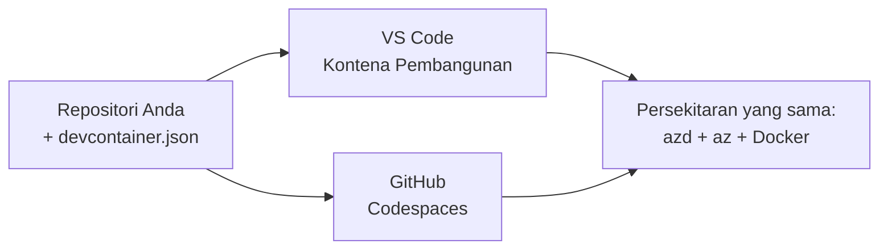

# Bekas Pembangunan & GitHub Codespaces untuk azd

**Navigasi Bab:**
- **📚 Laman Utama Kursus**: [AZD Untuk Pemula](../../README.md)
- **📖 Bab Semasa**: Bab 1 - Asas & Panduan Pantas
- **⬅️ Sebelumnya**: [Bawa Aplikasi Anda](bring-your-own-app.md)
- **🚀 Bab Seterusnya**: [Bab 2: Pembangunan Berfokus AI](../chapter-02-ai-development/README.md)

> Disahkan terhadap `azd 1.25.6` pada Jun 2026.

## Pengenalan

Memasang azd, runtime bahasa yang betul, Docker, dan Azure CLI pada setiap mesin adalah satu kerja—dan ia adalah sebab nombor satu mengapa tutorial yang "berfungsi pada mesin saya" gagal untuk orang lain. Satu **dev container** menyelesaikan ini dengan menerangkan keseluruhan rangkaian alat anda dalam satu fail. Sesiapa sahaja yang membuka projek dalam VS Code atau GitHub Codespaces mendapat persekitaran yang sama tepat, dengan azd telah dipasang. Pelajaran ini menunjukkan cara menambah satu.

## Matlamat Pembelajaran

Menjelang akhir pelajaran ini, anda akan:
- Memahami apa itu dev container dan mengapa ia membantu dengan azd
- Tambah fail `.devcontainer/devcontainer.json` yang minimal ke dalam projek
- Sertakan azd, Azure CLI, dan Docker melalui *ciri* Dev Container
- Buka projek dalam GitHub Codespaces atau VS Code

## Hasil Pembelajaran

Selepas menyelesaikan pelajaran ini, anda akan dapat:
- Menulis `devcontainer.json` untuk projek azd
- Menambah azd dan alat Azure tanpa pemasangan manual
- Jalankan `azd up` dari dalam bekas atau Codespace

---

## Apa itu Dev Container?

Satu dev container ialah persekitaran pembangunan berasaskan Docker yang ditakrifkan oleh fail `.devcontainer/devcontainer.json` dalam repositori anda. Apabila anda membuka projek:

- **VS Code** (dengan sambungan Dev Containers) membina bekas dan menyambung kepadanya.
- **GitHub Codespaces** membina bekas yang sama di awan dan memberi anda penyunting berasaskan pelayar.

Dalam kedua-dua cara, setiap penyumbang mendapat alat yang sama—tiada lagi masalah "adakah anda memasang azd?".



---

## Langkah 1: Cipta fail devcontainer

Cipta `.devcontainer/devcontainer.json` di akar projek anda:

```json
{
  "name": "azd-project",
  "image": "mcr.microsoft.com/devcontainers/base:bookworm",
  "features": {
    "ghcr.io/devcontainers/features/azure-cli:1": {},
    "ghcr.io/azure/azure-dev/azd:latest": {},
    "ghcr.io/devcontainers/features/docker-in-docker:2": {},
    "ghcr.io/devcontainers/features/node:1": {}
  },
  "customizations": {
    "vscode": {
      "extensions": [
        "ms-azuretools.azure-dev",
        "ms-azuretools.vscode-bicep"
      ]
    }
  },
  "forwardPorts": [3000],
  "postCreateCommand": "azd version"
}
```

Apa fungsi setiap bahagian:

| Kunci | Tujuan |
|-----|---------|
| `image` | Sistem operasi asas untuk bekas |
| `features` | Pemasang pra-binaan—di sini: Azure CLI, **azd**, Docker, dan Node.js |
| `customizations.vscode.extensions` | Memasang secara automatik sambungan azd dan Bicep untuk VS Code |
| `forwardPorts` | Mendedahkan port aplikasi anda kepada pelayar anda |
| `postCreateCommand` | Dijalankan sekali selepas bekas dibina (di sini, semakan kesihatan) |

> Ciri `ghcr.io/azure/azure-dev/azd:latest` ialah cara rasmi untuk mendapatkan azd dalam bekas. Kunci versi tertentu (contohnya `azd:1.25.6`) jika anda memerlukan keterulangan.

---

## Langkah 2: Padankan Ciri kepada Bahasa Aplikasi Anda

Tukar ciri `node` kepada apa sahaja yang digunakan aplikasi anda:

```jsonc
// Python project
"ghcr.io/devcontainers/features/python:1": {},

// .NET project
"ghcr.io/devcontainers/features/dotnet:2": {},

// Java project
"ghcr.io/devcontainers/features/java:1": {},

// Go project
"ghcr.io/devcontainers/features/go:1": {}
```

Kekalkan `docker-in-docker` jika `host` anda ialah `containerapp`, `aks`, atau apa-apa yang membina imej bekas—azd memerlukan Docker untuk membina dan mendorong imej.

---

## Langkah 3: Buka Ia

**Dalam VS Code:**
1. Pasang sambungan **Dev Containers**.
2. Buka folder projek.
3. Klik **Reopen in Container** apabila diminta (atau jalankan *Dev Containers: Reopen in Container*).

**Dalam GitHub Codespaces:**
1. Tolak repo ke GitHub.
2. Klik **Code → Codespaces → Create codespace on main**.
3. Tunggu bekas dibina—azd sedia dalam terminal.

---

## Langkah 4: Terbitkan Dari Dalam Bekas

Bekas mempunyai azd yang telah dipasang, jadi aliran kerja biasa berfungsi terus:

```bash
azd auth login --use-device-code   # kod peranti berguna dalam Codespaces
azd up
```

> **Mengapa `--use-device-code`?** Dalam bekas jauh atau Codespace tiada pelayar tempatan untuk dialihkan, jadi log masuk berasaskan kod peranti adalah jalan yang boleh dipercayai. Anda akan menampal kod ke tab pelayar untuk menyelesaikan log masuk.

---

## Masalah Lazim

| Masalah | Pembetulan |
|---------|-----|
| `azd up` can't build an image | Tambah ciri `docker-in-docker` |
| Browser login hangs in Codespaces | Use `azd auth login --use-device-code` |
| Tools differ between teammates | Kunci versi ciri (contohnya `azd:1.25.6`) |
| App not reachable in browser | Tambah port ke `forwardPorts` |

---

## Ringkasan

- Satu dev container menjadikan rangkaian alat azd anda boleh dihasilkan semula untuk semua orang.
- Tambah azd, Azure CLI, dan Docker melalui *ciri* Dev Container.
- Padankan ciri bahasa kepada aplikasi anda dan kekalkan `docker-in-docker` untuk hos bekas.
- Gunakan log masuk berasaskan kod peranti apabila berjalan dalam Codespaces.

---

## 🔗 Navigasi

| Arah | Sumber |
|-----------|----------|
| **Sebelumnya** | [Bawa Aplikasi Anda](bring-your-own-app.md) |
| **Laman Bab** | [Bab 1: Asas & Panduan Pantas](README.md) |
| **Bab Seterusnya** | [Bab 2: Pembangunan Berfokus AI](../chapter-02-ai-development/README.md) |

## 📖 Sumber Berkaitan

- [Pemasangan & Persediaan](installation.md)
- [Lembaran Rujukan Perintah](../../resources/cheat-sheet.md)
- [Spesifikasi Rasmi Dev Containers](https://containers.dev/)
- [Ciri Dev Container azd](https://github.com/Azure/azure-dev/tree/main/ext/devcontainer)

---

<!-- CO-OP TRANSLATOR DISCLAIMER START -->
**Penafian**:
Dokumen ini telah diterjemahkan menggunakan perkhidmatan terjemahan AI [Co-op Translator](https://github.com/Azure/co-op-translator). Walaupun kami berusaha untuk ketepatan, sila ambil maklum bahawa terjemahan automatik mungkin mengandungi kesilapan atau ketidaktepatan. Dokumen asal dalam bahasa asalnya harus dianggap sebagai sumber yang sahih. Untuk maklumat penting, terjemahan oleh manusia profesional adalah disyorkan. Kami tidak bertanggungjawab terhadap sebarang salah faham atau salah tafsir yang timbul daripada penggunaan terjemahan ini.
<!-- CO-OP TRANSLATOR DISCLAIMER END -->