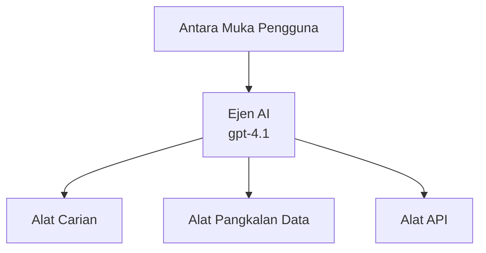
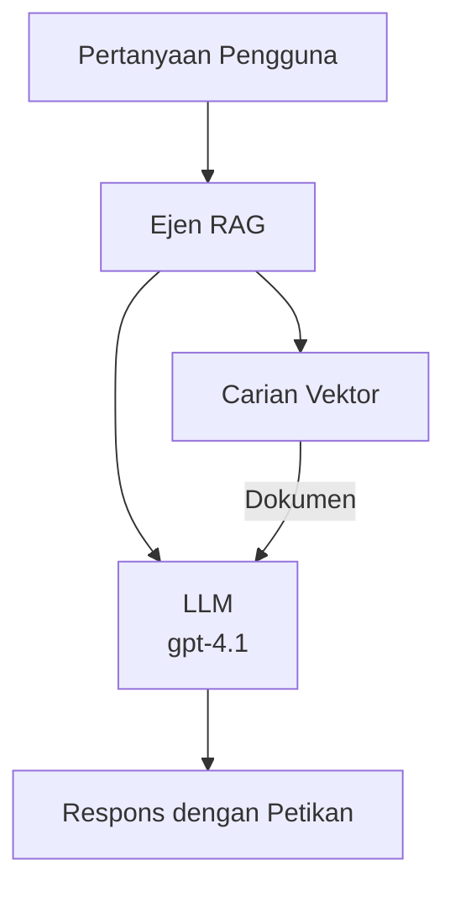
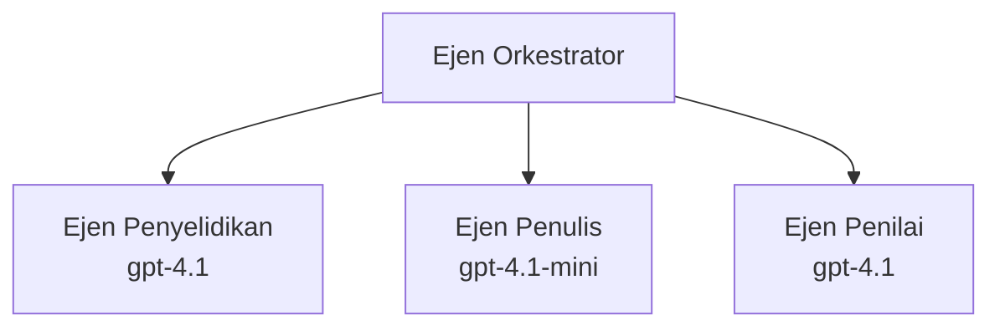

# Ejen AI dengan Azure Developer CLI

**Navigasi Bab:**
- **📚 Laman Utama Kursus**: [AZD Untuk Pemula](../../README.md)
- **📖 Bab Semasa**: Bab 2 - Pembangunan AI-Pertama
- **⬅️ Sebelumnya**: [Integrasi Microsoft Foundry](microsoft-foundry-integration.md)
- **➡️ Seterusnya**: [Penggandaan Model AI](ai-model-deployment.md)
- **🚀 Lanjutan**: [Penyelesaian Multi-Ejen](../../examples/retail-scenario.md)

---

## Pengenalan

Ejen AI adalah program autonomi yang boleh memahami persekitarannya, membuat keputusan, dan mengambil tindakan untuk mencapai matlamat tertentu. Berbeza dengan chatbot ringkas yang hanya memberi respon kepada arahan, ejen boleh:

- **Menggunakan alat** - Memanggil API, mencari dalam pangkalan data, melaksanakan kod
- **Merancang dan berfikir** - Memecahkan tugasan rumit kepada langkah-langkah
- **Belajar dari konteks** - Mengekalkan memori dan menyesuaikan tingkah laku
- **Bekerjasama** - Bekerja dengan ejen lain (sistem multi-ejen)

Panduan ini menunjukkan cara anda mengendalikan ejen AI ke Azure menggunakan Azure Developer CLI (azd).

> **Nota Pengesahan (2026-03-25):** Panduan ini telah disemak menggunakan `azd` `1.23.12` dan `azure.ai.agents` `0.1.18-preview`. Pengalaman `azd ai` masih dalam peringkat pratonton, jadi semak bantuan sambungan jika pilihan yang dipasang berbeza.

## Matlamat Pembelajaran

Dengan menyelesaikan panduan ini, anda akan:
- Memahami apa itu ejen AI dan perbezaannya dengan chatbot
- Mengendalikan templat ejen AI yang telah dibina menggunakan AZD
- Mengkonfigurasi Foundry Agents untuk ejen tersuai
- Melaksanakan corak ejen asas (penggunaan alat, RAG, multi-ejen)
- Memantau dan menyahpepijat ejen yang telah dihantar

## Hasil Pembelajaran

Setelah selesai, anda akan dapat:
- Mengendalikan aplikasi ejen AI ke Azure dengan satu perintah
- Mengkonfigurasi alat dan kebolehan ejen
- Melaksanakan generasi dipertingkatkan pengambilan (RAG) dengan ejen
- Mereka bentuk arkitektur multi-ejen untuk aliran kerja kompleks
- Menyelesaikan masalah biasa pengendalian ejen

---

## 🤖 Apa Yang Membezakan Ejen dengan Chatbot?

| Ciri | Chatbot | Ejen AI |
|---------|---------|----------|
| **Tingkah Laku** | Memberi respon kepada arahan | Mengambil tindakan secara autonomi |
| **Alat** | Tiada | Boleh memanggil API, mencari, melaksanakan kod |
| **Memori** | Hanya berasaskan sesi | Memori berterusan antara sesi |
| **Perancangan** | Respon tunggal | Pemikiran berbilang langkah |
| **Kerjasama** | Entiti tunggal | Boleh bekerjasama dengan ejen lain |

### Analogi Mudah

- **Chatbot** = Seorang yang membantu menjawab soalan di kaunter maklumat
- **Ejen AI** = Pembantu peribadi yang boleh membuat panggilan, menempah janji dan menyiapkan tugasan untuk anda

---

## 🚀 Mula Pantas: Hantar Ejen Pertama Anda

### Pilihan 1: Templat Foundry Agents (Disyorkan)

```bash
# Inisialisasi templat ejen AI
azd init --template get-started-with-ai-agents

# Lancarkan ke Azure
azd up
```

**Apa yang dihantar:**
- ✅ Foundry Agents
- ✅ Microsoft Foundry Models (gpt-4.1)
- ✅ Azure AI Search (untuk RAG)
- ✅ Azure Container Apps (antaramuka web)
- ✅ Application Insights (pemantauan)

**Masa:** ~15-20 minit  
**Kos:** ~$100-150/bulan (pembangunan)

### Pilihan 2: Ejen OpenAI dengan Prompty

```bash
# Inisialisasi templat ejen berasaskan Prompty
azd init --template agent-openai-python-prompty

# Terapkan ke Azure
azd up
```

**Apa yang dihantar:**
- ✅ Azure Functions (pelaksanaan ejen tanpa pelayan)
- ✅ Microsoft Foundry Models
- ✅ Fail konfigurasi Prompty
- ✅ Pelaksanaan contoh ejen

**Masa:** ~10-15 minit  
**Kos:** ~$50-100/bulan (pembangunan)

### Pilihan 3: Ejen RAG Chat

```bash
# Mula templat sembang RAG
azd init --template azure-search-openai-demo

# Sebarkan ke Azure
azd up
```

**Apa yang dihantar:**
- ✅ Microsoft Foundry Models
- ✅ Azure AI Search dengan data contoh
- ✅ Saluran pemprosesan dokumen
- ✅ Antaramuka chat dengan rujukan

**Masa:** ~15-25 minit  
**Kos:** ~$80-150/bulan (pembangunan)

### Pilihan 4: AZD AI Agent Init (Pratonton Berdasarkan Manifest atau Templat)

Jika anda mempunyai fail manifest ejen, anda boleh menggunakan arahan `azd ai` untuk memulakan projek Foundry Agent Service secara langsung. Siaran pratonton terkini juga menambah sokongan inisialisasi berasaskan templat, jadi aliran prompt mungkin sedikit berbeza bergantung pada versi sambungan yang dipasang.

```bash
# Pasang sambungan ejen AI
azd extension install azure.ai.agents

# Pilihan: sahkan versi pratonton yang dipasang
azd extension show azure.ai.agents

# Inisialisasi dari manifest ejen
azd ai agent init -m agent-manifest.yaml

# Lancarkan ke Azure
azd up

# Uji ejen yang dilancarkan (menunjukkan kelewatan + masa ke bait pertama)
azd ai agent invoke
```

**Bilakah menggunakan `azd ai agent init` berbanding `azd init --template`:**

| Pendekatan | Sesuai Untuk | Cara Kerja |
|----------|----------|------|
| `azd init --template` | Bermula dari contoh aplikasi yang berfungsi | Menyalin repo templat penuh dengan kod + infrastruktur |
| `azd ai agent init -m` | Membina dari manifest ejen sendiri | Membina struktur projek berdasarkan definisi ejen anda |

> **Tip:** Gunakan `azd init --template` semasa belajar (Pilihan 1-3 di atas). Gunakan `azd ai agent init` bila membina ejen produksi dengan manifest sendiri.

Setelah `azd up`, sambungan yang sama membimbing anda menguruskan kitaran hayat ejen: `azd ai agent invoke` untuk ujian, `azd ai agent eval generate` dan `azd ai agent optimize` untuk mengukur dan meningkatkan kualiti, dan `azd ai agent delete` untuk pembersihan. Lihat [Perintah AZD AI CLI](../chapter-08-production/production-ai-practices.md#azd-ai-cli-commands-and-extensions) untuk rujukan penuh.

---

## 🏗️ Corak Seni Bina Ejen

### Corak 1: Ejen Tunggal dengan Alat

Corak ejen paling mudah - satu ejen yang boleh menggunakan berbilang alat.



**Sesuai untuk:**
- Bot sokongan pelanggan
- Pembantu penyelidikan
- Ejen analisis data

**Templat AZD:** `azure-search-openai-demo`

### Corak 2: Ejen RAG (Generasi Dipertingkatkan Pengambilan)

Ejen yang mengambil dokumen relevan sebelum menjana respons.



**Sesuai untuk:**
- Pangkalan pengetahuan perusahaan
- Sistem soal jawab dokumen
- Penyelidikan pematuhan dan undang-undang

**Templat AZD:** `azure-search-openai-demo`

### Corak 3: Sistem Multi-Ejen

Banyak ejen khusus bekerja bersama dalam tugasan kompleks.



**Sesuai untuk:**
- Penjanaan kandungan kompleks
- Aliran kerja berbilang langkah
- Tugasan memerlukan kepakaran berlainan

**Pelajari Lebih Lanjut:** [Corak Penyelarasan Multi-Ejen](../chapter-06-pre-deployment/coordination-patterns.md)

---

## ⚙️ Mengkonfigurasi Alat Ejen

Ejen menjadi berkuasa apabila boleh menggunakan alat. Berikut cara mengkonfigurasi alat umum:

### Konfigurasi Alat dalam Foundry Agents

```python
# agent_config.py
from azure.ai.projects import AIProjectClient
from azure.ai.projects.models import FunctionTool, CodeInterpreterTool

# Tetapkan alat tersuai
search_tool = FunctionTool(
    name="search_knowledge_base",
    description="Search the company knowledge base for relevant documents",
    parameters={
        "type": "object",
        "properties": {
            "query": {
                "type": "string",
                "description": "The search query"
            }
        },
        "required": ["query"]
    }
)

# Cipta ejen dengan alat
agent = project_client.agents.create_agent(
    model="gpt-4.1",
    name="Support Agent",
    instructions="You are a helpful support agent. Use the search tool to find relevant information.",
    tools=[search_tool, CodeInterpreterTool()]
)
```

### Konfigurasi Persekitaran

```bash
# Tetapkan pembolehubah persekitaran khusus ejen
azd env set AZURE_OPENAI_MODEL "gpt-4.1"
azd env set AGENT_INSTRUCTIONS "You are a helpful assistant..."
azd env set ENABLE_CODE_INTERPRETER "true"
azd env set ENABLE_FILE_SEARCH "true"

# Lancarkan dengan konfigurasi yang dikemas kini
azd deploy
```

---

## 📊 Memantau Ejen

### Integrasi Application Insights

Semua templat ejen AZD termasuk Application Insights untuk pemantauan:

```bash
# Buka papan pemuka pemantauan
azd monitor --overview

# Lihat log langsung
azd monitor --logs

# Lihat metrik langsung
azd monitor --live
```

### Metrik Utama untuk Dipantau

| Metrik | Penerangan | Sasaran |
|--------|-------------|--------|
| Kelambatan Respon | Masa untuk menjana jawapan | < 5 saat |
| Penggunaan Token | Token setiap permintaan | Pantau untuk kos |
| Kadar Kejayaan Panggilan Alat | % kejayaan pelaksanaan alat | > 95% |
| Kadar Ralat | Permintaan ejen gagal | < 1% |
| Kepuasan Pengguna | Skor maklum balas | > 4.0/5.0 |

### Log Khusus untuk Ejen

```python
import os
from azure.monitor.opentelemetry import configure_azure_monitor
from opentelemetry import trace

# Konfigurasikan Azure Monitor dengan OpenTelemetry
configure_azure_monitor(
    connection_string=os.environ["APPLICATIONINSIGHTS_CONNECTION_STRING"]
)

tracer = trace.get_tracer(__name__)

def log_agent_interaction(user_query, agent_response, tools_used, latency_ms):
    with tracer.start_as_current_span("agent_interaction") as span:
        span.set_attributes({
            "user_query": user_query,
            "response_length": len(agent_response),
            "tools_used": tools_used,
            "latency_ms": latency_ms
        })
```

> **Nota:** Pasang pakej yang diperlukan: `pip install azure-monitor-opentelemetry opentelemetry`

---

## 💰 Pertimbangan Kos

### Anggaran Kos Bulanan Mengikut Corak

| Corak | Persekitaran Dev | Produksi |
|---------|-----------------|------------|
| Ejen Tunggal | $50-100 | $200-500 |
| Ejen RAG | $80-150 | $300-800 |
| Multi-Ejen (2-3 ejen) | $150-300 | $500-1,500 |
| Multi-Ejen Perusahaan | $300-500 | $1,500-5,000+ |

### Tip Pengoptimuman Kos

1. **Gunakan gpt-4.1-mini untuk tugasan mudah**
   ```bash
   azd env set AZURE_OPENAI_MODEL "gpt-4.1-mini"
   ```

2. **Laksanakan caching untuk pertanyaan berulang**
   ```python
   from functools import lru_cache
   
   @lru_cache(maxsize=1000)
   def get_cached_response(query_hash):
       return agent.run(query_hash)
   ```

3. **Tetapkan had token setiap larian**
   ```python
   # Tetapkan max_completion_tokens semasa menjalankan agen, bukan semasa penciptaan
   run = project_client.agents.create_run(
       thread_id=thread.id,
       agent_id=agent.id,
       max_completion_tokens=1000  # Hadkan panjang respons
   )
   ```

4. **Skalakan ke sifar bila tidak digunakan**
   ```bash
   # Apl Kontena secara automatik skala ke sifar
   azd env set MIN_REPLICAS "0"
   ```

---

## 🔧 Penyelesaian Masalah Ejen

### Isu Biasa dan Penyelesaian

<details>
<summary><strong>❌ Ejen tidak memberi respon terhadap panggilan alat</strong></summary>

```bash
# Periksa jika alat telah didaftarkan dengan betul
azd show

# Sahkan penempatan OpenAI
az cognitiveservices account deployment list \
  --name $AZURE_OPENAI_NAME \
  --resource-group $RG_NAME

# Periksa log ejen
azd monitor --logs
```

**Punca biasa:**
- Tandatangan fungsi alat tidak sesuai
- Kebenaran diperlukan tidak disediakan
- Titik akhir API tidak dapat diakses
</details>

<details>
<summary><strong>❌ Kelambatan tinggi dalam respons ejen</strong></summary>

```bash
# Semak Application Insights untuk kesesakan
azd monitor --live

# Pertimbangkan menggunakan model yang lebih pantas
azd env set AZURE_OPENAI_MODEL "gpt-4.1-mini"
azd deploy
```

**Tip pengoptimuman:**
- Gunakan respons streaming
- Laksanakan caching respons
- Kurangkan saiz jendela konteks
</details>

<details>
<summary><strong>❌ Ejen memulangkan maklumat salah atau halusinasi</strong></summary>

```python
# Tingkatkan dengan arahan sistem yang lebih baik
instructions = """
You are a helpful assistant. IMPORTANT:
- Only answer based on provided context
- If you don't know, say "I don't know"
- Always cite your sources
- Never make up information
"""

# Tambahkan pengambilan untuk pemantapan
agent = project_client.agents.create_agent(
    model="gpt-4.1",
    instructions=instructions,
    tools=[FileSearchTool()]  # Letakkan jawapan dalam dokumen
)
```
</details>

<details>
<summary><strong>❌ Ralat had token melebihi</strong></summary>

```python
# Laksanakan pengurusan tetingkap konteks
def truncate_context(messages, max_tokens=8000, model="gpt-4.1"):
    """Keep only recent messages within token limit."""
    import tiktoken
    encoding = tiktoken.encoding_for_model(model)
    total_tokens = 0
    truncated = []
    
    for msg in reversed(messages):
        msg_tokens = len(encoding.encode(msg.content))
        if total_tokens + msg_tokens > max_tokens:
            break
        truncated.insert(0, msg)
        total_tokens += msg_tokens
    
    return truncated
```
</details>

---

## 🎓 Latihan Praktikal

### Latihan 1: Hantar Ejen Asas (20 minit)

**Matlamat:** Hantar ejen AI pertama anda menggunakan AZD

```bash
# Langkah 1: Mulakan templat
azd init --template get-started-with-ai-agents

# Langkah 2: Log masuk ke Azure
azd auth login
# Jika anda bekerja merentasi penyewa, tambahkan --tenant-id <tenant-id>

# Langkah 3: Sebarkan
azd up

# Langkah 4: Uji agen
# Output yang dijangka selepas penyebaran:
#   Penyebaran Selesai!
#   Titik akhir: https://<nama-aplikasi>.<rantau>.azurecontainerapps.io
# Buka URL yang ditunjukkan dalam output dan cuba tanya soalan

# Langkah 5: Lihat pemantauan
azd monitor --overview

# Langkah 6: Bersihkan
azd down --force --purge
```

**Kriteria Kejayaan:**
- [ ] Ejen memberi respon kepada soalan
- [ ] Boleh mengakses papan pemuka pemantauan melalui `azd monitor`
- [ ] Sumber dibersihkan dengan jayanya

### Latihan 2: Tambah Alat Tersuai (30 minit)

**Matlamat:** Kembangkan ejen dengan alat tersuai

1. Hantar templat ejen:
   ```bash
   azd init --template get-started-with-ai-agents
   azd up
   ```
2. Cipta fungsi alat baru dalam kod ejen anda:
   ```python
   def get_weather(location: str) -> str:
       """Get current weather for a location."""
       # Panggilan API ke perkhidmatan cuaca
       return f"Weather in {location}: Sunny, 72°F"
   ```
3. Daftar alat dengan ejen:
   ```python
   from azure.ai.projects.models import FunctionTool

   weather_tool = FunctionTool(
       name="get_weather",
       description="Get current weather for a location",
       parameters={
           "type": "object",
           "properties": {
               "location": {"type": "string", "description": "City name"}
           },
           "required": ["location"]
       }
   )

   agent = project_client.agents.create_agent(
       model="gpt-4.1",
       name="Weather Agent",
       tools=[weather_tool]
   )
   ```
4. Hantar semula dan uji:
   ```bash
   azd deploy
   # Tanya: "Apa cuaca di Seattle?"
   # Dijangka: Ejen memanggil get_weather("Seattle") dan mengembalikan maklumat cuaca
   ```

**Kriteria Kejayaan:**
- [ ] Ejen mengenal pertanyaan berkaitan cuaca
- [ ] Alat dipanggil dengan betul
- [ ] Respon mengandungi maklumat cuaca

### Latihan 3: Bina Ejen RAG (45 minit)

**Matlamat:** Buat ejen yang menjawab soalan daripada dokumen anda

```bash
# Langkah 1: Terapkan templat RAG
azd init --template azure-search-openai-demo
azd up

# Langkah 2: Muat naik dokumen anda
# Letakkan fail PDF/TXT dalam direktori data/, kemudian jalankan:
python scripts/prepdocs.py

# Langkah 3: Uji dengan soalan khusus domain
# Buka URL aplikasi web dari output azd up
# Tanyakan soalan tentang dokumen yang anda muat naik
# Respons harus termasuk rujukan sitasi seperti [doc.pdf]
```

**Kriteria Kejayaan:**
- [ ] Ejen menjawab dari dokumen yang dimuat naik
- [ ] Respon termasuk rujukan
- [ ] Tiada halusinasi untuk soalan di luar skop

---

## 📚 Langkah Seterusnya

Sekarang anda faham ejen AI, terokai topik lanjutan ini:

| Topik | Penerangan | Pautan |
|-------|-------------|------|
| **Sistem Multi-Ejen** | Bina sistem dengan pelbagai ejen bekerjasama | [Contoh Multi-Ejen Runcit](../../examples/retail-scenario.md) |
| **Corak Penyelarasan** | Pelajari corak orkestrasi dan komunikasi | [Corak Penyelarasan](../chapter-06-pre-deployment/coordination-patterns.md) |
| **Penggandaan Produksi** | Penghantaran ejen bersedia perusahaan | [Amalan AI Produksi](../chapter-08-production/production-ai-practices.md) |
| **Penilaian Ejen** | Uji dan nilaikan prestasi ejen | [Penyelesaian Masalah AI](../chapter-07-troubleshooting/ai-troubleshooting.md) |
| **Makmal Bengkel AI** | Latihan praktikal: Jadikan solusi AI anda bersedia AZD | [Makmal Bengkel AI](ai-workshop-lab.md) |

---

## 📖 Sumber Tambahan

### Dokumentasi Rasmi
- [Microsoft Foundry Agent Service](https://learn.microsoft.com/azure/ai-services/agents/)
- [Microsoft Foundry Agent Service Panduan Pantas](https://learn.microsoft.com/azure/ai-services/agents/quickstart)
- [Framework Ejen Semantic Kernel](https://learn.microsoft.com/semantic-kernel/)

### Templat AZD untuk Ejen
- [Mulakan dengan Ejen AI](https://github.com/Azure-Samples/get-started-with-ai-agents)
- [Agent OpenAI Python Prompty](https://github.com/Azure-Samples/agent-openai-python-prompty)
- [Azure Search OpenAI Demo](https://github.com/Azure-Samples/azure-search-openai-demo)

### Sumber Komuniti
- [Awesome AZD - Templat Ejen](https://azure.github.io/awesome-azd/?tags=ai-agents)
- [Azure AI Discord](https://discord.gg/microsoft-azure)
- [Microsoft Foundry Discord](https://discord.gg/nTYy5BXMWG)

### Kemahiran Ejen untuk Penyunting Anda
- [**Kemahiran Ejen Microsoft Azure**](https://skills.sh/microsoft/github-copilot-for-azure) - Pasang kemahiran ejen AI guna semula untuk pembangunan Azure dalam GitHub Copilot, Cursor, atau mana-mana ejen yang disokong. Termasuk kemahiran untuk [Azure AI](https://skills.sh/microsoft/github-copilot-for-azure/azure-ai), [Microsoft Foundry](https://skills.sh/microsoft/github-copilot-for-azure/microsoft-foundry), [penggandaan](https://skills.sh/microsoft/github-copilot-for-azure/azure-deploy), dan [diagnostik](https://skills.sh/microsoft/github-copilot-for-azure/azure-diagnostics):
  ```bash
  npx skills add microsoft/github-copilot-for-azure
  ```

---

**Navigasi**
- **Pelajaran Sebelumnya**: [Integrasi Microsoft Foundry](microsoft-foundry-integration.md)
- **Pelajaran Seterusnya**: [Penggandaan Model AI](ai-model-deployment.md)

---

<!-- CO-OP TRANSLATOR DISCLAIMER START -->
**Penafian**:
Dokumen ini telah diterjemahkan menggunakan perkhidmatan terjemahan AI [Co-op Translator](https://github.com/Azure/co-op-translator). Walaupun kami berusaha untuk ketepatan, sila ambil maklum bahawa terjemahan automatik mungkin mengandungi kesilapan atau ketidaktepatan. Dokumen asal dalam bahasa asalnya harus dianggap sebagai sumber yang sahih. Untuk maklumat penting, terjemahan oleh manusia profesional adalah disyorkan. Kami tidak bertanggungjawab terhadap sebarang salah faham atau salah tafsir yang timbul daripada penggunaan terjemahan ini.
<!-- CO-OP TRANSLATOR DISCLAIMER END -->