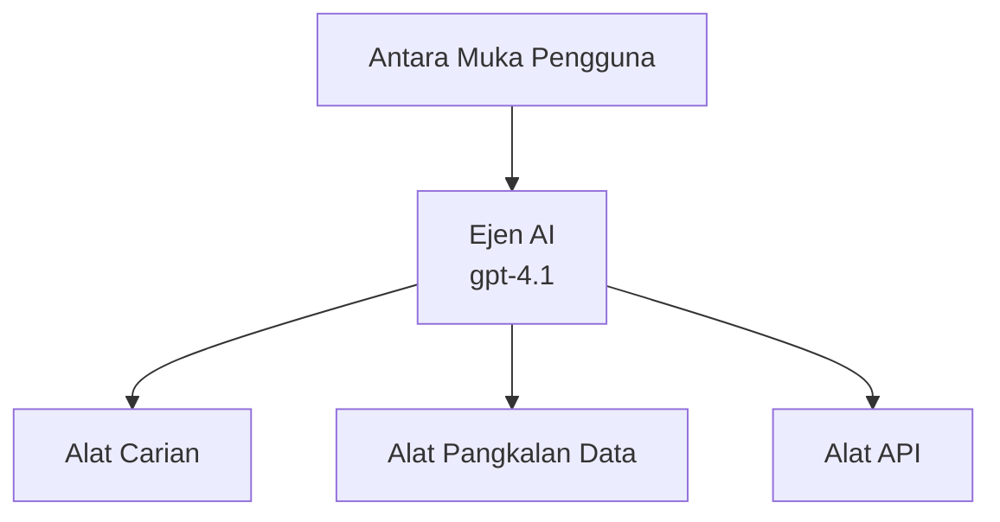
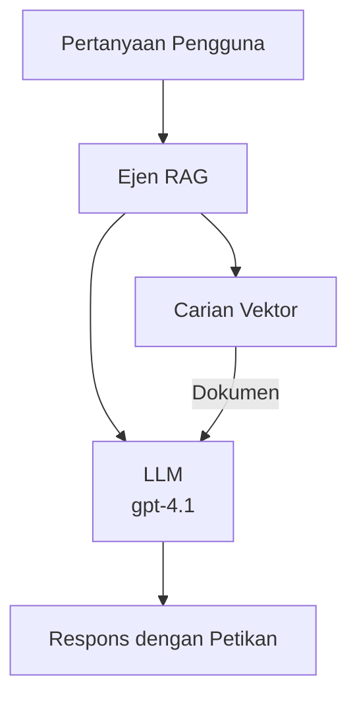
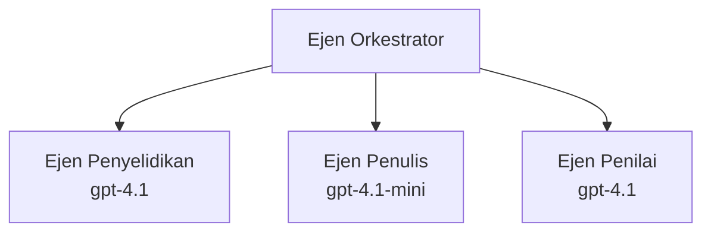

# Ejen AI dengan Azure Developer CLI

**Navigasi Bab:**
- **📚 Laman Utama Kursus**: [AZD Untuk Pemula](../../README.md)
- **📖 Bab Semasa**: Bab 2 - Pembangunan AI-Pertama
- **⬅️ Sebelumnya**: [Integrasi Microsoft Foundry](microsoft-foundry-integration.md)
- **➡️ Seterusnya**: [Penggunaan Model AI](ai-model-deployment.md)
- **🚀 Lanjutan**: [Penyelesaian Multi-Ejen](../../examples/retail-scenario.md)

---

## Pengenalan

Ejen AI adalah program autonomi yang boleh memerhati persekitarannya, membuat keputusan, dan mengambil tindakan untuk mencapai matlamat tertentu. Berbeza dengan chatbot mudah yang hanya memberi balasan berdasarkan arahan, ejen boleh:

- **Menggunakan alat** - Memanggil API, mencari pangkalan data, melaksanakan kod
- **Merancang dan berfikir** - Memecahkan tugas kompleks kepada langkah-langkah
- **Belajar daripada konteks** - Menyimpan memori dan menyesuaikan tingkah laku
- **Bekerjasama** - Bekerja dengan ejen lain (sistem multi-ejen)

Panduan ini menunjukkan cara menggunakan Azure Developer CLI (azd) untuk guna ejen AI ke Azure.

## Matlamat Pembelajaran

Dengan menyiapkan panduan ini, anda akan:
- Memahami apa itu ejen AI dan bagaimana ia berbeza daripada chatbot
- Mengguna tema ejen AI sedia ada menggunakan AZD
- Mengkonfigurasi Foundry Agents untuk ejen tersuai
- Melaksanakan corak asas ejen (penggunaan alat, RAG, multi-ejen)
- Memantau dan menyahpepijat ejen yang digunakan

## Hasil Pembelajaran

Selepas selesai, anda akan boleh:
- Mengguna aplikasi ejen AI ke Azure dengan satu arahan
- Mengkonfigurasi alat dan keupayaan ejen
- Melaksanakan penghasilan berpandukan carian (RAG) dengan ejen
- Mereka bentuk seni bina multi-ejen untuk aliran kerja kompleks
- Menyelesaikan masalah biasa dalam penggunaan ejen

---

## 🤖 Apa Yang Membezakan Ejen daripada Chatbot?

| Ciri | Chatbot | Ejen AI |
|---------|---------|----------|
| **Tingkah Laku** | Memberi balasan berdasarkan arahan | Mengambil tindakan secara autonomi |
| **Alat** | Tiada | Boleh memanggil API, mencari, melaksanakan kod |
| **Memori** | Hanya berdasarkan sesi | Memori berterusan merentas sesi |
| **Perancangan** | Balasan tunggal | Pemikiran berbilang langkah |
| **Kerjasama** | Entiti tunggal | Boleh bekerjasama dengan ejen lain |

### Analogi Mudah

- **Chatbot** = Seorang yang membantu menjawab soalan di kaunter maklumat
- **Ejen AI** = Pembantu peribadi yang boleh membuat panggilan, menempah janji, dan menyelesaikan tugas untuk anda

---

## 🚀 Mula Cepat: Gunakan Ejen Pertama Anda

### Pilihan 1: Templet Foundry Agents (Disyorkan)

```bash
# Mulakan templat ejen AI
azd init --template get-started-with-ai-agents

# Sebarkan ke Azure
azd up
```

**Apa yang digunakan:**
- ✅ Foundry Agents
- ✅ Model Microsoft Foundry (gpt-4.1)
- ✅ Azure AI Search (untuk RAG)
- ✅ Azure Container Apps (antara muka web)
- ✅ Application Insights (pemantauan)

**Masa:** ~15-20 minit  
**Kos:** ~$100-150/bulan (pembangunan)

### Pilihan 2: Ejen OpenAI dengan Prompty

```bash
# Inisialisasi templat agen berasaskan Prompty
azd init --template agent-openai-python-prompty

# Lancarkan ke Azure
azd up
```

**Apa yang digunakan:**
- ✅ Azure Functions (pelaksanaan ejen tanpa pelayan)
- ✅ Model Microsoft Foundry
- ✅ Fail konfigurasi Prompty
- ✅ Contoh pelaksanaan ejen

**Masa:** ~10-15 minit  
**Kos:** ~$50-100/bulan (pembangunan)

### Pilihan 3: Ejen RAG Chat

```bash
# Inisialisasi templat sembang RAG
azd init --template azure-search-openai-demo

# Hantar ke Azure
azd up
```

**Apa yang digunakan:**
- ✅ Model Microsoft Foundry
- ✅ Azure AI Search dengan data contoh
- ✅ Saluran pemprosesan dokumen
- ✅ Antara muka sembang dengan sitasi

**Masa:** ~15-25 minit  
**Kos:** ~$80-150/bulan (pembangunan)

### Pilihan 4: AZD AI Agent Init (Berdasarkan Manifest)

Jika anda mempunyai fail manifest ejen, anda boleh gunakan arahan `azd ai` untuk membuat rangka projek Foundry Agent terus:

```bash
# Pasang sambungan ejen AI
azd extension install azure.ai.agents

# Mulakan dari manifest ejen
azd ai agent init -m agent-manifest.yaml

# Lancarkan ke Azure
azd up
```

**Bila menggunakan `azd ai agent init` vs `azd init --template`:**

| Pendekatan | Sesuai untuk | Cara Ia Berfungsi |
|----------|----------|------|
| `azd init --template` | Memulakan dari aplikasi contoh berfungsi | Mengklon repo templat penuh dengan kod + infrastruktur |
| `azd ai agent init -m` | Membangun dari manifest ejen sendiri | Membina struktur projek dari definisi ejen anda |

> **Petua:** Gunakan `azd init --template` untuk pembelajaran (Pilihan 1-3 di atas). Gunakan `azd ai agent init` untuk membina ejen produksi dengan manifest anda. Lihat [Arahan AZD AI CLI](../chapter-08-production/production-ai-practices.md#azd-ai-cli-commands-and-extensions) untuk maklumat penuh.

---

## 🏗️ Corak Seni Bina Ejen

### Corak 1: Ejen Tunggal dengan Alat

Corak ejen paling mudah - satu ejen yang boleh menggunakan pelbagai alat.


**Sesua untuk:**
- Bot sokongan pelanggan
- Pembantu penyelidikan
- Ejen analisis data

**Templat AZD:** `azure-search-openai-demo`

### Corak 2: Ejen RAG (Penghasilan Berpandukan Carian)

Ejen yang mengambil dokumen berkaitan sebelum menjana balasan.


**Sesua untuk:**
- Pangkalan pengetahuan perusahaan
- Sistem soalan-jawab dokumen
- Penyelidikan pematuhan dan undang-undang

**Templat AZD:** `azure-search-openai-demo`

### Corak 3: Sistem Multi-Ejen

Beberapa ejen khusus yang bekerjasama dalam tugasan kompleks.


**Sesua untuk:**
- Penghasilan kandungan kompleks
- Aliran kerja berbilang langkah
- Tugasan yang memerlukan kepakaran berbeza

**Ketahui Lebih Lanjut:** [Corak Penyelarasan Multi-Ejen](../chapter-06-pre-deployment/coordination-patterns.md)

---

## ⚙️ Mengkonfigurasi Alat Ejen

Ejen menjadi kuat apabila boleh menggunakan alat. Ini cara mengkonfigurasi alat biasa:

### Konfigurasi Alat dalam Foundry Agents

```python
# agent_config.py
from azure.ai.projects import AIProjectClient
from azure.ai.projects.models import FunctionTool, CodeInterpreterTool

# Tetapkan alat tersuai
search_tool = FunctionTool(
    name="search_knowledge_base",
    description="Search the company knowledge base for relevant documents",
    parameters={
        "type": "object",
        "properties": {
            "query": {
                "type": "string",
                "description": "The search query"
            }
        },
        "required": ["query"]
    }
)

# Cipta ejen dengan alat
agent = project_client.agents.create_agent(
    model="gpt-4.1",
    name="Support Agent",
    instructions="You are a helpful support agent. Use the search tool to find relevant information.",
    tools=[search_tool, CodeInterpreterTool()]
)
```

### Konfigurasi Persekitaran

```bash
# Tetapkan pembolehubah persekitaran khusus ejen
azd env set AZURE_OPENAI_MODEL "gpt-4.1"
azd env set AGENT_INSTRUCTIONS "You are a helpful assistant..."
azd env set ENABLE_CODE_INTERPRETER "true"
azd env set ENABLE_FILE_SEARCH "true"

# Lancarkan dengan konfigurasi yang dikemas kini
azd deploy
```

---

## 📊 Memantau Ejen

### Integrasi Application Insights

Semua templat ejen AZD termasuk Application Insights untuk pemantauan:

```bash
# Buka papan pemuka pemantauan
azd monitor --overview

# Lihat log langsung
azd monitor --logs

# Lihat metrik langsung
azd monitor --live
```

### Metrik Utama untuk Dipantau

| Metrik | Penerangan | Sasaran |
|--------|-------------|--------|
| Kelewatan Respons | Masa untuk menjana respons | < 5 saat |
| Penggunaan Token | Token per permintaan | Pemantauan kos |
| Kadar Kejayaan Panggilan Alat | % panggilan alat berjaya | > 95% |
| Kadar Ralat | Permintaan ejen gagal | < 1% |
| Kepuasan Pengguna | Skor maklum balas | > 4.0/5.0 |

### Log Khusus untuk Ejen

```python
import os
from azure.monitor.opentelemetry import configure_azure_monitor
from opentelemetry import trace

# Konfigurasikan Azure Monitor dengan OpenTelemetry
configure_azure_monitor(
    connection_string=os.environ["APPLICATIONINSIGHTS_CONNECTION_STRING"]
)

tracer = trace.get_tracer(__name__)

def log_agent_interaction(user_query, agent_response, tools_used, latency_ms):
    with tracer.start_as_current_span("agent_interaction") as span:
        span.set_attributes({
            "user_query": user_query,
            "response_length": len(agent_response),
            "tools_used": tools_used,
            "latency_ms": latency_ms
        })
```

> **Nota:** Pasang pakej yang diperlukan: `pip install azure-monitor-opentelemetry opentelemetry`

---

## 💰 Pertimbangan Kos

### Anggaran Kos Bulanan Mengikut Corak

| Corak | Persekitaran Pembangunan | Produksi |
|---------|-----------------|------------|
| Ejen Tunggal | $50-100 | $200-500 |
| Ejen RAG | $80-150 | $300-800 |
| Multi-Ejen (2-3 ejen) | $150-300 | $500-1,500 |
| Multi-Ejen Perusahaan | $300-500 | $1,500-5,000+ |

### Petua Pengoptimuman Kos

1. **Gunakan gpt-4.1-mini untuk tugasan mudah**
   ```bash
   azd env set AZURE_OPENAI_MODEL "gpt-4.1-mini"
   ```

2. **Laksanakan penimbanan untuk pertanyaan berulang**
   ```python
   from functools import lru_cache
   
   @lru_cache(maxsize=1000)
   def get_cached_response(query_hash):
       return agent.run(query_hash)
   ```

3. **Tetapkan had token bagi setiap sesi**
   ```python
   # Tetapkan max_completion_tokens semasa menjalankan ejen, bukan semasa penciptaan
   run = project_client.agents.create_run(
       thread_id=thread.id,
       agent_id=agent.id,
       max_completion_tokens=1000  # Hadkan panjang respons
   )
   ```

4. **Skala ke sifar apabila tidak digunakan**
   ```bash
   # Aplikasi Kontena secara automatik menskala ke sifar
   azd env set MIN_REPLICAS "0"
   ```

---

## 🔧 Menyelesaikan Masalah Ejen

### Isu Biasa dan Penyelesaian

<details>
<summary><strong>❌ Ejen tidak memberi balasan kepada panggilan alat</strong></summary>

```bash
# Semak jika alat telah didaftarkan dengan betul
azd show

# Sahkan penempatan OpenAI
az cognitiveservices account deployment list \
  --name $AZURE_OPENAI_NAME \
  --resource-group $RG_NAME

# Semak log agen
azd monitor --logs
```

**Sebab biasa:**
- Tanda fungsi alat tidak sepadan
- Kebenaran diperlukan hilang
- Titik akhir API tidak boleh capaian
</details>

<details>
<summary><strong>❌ Kelewatan tinggi dalam balasan ejen</strong></summary>

```bash
# Semak Application Insights untuk halangan prestasi
azd monitor --live

# Pertimbangkan menggunakan model yang lebih pantas
azd env set AZURE_OPENAI_MODEL "gpt-4.1-mini"
azd deploy
```

**Petua pengoptimuman:**
- Gunakan balasan penstriman
- Laksanakan penimbanan balasan
- Kurangkan saiz tetingkap konteks
</details>

<details>
<summary><strong>❌ Ejen memberi maklumat tidak tepat atau halusinasi</strong></summary>

```python
# Tingkatkan dengan arahan sistem yang lebih baik
instructions = """
You are a helpful assistant. IMPORTANT:
- Only answer based on provided context
- If you don't know, say "I don't know"
- Always cite your sources
- Never make up information
"""

# Tambah pengambilan untuk perkasaan
agent = project_client.agents.create_agent(
    model="gpt-4.1",
    instructions=instructions,
    tools=[FileSearchTool()]  # Perkasakan jawapan dalam dokumen
)
```
</details>

<details>
<summary><strong>❌ Ralat melebihi had token</strong></summary>

```python
# Laksanakan pengurusan tetingkap konteks
def truncate_context(messages, max_tokens=8000, model="gpt-4.1"):
    """Keep only recent messages within token limit."""
    import tiktoken
    encoding = tiktoken.encoding_for_model(model)
    total_tokens = 0
    truncated = []
    
    for msg in reversed(messages):
        msg_tokens = len(encoding.encode(msg.content))
        if total_tokens + msg_tokens > max_tokens:
            break
        truncated.insert(0, msg)
        total_tokens += msg_tokens
    
    return truncated
```
</details>

---

## 🎓 Latihan Praktikal

### Latihan 1: Guna Ejen Asas (20 minit)

**Matlamat:** Gunakan ejen AI pertama anda menggunakan AZD

```bash
# Langkah 1: Inisialisasi templat
azd init --template get-started-with-ai-agents

# Langkah 2: Log masuk ke Azure
azd auth login

# Langkah 3: Sebarkan
azd up

# Langkah 4: Uji agen
# Output yang dijangka selepas penyebaran:
#   Penyebaran Selesai!
#   Titik akhir: https://<nama-aplikasi>.<wilayah>.azurecontainerapps.io
# Buka URL yang ditunjukkan dalam output dan cuba ajukan soalan

# Langkah 5: Lihat pemantauan
azd monitor --overview

# Langkah 6: Bersihkan
azd down --force --purge
```

**Kriteria Kejayaan:**
- [ ] Ejen memberi balasan kepada soalan
- [ ] Boleh akses papan pemantauan melalui `azd monitor`
- [ ] Sumber dibersihkan dengan jayanya

### Latihan 2: Tambah Alat Tersuai (30 minit)

**Matlamat:** Kembangkan ejen dengan alat tersuai

1. Gunakan templat ejen:  
   ```bash
   azd init --template get-started-with-ai-agents
   azd up
   ```
2. Cipta fungsi alat baru dalam kod ejen anda:  
   ```python
   def get_weather(location: str) -> str:
       """Get current weather for a location."""
       # Panggilan API ke perkhidmatan cuaca
       return f"Weather in {location}: Sunny, 72°F"
   ```
3. Daftar alat dengan ejen:  
   ```python
   from azure.ai.projects.models import FunctionTool

   weather_tool = FunctionTool(
       name="get_weather",
       description="Get current weather for a location",
       parameters={
           "type": "object",
           "properties": {
               "location": {"type": "string", "description": "City name"}
           },
           "required": ["location"]
       }
   )

   agent = project_client.agents.create_agent(
       model="gpt-4.1",
       name="Weather Agent",
       tools=[weather_tool]
   )
   ```
4. Gunakan semula dan uji:  
   ```bash
   azd deploy
   # Tanya: "Bagaimana cuaca di Seattle?"
   # Dijangka: Ejen memanggil get_weather("Seattle") dan mengembalikan maklumat cuaca
   ```

**Kriteria Kejayaan:**
- [ ] Ejen mengenal pasti pertanyaan berkaitan cuaca
- [ ] Alat dipanggil dengan betul
- [ ] Balasan mengandungi maklumat cuaca

### Latihan 3: Bina Ejen RAG (45 minit)

**Matlamat:** Cipta ejen yang menjawab soalan daripada dokumen anda

```bash
# Langkah 1: Pasang templat RAG
azd init --template azure-search-openai-demo
azd up

# Langkah 2: Muat naik dokumen anda
# Letakkan fail PDF/TXT dalam direktori data/, kemudian jalankan:
python scripts/prepdocs.py

# Langkah 3: Uji dengan soalan khusus domain
# Buka URL aplikasi web dari output azd up
# Tanyakan soalan mengenai dokumen yang anda muat naik
# Tindak balas harus termasuk rujukan sitasi seperti [doc.pdf]
```

**Kriteria Kejayaan:**
- [ ] Ejen menjawab soalan dari dokumen dimuat naik
- [ ] Balasan mengandungi sitasi
- [ ] Tiada halusinasi pada soalan luar skop

---

## 📚 Langkah Seterusnya

Kini anda telah memahami ejen AI, terokai topik lanjutan ini:

| Topik | Penerangan | Pautan |
|-------|-------------|------|
| **Sistem Multi-Ejen** | Bina sistem dengan ejen yang bekerjasama | [Contoh Multi-Ejen Runcit](../../examples/retail-scenario.md) |
| **Corak Penyelarasan** | Pelajari corak orkestra dan komunikasi | [Corak Penyelarasan](../chapter-06-pre-deployment/coordination-patterns.md) |
| **Penggunaan Produksi** | Penggunaan ejen sedia produksi | [Amalan AI Produksi](../chapter-08-production/production-ai-practices.md) |
| **Penilaian Ejen** | Uji dan nilai prestasi ejen | [Penyelesaian Masalah AI](../chapter-07-troubleshooting/ai-troubleshooting.md) |
| **Makmal Bengkel AI** | Praktikal: Sediakan penyelesaian AI anda dengan AZD | [Makmal Bengkel AI](ai-workshop-lab.md) |

---

## 📖 Sumber Tambahan

### Dokumentasi Rasmi
- [Azure AI Agent Service](https://learn.microsoft.com/azure/ai-services/agents/)
- [Azure AI Foundry Agent Service Quickstart](https://learn.microsoft.com/azure/ai-services/agents/quickstart)
- [Semantic Kernel Agent Framework](https://learn.microsoft.com/semantic-kernel/)

### Templat AZD untuk Ejen
- [Mulakan dengan Ejen AI](https://github.com/Azure-Samples/get-started-with-ai-agents)
- [Ejen OpenAI Python Prompty](https://github.com/Azure-Samples/agent-openai-python-prompty)
- [Demo Azure Search OpenAI](https://github.com/Azure-Samples/azure-search-openai-demo)

### Sumber Komuniti
- [Awesome AZD - Templat Ejen](https://azure.github.io/awesome-azd/?tags=ai-agents)
- [Azure AI Discord](https://discord.gg/microsoft-azure)
- [Microsoft Foundry Discord](https://discord.gg/nTYy5BXMWG)

### Kemahiran Ejen untuk Editor Anda
- [**Kemahiran Ejen Microsoft Azure**](https://skills.sh/microsoft/github-copilot-for-azure) - Pasang kemahiran ejen AI boleh guna semula untuk pembangunan Azure dalam GitHub Copilot, Cursor, atau mana-mana agen yang disokong. Termasuk kemahiran untuk [Azure AI](https://skills.sh/microsoft/github-copilot-for-azure/azure-ai), [Microsoft Foundry](https://skills.sh/microsoft/github-copilot-for-azure/microsoft-foundry), [penggunaan](https://skills.sh/microsoft/github-copilot-for-azure/azure-deploy), dan [diagnostik](https://skills.sh/microsoft/github-copilot-for-azure/azure-diagnostics):
  ```bash
  npx skills add microsoft/github-copilot-for-azure
  ```

---

**Navigasi**
- **Pelajaran Sebelumnya**: [Integrasi Microsoft Foundry](microsoft-foundry-integration.md)
- **Pelajaran Seterusnya**: [Penggunaan Model AI](ai-model-deployment.md)

---

<!-- CO-OP TRANSLATOR DISCLAIMER START -->
**Penafian**:  
Dokumen ini telah diterjemahkan menggunakan perkhidmatan terjemahan AI [Co-op Translator](https://github.com/Azure/co-op-translator). Walaupun kami berusaha untuk ketepatan, sila maklum bahawa terjemahan automatik mungkin mengandungi kesilapan atau ketidakakuratan. Dokumen asal dalam bahasa asalnya hendaklah dianggap sebagai sumber yang sahih. Untuk maklumat penting, terjemahan profesional oleh manusia adalah disyorkan. Kami tidak bertanggungjawab atas sebarang salah faham atau salah tafsir yang timbul daripada penggunaan terjemahan ini.
<!-- CO-OP TRANSLATOR DISCLAIMER END -->