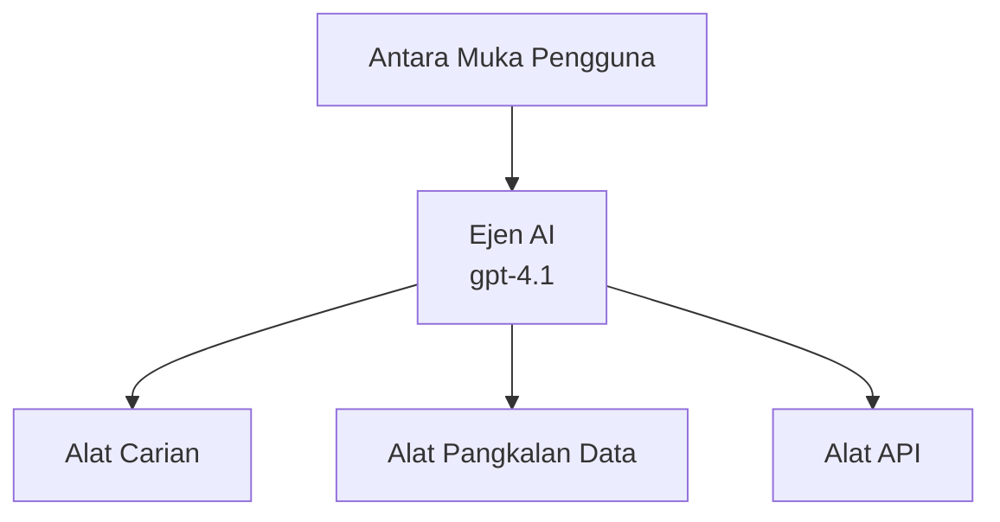
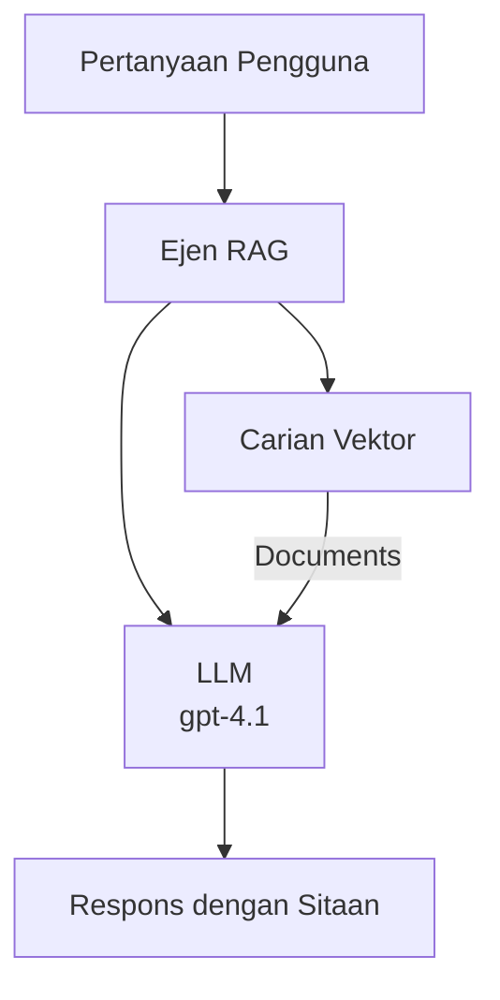
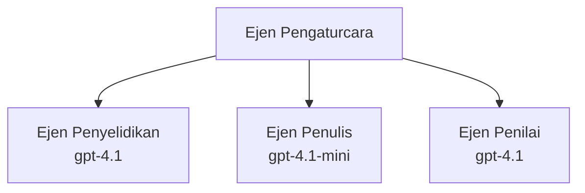

# Ejen AI dengan Azure Developer CLI

**Navigasi Bab:**
- **📚 Rumah Kursus**: [AZD Untuk Pemula](../../README.md)
- **📖 Bab Semasa**: Bab 2 - Pembangunan AI-Pertama
- **⬅️ Sebelumnya**: [Integrasi Microsoft Foundry](microsoft-foundry-integration.md)
- **➡️ Seterusnya**: [Penggunaan Model AI](ai-model-deployment.md)
- **🚀 Lanjutan**: [Penyelesaian Pelbagai-Ejen](../../examples/retail-scenario.md)

---

## Pengenalan

Ejen AI adalah program autonomi yang boleh melihat persekitarannya, membuat keputusan, dan mengambil tindakan untuk mencapai matlamat tertentu. Berbeza dengan chatbot mudah yang bertindak balas terhadap arahan, ejen boleh:

- **Menggunakan alat** - Memanggil API, mencari pangkalan data, melaksanakan kod
- **Merancang dan berfikir** - Memecah tugasan kompleks menjadi langkah-langkah
- **Belajar daripada konteks** - Mengekalkan memori dan menyesuaikan tingkah laku
- **Bekerjasama** - Bekerja dengan ejen lain (sistem pelbagai-ejen)

Panduan ini menunjukkan cara menggunakan Azure Developer CLI (azd) untuk melaksanakan ejen AI ke Azure.

> **Nota pengesahan (2026-07-13):** Panduan ini disemak menggunakan `azd` `1.27.1` dan `azure.ai.agents` `1.0.0-beta.5`. Pengalaman `azd ai` masih dalam pra-tonton, jadi semak bantuan sambungan jika bendera yang dipasang berbeza.

## Matlamat Pembelajaran

Dengan melengkapkan panduan ini, anda akan:
- Memahami apa itu ejen AI dan bagaimana ia berbeza dari chatbot
- Melaksanakan templat ejen AI sedia ada menggunakan AZD
- Mengkonfigurasi Foundry Agents untuk ejen tersuai
- Melaksanakan corak asas ejen (penggunaan alat, RAG, pelbagai-ejen)
- Memantau dan menyahpepijat ejen yang dilaksanakan

## Hasil Pembelajaran

Selepas selesai, anda akan dapat:
- Melaksanakan aplikasi ejen AI ke Azure dengan satu arahan
- Mengkonfigurasi alat dan keupayaan ejen
- Melaksanakan generasi bertambah-rangkuman (RAG) dengan ejen
- Mereka bentuk seni bina pelbagai-ejen untuk aliran kerja kompleks
- Menyelesaikan masalah biasa dalam pelaksanaan ejen

---

## 🤖 Apa Yang Membezakan Ejen Dari Chatbot?

| Ciri | Chatbot | Ejen AI |
|---------|---------|----------|
| **Tingkah laku** | Bertindak balas kepada arahan | Mengambil tindakan secara autonomi |
| **Alat** | Tiada | Boleh memanggil API, mencari, melaksanakan kod |
| **Memori** | Berasaskan sesi sahaja | Memori berterusan merentas sesi |
| **Perancangan** | Respons tunggal | Pemikiran berbilang langkah |
| **Kerjasama** | Entiti tunggal | Boleh bekerja dengan ejen lain |

### Analogi Mudah

- **Chatbot** = Seorang yang membantu menjawab soalan di kaunter maklumat
- **Ejen AI** = Pembantu peribadi yang boleh membuat panggilan, menempah janji, dan menyelesaikan tugasan untuk anda

---

## 🚀 Mula Dengan Cepat: Laksanakan Ejen Pertama Anda

### Pilihan 1: Templat Foundry Agents (Disyorkan)

```bash
# Inisialisasi templat ejen AI
azd init --template get-started-with-ai-agents

# Lancarkan ke Azure
azd up
```

**Yang akan dilaksanakan:**
- ✅ Foundry Agents
- ✅ Model Microsoft Foundry (gpt-4.1)
- ✅ Azure AI Search (untuk RAG)
- ✅ Azure Container Apps (antara muka web)
- ✅ Application Insights (pemantauan)

**Masa:** ~15-20 minit
**Kos:** ~$100-150/bulan (pembangunan)

### Pilihan 2: Ejen OpenAI dengan Prompty

```bash
# Inisialisasi templat ejen berasaskan Prompty
azd init --template agent-openai-python-prompty

# Terbitkan ke Azure
azd up
```

**Yang akan dilaksanakan:**
- ✅ Azure Functions (pelaksanaan ejen tanpa pelayan)
- ✅ Model Microsoft Foundry
- ✅ Fail konfigurasi Prompty
- ✅ Contoh pelaksanaan ejen

**Masa:** ~10-15 minit
**Kos:** ~$50-100/bulan (pembangunan)

### Pilihan 3: Ejen Sembang RAG

```bash
# Inisialisasi templat sembang RAG
azd init --template azure-search-openai-demo

# Terapkan ke Azure
azd up
```

**Yang akan dilaksanakan:**
- ✅ Model Microsoft Foundry
- ✅ Azure AI Search dengan data contoh
- ✅ Saluran pemprosesan dokumen
- ✅ Antara muka sembang dengan rujukan

**Masa:** ~15-25 minit
**Kos:** ~$80-150/bulan (pembangunan)

### Pilihan 4: AZD AI Agent Init (Pratonton Berdasarkan Manifest atau Templat)

Jika anda mempunyai fail manifest ejen, anda boleh menggunakan arahan `azd ai` untuk membina projek Foundry Agent Service secara langsung. Siaran pratonton terkini juga menambah sokongan inisialisasi berasaskan templat, jadi aliran arahan mungkin berbeza sedikit bergantung pada versi sambungan yang dipasang.

```bash
# Pasang sambungan ejen AI
azd extension install azure.ai.agents

# Pilihan: sahkan versi pratonton yang dipasang
azd extension show azure.ai.agents

# Mulakan dari manifest ejen
azd ai agent init -m agent-manifest.yaml

# Lancarkan ke Azure
azd up

# Uji ejen yang telah dilancarkan (menunjukkan kelewatan + masa-ke-byte-pertama)
azd ai agent invoke
```

**Bila menggunakan `azd ai agent init` vs `azd init --template`:**

| Pendekatan | Sesuai Untuk | Cara Kerja |
|----------|----------|------|
| `azd init --template` | Bermula dari aplikasi contoh berfungsi | Memetik repo templat penuh dengan kod + infra |
| `azd ai agent init -m` | Membangun dari manifest ejen sendiri | Membina struktur projek dari definisi ejen |

> **Petua:** Gunakan `azd init --template` semasa belajar (Pilihan 1-3 di atas). Gunakan `azd ai agent init` semasa membina ejen produksi dengan manifest anda.

Selepas `azd up`, sambungan yang sama membawa anda melalui kitaran hidup ejen: `azd ai agent invoke` untuk ujian, `azd ai agent eval generate` dan `azd ai agent optimize` untuk mengukur dan meningkatkan kualiti, serta `azd ai agent delete` untuk membersihkan. Lihat [Perintah AZD AI CLI](../chapter-08-production/production-ai-practices.md#azd-ai-cli-commands-and-extensions) untuk rujukan penuh.

---

## 🏗️ Corak Seni Bina Ejen

### Corak 1: Ejen Tunggal dengan Alat

Corak ejen paling mudah - satu ejen yang boleh menggunakan pelbagai alat.



**Sesuai untuk:**
- Bot sokongan pelanggan
- Pembantu penyelidikan
- Ejen analisis data

**Templat AZD:** `azure-search-openai-demo`

### Corak 2: Ejen RAG (Generasi Bertambah-Rangkuman)

Ejen yang mengambil dokumen berkaitan sebelum menghasilkan respons.



**Sesuai untuk:**
- Pangkalan pengetahuan perusahaan
- Sistem soal jawab dokumen
- Penyelidikan kepatuhan dan undang-undang

**Templat AZD:** `azure-search-openai-demo`

### Corak 3: Sistem Pelbagai-Ejen

Beberapa ejen khusus yang bekerjasama dalam tugasan kompleks.



**Sesuai untuk:**
- Penjanaan kandungan kompleks
- Aliran kerja berbilang langkah
- Tugasan yang memerlukan kepakaran berbeza

**Ketahui Lebih Lanjut:** [Corak Penyelarasan Multi-Ejen](../chapter-06-pre-deployment/coordination-patterns.md)

---

## ⚙️ Mengkonfigurasi Alat Ejen

Ejen menjadi kuat apabila mereka boleh menggunakan alat. Berikut cara mengkonfigurasi alat biasa:

### Konfigurasi Alat dalam Foundry Agents

```python
# agent_config.py
from azure.ai.projects import AIProjectClient
from azure.ai.projects.models import FunctionTool, CodeInterpreterTool

# Mendefinisikan alat khusus
search_tool = FunctionTool(
    name="search_knowledge_base",
    description="Search the company knowledge base for relevant documents",
    parameters={
        "type": "object",
        "properties": {
            "query": {
                "type": "string",
                "description": "The search query"
            }
        },
        "required": ["query"]
    }
)

# Membuat agen dengan alat
agent = project_client.agents.create_agent(
    model="gpt-4.1",
    name="Support Agent",
    instructions="You are a helpful support agent. Use the search tool to find relevant information.",
    tools=[search_tool, CodeInterpreterTool()]
)
```

### Konfigurasi Persekitaran

```bash
# Tetapkan pembolehubah persekitaran khusus ejen
azd env set AZURE_OPENAI_MODEL "gpt-4.1"
azd env set AGENT_INSTRUCTIONS "You are a helpful assistant..."
azd env set ENABLE_CODE_INTERPRETER "true"
azd env set ENABLE_FILE_SEARCH "true"

# Lancarkan dengan konfigurasi terkini
azd deploy
```

---

## 📊 Memantau Ejen

### Integrasi Application Insights

Semua templat ejen AZD disertakan dengan Application Insights untuk pemantauan:

```bash
# Buka papan pemuka pemantauan
azd monitor --overview

# Lihat log langsung
azd monitor --logs

# Lihat metrik langsung
azd monitor --live
```

### Metrik Utama untuk Jejak

| Metrik | Penerangan | Sasaran |
|--------|-------------|--------|
| Kelewatan Respons | Masa untuk menghasilkan respons | < 5 saat |
| Penggunaan Token | Token setiap permintaan | Pantau untuk kos |
| Kadar Kejayaan Panggilan Alat | % pelaksanaan alat berjaya | > 95% |
| Kadar Ralat | Permintaan ejen gagal | < 1% |
| Kepuasan Pengguna | Skor maklum balas | > 4.0/5.0 |

### Pendaftaran Tersuai untuk Ejen

```python
import os
from azure.monitor.opentelemetry import configure_azure_monitor
from opentelemetry import trace

# Konfigurasikan Azure Monitor dengan OpenTelemetry
configure_azure_monitor(
    connection_string=os.environ["APPLICATIONINSIGHTS_CONNECTION_STRING"]
)

tracer = trace.get_tracer(__name__)

def log_agent_interaction(user_query, agent_response, tools_used, latency_ms):
    with tracer.start_as_current_span("agent_interaction") as span:
        span.set_attributes({
            "user_query": user_query,
            "response_length": len(agent_response),
            "tools_used": tools_used,
            "latency_ms": latency_ms
        })
```

> **Nota:** Pasang pakej yang diperlukan: `pip install azure-monitor-opentelemetry opentelemetry`

---

## 💰 Pertimbangan Kos

### Anggaran Kos Bulanan Mengikut Corak

| Corak | Persekitaran Dev | Produksi |
|---------|-----------------|------------|
| Ejen Tunggal | $50-100 | $200-500 |
| Ejen RAG | $80-150 | $300-800 |
| Pelbagai-Ejen (2-3 ejen) | $150-300 | $500-1,500 |
| Enterprise Pelbagai-Ejen | $300-500 | $1,500-5,000+ |

### Petua Pengoptimuman Kos

1. **Gunakan gpt-4.1-mini untuk tugasan mudah**
   ```bash
   azd env set AZURE_OPENAI_MODEL "gpt-4.1-mini"
   ```

2. **Laksanakan caching untuk pertanyaan berulang**
   ```python
   from functools import lru_cache
   
   @lru_cache(maxsize=1000)
   def get_cached_response(query_hash):
       return agent.run(query_hash)
   ```

3. **Tetapkan had token bagi setiap run**
   ```python
   # Tetapkan max_completion_tokens semasa menjalankan agen, bukan semasa penciptaan
   run = project_client.agents.create_run(
       thread_id=thread.id,
       agent_id=agent.id,
       max_completion_tokens=1000  # Hadkan panjang respons
   )
   ```

4. **Skala ke sifar apabila tidak digunakan**
   ```bash
   # Aplikasi Kontena secara automatik skala ke sifar
   azd env set MIN_REPLICAS "0"
   ```

---

## 🔧 Menyelesaikan Masalah Ejen

### Isu Dan Penyelesaian Biasa

<details>
<summary><strong>❌ Ejen tidak bertindak balas pada panggilan alat</strong></summary>

```bash
# Semak jika alat didaftarkan dengan betul
azd show

# Sahkan penyebaran OpenAI
az cognitiveservices account deployment list \
  --name $AZURE_OPENAI_NAME \
  --resource-group $RG_NAME

# Semak log agen
azd monitor --logs
```

**Punca biasa:**
- Tandatangan fungsi alat tidak sepadan
- Kebenaran diperlukan hilang
- Titik akhir API tidak dapat diakses
</details>

<details>
<summary><strong>❌ Kelewatan tinggi dalam respons ejen</strong></summary>

```bash
# Semak Application Insights untuk kesesakan
azd monitor --live

# Pertimbangkan menggunakan model yang lebih pantas
azd env set AZURE_OPENAI_MODEL "gpt-4.1-mini"
azd deploy
```

**Petua pengoptimuman:**
- Gunakan respons streaming
- Laksanakan caching respons
- Kurangkan saiz tetingkap konteks
</details>

<details>
<summary><strong>❌ Ejen mengembalikan maklumat tidak betul atau hallusinasi</strong></summary>

```python
# Tingkatkan dengan arahan sistem yang lebih baik
instructions = """
You are a helpful assistant. IMPORTANT:
- Only answer based on provided context
- If you don't know, say "I don't know"
- Always cite your sources
- Never make up information
"""

# Tambah pengambilan untuk penempatan asas
agent = project_client.agents.create_agent(
    model="gpt-4.1",
    instructions=instructions,
    tools=[FileSearchTool()]  # Letakkan jawapan berdasarkan dokumen
)
```
</details>

<details>
<summary><strong>❌ Ralat had token terlampau</strong></summary>

```python
# Laksanakan pengurusan tetingkap konteks
def truncate_context(messages, max_tokens=8000, model="gpt-4.1"):
    """Keep only recent messages within token limit."""
    import tiktoken
    encoding = tiktoken.encoding_for_model(model)
    total_tokens = 0
    truncated = []
    
    for msg in reversed(messages):
        msg_tokens = len(encoding.encode(msg.content))
        if total_tokens + msg_tokens > max_tokens:
            break
        truncated.insert(0, msg)
        total_tokens += msg_tokens
    
    return truncated
```
</details>

---

## 🎓 Latihan Amali

### Latihan 1: Laksanakan Ejen Asas (20 minit)

**Matlamat:** Laksanakan ejen AI pertama anda menggunakan AZD

```bash
# Langkah 1: Inisialisasi templat
azd init --template get-started-with-ai-agents

# Langkah 2: Log masuk ke Azure
azd auth login
# Jika anda bekerja merentas penyewa, tambah --tenant-id <tenant-id>

# Langkah 3: Sebarkan
azd up

# Langkah 4: Uji ejen
# Jangkaan output selepas penyebaran:
#   Penyebaran Selesai!
#   Titik akhir: https://<app-name>.<region>.azurecontainerapps.io
# Buka URL yang ditunjukkan dalam output dan cuba ajukan soalan

# Langkah 5: Lihat pemantauan
azd monitor --overview

# Langkah 6: Bersihkan
azd down --force --purge
```

**Kriteria Kejayaan:**
- [ ] Ejen menjawab soalan
- [ ] Boleh akses papan pemuka pemantauan melalui `azd monitor`
- [ ] Sumber dibersihkan dengan jayanya

### Latihan 2: Tambah Alat Tersuai (30 minit)

**Matlamat:** Luaskan ejen dengan alat tersuai

1. Laksanakan templat ejen:
   ```bash
   azd init --template get-started-with-ai-agents
   azd up
   ```
2. Buat fungsi alat baru dalam kod ejen anda:
   ```python
   def get_weather(location: str) -> str:
       """Get current weather for a location."""
       # Panggilan API ke perkhidmatan cuaca
       return f"Weather in {location}: Sunny, 72°F"
   ```
3. Daftarkan alat dengan ejen:
   ```python
   from azure.ai.projects.models import FunctionTool

   weather_tool = FunctionTool(
       name="get_weather",
       description="Get current weather for a location",
       parameters={
           "type": "object",
           "properties": {
               "location": {"type": "string", "description": "City name"}
           },
           "required": ["location"]
       }
   )

   agent = project_client.agents.create_agent(
       model="gpt-4.1",
       name="Weather Agent",
       tools=[weather_tool]
   )
   ```
4. Laksanakan semula dan uji:
   ```bash
   azd deploy
   # Tanya: "Apa cuaca di Seattle?"
   # Jangkaan: Agen memanggil get_weather("Seattle") dan mengembalikan maklumat cuaca
   ```

**Kriteria Kejayaan:**
- [ ] Ejen mengenal pertanyaan berkaitan cuaca
- [ ] Alat dipanggil dengan betul
- [ ] Respons mengandungi maklumat cuaca

### Latihan 3: Bangunkan Ejen RAG (45 minit)

**Matlamat:** Cipta ejen yang menjawab soalan dari dokumen anda

```bash
# Langkah 1: Terapkan templat RAG
azd init --template azure-search-openai-demo
azd up

# Langkah 2: Muat naik dokumen anda
# Letakkan fail PDF/TXT dalam direktori data/, kemudian jalankan:
python scripts/prepdocs.py

# Langkah 3: Uji dengan soalan khusus domain
# Buka URL aplikasi web dari output azd up
# Tanya soalan tentang dokumen yang dimuat naik
# Respons harus termasuk rujukan sitasi seperti [doc.pdf]
```

**Kriteria Kejayaan:**
- [ ] Ejen menjawab dari dokumen yang dimuat naik
- [ ] Respons mengandungi rujukan
- [ ] Tiada halusinasi untuk soalan di luar skop

---

## 📚 Langkah Seterusnya

Sekarang anda faham ejen AI, terokai topik lanjutan ini:

| Topik | Penerangan | Pautan |
|-------|-------------|------|
| **Sistem Pelbagai-Ejen** | Bina sistem dengan pelbagai ejen yang bekerjasama | [Contoh Pelbagai-Ejen Runcit](../../examples/retail-scenario.md) |
| **Corak Penyelarasan** | Pelajari corak orkestrasi dan komunikasi | [Corak Penyelarasan](../chapter-06-pre-deployment/coordination-patterns.md) |
| **Pelaksanaan Produksi** | Pelaksanaan ejen sedia perusahaan | [Amalan AI Produksi](../chapter-08-production/production-ai-practices.md) |
| **Penilaian Ejen** | Uji dan nilaikan prestasi ejen | [Penyelesaian Masalah AI](../chapter-07-troubleshooting/ai-troubleshooting.md) |
| **Makmal Bengkel AI** | Amali: Jadikan penyelesaian AI anda sedia AZD | [Makmal Bengkel AI](ai-workshop-lab.md) |

---

## 📖 Sumber Tambahan

### Dokumentasi Rasmi
- [Perkhidmatan Ejen Microsoft Foundry](https://learn.microsoft.com/azure/ai-services/agents/)
- [Permulaan Pantas Perkhidmatan Ejen Microsoft Foundry](https://learn.microsoft.com/azure/ai-services/agents/quickstart)
- [Rangka Kerja Ejen Semantic Kernel](https://learn.microsoft.com/semantic-kernel/)

### Templat AZD untuk Ejen
- [Mula Dengan Ejen AI](https://github.com/Azure-Samples/get-started-with-ai-agents)
- [Agent OpenAI Python Prompty](https://github.com/Azure-Samples/agent-openai-python-prompty)
- [Demo Azure Search OpenAI](https://github.com/Azure-Samples/azure-search-openai-demo)

### Sumber Komuniti
- [Awesome AZD - Templat Ejen](https://azure.github.io/awesome-azd/?tags=ai-agents)
- [Azure AI Discord](https://discord.gg/microsoft-azure)
- [Microsoft Foundry Discord](https://discord.gg/nTYy5BXMWG)

### Kemahiran Ejen untuk Penyunting Anda
- [**Kemahiran Ejen Microsoft Azure**](https://skills.sh/microsoft/github-copilot-for-azure) - Pasang kemahiran ejen AI boleh guna semula untuk pembangunan Azure dalam GitHub Copilot, Cursor, atau agen yang disokong lain. Termasuk kemahiran untuk [Azure AI](https://skills.sh/microsoft/github-copilot-for-azure/azure-ai), [Microsoft Foundry](https://skills.sh/microsoft/github-copilot-for-azure/microsoft-foundry), [pelaksanaan](https://skills.sh/microsoft/github-copilot-for-azure/azure-deploy), dan [diagnostik](https://skills.sh/microsoft/github-copilot-for-azure/azure-diagnostics):
  ```bash
  npx skills add microsoft/github-copilot-for-azure
  ```

---

**Navigasi**
- **Pelajaran Sebelumnya**: [Integrasi Microsoft Foundry](microsoft-foundry-integration.md)
- **Pelajaran Seterusnya**: [Penggunaan Model AI](ai-model-deployment.md)

---

<!-- CO-OP TRANSLATOR DISCLAIMER START -->
**Penafian**:
Dokumen ini telah diterjemahkan menggunakan perkhidmatan terjemahan AI [Co-op Translator](https://github.com/Azure/co-op-translator). Walaupun kami berusaha untuk ketepatan, sila ambil maklum bahawa terjemahan automatik mungkin mengandungi kesilapan atau ketidaktepatan. Dokumen asal dalam bahasa asalnya harus dianggap sebagai sumber yang sahih. Untuk maklumat penting, terjemahan oleh manusia profesional adalah disyorkan. Kami tidak bertanggungjawab terhadap sebarang salah faham atau salah tafsir yang timbul daripada penggunaan terjemahan ini.
<!-- CO-OP TRANSLATOR DISCLAIMER END -->