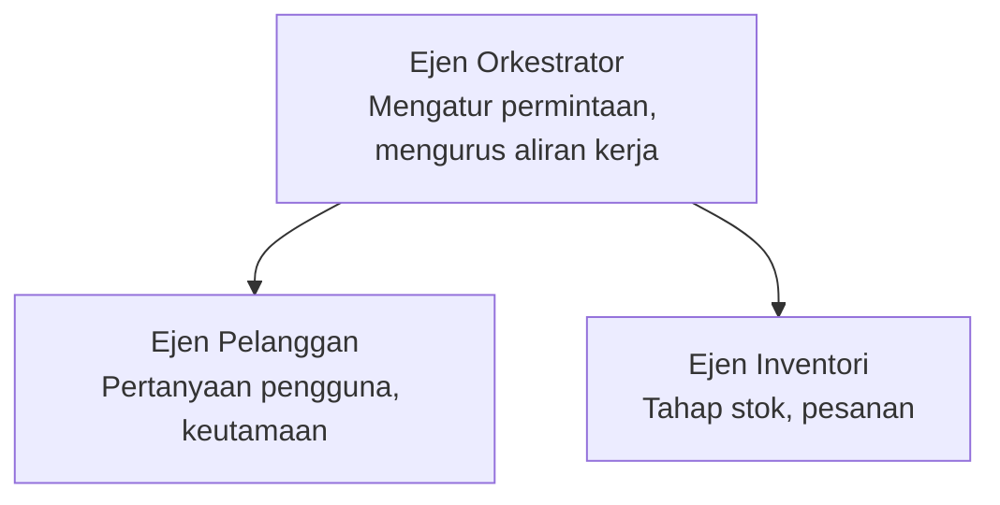

# Bab 5: Penyelesaian AI Berbilang Ejen

**📚 Kursus**: [AZD Untuk Pemula](../../README.md) | **⏱️ Tempoh**: 2-3 jam | **⭐ Kerumitan**: Lanjutan

---

## Gambaran Keseluruhan

Bab ini meliputi pola seni bina berbilang ejen lanjutan, orkestrasi ejen, dan penyebaran AI yang sedia untuk produksi bagi senario kompleks.

> Disahkan dengan `azd 1.27.1` pada Julai 2026.

## Objektif Pembelajaran

Dengan menamatkan bab ini, anda akan:
- Memahami pola seni bina berbilang ejen
- Menyebarkan sistem ejen AI yang dipadukan
- Melaksanakan komunikasi ejen-ke-ejen
- Membina penyelesaian berbilang ejen yang sedia untuk pengeluaran

---

## 📚 Pelajaran

| # | Pelajaran | Penerangan | Masa |
|---|--------|-------------|------|
| 1 | [Asas Berbilang Ejen](multi-agent-basics.md) | Amali: menyebarkan aplikasi berbilang ejen yang berfungsi dengan `azd up` | 45 min |
| 2 | [Pola Koordinasi](../chapter-06-pre-deployment/coordination-patterns.md) | Strategi orkestrasi ejen (bersambung di Bab 6) | 30 min |
| 3 | [Penyebaran Templat ARM](../../examples/retail-multiagent-arm-template/README.md) | Contoh penyebaran satu klik | 30 min |

> **Mulakan dengan Pelajaran 1.** Ia adalah satu-satunya pelajaran amali yang lengkap dan boleh disebarkan dalam bab ini. Pelajaran 2 berada di Bab 6 (ia dikongsi dengan perancangan pra-penyebaran), dan [Penyelesaian Berbilang Ejen Runcit](../../examples/retail-scenario.md) adalah cetak biru seni bina—rujukan reka bentuk, bukan templat satu arahan.

---

## 🚀 Mula Pantas

```bash
# Pilihan 1: Lancarkan dari templat
azd init --template agent-openai-python-prompty
azd up

# Pilihan 2: Lancarkan dari manifest ejen (memerlukan sambungan azure.ai.agents)
azd extension install azure.ai.agents
azd ai agent init -m agent-manifest.yaml
azd up
```

> **Pendekatan mana?** Gunakan `azd init --template` untuk bermula dengan sampel yang berfungsi. Gunakan `azd ai agent init` apabila anda mempunyai manifest ejen sendiri. Lihat [rujukan AZD AI CLI](../chapter-08-production/production-ai-practices.md#azd-ai-cli-commands-and-extensions) untuk butiran penuh.

---

## 🤖 Seni Bina Berbilang Ejen



---

## 🎯 Penyelesaian Pilihan: Berbilang Ejen Runcit

[Penyelesaian Berbilang Ejen Runcit](../../examples/retail-scenario.md) mempamerkan:

- **Ejen Pelanggan**: Mengendalikan interaksi pengguna dan keutamaan
- **Ejen Inventori**: Menguruskan stok dan pemprosesan pesanan
- **Pengaturcara**: Memadukan antara ejen
- **Memori Berkongsi**: Pengurusan konteks silang ejen

### Perkhidmatan Digunakan

| Perkhidmatan | Tujuan |
|---------|---------|
| Microsoft Foundry Models | Kefahaman bahasa |
| Azure AI Search | Katalog produk |
| Cosmos DB | Keadaan dan memori ejen |
| Container Apps | Penghosan ejen |
| Application Insights | Pemantauan |

---

## 🔗 Navigasi

| Arah | Bab |
|-----------|---------|
| **Sebelumnya** | [Bab 4: Infrastruktur](../chapter-04-infrastructure/README.md) |
| **Seterusnya** | [Bab 6: Pra-Penyebaran](../chapter-06-pre-deployment/README.md) |

---

## 📖 Sumber Berkaitan

- [Panduan Ejen AI](../chapter-02-ai-development/agents.md)
- [Amalan AI Produksi](../chapter-08-production/production-ai-practices.md)
- [Penyelesaian Masalah AI](../chapter-07-troubleshooting/ai-troubleshooting.md)

---

<!-- CO-OP TRANSLATOR DISCLAIMER START -->
**Penafian**:
Dokumen ini telah diterjemahkan menggunakan perkhidmatan terjemahan AI [Co-op Translator](https://github.com/Azure/co-op-translator). Walaupun kami berusaha untuk ketepatan, sila ambil maklum bahawa terjemahan automatik mungkin mengandungi kesilapan atau ketidaktepatan. Dokumen asal dalam bahasa asalnya harus dianggap sebagai sumber yang sahih. Untuk maklumat penting, terjemahan oleh manusia profesional adalah disyorkan. Kami tidak bertanggungjawab terhadap sebarang salah faham atau salah tafsir yang timbul daripada penggunaan terjemahan ini.
<!-- CO-OP TRANSLATOR DISCLAIMER END -->