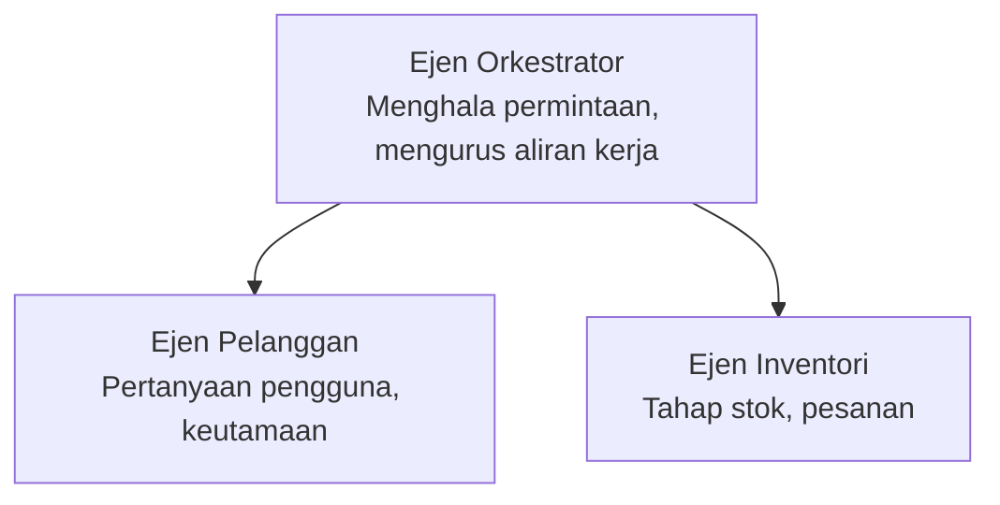

# Bab 5: Penyelesaian AI Pelbagai Ejen

**📚 Kursus**: [AZD Untuk Pemula](../../README.md) | **⏱️ Tempoh**: 2-3 jam | **⭐ Kompleksiti**: Lanjutan

---

## Gambaran Keseluruhan

Bab ini merangkumi corak seni bina pelbagai ejen lanjutan, orkestrasi ejen, dan penyebaran AI bersedia produksi untuk senario yang kompleks.

> Disahkan terhadap `azd 1.25.6` pada Jun 2026.

## Objektif Pembelajaran

Dengan menamatkan bab ini, anda akan:
- Memahami corak seni bina pelbagai ejen
- Menyebarkan sistem ejen AI berpadu
- Melaksanakan komunikasi ejen-ke-ejen
- Membina penyelesaian pelbagai ejen bersedia produksi

---

## 📚 Pelajaran

| # | Pelajaran | Deskripsi | Masa |
|---|-----------|-----------|------|
| 1 | [Asas Pelbagai Ejen](multi-agent-basics.md) | Praktikal: menyebarkan aplikasi pelbagai ejen berfungsi dengan `azd up` | 45 min |
| 2 | [Corak Koordinasi](../chapter-06-pre-deployment/coordination-patterns.md) | Strategi orkestrasi ejen (berterusan di Bab 6) | 30 min |
| 3 | [Penyebaran Templat ARM](../../examples/retail-multiagent-arm-template/README.md) | Contoh penyebaran satu klik | 30 min |

> **Mulakan dengan Pelajaran 1.** Ia adalah satu-satunya pelajaran yang sepenuhnya praktikal dan boleh disebarkan dalam bab ini. Pelajaran 2 berada di Bab 6 (ia dikongsi dengan perancangan pra-pengeluaran), dan [Penyelesaian Pelbagai Ejen Runcit](../../examples/retail-scenario.md) adalah cetusan reka bentuk seni bina—rujukan reka bentuk, bukan templat satu arahan.

---

## 🚀 Mula Dengan Cepat

```bash
# Pilihan 1: Melaksanakan dari templat
azd init --template agent-openai-python-prompty
azd up

# Pilihan 2: Melaksanakan dari manifest ejen (memerlukan sambungan azure.ai.agents)
azd extension install azure.ai.agents
azd ai agent init -m agent-manifest.yaml
azd up
```

> **Pendekatan mana?** Gunakan `azd init --template` untuk memulakan dari contoh yang berfungsi. Gunakan `azd ai agent init` apabila anda mempunyai manifest ejen sendiri. Lihat [rujukan AZD AI CLI](../chapter-08-production/production-ai-practices.md#azd-ai-cli-commands-and-extensions) untuk maklumat penuh.

---

## 🤖 Seni Bina Pelbagai Ejen



---

## 🎯 Penyelesaian Unggulan: Pelbagai Ejen Runcit

[Penyelesaian Pelbagai Ejen Runcit](../../examples/retail-scenario.md) menunjukkan:

- **Ejen Pelanggan**: Mengendalikan interaksi dan keutamaan pengguna
- **Ejen Inventori**: Mengurus stok dan pemprosesan pesanan
- **Orkestrator**: Memadankan antara ejen
- **Memori Kongsi**: Pengurusan konteks rentas ejen

### Perkhidmatan Yang Digunakan

| Perkhidmatan | Tujuan |
|--------------|---------|
| Microsoft Foundry Models | Pemahaman bahasa |
| Azure AI Search | Katalog produk |
| Cosmos DB | Keadaan dan memori ejen |
| Container Apps | Hosting ejen |
| Application Insights | Pemantauan |

---

## 🔗 Navigasi

| Arah | Bab |
|-------|------|
| **Sebelumnya** | [Bab 4: Infrastruktur](../chapter-04-infrastructure/README.md) |
| **Seterusnya** | [Bab 6: Pra-Penyebaran](../chapter-06-pre-deployment/README.md) |

---

## 📖 Sumber Berkaitan

- [Panduan Ejen AI](../chapter-02-ai-development/agents.md)
- [Amalan AI Produksi](../chapter-08-production/production-ai-practices.md)
- [Penyelesaian Masalah AI](../chapter-07-troubleshooting/ai-troubleshooting.md)

---

<!-- CO-OP TRANSLATOR DISCLAIMER START -->
**Penafian**:
Dokumen ini telah diterjemahkan menggunakan perkhidmatan terjemahan AI [Co-op Translator](https://github.com/Azure/co-op-translator). Walaupun kami berusaha untuk ketepatan, sila ambil maklum bahawa terjemahan automatik mungkin mengandungi kesilapan atau ketidaktepatan. Dokumen asal dalam bahasa asalnya harus dianggap sebagai sumber yang sahih. Untuk maklumat penting, terjemahan oleh manusia profesional adalah disyorkan. Kami tidak bertanggungjawab terhadap sebarang salah faham atau salah tafsir yang timbul daripada penggunaan terjemahan ini.
<!-- CO-OP TRANSLATOR DISCLAIMER END -->