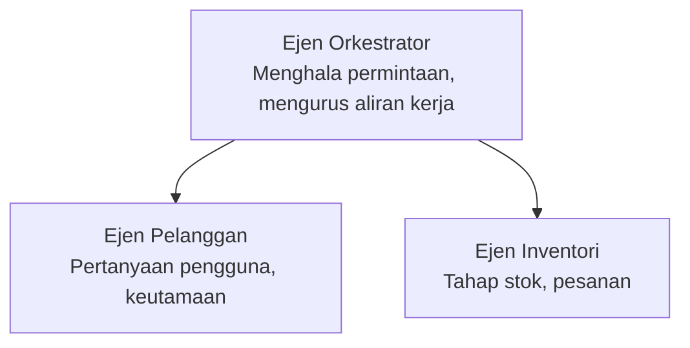

# Bab 5: Penyelesaian AI Multi-Ejen

**📚 Kursus**: [AZD Untuk Pemula](../../README.md) | **⏱️ Tempoh**: 2-3 jam | **⭐ Kerumitan**: Lanjutan

---

## Gambaran Keseluruhan

Bab ini merangkumi corak seni bina multi-ejen lanjutan, pengorkestran ejen, dan penggubahan AI sedia produksi untuk senario yang kompleks.

> Disahkan menggunakan `azd 1.23.12` pada Mac 2026.

## Objektif Pembelajaran

Dengan menamatkan bab ini, anda akan:
- Memahami corak seni bina multi-ejen
- Menggubah sistem ejen AI yang diselaraskan
- Melaksanakan komunikasi antara ejen
- Membina penyelesaian multi-ejen sedia produksi

---

## 📚 Pelajaran

| # | Pelajaran | Penerangan | Masa |
|---|-----------|------------|------|
| 1 | [Penyelesaian Multi-Ejen Runcit](../../examples/retail-scenario.md) | Panduan pelaksanaan lengkap | 90 min |
| 2 | [Corak Penyelarasan](../chapter-06-pre-deployment/coordination-patterns.md) | Strategi pengorkestran ejen | 30 min |
| 3 | [Penggubahan Templat ARM](../../examples/retail-multiagent-arm-template/README.md) | Penggubahan satu klik | 30 min |

---

## 🚀 Mula Cepat

```bash
# Pilihan 1: Sebarkan dari templat
azd init --template agent-openai-python-prompty
azd up

# Pilihan 2: Sebarkan dari manifest ejen (memerlukan sambungan azure.ai.agents)
azd extension install azure.ai.agents
azd ai agent init -m agent-manifest.yaml
azd up
```

> **Pendekatan mana?** Gunakan `azd init --template` untuk bermula dari contoh yang berfungsi. Gunakan `azd ai agent init` apabila anda mempunyai manifest ejen anda sendiri. Lihat [rujukan AZD AI CLI](../chapter-08-production/production-ai-practices.md#azd-ai-cli-commands-and-extensions) untuk butiran penuh.

---

## 🤖 Seni Bina Multi-Ejen


---

## 🎯 Penyelesaian Pilihan: Multi-Ejen Runcit

[Penyelesaian Multi-Ejen Runcit](../../examples/retail-scenario.md) menunjukkan:

- **Ejen Pelanggan**: Mengendalikan interaksi pengguna dan keutamaan
- **Ejen Inventori**: Mengurus stok dan pemprosesan pesanan
- **Orkestrator**: Menyelaraskan antara ejen
- **Memori Berkongsi**: Pengurusan konteks rentas ejen

### Perkhidmatan Digunakan

| Perkhidmatan | Tujuan |
|--------------|---------|
| Model Microsoft Foundry | Pemahaman bahasa |
| Azure AI Search | Katalog produk |
| Cosmos DB | Keadaan dan memori ejen |
| Container Apps | Host ejen |
| Application Insights | Pemantauan |

---

## 🔗 Navigasi

| Arah | Bab |
|-------|-----|
| **Sebelumnya** | [Bab 4: Infrastruktur](../chapter-04-infrastructure/README.md) |
| **Seterusnya** | [Bab 6: Pra-Penggubahan](../chapter-06-pre-deployment/README.md) |

---

## 📖 Sumber Berkaitan

- [Panduan Ejen AI](../chapter-02-ai-development/agents.md)
- [Amalan AI Produksi](../chapter-08-production/production-ai-practices.md)
- [Penyelesaian Masalah AI](../chapter-07-troubleshooting/ai-troubleshooting.md)

---

<!-- CO-OP TRANSLATOR DISCLAIMER START -->
**Penafian**:  
Dokumen ini telah diterjemahkan menggunakan perkhidmatan terjemahan AI [Co-op Translator](https://github.com/Azure/co-op-translator). Walaupun kami berusaha untuk ketepatan, sila maklum bahawa terjemahan automatik mungkin mengandungi kesilapan atau ketidaktepatan. Dokumen asal dalam bahasa asalnya hendaklah dianggap sebagai sumber yang sahih. Untuk maklumat yang kritikal, terjemahan profesional oleh manusia adalah disyorkan. Kami tidak bertanggungjawab atas sebarang salah faham atau salah tafsir yang timbul daripada penggunaan terjemahan ini.
<!-- CO-OP TRANSLATOR DISCLAIMER END -->