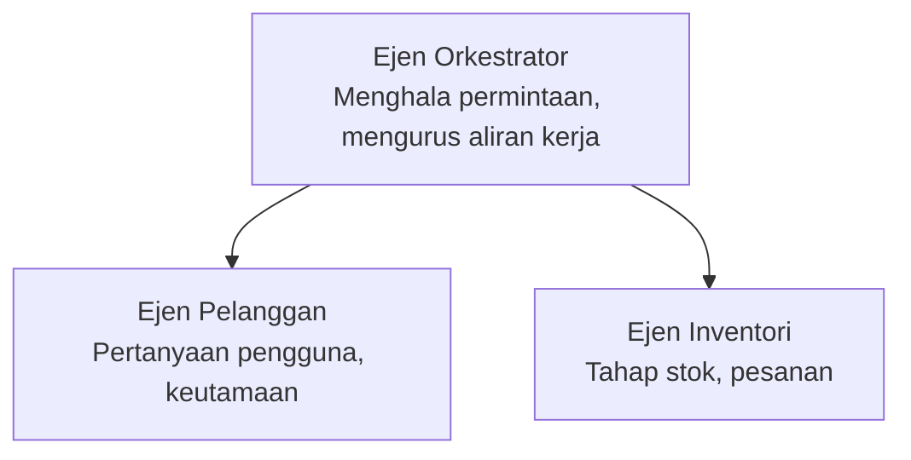

# Bab 5: Penyelesaian AI Pelbagai Ejen

**📚 Kursus**: [AZD Untuk Pemula](../../README.md) | **⏱️ Tempoh**: 2-3 jam | **⭐ Kerumitan**: Lanjutan

---

## Gambaran Keseluruhan

Bab ini merangkumi corak seni bina ejen pelbagai lanjutan, orkestrasi ejen, dan penerapan AI yang sedia untuk pengeluaran bagi senario yang kompleks.

## Objektif Pembelajaran

Dengan melengkapkan bab ini, anda akan:
- Memahami corak seni bina ejen pelbagai
- Melaksanakan sistem ejen AI yang terkoordinasi
- Melaksanakan komunikasi ejen-ke-ejen
- Membina penyelesaian ejen pelbagai yang sedia untuk pengeluaran

---

## 📚 Pelajaran

| # | Pelajaran | Penerangan | Masa |
|---|--------|-------------|------|
| 1 | [Penyelesaian Ejen Pelbagai Runcit](../../examples/retail-scenario.md) | Langkah pelaksanaan lengkap | 90 min |
| 2 | [Corak Penyelarasan](../chapter-06-pre-deployment/coordination-patterns.md) | Strategi orkestrasi ejen | 30 min |
| 3 | [Penerapan Templat ARM](../../examples/retail-multiagent-arm-template/README.md) | Penerapan satu klik | 30 min |

---

## 🚀 Mula Pantas

```bash
# Pilihan 1: Melakukan penyebaran dari templat
azd init --template agent-openai-python-prompty
azd up

# Pilihan 2: Melakukan penyebaran dari manifest agen (memerlukan sambungan azure.ai.agents)
azd extension install azure.ai.agents
azd ai agent init -m agent-manifest.yaml
azd up
```

> **Pendekatan mana?** Gunakan `azd init --template` untuk bermula dari contoh yang berfungsi. Gunakan `azd ai agent init` apabila anda mempunyai manifest ejen sendiri. Lihat [rujukan AZD AI CLI](../chapter-08-production/production-ai-practices.md#azd-ai-cli-commands-and-extensions) untuk maklumat penuh.

---

## 🤖 Seni Bina Ejen Pelbagai


---

## 🎯 Penyelesaian Terpilih: Ejen Pelbagai Runcit

[Penyelesaian Ejen Pelbagai Runcit](../../examples/retail-scenario.md) menunjukkan:

- **Ejen Pelanggan**: Mengendalikan interaksi pengguna dan keutamaan
- **Ejen Inventori**: Mengurus stok dan pemprosesan pesanan
- **Orkestrator**: Menyelaras antara ejen
- **Memori Berkongsi**: Pengurusan konteks merentasi ejen

### Perkhidmatan Digunakan

| Perkhidmatan | Tujuan |
|---------|---------|
| Model Microsoft Foundry | Pemahaman bahasa |
| Azure AI Search | Katalog produk |
| Cosmos DB | Keadaan dan memori ejen |
| Container Apps | Hos ejen |
| Application Insights | Pemantauan |

---

## 🔗 Navigasi

| Arah | Bab |
|-----------|---------|
| **Sebelumnya** | [Bab 4: Infrastruktur](../chapter-04-infrastructure/README.md) |
| **Seterusnya** | [Bab 6: Pra-Penerapan](../chapter-06-pre-deployment/README.md) |

---

## 📖 Sumber Berkaitan

- [Panduan Ejen AI](../chapter-02-ai-development/agents.md)
- [Amalan Pengeluaran AI](../chapter-08-production/production-ai-practices.md)
- [Penyelesaian Masalah AI](../chapter-07-troubleshooting/ai-troubleshooting.md)

---

<!-- CO-OP TRANSLATOR DISCLAIMER START -->
**Penafian**:  
Dokumen ini telah diterjemahkan menggunakan perkhidmatan terjemahan AI [Co-op Translator](https://github.com/Azure/co-op-translator). Walaupun kami berusaha untuk ketepatan, sila ambil perhatian bahawa terjemahan automatik mungkin mengandungi kesilapan atau ketidaktepatan. Dokumen asal dalam bahasa asalnya harus dianggap sebagai sumber yang sahih. Untuk maklumat penting, terjemahan profesional oleh manusia adalah disyorkan. Kami tidak bertanggungjawab atas sebarang salah faham atau salah tafsir yang timbul daripada penggunaan terjemahan ini.
<!-- CO-OP TRANSLATOR DISCLAIMER END -->