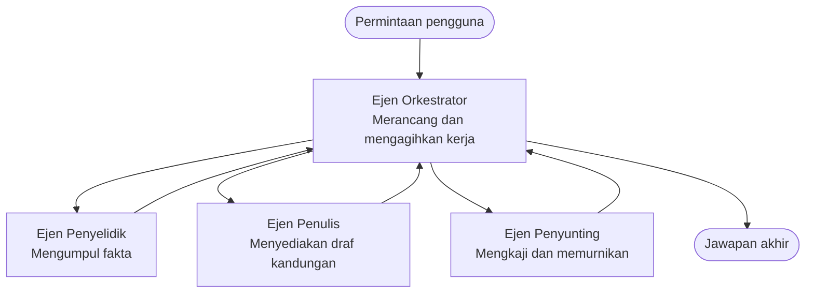

# Asas Multi-Ejen - Lancarkan Sistem AI Terkoordinasi Pertama Anda

**Navigasi Bab:**
- **📚 Utama Kursus**: [AZD Untuk Pemula](../../README.md)
- **📖 Bab Semasa**: Bab 5 - Penyelesaian AI Multi-Ejen
- **⬅️ Sebelumnya**: [Bab 4: Infrastruktur](../chapter-04-infrastructure/README.md)
- **➡️ Seterusnya**: [Corak Penyelarasan](../chapter-06-pre-deployment/coordination-patterns.md)

> Disahkan terhadap `azd 1.25.6` pada Jun 2026.

## Pengenalan

Dalam bab-bab terdahulu anda telah melancarkan satu aplikasi—dan dalam Bab 2 anda telah melancarkan satu ejen AI. Pelajaran ini mengambil langkah seterusnya: melancarkan sebuah **sistem multi-ejen**, di mana beberapa ejen khusus bekerjasama untuk menyelesaikan masalah yang tidak dapat ditangani dengan baik oleh satu ejen sahaja.

Berita baik untuk pemula: **anda tidak memerlukan arahan baru.** Penyelesaian multi-ejen masih merupakan projek azd. Anda akan `azd init`, `azd up`, menguji, dan `azd down`—tepat seperti aliran kerja yang sudah anda kenali. Apa yang berubah ialah *bentuk* aplikasi di dalamnya.

## Matlamat Pembelajaran

Pada akhir pelajaran ini, anda akan:
- Memahami apa maksud "multi-ejen" dan bila ia berbaloi dengan kerumitan tambahan
- Mengenal pasti peranan biasa dalam sistem multi-ejen (orkestrator + pakar)
- Melancarkan templat multi-ejen yang sebenar dan berfungsi dengan `azd up`
- Memahami sumber Azure yang menyokong aplikasi multi-ejen
- Mengetahui cara untuk mengesahkan, menyesuaikan, dan mematikan penyelesaian dengan selamat

## Hasil Pembelajaran

Selepas menyelesaikan pelajaran ini, anda akan dapat:
- Menjelaskan perbezaan antara ejen tunggal dan sistem multi-ejen
- Memilih antara ejen tunggal dengan alat dan reka bentuk multi-ejen sebenar
- Melancarkan dan menguji templat multi-ejen dari hujung ke hujung dengan azd
- Mengenal pasti di mana setiap ejen berjalan dan bagaimana mereka berkomunikasi
- Membersihkan semua sumber untuk mengelakkan caj berterusan

---

## Apakah Sistem Multi-Ejen?

Satu ejen AI tunggal ialah satu model dengan set arahan dan (secara pilihan) beberapa alat. Itu berfungsi dengan baik untuk tugas fokus. Tetapi apabila tugas berkembang—menyelidik, kemudian menulis, kemudian menyunting, kemudian menyemak fakta—memasukkan segala-galanya ke dalam satu prompt membuat ejen menjadi lebih perlahan, kurang boleh dipercayai, dan lebih sukar untuk di-debug.

Sebuah **sistem multi-ejen** memecahkan kerja kepada pakar yang masing-masing melakukan satu tugas dengan baik, diselaraskan oleh seorang orkestrator:



### Dua peranan yang akan anda selalu lihat

| Peranan | Tugas | Contoh |
|--------|-------|--------|
| **Orkestrator** | Memutuskan *apa yang berlaku seterusnya* dan mengarahkan kerja antara ejen | "Pertama penyelidikan, kemudian menulis, kemudian menyunting" |
| **Pakar** | Melakukan satu tugas fokus dan mengembalikan hasil | Seorang "penyelidik" yang hanya mengumpulkan fakta |

### Adakah anda benar-benar memerlukan berbilang ejen?

Mulakan dengan ringkas. Gunakan multi-ejen **hanya** apabila salah satu daripada berikut benar:

- ✅ Tugasan mempunyai **peringkat berbeza** yang mendapat manfaat daripada arahan berlainan (penyelidikan vs. menulis vs. semakan)
- ✅ Anda mahu pakar dijalankan **selari** untuk menjimatkan masa
- ✅ Langkah berbeza memerlukan **alat atau sumber data berbeza**
- ✅ Anda memerlukan setiap langkah untuk **boleh diuji dan dibaiki secara bebas**

Jika tugas anda ialah satu soalan-dan-jawapan atau panggilan alat yang ringkas, sebuah **ejen tunggal dengan alat** (Bab 2) adalah lebih ringkas, lebih murah, dan lebih mudah untuk dioperasikan.

> **Petua untuk pemula:** "Lebih banyak ejen" bukan bermakna "lebih baik." Setiap ejen menambah kelewatan, kos, dan satu perkara baru untuk dipantau. Tambah ejen hanya apabila masalah itu jelas berpecah kepada beberapa bahagian.

---

## Dua Cara untuk Membangun Multi-Ejen di Azure

| Pendekatan | Apa itu | Sesuai untuk |
|-----------|--------|--------------|
| **Ejen tunggal + alat** | Satu ejen Foundry yang memanggil fungsi/alat | Aliran kerja mudah, permulaan |
| **Berbilang ejen berkoordinasi** | Beberapa ejen dengan seorang orkestrator | Peringkat berbeza, kerja selari, pengkhususan |

Pelajaran ini memberi tumpuan kepada pendekatan kedua menggunakan **templat siap pakai**, supaya anda dapat melihat sistem multi-ejen sebenar berjalan sebelum anda membina sendiri.

---

## Praktikal: Lancarkan Aplikasi Multi-Ejen yang Berfungsi

Kita akan melancarkan **Contoso Creative Writer**, contoh rasmi Azure yang menggunakan beberapa ejen (penyelidik, penulis, penyunting) yang diselaraskan untuk menghasilkan artikel. Ia merupakan aplikasi multi-ejen pertama yang bagus kerana peranan mudah difahami.

### Langkah 1: Inisialisasikan templat

```bash
# Buat folder kerja
mkdir creative-writer && cd creative-writer

# Inisialisasikan daripada templat multi-ejen rasmi
azd init --template contoso-creative-writer
```

> Layari lebih banyak templat multi-ejen bila-bila masa di [Galeri Awesome AZD AI](https://azure.github.io/awesome-azd/?tags=ai). Pilihan mesra pemula lain termasuk `get-started-with-ai-agents` dan `azure-ai-travel-agents`.

### Langkah 2: Pengesahan

```bash
# Diperlukan untuk aliran kerja azd
azd auth login
```

### Langkah 3: Cipta persekitaran

```bash
azd env new dev
```

### Langkah 4: Pratonton, kemudian lancarkan

```bash
# Lihat apa yang akan dibuat sebelum membelanjakan apa-apa (disyorkan)
azd provision --preview

# Sediakan infrastruktur dan terapkan semua ejen dalam satu langkah
azd up
```

`azd up` akan meminta langganan dan rantau, kemudian menyediakan sumber Azure dan melancarkan aplikasi. Pelancaran AI boleh mengambil masa lebih lama daripada aplikasi web ringkas—jika anda sedang melancarkan model yang lebih besar, anda boleh melanjutkan masa tamat pelancaran:

```bash
azd deploy --timeout 1800
```

> **Perhatian tentang kos dan kapasiti:** Aplikasi multi-ejen melancarkan model AI yang menggunakan kuota dan menimbulkan kos. Jika `azd up` gagal kerana kuota model, lihat [Penyelesaian Masalah AI](../chapter-07-troubleshooting/ai-troubleshooting.md) untuk pembetulan rantau dan kuota, dan Bab 6 [Perancangan Kapasiti](../chapter-06-pre-deployment/capacity-planning.md).

---

## Memahami Apa yang Anda Lancarkan

Aplikasi multi-ejen biasa seperti ini menyediakan satu set sumber Azure yang memetakan secara langsung kepada tanggungjawab dalam rajah di atas:

| Sumber | Kenapa ia ada |
|--------|---------------|
| **Microsoft Foundry / Models** | Menempatkan model bahasa yang digunakan oleh setiap ejen |
| **Azure AI Search** | Membekalkan ejen penyelidik data berpandukan untuk dicari |
| **Container Apps** (atau App Service) | Menempatkan kod orkestrator dan ejen |
| **Cosmos DB** (dalam beberapa contoh) | Menyimpan keadaan/memori bersama yang dipindahkan antara ejen |
| **Application Insights** | Menjejak permintaan *merentas* ejen supaya anda boleh menyahpepijat aliran |

### Bagaimana ejen berkomunikasi antara satu sama lain

Dalam kebanyakan sampel multi-ejen azd, **orkestrator berjalan dalam kod aplikasi anda** (contohnya, menggunakan rangka kerja seperti Semantic Kernel atau Microsoft Agent Framework). Orkestrator memanggil setiap ejen pakar secara berurutan, menyampaikan keputusan, dan menyusun jawapan akhir. Ejen berkongsi konteks melalui:

- **Panggilan fungsi/alat** — orkestrator memanggil pakar dan mendapat hasil kembali
- **Memori bersama** — pangkalan data (sering Cosmos DB) menyimpan keadaan yang kedua-dua ejen boleh baca
- **Mesej/acara** — untuk pengikatan longgar, ejen berkomunikasi melalui barisan atau Service Bus

> **Mengapa ini penting untuk penyahpepijatan:** kerana setiap langkah adalah berasingan, Application Insights menunjukkan *ejen yang mana* yang perlahan atau gagal. Itulah salah satu sebab utama untuk membahagikan kerja merentas ejen pada mulanya.

---

## Sahkan Pelancaran

Sahkan sistem benar-benar berfungsi sebelum meneruskan:

```bash
# Tunjukkan endpoint yang diterapkan
azd show

# Buka papan pemuka pemantauan aplikasi
azd monitor

# Ikuti log jika sesuatu kelihatan tidak betul
azd monitor --logs
```

Kemudian buka URL aplikasi dari `azd show` dan cuba satu permintaan yang menggunakan semua ejen (untuk Creative Writer, minta ia menulis artikel pendek tentang sesuatu topik). Dalam **transaction search** Application Insights, anda sepatutnya melihat permintaan merebak merentas langkah penyelidik, penulis, dan penyunting.

**Kriteria kejayaan:**
- ✅ `azd show` menyenaraikan titik hujung yang boleh dicapai
- ✅ Permintaan menghasilkan hasil yang jelas melalui pelbagai peringkat
- ✅ Application Insights menunjukkan jejak untuk lebih daripada satu langkah ejen

---

## Sesuaikan: Tambah atau Laraskan Ejen

Kerana setiap ejen hanyalah arahan ditambah alat, penyesuaian boleh dilakukan dengan mudah:

1. **Cari definisi ejen** dalam templat (selalunya satu set fail `prompts/`, `agents/`, atau `*.prompty`).
2. **Laraskan arahan ejen** — contohnya, beritahu ejen penyunting untuk menguatkuasakan nada atau jumlah kata tertentu.
3. **Dideploy semula hanya kod** (infrastruktur tidak berubah):

   ```bash
   azd deploy
   ```

Untuk melangkah lebih jauh dan membina ejen dari manifest *anda sendiri*, gunakan sambungan ejen dan kitar hayat penuhnya:

```bash
azd extension install azure.ai.agents
azd ai agent init -m agent-manifest.yaml
azd up
azd ai agent invoke      # ujian, dengan masa tindak balas
```

Rujuk [Bab 2: Ejen](../chapter-02-ai-development/agents.md) dan [Rujukan AZD AI CLI](../chapter-08-production/production-ai-practices.md#azd-ai-cli-commands-and-extensions) untuk kitar hayat ejen yang lengkap (`invoke`, `eval generate`, `optimize`, `delete`).

---

## Bersihkan

Aplikasi multi-ejen menjalankan beberapa perkhidmatan yang boleh dikenakan bayaran. Matikan semuanya apabila anda selesai:

```bash
azd down --force --purge
```

Bendera `--purge` juga membuang sumber AI yang dipadam secara lembut (seperti akaun Foundry/Azure AI Services) supaya ia tidak menghalang pelancaran semula di masa hadapan atau terus menimbulkan kos.

---

## Nota tentang Sistem Multi-Ejen Pengeluaran

[Penyelesaian Multi-Ejen Runcit](../../examples/retail-scenario.md) dalam repositori ini ialah sebuah **pelan seni bina**, bukan templat satu-ara—ia mendokumentasikan bagaimana sistem runcit pengeluaran *akan* dibina (dan menyatakan dengan jelas bahawa pembinaan penuh adalah usaha yang besar). Gunakan ia sebagai rujukan reka bentuk *selepas* anda melancarkan contoh yang berfungsi di sini. Untuk kebimbangan pengeluaran (ketahanan, kos, pemantauan, tadbir urus), teruskan ke [Bab 8: Amalan AI Pengeluaran](../chapter-08-production/production-ai-practices.md).

---

## Ringkasan

- Sistem multi-ejen membahagikan kerja kepada pakar yang diselaraskan oleh seorang orkestrator.
- Gunakan ia hanya apabila tugas mempunyai peringkat berbeza, kebolehselarasan selari, atau alat berbeza untuk setiap langkah—jika tidak, pilih ejen tunggal.
- Aliran kerja azd tidak berubah: `azd init` → `azd up` → uji → `azd down`.
- Templat sebenar seperti `contoso-creative-writer` membolehkan anda melihat dan menyesuaikan aplikasi multi-ejen yang berfungsi hari ini.
- Penjejakan Application Insights merentas ejen ialah salah satu manfaat praktikal terbesar reka bentuk multi-ejen.

---

## 🔗 Navigasi

| Arah | Pelajaran |
|------|-----------|
| **Sebelumnya** | [Bab 4: Infrastruktur](../chapter-04-infrastructure/README.md) |
| **Seterusnya** | [Corak Penyelarasan](../chapter-06-pre-deployment/coordination-patterns.md) |

## 📖 Sumber Berkaitan

- [Panduan Ejen AI](../chapter-02-ai-development/agents.md)
- [Corak Penyelarasan](../chapter-06-pre-deployment/coordination-patterns.md)
- [Amalan AI Pengeluaran](../chapter-08-production/production-ai-practices.md)
- [Penyelesaian Masalah AI](../chapter-07-troubleshooting/ai-troubleshooting.md)

---

<!-- CO-OP TRANSLATOR DISCLAIMER START -->
**Penafian**:
Dokumen ini telah diterjemahkan menggunakan perkhidmatan terjemahan AI [Co-op Translator](https://github.com/Azure/co-op-translator). Walaupun kami berusaha untuk ketepatan, sila ambil maklum bahawa terjemahan automatik mungkin mengandungi kesilapan atau ketidaktepatan. Dokumen asal dalam bahasa asalnya harus dianggap sebagai sumber yang sahih. Untuk maklumat penting, terjemahan oleh manusia profesional adalah disyorkan. Kami tidak bertanggungjawab terhadap sebarang salah faham atau salah tafsir yang timbul daripada penggunaan terjemahan ini.
<!-- CO-OP TRANSLATOR DISCLAIMER END -->