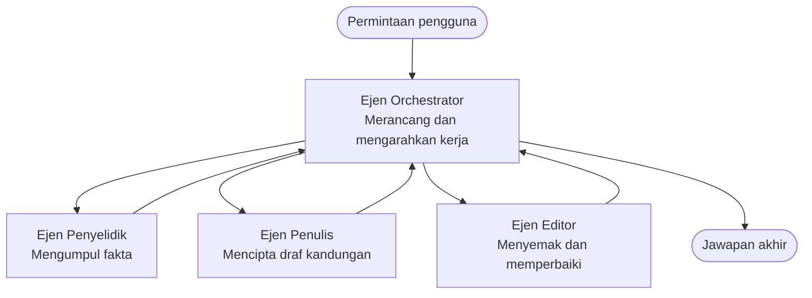

# Asas Multi-Ejen - Deploy Sistem AI Berkoordinasi Pertama Anda

**Navigasi Bab:**
- **📚 Laman Kursus**: [AZD Untuk Pemula](../../README.md)
- **📖 Bab Semasa**: Bab 5 - Penyelesaian AI Multi-Ejen
- **⬅️ Sebelumnya**: [Bab 4: Infrastruktur](../chapter-04-infrastructure/README.md)
- **➡️ Seterusnya**: [Corak Koordinasi](../chapter-06-pre-deployment/coordination-patterns.md)

> Disahkan dengan `azd 1.27.1` pada Julai 2026.

## Pengenalan

Dalam bab-bab sebelum ini anda telah deploy satu aplikasi—dan dalam Bab 2 anda deploy satu ejen AI. Pelajaran ini mengambil langkah seterusnya: deploy **sistem multi-ejen**, di mana beberapa ejen pakar bekerja bersama menyelesaikan masalah yang tidak dapat diatasi oleh satu ejen sahaja dengan baik.

Berita baik untuk pemula: **anda tidak memerlukan arahan baru.** Penyelesaian multi-ejen masih merupakan projek azd. Anda akan `azd init`, `azd up`, uji, dan `azd down`—tepat seperti aliran kerja yang sudah anda tahu. Apa yang berubah adalah *bentuk* aplikasi di dalamnya.

## Matlamat Pembelajaran

Pada akhir pelajaran ini, anda akan:
- Faham maksud "multi-ejen" dan bila ia berbaloi dengan kerumitan tambahan
- Kenali peranan biasa dalam sistem multi-ejen (pengarah + pakar)
- Deploy templat multi-ejen sebenar yang berfungsi dengan `azd up`
- Faham sumber Azure yang menyokong aplikasi multi-ejen
- Tahu cara mengesahkan, menyesuaikan, dan membongkar penyelesaian dengan selamat

## Hasil Pembelajaran

Selepas menamatkan pelajaran ini, anda akan mampu:
- Terangkan perbezaan antara ejen tunggal dan sistem multi-ejen
- Pilih antara ejen tunggal dengan alat dan reka bentuk multi-ejen yang sebenar
- Deploy dan uji templat multi-ejen dari awal ke akhir dengan azd
- Kenal pasti di mana setiap ejen berjalan dan bagaimana mereka berkomunikasi
- Bersihkan semua sumber untuk elakkan caj berterusan

---

## Apa Itu Sistem Multi-Ejen?

Satu ejen AI tunggal adalah satu model dengan satu set arahan dan (pilihan) beberapa alat. Itu berfungsi dengan baik untuk tugas yang fokus. Tetapi apabila tugas membesar—penyelidikan, kemudian menulis, kemudian menyunting, kemudian penyemakan fakta—memadatkan semuanya dalam satu prompt membuat ejen jadi lebih perlahan, kurang boleh diharap, dan lebih sukar untuk debug.

Sistem **multi-ejen** memecahkan kerja kepada pakar yang setiap satu buat satu kerja dengan baik, dikordinasi oleh seorang pengarah:



### Dua peranan yang anda selalu lihat

| Peranan | Kerja | Contoh |
|------|-----|---------|
| **Pengarah** | Memutuskan *apa yang terjadi seterusnya* dan mengarahkan kerja antara ejen | "Pertama kaji, kemudian tulis, kemudian sunting" |
| **Pakar** | Buat satu kerja fokus dan pulangkan hasil | Seorang "penyelidik" yang hanya kumpul fakta |

### Adakah anda benar-benar perlukan banyak ejen?

Mula dengan mudah. Gunakan multi-ejen **hanya** bila salah satu yang berikut benar:

- ✅ Tugasan mempunyai **peringkat berbeza** yang memerlukan arahan berbeza (penyelidikan vs. tulis vs. semak)
- ✅ Anda mahu pakar berjalan **selari** untuk jimat masa
- ✅ Langkah-langkah berbeza perlu **alat atau sumber data berbeza**
- ✅ Anda mahu setiap langkah boleh diuji dan debug secara bebas

Jika tugasan anda hanyalah soal jawab atau panggilan alat ringkas, **ejen tunggal dengan alat** (Bab 2) lebih mudah, murah, dan senang dioperasi.

> **Petua untuk pemula:** "Lebih banyak ejen" bukan bermakna "lebih baik." Setiap ejen tambah kelewatan, kos, dan sesuatu baru yang perlu dipantau. Tambah ejen hanya bila masalah jelas berpecah kepada bahagian.

---

## Dua Cara Membina Multi-Ejen di Azure

| Pendekatan | Apa dia | Sesuai untuk |
|----------|-----------|----------|
| **Ejen tunggal + alat** | Satu ejen Foundry yang panggil fungsi/alat | Aliran kerja mudah, permulaan |
| **Beberapa ejen berkoordinasi** | Beberapa ejen dengan seorang pengarah | Peringkat berbeza, kerja selari, kepakaran |

Pelajaran ini fokus pada pendekatan kedua menggunakan **templat sedia ada**, supaya anda dapat melihat sistem multi-ejen sebenar berjalan sebelum bina sendiri.

---

## Amali: Deploy Aplikasi Multi-Ejen Yang Berfungsi

Kita akan deploy **Penulis Kreatif Contoso**, contoh rasmi Azure yang menggunakan pelbagai ejen (penyelidik, penulis, penyunting) yang diatur bagi menghasilkan artikel. Ia adalah aplikasi multi-ejen pertama yang bagus kerana peranannya mudah difahami.

### Langkah 1: Inisialisasi templat

```bash
# Cipta folder kerja
mkdir creative-writer && cd creative-writer

# Inisialisasi dari templat multi-ejen rasmi
azd init --template contoso-creative-writer
```

> Layari lebih banyak templat multi-ejen bila-bila masa di [Galeri Awesome AZD AI](https://azure.github.io/awesome-azd/?tags=ai). Pilihan mesra pemula lain termasuk `get-started-with-ai-agents` dan `azure-ai-travel-agents`.

### Langkah 2: Autentikasi

```bash
# Diperlukan untuk aliran kerja azd
azd auth login
```

### Langkah 3: Cipta persekitaran

```bash
azd env new dev
```

### Langkah 4: Pratonton, kemudian deploy

```bash
# Lihat apa yang akan dibuat sebelum membelanjakan apa-apa (disyorkan)
azd provision --preview

# Sediakan infrastruktur dan pasang semua ejen dalam satu langkah
azd up
```

`azd up` akan minta langganan dan rantau, kemudian sediakan sumber Azure dan deploy aplikasi. Deploy AI mungkin ambil masa lebih lama daripada app web ringkas—jika anda deploy model besar, boleh tambah masa timeout deploy:

```bash
azd deploy --timeout 1800
```

> **Berhati-hati tentang kos dan kapasiti:** Aplikasi multi-ejen deploy model AI yang menggunakan kuota dan menimbulkan kos. Jika `azd up` gagal kerana kuota model, lihat [Penyelesaian Masalah AI](../chapter-07-troubleshooting/ai-troubleshooting.md) untuk pembaikan rantau dan kuota, dan Bab 6 [Perancangan Kapasiti](../chapter-06-pre-deployment/capacity-planning.md).

---

## Fahami Apa Yang Anda Deploy

Aplikasi multi-ejen biasa seperti ini sediakan satu set sumber Azure yang memetakan terus ke tanggungjawab dalam rajah di atas:

| Sumber | Kenapa ia ada |
|----------|----------------|
| **Microsoft Foundry / Model** | Menghos model bahasa yang digunakan setiap ejen |
| **Azure AI Search** | Memberi data berpijak kepada ejen penyelidik untuk carian |
| **Container Apps** (atau App Service) | Menghos pengarah dan kod ejen |
| **Cosmos DB** (dalam beberapa contoh) | Simpan state/memori bersama yang dikongsi antara ejen |
| **Application Insights** | Jejak permintaan *merentasi* ejen supaya anda boleh debug aliran |

### Bagaimana ejen berkomunikasi antara satu sama lain

Dalam kebanyakan contoh multi-ejen azd, **pengarah dijalankan dalam kod aplikasi anda** (contoh, menggunakan kerangka seperti Semantic Kernel atau Microsoft Agent Framework). Pengarah memanggil setiap ejen pakar secara berturutan, menghantar hasil, dan menyusun jawapan akhir. Ejen berkongsi konteks melalui:

- **Panggilan fungsi/alat** — pengarah panggil pakar dan dapatkan hasil balik
- **Memori kongsi** — pangkalan data (biasanya Cosmos DB) memegang state yang boleh dibaca oleh kedua-dua ejen
- **Mesej/acara** — untuk pengkaitan longgar, ejen berkomunikasi melalui antrian atau Service Bus

> **Kenapa ini penting untuk debug:** kerana setiap langkah berasingan, Application Insights tunjukkan *ejen mana* yang lambat atau gagal. Itu sebab utama untuk pecahkan kerja antara ejen dari awal.

---

## Sahkan Deploy

Pastikan sistem sebenarnya berfungsi sebelum teruskan:

```bash
# Paparkan titik akhir yang telah digunakan
azd show

# Buka papan pemuka pemantauan aplikasi
azd monitor

# Jejak log jika ada sesuatu yang kelihatan tidak kena
azd monitor --logs
```

Kemudian buka URL app dari `azd show` dan cuba permintaan yang menguji semua ejen (untuk Penulis Kreatif, minta tulis artikel pendek pada topik). Dalam carian transaksi Application Insights, anda harus lihat permintaan tersebar ke langkah penyelidik, penulis, dan penyunting.

**Kriteria kejayaan:**
- ✅ `azd show` senaraikan titik akhir yang boleh dicapai
- ✅ Permintaan hasilkan keputusan yang jelas melalui pelbagai peringkat
- ✅ Application Insights tunjuk jejak untuk lebih dari satu langkah ejen

---

## Sesuaikan: Tambah atau Laras Ejen

Kerana setiap ejen hanya arahan plus alat, penyesuaian mudah:

1. **Cari takrif ejen** dalam templat (biasanya satu set fail dalam `prompts/`, `agents/`, atau `*.prompty`).
2. **Laraskan arahan ejen** — contoh, suruh ejen penyunting patuhi nada atau jumlah perkataan tertentu.
3. **Deploy semula hanya kod** (infrastruktur tidak berubah):

   ```bash
   azd deploy
   ```

Untuk maju lagi dan bina ejen dari manifesto *anda sendiri*, guna sambungan ejen dan kitar hayat lengkapnya:

```bash
azd extension install azure.ai.agents
azd ai agent init -m agent-manifest.yaml
azd up
azd ai agent invoke      # ujian, dengan masa tindak balas
```

Lihat [Bab 2: Ejen](../chapter-02-ai-development/agents.md) dan [rujukan AZD AI CLI](../chapter-08-production/production-ai-practices.md#azd-ai-cli-commands-and-extensions) untuk kitar hayat penuh ejen (`invoke`, `eval generate`, `optimize`, `delete`).

---

## Bersihkan

Aplikasi multi-ejen jalankan beberapa perkhidmatan berbayar. Bongkar semuanya bila sudah selesai:

```bash
azd down --force --purge
```

Bendera `--purge` juga membuang sumber AI yang dipadam lembut (contoh Foundry/Azure AI Services account) supaya tidak menghalang deploy masa depan atau terus menimbulkan kos.

---

## Nota tentang Sistem Multi-Ejen Produksi

[Penyelesaian Multi-Ejen Runcit](../../examples/retail-scenario.md) dalam repo ini adalah **cetakan seni bina**, bukan templat satu arahan—ia mendokumentasi bagaimana sistem runcit produksi *boleh* dibina (dan secara jelas mengatakan binaan penuh adalah usaha besar). Gunakan ia sebagai rujukan reka bentuk *selepas* anda deploy contoh yang berfungsi di sini. Untuk kebimbangan produksi (ketahanan, kos, pemantauan, tadbir urus), terus ke [Bab 8: Amalan AI Produksi](../chapter-08-production/production-ai-practices.md).

---

## Rumusan

- Sistem multi-ejen pecahkan kerja antara pakar yang dikordinasi oleh pengarah.
- Gunakannya hanya bila tugasan ada peringkat berbeza, kerja selari, atau alat berbeza setiap langkah—jika tidak, pilih ejen tunggal.
- Aliran kerja azd tidak berubah: `azd init` → `azd up` → uji → `azd down`.
- Templat sebenar seperti `contoso-creative-writer` membolehkan anda lihat dan sesuaikan aplikasi multi-ejen yang berfungsi hari ini.
- Jejak Application Insights merentasi ejen adalah antara manfaat praktikal terbesar reka bentuk multi-ejen.

---

## 🔗 Navigasi

| Arah | Pelajaran |
|-----------|--------|
| **Sebelumnya** | [Bab 4: Infrastruktur](../chapter-04-infrastructure/README.md) |
| **Seterusnya** | [Corak Koordinasi](../chapter-06-pre-deployment/coordination-patterns.md) |

## 📖 Sumber Berkaitan

- [Panduan Ejen AI](../chapter-02-ai-development/agents.md)
- [Corak Koordinasi](../chapter-06-pre-deployment/coordination-patterns.md)
- [Amalan AI Produksi](../chapter-08-production/production-ai-practices.md)
- [Penyelesaian Masalah AI](../chapter-07-troubleshooting/ai-troubleshooting.md)

---

<!-- CO-OP TRANSLATOR DISCLAIMER START -->
**Penafian**:
Dokumen ini telah diterjemahkan menggunakan perkhidmatan terjemahan AI [Co-op Translator](https://github.com/Azure/co-op-translator). Walaupun kami berusaha untuk ketepatan, sila ambil maklum bahawa terjemahan automatik mungkin mengandungi kesilapan atau ketidaktepatan. Dokumen asal dalam bahasa asalnya harus dianggap sebagai sumber yang sahih. Untuk maklumat penting, terjemahan oleh manusia profesional adalah disyorkan. Kami tidak bertanggungjawab terhadap sebarang salah faham atau salah tafsir yang timbul daripada penggunaan terjemahan ini.
<!-- CO-OP TRANSLATOR DISCLAIMER END -->