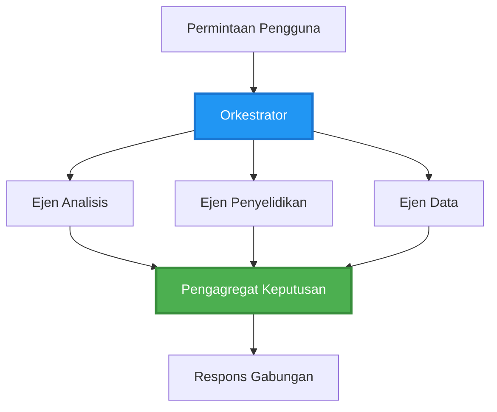
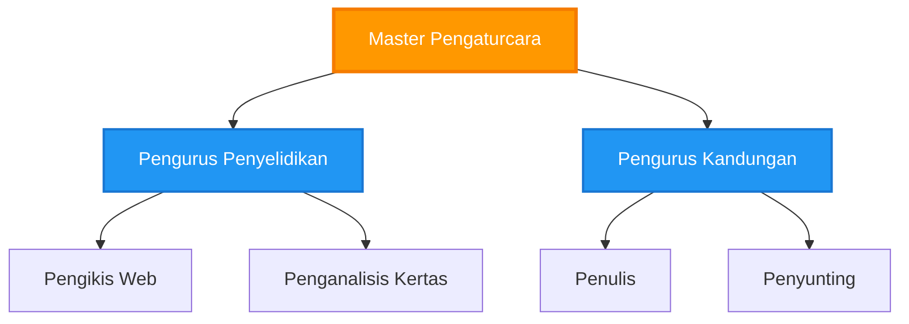
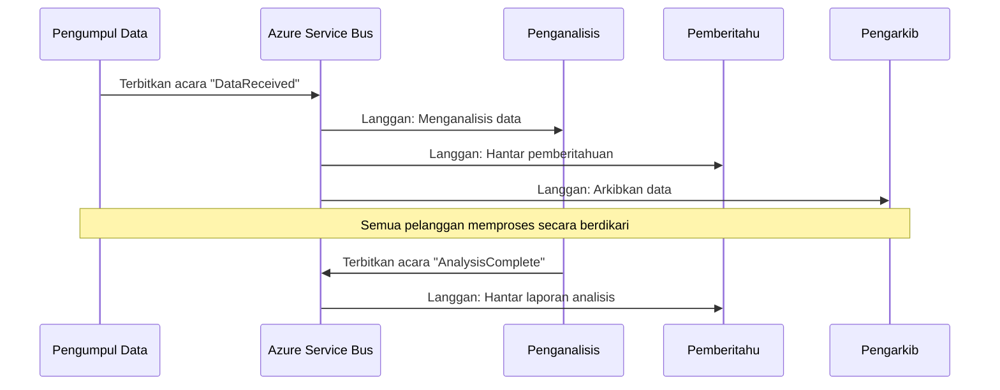
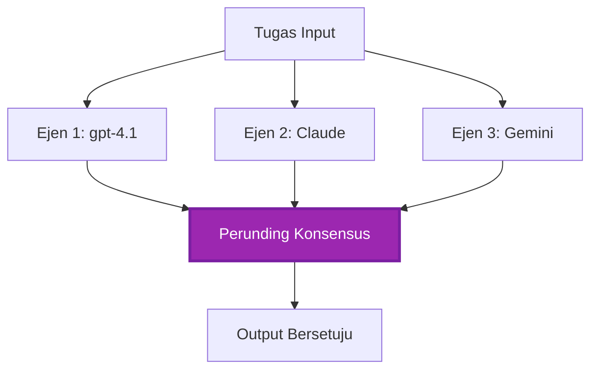
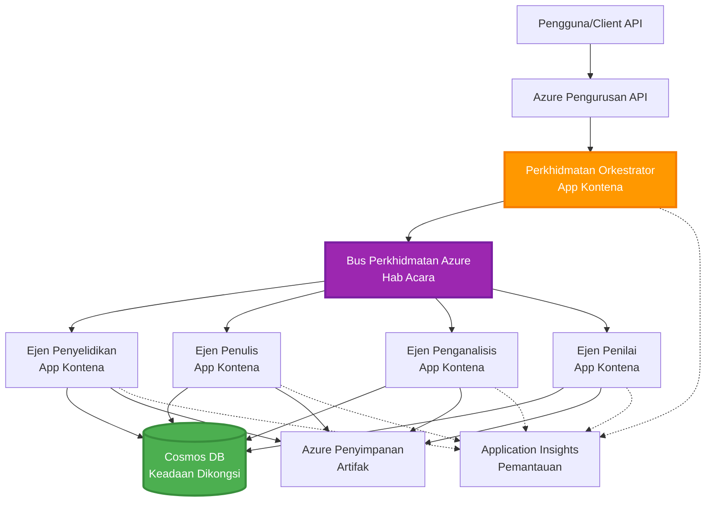

# Corak Penyelarasan Multi-Ejen

⏱️ **Anggaran Masa**: 60-75 minit | 💰 **Anggaran Kos**: ~$100-300/bulan | ⭐ **Kerumitan**: Lanjutan

**📚 Laluan Pembelajaran:**
- ← Sebelumnya: [Perancangan Kapasiti](capacity-planning.md) - Saiz sumber dan strategi penskalaan
- 🎯 **Anda berada di sini**: Corak Penyelarasan Multi-Ejen (Orkestrasi, komunikasi, pengurusan keadaan)
- → Seterusnya: [Pemilihan SKU](sku-selection.md) - Memilih perkhidmatan Azure yang tepat
- 🏠 [Laman Utama Kursus](../../README.md)

---

## Apa Yang Akan Anda Pelajari

Dengan menyelesaikan pelajaran ini, anda akan:
- Memahami corak **senibina multi-ejen** dan bila menggunakannya
- Melaksanakan **corak orkestrasi** (berpusat, terdesentralisasi, hierarki)
- Mereka bentuk strategi **komunikasi ejen** (selari, tak selari, berasaskan acara)
- Mengurus **keadaan dikongsi** merentasi ejen diedarkan
- Melancarkan **sistem multi-ejen** di Azure dengan AZD
- Mengaplikasi **corak penyelarasan** untuk senario AI dunia sebenar
- Memantau dan menyahpepijat sistem ejen diedarkan

## Kenapa Penyelarasan Multi-Ejen Penting

### Evolusi: Dari Ejen Tunggal ke Multi-Ejen

**Ejen Tunggal (Mudah):**
```
User → Agent → Response
```
- ✅ Mudah difahami dan dilaksanakan
- ✅ Pantas untuk tugasan mudah
- ❌ Terhad oleh keupayaan model tunggal
- ❌ Tidak boleh menjalankan tugasan kompleks secara selari
- ❌ Tiada kepakaran khusus

**Sistem Multi-Ejen (Lanjutan):**
```mermaid
graph TD
    Orchestrator[Orchestrator] --> Agent1[Agent1<br/>Rancang]
    Orchestrator --> Agent2[Agent2<br/>Kod]
    Orchestrator --> Agent3[Agent3<br/>Semak]
```- ✅ Ejen khusus untuk tugasan tertentu
- ✅ Pelaksanaan selari untuk kelajuan
- ✅ Modular dan mudah diselenggara
- ✅ Lebih baik untuk aliran kerja kompleks
- ⚠️ Memerlukan logik penyelarasan

**Analogi**: Ejen tunggal seperti satu orang melakukan semua tugasan. Multi-ejen seperti pasukan di mana setiap ahli mempunyai kemahiran khusus (penyelidik, penulis kod, penilai, penulis) bekerja bersama.

---

## Corak Penyelarasan Teras

### Corak 1: Penyelarasan Berturutan (Rantai Tanggungjawab)

**Bila digunakan**: Tugasan mesti selesai dalam susunan tertentu, setiap ejen membina output sebelumnya.

```mermaid
sequenceDiagram
    participant User
    participant Orchestrator
    participant Agent1 as Ejen Penyelidikan
    participant Agent2 as Ejen Penulis
    participant Agent3 as Ejen Penyunting
    
    User->>Orchestrator: "Tulis artikel tentang AI"
    Orchestrator->>Agent1: Jalankan penyelidikan
    Agent1-->>Orchestrator: Hasil penyelidikan
    Orchestrator->>Agent2: Tulis draf (gunakan penyelidikan)
    Agent2-->>Orchestrator: Draf artikel
    Orchestrator->>Agent3: Sunting dan perbaiki
    Agent3-->>Orchestrator: Artikel akhir
    Orchestrator-->>User: Artikel terhasil
    
    Note over User,Agent3: Berurutan: Setiap langkah menunggu sebelumnya
```
**Kelebihan:**
- ✅ Aliran data jelas
- ✅ Mudah disahpepijat
- ✅ Susunan pelaksanaan boleh diramalkan

**Keterbatasan:**
- ❌ Lebih perlahan (tiada selari)
- ❌ Kegagalan satu ejen menghalang helaian
- ❌ Tidak boleh mengendalikan tugasan saling bergantung

**Contoh Penggunaan:**
- Rantaian penciptaan kandungan (penyelidikan → penulisan → penyuntingan → penerbitan)
- Penjanaan kod (rancang → laksanakan → uji → lancar)
- Penjanaan laporan (pengumpulan data → analisis → visualisasi → ringkasan)

---

### Corak 2: Penyelarasan Selari (Fan-Out/Fan-In)

**Bila digunakan**: Tugasan bebas boleh dijalankan serentak, hasil digabungkan di akhir.


**Kelebihan:**
- ✅ Pantas (pelaksanaan selari)
- ✅ Tahan kesilapan (hasil separa diterima)
- ✅ Berskala secara mendatar

**Keterbatasan:**
- ⚠️ Hasil mungkin tiba tidak teratur
- ⚠️ Memerlukan logik penggabungan
- ⚠️ Pengurusan keadaan kompleks

**Contoh Penggunaan:**
- Pengumpulan data berbilang sumber (API + pangkalan data + web scraping)
- Analisis persaingan (pelbagai model menjana penyelesaian, yang terbaik dipilih)
- Perkhidmatan terjemahan (terjemah ke pelbagai bahasa secara serentak)

---

### Corak 3: Penyelarasan Hierarki (Pengurus-Pekerja)

**Bila digunakan**: Aliran kerja kompleks dengan sub-tugasan, perlu delegasi.


**Kelebihan:**
- ✅ Mengendalikan aliran kerja kompleks
- ✅ Modular dan mudah diselenggara
- ✅ Batas tanggungjawab jelas

**Keterbatasan:**
- ⚠️ Senibina lebih kompleks
- ⚠️ Latensi lebih tinggi (lapisan penyelarasan berganda)
- ⚠️ Memerlukan orkestrasi canggih

**Contoh Penggunaan:**
- Pemprosesan dokumen perusahaan (klasifikasi → laluan → proses → arkib)
- Saluran data berperingkat (ingest → bersih → transform → analisis → laporan)
- Aliran kerja automasi kompleks (perancangan → peruntukan sumber → pelaksanaan → pemantauan)

---

### Corak 4: Penyelarasan Berasaskan Acara (Terbit & Langgan)

**Bila digunakan**: Ejen perlu bertindak balas terhadap acara, kelonggaran koble diingini.


**Kelebihan:**
- ✅ Koble longgar antara ejen
- ✅ Mudah menambah ejen baru (hanya langgan)
- ✅ Pemprosesan tak selari
- ✅ Tahan ralat (pesanan kekal)

**Keterbatasan:**
- ⚠️ Konsistensi akhir
- ⚠️ Penyahpepijatan kompleks
- ⚠️ Cabaran susunan mesej

**Contoh Penggunaan:**
- Sistem pemantauan masa nyata (amaran, papan pemuka, log)
- Notifikasi berbilang saluran (emel, SMS, push, Slack)
- Saluran pemprosesan data (pelbagai pengguna data sama)

---

### Corak 5: Penyelarasan Berasaskan Konsensus (Pengundian/Kuorum)

**Bila digunakan**: Perlukan persetujuan dari beberapa ejen sebelum meneruskan.


**Kelebihan:**
- ✅ Ketepatan lebih tinggi (pelbagai pendapat)
- ✅ Tahan kesilapan (kegagalan minoriti diterima)
- ✅ Jaminan kualiti terbina dalam

**Keterbatasan:**
- ❌ Mahal (panggilan model berganda)
- ❌ Lebih perlahan (menunggu semua ejen)
- ⚠️ Perlu penyelesaian konflik

**Contoh Penggunaan:**
- Moderasi kandungan (pelbagai model semak kandungan)
- Semakan kod (pelbagai linter/penganalisis)
- Diagnosa perubatan (pelbagai model AI, pengesahan pakar)

---

## Gambaran Senibina

### Sistem Multi-Ejen Lengkap di Azure


**Komponen Utama:**

| Komponen | Tujuan | Perkhidmatan Azure |
|-----------|---------|---------------------|
| **API Gateway** | Titik masuk, had kadar, pengesahan | Pengurusan API |
| **Orchestrator** | Menyelaras aliran kerja ejen | Aplikasi Kontena |
| **Message Queue** | Komunikasi tak selari | Service Bus / Event Hubs |
| **Ejen** | Pekerja AI khusus | Aplikasi Kontena / Fungsi |
| **State Store** | Keadaan dikongsi, jejak tugasan | Cosmos DB |
| **Artifact Storage** | Dokumen, hasil, log | Penyimpanan Blob |
| **Monitoring** | Penjejakan teragih, log | Application Insights |

---

## Prasyarat

### Alat Diperlukan

```bash
# Sahkan Azure Developer CLI
azd version
# ✅ Dijangka: versi azd 1.0.0 atau lebih tinggi

# Sahkan Azure CLI
az --version
# ✅ Dijangka: azure-cli 2.50.0 atau lebih tinggi

# Sahkan Docker (untuk ujian tempatan)
docker --version
# ✅ Dijangka: versi Docker 20.10 atau lebih tinggi
```

### Keperluan Azure

- Langganan Azure aktif
- Kebenaran untuk buat:
  - Aplikasi Kontena
  - Namespace Service Bus
  - Akaun Cosmos DB
  - Akaun Penyimpanan
  - Application Insights

### Prasyarat Pengetahuan

Anda seharusnya telah menyelesaikan:
- [Pengurusan Konfigurasi](../chapter-03-configuration/configuration.md)
- [Pengesahan & Keselamatan](../chapter-03-configuration/authsecurity.md)
- [Contoh Mikroservis](../../../../examples/microservices)

---

## Panduan Pelaksanaan

### Struktur Projek

```
multi-agent-system/
├── azure.yaml                    # AZD configuration
├── infra/
│   ├── main.bicep               # Main infrastructure
│   ├── core/
│   │   ├── servicebus.bicep     # Message queue
│   │   ├── cosmos.bicep         # State store
│   │   ├── storage.bicep        # Artifact storage
│   │   └── monitoring.bicep     # Application Insights
│   └── app/
│       ├── orchestrator.bicep   # Orchestrator service
│       └── agent.bicep          # Agent template
└── src/
    ├── orchestrator/            # Orchestration logic
    │   ├── app.py
    │   ├── workflows.py
    │   └── Dockerfile
    ├── agents/
    │   ├── research/            # Research agent
    │   ├── writer/              # Writer agent
    │   ├── analyst/             # Analyst agent
    │   └── reviewer/            # Reviewer agent
    └── shared/
        ├── state_manager.py     # Shared state logic
        └── message_handler.py   # Message handling
```

---

## Pelajaran 1: Corak Penyelarasan Berturutan

### Pelaksanaan: Saluran Penciptaan Kandungan

Mari bina saluran berturutan: Penyelidikan → Tulis → Sunting → Terbit

### 1. Konfigurasi AZD

**Fail: `azure.yaml`**

```yaml
name: content-pipeline
metadata:
  template: multi-agent-sequential@1.0.0

services:
  orchestrator:
    project: ./src/orchestrator
    language: python
    host: containerapp
  
  research-agent:
    project: ./src/agents/research
    language: python
    host: containerapp
  
  writer-agent:
    project: ./src/agents/writer
    language: python
    host: containerapp
  
  editor-agent:
    project: ./src/agents/editor
    language: python
    host: containerapp
```

### 2. Infrastruktur: Service Bus untuk Penyelarasan

**Fail: `infra/core/servicebus.bicep`**

```bicep
param name string
param location string
param tags object = {}

resource serviceBusNamespace 'Microsoft.ServiceBus/namespaces@2022-10-01-preview' = {
  name: name
  location: location
  tags: tags
  sku: {
    name: 'Standard'
    tier: 'Standard'
  }
  properties: {
    minimumTlsVersion: '1.2'
  }
}

// Queue for orchestrator → research agent
resource researchQueue 'Microsoft.ServiceBus/namespaces/queues@2022-10-01-preview' = {
  parent: serviceBusNamespace
  name: 'research-tasks'
  properties: {
    maxDeliveryCount: 3
    lockDuration: 'PT5M'
    deadLetteringOnMessageExpiration: true
  }
}

// Queue for research agent → writer agent
resource writerQueue 'Microsoft.ServiceBus/namespaces/queues@2022-10-01-preview' = {
  parent: serviceBusNamespace
  name: 'writer-tasks'
  properties: {
    maxDeliveryCount: 3
    lockDuration: 'PT5M'
  }
}

// Queue for writer agent → editor agent
resource editorQueue 'Microsoft.ServiceBus/namespaces/queues@2022-10-01-preview' = {
  parent: serviceBusNamespace
  name: 'editor-tasks'
  properties: {
    maxDeliveryCount: 3
    lockDuration: 'PT5M'
  }
}

output namespace string = serviceBusNamespace.name
output connectionString string = listKeys('${serviceBusNamespace.id}/AuthorizationRules/RootManageSharedAccessKey', serviceBusNamespace.apiVersion).primaryConnectionString
```

### 3. Pengurus Keadaan Dikongsi

**Fail: `src/shared/state_manager.py`**

```python
from azure.cosmos import CosmosClient, PartitionKey
from datetime import datetime
import os

class StateManager:
    """Manages shared state across agents using Cosmos DB"""
    
    def __init__(self):
        endpoint = os.environ['COSMOS_ENDPOINT']
        key = os.environ['COSMOS_KEY']
        
        self.client = CosmosClient(endpoint, key)
        self.database = self.client.get_database_client('agent-state')
        self.container = self.database.get_container_client('tasks')
    
    def create_task(self, task_id: str, task_type: str, input_data: dict):
        """Create a new task"""
        task = {
            'id': task_id,
            'type': task_type,
            'status': 'pending',
            'input': input_data,
            'created_at': datetime.utcnow().isoformat(),
            'steps': []
        }
        self.container.create_item(task)
        return task
    
    def update_task_step(self, task_id: str, step_name: str, result: dict):
        """Update task with completed step"""
        task = self.container.read_item(task_id, partition_key=task_id)
        
        task['steps'].append({
            'name': step_name,
            'completed_at': datetime.utcnow().isoformat(),
            'result': result
        })
        
        self.container.replace_item(task_id, task)
        return task
    
    def complete_task(self, task_id: str, final_result: dict):
        """Mark task as complete"""
        task = self.container.read_item(task_id, partition_key=task_id)
        task['status'] = 'completed'
        task['result'] = final_result
        task['completed_at'] = datetime.utcnow().isoformat()
        self.container.replace_item(task_id, task)
        return task
    
    def get_task(self, task_id: str):
        """Retrieve task state"""
        return self.container.read_item(task_id, partition_key=task_id)
```

### 4. Perkhidmatan Orchestrator

**Fail: `src/orchestrator/app.py`**

```python
from flask import Flask, request, jsonify
from azure.servicebus import ServiceBusClient, ServiceBusMessage
import json
import uuid
import os
from shared.state_manager import StateManager

app = Flask(__name__)
state_manager = StateManager()

# Sambungan Service Bus
servicebus_connection_str = os.environ['SERVICEBUS_CONNECTION_STRING']
servicebus_client = ServiceBusClient.from_connection_string(servicebus_connection_str)

@app.route('/health', methods=['GET'])
def health():
    return jsonify({'status': 'healthy', 'service': 'orchestrator'})

@app.route('/create-content', methods=['POST'])
def create_content():
    """
    Sequential workflow: Research → Write → Edit → Publish
    """
    data = request.json
    topic = data.get('topic')
    
    if not topic:
        return jsonify({'error': 'Topic required'}), 400
    
    # Cipta tugasan dalam stor keadaan
    task_id = str(uuid.uuid4())
    task = state_manager.create_task(
        task_id=task_id,
        task_type='content_creation',
        input_data={'topic': topic}
    )
    
    # Hantar mesej kepada ejen penyelidikan (langkah pertama)
    sender = servicebus_client.get_queue_sender('research-tasks')
    message = ServiceBusMessage(
        body=json.dumps({
            'task_id': task_id,
            'topic': topic,
            'next_queue': 'writer-tasks'  # Tempat untuk menghantar keputusan
        }),
        content_type='application/json'
    )
    
    with sender:
        sender.send_messages(message)
    
    return jsonify({
        'task_id': task_id,
        'status': 'started',
        'workflow': 'sequential',
        'steps': ['research', 'write', 'edit', 'publish'],
        'message': 'Content creation pipeline initiated'
    }), 202

@app.route('/task/<task_id>', methods=['GET'])
def get_task_status(task_id):
    """Check task status"""
    try:
        task = state_manager.get_task(task_id)
        return jsonify(task)
    except Exception as e:
        return jsonify({'error': str(e)}), 404

if __name__ == '__main__':
    app.run(host='0.0.0.0', port=8080)
```

### 5. Ejen Penyelidikan

**Fail: `src/agents/research/app.py`**

```python
from azure.servicebus import ServiceBusClient, ServiceBusMessage
from openai import AzureOpenAI
import json
import os
import time
from shared.state_manager import StateManager

# Inisialisasi klien
state_manager = StateManager()
servicebus_client = ServiceBusClient.from_connection_string(
    os.environ['SERVICEBUS_CONNECTION_STRING']
)

openai_client = AzureOpenAI(
    api_key=os.environ['AZURE_OPENAI_API_KEY'],
    api_version="2024-02-01",
    azure_endpoint=os.environ['AZURE_OPENAI_ENDPOINT']
)

def process_research_task(message_data):
    """Process research request and pass to writer"""
    task_id = message_data['task_id']
    topic = message_data['topic']
    next_queue = message_data['next_queue']
    
    print(f"🔬 Researching: {topic}")
    
    # Panggil Model Microsoft Foundry untuk penyelidikan
    response = openai_client.chat.completions.create(
        model="gpt-4.1",
        messages=[
            {"role": "system", "content": "You are a research assistant. Provide comprehensive research on the given topic."},
            {"role": "user", "content": f"Research this topic thoroughly: {topic}"}
        ],
        max_tokens=1500
    )
    
    research_results = response.choices[0].message.content
    
    # Kemas kini keadaan
    state_manager.update_task_step(
        task_id=task_id,
        step_name='research',
        result={'research': research_results}
    )
    
    # Hantar kepada ejen seterusnya (penulis)
    sender = servicebus_client.get_queue_sender(next_queue)
    message = ServiceBusMessage(
        body=json.dumps({
            'task_id': task_id,
            'topic': topic,
            'research': research_results,
            'next_queue': 'editor-tasks'
        }),
        content_type='application/json'
    )
    
    with sender:
        sender.send_messages(message)
    
    print(f"✅ Research complete for task {task_id}")

def main():
    """Listen to research queue"""
    receiver = servicebus_client.get_queue_receiver('research-tasks')
    
    print("🔬 Research Agent started, listening for tasks...")
    
    with receiver:
        while True:
            messages = receiver.receive_messages(max_wait_time=5)
            for message in messages:
                try:
                    message_data = json.loads(str(message))
                    process_research_task(message_data)
                    receiver.complete_message(message)
                except Exception as e:
                    print(f"❌ Error processing message: {e}")
                    receiver.abandon_message(message)

if __name__ == '__main__':
    main()
```

### 6. Ejen Penulis

**Fail: `src/agents/writer/app.py`**

```python
from azure.servicebus import ServiceBusClient, ServiceBusMessage
from openai import AzureOpenAI
import json
import os
from shared.state_manager import StateManager

state_manager = StateManager()
servicebus_client = ServiceBusClient.from_connection_string(
    os.environ['SERVICEBUS_CONNECTION_STRING']
)

openai_client = AzureOpenAI(
    api_key=os.environ['AZURE_OPENAI_API_KEY'],
    api_version="2024-02-01",
    azure_endpoint=os.environ['AZURE_OPENAI_ENDPOINT']
)

def process_writing_task(message_data):
    """Write article based on research"""
    task_id = message_data['task_id']
    topic = message_data['topic']
    research = message_data['research']
    next_queue = message_data['next_queue']
    
    print(f"✍️ Writing article: {topic}")
    
    # Panggil Model Microsoft Foundry untuk menulis artikel
    response = openai_client.chat.completions.create(
        model="gpt-4.1",
        messages=[
            {"role": "system", "content": "You are a professional writer. Write engaging, well-structured articles."},
            {"role": "user", "content": f"Based on this research:\n\n{research}\n\nWrite a comprehensive article about: {topic}"}
        ],
        max_tokens=2000
    )
    
    article_draft = response.choices[0].message.content
    
    # Kemas kini keadaan
    state_manager.update_task_step(
        task_id=task_id,
        step_name='writing',
        result={'draft': article_draft}
    )
    
    # Hantar ke editor
    sender = servicebus_client.get_queue_sender(next_queue)
    message = ServiceBusMessage(
        body=json.dumps({
            'task_id': task_id,
            'topic': topic,
            'draft': article_draft
        }),
        content_type='application/json'
    )
    
    with sender:
        sender.send_messages(message)
    
    print(f"✅ Article draft complete for task {task_id}")

def main():
    """Listen to writer queue"""
    receiver = servicebus_client.get_queue_receiver('writer-tasks')
    
    print("✍️ Writer Agent started, listening for tasks...")
    
    with receiver:
        while True:
            messages = receiver.receive_messages(max_wait_time=5)
            for message in messages:
                try:
                    message_data = json.loads(str(message))
                    process_writing_task(message_data)
                    receiver.complete_message(message)
                except Exception as e:
                    print(f"❌ Error: {e}")
                    receiver.abandon_message(message)

if __name__ == '__main__':
    main()
```

### 7. Ejen Penyunting

**Fail: `src/agents/editor/app.py`**

```python
from azure.servicebus import ServiceBusClient
from openai import AzureOpenAI
import json
import os
from shared.state_manager import StateManager

state_manager = StateManager()
servicebus_client = ServiceBusClient.from_connection_string(
    os.environ['SERVICEBUS_CONNECTION_STRING']
)

openai_client = AzureOpenAI(
    api_key=os.environ['AZURE_OPENAI_API_KEY'],
    api_version="2024-02-01",
    azure_endpoint=os.environ['AZURE_OPENAI_ENDPOINT']
)

def process_editing_task(message_data):
    """Edit and finalize article"""
    task_id = message_data['task_id']
    topic = message_data['topic']
    draft = message_data['draft']
    
    print(f"📝 Editing article: {topic}")
    
    # Panggil Model Microsoft Foundry untuk mengedit
    response = openai_client.chat.completions.create(
        model="gpt-4.1",
        messages=[
            {"role": "system", "content": "You are an expert editor. Improve grammar, clarity, and structure."},
            {"role": "user", "content": f"Edit and improve this article:\n\n{draft}"}
        ],
        max_tokens=2000
    )
    
    final_article = response.choices[0].message.content
    
    # Tandakan tugasan sebagai selesai
    state_manager.complete_task(
        task_id=task_id,
        final_result={
            'topic': topic,
            'final_article': final_article,
            'word_count': len(final_article.split())
        }
    )
    
    print(f"✅ Article finalized for task {task_id}")

def main():
    """Listen to editor queue"""
    receiver = servicebus_client.get_queue_receiver('editor-tasks')
    
    print("📝 Editor Agent started, listening for tasks...")
    
    with receiver:
        while True:
            messages = receiver.receive_messages(max_wait_time=5)
            for message in messages:
                try:
                    message_data = json.loads(str(message))
                    process_editing_task(message_data)
                    receiver.complete_message(message)
                except Exception as e:
                    print(f"❌ Error: {e}")
                    receiver.abandon_message(message)

if __name__ == '__main__':
    main()
```

### 8. Lancar dan Uji

```bash
# Pilihan A: Penempatan berasaskan templat
azd init
azd up

# Pilihan B: Penempatan manifest ejen (memerlukan peluasan)
azd extension install azure.ai.agents
azd ai agent init -m agent-manifest.yaml
azd up
```

> Lihat [Perintah AZD AI CLI](../chapter-08-production/production-ai-practices.md#azd-ai-cli-commands-and-extensions) untuk semua bendera dan pilihan `azd ai`.

```bash
# Dapatkan URL pengaturcara
ORCHESTRATOR_URL=$(azd env get-values | grep ORCHESTRATOR_URL | cut -d '=' -f2 | tr -d '"')

# Cipta kandungan
curl -X POST $ORCHESTRATOR_URL/create-content \
  -H "Content-Type: application/json" \
  -d '{"topic": "The Future of AI in Healthcare"}'
```

**✅ Output dijangka:**
```json
{
  "task_id": "a1b2c3d4-e5f6-7890-abcd-ef1234567890",
  "status": "started",
  "workflow": "sequential",
  "steps": ["research", "write", "edit", "publish"],
  "message": "Content creation pipeline initiated"
}
```

**Semak kemajuan tugasan:**
```bash
TASK_ID="a1b2c3d4-e5f6-7890-abcd-ef1234567890"
curl $ORCHESTRATOR_URL/task/$TASK_ID
```

**✅ Output dijangka (selesai):**
```json
{
  "id": "a1b2c3d4-e5f6-7890-abcd-ef1234567890",
  "type": "content_creation",
  "status": "completed",
  "steps": [
    {
      "name": "research",
      "completed_at": "2025-11-19T10:30:00Z",
      "result": {"research": "..."}
    },
    {
      "name": "writing",
      "completed_at": "2025-11-19T10:32:00Z",
      "result": {"draft": "..."}
    }
  ],
  "result": {
    "topic": "The Future of AI in Healthcare",
    "final_article": "...",
    "word_count": 1500
  }
}
```

---

## Pelajaran 2: Corak Penyelarasan Selari

### Pelaksanaan: Pengumpul Penyelidikan Berbilang Sumber

Mari bina sistem selari yang mengumpul maklumat dari pelbagai sumber serentak.

### Orchestrator Selari

**Fail: `src/orchestrator/parallel_workflow.py`**

```python
from flask import Flask, request, jsonify
from azure.servicebus import ServiceBusClient, ServiceBusMessage
import json
import uuid
import os
from shared.state_manager import StateManager

app = Flask(__name__)
state_manager = StateManager()

servicebus_client = ServiceBusClient.from_connection_string(
    os.environ['SERVICEBUS_CONNECTION_STRING']
)

@app.route('/research-parallel', methods=['POST'])
def research_parallel():
    """
    Parallel workflow: Multiple agents work simultaneously
    """
    data = request.json
    query = data.get('query')
    
    task_id = str(uuid.uuid4())
    task = state_manager.create_task(
        task_id=task_id,
        task_type='parallel_research',
        input_data={
            'query': query,
            'agents': ['web', 'academic', 'news', 'social']
        }
    )
    
    # Fan-out: Hantar kepada semua ejen serentak
    agents = [
        ('web-research-queue', 'web'),
        ('academic-research-queue', 'academic'),
        ('news-research-queue', 'news'),
        ('social-research-queue', 'social')
    ]
    
    for queue_name, agent_type in agents:
        sender = servicebus_client.get_queue_sender(queue_name)
        message = ServiceBusMessage(
            body=json.dumps({
                'task_id': task_id,
                'query': query,
                'agent_type': agent_type,
                'result_queue': 'aggregation-queue'
            }),
            content_type='application/json'
        )
        
        with sender:
            sender.send_messages(message)
    
    return jsonify({
        'task_id': task_id,
        'status': 'started',
        'workflow': 'parallel',
        'agents_dispatched': 4,
        'message': 'Parallel research initiated'
    }), 202

if __name__ == '__main__':
    app.run(host='0.0.0.0', port=8080)
```

### Logik Penggabungan

**Fail: `src/agents/aggregator/app.py`**

```python
from azure.servicebus import ServiceBusClient
import json
import os
from collections import defaultdict
from shared.state_manager import StateManager

state_manager = StateManager()
servicebus_client = ServiceBusClient.from_connection_string(
    os.environ['SERVICEBUS_CONNECTION_STRING']
)

# Jejaki keputusan setiap tugasan
task_results = defaultdict(list)
expected_agents = 4  # web, akademik, berita, sosial

def process_result(message_data):
    """Aggregate results from parallel agents"""
    task_id = message_data['task_id']
    agent_type = message_data['agent_type']
    result = message_data['result']
    
    # Simpan keputusan
    task_results[task_id].append({
        'agent': agent_type,
        'data': result
    })
    
    print(f"📊 Received result from {agent_type} agent ({len(task_results[task_id])}/{expected_agents})")
    
    # Semak jika semua ejen selesai (fan-in)
    if len(task_results[task_id]) == expected_agents:
        print(f"✅ All agents completed for task {task_id}. Aggregating...")
        
        # Gabungkan keputusan
        aggregated = {
            'query': message_data['query'],
            'sources': task_results[task_id],
            'summary': generate_summary(task_results[task_id])
        }
        
        # Tandakan selesai
        state_manager.complete_task(task_id, aggregated)
        
        # Bersihkan
        del task_results[task_id]
        
        print(f"✅ Aggregation complete for task {task_id}")

def generate_summary(results):
    """Generate summary from all sources"""
    summaries = [r['data'].get('summary', '') for r in results]
    return '\n\n'.join(summaries)

def main():
    """Listen to aggregation queue"""
    receiver = servicebus_client.get_queue_receiver('aggregation-queue')
    
    print("📊 Aggregator started, listening for results...")
    
    with receiver:
        while True:
            messages = receiver.receive_messages(max_wait_time=5)
            for message in messages:
                try:
                    message_data = json.loads(str(message))
                    process_result(message_data)
                    receiver.complete_message(message)
                except Exception as e:
                    print(f"❌ Error: {e}")
                    receiver.abandon_message(message)

if __name__ == '__main__':
    main()
```

**Kelebihan Corak Selari:**
- ⚡ **4x lebih pantas** (ejen berjalan serentak)
- 🔄 **Tahan ralat** (hasil separa diterima)
- 📈 **Berskala** (mudah tambah ejen)

---

## Latihan Praktikal

### Latihan 1: Tambah Pengendalian Timeout ⭐⭐ (Sederhana)

**Matlamat**: Laksanakan logik timeout supaya agregator tidak menunggu ejen lambat selama-lamanya.

**Langkah**:

1. **Tambah penjejakan timeout pada agregator:**

```python
from datetime import datetime, timedelta

task_timeouts = {}  # task_id -> masa_tamat

def process_result(message_data):
    task_id = message_data['task_id']
    
    # Tetapkan had masa pada keputusan pertama
    if task_id not in task_timeouts:
        task_timeouts[task_id] = datetime.utcnow() + timedelta(seconds=30)
    
    task_results[task_id].append({
        'agent': message_data['agent_type'],
        'data': message_data['result']
    })
    
    # Semak jika selesai ATAU tamat masa
    if len(task_results[task_id]) == expected_agents or \
       datetime.utcnow() > task_timeouts[task_id]:
        
        print(f"📊 Aggregating with {len(task_results[task_id])}/{expected_agents} results")
        
        aggregated = {
            'query': message_data['query'],
            'sources': task_results[task_id],
            'completed_agents': len(task_results[task_id]),
            'timed_out': len(task_results[task_id]) < expected_agents
        }
        
        state_manager.complete_task(task_id, aggregated)
        
        # Bersihkan
        del task_results[task_id]
        del task_timeouts[task_id]
```

2. **Uji dengan kelewatan tiruan:**

```python
# Dalam satu ejen, tambah kelewatan untuk mensimulasikan pemprosesan perlahan
import time
time.sleep(35)  # Melebihi had masa 30 saat
```

3. **Lancar dan sahkan:**

```bash
azd deploy aggregator

# Hantar tugasan
curl -X POST $ORCHESTRATOR_URL/research-parallel \
  -H "Content-Type: application/json" \
  -d '{"query": "AI safety research"}'

# Semak keputusan selepas 30 saat
curl $ORCHESTRATOR_URL/task/$TASK_ID
```

**✅ Kriteria Kejayaan:**
- ✅ Tugasan selesai selepas 30 saat walaupun ejen belum lengkap
- ✅ Respons menunjukkan hasil separa (`"timed_out": true`)
- ✅ Hasil tersedia dikembalikan (3 dari 4 ejen)

**Masa**: 20-25 minit

---

### Latihan 2: Laksanakan Logik Cuba Semula ⭐⭐⭐ (Lanjutan)

**Matlamat**: Cuba semula tugasan ejen yang gagal secara automatik sebelum menyerah.

**Langkah**:

1. **Tambah penjejakan cuba semula pada orchestrator:**

```python
from dataclasses import dataclass
from typing import Dict

@dataclass
class RetryConfig:
    max_retries: int = 3
    backoff_seconds: int = 5

retry_counts: Dict[str, int] = {}  # message_id -> kiraan_cuba_semula

def send_with_retry(queue_name: str, message_data: dict, retry_config: RetryConfig):
    """Send message with retry metadata"""
    message_id = message_data.get('message_id', str(uuid.uuid4()))
    message_data['message_id'] = message_id
    message_data['retry_count'] = retry_counts.get(message_id, 0)
    message_data['max_retries'] = retry_config.max_retries
    
    sender = servicebus_client.get_queue_sender(queue_name)
    message = ServiceBusMessage(
        body=json.dumps(message_data),
        content_type='application/json',
        message_id=message_id
    )
    
    with sender:
        sender.send_messages(message)
```

2. **Tambah pengendali cuba semula pada ejen:**

```python
def process_with_retry(message, receiver, process_func):
    """Process message with automatic retry on failure"""
    try:
        message_data = json.loads(str(message))
        
        # Proses mesej
        process_func(message_data)
        
        # Berjaya - lengkap
        receiver.complete_message(message)
        
    except Exception as e:
        message_id = message.message_id
        retry_count = message_data.get('retry_count', 0)
        max_retries = message_data.get('max_retries', 3)
        
        if retry_count < max_retries:
            # Cuba semula: tinggalkan dan masukkan semula ke dalam barisan dengan kiraan yang ditambah
            print(f"⚠️ Retry {retry_count + 1}/{max_retries} for message {message_id}")
            
            message_data['retry_count'] = retry_count + 1
            
            # Hantar balik ke barisan yang sama dengan kelewatan
            time.sleep(5 * (retry_count + 1))  # Penangguhan eksponen
            send_with_retry(queue_name, message_data, RetryConfig())
            
            receiver.complete_message(message)  # Buang asal
        else:
            # Capaian cuba semula maksimum melebihi - pindah ke barisan surat mati
            print(f"❌ Max retries exceeded for message {message_id}")
            receiver.dead_letter_message(
                message,
                reason="MaxRetriesExceeded",
                error_description=str(e)
            )
```

3. **Pantau barisan surat mati:**

```python
def monitor_dead_letters():
    """Check dead letter queue for failed messages"""
    receiver = servicebus_client.get_queue_receiver(
        'research-queue',
        sub_queue='deadletter'
    )
    
    with receiver:
        messages = receiver.receive_messages(max_wait_time=5)
        for message in messages:
            print(f"☠️ Dead letter: {message.message_id}")
            print(f"Reason: {message.dead_letter_reason}")
            print(f"Description: {message.dead_letter_error_description}")
```

**✅ Kriteria Kejayaan:**
- ✅ Tugasan gagal cuba semula secara automatik (hingga 3 kali)
- ✅ Jeda berganda antara cuba semula (5s, 10s, 15s)
- ✅ Selepas maksimum cuba semula, mesej pergi ke barisan surat mati
- ✅ Barisan surat mati boleh dipantau dan diputar semula

**Masa**: 30-40 minit

---

### Latihan 3: Laksanakan Pematuh Litar ⭐⭐⭐ (Lanjutan)

**Matlamat**: Mengelakkan kegagalan berturutan dengan menghentikan permintaan ke ejen yang gagal.

**Langkah**:

1. **Cipta kelas pematuh litar:**

```python
from enum import Enum
from datetime import datetime, timedelta

class CircuitState(Enum):
    CLOSED = "closed"      # Operasi normal
    OPEN = "open"          # Gagal, tolak permintaan
    HALF_OPEN = "half_open"  # Menguji jika telah pulih

class CircuitBreaker:
    def __init__(self, failure_threshold=5, timeout_seconds=60):
        self.failure_threshold = failure_threshold
        self.timeout_seconds = timeout_seconds
        self.failure_count = 0
        self.last_failure_time = None
        self.state = CircuitState.CLOSED
    
    def call(self, func):
        """Execute function with circuit breaker protection"""
        if self.state == CircuitState.OPEN:
            # Periksa jika masa tamat tempoh telah berlalu
            if datetime.utcnow() - self.last_failure_time > timedelta(seconds=self.timeout_seconds):
                self.state = CircuitState.HALF_OPEN
                print("🔄 Circuit breaker: HALF_OPEN (testing)")
            else:
                raise Exception(f"Circuit breaker OPEN for agent. Try again in {self.timeout_seconds}s")
        
        try:
            result = func()
            
            # Berjaya
            if self.state == CircuitState.HALF_OPEN:
                self.state = CircuitState.CLOSED
                self.failure_count = 0
                print("✅ Circuit breaker: CLOSED (recovered)")
            
            return result
            
        except Exception as e:
            self.failure_count += 1
            self.last_failure_time = datetime.utcnow()
            
            if self.failure_count >= self.failure_threshold:
                self.state = CircuitState.OPEN
                print(f"🔴 Circuit breaker: OPEN (too many failures)")
            
            raise e
```

2. **Guna pada panggilan ejen:**

```python
# Dalam pengaturcara
agent_circuits = {
    'web': CircuitBreaker(failure_threshold=5, timeout_seconds=60),
    'academic': CircuitBreaker(failure_threshold=5, timeout_seconds=60),
    'news': CircuitBreaker(failure_threshold=5, timeout_seconds=60),
    'social': CircuitBreaker(failure_threshold=5, timeout_seconds=60)
}

def send_to_agent(agent_type, message_data):
    """Send with circuit breaker protection"""
    circuit = agent_circuits[agent_type]
    
    try:
        circuit.call(lambda: send_message(agent_type, message_data))
    except Exception as e:
        print(f"⚠️ Skipping {agent_type} agent: {e}")
        # Teruskan dengan ejen lain
```

3. **Uji pematuh litar:**

```bash
# Menyimulasikan kegagalan berulang (hentikan satu ejen)
az containerapp stop --name web-research-agent --resource-group rg-agents

# Hantar pelbagai permintaan
for i in {1..10}; do
  curl -X POST $ORCHESTRATOR_URL/research-parallel \
    -H "Content-Type: application/json" \
    -d '{"query": "test query '$i'"}'
  sleep 2
done

# Semak log - harus nampak litar terbuka selepas 5 kali kegagalan
# Gunakan Azure CLI untuk log Aplikasi Kontena:
az containerapp logs show --name orchestrator --resource-group $RG_NAME --tail 50
```

**✅ Kriteria Kejayaan:**
- ✅ Selepas 5 kegagalan, litar dibuka (tolak permintaan)
- ✅ Selepas 60 saat, litar separa terbuka (uji pemulihan)
- ✅ Ejen lain terus berfungsi normal
- ✅ Litar tutup automatik apabila ejen pulih

**Masa**: 40-50 minit

---

## Pemantauan dan Penyahpepijatan

### Penjejakan Teragih dengan Application Insights

**Fail: `src/shared/tracing.py`**

```python
from opencensus.ext.azure.log_exporter import AzureLogHandler
from opencensus.ext.azure.trace_exporter import AzureExporter
from opencensus.trace import config_integration
from opencensus.trace.tracer import Tracer
from opencensus.trace.samplers import AlwaysOnSampler
import logging
import os

# Konfigurasikan penjejakan
config_integration.trace_integrations(['requests', 'logging'])

connection_string = os.environ.get('APPLICATIONINSIGHTS_CONNECTION_STRING')

# Cipta penjejak
tracer = Tracer(
    exporter=AzureExporter(connection_string=connection_string),
    sampler=AlwaysOnSampler()
)

# Konfigurasikan log
logger = logging.getLogger(__name__)
logger.addHandler(AzureLogHandler(connection_string=connection_string))
logger.setLevel(logging.INFO)

def trace_agent_call(agent_name, task_id, operation):
    """Trace agent operations"""
    with tracer.span(name=f'{agent_name}.{operation}') as span:
        span.add_attribute('agent', agent_name)
        span.add_attribute('task_id', task_id)
        span.add_attribute('operation', operation)
        
        try:
            result = operation()
            span.add_attribute('status', 'success')
            return result
        except Exception as e:
            span.add_attribute('status', 'error')
            span.add_attribute('error', str(e))
            raise
```

### Pertanyaan Application Insights

**Jejak aliran kerja multi-ejen:**

```kusto
// Trace complete workflow for a task
traces
| where customDimensions.task_id == "a1b2c3d4-..."
| project timestamp, message, customDimensions.agent, customDimensions.operation
| order by timestamp asc
```

**Perbandingan prestasi ejen:**

```kusto
// Compare agent execution times
dependencies
| where name contains "agent"
| summarize 
    avg_duration = avg(duration),
    p95_duration = percentile(duration, 95),
    count = count()
  by agent = tostring(customDimensions.agent)
| order by avg_duration desc
```

**Analisis kegagalan:**

```kusto
// Find which agents fail most
exceptions
| where customDimensions.agent != ""
| summarize 
    failure_count = count(),
    unique_errors = dcount(outerMessage)
  by agent = tostring(customDimensions.agent)
| order by failure_count desc
```

---

## Analisis Kos

### Kos Sistem Multi-Ejen (Anggaran Bulanan)

| Komponen | Konfigurasi | Kos |
|-----------|--------------|------|
| **Orchestrator** | 1 Aplikasi Kontena (1 vCPU, 2GB) | $30-50 |
| **4 Ejen** | 4 Aplikasi Kontena (0.5 vCPU, 1GB setiap satu) | $60-120 |
| **Service Bus** | Tahap standard, 10M mesej | $10-20 |
| **Cosmos DB** | Serverless, penyimpanan 5GB, 1M RU | $25-50 |
| **Penyimpanan Blob** | Penyimpanan 10GB, 100K operasi | $5-10 |
| **Application Insights** | Pengambilan 5GB | $10-15 |
| **Model Microsoft Foundry** | gpt-4.1, 10M token | $100-300 |
| **Jumlah** | | **$240-565/bulan** |

### Strategi Pengoptimuman Kos

1. **Gunakan serverless jika boleh:**
   ```bicep
   // Cosmos DB serverless (no minimum cost)
   properties: {
     databaseAccountOfferType: 'Standard'
     capabilities: [{ name: 'EnableServerless' }]
   }
   ```

2. **Skala ejen ke sifar bila tidak aktif:**
   ```bicep
   scale: {
     minReplicas: 0  // Scale to zero when no messages
     maxReplicas: 10
   }
   ```

3. **Gunakan pemprosesan berkumpulan untuk Service Bus:**
   ```python
   # Hantar mesej secara berkumpulan (lebih murah)
   sender.send_messages([message1, message2, message3])
   ```

4. **Cache hasil yang kerap digunakan:**
   ```python
   # Gunakan Azure Cache untuk Redis
   if cache.exists(query_hash):
       return cache.get(query_hash)
   ```

---

## Amalan Terbaik

### ✅ LAKUKAN:

1. **Gunakan operasi idempoten**
   ```python
   # Ejen boleh memproses mesej yang sama dengan selamat berkali-kali
   def process_task(task_id):
       if state_manager.task_exists(task_id):
           print(f"Task {task_id} already processed, skipping")
           return
       # Memproses tugasan...
   ```

2. **Laksanakan pencatatan menyeluruh**
   ```python
   logger.info(f"Agent: {agent_name}, Task: {task_id}, Action: {action}")
   ```

3. **Gunakan ID korelasi**
   ```python
   # Hantar task_id melalui keseluruhan aliran kerja
   message_data = {
       'task_id': task_id,  # ID Korelasi
       'timestamp': datetime.utcnow().isoformat()
   }
   ```

4. **Tetapkan masa hidup mesej (TTL)**
   ```bicep
   properties: {
     defaultMessageTimeToLive: 'PT1H'  // 1 hour max
   }
   ```

5. **Pantau barisan surat mati**
   ```python
   # Pemantauan berkala mesej yang gagal
   monitor_dead_letters()
   ```

### ❌ JANGAN:

1. **Jangan cipta kebergantungan bulatan**
   ```python
   # ❌ BURUK: Ejen A → Ejen B → Ejen A (gelung tanpa henti)
   # ✅ BAIK: Takrifkan graf terarah tanpa kitaran (DAG) yang jelas
   ```

2. **Jangan sekat thread ejen**
   ```python
   # ❌ BURUK: Menunggu secara segerak
   while not task_complete:
       time.sleep(1)
   
   # ✅ BAIK: Gunakan panggilan balik barisan mesej
   ```

3. **Jangan abaikan kegagalan separa**
   ```python
   # ❌ BURUK: Gagalkan keseluruhan aliran kerja jika satu ejen gagal
   # ✅ BAIK: Kembalikan hasil sebahagian dengan penunjuk ralat
   ```

4. **Jangan gunakan cubaan tanpa had**
   ```python
   # ❌ BURUK: cuba semula tanpa henti
   # ✅ BAIK: max_retries = 3, kemudian surat mati
   ```

---

## Panduan Penyelesaian Masalah

### Masalah: Mesej tersekat dalam barisan

**Gejala:**
- Mesej terkumpul dalam barisan
- Ejen tidak memproses
- Status tugasan tersekat pada "pending"

**Diagnosis:**
```bash
# Semak kedalaman barisan
az servicebus queue show \
  --namespace-name mybus \
  --name research-tasks \
  --query "countDetails"

# Semak log ejen menggunakan Azure CLI
az containerapp logs show --name research-agent --resource-group $RG_NAME --tail 50
```

**Penyelesaian:**

1. **Tingkatkan salinan ejen:**
   ```bash
   az containerapp update \
     --name research-agent \
     --min-replicas 3 \
     --max-replicas 10
   ```

2. **Semak barisan surat mati:**
   ```bash
   az servicebus queue show \
     --namespace-name mybus \
     --name research-tasks \
     --query "countDetails.deadLetterMessageCount"
   ```

---

### Masalah: Tugasan tamat masa / tidak pernah selesai

**Gejala:**
- Status tugasan kekal "in_progress"
- Sesetengah ejen selesai, yang lain tidak
- Tiada mesej ralat

**Diagnosis:**
```bash
# Semak status tugasan
curl $ORCHESTRATOR_URL/task/$TASK_ID

# Semak Application Insights
# Jalankan pertanyaan: traces | where customDimensions.task_id == "..."
```

**Penyelesaian:**

1. **Laksanakan had masa dalam penggabung (Latihan 1)**

2. **Periksa kegagalan ejen menggunakan Azure Monitor:**
   ```bash
   # Lihat log melalui azd monitor
   azd monitor --logs
   
   # Atau gunakan Azure CLI untuk memeriksa log aplikasi kontena tertentu
   az containerapp logs show --name <agent-name> --resource-group $RG_NAME --follow | grep "ERROR\|FAIL"
   ```

3. **Sahkan semua ejen berjalan:**
   ```bash
   az containerapp list \
     --resource-group rg-agents \
     --query "[].{name:name, status:properties.runningStatus}"
   ```

---

## Ketahui Lebih Lanjut

### Dokumentasi Rasmi
- [Azure Service Bus](https://learn.microsoft.com/azure/service-bus-messaging/service-bus-messaging-overview)
- [Cosmos DB](https://learn.microsoft.com/azure/cosmos-db/introduction)
- [Container Apps DAPR](https://learn.microsoft.com/azure/container-apps/dapr-overview)
- [Corak Reka Bentuk Multi-Ejen](https://learn.microsoft.com/azure/architecture/guide/ai/multi-agent-systems)

### Langkah Seterusnya Dalam Kursus Ini
- ← Sebelumnya: [Perancangan Kapasiti](capacity-planning.md)
- → Seterusnya: [Pemilihan SKU](sku-selection.md)
- 🏠 [Laman Utama Kursus](../../README.md)

### Contoh Berkaitan
- [Contoh Mikroservis](../../../../examples/microservices) - Corak komunikasi perkhidmatan
- [Contoh Model Microsoft Foundry](../../../../examples/azure-openai-chat) - Integrasi AI

---

## Ringkasan

**Anda telah belajar:**
- ✅ Lima corak koordinasi (bersiri, selari, hierarki, pemacu acara, konsensus)
- ✅ Seni bina multi-ejen di Azure (Service Bus, Cosmos DB, Container Apps)
- ✅ Pengurusan status merentas ejen diedarkan
- ✅ Pengendalian tamat masa, cubaan semula, dan pemutus litar
- ✅ Pemantauan dan penyahpepijatan sistem diedarkan
- ✅ Strategi pengoptimuman kos

**Perkara Utama:**
1. **Pilih corak yang betul** - Bersiri untuk aliran kerja teratur, selari untuk kelajuan, pemacu acara untuk fleksibiliti
2. **Urus status dengan teliti** - Gunakan Cosmos DB atau yang serupa untuk status dikongsi
3. **Urus kegagalan dengan baik** - Tamat masa, cubaan semula, pemutus litar, barisan surat mati
4. **Pantau segala-galanya** - Penjejakan diedarkan penting untuk penyahpepijatan
5. **Optimumkan kos** - Skala hingga sifar, gunakan serverless, laksanakan pengecach

**Langkah Seterusnya:**
1. Lengkapkan latihan praktikal
2. Bina sistem multi-ejen untuk kes penggunaan anda
3. Pelajari [Pemilihan SKU](sku-selection.md) untuk mengoptimumkan prestasi dan kos

---

<!-- CO-OP TRANSLATOR DISCLAIMER START -->
**Penafian**:  
Dokumen ini telah diterjemahkan menggunakan perkhidmatan terjemahan AI [Co-op Translator](https://github.com/Azure/co-op-translator). Walaupun kami berusaha untuk ketepatan, sila maklum bahawa terjemahan automatik mungkin mengandungi ralat atau ketidaktepatan. Dokumen asal dalam bahasa asalnya harus dianggap sebagai sumber yang sahih. Untuk maklumat penting, terjemahan profesional oleh manusia adalah disyorkan. Kami tidak bertanggungjawab terhadap sebarang salah faham atau kekeliruan yang timbul daripada penggunaan terjemahan ini.
<!-- CO-OP TRANSLATOR DISCLAIMER END -->