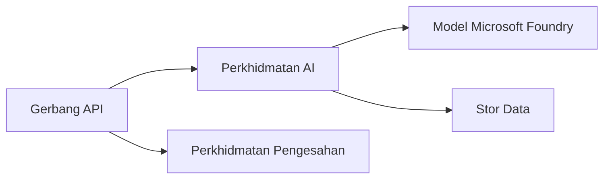
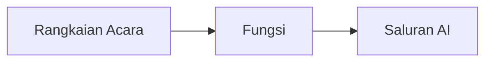

# Bab 8: Corak Pengeluaran & Perusahaan

**📚 Kursus**: [AZD Untuk Pemula](../../README.md) | **⏱️ Durasi**: 2-3 jam | **⭐ Kerumitan**: Lanjutan

---

## Gambaran Keseluruhan

Bab ini merangkumi corak penerapan sedia perusahaan, pengukuhan keselamatan, pemantauan, dan pengoptimuman kos untuk beban kerja AI produksi.

> Disahkan dengan `azd 1.27.1` pada Julai 2026.

## Objektif Pembelajaran

Dengan menyelesaikan bab ini, anda akan:
- Menerapkan aplikasi tahan serantau berbilang wilayah
- Melaksanakan corak keselamatan perusahaan
- Mengkonfigurasi pemantauan menyeluruh
- Mengoptimumkan kos dalam skala besar
- Menyediakan saluran CI/CD dengan AZD

---

## 📚 Pelajaran

| # | Pelajaran | Penerangan | Masa |
|---|--------|-------------|------|
| 1 | [Amalan AI Produksi](production-ai-practices.md) | Corak penerapan perusahaan | 90 min |

---

## 🚀 Senarai Semak Produksi

- [ ] Penerapan berbilang wilayah untuk ketahanan
- [ ] Identiti terurus untuk pengesahan (tanpa kekunci)
- [ ] Application Insights untuk pemantauan
- [ ] Bajet dan amaran kos dikonfigurasi
- [ ] Pengimbasan keselamatan diaktifkan
- [ ] Integrasi saluran CI/CD
- [ ] Pelan pemulihan bencana

---

## 🏗️ Corak Seni Bina

### Corak 1: Microservices AI



### Corak 2: AI Berpandu Acara



---

## 🔐 Amalan Terbaik Keselamatan

```bicep
// Use managed identity
identity: {
  type: 'SystemAssigned'
}

// Private endpoints for AI services
properties: {
  publicNetworkAccess: 'Disabled'
  networkAcls: {
    defaultAction: 'Deny'
  }
}
```

---

## 💰 Pengoptimuman Kos

| Strategi | Penjimatan |
|----------|---------|
| Skala ke sifar (Container Apps) | 60-80% |
| Gunakan tahap penggunaan untuk pembangunan | 50-70% |
| Penyesuaian berjadual | 30-50% |
| Kapasiti berreserva | 20-40% |

```bash
# Tetapkan amaran bajet
az consumption budget create \
  --budget-name "AI-Budget" \
  --amount 500 \
  --category Cost \
  --time-grain Monthly
```

---

## 📊 Persediaan Pemantauan

```bash
# Alirkan log
azd monitor --logs

# Semak Application Insights
azd monitor --overview

# Lihat metrik
az monitor metrics list --resource <resource-id>
```

---

## 🔗 Navigasi

| Arah | Bab |
|-----------|---------|
| **Sebelumnya** | [Bab 7: Penyelesaian Masalah](../chapter-07-troubleshooting/README.md) |
| **Kursus Lengkap** | [Laman Utama Kursus](../../README.md) |

---

## 📖 Sumber Berkaitan

- [Panduan Ejen AI](../chapter-02-ai-development/agents.md)
- [Application Insights](../chapter-06-pre-deployment/application-insights.md)
- [Penyelesaian Multi-Ejen](../chapter-05-multi-agent/README.md)
- [Contoh Microservices](../../examples/microservices/README.md)

---

<!-- CO-OP TRANSLATOR DISCLAIMER START -->
**Penafian**:
Dokumen ini telah diterjemahkan menggunakan perkhidmatan terjemahan AI [Co-op Translator](https://github.com/Azure/co-op-translator). Walaupun kami berusaha untuk ketepatan, sila ambil maklum bahawa terjemahan automatik mungkin mengandungi kesilapan atau ketidaktepatan. Dokumen asal dalam bahasa asalnya harus dianggap sebagai sumber yang sahih. Untuk maklumat penting, terjemahan oleh manusia profesional adalah disyorkan. Kami tidak bertanggungjawab terhadap sebarang salah faham atau salah tafsir yang timbul daripada penggunaan terjemahan ini.
<!-- CO-OP TRANSLATOR DISCLAIMER END -->