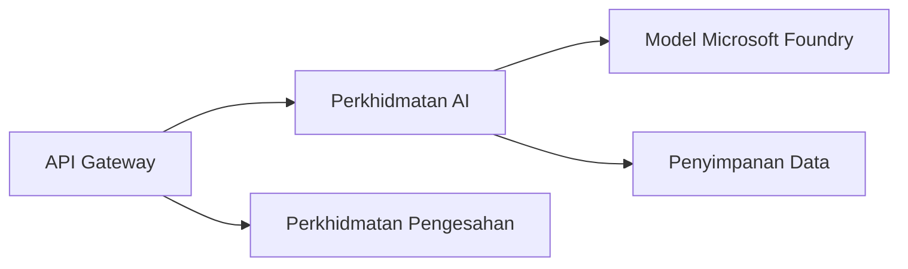
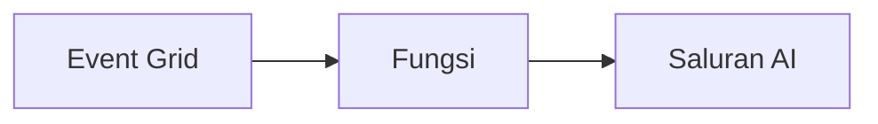

# Bab 8: Corak Pengeluaran & Perusahaan

**📚 Kursus**: [AZD Untuk Pemula](../../README.md) | **⏱️ Tempoh**: 2-3 jam | **⭐ Kerumitan**: Lanjutan

---

## Gambaran Keseluruhan

Bab ini merangkumi corak penyebaran bersedia perusahaan, pengukuhan keselamatan, pemantauan, dan pengoptimuman kos untuk beban kerja AI pengeluaran.

> Disahkan terhadap `azd 1.25.6` pada Jun 2026.

## Objektif Pembelajaran

Dengan menamatkan bab ini, anda akan mampu:
- Menyebarkan aplikasi tahan lasak merentas wilayah
- Melaksanakan corak keselamatan perusahaan
- Mengkonfigurasi pemantauan menyeluruh
- Mengoptimumkan kos pada skala besar
- Menyediakan saluran CI/CD dengan AZD

---

## 📚 Pelajaran

| # | Pelajaran | Penerangan | Masa |
|---|-----------|------------|------|
| 1 | [Amalan AI Pengeluaran](production-ai-practices.md) | Corak penyebaran perusahaan | 90 min |

---

## 🚀 Senarai Semak Pengeluaran

- [ ] Penyebaran merentas wilayah untuk ketahanan
- [ ] Identiti terurus untuk pengesahan (tanpa kekunci)
- [ ] Application Insights untuk pemantauan
- [ ] Bajet kos dan amaran dikonfigurasi
- [ ] Imbasan keselamatan diaktifkan
- [ ] Integrasi saluran CI/CD
- [ ] Pelan pemulihan bencana

---

## 🏗️ Corak Seni Bina

### Corak 1: Microservices AI



### Corak 2: Event-Driven AI



---

## 🔐 Amalan Terbaik Keselamatan

```bicep
// Use managed identity
identity: {
  type: 'SystemAssigned'
}

// Private endpoints for AI services
properties: {
  publicNetworkAccess: 'Disabled'
  networkAcls: {
    defaultAction: 'Deny'
  }
}
```

---

## 💰 Pengoptimuman Kos

| Strategi | Penjimatan |
|----------|------------|
| Skala ke sifar (Aplikasi Kontena) | 60-80% |
| Gunakan tier penggunaan untuk dev | 50-70% |
| Skala berjadual | 30-50% |
| Kapasiti tempahan | 20-40% |

```bash
# Tetapkan amaran bajet
az consumption budget create \
  --budget-name "AI-Budget" \
  --amount 500 \
  --category Cost \
  --time-grain Monthly
```

---

## 📊 Penyediaan Pemantauan

```bash
# Alirkan log
azd monitor --logs

# Semak Application Insights
azd monitor --overview

# Lihat metrik
az monitor metrics list --resource <resource-id>
```

---

## 🔗 Navigasi

| Arah | Bab |
|------|-----|
| **Sebelum** | [Bab 7: Penyelesaian Masalah](../chapter-07-troubleshooting/README.md) |
| **Kursus Selesai** | [Laman Utama Kursus](../../README.md) |

---

## 📖 Sumber Berkaitan

- [Panduan Ejen AI](../chapter-02-ai-development/agents.md)
- [Application Insights](../chapter-06-pre-deployment/application-insights.md)
- [Penyelesaian Multi-Ejen](../chapter-05-multi-agent/README.md)
- [Contoh Microservices](../../examples/microservices/README.md)

---

<!-- CO-OP TRANSLATOR DISCLAIMER START -->
**Penafian**:
Dokumen ini telah diterjemahkan menggunakan perkhidmatan terjemahan AI [Co-op Translator](https://github.com/Azure/co-op-translator). Walaupun kami berusaha untuk ketepatan, sila ambil maklum bahawa terjemahan automatik mungkin mengandungi kesilapan atau ketidaktepatan. Dokumen asal dalam bahasa asalnya harus dianggap sebagai sumber yang sahih. Untuk maklumat penting, terjemahan oleh manusia profesional adalah disyorkan. Kami tidak bertanggungjawab terhadap sebarang salah faham atau salah tafsir yang timbul daripada penggunaan terjemahan ini.
<!-- CO-OP TRANSLATOR DISCLAIMER END -->