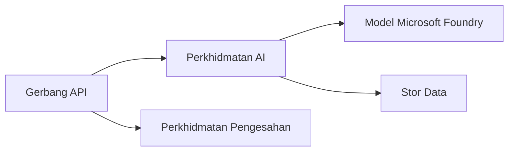
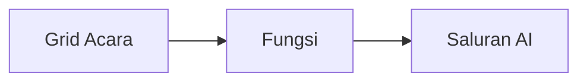

# Bab 8: Pola Pengeluaran & Perusahaan

**📚 Kursus**: [AZD Untuk Pemula](../../README.md) | **⏱️ Tempoh**: 2-3 jam | **⭐ Kerumitan**: Lanjutan

---

## Gambaran Keseluruhan

Bab ini merangkumi pola pengeluaran sedia perusahaan, pengukuhan keselamatan, pemantauan, dan pengoptimuman kos untuk beban kerja AI produksi.

> Disahkan melawan `azd 1.23.12` pada Mac 2026.

## Objektif Pembelajaran

Dengan menyelesaikan bab ini, anda akan:
- Mengeluarkan aplikasi tahan kerosakan berbilang wilayah
- Melaksanakan pola keselamatan perusahaan
- Mengkonfigurasi pemantauan menyeluruh
- Mengoptimumkan kos pada skala besar
- Menyediakan jalur CI/CD dengan AZD

---

## 📚 Pelajaran

| # | Pelajaran | Perihalan | Masa |
|---|-----------|-----------|------|
| 1 | [Amalan AI Pengeluaran](production-ai-practices.md) | Pola pengeluaran perusahaan | 90 min |

---

## 🚀 Senarai Semak Pengeluaran

- [ ] Pengeluaran berbilang wilayah untuk ketahanan
- [ ] Identiti terurus untuk pengesahan (tanpa kunci)
- [ ] Application Insights untuk pemantauan
- [ ] Bajet kos dan amaran dikonfigurasi
- [ ] Pengimbasan keselamatan diaktifkan
- [ ] Integrasi jalur CI/CD
- [ ] Pelan pemulihan bencana

---

## 🏗️ Pola Seni Bina

### Pola 1: AI Mikroservis


### Pola 2: AI Berpacu Acara


---

## 🔐 Amalan Terbaik Keselamatan

```bicep
// Use managed identity
identity: {
  type: 'SystemAssigned'
}

// Private endpoints for AI services
properties: {
  publicNetworkAccess: 'Disabled'
  networkAcls: {
    defaultAction: 'Deny'
  }
}
```

---

## 💰 Pengoptimuman Kos

| Strategi | Penjimatan |
|----------|------------|
| Skala kepada sifar (Aplikasi Bekas) | 60-80% |
| Gunakan tahap penggunaan untuk dev | 50-70% |
| Penjadualan penskalaan | 30-50% |
| Kapasiti terpelihara | 20-40% |

```bash
# Tetapkan amaran bajet
az consumption budget create \
  --budget-name "AI-Budget" \
  --amount 500 \
  --category Cost \
  --time-grain Monthly
```

---

## 📊 Penetapan Pemantauan

```bash
# Alirkan log
azd monitor --logs

# Semak Application Insights
azd monitor --overview

# Lihat metrik
az monitor metrics list --resource <resource-id>
```

---

## 🔗 Navigasi

| Arah | Bab |
|-------|------|
| **Sebelum** | [Bab 7: Penyelesaian Masalah](../chapter-07-troubleshooting/README.md) |
| **Kursus Lengkap** | [Laman Utama Kursus](../../README.md) |

---

## 📖 Sumber Berkaitan

- [Panduan Ejen AI](../chapter-02-ai-development/agents.md)
- [Application Insights](../chapter-06-pre-deployment/application-insights.md)
- [Penyelesaian Pelbagai Ejen](../chapter-05-multi-agent/README.md)
- [Contoh Mikroservis](../../examples/microservices/README.md)

---

<!-- CO-OP TRANSLATOR DISCLAIMER START -->
**Penafian**:  
Dokumen ini telah diterjemahkan menggunakan perkhidmatan terjemahan AI [Co-op Translator](https://github.com/Azure/co-op-translator). Walaupun kami berusaha untuk ketepatan, sila ambil maklum bahawa terjemahan automatik mungkin mengandungi kesilapan atau ketidaktepatan. Dokumen asal dalam bahasa asalnya hendaklah dianggap sebagai sumber yang sahih. Untuk maklumat kritikal, terjemahan profesional oleh manusia adalah disyorkan. Kami tidak bertanggungjawab atas sebarang salah faham atau salah tafsir yang timbul daripada penggunaan terjemahan ini.
<!-- CO-OP TRANSLATOR DISCLAIMER END -->