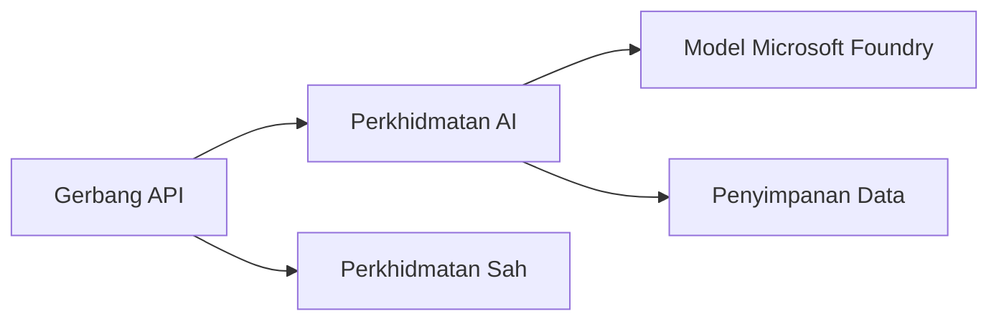
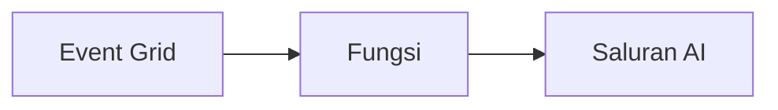

# Bab 8: Corak Pengeluaran & Perusahaan

**📚 Kursus**: [AZD Untuk Pemula](../../README.md) | **⏱️ Tempoh**: 2-3 jam | **⭐ Kerumitan**: Lanjutan

---

## Gambaran Keseluruhan

Bab ini meliputi corak penyebaran sedia perusahaan, pengerasan keselamatan, pemantauan, dan pengoptimuman kos untuk beban kerja AI produksi.

## Objektif Pembelajaran

Dengan menyelesaikan bab ini, anda akan:
- Menyebarkan aplikasi tahan rintangan pelbagai wilayah
- Melaksanakan corak keselamatan perusahaan
- Mengkonfigurasi pemantauan menyeluruh
- Mengoptimumkan kos pada skala besar
- Menyediakan saluran CI/CD dengan AZD

---

## 📚 Pelajaran

| # | Pelajaran | Penerangan | Masa |
|---|----------|-------------|------|
| 1 | [Amalan AI Produksi](production-ai-practices.md) | Corak penyebaran perusahaan | 90 min |

---

## 🚀 Senarai Semak Produksi

- [ ] Penyebaran pelbagai wilayah untuk ketahanan
- [ ] Identiti terurus untuk pengesahan (tanpa kunci)
- [ ] Application Insights untuk pemantauan
- [ ] Bajet kos dan amaran dikonfigurasi
- [ ] Imbasan keselamatan diaktifkan
- [ ] Integrasi saluran CI/CD
- [ ] Pelan pemulihan bencana

---

## 🏗️ Corak Seni Bina

### Corak 1: AI Mikrosistem


### Corak 2: AI Berpandu Acara


---

## 🔐 Amalan Terbaik Keselamatan

```bicep
// Use managed identity
identity: {
  type: 'SystemAssigned'
}

// Private endpoints for AI services
properties: {
  publicNetworkAccess: 'Disabled'
  networkAcls: {
    defaultAction: 'Deny'
  }
}
```

---

## 💰 Pengoptimuman Kos

| Strategi | Penjimatan |
|----------|------------|
| Skala ke sifar (Container Apps) | 60-80% |
| Gunakan tier penggunaan untuk dev | 50-70% |
| Penskalahan berjadual | 30-50% |
| Kapasiti berpesanan | 20-40% |

```bash
# Tetapkan amaran bajet
az consumption budget create \
  --budget-name "AI-Budget" \
  --amount 500 \
  --category Cost \
  --time-grain Monthly
```

---

## 📊 Persediaan Pemantauan

```bash
# Alirkan log
azd monitor --logs

# Semak Application Insights
azd monitor

# Lihat metrik
az monitor metrics list --resource <resource-id>
```

---

## 🔗 Navigasi

| Arah | Bab |
|-------|-------|
| **Sebelumnya** | [Bab 7: Penyelesaian Masalah](../chapter-07-troubleshooting/README.md) |
| **Kursus Selesai** | [Halaman Kursus](../../README.md) |

---

## 📖 Sumber Berkaitan

- [Panduan Ejen AI](../chapter-02-ai-development/agents.md)
- [Application Insights](../chapter-06-pre-deployment/application-insights.md)
- [Penyelesaian Multi-Ejen](../chapter-05-multi-agent/README.md)
- [Contoh Mikrosistem](../../examples/microservices/README.md)

---

<!-- CO-OP TRANSLATOR DISCLAIMER START -->
**Penafian**:  
Dokumen ini telah diterjemahkan menggunakan perkhidmatan terjemahan AI [Co-op Translator](https://github.com/Azure/co-op-translator). Walaupun kami berusaha untuk ketepatan, sila ambil perhatian bahawa terjemahan automatik mungkin mengandungi kesilapan atau ketidaktepatan. Dokumen asal dalam bahasa asalnya harus dianggap sebagai sumber yang sahih. Untuk maklumat penting, terjemahan profesional oleh manusia adalah disyorkan. Kami tidak bertanggungjawab atas sebarang salah faham atau salah tafsir yang timbul daripada penggunaan terjemahan ini.
<!-- CO-OP TRANSLATOR DISCLAIMER END -->