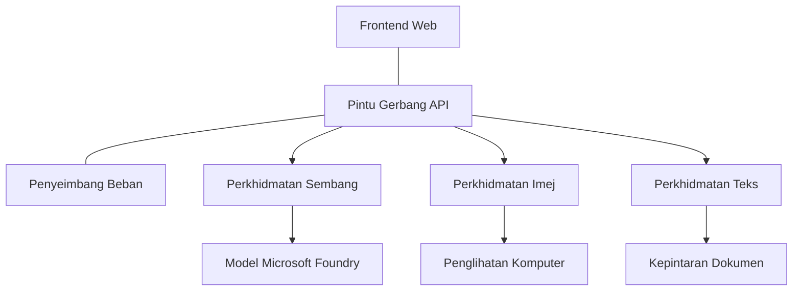

# Amalan Terbaik Beban Kerja AI Pengeluaran dengan AZD

**Navigasi Bab:**
- **📚 Laman Utama Kursus**: [AZD Untuk Pemula](../../README.md)
- **📖 Bab Semasa**: Bab 8 - Corak Pengeluaran & Perusahaan
- **⬅️ Bab Sebelum Ini**: [Bab 7: Penyelesaian Masalah](../chapter-07-troubleshooting/debugging.md)
- **⬅️ Juga Berkaitan**: [Makmal Bengkel AI](ai-workshop-lab.md)
- **🎯 Kursus Lengkap**: [AZD Untuk Pemula](../../README.md)

## Gambaran Keseluruhan

Panduan ini menyediakan amalan terbaik yang komprehensif untuk menyebarkan beban kerja AI yang sedia untuk pengeluaran menggunakan Azure Developer CLI (AZD). Berdasarkan maklum balas dari komuniti Microsoft Foundry Discord dan penyebaran pelanggan dunia sebenar, amalan ini menangani cabaran paling biasa dalam sistem AI pengeluaran.

## Cabaran Utama Yang Ditangani

Berdasarkan keputusan tinjauan komuniti kami, ini adalah cabaran utama yang dihadapi pembangun:

- **45%** menghadapi kesukaran dengan penyebaran AI pelbagai perkhidmatan
- **38%** mempunyai masalah dengan pengurusan kelayakan dan rahsia  
- **35%** mendapati kesukaran dengan kesiapan pengeluaran dan penskalaan
- **32%** memerlukan strategi pengoptimuman kos yang lebih baik
- **29%** memerlukan penambahbaikan dalam pemantauan dan penyelesaian masalah

## Corak Seni Bina untuk AI Pengeluaran

### Corak 1: Seni Bina AI Perkhidmatan Mikro

**Bila untuk digunakan**: Aplikasi AI yang kompleks dengan pelbagai keupayaan


**Pelaksanaan AZD**:

```yaml
# azure.yaml
name: enterprise-ai-platform
services:
  web:
    project: ./web
    host: staticwebapp
  api-gateway:
    project: ./api-gateway
    host: containerapp
  chat-service:
    project: ./services/chat
    host: containerapp
  vision-service:
    project: ./services/vision
    host: containerapp
  text-service:
    project: ./services/text
    host: containerapp
```

### Corak 2: Pemprosesan AI Berdasarkannya Peristiwa

**Bila untuk digunakan**: Pemprosesan berkumpulan, analisis dokumen, aliran kerja tak segerak

```bicep
// Event Hub for AI processing pipeline
resource eventHub 'Microsoft.EventHub/namespaces@2023-01-01-preview' = {
  name: eventHubNamespaceName
  location: location
  sku: {
    name: 'Standard'
    tier: 'Standard'
    capacity: 1
  }
}

// Service Bus for reliable message processing
resource serviceBus 'Microsoft.ServiceBus/namespaces@2022-10-01-preview' = {
  name: serviceBusNamespaceName
  location: location
  sku: {
    name: 'Premium'
    tier: 'Premium'
    capacity: 1
  }
}

// Function App for processing
resource functionApp 'Microsoft.Web/sites@2023-01-01' = {
  name: functionAppName
  location: location
  kind: 'functionapp,linux'
  properties: {
    siteConfig: {
      appSettings: [
        {
          name: 'FUNCTIONS_EXTENSION_VERSION'
          value: '~4'
        }
        {
          name: 'AZURE_OPENAI_ENDPOINT'
          value: '@Microsoft.KeyVault(VaultName=${keyVault.name};SecretName=openai-endpoint)'
        }
      ]
    }
  }
}
```

## Berfikir Mengenai Kesihatan Ejen AI

Apabila aplikasi web tradisional rosak, simptomnya biasa: halaman tidak dimuat, API mengembalikan ralat, atau penyebaran gagal. Aplikasi berkuasa AI boleh rosak dalam semua cara yang sama itu—tetapi mereka juga boleh berkelakuan salah dengan cara yang lebih halus yang tidak menghasilkan mesej ralat yang jelas.

Bahagian ini membantu anda membina model mental untuk memantau beban kerja AI supaya anda tahu ke mana hendak melihat apabila sesuatu tidak kelihatan betul.

### Bagaimana Kesihatan Ejen Berbeza dari Kesihatan Aplikasi Tradisional

Aplikasi tradisional sama ada berfungsi atau tidak. Ejen AI boleh kelihatan berfungsi tetapi menghasilkan keputusan yang lemah. Fikirkan kesihatan ejen dalam dua lapisan:

| Lapisan | Apa Yang Perlu Dipantau | Ke Mana Hendak Melihat |
|---------|------------------------|------------------------|
| **Kesihatan infrastruktur** | Adakah perkhidmatan berjalan? Adakah sumber diperuntukkan? Adakah titik akhir boleh dicapai? | `azd monitor`, kesihatan sumber Portal Azure, log kontena/aplikasi |
| **Kesihatan tingkah laku** | Adakah ejen memberi respons dengan tepat? Adakah respons tepat pada waktunya? Adakah model dipanggil dengan betul? | Jejak Application Insights, metrik kelewatan panggilan model, log kualiti respons |

Kesihatan infrastruktur sudah biasa—ia sama bagi mana-mana aplikasi azd. Kesihatan tingkah laku adalah lapisan baru yang beban kerja AI perkenalkan.

### Ke Mana Hendak Melihat Apabila Aplikasi AI Tidak Berkelakuan Seperti Dijangka

Jika aplikasi AI anda tidak menghasilkan keputusan yang anda jangkakan, berikut adalah senarai semak konsep:

1. **Mulakan dengan asas.** Adakah aplikasi berjalan? Bolehkah ia mencapai kebergantungan? Semak `azd monitor` dan kesihatan sumber seperti biasa untuk mana-mana aplikasi.
2. **Periksa sambungan model.** Adakah aplikasi anda berjaya memanggil model AI? Panggilan model yang gagal atau tamat masa adalah punca paling biasa isu aplikasi AI dan akan muncul dalam log aplikasi anda.
3. **Lihat pada apa yang diterima model.** Respons AI bergantung pada input (prompt dan sebarang konteks yang dipulihkan). Jika output salah, input biasanya salah. Semak sama ada aplikasi anda menghantar data yang betul kepada model.
4. **Semak kelewatan respons.** Panggilan model AI lebih perlahan daripada panggilan API biasa. Jika aplikasi anda berasa perlahan, semak sama ada masa respons model meningkat—ini boleh menunjukkan pengekangan, had kapasiti, atau kesesakan di peringkat rantau.
5. **Perhatikan isyarat kos.** Lonjakan penggunaan token atau panggilan API yang tidak dijangka boleh menunjukkan gelung, prompt yang salah konfigurasi, atau percubaan semula berlebihan.

Anda tidak perlu menguasai alat observabiliti dengan segera. Pengajaran utama adalah aplikasi AI mempunyai lapisan tingkah laku tambahan untuk dipantau, dan pemantauan terbina dalam azd (`azd monitor`) memberi anda titik permulaan untuk menyiasat kedua-dua lapisan.

---

## Amalan Terbaik Keselamatan

### 1. Model Keselamatan Zero-Trust

**Strategi Pelaksanaan**:
- Tiada komunikasi perkhidmatan ke perkhidmatan tanpa pengesahan
- Semua panggilan API menggunakan identiti terurus
- Pengasingan rangkaian dengan titik akhir peribadi
- Kawalan akses keistimewaan terendah

```bicep
// Managed Identity for each service
resource chatServiceIdentity 'Microsoft.ManagedIdentity/userAssignedIdentities@2023-01-31' = {
  name: 'chat-service-identity'
  location: location
}

// Role assignments with minimal permissions
resource openAIUserRole 'Microsoft.Authorization/roleAssignments@2022-04-01' = {
  scope: openAIAccount
  name: guid(openAIAccount.id, chatServiceIdentity.id, openAIUserRoleDefinitionId)
  properties: {
    roleDefinitionId: subscriptionResourceId('Microsoft.Authorization/roleDefinitions', '5e0bd9bd-7b93-4f28-af87-19fc36ad61bd')
    principalId: chatServiceIdentity.properties.principalId
    principalType: 'ServicePrincipal'
  }
}
```

### 2. Pengurusan Rahsia yang Selamat

**Corak Integrasi Key Vault**:

```bicep
// Key Vault with proper access policies
resource keyVault 'Microsoft.KeyVault/vaults@2023-02-01' = {
  name: keyVaultName
  location: location
  properties: {
    tenantId: tenant().tenantId
    sku: {
      family: 'A'
      name: 'premium'  // Use premium for production
    }
    enableRbacAuthorization: true  // Use RBAC instead of access policies
    enablePurgeProtection: true    // Prevent accidental deletion
    enableSoftDelete: true
    softDeleteRetentionInDays: 90
  }
}

// Store all AI service credentials
resource openAIKeySecret 'Microsoft.KeyVault/vaults/secrets@2023-02-01' = {
  parent: keyVault
  name: 'openai-api-key'
  properties: {
    value: openAIAccount.listKeys().key1
    attributes: {
      enabled: true
    }
  }
}
```

### 3. Keselamatan Rangkaian

**Konfigurasi Titik Akhir Peribadi**:

```bicep
// Virtual Network for AI services
resource virtualNetwork 'Microsoft.Network/virtualNetworks@2023-04-01' = {
  name: vnetName
  location: location
  properties: {
    addressSpace: {
      addressPrefixes: ['10.0.0.0/16']
    }
    subnets: [
      {
        name: 'ai-services-subnet'
        properties: {
          addressPrefix: '10.0.1.0/24'
          privateEndpointNetworkPolicies: 'Disabled'
        }
      }
      {
        name: 'app-services-subnet'
        properties: {
          addressPrefix: '10.0.2.0/24'
          delegations: [
            {
              name: 'Microsoft.Web/serverFarms'
              properties: {
                serviceName: 'Microsoft.Web/serverFarms'
              }
            }
          ]
        }
      }
    ]
  }
}

// Private endpoints for all AI services
resource openAIPrivateEndpoint 'Microsoft.Network/privateEndpoints@2023-04-01' = {
  name: '${openAIAccountName}-pe'
  location: location
  properties: {
    subnet: {
      id: virtualNetwork.properties.subnets[0].id
    }
    privateLinkServiceConnections: [
      {
        name: 'openai-connection'
        properties: {
          privateLinkServiceId: openAIAccount.id
          groupIds: ['account']
        }
      }
    ]
  }
}
```

## Prestasi dan Penskalaan

### 1. Strategi Penskalaan Auto

**Penskalaan Auto Aplikasi Kontena**:

```bicep
resource containerApp 'Microsoft.App/containerApps@2023-05-01' = {
  name: containerAppName
  location: location
  properties: {
    configuration: {
      ingress: {
        external: true
        targetPort: 8000
        transport: 'http'
      }
    }
    template: {
      scale: {
        minReplicas: 2  // Always have 2 instances minimum
        maxReplicas: 50 // Scale up to 50 for high load
        rules: [
          {
            name: 'http-scaling'
            http: {
              metadata: {
                concurrentRequests: '20'  // Scale when >20 concurrent requests
              }
            }
          }
          {
            name: 'cpu-scaling'
            custom: {
              type: 'cpu'
              metadata: {
                type: 'Utilization'
                value: '70'  // Scale when CPU >70%
              }
            }
          }
        ]
      }
    }
  }
}
```

### 2. Strategi Caching

**Redis Cache untuk Respons AI**:

```bicep
// Redis Premium for production workloads
resource redisCache 'Microsoft.Cache/redis@2023-04-01' = {
  name: redisCacheName
  location: location
  properties: {
    sku: {
      name: 'Premium'
      family: 'P'
      capacity: 1
    }
    enableNonSslPort: false
    minimumTlsVersion: '1.2'
    redisConfiguration: {
      'maxmemory-policy': 'allkeys-lru'
    }
    // Enable clustering for high availability
    redisVersion: '6.0'
    shardCount: 2
  }
}

// Cache configuration in application
var cacheConnectionString = '${redisCache.properties.hostName}:6380,password=${redisCache.listKeys().primaryKey},ssl=True,abortConnect=False'
```

### 3. Pengimbangan Beban dan Pengurusan Trafik

**Application Gateway dengan WAF**:

```bicep
// Application Gateway with Web Application Firewall
resource applicationGateway 'Microsoft.Network/applicationGateways@2023-04-01' = {
  name: appGatewayName
  location: location
  properties: {
    sku: {
      name: 'WAF_v2'
      tier: 'WAF_v2'
      capacity: 2
    }
    webApplicationFirewallConfiguration: {
      enabled: true
      firewallMode: 'Prevention'
      ruleSetType: 'OWASP'
      ruleSetVersion: '3.2'
    }
    // Backend pools for AI services
    backendAddressPools: [
      {
        name: 'ai-services-pool'
        properties: {
          backendAddresses: [
            {
              fqdn: '${containerApp.properties.configuration.ingress.fqdn}'
            }
          ]
        }
      }
    ]
  }
}
```

## 💰 Pengoptimuman Kos

### 1. Saiz Sumber Yang Sesuai

**Konfigurasi Spesifik Persekitaran**:

```bash
# Persekitaran pembangunan
azd env new development
azd env set AZURE_OPENAI_SKU "S0"
azd env set AZURE_OPENAI_CAPACITY 10
azd env set AZURE_SEARCH_SKU "basic"
azd env set CONTAINER_CPU 0.5
azd env set CONTAINER_MEMORY 1.0

# Persekitaran pengeluaran
azd env new production
azd env set AZURE_OPENAI_SKU "S0"
azd env set AZURE_OPENAI_CAPACITY 100
azd env set AZURE_SEARCH_SKU "standard"
azd env set CONTAINER_CPU 2.0
azd env set CONTAINER_MEMORY 4.0
```

### 2. Pemantauan Kos dan Belanjawan

```bicep
// Cost management and budgets
resource budget 'Microsoft.Consumption/budgets@2023-05-01' = {
  name: 'ai-workload-budget'
  properties: {
    timePeriod: {
      startDate: '2024-01-01'
      endDate: '2024-12-31'
    }
    timeGrain: 'Monthly'
    amount: 2000  // $2000 monthly budget
    category: 'Cost'
    notifications: {
      warning: {
        enabled: true
        operator: 'GreaterThan'
        threshold: 80
        contactEmails: [
          'finance@company.com'
          'engineering@company.com'
        ]
        contactRoles: [
          'Owner'
          'Contributor'
        ]
      }
      critical: {
        enabled: true
        operator: 'GreaterThan'
        threshold: 95
        contactEmails: [
          'cto@company.com'
        ]
      }
    }
  }
}
```

### 3. Pengoptimuman Penggunaan Token

**Pengurusan Kos OpenAI**:

```typescript
// Pengoptimuman token pada peringkat aplikasi
class TokenOptimizer {
  private readonly maxTokens = 4000;
  private readonly reserveTokens = 500;
  
  optimizePrompt(userInput: string, context: string): string {
    const availableTokens = this.maxTokens - this.reserveTokens;
    const estimatedTokens = this.estimateTokens(userInput + context);
    
    if (estimatedTokens > availableTokens) {
      // Pendekkan konteks, bukan input pengguna
      context = this.truncateContext(context, availableTokens - this.estimateTokens(userInput));
    }
    
    return `${context}\n\nUser: ${userInput}`;
  }
  
  private estimateTokens(text: string): number {
    // Anggaran kasar: 1 token ≈ 4 aksara
    return Math.ceil(text.length / 4);
  }
}
```

## Pemantauan dan Kebolehlihatan

### 1. Application Insights yang Komprehensif

```bicep
// Application Insights with advanced features
resource applicationInsights 'Microsoft.Insights/components@2020-02-02' = {
  name: applicationInsightsName
  location: location
  kind: 'web'
  properties: {
    Application_Type: 'web'
    WorkspaceResourceId: logAnalyticsWorkspace.id
    SamplingPercentage: 100  // Full sampling for AI apps
    DisableIpMasking: false  // Enable for security
  }
}

// Custom metrics for AI operations
resource aiMetricAlerts 'Microsoft.Insights/metricAlerts@2018-03-01' = {
  name: 'ai-high-error-rate'
  location: 'global'
  properties: {
    description: 'Alert when AI service error rate is high'
    severity: 2
    enabled: true
    scopes: [
      applicationInsights.id
    ]
    evaluationFrequency: 'PT1M'
    windowSize: 'PT5M'
    criteria: {
      'odata.type': 'Microsoft.Azure.Monitor.SingleResourceMultipleMetricCriteria'
      allOf: [
        {
          name: 'high-error-rate'
          metricName: 'requests/failed'
          operator: 'GreaterThan'
          threshold: 10
          timeAggregation: 'Count'
        }
      ]
    }
  }
}
```

### 2. Pemantauan Khusus AI

**Papan Pemuka Tersuai untuk Metrik AI**:

```json
// Dashboard configuration for AI workloads
{
  "dashboard": {
    "name": "AI Application Monitoring",
    "tiles": [
      {
        "name": "OpenAI Request Volume",
        "query": "requests | where name contains 'openai' | summarize count() by bin(timestamp, 5m)"
      },
      {
        "name": "AI Response Latency",
        "query": "requests | where name contains 'openai' | summarize avg(duration) by bin(timestamp, 5m)"
      },
      {
        "name": "Token Usage",
        "query": "customMetrics | where name == 'openai_tokens_used' | summarize sum(value) by bin(timestamp, 1h)"
      },
      {
        "name": "Cost per Hour",
        "query": "customMetrics | where name == 'openai_cost' | summarize sum(value) by bin(timestamp, 1h)"
      }
    ]
  }
}
```

### 3. Pemeriksaan Kesihatan dan Pemantauan Masa Sedang Beroperasi

```bicep
// Application Insights availability tests
resource availabilityTest 'Microsoft.Insights/webtests@2022-06-15' = {
  name: 'ai-app-availability-test'
  location: location
  tags: {
    'hidden-link:${applicationInsights.id}': 'Resource'
  }
  properties: {
    SyntheticMonitorId: 'ai-app-availability-test'
    Name: 'AI Application Availability Test'
    Description: 'Tests AI application endpoints'
    Enabled: true
    Frequency: 300  // 5 minutes
    Timeout: 120    // 2 minutes
    Kind: 'ping'
    Locations: [
      {
        Id: 'us-east-2-azr'
      }
      {
        Id: 'us-west-2-azr'
      }
    ]
    Configuration: {
      WebTest: '''
        <WebTest Name="AI Health Check" 
                 Id="8d2de8d2-a2b0-4c2e-9a0d-8f9c9a0b8c8d" 
                 Enabled="True" 
                 CssProjectStructure="" 
                 CssIteration="" 
                 Timeout="120" 
                 WorkItemIds="" 
                 xmlns="http://microsoft.com/schemas/VisualStudio/TeamTest/2010" 
                 Description="" 
                 CredentialUserName="" 
                 CredentialPassword="" 
                 PreAuthenticate="True" 
                 Proxy="default" 
                 StopOnError="False" 
                 RecordedResultFile="" 
                 ResultsLocale="">
          <Items>
            <Request Method="GET" 
                     Guid="a5f10126-e4cd-570d-961c-cea43999a200" 
                     Version="1.1" 
                     Url="${webApp.properties.defaultHostName}/health" 
                     ThinkTime="0" 
                     Timeout="120" 
                     ParseDependentRequests="True" 
                     FollowRedirects="True" 
                     RecordResult="True" 
                     Cache="False" 
                     ResponseTimeGoal="0" 
                     Encoding="utf-8" 
                     ExpectedHttpStatusCode="200" 
                     ExpectedResponseUrl="" 
                     ReportingName="" 
                     IgnoreHttpStatusCode="False" />
          </Items>
        </WebTest>
      '''
    }
  }
}
```

## Pemulihan Bencana dan Ketersediaan Tinggi

### 1. Penyebaran Pelbagai Rantau

```yaml
# azure.yaml - Multi-region configuration
name: ai-app-multiregion
services:
  api-primary:
    project: ./api
    host: containerapp
    env:
      - AZURE_REGION=eastus
  api-secondary:
    project: ./api
    host: containerapp
    env:
      - AZURE_REGION=westus2
```

```bicep
// Traffic Manager for global load balancing
resource trafficManager 'Microsoft.Network/trafficManagerProfiles@2022-04-01' = {
  name: trafficManagerProfileName
  location: 'global'
  properties: {
    profileStatus: 'Enabled'
    trafficRoutingMethod: 'Priority'
    dnsConfig: {
      relativeName: trafficManagerProfileName
      ttl: 30
    }
    monitorConfig: {
      protocol: 'HTTPS'
      port: 443
      path: '/health'
      intervalInSeconds: 30
      toleratedNumberOfFailures: 3
      timeoutInSeconds: 10
    }
    endpoints: [
      {
        name: 'primary-endpoint'
        type: 'Microsoft.Network/trafficManagerProfiles/azureEndpoints'
        properties: {
          targetResourceId: primaryAppService.id
          endpointStatus: 'Enabled'
          priority: 1
        }
      }
      {
        name: 'secondary-endpoint'
        type: 'Microsoft.Network/trafficManagerProfiles/azureEndpoints'
        properties: {
          targetResourceId: secondaryAppService.id
          endpointStatus: 'Enabled'
          priority: 2
        }
      }
    ]
  }
}
```

### 2. Sandaran Data dan Pemulihan

```bicep
// Backup configuration for critical data
resource backupVault 'Microsoft.DataProtection/backupVaults@2023-05-01' = {
  name: backupVaultName
  location: location
  identity: {
    type: 'SystemAssigned'
  }
  properties: {
    storageSettings: [
      {
        datastoreType: 'VaultStore'
        type: 'LocallyRedundant'
      }
    ]
  }
}

// Backup policy for AI models and data
resource backupPolicy 'Microsoft.DataProtection/backupVaults/backupPolicies@2023-05-01' = {
  parent: backupVault
  name: 'ai-data-backup-policy'
  properties: {
    policyRules: [
      {
        backupParameters: {
          backupType: 'Full'
          objectType: 'AzureBackupParams'
        }
        trigger: {
          schedule: {
            repeatingTimeIntervals: [
              'R/2024-01-01T02:00:00+00:00/P1D'  // Daily at 2 AM
            ]
          }
          objectType: 'ScheduleBasedTriggerContext'
        }
        dataStore: {
          datastoreType: 'VaultStore'
          objectType: 'DataStoreInfoBase'
        }
        name: 'BackupDaily'
        objectType: 'AzureBackupRule'
      }
    ]
  }
}
```

## Integrasi DevOps dan CI/CD

### 1. Aliran Kerja GitHub Actions

```yaml
# .github/workflows/deploy-ai-app.yml
name: Deploy AI Application

on:
  push:
    branches: [main]
  pull_request:
    branches: [main]

jobs:
  test:
    runs-on: ubuntu-latest
    steps:
      - uses: actions/checkout@v4
      
      - name: Setup Python
        uses: actions/setup-python@v4
        with:
          python-version: '3.11'
          
      - name: Install dependencies
        run: |
          pip install -r requirements.txt
          pip install pytest
          
      - name: Run tests
        run: pytest tests/
        
      - name: AI Safety Tests
        run: |
          python scripts/test_ai_safety.py
          python scripts/validate_prompts.py

  deploy-staging:
    needs: test
    if: github.event_name == 'pull_request'
    runs-on: ubuntu-latest
    steps:
      - uses: actions/checkout@v4
      
      - name: Setup AZD
        uses: Azure/setup-azd@v1.0.0
        
      - name: Login to Azure
        uses: azure/login@v1
        with:
          creds: ${{ secrets.AZURE_CREDENTIALS }}
          
      - name: Deploy to Staging
        run: |
          azd env select staging
          azd deploy

  deploy-production:
    needs: test
    if: github.ref == 'refs/heads/main'
    runs-on: ubuntu-latest
    steps:
      - uses: actions/checkout@v4
      
      - name: Setup AZD
        uses: Azure/setup-azd@v1.0.0
        
      - name: Login to Azure
        uses: azure/login@v1
        with:
          creds: ${{ secrets.AZURE_CREDENTIALS }}
          
      - name: Deploy to Production
        run: |
          azd env select production
          azd deploy
          
      - name: Run Production Health Checks
        run: |
          python scripts/health_check.py --env production
```

### 2. Pengesahan Infrastruktur

```bash
# scripts/validate_infrastructure.sh
#!/bin/bash

echo "Validating AI infrastructure deployment..."

# Semak jika semua perkhidmatan yang diperlukan sedang berjalan
services=("openai" "search" "storage" "keyvault")
for service in "${services[@]}"; do
    echo "Checking $service..."
    if ! az resource list --resource-type "Microsoft.CognitiveServices/accounts" --query "[?contains(name, '$service')]" -o tsv; then
        echo "ERROR: $service not found"
        exit 1
    fi
done

# Sahkan penyebaran model OpenAI
echo "Validating OpenAI model deployments..."
models=$(az cognitiveservices account deployment list --name $AZURE_OPENAI_NAME --resource-group $AZURE_RESOURCE_GROUP --query "[].name" -o tsv)
if [[ ! $models == *"gpt-35-turbo"* ]]; then
    echo "ERROR: Required model gpt-35-turbo not deployed"
    exit 1
fi

# Uji kesambungan perkhidmatan AI
echo "Testing AI service connectivity..."
python scripts/test_connectivity.py

echo "Infrastructure validation completed successfully!"
```

## Senarai Semak Kesiapan Pengeluaran

### Keselamatan ✅
- [ ] Semua perkhidmatan menggunakan identiti terurus
- [ ] Rahsia disimpan dalam Key Vault
- [ ] Titik akhir peribadi dikonfigurasikan
- [ ] Kumpulan keselamatan rangkaian dilaksanakan
- [ ] RBAC dengan keistimewaan terendah
- [ ] WAF diaktifkan pada titik akhir awam

### Prestasi ✅
- [ ] Penskalaan automatik dikonfigurasi
- [ ] Caching dilaksanakan
- [ ] Pengimbangan beban disediakan
- [ ] CDN untuk kandungan statik
- [ ] Penampungan sambungan pangkalan data
- [ ] Pengoptimuman penggunaan token

### Pemantauan ✅
- [ ] Application Insights dikonfigurasi
- [ ] Metrik tersuai didefinisikan
- [ ] Peraturan amaran disediakan
- [ ] Papan pemuka dibuat
- [ ] Pemeriksaan kesihatan dilaksanakan
- [ ] Polisi penyimpanan log

### Kebolehpercayaan ✅
- [ ] Penyebaran pelbagai rantau
- [ ] Pelan sandaran dan pemulihan
- [ ] Pemutus litar dilaksanakan
- [ ] Polisi cubaan semula dikonfigurasikan
- [ ] Penurunan terurus
- [ ] Titik akhir pemeriksaan kesihatan

### Pengurusan Kos ✅
- [ ] Amaran bajet dikonfigurasi
- [ ] Saiz sumber yang sesuai
- [ ] Diskaun dev/test digunakan
- [ ] Instans berrezervasi dibeli
- [ ] Papan pemuka pemantauan kos
- [ ] Semakan kos berkala

### Pematuhan ✅
- [ ] Keperluan penempatan data dipenuhi
- [ ] Log audit diaktifkan
- [ ] Polisi pematuhan digunakan
- [ ] Garis asas keselamatan dilaksanakan
- [ ] Penilaian keselamatan berkala
- [ ] Pelan tindak balas insiden

## Penanda Aras Prestasi

### Metrik Pengeluaran Tipikal

| Metrik | Sasaran | Pemantauan |
|--------|---------|------------|
| **Masa Respons** | < 2 saat | Application Insights |
| **Ketersediaan** | 99.9% | Pemantauan masa sedang beroperasi |
| **Kadar Ralat** | < 0.1% | Log aplikasi |
| **Penggunaan Token** | < $500/bulan | Pengurusan kos |
| **Pengguna Serentak** | 1000+ | Ujian beban |
| **Masa Pemulihan** | < 1 jam | Ujian pemulihan bencana |

### Ujian Beban

```bash
# Skrip ujian beban untuk aplikasi AI
python scripts/load_test.py \
  --endpoint https://your-ai-app.azurewebsites.net \
  --concurrent-users 100 \
  --duration 300 \
  --ramp-up 60
```

## 🤝 Amalan Terbaik Komuniti

Berdasarkan maklum balas komuniti Microsoft Foundry Discord:

### Cadangan Teratas Dari Komuniti:

1. **Mula Kecil, Skala Secara Berperingkat**: Mulakan dengan SKU asas dan skala mengikut penggunaan sebenar
2. **Pantau Segalanya**: Sediakan pemantauan komprehensif dari hari pertama
3. **Automasi Keselamatan**: Gunakan infrastruktur sebagai kod untuk keselamatan yang konsisten
4. **Uji Dengan Teliti**: Sertakan ujian khusus AI dalam saluran anda
5. **Rancang Untuk Kos**: Pantau penggunaan token dan tetapkan amaran bajet awal

### Perkara Perangkap yang Perlu Dielakkan:

- ❌ Mengeset kunci API secara keras dalam kod
- ❌ Tidak menyediakan pemantauan yang betul
- ❌ Mengabaikan pengoptimuman kos
- ❌ Tidak menguji senario kegagalan
- ❌ Menyebar tanpa pemeriksaan kesihatan

## Perintah dan Sambungan CLI AI AZD

AZD termasuk set perintah dan sambungan khusus AI yang berkembang yang mempermudah aliran kerja AI pengeluaran. Alat ini menjembatani jurang antara pembangunan tempatan dan penyebaran pengeluaran untuk beban kerja AI.

### Sambungan AZD untuk AI

AZD menggunakan sistem sambungan untuk menambah keupayaan khusus AI. Pasang dan urus sambungan dengan:

```bash
# Senaraikan semua sambungan yang tersedia (termasuk AI)
azd extension list

# Pasang sambungan ejen Foundry
azd extension install azure.ai.agents

# Pasang sambungan penalaan halus
azd extension install azure.ai.finetune

# Pasang sambungan model tersuai
azd extension install azure.ai.models

# Naik taraf semua sambungan yang dipasang
azd extension upgrade --all
```

**Sambungan AI yang tersedia:**

| Sambungan | Tujuan | Status |
|-----------|--------|--------|
| `azure.ai.agents` | Pengurusan Perkhidmatan Ejen Foundry | Pratonton |
| `azure.ai.finetune` | Penalaan halus model Foundry | Pratonton |
| `azure.ai.models` | Model tersuai Foundry | Pratonton |
| `azure.coding-agent` | Konfigurasi ejen pengekodan | Tersedia |

### Memulakan Projek Ejen Dengan `azd ai agent init`

Perintah `azd ai agent init` membina kerangka projek ejen AI sedia untuk pengeluaran yang diintegrasikan dengan Microsoft Foundry Agent Service:

```bash
# Mulakan projek ejen baru dari manifest ejen
azd ai agent init -m <manifest-path-or-uri>

# Mulakan dan sasarkan projek Foundry tertentu
azd ai agent init -m agent-manifest.yaml --project-id <foundry-project-id>

# Mulakan dengan direktori sumber tersuai
azd ai agent init -m agent-manifest.yaml --src ./agents/my-agent

# Sasarkan Container Apps sebagai hos
azd ai agent init -m agent-manifest.yaml --host containerapp
```

**Bendera utama:**

| Bendera | Penerangan |
|---------|------------|
| `-m, --manifest` | Laluan atau URI ke manifesto ejen untuk ditambah ke projek anda |
| `-p, --project-id` | ID Projek Microsoft Foundry sedia ada untuk persekitaran azd anda |
| `-s, --src` | Direktori untuk memuat turun definisi ejen (default `src/<agent-id>`) |
| `--host` | Gantikan hos lalai (contoh, `containerapp`) |
| `-e, --environment` | Persekitaran azd yang hendak digunakan |

**Petua pengeluaran**: Gunakan `--project-id` untuk menyambung terus ke projek Foundry sedia ada, memastikan kod ejen dan sumber awan anda terhubung sejak awal.

### Protokol Konteks Model (MCP) dengan `azd mcp`

AZD menyertakan sokongan pelayan MCP terbina dalam (Alpha), membolehkan ejen AI dan alat berinteraksi dengan sumber Azure anda melalui protokol piawai:

```bash
# Mula pelayan MCP untuk projek anda
azd mcp start

# Urus persetujuan alat untuk operasi MCP
azd mcp consent
```

Pelayan MCP mendedahkan konteks projek azd anda—persekitaran, perkhidmatan, dan sumber Azure—kepada alat pembangunan berkuasa AI. Ini membolehkan:

- **Penyebaran dibantu AI**: Membiarkan ejen pengekodan bertanya keadaan projek anda dan mencetuskan penyebaran
- **Penemuan sumber**: Alat AI boleh menemui sumber Azure yang digunakan projek anda
- **Pengurusan persekitaran**: Ejen boleh beralih antara persekitaran dev/staging/pengeluaran

### Penjanaan Infrastruktur dengan `azd infra generate`

Untuk beban kerja AI pengeluaran, anda boleh menjana dan menyesuaikan Infrastruktur sebagai Kod bukannya bergantung pada penyediaan automatik:

```bash
# Jana fail Bicep/Terraform daripada definisi projek anda
azd infra generate
```

Ini menulis IaC ke cakera supaya anda boleh:
- Menyemak dan mengaudit infrastruktur sebelum menyebar
- Menambah polisi keselamatan tersuai (peraturan rangkaian, titik akhir peribadi)
- Mengintegrasi dengan proses semakan IaC sedia ada
- Kawalan versi perubahan infrastruktur berasingan daripada kod aplikasi

### Pautan Kitaran Hayat Pengeluaran

Pautan AZD membolehkan anda menyisipkan logik tersuai pada setiap peringkat kitaran hayat penyebaran—kritikal untuk aliran kerja AI pengeluaran:

```yaml
# azure.yaml - Production hooks example
name: ai-production-app
hooks:
  preprovision:
    shell: sh
    run: scripts/validate-quotas.sh    # Check AI model quota before provisioning
  postprovision:
    shell: sh
    run: scripts/configure-networking.sh  # Set up private endpoints
  predeploy:
    shell: sh
    run: scripts/run-ai-safety-tests.sh  # Run prompt safety checks
  postdeploy:
    shell: sh
    run: scripts/smoke-test.sh           # Verify agent responses post-deploy
services:
  agent-api:
    project: ./src/agent
    host: containerapp
    hooks:
      predeploy:
        shell: sh
        run: scripts/validate-model-access.sh  # Per-service hook
```

```bash
# Jalankan kait tertentu secara manual semasa pembangunan
azd hooks run predeploy
```

**Pautan pengeluaran yang disyorkan untuk beban kerja AI:**

| Pautan | Kes Penggunaan |
|--------|----------------|
| `preprovision` | Sahkan kuota langganan untuk kapasiti model AI |
| `postprovision` | Konfigurasikan titik akhir peribadi, sebarkan berat model |
| `predeploy` | Jalankan ujian keselamatan AI, sahkan templat prompt |
| `postdeploy` | Ujian smoke respons ejen, sahkan sambungan model |

### Konfigurasi Saluran Paip CI/CD

Gunakan `azd pipeline config` untuk menghubungkan projek anda ke GitHub Actions atau Azure Pipelines dengan pengesahan Azure selamat:

```bash
# Konfigurasikan aliran CI/CD (interaktif)
azd pipeline config

# Konfigurasikan dengan penyedia khusus
azd pipeline config --provider github
```

Perintah ini:
- Mencipta prinsip perkhidmatan dengan akses keistimewaan terendah
- Mengkonfigurasi kelayakan persekutuan (tiada rahsia disimpan)
- Menjana atau mengemas kini fail definisi paip anda
- Menetapkan pembolehubah persekitaran yang diperlukan dalam sistem CI/CD anda

**Aliran kerja pengeluaran dengan konfigurasi paip:**

```bash
# 1. Sediakan persekitaran pengeluaran
azd env new production
azd env set AZURE_OPENAI_CAPACITY 100

# 2. Konfigurasikan saluran paip
azd pipeline config --provider github

# 3. Saluran paip menjalankan azd deploy pada setiap tolak ke main
```

### Menambah Komponen Dengan `azd add`

Tambah perkhidmatan Azure secara berperingkat ke projek sedia ada:

```bash
# Tambah komponen perkhidmatan baru secara interaktif
azd add
```

Ini amat berguna untuk mengembangkan aplikasi AI pengeluaran—contohnya, menambah perkhidmatan carian vektor, titik akhir ejen baru, atau komponen pemantauan ke penyebaran sedia ada.

## Sumber Tambahan
- **Rangka Kerja Azure Well-Architected**: [Panduan beban kerja AI](https://learn.microsoft.com/azure/well-architected/ai/)
- **Dokumentasi Microsoft Foundry**: [Dokumen rasmi](https://learn.microsoft.com/azure/ai-studio/)
- **Templat Komuniti**: [Contoh Azure](https://github.com/Azure-Samples)
- **Komuniti Discord**: [saluran #Azure](https://discord.gg/microsoft-azure)
- **Kemahiran Ejen untuk Azure**: [microsoft/github-copilot-for-azure on skills.sh](https://skills.sh/microsoft/github-copilot-for-azure) - 37 kemahiran ejen terbuka untuk Azure AI, Foundry, penyebaran, pengoptimuman kos, dan diagnostik. Pasang dalam penyunting anda:
  ```bash
  npx skills add microsoft/github-copilot-for-azure
  ```

---

**Navigasi Bab:**
- **📚 Laman Utama Kursus**: [AZD Untuk Pemula](../../README.md)
- **📖 Bab Semasa**: Bab 8 - Corak Pengeluaran & Perusahaan
- **⬅️ Bab Sebelumnya**: [Bab 7: Penyelesaian Masalah](../chapter-07-troubleshooting/debugging.md)
- **⬅️ Juga Berkaitan**: [Makmal Bengkel AI](ai-workshop-lab.md)
- **🏁 Kursus Selesai**: [AZD Untuk Pemula](../../README.md)

**Ingat**: Beban kerja AI pengeluaran memerlukan perancangan yang teliti, pemantauan, dan pengoptimuman berterusan. Mulakan dengan corak ini dan sesuaikan dengan keperluan khusus anda.

---

<!-- CO-OP TRANSLATOR DISCLAIMER START -->
**Penafian**:  
Dokumen ini telah diterjemahkan menggunakan perkhidmatan penterjemahan AI [Co-op Translator](https://github.com/Azure/co-op-translator). Walaupun kami berusaha untuk ketepatan, sila maklum bahawa terjemahan automatik mungkin mengandungi kesilapan atau ketidaktepatan. Dokumen asal dalam bahasa asalnya harus dianggap sebagai sumber yang sahih. Untuk maklumat kritikal, penterjemahan manusia profesional adalah disyorkan. Kami tidak bertanggungjawab atas sebarang salah faham atau salah tafsir yang timbul daripada penggunaan terjemahan ini.
<!-- CO-OP TRANSLATOR DISCLAIMER END -->