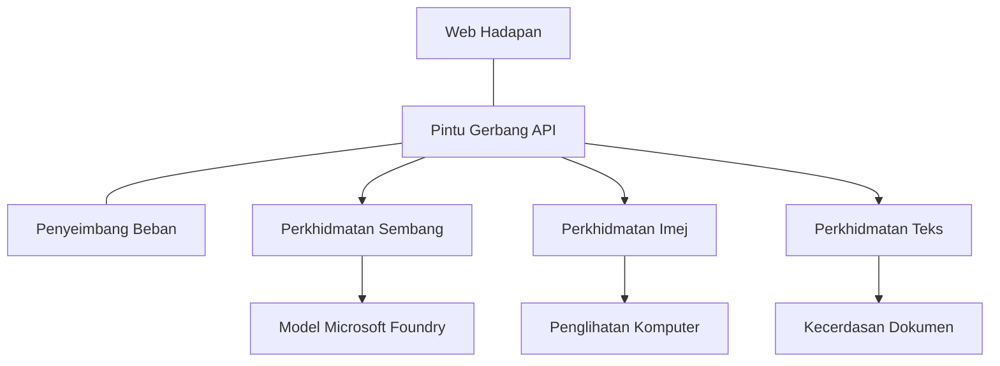

# Amalan Terbaik Beban Kerja AI Produksi dengan AZD

**Navigasi Bab:**
- **📚 Laman Utama Kursus**: [AZD Untuk Pemula](../../README.md)
- **📖 Bab Semasa**: Bab 8 - Corak Produksi & Perusahaan
- **⬅️ Bab Sebelumnya**: [Bab 7: Penyelesaian Masalah](../chapter-07-troubleshooting/debugging.md)
- **⬅️ Juga Berkaitan**: [Makmal Bengkel AI](ai-workshop-lab.md)
- **🎯 Kursus Lengkap**: [AZD Untuk Pemula](../../README.md)

## Gambaran Keseluruhan

Panduan ini menyediakan amalan terbaik yang menyeluruh untuk mengendalikan beban kerja AI yang sedia produksi menggunakan Azure Developer CLI (AZD). Berdasarkan maklum balas dari komuniti Microsoft Foundry Discord dan pengendalian pelanggan dunia sebenar, amalan ini menangani cabaran paling lazim dalam sistem AI produksi.

## Cabaran Utama yang Ditangani

Berdasarkan keputusan tinjauan komuniti kami, ini adalah cabaran utama yang dihadapi oleh pembangun:

- **45%** menghadapi masalah dengan pengendalian AI pelbagai perkhidmatan
- **38%** ada isu dengan pengurusan kelayakan dan rahsia  
- **35%** mendapati kesukaran dengan kesediaan produksi dan skala
- **32%** memerlukan strategi pengoptimuman kos yang lebih baik
- **29%** memerlukan pemantauan dan penyelesaian masalah yang dipertingkatkan

## Corak Senibina untuk AI Produksi

### Corak 1: Senibina AI Mikroservis

**Kapan digunakan**: Aplikasi AI kompleks dengan pelbagai kemampuan



**Pelaksanaan AZD**:

```yaml
# azure.yaml
name: enterprise-ai-platform
services:
  web:
    project: ./web
    host: staticwebapp
  api-gateway:
    project: ./api-gateway
    host: containerapp
  chat-service:
    project: ./services/chat
    host: containerapp
  vision-service:
    project: ./services/vision
    host: containerapp
  text-service:
    project: ./services/text
    host: containerapp
```

### Corak 2: Pemprosesan AI Berpandukan Peristiwa

**Kapan digunakan**: Pemprosesan batch, analisis dokumen, alur kerja async

```bicep
// Event Hub for AI processing pipeline
resource eventHub 'Microsoft.EventHub/namespaces@2023-01-01-preview' = {
  name: eventHubNamespaceName
  location: location
  sku: {
    name: 'Standard'
    tier: 'Standard'
    capacity: 1
  }
}

// Service Bus for reliable message processing
resource serviceBus 'Microsoft.ServiceBus/namespaces@2022-10-01-preview' = {
  name: serviceBusNamespaceName
  location: location
  sku: {
    name: 'Premium'
    tier: 'Premium'
    capacity: 1
  }
}

// Function App for processing
resource functionApp 'Microsoft.Web/sites@2023-01-01' = {
  name: functionAppName
  location: location
  kind: 'functionapp,linux'
  properties: {
    siteConfig: {
      appSettings: [
        {
          name: 'FUNCTIONS_EXTENSION_VERSION'
          value: '~4'
        }
        {
          name: 'AZURE_OPENAI_ENDPOINT'
          value: '@Microsoft.KeyVault(VaultName=${keyVault.name};SecretName=openai-endpoint)'
        }
      ]
    }
  }
}
```

## Berfikir Tentang Kesihatan Ejen AI

Apabila aplikasi web tradisional rosak, simptomnya biasa: halaman tidak dimuat, API mengembalikan ralat, atau pengedaran gagal. Aplikasi berkuasa AI boleh rosak dengan semua cara tersebut—tetapi ia juga boleh berkelakuan dengan cara lebih halus yang tidak menghasilkan mesej ralat yang jelas.

Bahagian ini membantu anda membina model mental untuk memantau beban kerja AI supaya anda tahu ke mana hendak melihat apabila perkara tidak kelihatan betul.

### Bagaimana Kesihatan Ejen Berbeza dari Kesihatan Aplikasi Tradisional

Aplikasi tradisional sama ada berfungsi atau tidak. Ejen AI boleh nampak berfungsi tetapi menghasilkan keputusan yang lemah. Fikirkan kesihatan ejen dalam dua lapisan:

| Lapisan | Apa yang Perlu Dipantau | Di Mana Hendak Melihat |
|---------|------------------------|-----------------------|
| **Kesihatan Infrastruktur** | Adakah perkhidmatan berjalan? Adakah sumber diperuntukkan? Adakah titik akhir boleh diakses? | `azd monitor`, kesihatan sumber di Portal Azure, log kontena/aplikasi |
| **Kesihatan Tingkah Laku** | Adakah ejen memberi respons tepat? Adakah respons tepat masa? Adakah model dipanggil dengan betul? | Penjejakan Application Insights, metrik kelewatan panggilan model, log kualiti respons |

Kesihatan infrastruktur adalah biasa—ia sama untuk mana-mana aplikasi azd. Kesihatan tingkah laku adalah lapisan baru yang diperkenalkan oleh beban kerja AI.

### Di Mana Hendak Melihat Apabila Aplikasi AI Tidak Berkelakuan Seperti Dijangka

Jika aplikasi AI anda tidak menghasilkan keputusan yang anda jangkakan, berikut ialah senarai semak konseptual:

1. **Mula dengan asas.** Adakah aplikasi berjalan? Bolehkah ia mencapai kebergantungan? Semak `azd monitor` dan kesihatan sumber seperti biasa untuk mana-mana aplikasi.
2. **Periksa sambungan model.** Adakah aplikasi anda berjaya memanggil model AI? Panggilan model yang gagal atau tamat masa adalah penyebab paling biasa bagi isu aplikasi AI dan akan muncul dalam log aplikasi anda.
3. **Lihat apa yang diterima model.** Respons AI bergantung pada input (prompt dan mana-mana konteks yang diambil). Jika keluaran salah, input biasanya salah. Semak sama ada aplikasi anda menghantar data yang betul ke model.
4. **Kaji kelewatan respons.** Panggilan model AI lebih perlahan daripada panggilan API biasa. Jika aplikasi anda terasa perlahan, periksa sama ada masa respons model meningkat—ini boleh menunjukkan pengekangan, had kapasiti, atau kesesakan peringkat rantau.
5. **Perhatikan isyarat kos.** Lonjakan tak dijangka dalam penggunaan token atau panggilan API boleh menunjukkan gelung, prompt yang salah konfigurasi, atau cubaan berlebihan.

Anda tidak perlu menguasai alat pemerhatian segera. Intipati utamanya ialah aplikasi AI mempunyai lapisan tingkah laku tambahan untuk dipantau, dan pemantauan terbina dalam azd (`azd monitor`) memberikan anda titik permulaan untuk menyiasat kedua-dua lapisan.

---

## Amalan Terbaik Keselamatan

### 1. Model Keselamatan Zero-Trust

**Strategi Pelaksanaan**:
- Tiada komunikasi perkhidmatan-ke-perkhidmatan tanpa pengesahan
- Semua panggilan API menggunakan identiti terurus
- Pengasingan rangkaian dengan titik akhir peribadi
- Kawalan akses sekurang-kurangnya keistimewaan

```bicep
// Managed Identity for each service
resource chatServiceIdentity 'Microsoft.ManagedIdentity/userAssignedIdentities@2023-01-31' = {
  name: 'chat-service-identity'
  location: location
}

// Role assignments with minimal permissions
resource openAIUserRole 'Microsoft.Authorization/roleAssignments@2022-04-01' = {
  scope: openAIAccount
  name: guid(openAIAccount.id, chatServiceIdentity.id, openAIUserRoleDefinitionId)
  properties: {
    roleDefinitionId: subscriptionResourceId('Microsoft.Authorization/roleDefinitions', '5e0bd9bd-7b93-4f28-af87-19fc36ad61bd')
    principalId: chatServiceIdentity.properties.principalId
    principalType: 'ServicePrincipal'
  }
}
```

### 2. Pengurusan Rahsia Selamat

**Corak Integrasi Key Vault**:

```bicep
// Key Vault with proper access policies
resource keyVault 'Microsoft.KeyVault/vaults@2023-02-01' = {
  name: keyVaultName
  location: location
  properties: {
    tenantId: tenant().tenantId
    sku: {
      family: 'A'
      name: 'premium'  // Use premium for production
    }
    enableRbacAuthorization: true  // Use RBAC instead of access policies
    enablePurgeProtection: true    // Prevent accidental deletion
    enableSoftDelete: true
    softDeleteRetentionInDays: 90
  }
}

// Store all AI service credentials
resource openAIKeySecret 'Microsoft.KeyVault/vaults/secrets@2023-02-01' = {
  parent: keyVault
  name: 'openai-api-key'
  properties: {
    value: openAIAccount.listKeys().key1
    attributes: {
      enabled: true
    }
  }
}
```

### 3. Keselamatan Rangkaian

**Konfigurasi Titik Akhir Peribadi**:

```bicep
// Virtual Network for AI services
resource virtualNetwork 'Microsoft.Network/virtualNetworks@2023-04-01' = {
  name: vnetName
  location: location
  properties: {
    addressSpace: {
      addressPrefixes: ['10.0.0.0/16']
    }
    subnets: [
      {
        name: 'ai-services-subnet'
        properties: {
          addressPrefix: '10.0.1.0/24'
          privateEndpointNetworkPolicies: 'Disabled'
        }
      }
      {
        name: 'app-services-subnet'
        properties: {
          addressPrefix: '10.0.2.0/24'
          delegations: [
            {
              name: 'Microsoft.Web/serverFarms'
              properties: {
                serviceName: 'Microsoft.Web/serverFarms'
              }
            }
          ]
        }
      }
    ]
  }
}

// Private endpoints for all AI services
resource openAIPrivateEndpoint 'Microsoft.Network/privateEndpoints@2023-04-01' = {
  name: '${openAIAccountName}-pe'
  location: location
  properties: {
    subnet: {
      id: virtualNetwork.properties.subnets[0].id
    }
    privateLinkServiceConnections: [
      {
        name: 'openai-connection'
        properties: {
          privateLinkServiceId: openAIAccount.id
          groupIds: ['account']
        }
      }
    ]
  }
}
```

## Prestasi dan Skala

### 1. Strategi Auto-Penskalaan

**Auto-scaling Aplikasi Kontena**:

```bicep
resource containerApp 'Microsoft.App/containerApps@2023-05-01' = {
  name: containerAppName
  location: location
  properties: {
    configuration: {
      ingress: {
        external: true
        targetPort: 8000
        transport: 'http'
      }
    }
    template: {
      scale: {
        minReplicas: 2  // Always have 2 instances minimum
        maxReplicas: 50 // Scale up to 50 for high load
        rules: [
          {
            name: 'http-scaling'
            http: {
              metadata: {
                concurrentRequests: '20'  // Scale when >20 concurrent requests
              }
            }
          }
          {
            name: 'cpu-scaling'
            custom: {
              type: 'cpu'
              metadata: {
                type: 'Utilization'
                value: '70'  // Scale when CPU >70%
              }
            }
          }
        ]
      }
    }
  }
}
```

### 2. Strategi Penyimpanan Cache

**Redis Cache untuk Respons AI**:

```bicep
// Redis Premium for production workloads
resource redisCache 'Microsoft.Cache/redis@2023-04-01' = {
  name: redisCacheName
  location: location
  properties: {
    sku: {
      name: 'Premium'
      family: 'P'
      capacity: 1
    }
    enableNonSslPort: false
    minimumTlsVersion: '1.2'
    redisConfiguration: {
      'maxmemory-policy': 'allkeys-lru'
    }
    // Enable clustering for high availability
    redisVersion: '6.0'
    shardCount: 2
  }
}

// Cache configuration in application
var cacheConnectionString = '${redisCache.properties.hostName}:6380,password=${redisCache.listKeys().primaryKey},ssl=True,abortConnect=False'
```

### 3. Pengimbangan Beban dan Pengurusan Trafik

**Gerbang Aplikasi dengan WAF**:

```bicep
// Application Gateway with Web Application Firewall
resource applicationGateway 'Microsoft.Network/applicationGateways@2023-04-01' = {
  name: appGatewayName
  location: location
  properties: {
    sku: {
      name: 'WAF_v2'
      tier: 'WAF_v2'
      capacity: 2
    }
    webApplicationFirewallConfiguration: {
      enabled: true
      firewallMode: 'Prevention'
      ruleSetType: 'OWASP'
      ruleSetVersion: '3.2'
    }
    // Backend pools for AI services
    backendAddressPools: [
      {
        name: 'ai-services-pool'
        properties: {
          backendAddresses: [
            {
              fqdn: '${containerApp.properties.configuration.ingress.fqdn}'
            }
          ]
        }
      }
    ]
  }
}
```

## 💰 Pengoptimuman Kos

### 1. Penentuan Saiz Sumber yang Betul

**Konfigurasi Khusus Persekitaran**:

```bash
# Persekitaran pembangunan
azd env new development
azd env set AZURE_OPENAI_SKU "S0"
azd env set AZURE_OPENAI_CAPACITY 10
azd env set AZURE_SEARCH_SKU "basic"
azd env set CONTAINER_CPU 0.5
azd env set CONTAINER_MEMORY 1.0

# Persekitaran produksi
azd env new production
azd env set AZURE_OPENAI_SKU "S0"
azd env set AZURE_OPENAI_CAPACITY 100
azd env set AZURE_SEARCH_SKU "standard"
azd env set CONTAINER_CPU 2.0
azd env set CONTAINER_MEMORY 4.0
```

### 2. Pemantauan Kos dan Bajet

```bicep
// Cost management and budgets
resource budget 'Microsoft.Consumption/budgets@2023-05-01' = {
  name: 'ai-workload-budget'
  properties: {
    timePeriod: {
      startDate: '2024-01-01'
      endDate: '2024-12-31'
    }
    timeGrain: 'Monthly'
    amount: 2000  // $2000 monthly budget
    category: 'Cost'
    notifications: {
      warning: {
        enabled: true
        operator: 'GreaterThan'
        threshold: 80
        contactEmails: [
          'finance@company.com'
          'engineering@company.com'
        ]
        contactRoles: [
          'Owner'
          'Contributor'
        ]
      }
      critical: {
        enabled: true
        operator: 'GreaterThan'
        threshold: 95
        contactEmails: [
          'cto@company.com'
        ]
      }
    }
  }
}
```

### 3. Pengoptimuman Penggunaan Token

**Pengurusan Kos OpenAI**:

```typescript
// Pengoptimuman token peringkat aplikasi
class TokenOptimizer {
  private readonly maxTokens = 4000;
  private readonly reserveTokens = 500;
  
  optimizePrompt(userInput: string, context: string): string {
    const availableTokens = this.maxTokens - this.reserveTokens;
    const estimatedTokens = this.estimateTokens(userInput + context);
    
    if (estimatedTokens > availableTokens) {
      // Potong konteks, bukan input pengguna
      context = this.truncateContext(context, availableTokens - this.estimateTokens(userInput));
    }
    
    return `${context}\n\nUser: ${userInput}`;
  }
  
  private estimateTokens(text: string): number {
    // Anggaran kasar: 1 token ≈ 4 aksara
    return Math.ceil(text.length / 4);
  }
}
```

## Pemantauan dan Pengamatan

### 1. Application Insights Menyeluruh

```bicep
// Application Insights with advanced features
resource applicationInsights 'Microsoft.Insights/components@2020-02-02' = {
  name: applicationInsightsName
  location: location
  kind: 'web'
  properties: {
    Application_Type: 'web'
    WorkspaceResourceId: logAnalyticsWorkspace.id
    SamplingPercentage: 100  // Full sampling for AI apps
    DisableIpMasking: false  // Enable for security
  }
}

// Custom metrics for AI operations
resource aiMetricAlerts 'Microsoft.Insights/metricAlerts@2018-03-01' = {
  name: 'ai-high-error-rate'
  location: 'global'
  properties: {
    description: 'Alert when AI service error rate is high'
    severity: 2
    enabled: true
    scopes: [
      applicationInsights.id
    ]
    evaluationFrequency: 'PT1M'
    windowSize: 'PT5M'
    criteria: {
      'odata.type': 'Microsoft.Azure.Monitor.SingleResourceMultipleMetricCriteria'
      allOf: [
        {
          name: 'high-error-rate'
          metricName: 'requests/failed'
          operator: 'GreaterThan'
          threshold: 10
          timeAggregation: 'Count'
        }
      ]
    }
  }
}
```

### 2. Pemantauan Khusus AI

**Paparan Tersuai untuk Metrik AI**:

```json
// Dashboard configuration for AI workloads
{
  "dashboard": {
    "name": "AI Application Monitoring",
    "tiles": [
      {
        "name": "OpenAI Request Volume",
        "query": "requests | where name contains 'openai' | summarize count() by bin(timestamp, 5m)"
      },
      {
        "name": "AI Response Latency",
        "query": "requests | where name contains 'openai' | summarize avg(duration) by bin(timestamp, 5m)"
      },
      {
        "name": "Token Usage",
        "query": "customMetrics | where name == 'openai_tokens_used' | summarize sum(value) by bin(timestamp, 1h)"
      },
      {
        "name": "Cost per Hour",
        "query": "customMetrics | where name == 'openai_cost' | summarize sum(value) by bin(timestamp, 1h)"
      }
    ]
  }
}
```

### 3. Pemeriksaan Kesihatan dan Pemantauan Masa Aktif

```bicep
// Application Insights availability tests
resource availabilityTest 'Microsoft.Insights/webtests@2022-06-15' = {
  name: 'ai-app-availability-test'
  location: location
  tags: {
    'hidden-link:${applicationInsights.id}': 'Resource'
  }
  properties: {
    SyntheticMonitorId: 'ai-app-availability-test'
    Name: 'AI Application Availability Test'
    Description: 'Tests AI application endpoints'
    Enabled: true
    Frequency: 300  // 5 minutes
    Timeout: 120    // 2 minutes
    Kind: 'ping'
    Locations: [
      {
        Id: 'us-east-2-azr'
      }
      {
        Id: 'us-west-2-azr'
      }
    ]
    Configuration: {
      WebTest: '''
        <WebTest Name="AI Health Check" 
                 Id="8d2de8d2-a2b0-4c2e-9a0d-8f9c9a0b8c8d" 
                 Enabled="True" 
                 CssProjectStructure="" 
                 CssIteration="" 
                 Timeout="120" 
                 WorkItemIds="" 
                 xmlns="http://microsoft.com/schemas/VisualStudio/TeamTest/2010" 
                 Description="" 
                 CredentialUserName="" 
                 CredentialPassword="" 
                 PreAuthenticate="True" 
                 Proxy="default" 
                 StopOnError="False" 
                 RecordedResultFile="" 
                 ResultsLocale="">
          <Items>
            <Request Method="GET" 
                     Guid="a5f10126-e4cd-570d-961c-cea43999a200" 
                     Version="1.1" 
                     Url="${webApp.properties.defaultHostName}/health" 
                     ThinkTime="0" 
                     Timeout="120" 
                     ParseDependentRequests="True" 
                     FollowRedirects="True" 
                     RecordResult="True" 
                     Cache="False" 
                     ResponseTimeGoal="0" 
                     Encoding="utf-8" 
                     ExpectedHttpStatusCode="200" 
                     ExpectedResponseUrl="" 
                     ReportingName="" 
                     IgnoreHttpStatusCode="False" />
          </Items>
        </WebTest>
      '''
    }
  }
}
```

## Pemulihan Bencana dan Kebolehpercayaan Tinggi

### 1. Pengedaran Pelbagai Rantau

```yaml
# azure.yaml - Multi-region configuration
name: ai-app-multiregion
services:
  api-primary:
    project: ./api
    host: containerapp
    env:
      - AZURE_REGION=eastus
  api-secondary:
    project: ./api
    host: containerapp
    env:
      - AZURE_REGION=westus2
```

```bicep
// Traffic Manager for global load balancing
resource trafficManager 'Microsoft.Network/trafficManagerProfiles@2022-04-01' = {
  name: trafficManagerProfileName
  location: 'global'
  properties: {
    profileStatus: 'Enabled'
    trafficRoutingMethod: 'Priority'
    dnsConfig: {
      relativeName: trafficManagerProfileName
      ttl: 30
    }
    monitorConfig: {
      protocol: 'HTTPS'
      port: 443
      path: '/health'
      intervalInSeconds: 30
      toleratedNumberOfFailures: 3
      timeoutInSeconds: 10
    }
    endpoints: [
      {
        name: 'primary-endpoint'
        type: 'Microsoft.Network/trafficManagerProfiles/azureEndpoints'
        properties: {
          targetResourceId: primaryAppService.id
          endpointStatus: 'Enabled'
          priority: 1
        }
      }
      {
        name: 'secondary-endpoint'
        type: 'Microsoft.Network/trafficManagerProfiles/azureEndpoints'
        properties: {
          targetResourceId: secondaryAppService.id
          endpointStatus: 'Enabled'
          priority: 2
        }
      }
    ]
  }
}
```

### 2. Sandaran dan Pemulihan Data

```bicep
// Backup configuration for critical data
resource backupVault 'Microsoft.DataProtection/backupVaults@2023-05-01' = {
  name: backupVaultName
  location: location
  identity: {
    type: 'SystemAssigned'
  }
  properties: {
    storageSettings: [
      {
        datastoreType: 'VaultStore'
        type: 'LocallyRedundant'
      }
    ]
  }
}

// Backup policy for AI models and data
resource backupPolicy 'Microsoft.DataProtection/backupVaults/backupPolicies@2023-05-01' = {
  parent: backupVault
  name: 'ai-data-backup-policy'
  properties: {
    policyRules: [
      {
        backupParameters: {
          backupType: 'Full'
          objectType: 'AzureBackupParams'
        }
        trigger: {
          schedule: {
            repeatingTimeIntervals: [
              'R/2024-01-01T02:00:00+00:00/P1D'  // Daily at 2 AM
            ]
          }
          objectType: 'ScheduleBasedTriggerContext'
        }
        dataStore: {
          datastoreType: 'VaultStore'
          objectType: 'DataStoreInfoBase'
        }
        name: 'BackupDaily'
        objectType: 'AzureBackupRule'
      }
    ]
  }
}
```

## Integrasi DevOps dan CI/CD

### 1. Alur Kerja GitHub Actions

```yaml
# .github/workflows/deploy-ai-app.yml
name: Deploy AI Application

on:
  push:
    branches: [main]
  pull_request:
    branches: [main]

jobs:
  test:
    runs-on: ubuntu-latest
    steps:
      - uses: actions/checkout@v4
      
      - name: Setup Python
        uses: actions/setup-python@v4
        with:
          python-version: '3.11'
          
      - name: Install dependencies
        run: |
          pip install -r requirements.txt
          pip install pytest
          
      - name: Run tests
        run: pytest tests/
        
      - name: AI Safety Tests
        run: |
          python scripts/test_ai_safety.py
          python scripts/validate_prompts.py

  deploy-staging:
    needs: test
    if: github.event_name == 'pull_request'
    runs-on: ubuntu-latest
    steps:
      - uses: actions/checkout@v4
      
      - name: Setup AZD
        uses: Azure/setup-azd@v2
        
      - name: Login to Azure
        uses: azure/login@v1
        with:
          creds: ${{ secrets.AZURE_CREDENTIALS }}
          
      - name: Deploy to Staging
        run: |
          azd env select staging
          azd deploy

  deploy-production:
    needs: test
    if: github.ref == 'refs/heads/main'
    runs-on: ubuntu-latest
    steps:
      - uses: actions/checkout@v4
      
      - name: Setup AZD
        uses: Azure/setup-azd@v2
        
      - name: Login to Azure
        uses: azure/login@v1
        with:
          creds: ${{ secrets.AZURE_CREDENTIALS }}
          
      - name: Deploy to Production
        run: |
          azd env select production
          azd deploy
          
      - name: Run Production Health Checks
        run: |
          python scripts/health_check.py --env production
```

### 2. Pengesahan Infrastruktur

```bash
# scripts/validate_infrastructure.sh
#!/bin/bash

echo "Validating AI infrastructure deployment..."

# Semak jika semua perkhidmatan yang diperlukan sedang berjalan
services=("openai" "search" "storage" "keyvault")
for service in "${services[@]}"; do
    echo "Checking $service..."
    if ! az resource list --resource-type "Microsoft.CognitiveServices/accounts" --query "[?contains(name, '$service')]" -o tsv; then
        echo "ERROR: $service not found"
        exit 1
    fi
done

# Sahkan penempatan model OpenAI
echo "Validating OpenAI model deployments..."
models=$(az cognitiveservices account deployment list --name $AZURE_OPENAI_NAME --resource-group $AZURE_RESOURCE_GROUP --query "[].name" -o tsv)
if [[ ! $models == *"gpt-4.1-mini"* ]]; then
  echo "ERROR: Required model gpt-4.1-mini not deployed"
    exit 1
fi

# Uji kesambungan perkhidmatan AI
echo "Testing AI service connectivity..."
python scripts/test_connectivity.py

echo "Infrastructure validation completed successfully!"
```

## Senarai Semak Kesediaan Produksi

### Keselamatan ✅
- [ ] Semua perkhidmatan menggunakan identiti terurus
- [ ] Rahsia disimpan dalam Key Vault
- [ ] Titik akhir peribadi dikonfigurasikan
- [ ] Kumpulan keselamatan rangkaian dilaksanakan
- [ ] RBAC dengan hak istimewa paling rendah
- [ ] WAF dihidupkan pada titik akhir awam

### Prestasi ✅
- [ ] Auto-scaling dikonfigurasikan
- [ ] Penyimpanan cache dilaksanakan
- [ ] Pengimbangan beban ditetapkan
- [ ] CDN untuk kandungan statik
- [ ] Pengumpulan sambungan pangkalan data
- [ ] Pengoptimuman penggunaan token

### Pemantauan ✅
- [ ] Application Insights dikonfigurasikan
- [ ] Metrik tersuai ditakrifkan
- [ ] Peraturan pemberitahuan disediakan
- [ ] Paparan dicipta
- [ ] Pemeriksaan kesihatan dilaksanakan
- [ ] Polisi penyimpanan log

### Kebolehpercayaan ✅
- [ ] Pengedaran pelbagai rantau
- [ ] Pelan sandaran dan pemulihan
- [ ] Pemutus litar dilaksanakan
- [ ] Polisi cubaan semula dikonfigurasikan
- [ ] Degradasi lancar
- [ ] Titik akhir pemeriksaan kesihatan

### Pengurusan Kos ✅
- [ ] Amaran bajet dikonfigurasikan
- [ ] Penentuan saiz sumber yang betul
- [ ] Diskaun dev/test digunakan
- [ ] Instans terhad dibeli
- [ ] Paparan pemantauan kos
- [ ] Kajian kos berkala

### Pematuhan ✅
- [ ] Keperluan kediaman data dipatuhi
- [ ] Perekodan audit diaktifkan
- [ ] Polisi pematuhan digunakan
- [ ] Asas keselamatan dilaksanakan
- [ ] Penilaian keselamatan berkala
- [ ] Pelan tindak balas insiden

## Penanda Aras Prestasi

### Metrik Produksi Tipikal

| Metrik | Sasaran | Pemantauan |
|--------|---------|------------|
| **Masa Respons** | < 2 saat | Application Insights |
| **Ketersediaan** | 99.9% | Pemantauan masa aktif |
| **Kadar Ralat** | < 0.1% | Log aplikasi |
| **Penggunaan Token** | < $500/bulan | Pengurusan kos |
| **Pengguna Serentak** | 1000+ | Ujian beban |
| **Masa Pemulihan** | < 1 jam | Ujian pemulihan bencana |

### Ujian Beban

```bash
# Skrip ujian beban untuk aplikasi AI
python scripts/load_test.py \
  --endpoint https://your-ai-app.azurewebsites.net \
  --concurrent-users 100 \
  --duration 300 \
  --ramp-up 60
```

## 🤝 Amalan Terbaik Komuniti

Berdasarkan maklum balas komuniti Microsoft Foundry Discord:

### Cadangan Teratas dari Komuniti:

1. **Mula Kecil, Skala Secara Beransur-ansur**: Mulakan dengan SKU asas dan naikkan mengikut penggunaan sebenar
2. **Pantau Segalanya**: Sediakan pemantauan menyeluruh dari hari pertama
3. **Automasi Keselamatan**: Gunakan infrastruktur sebagai kod untuk keselamatan konsisten
4. **Uji Secara Menyeluruh**: Sertakan ujian khusus AI dalam alur kerja anda
5. **Rancang Untuk Kos**: Pantau penggunaan token dan tetapkan amaran bajet awal

### Perangkap Lazim Untuk Dielakkan:

- ❌ Menulis keras kunci API dalam kod
- ❌ Tidak menyediakan pemantauan yang tepat
- ❌ Mengabaikan pengoptimuman kos
- ❌ Tidak menguji senario kegagalan
- ❌ Mengendalikan tanpa pemeriksaan kesihatan

## Perintah CLI AZD AI dan Sambungan

AZD termasuk set perintah dan sambungan khusus AI yang berkembang yang mempermudah alur kerja AI produksi. Alat-alat ini merapatkan jurang antara pembangunan tempatan dan pengedaran produksi untuk beban kerja AI.

### Sambungan AZD untuk AI

AZD menggunakan sistem sambungan untuk menambah kemampuan khusus AI. Pasang dan urus sambungan dengan:

```bash
# Senaraikan semua sambungan yang tersedia (termasuk AI)
azd extension list

# Periksa butiran sambungan yang dipasang
azd extension show azure.ai.agents

# Pasang sambungan agen Foundry
azd extension install azure.ai.agents

# Pasang sambungan penalaan halus
azd extension install azure.ai.finetune

# Pasang sambungan model tersuai
azd extension install azure.ai.models

# Tingkatkan semua sambungan yang dipasang
azd extension upgrade --all
```

**Sambungan AI tersedia:**

| Sambungan | Tujuan | Status |
|-----------|---------|--------|
| `azure.ai.agents` | Pengurusan Perkhidmatan Ejen Foundry | Pratonton |
| `azure.ai.skills` | Kemahiran ejen boleh guna semula | Pratonton |
| `azure.ai.connections` | Sambungan Foundry (sumber data, alat) | Pratonton |
| `azure.ai.finetune` | Penalaan halus model Foundry | Pratonton |
| `azure.ai.models` | Model khusus Foundry | Pratonton |
| `azure.coding-agent` | Konfigurasi ejen pengekodan | Tersedia |

> Sambungan `azure.ai.agents` berkembang dengan pesat. Kursus ini disahkan terhadap versi `0.1.40-preview`. Jalankan `azd extension upgrade --all` untuk mengambil set perintah terkini, dan `azd extension show azure.ai.agents` untuk mengesahkan versi yang dipasang.

**Apakah sambungan `skills` dan `connections` yang lebih baru?**

Dua sambungan pratonton muncul bersama alat ejen dan patut difahami walaupun anda baru:

- **`azure.ai.skills`** — Sebuah **kemahiran** adalah keupayaan boleh guna semula (alat atau tingkah laku yang dibungkus) yang boleh anda lampirkan ke satu atau lebih ejen sebagai ganti melaksanakan semula setiap kali. Fikirkan ia sebagai blok binaan berkongsi: definisikan kemahiran "carian dokumen" atau "pemeriksaan pesanan" sekali, kemudian gunakan semula di antara ejen. Ini mengekalkan konsistensi sistem multi-ejen (Bab 5) dan mengelakkan salin tampal.
- **`azure.ai.connections`** — Sebuah **sambungan** adalah pautan terurus dari projek Foundry anda ke sumber luar yang diperlukan ejen anda—sumber data (seperti Azure AI Search), titik akhir alat, atau perkhidmatan lain. Sambungan memusatkan *di mana* dan *bagaimana* ejen mengakses data, supaya kelayakan dan titik akhir hidup dalam satu tempat yang dikawal dan bukan tersebar dalam kod.

Anda tidak perlu ini untuk mengedarkan ejen pertama anda—teruskan dengan `azure.ai.agents` semasa belajar. Gunakan `skills` apabila anda mendapati diri mengulangi alat sama bagi ejen berlainan, dan `connections` apabila beberapa ejen berkongsi sumber data yang sama.

### Memulakan Projek Ejen dengan `azd ai agent init`

Perintah `azd ai agent init` membina rangka kerja projek ejen AI sedia produksi yang bersambung dengan Perkhidmatan Ejen Microsoft Foundry:

```bash
# Mulakan projek ejen baru dari manifesto ejen
azd ai agent init -m <manifest-path-or-uri>

# Mulakan dan sasarkan projek Foundry tertentu
azd ai agent init -m agent-manifest.yaml --project-id <foundry-project-id>

# Mulakan dengan direktori sumber tersuai
azd ai agent init -m agent-manifest.yaml --src ./agents/my-agent

# Sasarkan Container Apps sebagai hos
azd ai agent init -m agent-manifest.yaml --host containerapp
```

**Penanda utama:**

| Penanda | Keterangan |
|---------|------------|
| `-m, --manifest` | Laluan atau URI kepada manifest ejen untuk ditambah ke projek anda |
| `-p, --project-id` | ID Projek Microsoft Foundry sedia ada untuk persekitaran azd anda |
| `-s, --src` | Direktori untuk memuat turun definisi ejen (default ke `src/<agent-id>`) |
| `--host` | Menimpa hos lalai (contoh: `containerapp`) |
| `-e, --environment` | Persekitaran azd yang hendak digunakan |

**Petua produksi**: Gunakan `--project-id` untuk sambungkan terus ke projek Foundry sedia ada, memastikan kod ejen dan sumber awan anda terikat sejak mula.

### Mengurus Kitaran Hayat Ejen

Selain `init`, sambungan `azure.ai.agents` menyediakan perintah untuk kitaran hayat penuh ejen yang dihoskan—ujian, penilaian, pengoptimuman, dan pemberhentian:

```bash
# Panggil ejen yang telah dikerahkan dan lihat masa tindak balas pelayan
# (jumlah kelewatan dan masa untuk bait pertama)
azd ai agent invoke

# Tunjukkan konfigurasi titik hujung langsung sebelum menukarnya
azd ai agent endpoint show

# Hasilkan set data penilaian untuk ejen
azd ai agent eval generate --dataset ./eval/dataset.jsonl

# Optimumkan arahan ejen berdasarkan data penilaian anda
# (memerlukan optimization_model dalam projek ejen)
azd ai agent optimize

# Muat turun sumber yang dikerahkan bagi ejen yang dihoskan berasaskan kod
# (dengan pengesahan SHA-256)
azd ai agent code download

# Padamkan ejen yang dihoskan dan semua versinya
# (--force menamatkan sesi aktif)
azd ai agent delete --force
```

**Kitaran hayat sekilas:**

| Tahap | Perintah | Kegunaan produksi |
|-------|----------|-------------------|
| Uji | `azd ai agent invoke` | Sahkan respons dan ukur kelewatan sebelum lepasan |
| Periksa | `azd ai agent endpoint show` | Semak autentikasi/konfigurasi titik akhir; kenal pasti perubahan pecah awal |
| Ukur | `azd ai agent eval generate` | Bina set penilaian boleh ulang dari jejak sebenar |
| Baiki | `azd ai agent optimize` | Laraskan arahan berdasarkan kualiti diukur |
| Pulih | `azd ai agent code download` | Dapatkan sumber terpasang tepat untuk audit/pembalikan |
| Berhenti | `azd ai agent delete --force` | Hapus ejen dan versinya dengan bersih |

> Ini adalah perintah pratonton dan mungkin berubah antara keluaran sambungan. Jalankan `azd ai agent --help` untuk lihat subperintah tepat dalam versi yang dipasang anda.

### Protokol Konteks Model (MCP) dengan `azd mcp`
AZD termasuk sokongan pelayan MCP terbina dalam (Alpha), membolehkan ejen dan alat AI berinteraksi dengan sumber Azure anda melalui protokol piawai:

```bash
# Mulakan pelayan MCP untuk projek anda
azd mcp start

# Semak semula peraturan persetujuan Copilot semasa untuk pelaksanaan alat
azd copilot consent list
```

Pelayan MCP mendedahkan konteks projek azd anda—persekitaran, perkhidmatan, dan sumber Azure—kepada alat pembangunan yang dikuasakan AI. Ini membolehkan:

- **Penggunaan AI dalam penyebaran**: Benarkan ejen pengekodan untuk bertanya tentang keadaan projek anda dan mencetuskan penyebaran
- **Penemuan sumber**: Alat AI boleh menemui sumber Azure yang digunakan oleh projek anda
- **Pengurusan persekitaran**: Ejen boleh beralih antara persekitaran pembangunan/persediaan/produksi

### Penjanaan Infrastruktur dengan `azd infra generate`

Untuk beban kerja AI produksi, anda boleh menjana dan menyesuaikan Infrastruktur sebagai Kod (IaC) daripada bergantung kepada penyediaan automatik:

```bash
# Hasilkan fail Bicep/Terraform daripada definisi projek anda
azd infra generate
```

Ini menulis IaC ke cakera supaya anda boleh:
- Menyemak dan mengaudit infrastruktur sebelum penyebaran
- Menambah polisi keselamatan khas (peraturan rangkaian, titik akhir peribadi)
- Mengintegrasikan dengan proses semakan IaC sedia ada
- Memantau perubahan infrastruktur secara berasingan daripada kod aplikasi

### Kait Hayat Produksi

Kait AZD membolehkan anda menyuntik logik tersuai pada setiap peringkat hayat penyebaran—penting untuk aliran kerja AI produksi:

```yaml
# azure.yaml - Production hooks example
name: ai-production-app
hooks:
  preprovision:
    shell: sh
    run: scripts/validate-quotas.sh    # Check AI model quota before provisioning
  postprovision:
    shell: sh
    run: scripts/configure-networking.sh  # Set up private endpoints
  predeploy:
    shell: sh
    run: scripts/run-ai-safety-tests.sh  # Run prompt safety checks
  postdeploy:
    shell: sh
    run: scripts/smoke-test.sh           # Verify agent responses post-deploy
services:
  agent-api:
    project: ./src/agent
    host: containerapp
    hooks:
      predeploy:
        shell: sh
        run: scripts/validate-model-access.sh  # Per-service hook
```

```bash
# Jalankan hook tertentu secara manual semasa pembangunan
azd hooks run predeploy
```

**Kait produksi yang disyorkan untuk beban kerja AI:**

| Kait | Kes Penggunaan |
|------|----------|
| `preprovision` | Sahkan kuota langganan untuk kapasiti model AI |
| `postprovision` | Konfigurasikan titik akhir peribadi, sebar berat model |
| `predeploy` | Jalankan ujian keselamatan AI, sahkan templat arahan |
| `postdeploy` | Uji respons ejen secara ringkas, periksa sambungan model |

### Konfigurasi Saluran CI/CD

Gunakan `azd pipeline config` untuk menyambungkan projek anda ke GitHub Actions atau Azure Pipelines dengan pengesahan Azure yang selamat:

```bash
# Konfigurasikan saluran paip CI/CD (interaktif)
azd pipeline config

# Konfigurasikan dengan penyedia tertentu
azd pipeline config --provider github
```

Perintah ini:
- Membuat prinsip perkhidmatan dengan akses least-privilege
- Menyediakan kelayakan persekutuan (tiada rahsia disimpan)
- Menjana atau mengemas kini fail definisi saluran anda
- Tetapkan pemboleh ubah persekitaran yang diperlukan dalam sistem CI/CD anda

#### Langkah demi langkah: saluran GitHub Actions pertama anda

Berikut adalah panduan penuh dari projek azd yang berfungsi kepada penyebaran automatik setiap kali push.

**1. Pastikan projek anda berada di GitHub**

```bash
git init
git add .
git commit -m "Initial azd project"
gh repo create my-ai-app --private --source=. --push
```

**2. Jalankan konfigurasi saluran**

```bash
azd pipeline config --provider github
```

azd akan, secara interaktif:
- Tanya langganan Azure dan persekitaran yang hendak disasarkan
- Membuat pendaftaran aplikasi Entra **+ prinsip perkhidmatan** untuk saluran ini
- Sediakan **kelayakan persekutuan (OIDC)**—supaya GitHub mengesahkan ke Azure dengan token jangka pendek dan **tiada rahsia disimpan**
- Tolak **pemboleh ubah** yang diperlukan ke repo GitHub anda (`AZURE_CLIENT_ID`, `AZURE_TENANT_ID`, `AZURE_SUBSCRIPTION_ID`, `AZURE_ENV_NAME`, `AZURE_LOCATION`)

**3. Fahami aliran kerja yang dijana**

azd menambah `.github/workflows/azure-dev.yml`. Bahagian utama kelihatan seperti ini:

```yaml
# .github/workflows/azure-dev.yml
on:
  push:
    branches: [ main ]
  workflow_dispatch:        # lets you run it manually too

permissions:
  id-token: write           # required for OIDC federated login
  contents: read

jobs:
  build:
    runs-on: ubuntu-latest
    env:
      AZURE_CLIENT_ID: ${{ vars.AZURE_CLIENT_ID }}
      AZURE_TENANT_ID: ${{ vars.AZURE_TENANT_ID }}
      AZURE_SUBSCRIPTION_ID: ${{ vars.AZURE_SUBSCRIPTION_ID }}
      AZURE_ENV_NAME: ${{ vars.AZURE_ENV_NAME }}
      AZURE_LOCATION: ${{ vars.AZURE_LOCATION }}
    steps:
      - uses: actions/checkout@v4
      - name: Install azd
        uses: Azure/setup-azd@v2
      - name: Log in with OIDC
        run: azd auth login --client-id "$AZURE_CLIENT_ID" --federated-credential-provider "github" --tenant-id "$AZURE_TENANT_ID"
      - name: Provision infrastructure
        run: azd provision --no-prompt
      - name: Deploy application
        run: azd deploy --no-prompt
```

**4. Sahkan ia berfungsi**

```bash
# Tolak perubahan untuk mencetuskan saluran paip
git commit -am "Trigger pipeline" --allow-empty
git push
```

Buka tab **Actions** dalam repo GitHub anda dan tonton aliran kerja menjalankan `azd provision` dan `azd deploy` secara automatik.

> **Mengapa kelayakan persekutuan penting:** saluran lama menyimpan rahsia klien di GitHub. Kelayakan persekutuan OIDC menghapuskan rahsia itu sepenuhnya—GitHub meminta token jangka pendek pada masa jalan, yang lebih selamat dan tiada keperluan untuk putar atau bocor. Ini adalah tetapan lalai `azd pipeline config`.

> **Rahsia vs. pemboleh ubah:** pengecam bukan sensitif (`AZURE_CLIENT_ID`, dll.) diletakkan dalam **pemboleh ubah** repo. Jika aplikasi anda benar-benar memerlukan rahsia ketika binaan, tambahkan sebagai **rahsia** GitHub dan rujuk dengan `${{ secrets.NAME }}`—tetapi lebih suka Key Vault + identiti terurus ketika masa jalan (lihat [Bab 3](../chapter-03-configuration/authsecurity.md)).

**Aliran kerja produksi dengan konfigurasi saluran:**

```bash
# 1. Sediakan persekitaran pengeluaran
azd env new production
azd env set AZURE_OPENAI_CAPACITY 100

# 2. Konfigurasikan saluran paip
azd pipeline config --provider github

# 3. Saluran paip menjalankan azd deploy pada setiap push ke main
```

#### Langkah demi langkah: Pipelines Azure DevOps

Lebih suka Azure DevOps berbanding GitHub Actions? azd menyokongnya secara asli dengan penyedia `azdo`. Alirannya hampir sama—azd menjana fail saluran, membuat sambungan servis, dan menyediakan pengesahan.

**1. Pastikan anda ada projek Azure DevOps**

Anda perlukan organisasi dan projek di `https://dev.azure.com/<your-org>`. Jangkitkan Token Akses Peribadi (PAT) dengan skop **Build (Baca & jalankan)**, **Code (Baca & tulis)**, dan **Service Connections (Baca, soal & urus)**—azd akan minta anda memasukkannya.

**2. Konfigurasikan saluran**

```bash
azd pipeline config --provider azdo
```

azd akan:
- Tanya organisasi dan projek Azure DevOps anda
- Membuat (atau guna semula) **sambungan perkhidmatan** ke Azure menggunakan prinsip perkhidmatan
- Konfigurasikan **federasi identiti beban kerja (OIDC)** supaya tiada rahsia klien disimpan
- Komit definisi saluran `azure-dev.yml` ke repo anda

**3. Semak `azure-dev.yml` yang dijana**

azd menulis saluran yang menyediakan dan menyebar setiap kali push ke `main`:

```yaml
# azure-dev.yml
trigger:
  - main

pool:
  vmImage: ubuntu-latest

steps:
  - task: setup-azd@1
    displayName: Install azd

  - script: azd provision --no-prompt
    displayName: Provision Infrastructure
    env:
      AZURE_SUBSCRIPTION_ID: $(AZURE_SUBSCRIPTION_ID)
      AZURE_ENV_NAME: $(AZURE_ENV_NAME)
      AZURE_LOCATION: $(AZURE_LOCATION)

  - script: azd deploy --no-prompt
    displayName: Deploy Application
    env:
      AZURE_SUBSCRIPTION_ID: $(AZURE_SUBSCRIPTION_ID)
      AZURE_ENV_NAME: $(AZURE_ENV_NAME)
      AZURE_LOCATION: $(AZURE_LOCATION)
```

**4. Dari mana asal pemboleh ubah**

azd menyimpan nilai persekitaran (`AZURE_ENV_NAME`, `AZURE_LOCATION`, `AZURE_SUBSCRIPTION_ID`) sebagai **kumpulan pemboleh ubah** dalam Azure DevOps supaya saluran dapat membacanya. Anda boleh lihat dan edit di bawah **Pipelines → Library**.

> **Manfaat OIDC sama seperti GitHub:** penyedia `azdo` juga secara lalai konfigurasi federasi identiti beban kerja, jadi tiada rahsia klien disimpan dalam sambungan perkhidmatan—Azure DevOps bertukar token jangka pendek masa jalan. Gunakan `--auth-type client-credentials` hanya jika organisasi anda belum boleh guna OIDC.

**5. Jalankan ia**

```bash
git commit -am "Add Azure DevOps pipeline" --allow-empty
git push
```

Buka **Pipelines** dalam Azure DevOps untuk tonton `azd provision` dan `azd deploy` berjalan.

### Menambah Komponen dengan `azd add`

Tambah perkhidmatan Azure secara berperingkat ke projek sedia ada:

```bash
# Tambah komponen perkhidmatan baru secara interaktif
azd add
```

Ini sangat berguna untuk memperluas aplikasi AI produksi—contohnya, menambah perkhidmatan carian vektor, titik akhir ejen baru, atau komponen pemantauan ke penyebaran sedia ada.

## Sumber Tambahan

- **Kerangka Kerja Azure Well-Architected**: [Panduan beban kerja AI](https://learn.microsoft.com/azure/well-architected/ai/)
- **Dokumentasi Microsoft Foundry**: [Dokumen rasmi](https://learn.microsoft.com/azure/ai-studio/)
- **Templat Komuniti**: [Contoh Azure](https://github.com/Azure-Samples)
- **Komuniti Discord**: [Saluran #Azure](https://discord.gg/microsoft-azure)
- **Kemahiran Ejen untuk Azure**: [microsoft/github-copilot-for-azure di skills.sh](https://skills.sh/microsoft/github-copilot-for-azure) - 37 kemahiran ejen terbuka untuk Azure AI, Foundry, penyebaran, pengoptimuman kos, dan diagnostik. Pasang dalam editor anda:
  ```bash
  npx skills add microsoft/github-copilot-for-azure
  ```

---

**Navigasi Bab:**
- **📚 Laman Utama Kursus**: [AZD Untuk Pemula](../../README.md)
- **📖 Bab Semasa**: Bab 8 - Corak Produksi & Perusahaan
- **⬅️ Bab Sebelumnya**: [Bab 7: Penyelesaian Masalah](../chapter-07-troubleshooting/debugging.md)
- **⬅️ Berkaitan Juga**: [Makmal Bengkel AI](ai-workshop-lab.md)
- **� Kursus Lengkap**: [AZD Untuk Pemula](../../README.md)

**Ingat**: Beban kerja AI produksi memerlukan perancangan teliti, pemantauan, dan pengoptimuman berterusan. Mulakan dengan corak ini dan sesuaikan dengan keperluan khusus anda.

---

<!-- CO-OP TRANSLATOR DISCLAIMER START -->
**Penafian**:
Dokumen ini telah diterjemahkan menggunakan perkhidmatan terjemahan AI [Co-op Translator](https://github.com/Azure/co-op-translator). Walaupun kami berusaha untuk ketepatan, sila ambil maklum bahawa terjemahan automatik mungkin mengandungi kesilapan atau ketidaktepatan. Dokumen asal dalam bahasa asalnya harus dianggap sebagai sumber yang sahih. Untuk maklumat penting, terjemahan oleh manusia profesional adalah disyorkan. Kami tidak bertanggungjawab terhadap sebarang salah faham atau salah tafsir yang timbul daripada penggunaan terjemahan ini.
<!-- CO-OP TRANSLATOR DISCLAIMER END -->