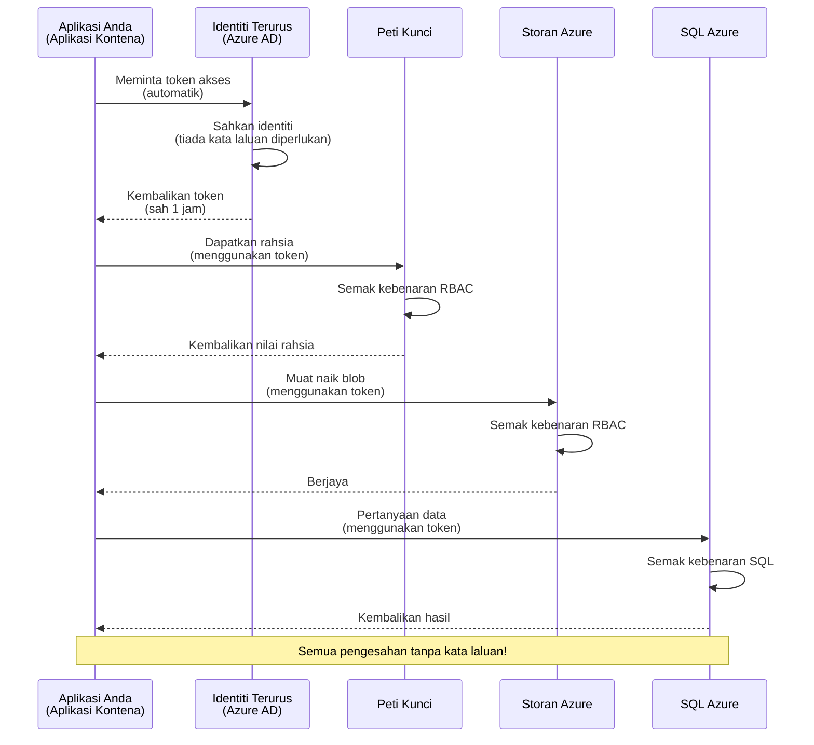
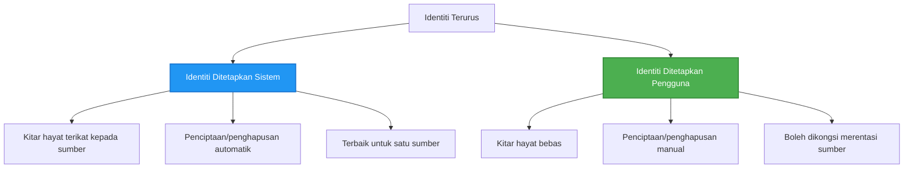

# Corak Pengesahan dan Identiti Terurus

⏱️ **Anggaran Masa**: 45-60 minit | 💰 **Kos**: Percuma (tiada caj tambahan) | ⭐ **Tahap Kesukaran**: Pertengahan

**📚 Laluan Pembelajaran:**
- ← Sebelumnya: [Pengurusan Konfigurasi](configuration.md) - Menguruskan pembolehubah persekitaran dan rahsia
- 🎯 **Anda Di Sini**: Pengesahan & Keselamatan (Identiti Terurus, Key Vault, corak keselamatan)
- → Seterusnya: [Projek Pertama](first-project.md) - Bina aplikasi AZD pertama anda
- 🏠 [Halaman Utama Kursus](../../README.md)

---

## Apa yang Anda Akan Pelajari

Dengan melengkapkan pelajaran ini, anda akan:
- Memahami corak pengesahan Azure (kunci, rentetan sambungan, identiti terurus)
- Melaksanakan **Identiti Terurus** untuk pengesahan tanpa kata laluan
- Melindungi rahsia dengan integrasi **Azure Key Vault**
- Mengkonfigurasi **role-based access control (RBAC)** untuk penyebaran AZD
- Menerapkan amalan terbaik keselamatan dalam Container Apps dan perkhidmatan Azure
- Beralih daripada pengesahan berasaskan kunci kepada berasaskan identiti

## Kenapa Identiti Terurus Penting

### Masalah: Pengesahan Tradisional

**Sebelum Identiti Terurus:**
```javascript
// ❌ RISIKO KESELAMATAN: Rahsia yang dikodkan dalam kod
const connectionString = "Server=mydb.database.windows.net;User=admin;Password=P@ssw0rd123";
const storageKey = "xK7mN9pQ2wR5tY8uI0oP3aS6dF1gH4jK...";
const cosmosKey = "C2x7B9n4M1p8Q5w3E6r0T2y5U8i1O4p7...";
```

**Masalah:**
- 🔴 **Rahsia terdedah** dalam kod, fail konfigurasi, pembolehubah persekitaran
- 🔴 **Putaran kelayakan** memerlukan perubahan kod dan penyebaran semula
- 🔴 **Mimpi buruk audit** - siapa mengakses apa, bila?
- 🔴 **Berselerak** - rahsia tersebar di pelbagai sistem
- 🔴 **Risiko pematuhan** - gagal audit keselamatan

### Penyelesaian: Identiti Terurus

**Selepas Identiti Terurus:**
```javascript
// ✅ SELAMAT: Tiada rahsia dalam kod
const credential = new DefaultAzureCredential();
const client = new BlobServiceClient(
  "https://mystorageaccount.blob.core.windows.net",
  credential  // Azure secara automatik mengendalikan pengesahan
);
```

**Manfaat:**
- ✅ **Tiada rahsia** dalam kod atau konfigurasi
- ✅ **Putaran automatik** - Azure menguruskannya
- ✅ **Jejak audit penuh** dalam log Azure AD
- ✅ **Keselamatan berpusat** - diuruskan dalam Portal Azure
- ✅ **Sedia patuh** - memenuhi piawaian keselamatan

**Analogi**: Pengesahan tradisional seperti membawa banyak kunci fizikal untuk pintu yang berbeza. Identiti Terurus seperti mempunyai kad keselamatan yang secara automatik memberikan akses berdasarkan siapa anda—tiada kunci untuk hilang, salin, atau putar.

---

## Gambaran Keseluruhan Seni Bina

### Aliran Pengesahan dengan Identiti Terurus


### Jenis Identiti Terurus


| Ciri | Sistem-Ditugaskan | Pengguna-Ditugaskan |
|------|-------------------|---------------------|
| **Kitaran Hayat** | Terikat kepada sumber | Bebas |
| **Penciptaan** | Automatik dengan sumber | Penciptaan manual |
| **Penghapusan** | Dihapuskan dengan sumber | Kekal selepas sumber dihapuskan |
| **Perkongsian** | Satu sumber sahaja | Pelbagai sumber |
| **Kes Penggunaan** | Senario mudah | Senario kompleks pelbagai sumber |
| **AZD Lalai** | ✅ Disyorkan | Pilihan |

---

## Prasyarat

### Alat Diperlukan

Anda sepatutnya telah memasang ini dari pelajaran sebelumnya:

```bash
# Sahkan Azure Developer CLI
azd version
# ✅ Dijangka: azd versi 1.0.0 atau lebih tinggi

# Sahkan Azure CLI
az --version
# ✅ Dijangka: azure-cli 2.50.0 atau lebih tinggi
```

### Keperluan Azure

- Langganan Azure aktif
- Kebenaran untuk:
  - Mencipta identiti terurus
  - Menetapkan peranan RBAC
  - Mencipta sumber Key Vault
  - Menyebarkan Container Apps

### Pengetahuan Prasyarat

Anda sepatutnya telah melengkapkan:
- [Panduan Pemasangan](installation.md) - Persediaan AZD
- [Asas AZD](azd-basics.md) - Konsep asas
- [Pengurusan Konfigurasi](configuration.md) - Pembolehubah persekitaran

---

## Pelajaran 1: Memahami Corak Pengesahan

### Corak 1: Rentetan Sambungan (Lama - Elakkan)

**Bagaimana ia berfungsi:**
```bash
# Rentetan sambungan mengandungi kelayakan
STORAGE_CONNECTION_STRING="DefaultEndpointsProtocol=https;AccountName=myaccount;AccountKey=xK7mN9pQ2wR5..."
COSMOS_CONNECTION_STRING="AccountEndpoint=https://myaccount.documents.azure.com:443/;AccountKey=C2x7..."
SQL_CONNECTION_STRING="Server=myserver.database.windows.net;User=admin;Password=P@ssw0rd..."
```

**Masalah:**
- ❌ Rahsia kelihatan dalam pembolehubah persekitaran
- ❌ Direkodkan dalam sistem penyebaran
- ❌ Sukar untuk diputar
- ❌ Tiada jejak audit akses

**Bila untuk digunakan:** Hanya untuk pembangunan tempatan, tidak pernah untuk pengeluaran.

---

### Corak 2: Rujukan Key Vault (Lebih Baik)

**Bagaimana ia berfungsi:**
```bicep
// Store secret in Key Vault
resource keyVault 'Microsoft.KeyVault/vaults@2023-02-01' = {
  name: 'mykv'
  properties: {
    enableRbacAuthorization: true
  }
}

// Reference in Container App
env: [
  {
    name: 'STORAGE_KEY'
    secretRef: 'storage-key'  // References Key Vault
  }
]
```

**Manfaat:**
- ✅ Rahsia disimpan dengan selamat dalam Key Vault
- ✅ Pengurusan rahsia berpusat
- ✅ Putaran tanpa perubahan kod

**Keterbatasan:**
- ⚠️ Masih menggunakan kunci/kata laluan
- ⚠️ Perlu menguruskan akses Key Vault

**Bila untuk digunakan:** Langkah peralihan daripada rentetan sambungan kepada identiti terurus.

---

### Corak 3: Identiti Terurus (Amalan Terbaik)

**Bagaimana ia berfungsi:**
```bicep
// Enable managed identity
resource containerApp 'Microsoft.App/containerApps@2023-05-01' = {
  name: 'myapp'
  identity: {
    type: 'SystemAssigned'  // Automatically creates identity
  }
}

// Grant permissions
resource roleAssignment 'Microsoft.Authorization/roleAssignments@2022-04-01' = {
  scope: storageAccount
  properties: {
    roleDefinitionId: storageBlobDataContributorRole
    principalId: containerApp.identity.principalId
  }
}
```

**Kod aplikasi:**
```javascript
// Tiada rahsia diperlukan!
const { DefaultAzureCredential } = require('@azure/identity');
const { BlobServiceClient } = require('@azure/storage-blob');

const credential = new DefaultAzureCredential();
const blobServiceClient = new BlobServiceClient(
  'https://mystorageaccount.blob.core.windows.net',
  credential
);
```

**Manfaat:**
- ✅ Tiada rahsia dalam kod/konfigurasi
- ✅ Putaran kelayakan automatik
- ✅ Jejak audit penuh
- ✅ Kebenaran berasaskan RBAC
- ✅ Sedia patuh

**Bila untuk digunakan:** Sentiasa, untuk aplikasi pengeluaran.

---

## Pelajaran 2: Melaksanakan Identiti Terurus dengan AZD

### Langkah-Langkah Pelaksanaan

Mari bina Container App yang selamat menggunakan identiti terurus untuk mengakses Azure Storage dan Key Vault.

### Struktur Projek

```
secure-app/
├── azure.yaml                 # AZD configuration
├── infra/
│   ├── main.bicep            # Main infrastructure
│   ├── core/
│   │   ├── identity.bicep    # Managed identity setup
│   │   ├── keyvault.bicep    # Key Vault configuration
│   │   └── storage.bicep     # Storage with RBAC
│   └── app/
│       └── container-app.bicep
└── src/
    ├── app.js                # Application code
    ├── package.json
    └── Dockerfile
```

### 1. Konfigurasi AZD (azure.yaml)

```yaml
name: secure-app
metadata:
  template: secure-app@1.0.0

services:
  api:
    project: ./src
    language: js
    host: containerapp

# Enable managed identity (AZD handles this automatically)
```

### 2. Infrastruktur: Aktifkan Identiti Terurus

**Fail: `infra/main.bicep`**

```bicep
targetScope = 'subscription'

param environmentName string
param location string = 'eastus'

var tags = { 'azd-env-name': environmentName }

// Resource group
resource rg 'Microsoft.Resources/resourceGroups@2021-04-01' = {
  name: 'rg-${environmentName}'
  location: location
  tags: tags
}

// Storage Account
module storage './core/storage.bicep' = {
  name: 'storage'
  scope: rg
  params: {
    name: 'st${uniqueString(rg.id)}'
    location: location
    tags: tags
  }
}

// Key Vault
module keyVault './core/keyvault.bicep' = {
  name: 'keyvault'
  scope: rg
  params: {
    name: 'kv-${uniqueString(rg.id)}'
    location: location
    tags: tags
  }
}

// Container App with Managed Identity
module containerApp './app/container-app.bicep' = {
  name: 'container-app'
  scope: rg
  params: {
    name: 'ca-${environmentName}'
    location: location
    tags: tags
    storageAccountName: storage.outputs.name
    keyVaultName: keyVault.outputs.name
  }
}

// Grant Container App access to Storage
module storageRoleAssignment './core/role-assignment.bicep' = {
  name: 'storage-role'
  scope: rg
  params: {
    principalId: containerApp.outputs.identityPrincipalId
    roleDefinitionId: 'ba92f5b4-2d11-453d-a403-e96b0029c9fe'  // Storage Blob Data Contributor
    targetResourceId: storage.outputs.id
  }
}

// Grant Container App access to Key Vault
module kvRoleAssignment './core/role-assignment.bicep' = {
  name: 'kv-role'
  scope: rg
  params: {
    principalId: containerApp.outputs.identityPrincipalId
    roleDefinitionId: '4633458b-17de-408a-b874-0445c86b69e6'  // Key Vault Secrets User
    targetResourceId: keyVault.outputs.id
  }
}

// Outputs
output AZURE_STORAGE_ACCOUNT_NAME string = storage.outputs.name
output AZURE_KEY_VAULT_NAME string = keyVault.outputs.name
output APP_URL string = containerApp.outputs.url
```

### 3. Container App dengan Identiti Sistem-Ditugaskan

**Fail: `infra/app/container-app.bicep`**

```bicep
param name string
param location string
param tags object = {}
param storageAccountName string
param keyVaultName string

resource containerApp 'Microsoft.App/containerApps@2023-05-01' = {
  name: name
  location: location
  tags: tags
  identity: {
    type: 'SystemAssigned'  // 🔑 Enable managed identity
  }
  properties: {
    configuration: {
      ingress: {
        external: true
        targetPort: 3000
      }
    }
    template: {
      containers: [
        {
          name: 'api'
          image: 'myregistry.azurecr.io/api:latest'
          resources: {
            cpu: json('0.5')
            memory: '1Gi'
          }
          env: [
            {
              name: 'AZURE_STORAGE_ACCOUNT_NAME'
              value: storageAccountName
            }
            {
              name: 'AZURE_KEY_VAULT_NAME'
              value: keyVaultName
            }
            // 🔑 No secrets - managed identity handles authentication!
          ]
        }
      ]
    }
  }
}

// Output the identity for RBAC assignments
output identityPrincipalId string = containerApp.identity.principalId
output id string = containerApp.id
output url string = 'https://${containerApp.properties.configuration.ingress.fqdn}'
```

### 4. Modul Penetapan Peranan RBAC

**Fail: `infra/core/role-assignment.bicep`**

```bicep
param principalId string
param roleDefinitionId string  // Azure built-in role ID
param targetResourceId string

resource roleAssignment 'Microsoft.Authorization/roleAssignments@2022-04-01' = {
  name: guid(principalId, roleDefinitionId, targetResourceId)
  scope: resourceId('Microsoft.Resources/resourceGroups', resourceGroup().name)
  properties: {
    roleDefinitionId: subscriptionResourceId('Microsoft.Authorization/roleDefinitions', roleDefinitionId)
    principalId: principalId
    principalType: 'ServicePrincipal'
  }
}

output id string = roleAssignment.id
```

### 5. Kod Aplikasi dengan Identiti Terurus

**Fail: `src/app.js`**

```javascript
const express = require('express');
const { DefaultAzureCredential } = require('@azure/identity');
const { BlobServiceClient } = require('@azure/storage-blob');
const { SecretClient } = require('@azure/keyvault-secrets');

const app = express();
const PORT = process.env.PORT || 3000;

// 🔑 Inisialisasi kelayakan (berfungsi secara automatik dengan identiti terurus)
const credential = new DefaultAzureCredential();

// Tetapan Azure Storage
const storageAccountName = process.env.AZURE_STORAGE_ACCOUNT_NAME;
const blobServiceClient = new BlobServiceClient(
  `https://${storageAccountName}.blob.core.windows.net`,
  credential  // Tiada kunci diperlukan!
);

// Tetapan Key Vault
const keyVaultName = process.env.AZURE_KEY_VAULT_NAME;
const secretClient = new SecretClient(
  `https://${keyVaultName}.vault.azure.net`,
  credential  // Tiada kunci diperlukan!
);

// Pemeriksaan kesihatan
app.get('/health', (req, res) => {
  res.json({ status: 'healthy', authentication: 'managed-identity' });
});

// Muat naik fail ke storan blob
app.post('/upload', async (req, res) => {
  try {
    const containerClient = blobServiceClient.getContainerClient('uploads');
    await containerClient.createIfNotExists();
    
    const blobName = `file-${Date.now()}.txt`;
    const blockBlobClient = containerClient.getBlockBlobClient(blobName);
    
    await blockBlobClient.upload('Hello from managed identity!', 30);
    
    res.json({
      success: true,
      blobName: blobName,
      message: 'File uploaded using managed identity!'
    });
  } catch (error) {
    console.error('Upload error:', error);
    res.status(500).json({ error: error.message });
  }
});

// Dapatkan rahsia dari Key Vault
app.get('/secret/:name', async (req, res) => {
  try {
    const secretName = req.params.name;
    const secret = await secretClient.getSecret(secretName);
    
    res.json({
      name: secretName,
      value: secret.value,
      message: 'Secret retrieved using managed identity!'
    });
  } catch (error) {
    console.error('Secret error:', error);
    res.status(500).json({ error: error.message });
  }
});

// Senaraikan bekas blob (menunjukkan akses bacaan)
app.get('/containers', async (req, res) => {
  try {
    const containers = [];
    for await (const container of blobServiceClient.listContainers()) {
      containers.push(container.name);
    }
    
    res.json({
      containers: containers,
      count: containers.length,
      message: 'Containers listed using managed identity!'
    });
  } catch (error) {
    console.error('List error:', error);
    res.status(500).json({ error: error.message });
  }
});

app.listen(PORT, () => {
  console.log(`Secure API listening on port ${PORT}`);
  console.log('Authentication: Managed Identity (passwordless)');
});
```

**Fail: `src/package.json`**

```json
{
  "name": "secure-app",
  "version": "1.0.0",
  "dependencies": {
    "express": "^4.18.2",
    "@azure/identity": "^4.0.0",
    "@azure/storage-blob": "^12.17.0",
    "@azure/keyvault-secrets": "^4.7.0"
  },
  "scripts": {
    "start": "node app.js"
  }
}
```

### 6. Penyebaran dan Ujian

```bash
# Inisialisasi persekitaran AZD
azd init

# Sebarkan infrastruktur dan aplikasi
azd up

# Dapatkan URL aplikasi
APP_URL=$(azd env get-values | grep APP_URL | cut -d '=' -f2 | tr -d '"')

# Uji pemeriksaan kesihatan
curl $APP_URL/health
```

**✅ Output dijangka:**
```json
{
  "status": "healthy",
  "authentication": "managed-identity"
}
```

**Ujian muat naik blob:**
```bash
curl -X POST $APP_URL/upload
```

**✅ Output dijangka:**
```json
{
  "success": true,
  "blobName": "file-1700404800000.txt",
  "message": "File uploaded using managed identity!"
}
```

**Ujian senarai kontena:**
```bash
curl $APP_URL/containers
```

**✅ Output dijangka:**
```json
{
  "containers": ["uploads"],
  "count": 1,
  "message": "Containers listed using managed identity!"
}
```

---

## Peranan RBAC Azure Biasa

### ID Peranan Terbina Dalam untuk Identiti Terurus

| Perkhidmatan | Nama Peranan | ID Peranan | Kebenaran |
|--------------|--------------|------------|-----------|
| **Storage** | Storage Blob Data Reader | `2a2b9908-6b94-4a3d-8e5a-a7d8f8cc8a12` | Membaca blob dan kontena |
| **Storage** | Storage Blob Data Contributor | `ba92f5b4-2d11-453d-a403-e96b0029c9fe` | Membaca, menulis, memadam blob |
| **Storage** | Storage Queue Data Contributor | `974c5e8b-45b9-4653-ba55-5f855dd0fb88` | Membaca, menulis, memadam mesej barisan |
| **Key Vault** | Key Vault Secrets User | `4633458b-17de-408a-b874-0445c86b69e6` | Membaca rahsia |
| **Key Vault** | Key Vault Secrets Officer | `b86a8fe4-44ce-4948-aee5-eccb2c155cd7` | Membaca, menulis, memadam rahsia |
| **Cosmos DB** | Cosmos DB Built-in Data Reader | `00000000-0000-0000-0000-000000000001` | Membaca data Cosmos DB |
| **Cosmos DB** | Cosmos DB Built-in Data Contributor | `00000000-0000-0000-0000-000000000002` | Membaca, menulis data Cosmos DB |
| **SQL Database** | SQL DB Contributor | `9b7fa17d-e63e-47b0-bb0a-15c516ac86ec` | Menguruskan pangkalan data SQL |
| **Service Bus** | Azure Service Bus Data Owner | `090c5cfd-751d-490a-894a-3ce6f1109419` | Menghantar, menerima, mengurus mesej |

### Cara Mencari ID Peranan

```bash
# Senaraikan semua peranan terbina dalam
az role definition list --query "[].{Name:roleName, ID:name}" --output table

# Cari peranan tertentu
az role definition list --query "[?contains(roleName, 'Storage Blob')].{Name:roleName, ID:name}" --output table

# Dapatkan butiran peranan
az role definition list --name "Storage Blob Data Contributor"
```

---

## Latihan Praktikal

### Latihan 1: Aktifkan Identiti Terurus untuk Aplikasi Sedia Ada ⭐⭐ (Sederhana)

**Matlamat**: Tambah identiti terurus kepada penyebaran Container App sedia ada

**Senario**: Anda mempunyai Container App yang menggunakan rentetan sambungan. Tukarkannya kepada identiti terurus.

**Titik Permulaan**: Container App dengan konfigurasi ini:

```bicep
// ❌ Current: Using connection string
env: [
  {
    name: 'STORAGE_CONNECTION_STRING'
    secretRef: 'storage-connection'
  }
]
```

**Langkah-Langkah**:

1. **Aktifkan identiti terurus dalam Bicep:**

```bicep
resource containerApp 'Microsoft.App/containerApps@2023-05-01' = {
  name: 'myapp'
  identity: {
    type: 'SystemAssigned'  // Add this
  }
  // ... rest of configuration
}
```

2. **Berikan akses Storage:**

```bicep
// Get storage account reference
resource storageAccount 'Microsoft.Storage/storageAccounts@2023-01-01' existing = {
  name: storageAccountName
}

// Assign role
resource roleAssignment 'Microsoft.Authorization/roleAssignments@2022-04-01' = {
  name: guid(containerApp.id, 'ba92f5b4-2d11-453d-a403-e96b0029c9fe', storageAccount.id)
  scope: storageAccount
  properties: {
    roleDefinitionId: subscriptionResourceId('Microsoft.Authorization/roleDefinitions', 'ba92f5b4-2d11-453d-a403-e96b0029c9fe')
    principalId: containerApp.identity.principalId
    principalType: 'ServicePrincipal'
  }
}
```

3. **Kemas kini kod aplikasi:**

**Sebelum (rentetan sambungan):**
```javascript
const { BlobServiceClient } = require('@azure/storage-blob');

const blobServiceClient = BlobServiceClient.fromConnectionString(
  process.env.STORAGE_CONNECTION_STRING
);
```

**Selepas (identiti terurus):**
```javascript
const { DefaultAzureCredential } = require('@azure/identity');
const { BlobServiceClient } = require('@azure/storage-blob');

const credential = new DefaultAzureCredential();
const blobServiceClient = new BlobServiceClient(
  `https://${process.env.STORAGE_ACCOUNT_NAME}.blob.core.windows.net`,
  credential
);
```

4. **Kemas kini pembolehubah persekitaran:**

```bicep
env: [
  {
    name: 'STORAGE_ACCOUNT_NAME'
    value: storageAccountName  // Just the name, no secrets!
  }
  // Remove STORAGE_CONNECTION_STRING
]
```

5. **Sebarkan dan uji:**

```bash
# Susun semula
azd up

# Uji bahawa ia masih berfungsi
curl https://myapp.azurecontainerapps.io/upload
```

**✅ Kriteria Kejayaan:**
- ✅ Aplikasi disebarkan tanpa ralat
- ✅ Operasi Storage berfungsi (muat naik, senarai, muat turun)
- ✅ Tiada rentetan sambungan dalam pembolehubah persekitaran
- ✅ Identiti kelihatan dalam Portal Azure di bawah tab "Identity"

**Pengesahan:**

```bash
# Periksa identiti terurus diaktifkan
az containerapp show \
  --name myapp \
  --resource-group rg-myapp \
  --query "identity.type"
# ✅ Dijangka: "SystemAssigned"

# Periksa penugasan peranan
az role assignment list \
  --assignee $(az containerapp show --name myapp --resource-group rg-myapp --query "identity.principalId" -o tsv) \
  --scope /subscriptions/{sub-id}/resourceGroups/rg-myapp/providers/Microsoft.Storage/storageAccounts/mystorageaccount
# ✅ Dijangka: Menunjukkan peranan "Storage Blob Data Contributor"
```

**Masa**: 20-30 minit

---

### Latihan 2: Akses Pelbagai Perkhidmatan dengan Identiti Pengguna-Ditugaskan ⭐⭐⭐ (Lanjutan)

**Matlamat**: Cipta identiti pengguna-ditugaskan yang dikongsi di pelbagai Container Apps

**Senario**: Anda mempunyai 3 perkhidmatan mikro yang semuanya memerlukan akses kepada akaun Storage dan Key Vault yang sama.

**Langkah-Langkah**:

1. **Cipta identiti pengguna-ditugaskan:**

**Fail: `infra/core/identity.bicep`**

```bicep
param name string
param location string
param tags object = {}

resource userAssignedIdentity 'Microsoft.ManagedIdentity/userAssignedIdentities@2023-01-31' = {
  name: name
  location: location
  tags: tags
}

output id string = userAssignedIdentity.id
output principalId string = userAssignedIdentity.properties.principalId
output clientId string = userAssignedIdentity.properties.clientId
```

2. **Tetapkan peranan kepada identiti pengguna-ditugaskan:**

```bicep
// In main.bicep
module userIdentity './core/identity.bicep' = {
  name: 'user-identity'
  scope: rg
  params: {
    name: 'id-${environmentName}'
    location: location
    tags: tags
  }
}

// Grant Storage access
resource storageRoleAssignment 'Microsoft.Authorization/roleAssignments@2022-04-01' = {
  name: guid(userIdentity.outputs.principalId, 'storage-contributor')
  scope: storageAccount
  properties: {
    roleDefinitionId: subscriptionResourceId('Microsoft.Authorization/roleDefinitions', 'ba92f5b4-2d11-453d-a403-e96b0029c9fe')
    principalId: userIdentity.outputs.principalId
    principalType: 'ServicePrincipal'
  }
}

// Grant Key Vault access
resource kvRoleAssignment 'Microsoft.Authorization/roleAssignments@2022-04-01' = {
  name: guid(userIdentity.outputs.principalId, 'kv-secrets-user')
  scope: keyVault
  properties: {
    roleDefinitionId: subscriptionResourceId('Microsoft.Authorization/roleDefinitions', '4633458b-17de-408a-b874-0445c86b69e6')
    principalId: userIdentity.outputs.principalId
    principalType: 'ServicePrincipal'
  }
}
```

3. **Tetapkan identiti kepada pelbagai Container Apps:**

```bicep
resource apiGateway 'Microsoft.App/containerApps@2023-05-01' = {
  name: 'api-gateway'
  identity: {
    type: 'UserAssigned'
    userAssignedIdentities: {
      '${userIdentity.outputs.id}': {}
    }
  }
  // ... rest of config
}

resource productService 'Microsoft.App/containerApps@2023-05-01' = {
  name: 'product-service'
  identity: {
    type: 'UserAssigned'
    userAssignedIdentities: {
      '${userIdentity.outputs.id}': {}
    }
  }
  // ... rest of config
}

resource orderService 'Microsoft.App/containerApps@2023-05-01' = {
  name: 'order-service'
  identity: {
    type: 'UserAssigned'
    userAssignedIdentities: {
      '${userIdentity.outputs.id}': {}
    }
  }
  // ... rest of config
}
```

4. **Kod aplikasi (semua perkhidmatan menggunakan corak yang sama):**

```javascript
const { DefaultAzureCredential, ManagedIdentityCredential } = require('@azure/identity');

// Untuk identiti yang ditetapkan pengguna, nyatakan ID klien
const credential = new ManagedIdentityCredential(
  process.env.AZURE_CLIENT_ID  // ID klien identiti yang ditetapkan pengguna
);

// Atau gunakan DefaultAzureCredential (mengesan secara automatik)
const credential = new DefaultAzureCredential();

const blobServiceClient = new BlobServiceClient(
  `https://${process.env.STORAGE_ACCOUNT_NAME}.blob.core.windows.net`,
  credential
);
```

5. **Sebarkan dan sahkan:**

```bash
azd up

# Uji semua perkhidmatan boleh mengakses storan
curl https://api-gateway.azurecontainerapps.io/upload
curl https://product-service.azurecontainerapps.io/upload
curl https://order-service.azurecontainerapps.io/upload
```

**✅ Kriteria Kejayaan:**
- ✅ Satu identiti dikongsi di 3 perkhidmatan
- ✅ Semua perkhidmatan boleh mengakses Storage dan Key Vault
- ✅ Identiti kekal jika anda memadamkan satu perkhidmatan
- ✅ Pengurusan kebenaran berpusat

**Manfaat Identiti Pengguna-Ditugaskan:**
- Satu identiti untuk diuruskan
- Kebenaran konsisten di semua perkhidmatan
- Kekal walaupun perkhidmatan dipadamkan
- Lebih baik untuk seni bina kompleks

**Masa**: 30-40 minit

---

### Latihan 3: Laksanakan Putaran Rahsia Key Vault ⭐⭐⭐ (Lanjutan)

**Matlamat**: Simpan kunci API pihak ketiga dalam Key Vault dan akses menggunakan identiti terurus

**Senario**: Aplikasi anda perlu memanggil API luaran (OpenAI, Stripe, SendGrid) yang memerlukan kunci API.

**Langkah-Langkah**:

1. **Cipta Key Vault dengan RBAC:**

**Fail: `infra/core/keyvault.bicep`**

```bicep
param name string
param location string
param tags object = {}

resource keyVault 'Microsoft.KeyVault/vaults@2023-02-01' = {
  name: name
  location: location
  tags: tags
  properties: {
    enableRbacAuthorization: true  // Use RBAC instead of access policies
    sku: {
      family: 'A'
      name: 'standard'
    }
    tenantId: subscription().tenantId
    enableSoftDelete: true
    softDeleteRetentionInDays: 90
  }
}

// Allow Container App to read secrets
output id string = keyVault.id
output name string = keyVault.name
output uri string = keyVault.properties.vaultUri
```

2. **Simpan rahsia dalam Key Vault:**

```bash
# Dapatkan nama Key Vault
KV_NAME=$(azd env get-values | grep AZURE_KEY_VAULT_NAME | cut -d '=' -f2 | tr -d '"')

# Simpan kunci API pihak ketiga
az keyvault secret set \
  --vault-name $KV_NAME \
  --name "OpenAI-ApiKey" \
  --value "sk-proj-xxxxxxxxxxxxx"

az keyvault secret set \
  --vault-name $KV_NAME \
  --name "Stripe-ApiKey" \
  --value "sk_live_xxxxxxxxxxxxx"

az keyvault secret set \
  --vault-name $KV_NAME \
  --name "SendGrid-ApiKey" \
  --value "SG.xxxxxxxxxxxxx"
```

3. **Kod aplikasi untuk mendapatkan rahsia:**

**Fail: `src/config.js`**

```javascript
const { DefaultAzureCredential } = require('@azure/identity');
const { SecretClient } = require('@azure/keyvault-secrets');

class Config {
  constructor() {
    this.credential = new DefaultAzureCredential();
    this.secretClient = new SecretClient(
      `https://${process.env.AZURE_KEY_VAULT_NAME}.vault.azure.net`,
      this.credential
    );
    this.cache = {};
  }

  async getSecret(secretName) {
    // Periksa cache terlebih dahulu
    if (this.cache[secretName]) {
      return this.cache[secretName];
    }

    try {
      const secret = await this.secretClient.getSecret(secretName);
      this.cache[secretName] = secret.value;
      console.log(`✅ Retrieved secret: ${secretName}`);
      return secret.value;
    } catch (error) {
      console.error(`❌ Failed to get secret ${secretName}:`, error.message);
      throw error;
    }
  }

  async getOpenAIKey() {
    return this.getSecret('OpenAI-ApiKey');
  }

  async getStripeKey() {
    return this.getSecret('Stripe-ApiKey');
  }

  async getSendGridKey() {
    return this.getSecret('SendGrid-ApiKey');
  }
}

module.exports = new Config();
```

4. **Gunakan rahsia dalam aplikasi:**

**Fail: `src/app.js`**

```javascript
const express = require('express');
const config = require('./config');
const { OpenAI } = require('openai');

const app = express();

// Inisialisasi OpenAI dengan kunci dari Key Vault
let openaiClient;

async function initializeServices() {
  const openaiKey = await config.getOpenAIKey();
  openaiClient = new OpenAI({ apiKey: openaiKey });
  console.log('✅ Services initialized with secrets from Key Vault');
}

// Panggil semasa permulaan
initializeServices().catch(console.error);

app.post('/chat', async (req, res) => {
  try {
    const completion = await openaiClient.chat.completions.create({
      model: 'gpt-4',
      messages: [{ role: 'user', content: 'Hello!' }]
    });
    
    res.json({
      response: completion.choices[0].message.content,
      authentication: 'Key from Key Vault via Managed Identity'
    });
  } catch (error) {
    res.status(500).json({ error: error.message });
  }
});

app.listen(3000, () => {
  console.log('Secure API with Key Vault integration running');
});
```

5. **Sebarkan dan uji:**

```bash
azd up

# Uji bahawa kunci API berfungsi
curl -X POST https://myapp.azurecontainerapps.io/chat \
  -H "Content-Type: application/json" \
  -d '{"message":"Hello AI"}'
```

**✅ Kriteria Kejayaan:**
- ✅ Tiada kunci API dalam kod atau pembolehubah persekitaran
- ✅ Aplikasi mendapatkan kunci dari Key Vault
- ✅ API pihak ketiga berfungsi dengan betul
- ✅ Boleh memutar kunci tanpa perubahan kod

**Putar rahsia:**

```bash
# Kemas kini rahsia dalam Key Vault
az keyvault secret set \
  --vault-name $KV_NAME \
  --name "OpenAI-ApiKey" \
  --value "sk-proj-NEW_KEY_HERE"

# Mulakan semula aplikasi untuk mengambil kunci baharu
az containerapp revision restart \
  --name myapp \
  --resource-group rg-myapp
```

**Masa**: 25-35 minit

---

## Titik Pemeriksaan Pengetahuan

### 1. Corak Pengesahan ✓

Uji pemahaman anda:

- [ ] **S1**: Apakah tiga corak pengesahan utama? 
  - **J**: Rentetan sambungan (lama), rujukan Key Vault (peralihan), Identiti Terurus (terbaik)

- [ ] **S2**: Kenapa identiti terurus lebih baik daripada rentetan sambungan?
  - **J**: Tiada rahsia dalam kod, putaran automatik, jejak audit penuh, kebenaran RBAC

- [ ] **S3**: Bila anda akan menggunakan identiti pengguna-ditugaskan dan bukannya sistem-ditugaskan?
  - **J**: Apabila berkongsi identiti di pelbagai sumber atau apabila kitaran hayat identiti bebas daripada kitaran hayat sumber

**Pengesahan Praktikal:**
```bash
# Periksa jenis identiti yang digunakan oleh aplikasi anda
az containerapp show \
  --name myapp \
  --resource-group rg-myapp \
  --query "identity.type"

# Senaraikan semua tugasan peranan untuk identiti
az role assignment list \
  --assignee $(az containerapp show --name myapp --resource-group rg-myapp --query "identity.principalId" -o tsv)
```

---

### 2. RBAC dan Kebenaran ✓

Uji pemahaman anda:

- [ ] **S1**: Apakah ID peranan untuk "Storage Blob Data Contributor"?
  - **J**: `ba92f5b4-2d11-453d-a403-e96b0029c9fe`

- [ ] **S2**: Apakah kebenaran yang diberikan oleh "Key Vault Secrets User"?
  - **J**: Akses baca sahaja kepada rahsia (tidak boleh mencipta, mengemas kini, atau memadam)

- [ ] **S3**: Bagaimana anda memberikan Container App akses kepada Azure SQL?
  - **J**: Tetapkan peranan "SQL DB Contributor" atau konfigurasikan pengesahan Azure AD untuk SQL

**Pengesahan Praktikal:**
```bash
# Cari peranan tertentu
az role definition list --name "Storage Blob Data Contributor"

# Semak peranan yang diberikan kepada identiti anda
PRINCIPAL_ID=$(az containerapp show --name myapp --resource-group rg-myapp --query "identity.principalId" -o tsv)
az role assignment list --assignee $PRINCIPAL_ID --output table
```

---

### 3. Integrasi Key Vault ✓

Uji pemahaman anda:
- [ ] **S1**: Bagaimana anda mengaktifkan RBAC untuk Key Vault dan bukannya menggunakan polisi akses?
  - **J**: Tetapkan `enableRbacAuthorization: true` dalam Bicep

- [ ] **S2**: Perpustakaan SDK Azure mana yang mengendalikan pengesahan identiti terurus?
  - **J**: `@azure/identity` dengan kelas `DefaultAzureCredential`

- [ ] **S3**: Berapa lama rahsia Key Vault disimpan dalam cache?
  - **J**: Bergantung pada aplikasi; laksanakan strategi cache anda sendiri

**Pengesahan Praktikal:**
```bash
# Uji akses Key Vault
az keyvault secret show \
  --vault-name $KV_NAME \
  --name "OpenAI-ApiKey" \
  --query "value"

# Periksa RBAC diaktifkan
az keyvault show \
  --name $KV_NAME \
  --query "properties.enableRbacAuthorization"
# ✅ Dijangka: benar
```

---

## Amalan Terbaik Keselamatan

### ✅ LAKUKAN:

1. **Sentiasa gunakan identiti terurus dalam pengeluaran**
   ```bicep
   identity: {
     type: 'SystemAssigned'
   }
   ```

2. **Gunakan peranan RBAC dengan keistimewaan paling minimum**
   - Gunakan peranan "Reader" jika boleh
   - Elakkan "Owner" atau "Contributor" kecuali perlu

3. **Simpan kunci pihak ketiga dalam Key Vault**
   ```javascript
   const apiKey = await secretClient.getSecret('ThirdPartyApiKey');
   ```

4. **Aktifkan log audit**
   ```bicep
   diagnosticSettings: {
     logs: [{ category: 'AuditEvent', enabled: true }]
   }
   ```

5. **Gunakan identiti berbeza untuk dev/staging/prod**
   ```bash
   azd env new dev
   azd env new staging
   azd env new prod
   ```

6. **Putarkan rahsia secara berkala**
   - Tetapkan tarikh luput pada rahsia Key Vault
   - Automasi putaran dengan Azure Functions

### ❌ JANGAN:

1. **Jangan sekali-kali kodkan rahsia secara keras**
   ```javascript
   // ❌ BURUK
   const apiKey = "sk-proj-xxxxxxxxxxxxx";
   ```

2. **Jangan gunakan rentetan sambungan dalam pengeluaran**
   ```javascript
   // ❌ BURUK
   BlobServiceClient.fromConnectionString(process.env.STORAGE_CONNECTION_STRING)
   ```

3. **Jangan berikan kebenaran yang berlebihan**
   ```bicep
   // ❌ BAD - too much access
   roleDefinitionId: 'Owner'
   
   // ✅ GOOD - least privilege
   roleDefinitionId: 'Storage Blob Data Reader'
   ```

4. **Jangan log rahsia**
   ```javascript
   // ❌ BURUK
   console.log('API Key:', apiKey);
   
   // ✅ BAIK
   console.log('API Key retrieved successfully');
   ```

5. **Jangan kongsi identiti pengeluaran di antara persekitaran**
   ```bicep
   // ❌ BAD - same identity for dev and prod
   // ✅ GOOD - separate identities per environment
   ```

---

## Panduan Penyelesaian Masalah

### Masalah: "Unauthorized" semasa mengakses Azure Storage

**Gejala:**
```
Error: Unauthorized (403)
AuthorizationPermissionMismatch: This request is not authorized to perform this operation
```

**Diagnosis:**

```bash
# Periksa jika identiti terurus diaktifkan
az containerapp show \
  --name myapp \
  --resource-group rg-myapp \
  --query "identity.type"
# ✅ Dijangka: "SystemAssigned" atau "UserAssigned"

# Periksa tugasan peranan
PRINCIPAL_ID=$(az containerapp show --name myapp --resource-group rg-myapp --query "identity.principalId" -o tsv)
az role assignment list --assignee $PRINCIPAL_ID

# Dijangka: Harus melihat "Storage Blob Data Contributor" atau peranan serupa
```

**Penyelesaian:**

1. **Berikan peranan RBAC yang betul:**
```bash
STORAGE_ID=$(az storage account show --name mystorageaccount --resource-group rg-myapp --query "id" -o tsv)
az role assignment create \
  --assignee $PRINCIPAL_ID \
  --role "Storage Blob Data Contributor" \
  --scope $STORAGE_ID
```

2. **Tunggu propagasi (boleh mengambil masa 5-10 minit):**
```bash
# Periksa status penugasan peranan
az role assignment list --assignee $PRINCIPAL_ID --scope $STORAGE_ID
```

3. **Sahkan kod aplikasi menggunakan kelayakan yang betul:**
```javascript
// Pastikan anda menggunakan DefaultAzureCredential
const credential = new DefaultAzureCredential();
```

---

### Masalah: Akses Key Vault ditolak

**Gejala:**
```
Error: Forbidden (403)
The user, group or application does not have secrets get permission
```

**Diagnosis:**

```bash
# Periksa RBAC Key Vault diaktifkan
az keyvault show \
  --name $KV_NAME \
  --query "properties.enableRbacAuthorization"
# ✅ Dijangka: benar

# Periksa tugasan peranan
az role assignment list \
  --assignee $PRINCIPAL_ID \
  --scope /subscriptions/{sub-id}/resourceGroups/rg-myapp/providers/Microsoft.KeyVault/vaults/$KV_NAME
```

**Penyelesaian:**

1. **Aktifkan RBAC pada Key Vault:**
```bash
az keyvault update \
  --name $KV_NAME \
  --enable-rbac-authorization true
```

2. **Berikan peranan Key Vault Secrets User:**
```bash
KV_ID=$(az keyvault show --name $KV_NAME --query "id" -o tsv)
az role assignment create \
  --assignee $PRINCIPAL_ID \
  --role "Key Vault Secrets User" \
  --scope $KV_ID
```

---

### Masalah: DefaultAzureCredential gagal secara tempatan

**Gejala:**
```
Error: DefaultAzureCredential failed to retrieve a token
CredentialUnavailableError: No credential available
```

**Diagnosis:**

```bash
# Periksa jika anda telah log masuk
az account show

# Periksa pengesahan Azure CLI
az ad signed-in-user show
```

**Penyelesaian:**

1. **Log masuk ke Azure CLI:**
```bash
az login
```

2. **Tetapkan langganan Azure:**
```bash
az account set --subscription "Your Subscription Name"
```

3. **Untuk pembangunan tempatan, gunakan pembolehubah persekitaran:**
```bash
export AZURE_TENANT_ID="your-tenant-id"
export AZURE_CLIENT_ID="your-client-id"
export AZURE_CLIENT_SECRET="your-client-secret"
```

4. **Atau gunakan kelayakan berbeza secara tempatan:**
```javascript
const { DefaultAzureCredential, AzureCliCredential } = require('@azure/identity');

// Gunakan AzureCliCredential untuk pembangunan tempatan
const credential = process.env.NODE_ENV === 'production' 
  ? new DefaultAzureCredential()
  : new AzureCliCredential();
```

---

### Masalah: Penugasan peranan mengambil masa terlalu lama untuk dipropagasi

**Gejala:**
- Peranan berjaya ditugaskan
- Masih mendapat ralat 403
- Akses berselang-seli (kadang-kadang berfungsi, kadang-kadang tidak)

**Penjelasan:**
Perubahan RBAC Azure boleh mengambil masa 5-10 minit untuk dipropagasi secara global.

**Penyelesaian:**

```bash
# Tunggu dan cuba semula
echo "Waiting for RBAC propagation..."
sleep 300  # Tunggu 5 minit

# Uji akses
curl https://myapp.azurecontainerapps.io/upload

# Jika masih gagal, mulakan semula aplikasi
az containerapp revision restart \
  --name myapp \
  --resource-group rg-myapp
```

---

## Pertimbangan Kos

### Kos Identiti Terurus

| Sumber | Kos |
|--------|-----|
| **Identiti Terurus** | 🆓 **PERCUMA** - Tiada caj |
| **Penugasan Peranan RBAC** | 🆓 **PERCUMA** - Tiada caj |
| **Permintaan Token Azure AD** | 🆓 **PERCUMA** - Termasuk |
| **Operasi Key Vault** | $0.03 setiap 10,000 operasi |
| **Penyimpanan Key Vault** | $0.024 setiap rahsia setiap bulan |

**Identiti terurus menjimatkan wang dengan:**
- ✅ Menghapuskan operasi Key Vault untuk pengesahan perkhidmatan-ke-perkhidmatan
- ✅ Mengurangkan insiden keselamatan (tiada kelayakan bocor)
- ✅ Mengurangkan beban operasi (tiada putaran manual)

**Perbandingan Kos Contoh (bulanan):**

| Senario | Rentetan Sambungan | Identiti Terurus | Penjimatan |
|---------|--------------------|------------------|------------|
| Aplikasi kecil (1M permintaan) | ~$50 (Key Vault + operasi) | ~$0 | $50/bulan |
| Aplikasi sederhana (10M permintaan) | ~$200 | ~$0 | $200/bulan |
| Aplikasi besar (100M permintaan) | ~$1,500 | ~$0 | $1,500/bulan |

---

## Ketahui Lebih Lanjut

### Dokumentasi Rasmi
- [Azure Managed Identity](https://learn.microsoft.com/entra/identity/managed-identities-azure-resources/overview)
- [Azure RBAC](https://learn.microsoft.com/azure/role-based-access-control/overview)
- [Azure Key Vault](https://learn.microsoft.com/azure/key-vault/general/overview)
- [DefaultAzureCredential](https://learn.microsoft.com/dotnet/api/azure.identity.defaultazurecredential)

### Dokumentasi SDK
- [@azure/identity (Node.js)](https://www.npmjs.com/package/@azure/identity)
- [Azure.Identity (C#)](https://www.nuget.org/packages/Azure.Identity/)
- [azure-identity (Python)](https://pypi.org/project/azure-identity/)

### Langkah Seterusnya dalam Kursus Ini
- ← Sebelumnya: [Pengurusan Konfigurasi](configuration.md)
- → Seterusnya: [Projek Pertama](first-project.md)
- 🏠 [Halaman Utama Kursus](../../README.md)

### Contoh Berkaitan
- [Contoh Azure OpenAI Chat](../../../../examples/azure-openai-chat) - Menggunakan identiti terurus untuk Azure OpenAI
- [Contoh Mikroservis](../../../../examples/microservices) - Corak pengesahan pelbagai perkhidmatan

---

## Ringkasan

**Anda telah mempelajari:**
- ✅ Tiga corak pengesahan (rentetan sambungan, Key Vault, identiti terurus)
- ✅ Cara mengaktifkan dan mengkonfigurasi identiti terurus dalam AZD
- ✅ Penugasan peranan RBAC untuk perkhidmatan Azure
- ✅ Integrasi Key Vault untuk rahsia pihak ketiga
- ✅ Identiti yang ditugaskan pengguna vs yang ditugaskan sistem
- ✅ Amalan terbaik keselamatan dan penyelesaian masalah

**Perkara Penting:**
1. **Sentiasa gunakan identiti terurus dalam pengeluaran** - Tiada rahsia, putaran automatik
2. **Gunakan peranan RBAC dengan keistimewaan paling minimum** - Berikan hanya kebenaran yang diperlukan
3. **Simpan kunci pihak ketiga dalam Key Vault** - Pengurusan rahsia berpusat
4. **Asingkan identiti mengikut persekitaran** - Pengasingan dev, staging, prod
5. **Aktifkan log audit** - Jejak siapa yang mengakses apa

**Langkah Seterusnya:**
1. Lengkapkan latihan praktikal di atas
2. Migrasikan aplikasi sedia ada daripada rentetan sambungan ke identiti terurus
3. Bina projek AZD pertama anda dengan keselamatan dari hari pertama: [Projek Pertama](first-project.md)

---

<!-- CO-OP TRANSLATOR DISCLAIMER START -->
**Penafian**:  
Dokumen ini telah diterjemahkan menggunakan perkhidmatan terjemahan AI [Co-op Translator](https://github.com/Azure/co-op-translator). Walaupun kami berusaha untuk ketepatan, sila ambil perhatian bahawa terjemahan automatik mungkin mengandungi kesilapan atau ketidaktepatan. Dokumen asal dalam bahasa asalnya harus dianggap sebagai sumber yang berwibawa. Untuk maklumat penting, terjemahan manusia profesional adalah disyorkan. Kami tidak bertanggungjawab atas sebarang salah faham atau salah tafsir yang timbul daripada penggunaan terjemahan ini.
<!-- CO-OP TRANSLATOR DISCLAIMER END -->