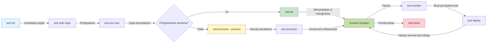
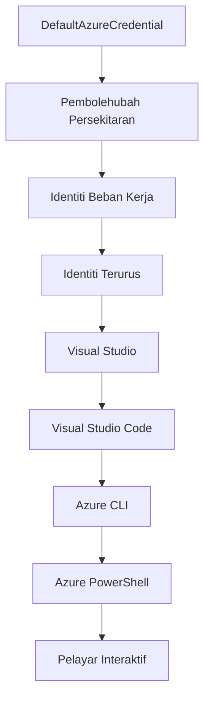

# AZD Asas - Memahami Azure Developer CLI

# AZD Asas - Konsep Teras dan Asas

**Navigasi Bab:**
- **📚 Halaman Utama Kursus**: [AZD Untuk Pemula](../../README.md)
- **📖 Bab Semasa**: Bab 1 - Asas & Permulaan Pantas
- **⬅️ Sebelumnya**: [Pengenalan Kursus](../../README.md#-chapter-1-foundation--quick-start)
- **➡️ Seterusnya**: [Pemasangan & Persediaan](installation.md)
- **🚀 Bab Seterusnya**: [Bab 2: Pembangunan Berasaskan AI](../microsoft-foundry/microsoft-foundry-integration.md)

## Pengenalan

Pelajaran ini memperkenalkan anda kepada Azure Developer CLI (azd), alat baris perintah yang berkuasa untuk mempercepatkan perjalanan anda dari pembangunan tempatan ke penyebaran Azure. Anda akan mempelajari konsep asas, ciri utama, dan memahami bagaimana azd mempermudah penyebaran aplikasi cloud-native.

## Matlamat Pembelajaran

Pada akhir pelajaran ini, anda akan:
- Memahami apa itu Azure Developer CLI dan tujuan utamanya
- Mempelajari konsep asas seperti templat, persekitaran, dan perkhidmatan
- Meneroka ciri utama termasuk pembangunan berasaskan templat dan Infrastruktur sebagai Kod
- Memahami struktur projek azd dan aliran kerja
- Bersedia untuk memasang dan mengkonfigurasi azd untuk persekitaran pembangunan anda

## Hasil Pembelajaran

Selepas melengkapkan pelajaran ini, anda akan dapat:
- Menjelaskan peranan azd dalam aliran kerja pembangunan cloud moden
- Mengenal pasti komponen struktur projek azd
- Menerangkan bagaimana templat, persekitaran, dan perkhidmatan berfungsi bersama
- Memahami manfaat Infrastruktur sebagai Kod dengan azd
- Mengenali pelbagai perintah azd dan tujuan mereka

## Apa itu Azure Developer CLI (azd)?

Azure Developer CLI (azd) ialah alat baris perintah yang direka untuk mempercepatkan perjalanan anda dari pembangunan tempatan ke penyebaran Azure. Ia mempermudah proses membina, menyebar, dan mengurus aplikasi cloud-native di Azure.

### 🎯 Kenapa Gunakan AZD? Perbandingan Dunia Sebenar

Mari kita bandingkan penyebaran aplikasi web mudah dengan pangkalan data:

#### ❌ TANPA AZD: Penyebaran Azure Manual (30+ minit)

```bash
# Langkah 1: Cipta kumpulan sumber
az group create --name myapp-rg --location eastus

# Langkah 2: Cipta Pelan Perkhidmatan Aplikasi
az appservice plan create --name myapp-plan \
  --resource-group myapp-rg \
  --sku B1 --is-linux

# Langkah 3: Cipta Aplikasi Web
az webapp create --name myapp-web-unique123 \
  --resource-group myapp-rg \
  --plan myapp-plan \
  --runtime "NODE:18-lts"

# Langkah 4: Cipta akaun Cosmos DB (10-15 minit)
az cosmosdb create --name myapp-cosmos-unique123 \
  --resource-group myapp-rg \
  --kind MongoDB

# Langkah 5: Cipta pangkalan data
az cosmosdb mongodb database create \
  --account-name myapp-cosmos-unique123 \
  --resource-group myapp-rg \
  --name tododb

# Langkah 6: Cipta koleksi
az cosmosdb mongodb collection create \
  --account-name myapp-cosmos-unique123 \
  --resource-group myapp-rg \
  --database-name tododb \
  --name todos

# Langkah 7: Dapatkan rentetan sambungan
CONN_STR=$(az cosmosdb keys list \
  --name myapp-cosmos-unique123 \
  --resource-group myapp-rg \
  --type connection-strings \
  --query "connectionStrings[0].connectionString" -o tsv)

# Langkah 8: Konfigurasikan tetapan aplikasi
az webapp config appsettings set \
  --name myapp-web-unique123 \
  --resource-group myapp-rg \
  --settings MONGODB_URI="$CONN_STR"

# Langkah 9: Aktifkan log
az webapp log config --name myapp-web-unique123 \
  --resource-group myapp-rg \
  --application-logging filesystem \
  --detailed-error-messages true

# Langkah 10: Sediakan Application Insights
az monitor app-insights component create \
  --app myapp-insights \
  --location eastus \
  --resource-group myapp-rg

# Langkah 11: Pautkan App Insights ke Aplikasi Web
INSTRUMENTATION_KEY=$(az monitor app-insights component show \
  --app myapp-insights \
  --resource-group myapp-rg \
  --query "instrumentationKey" -o tsv)

az webapp config appsettings set \
  --name myapp-web-unique123 \
  --resource-group myapp-rg \
  --settings APPINSIGHTS_INSTRUMENTATIONKEY="$INSTRUMENTATION_KEY"

# Langkah 12: Bina aplikasi secara tempatan
npm install
npm run build

# Langkah 13: Cipta pakej penyebaran
zip -r app.zip . -x "*.git*" "node_modules/*"

# Langkah 14: Sebarkan aplikasi
az webapp deployment source config-zip \
  --resource-group myapp-rg \
  --name myapp-web-unique123 \
  --src app.zip

# Langkah 15: Tunggu dan berdoa ia berfungsi 🙏
# (Tiada pengesahan automatik, ujian manual diperlukan)
```

**Masalah:**
- ❌ 15+ perintah untuk diingat dan dilaksanakan mengikut urutan
- ❌ 30-45 minit kerja manual
- ❌ Mudah membuat kesilapan (kesalahan taip, parameter salah)
- ❌ Rentetan sambungan terdedah dalam sejarah terminal
- ❌ Tiada pengunduran automatik jika sesuatu gagal
- ❌ Sukar untuk diulang oleh ahli pasukan
- ❌ Berbeza setiap kali (tidak boleh dihasilkan semula)

#### ✅ DENGAN AZD: Penyebaran Automatik (5 perintah, 10-15 minit)

```bash
# Langkah 1: Inisialisasi dari templat
azd init --template todo-nodejs-mongo

# Langkah 2: Sahkan
azd auth login

# Langkah 3: Cipta persekitaran
azd env new dev

# Langkah 4: Pratonton perubahan (pilihan tetapi disyorkan)
azd provision --preview

# Langkah 5: Laksanakan semuanya
azd up

# ✨ Selesai! Segala-galanya telah dilaksanakan, dikonfigurasi, dan dipantau
```

**Manfaat:**
- ✅ **5 perintah** berbanding 15+ langkah manual
- ✅ **10-15 minit** jumlah masa (kebanyakannya menunggu Azure)
- ✅ **Tiada kesilapan** - automatik dan diuji
- ✅ **Rahsia diuruskan dengan selamat** melalui Key Vault
- ✅ **Pengunduran automatik** jika berlaku kegagalan
- ✅ **Boleh dihasilkan semula sepenuhnya** - hasil yang sama setiap kali
- ✅ **Sedia untuk pasukan** - sesiapa sahaja boleh menyebar dengan perintah yang sama
- ✅ **Infrastruktur sebagai Kod** - templat Bicep yang dikawal versi
- ✅ **Pemantauan terbina dalam** - Application Insights dikonfigurasi secara automatik

### 📊 Pengurangan Masa & Kesilapan

| Metrik | Penyebaran Manual | Penyebaran AZD | Peningkatan |
|:-------|:------------------|:---------------|:------------|
| **Perintah** | 15+ | 5 | 67% lebih sedikit |
| **Masa** | 30-45 min | 10-15 min | 60% lebih pantas |
| **Kadar Kesilapan** | ~40% | <5% | 88% pengurangan |
| **Konsistensi** | Rendah (manual) | 100% (automatik) | Sempurna |
| **Onboarding Pasukan** | 2-4 jam | 30 minit | 75% lebih pantas |
| **Masa Pengunduran** | 30+ min (manual) | 2 min (automatik) | 93% lebih pantas |

## Konsep Asas

### Templat
Templat adalah asas azd. Ia mengandungi:
- **Kod aplikasi** - Kod sumber dan kebergantungan anda
- **Definisi infrastruktur** - Sumber Azure yang ditakrifkan dalam Bicep atau Terraform
- **Fail konfigurasi** - Tetapan dan pembolehubah persekitaran
- **Skrip penyebaran** - Aliran kerja penyebaran automatik

### Persekitaran
Persekitaran mewakili sasaran penyebaran yang berbeza:
- **Pembangunan** - Untuk ujian dan pembangunan
- **Staging** - Persekitaran pra-pengeluaran
- **Pengeluaran** - Persekitaran pengeluaran langsung

Setiap persekitaran mengekalkan:
- Kumpulan sumber Azure sendiri
- Tetapan konfigurasi
- Keadaan penyebaran

### Perkhidmatan
Perkhidmatan adalah blok binaan aplikasi anda:
- **Frontend** - Aplikasi web, SPA
- **Backend** - API, mikroservis
- **Pangkalan Data** - Penyelesaian penyimpanan data
- **Penyimpanan** - Penyimpanan fail dan blob

## Ciri Utama

### 1. Pembangunan Berasaskan Templat
```bash
# Semak templat yang tersedia
azd template list

# Mulakan dari templat
azd init --template <template-name>
```

### 2. Infrastruktur sebagai Kod
- **Bicep** - Bahasa khusus domain Azure
- **Terraform** - Alat infrastruktur multi-cloud
- **ARM Templates** - Templat Azure Resource Manager

### 3. Aliran Kerja Bersepadu
```bash
# Lengkapkan aliran kerja penyebaran
azd up            # Penyediaan + Penyebaran ini adalah automatik untuk persediaan kali pertama

# 🧪 BARU: Pratonton perubahan infrastruktur sebelum penyebaran (SELAMAT)
azd provision --preview    # Simulasikan penyebaran infrastruktur tanpa membuat perubahan

azd provision     # Cipta sumber Azure jika anda mengemas kini infrastruktur gunakan ini
azd deploy        # Sebarkan kod aplikasi atau sebarkan semula kod aplikasi selepas kemas kini
azd down          # Bersihkan sumber
```

#### 🛡️ Perancangan Infrastruktur Selamat dengan Pratonton
Perintah `azd provision --preview` adalah pengubah permainan untuk penyebaran selamat:
- **Analisis dry-run** - Menunjukkan apa yang akan dibuat, diubah, atau dipadamkan
- **Risiko sifar** - Tiada perubahan sebenar dibuat pada persekitaran Azure anda
- **Kerjasama pasukan** - Kongsi hasil pratonton sebelum penyebaran
- **Anggaran kos** - Fahami kos sumber sebelum komitmen

```bash
# Contoh aliran kerja pratonton
azd provision --preview           # Lihat apa yang akan berubah
# Semak output, bincang dengan pasukan
azd provision                     # Terapkan perubahan dengan yakin
```

### 📊 Visual: Aliran Kerja Pembangunan AZD


**Penjelasan Aliran Kerja:**
1. **Init** - Mulakan dengan templat atau projek baru
2. **Auth** - Sahkan dengan Azure
3. **Persekitaran** - Cipta persekitaran penyebaran terpencil
4. **Pratonton** - 🆕 Sentiasa pratonton perubahan infrastruktur terlebih dahulu (amalan selamat)
5. **Provision** - Cipta/kemas kini sumber Azure
6. **Deploy** - Tolak kod aplikasi anda
7. **Monitor** - Perhatikan prestasi aplikasi
8. **Iterate** - Buat perubahan dan sebarkan semula kod
9. **Cleanup** - Hapus sumber apabila selesai

### 4. Pengurusan Persekitaran
```bash
# Cipta dan urus persekitaran
azd env new <environment-name>
azd env select <environment-name>
azd env list
```

## 📁 Struktur Projek

Struktur projek azd tipikal:
```
my-app/
├── .azd/                    # azd configuration
│   └── config.json
├── .azure/                  # Azure deployment artifacts
├── .devcontainer/          # Development container config
├── .github/workflows/      # GitHub Actions
├── .vscode/               # VS Code settings
├── infra/                 # Infrastructure code
│   ├── main.bicep        # Main infrastructure template
│   ├── main.parameters.json
│   └── modules/          # Reusable modules
├── src/                  # Application source code
│   ├── api/             # Backend services
│   └── web/             # Frontend application
├── azure.yaml           # azd project configuration
└── README.md
```

## 🔧 Fail Konfigurasi

### azure.yaml
Fail konfigurasi utama projek:
```yaml
name: my-awesome-app
metadata:
  template: my-template@1.0.0

services:
  web:
    project: ./src/web
    language: js
    host: appservice
  api:
    project: ./src/api
    language: js
    host: appservice

hooks:
  preprovision:
    shell: pwsh
    run: echo "Preparing to provision..."
```

### .azure/config.json
Konfigurasi khusus persekitaran:
```json
{
  "version": 1,
  "defaultEnvironment": "dev",
  "environments": {
    "dev": {
      "subscriptionId": "your-subscription-id",
      "location": "eastus"
    }
  }
}
```

## 🎪 Aliran Kerja Biasa dengan Latihan Praktikal

> **💡 Petua Pembelajaran:** Ikuti latihan ini secara berurutan untuk membina kemahiran AZD anda secara progresif.

### 🎯 Latihan 1: Inisialisasi Projek Pertama Anda

**Matlamat:** Cipta projek AZD dan terokai strukturnya

**Langkah:**
```bash
# Gunakan templat yang terbukti
azd init --template todo-nodejs-mongo

# Terokai fail yang dijana
ls -la  # Lihat semua fail termasuk yang tersembunyi

# Fail utama yang dicipta:
# - azure.yaml (konfigurasi utama)
# - infra/ (kod infrastruktur)
# - src/ (kod aplikasi)
```

**✅ Kejayaan:** Anda mempunyai direktori azure.yaml, infra/, dan src/

---

### 🎯 Latihan 2: Penyebaran ke Azure

**Matlamat:** Lengkapkan penyebaran hujung ke hujung

**Langkah:**
```bash
# 1. Sahkan
az login && azd auth login

# 2. Cipta persekitaran
azd env new dev
azd env set AZURE_LOCATION eastus

# 3. Pratonton perubahan (DISYORKAN)
azd provision --preview

# 4. Laksanakan semuanya
azd up

# 5. Sahkan pelaksanaan
azd show    # Lihat URL aplikasi anda
```

**Masa Dijangka:** 10-15 minit  
**✅ Kejayaan:** URL aplikasi dibuka dalam pelayar

---

### 🎯 Latihan 3: Pelbagai Persekitaran

**Matlamat:** Sebarkan ke dev dan staging

**Langkah:**
```bash
# Sudah ada dev, buat staging
azd env new staging
azd env set AZURE_LOCATION westus2
azd up

# Tukar antara mereka
azd env list
azd env select dev
```

**✅ Kejayaan:** Dua kumpulan sumber berasingan dalam Portal Azure

---

### 🛡️ Permulaan Baru: `azd down --force --purge`

Apabila anda perlu menetapkan semula sepenuhnya:

```bash
azd down --force --purge
```

**Apa yang dilakukan:**
- `--force`: Tiada arahan pengesahan
- `--purge`: Memadamkan semua keadaan tempatan dan sumber Azure

**Gunakan apabila:**
- Penyebaran gagal di tengah jalan
- Menukar projek
- Memerlukan permulaan baru

---

## 🎪 Rujukan Aliran Kerja Asal

### Memulakan Projek Baru
```bash
# Kaedah 1: Gunakan templat sedia ada
azd init --template todo-nodejs-mongo

# Kaedah 2: Mulakan dari awal
azd init

# Kaedah 3: Gunakan direktori semasa
azd init .
```

### Kitaran Pembangunan
```bash
# Tetapkan persekitaran pembangunan
azd auth login
azd env new dev
azd env select dev

# Laksanakan semuanya
azd up

# Buat perubahan dan laksanakan semula
azd deploy

# Bersihkan apabila selesai
azd down --force --purge # arahan dalam Azure Developer CLI adalah **reset keras** untuk persekitaran anda—terutamanya berguna apabila anda menyelesaikan masalah kegagalan pelaksanaan, membersihkan sumber yang tidak digunakan, atau bersedia untuk pelaksanaan semula yang baru.
```

## Memahami `azd down --force --purge`
Perintah `azd down --force --purge` adalah cara yang berkuasa untuk sepenuhnya menghapuskan persekitaran azd anda dan semua sumber yang berkaitan. Berikut adalah pecahan tentang apa yang dilakukan oleh setiap bendera:
```
--force
```
- Melangkau arahan pengesahan.
- Berguna untuk automasi atau skrip di mana input manual tidak praktikal.
- Memastikan penghapusan diteruskan tanpa gangguan, walaupun CLI mengesan ketidakkonsistenan.

```
--purge
```
Memadamkan **semua metadata berkaitan**, termasuk:
Keadaan persekitaran
Folder `.azure` tempatan
Maklumat penyebaran yang di-cache
Menghalang azd daripada "mengingati" penyebaran sebelumnya, yang boleh menyebabkan masalah seperti kumpulan sumber yang tidak sepadan atau rujukan pendaftaran lama.


### Kenapa gunakan kedua-duanya?
Apabila anda menghadapi masalah dengan `azd up` disebabkan keadaan yang tertinggal atau penyebaran separa, gabungan ini memastikan **permulaan baru**.

Ia sangat berguna selepas penghapusan sumber manual dalam portal Azure atau semasa menukar templat, persekitaran, atau konvensi penamaan kumpulan sumber.


### Menguruskan Pelbagai Persekitaran
```bash
# Buat persekitaran pementasan
azd env new staging
azd env select staging
azd up

# Tukar kembali ke dev
azd env select dev

# Bandingkan persekitaran
azd env list
```

## 🔐 Pengesahan dan Kredensial

Memahami pengesahan adalah penting untuk penyebaran azd yang berjaya. Azure menggunakan pelbagai kaedah pengesahan, dan azd memanfaatkan rantaian kredensial yang sama yang digunakan oleh alat Azure lain.

### Pengesahan Azure CLI (`az login`)

Sebelum menggunakan azd, anda perlu mengesahkan dengan Azure. Kaedah yang paling biasa adalah menggunakan Azure CLI:

```bash
# Log masuk interaktif (membuka pelayar)
az login

# Log masuk dengan penyewa tertentu
az login --tenant <tenant-id>

# Log masuk dengan prinsipal perkhidmatan
az login --service-principal -u <app-id> -p <password> --tenant <tenant-id>

# Semak status log masuk semasa
az account show

# Senaraikan langganan yang tersedia
az account list --output table

# Tetapkan langganan lalai
az account set --subscription <subscription-id>
```

### Aliran Pengesahan
1. **Login Interaktif**: Membuka pelayar lalai anda untuk pengesahan
2. **Aliran Kod Peranti**: Untuk persekitaran tanpa akses pelayar
3. **Service Principal**: Untuk automasi dan senario CI/CD
4. **Identiti Terurus**: Untuk aplikasi yang dihoskan Azure

### Rantaian DefaultAzureCredential

`DefaultAzureCredential` ialah jenis kredensial yang menyediakan pengalaman pengesahan yang dipermudahkan dengan secara automatik mencuba pelbagai sumber kredensial dalam urutan tertentu:

#### Urutan Rantaian Kredensial

#### 1. Pembolehubah Persekitaran
```bash
# Tetapkan pembolehubah persekitaran untuk prinsipal perkhidmatan
export AZURE_CLIENT_ID="<app-id>"
export AZURE_CLIENT_SECRET="<password>"
export AZURE_TENANT_ID="<tenant-id>"
```

#### 2. Identiti Beban Kerja (Kubernetes/GitHub Actions)
Digunakan secara automatik dalam:
- Azure Kubernetes Service (AKS) dengan Identiti Beban Kerja
- GitHub Actions dengan federasi OIDC
- Senario identiti federasi lain

#### 3. Identiti Terurus
Untuk sumber Azure seperti:
- Mesin Maya
- App Service
- Azure Functions
- Container Instances

```bash
# Periksa jika berjalan pada sumber Azure dengan identiti terurus
az account show --query "user.type" --output tsv
# Mengembalikan: "servicePrincipal" jika menggunakan identiti terurus
```

#### 4. Integrasi Alat Pembangun
- **Visual Studio**: Secara automatik menggunakan akaun yang telah log masuk
- **VS Code**: Menggunakan kredensial sambungan Akaun Azure
- **Azure CLI**: Menggunakan kredensial `az login` (paling biasa untuk pembangunan tempatan)

### Persediaan Pengesahan AZD

```bash
# Kaedah 1: Gunakan Azure CLI (Disyorkan untuk pembangunan)
az login
azd auth login  # Menggunakan kelayakan Azure CLI sedia ada

# Kaedah 2: Pengesahan azd secara langsung
azd auth login --use-device-code  # Untuk persekitaran tanpa kepala

# Kaedah 3: Semak status pengesahan
azd auth login --check-status

# Kaedah 4: Log keluar dan sahkan semula
azd auth logout
azd auth login
```

### Amalan Terbaik Pengesahan

#### Untuk Pembangunan Tempatan
```bash
# 1. Log masuk dengan Azure CLI
az login

# 2. Sahkan langganan yang betul
az account show
az account set --subscription "Your Subscription Name"

# 3. Gunakan azd dengan kelayakan sedia ada
azd auth login
```

#### Untuk Saluran CI/CD
```yaml
# GitHub Actions example
- name: Azure Login
  uses: azure/login@v1
  with:
    creds: ${{ secrets.AZURE_CREDENTIALS }}

- name: Deploy with azd
  run: |
    azd auth login --client-id ${{ secrets.AZURE_CLIENT_ID }} \
                    --client-secret ${{ secrets.AZURE_CLIENT_SECRET }} \
                    --tenant-id ${{ secrets.AZURE_TENANT_ID }}
    azd up --no-prompt
```

#### Untuk Persekitaran Pengeluaran
- Gunakan **Identiti Terurus** apabila berjalan pada sumber Azure
- Gunakan **Service Principal** untuk senario automasi
- Elakkan menyimpan kredensial dalam kod atau fail konfigurasi
- Gunakan **Azure Key Vault** untuk konfigurasi sensitif

### Isu dan Penyelesaian Pengesahan Biasa

#### Isu: "Tiada langganan dijumpai"
```bash
# Penyelesaian: Tetapkan langganan lalai
az account list --output table
az account set --subscription "<subscription-id>"
azd env set AZURE_SUBSCRIPTION_ID "<subscription-id>"
```

#### Isu: "Kebenaran tidak mencukupi"
```bash
# Penyelesaian: Semak dan tetapkan peranan yang diperlukan
az role assignment list --assignee $(az account show --query user.name --output tsv)

# Peranan yang biasa diperlukan:
# - Penyumbang (untuk pengurusan sumber)
# - Pentadbir Akses Pengguna (untuk penetapan peranan)
```

#### Isu: "Token tamat tempoh"
```bash
# Penyelesaian: Pengesahan semula
az logout
az login
azd auth logout
azd auth login
```

### Pengesahan dalam Pelbagai Senario

#### Pembangunan Tempatan
```bash
# Akaun pembangunan peribadi
az login
azd auth login
```

#### Pembangunan Pasukan
```bash
# Gunakan penyewa tertentu untuk organisasi
az login --tenant contoso.onmicrosoft.com
azd auth login
```

#### Senario Multi-penyewa
```bash
# Tukar antara penyewa
az login --tenant tenant1.onmicrosoft.com
# Sebarkan ke penyewa 1
azd up

az login --tenant tenant2.onmicrosoft.com  
# Sebarkan ke penyewa 2
azd up
```

### Pertimbangan Keselamatan

1. **Penyimpanan Kredensial**: Jangan sekali-kali menyimpan kredensial dalam kod sumber
2. **Had Skop**: Gunakan prinsip keistimewaan minimum untuk service principal
3. **Putaran Token**: Putar rahsia service principal secara berkala
4. **Jejak Audit**: Pantau aktiviti pengesahan dan penyebaran
5. **Keselamatan Rangkaian**: Gunakan titik akhir peribadi jika boleh

### Penyelesaian Masalah Pengesahan

```bash
# Nyahpepijat isu pengesahan
azd auth login --check-status
az account show
az account get-access-token

# Perintah diagnostik biasa
whoami                          # Konteks pengguna semasa
az ad signed-in-user show      # Butiran pengguna Azure AD
az group list                  # Uji akses sumber
```

## Memahami `azd down --force --purge`

### Penemuan
```bash
azd template list              # Semak templat
azd template show <template>   # Butiran templat
azd init --help               # Pilihan inisialisasi
```

### Pengurusan Projek
```bash
azd show                     # Gambaran keseluruhan projek
azd env show                 # Persekitaran semasa
azd config list             # Tetapan konfigurasi
```

### Pemantauan
```bash
azd monitor                  # Buka portal Azure
azd pipeline config          # Tetapkan CI/CD
azd logs                     # Lihat log aplikasi
```

## Amalan Terbaik

### 1. Gunakan Nama yang Bermakna
```bash
# Baik
azd env new production-east
azd init --template web-app-secure

# Elakkan
azd env new env1
azd init --template template1
```

### 2. Manfaatkan Templat
- Mulakan dengan templat sedia ada
- Sesuaikan mengikut keperluan anda
- Cipta templat yang boleh digunakan semula untuk organisasi anda

### 3. Pengasingan Persekitaran
- Gunakan persekitaran berasingan untuk dev/staging/prod
- Jangan sekali-kali menyebar terus ke pengeluaran dari mesin tempatan
- Gunakan saluran CI/CD untuk penyebaran pengeluaran

### 4. Pengurusan Konfigurasi
- Gunakan pembolehubah persekitaran untuk data sensitif
- Simpan konfigurasi dalam kawalan versi
- Dokumentasikan tetapan khusus persekitaran

## Perkembangan Pembelajaran

### Pemula (Minggu 1-2)
1. Pasang azd dan sahkan
2. Sebarkan templat mudah
3. Fahami struktur projek
4. Pelajari perintah asas (up, down, deploy)

### Pertengahan (Minggu 3-4)
1. Sesuaikan templat
2. Urus pelbagai persekitaran
3. Fahami kod infrastruktur
4. Sediakan saluran CI/CD

### Lanjutan (Minggu 5+)
1. Cipta templat tersuai
2. Corak infrastruktur lanjutan
3. Penyebaran multi-rantau
4. Konfigurasi tahap perusahaan

## Langkah Seterusnya

**📖 Teruskan Pembelajaran Bab 1:**
- [Pemasangan & Persediaan](installation.md) - Pasang dan konfigurasi azd
- [Projek Pertama Anda](first-project.md) - Tutorial praktikal lengkap
- [Panduan Konfigurasi](configuration.md) - Pilihan konfigurasi lanjutan

**🎯 Sedia untuk Bab Seterusnya?**
- [Bab 2: Pembangunan Berasaskan AI](../microsoft-foundry/microsoft-foundry-integration.md) - Mula membina aplikasi AI

## Sumber Tambahan

- [Gambaran Keseluruhan Azure Developer CLI](https://learn.microsoft.com/en-us/azure/developer/azure-developer-cli/)
- [Galeri Templat](https://azure.github.io/awesome-azd/)
- [Contoh Komuniti](https://github.com/Azure-Samples)

---

## 🙋 Soalan Lazim

### Soalan Umum

**S: Apakah perbezaan antara AZD dan Azure CLI?**

J: Azure CLI (`az`) digunakan untuk menguruskan sumber Azure individu. AZD (`azd`) digunakan untuk menguruskan keseluruhan aplikasi:

```bash
# Azure CLI - Pengurusan sumber peringkat rendah
az webapp create --name myapp --resource-group rg
az sql server create --name myserver --resource-group rg
# ...banyak lagi arahan diperlukan

# AZD - Pengurusan peringkat aplikasi
azd up  # Melancarkan keseluruhan aplikasi dengan semua sumber
```

**Fikirkan begini:**
- `az` = Mengendalikan blok Lego individu
- `azd` = Bekerja dengan set Lego lengkap

---

**S: Adakah saya perlu tahu Bicep atau Terraform untuk menggunakan AZD?**

J: Tidak! Mulakan dengan templat:
```bash
# Gunakan templat sedia ada - tiada pengetahuan IaC diperlukan
azd init --template todo-nodejs-mongo
azd up
```

Anda boleh belajar Bicep kemudian untuk menyesuaikan infrastruktur. Templat menyediakan contoh kerja untuk dipelajari.

---

**S: Berapa kos untuk menjalankan templat AZD?**

J: Kos bergantung pada templat. Kebanyakan templat pembangunan berharga $50-150/bulan:

```bash
# Pratonton kos sebelum melaksanakan
azd provision --preview

# Sentiasa bersihkan apabila tidak digunakan
azd down --force --purge  # Menghapuskan semua sumber
```

**Tip pro:** Gunakan tier percuma jika tersedia:
- App Service: Tier F1 (Percuma)
- Azure OpenAI: 50,000 token/bulan percuma
- Cosmos DB: Tier percuma 1000 RU/s

---

**S: Bolehkah saya menggunakan AZD dengan sumber Azure sedia ada?**

J: Ya, tetapi lebih mudah untuk bermula dari awal. AZD berfungsi terbaik apabila ia menguruskan keseluruhan kitaran hayat. Untuk sumber sedia ada:

```bash
# Pilihan 1: Import sumber sedia ada (lanjutan)
azd init
# Kemudian ubah infra/ untuk merujuk kepada sumber sedia ada

# Pilihan 2: Mulakan baru (disyorkan)
azd init --template matching-your-stack
azd up  # Mencipta persekitaran baru
```

---

**S: Bagaimana saya berkongsi projek saya dengan rakan sepasukan?**

J: Komit projek AZD ke Git (tetapi BUKAN folder .azure):

```bash
# Sudah dalam .gitignore secara lalai
.azure/        # Mengandungi rahsia dan data persekitaran
*.env          # Pembolehubah persekitaran

# Ahli pasukan kemudian:
git clone <your-repo>
azd auth login
azd env new <their-name>-dev
azd up
```

Semua orang mendapat infrastruktur yang sama daripada templat yang sama.

---

### Soalan Penyelesaian Masalah

**S: "azd up" gagal separuh jalan. Apa yang perlu saya lakukan?**

J: Semak ralat, perbaiki, kemudian cuba lagi:

```bash
# Lihat log terperinci
azd show

# Penyelesaian biasa:

# 1. Jika kuota melebihi:
azd env set AZURE_LOCATION "westus2"  # Cuba kawasan lain

# 2. Jika konflik nama sumber:
azd down --force --purge  # Mulakan semula
azd up  # Cuba lagi

# 3. Jika pengesahan tamat tempoh:
az login
azd auth login
azd up
```

**Masalah paling biasa:** Langganan Azure yang salah dipilih
```bash
az account list --output table
az account set --subscription "<correct-subscription>"
```

---

**S: Bagaimana saya menyebarkan hanya perubahan kod tanpa penyediaan semula?**

J: Gunakan `azd deploy` dan bukannya `azd up`:

```bash
azd up          # Kali pertama: penyediaan + pelaksanaan (perlahan)

# Buat perubahan kod...

azd deploy      # Kali seterusnya: pelaksanaan sahaja (cepat)
```

Perbandingan kelajuan:
- `azd up`: 10-15 minit (menyediakan infrastruktur)
- `azd deploy`: 2-5 minit (kod sahaja)

---

**S: Bolehkah saya menyesuaikan templat infrastruktur?**

J: Ya! Edit fail Bicep dalam `infra/`:

```bash
# Selepas azd init
cd infra/
code main.bicep  # Edit dalam VS Code

# Pratonton perubahan
azd provision --preview

# Terapkan perubahan
azd provision
```

**Tip:** Mulakan kecil - ubah SKUs dahulu:
```bicep
// infra/main.bicep
sku: {
  name: 'B1'  // Change to 'P1V2' for production
}
```

---

**S: Bagaimana saya memadamkan semua yang dibuat oleh AZD?**

J: Satu arahan menghapuskan semua sumber:

```bash
azd down --force --purge

# Ini memadam:
# - Semua sumber Azure
# - Kumpulan sumber
# - Keadaan persekitaran tempatan
# - Data penyebaran yang di-cache
```

**Sentiasa jalankan ini apabila:**
- Selesai menguji templat
- Beralih ke projek lain
- Mahu bermula dari awal

**Penjimatan kos:** Memadamkan sumber yang tidak digunakan = caj $0

---

**S: Bagaimana jika saya secara tidak sengaja memadamkan sumber di Portal Azure?**

J: Keadaan AZD boleh menjadi tidak selaras. Pendekatan permulaan bersih:

```bash
# 1. Buang keadaan tempatan
azd down --force --purge

# 2. Mulakan semula
azd up

# Alternatif: Biarkan AZD mengesan dan membaiki
azd provision  # Akan mencipta sumber yang hilang
```

---

### Soalan Lanjutan

**S: Bolehkah saya menggunakan AZD dalam pipeline CI/CD?**

J: Ya! Contoh GitHub Actions:

```yaml
# .github/workflows/deploy.yml
name: Deploy with AZD

on:
  push:
    branches: [main]

jobs:
  deploy:
    runs-on: ubuntu-latest
    steps:
      - uses: actions/checkout@v2
      
      - name: Install azd
        run: curl -fsSL https://aka.ms/install-azd.sh | bash
      
      - name: Azure Login
        run: |
          azd auth login \
            --client-id ${{ secrets.AZURE_CLIENT_ID }} \
            --client-secret ${{ secrets.AZURE_CLIENT_SECRET }} \
            --tenant-id ${{ secrets.AZURE_TENANT_ID }}
      
      - name: Deploy
        run: azd up --no-prompt
```

---

**S: Bagaimana saya menguruskan rahsia dan data sensitif?**

J: AZD berintegrasi dengan Azure Key Vault secara automatik:

```bash
# Rahsia disimpan dalam Key Vault, bukan dalam kod
azd env set DATABASE_PASSWORD "$(openssl rand -base64 32)"

# AZD secara automatik:
# 1. Mencipta Key Vault
# 2. Menyimpan rahsia
# 3. Memberi akses aplikasi melalui Identiti Terurus
# 4. Menyuntik semasa runtime
```

**Jangan pernah komit:**
- Folder `.azure/` (mengandungi data persekitaran)
- Fail `.env` (rahsia tempatan)
- String sambungan

---

**S: Bolehkah saya menyebarkan ke pelbagai wilayah?**

J: Ya, buat persekitaran bagi setiap wilayah:

```bash
# Persekitaran Timur AS
azd env new prod-eastus
azd env set AZURE_LOCATION eastus
azd up

# Persekitaran Eropah Barat
azd env new prod-westeurope
azd env set AZURE_LOCATION westeurope
azd up

# Setiap persekitaran adalah bebas
azd env list
```

Untuk aplikasi pelbagai wilayah sebenar, sesuaikan templat Bicep untuk menyebarkan ke pelbagai wilayah secara serentak.

---

**S: Di mana saya boleh mendapatkan bantuan jika saya tersekat?**

1. **Dokumentasi AZD:** https://learn.microsoft.com/azure/developer/azure-developer-cli/
2. **Isu GitHub:** https://github.com/Azure/azure-dev/issues
3. **Discord:** [Azure Discord](https://discord.gg/microsoft-azure) - saluran #azure-developer-cli
4. **Stack Overflow:** Tag `azure-developer-cli`
5. **Kursus Ini:** [Panduan Penyelesaian Masalah](../troubleshooting/common-issues.md)

**Tip pro:** Sebelum bertanya, jalankan:
```bash
azd show       # Menunjukkan keadaan semasa
azd version    # Menunjukkan versi anda
```
Sertakan maklumat ini dalam soalan anda untuk mendapatkan bantuan lebih cepat.

---

## 🎓 Apa Seterusnya?

Anda kini memahami asas AZD. Pilih laluan anda:

### 🎯 Untuk Pemula:
1. **Seterusnya:** [Pemasangan & Persediaan](installation.md) - Pasang AZD pada mesin anda
2. **Kemudian:** [Projek Pertama Anda](first-project.md) - Sebarkan aplikasi pertama anda
3. **Latihan:** Lengkapkan semua 3 latihan dalam pelajaran ini

### 🚀 Untuk Pembangun AI:
1. **Langkau ke:** [Bab 2: Pembangunan Berasaskan AI](../microsoft-foundry/microsoft-foundry-integration.md)
2. **Sebarkan:** Mulakan dengan `azd init --template get-started-with-ai-chat`
3. **Belajar:** Bina sambil anda menyebarkan

### 🏗️ Untuk Pembangun Berpengalaman:
1. **Semak:** [Panduan Konfigurasi](configuration.md) - Tetapan lanjutan
2. **Teroka:** [Infrastruktur sebagai Kod](../deployment/provisioning.md) - Penyelaman mendalam Bicep
3. **Bina:** Cipta templat tersuai untuk stack anda

---

**Navigasi Bab:**
- **📚 Halaman Utama Kursus**: [AZD Untuk Pemula](../../README.md)
- **📖 Bab Semasa**: Bab 1 - Asas & Permulaan Pantas  
- **⬅️ Sebelumnya**: [Gambaran Keseluruhan Kursus](../../README.md#-chapter-1-foundation--quick-start)
- **➡️ Seterusnya**: [Pemasangan & Persediaan](installation.md)
- **🚀 Bab Seterusnya**: [Bab 2: Pembangunan Berasaskan AI](../microsoft-foundry/microsoft-foundry-integration.md)

---

<!-- CO-OP TRANSLATOR DISCLAIMER START -->
**Penafian**:  
Dokumen ini telah diterjemahkan menggunakan perkhidmatan terjemahan AI [Co-op Translator](https://github.com/Azure/co-op-translator). Walaupun kami berusaha untuk ketepatan, sila ambil perhatian bahawa terjemahan automatik mungkin mengandungi kesilapan atau ketidaktepatan. Dokumen asal dalam bahasa asalnya harus dianggap sebagai sumber yang berwibawa. Untuk maklumat penting, terjemahan manusia profesional adalah disyorkan. Kami tidak bertanggungjawab atas sebarang salah faham atau salah tafsir yang timbul daripada penggunaan terjemahan ini.
<!-- CO-OP TRANSLATOR DISCLAIMER END -->