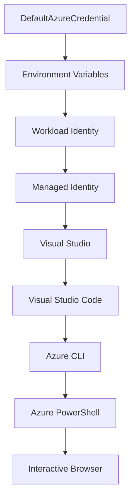

<!--
CO_OP_TRANSLATOR_METADATA:
{
  "original_hash": "4dc26ed8004b58a51875efd07203340f",
  "translation_date": "2025-09-26T18:41:31+00:00",
  "source_file": "docs/getting-started/azd-basics.md",
  "language_code": "ms"
}
-->
# AZD Asas - Memahami Azure Developer CLI

# AZD Asas - Konsep Utama dan Asas

**Navigasi Bab:**
- **📚 Kursus Utama**: [AZD Untuk Pemula](../../README.md)
- **📖 Bab Semasa**: Bab 1 - Asas & Permulaan Pantas
- **⬅️ Sebelumnya**: [Gambaran Keseluruhan Kursus](../../README.md#-chapter-1-foundation--quick-start)
- **➡️ Seterusnya**: [Pemasangan & Persediaan](installation.md)
- **🚀 Bab Seterusnya**: [Bab 2: Pembangunan Berasaskan AI](../ai-foundry/azure-ai-foundry-integration.md)

## Pengenalan

Pelajaran ini memperkenalkan anda kepada Azure Developer CLI (azd), alat baris perintah yang berkuasa untuk mempercepatkan perjalanan anda dari pembangunan tempatan ke penyebaran Azure. Anda akan mempelajari konsep asas, ciri utama, dan memahami bagaimana azd mempermudah penyebaran aplikasi cloud-native.

## Matlamat Pembelajaran

Pada akhir pelajaran ini, anda akan:
- Memahami apa itu Azure Developer CLI dan tujuan utamanya
- Mempelajari konsep asas seperti templat, persekitaran, dan perkhidmatan
- Meneroka ciri utama termasuk pembangunan berasaskan templat dan Infrastruktur sebagai Kod
- Memahami struktur projek azd dan aliran kerja
- Bersedia untuk memasang dan mengkonfigurasi azd untuk persekitaran pembangunan anda

## Hasil Pembelajaran

Selepas melengkapkan pelajaran ini, anda akan dapat:
- Menjelaskan peranan azd dalam aliran kerja pembangunan cloud moden
- Mengenal pasti komponen struktur projek azd
- Menerangkan bagaimana templat, persekitaran, dan perkhidmatan berfungsi bersama
- Memahami manfaat Infrastruktur sebagai Kod dengan azd
- Mengenali pelbagai perintah azd dan tujuannya

## Apa itu Azure Developer CLI (azd)?

Azure Developer CLI (azd) ialah alat baris perintah yang direka untuk mempercepatkan perjalanan anda dari pembangunan tempatan ke penyebaran Azure. Ia mempermudah proses membina, menyebarkan, dan mengurus aplikasi cloud-native di Azure.

## Konsep Asas

### Templat
Templat adalah asas azd. Ia mengandungi:
- **Kod aplikasi** - Kod sumber dan kebergantungan anda
- **Definisi infrastruktur** - Sumber Azure yang ditakrifkan dalam Bicep atau Terraform
- **Fail konfigurasi** - Tetapan dan pembolehubah persekitaran
- **Skrip penyebaran** - Aliran kerja penyebaran automatik

### Persekitaran
Persekitaran mewakili sasaran penyebaran yang berbeza:
- **Pembangunan** - Untuk ujian dan pembangunan
- **Staging** - Persekitaran pra-pengeluaran
- **Pengeluaran** - Persekitaran pengeluaran langsung

Setiap persekitaran mengekalkan:
- Kumpulan sumber Azure sendiri
- Tetapan konfigurasi
- Keadaan penyebaran

### Perkhidmatan
Perkhidmatan adalah blok binaan aplikasi anda:
- **Frontend** - Aplikasi web, SPA
- **Backend** - API, mikroservis
- **Pangkalan data** - Penyelesaian penyimpanan data
- **Penyimpanan** - Penyimpanan fail dan blob

## Ciri Utama

### 1. Pembangunan Berasaskan Templat
```bash
# Browse available templates
azd template list

# Initialize from a template
azd init --template <template-name>
```

### 2. Infrastruktur sebagai Kod
- **Bicep** - Bahasa khusus domain Azure
- **Terraform** - Alat infrastruktur multi-cloud
- **ARM Templates** - Templat Pengurus Sumber Azure

### 3. Aliran Kerja Bersepadu
```bash
# Complete deployment workflow
azd up            # Provision + Deploy this is hands off for first time setup
azd provision     # Create Azure resources if you update the infrastructure use this
azd deploy        # Deploy application code or redeploy application code once update
azd down          # Clean up resources
```

### 4. Pengurusan Persekitaran
```bash
# Create and manage environments
azd env new <environment-name>
azd env select <environment-name>
azd env list
```

## 📁 Struktur Projek

Struktur projek azd biasa:
```
my-app/
├── .azd/                    # azd configuration
│   └── config.json
├── .azure/                  # Azure deployment artifacts
├── .devcontainer/          # Development container config
├── .github/workflows/      # GitHub Actions
├── .vscode/               # VS Code settings
├── infra/                 # Infrastructure code
│   ├── main.bicep        # Main infrastructure template
│   ├── main.parameters.json
│   └── modules/          # Reusable modules
├── src/                  # Application source code
│   ├── api/             # Backend services
│   └── web/             # Frontend application
├── azure.yaml           # azd project configuration
└── README.md
```

## 🔧 Fail Konfigurasi

### azure.yaml
Fail konfigurasi utama projek:
```yaml
name: my-awesome-app
metadata:
  template: my-template@1.0.0

services:
  web:
    project: ./src/web
    language: js
    host: appservice
  api:
    project: ./src/api
    language: js
    host: appservice

hooks:
  preprovision:
    shell: pwsh
    run: echo "Preparing to provision..."
```

### .azure/config.json
Konfigurasi khusus persekitaran:
```json
{
  "version": 1,
  "defaultEnvironment": "dev",
  "environments": {
    "dev": {
      "subscriptionId": "your-subscription-id",
      "location": "eastus"
    }
  }
}
```

## 🎪 Aliran Kerja Biasa

### Memulakan Projek Baru
```bash
# Method 1: Use existing template
azd init --template todo-nodejs-mongo

# Method 2: Start from scratch
azd init

# Method 3: Use current directory
azd init .
```

### Kitaran Pembangunan
```bash
# Set up development environment
azd auth login
azd env new dev
azd env select dev

# Deploy everything
azd up

# Make changes and redeploy
azd deploy

# Clean up when done
azd down --force --purge # command in the Azure Developer CLI is a **hard reset** for your environment—especially useful when you're troubleshooting failed deployments, cleaning up orphaned resources, or prepping for a fresh redeploy.
```

## Memahami `azd down --force --purge`
Perintah `azd down --force --purge` adalah cara yang berkuasa untuk sepenuhnya meruntuhkan persekitaran azd anda dan semua sumber yang berkaitan. Berikut adalah pecahan setiap bendera:
```
--force
```
- Melangkau arahan pengesahan.
- Berguna untuk automasi atau skrip di mana input manual tidak praktikal.
- Memastikan proses runtuhan berjalan tanpa gangguan, walaupun CLI mengesan ketidakkonsistenan.

```
--purge
```
Menghapuskan **semua metadata yang berkaitan**, termasuk:
Keadaan persekitaran
Folder tempatan `.azure`
Maklumat penyebaran yang disimpan
Menghalang azd daripada "mengingati" penyebaran sebelumnya, yang boleh menyebabkan masalah seperti kumpulan sumber yang tidak sepadan atau rujukan daftar yang lama.


### Mengapa menggunakan kedua-duanya?
Apabila anda menghadapi masalah dengan `azd up` disebabkan oleh keadaan yang tertinggal atau penyebaran separa, gabungan ini memastikan permulaan yang **bersih**.

Ia sangat berguna selepas penghapusan sumber manual di portal Azure atau apabila menukar templat, persekitaran, atau konvensyen penamaan kumpulan sumber.


### Menguruskan Pelbagai Persekitaran
```bash
# Create staging environment
azd env new staging
azd env select staging
azd up

# Switch back to dev
azd env select dev

# Compare environments
azd env list
```

## 🔐 Pengesahan dan Kredensial

Memahami pengesahan adalah penting untuk penyebaran azd yang berjaya. Azure menggunakan pelbagai kaedah pengesahan, dan azd memanfaatkan rantaian kredensial yang sama yang digunakan oleh alat Azure lain.

### Pengesahan Azure CLI (`az login`)

Sebelum menggunakan azd, anda perlu mengesahkan dengan Azure. Kaedah yang paling biasa adalah menggunakan Azure CLI:

```bash
# Interactive login (opens browser)
az login

# Login with specific tenant
az login --tenant <tenant-id>

# Login with service principal
az login --service-principal -u <app-id> -p <password> --tenant <tenant-id>

# Check current login status
az account show

# List available subscriptions
az account list --output table

# Set default subscription
az account set --subscription <subscription-id>
```

### Aliran Pengesahan
1. **Login Interaktif**: Membuka pelayar lalai anda untuk pengesahan
2. **Aliran Kod Peranti**: Untuk persekitaran tanpa akses pelayar
3. **Service Principal**: Untuk automasi dan senario CI/CD
4. **Identiti Terurus**: Untuk aplikasi yang dihoskan Azure

### Rantaian DefaultAzureCredential

`DefaultAzureCredential` ialah jenis kredensial yang menyediakan pengalaman pengesahan yang dipermudahkan dengan secara automatik mencuba pelbagai sumber kredensial dalam susunan tertentu:

#### Susunan Rantaian Kredensial


#### 1. Pembolehubah Persekitaran
```bash
# Set environment variables for service principal
export AZURE_CLIENT_ID="<app-id>"
export AZURE_CLIENT_SECRET="<password>"
export AZURE_TENANT_ID="<tenant-id>"
```

#### 2. Identiti Beban Kerja (Kubernetes/GitHub Actions)
Digunakan secara automatik dalam:
- Azure Kubernetes Service (AKS) dengan Identiti Beban Kerja
- GitHub Actions dengan federasi OIDC
- Senario identiti federasi lain

#### 3. Identiti Terurus
Untuk sumber Azure seperti:
- Mesin Maya
- App Service
- Azure Functions
- Container Instances

```bash
# Check if running on Azure resource with managed identity
az account show --query "user.type" --output tsv
# Returns: "servicePrincipal" if using managed identity
```

#### 4. Integrasi Alat Pembangunan
- **Visual Studio**: Secara automatik menggunakan akaun yang telah log masuk
- **VS Code**: Menggunakan kredensial sambungan Akaun Azure
- **Azure CLI**: Menggunakan kredensial `az login` (paling biasa untuk pembangunan tempatan)

### Persediaan Pengesahan AZD

```bash
# Method 1: Use Azure CLI (Recommended for development)
az login
azd auth login  # Uses existing Azure CLI credentials

# Method 2: Direct azd authentication
azd auth login --use-device-code  # For headless environments

# Method 3: Check authentication status
azd auth login --check-status

# Method 4: Logout and re-authenticate
azd auth logout
azd auth login
```

### Amalan Terbaik Pengesahan

#### Untuk Pembangunan Tempatan
```bash
# 1. Login with Azure CLI
az login

# 2. Verify correct subscription
az account show
az account set --subscription "Your Subscription Name"

# 3. Use azd with existing credentials
azd auth login
```

#### Untuk Saluran CI/CD
```yaml
# GitHub Actions example
- name: Azure Login
  uses: azure/login@v1
  with:
    creds: ${{ secrets.AZURE_CREDENTIALS }}

- name: Deploy with azd
  run: |
    azd auth login --client-id ${{ secrets.AZURE_CLIENT_ID }} \
                    --client-secret ${{ secrets.AZURE_CLIENT_SECRET }} \
                    --tenant-id ${{ secrets.AZURE_TENANT_ID }}
    azd up --no-prompt
```

#### Untuk Persekitaran Pengeluaran
- Gunakan **Identiti Terurus** apabila berjalan pada sumber Azure
- Gunakan **Service Principal** untuk senario automasi
- Elakkan menyimpan kredensial dalam kod atau fail konfigurasi
- Gunakan **Azure Key Vault** untuk konfigurasi sensitif

### Masalah Pengesahan Biasa dan Penyelesaian

#### Masalah: "Tiada langganan dijumpai"
```bash
# Solution: Set default subscription
az account list --output table
az account set --subscription "<subscription-id>"
azd env set AZURE_SUBSCRIPTION_ID "<subscription-id>"
```

#### Masalah: "Kebenaran tidak mencukupi"
```bash
# Solution: Check and assign required roles
az role assignment list --assignee $(az account show --query user.name --output tsv)

# Common required roles:
# - Contributor (for resource management)
# - User Access Administrator (for role assignments)
```

#### Masalah: "Token tamat tempoh"
```bash
# Solution: Re-authenticate
az logout
az login
azd auth logout
azd auth login
```

### Pengesahan dalam Senario Berbeza

#### Pembangunan Tempatan
```bash
# Personal development account
az login
azd auth login
```

#### Pembangunan Pasukan
```bash
# Use specific tenant for organization
az login --tenant contoso.onmicrosoft.com
azd auth login
```

#### Senario Multi-tenant
```bash
# Switch between tenants
az login --tenant tenant1.onmicrosoft.com
# Deploy to tenant 1
azd up

az login --tenant tenant2.onmicrosoft.com  
# Deploy to tenant 2
azd up
```

### Pertimbangan Keselamatan

1. **Penyimpanan Kredensial**: Jangan sekali-kali menyimpan kredensial dalam kod sumber
2. **Had Skop**: Gunakan prinsip hak minimum untuk service principal
3. **Putaran Token**: Putar rahsia service principal secara berkala
4. **Jejak Audit**: Pantau aktiviti pengesahan dan penyebaran
5. **Keselamatan Rangkaian**: Gunakan titik akhir peribadi apabila boleh

### Penyelesaian Masalah Pengesahan

```bash
# Debug authentication issues
azd auth login --check-status
az account show
az account get-access-token

# Common diagnostic commands
whoami                          # Current user context
az ad signed-in-user show      # Azure AD user details
az group list                  # Test resource access
```

## Memahami `azd down --force --purge`

### Penemuan
```bash
azd template list              # Browse templates
azd template show <template>   # Template details
azd init --help               # Initialization options
```

### Pengurusan Projek
```bash
azd show                     # Project overview
azd env show                 # Current environment
azd config list             # Configuration settings
```

### Pemantauan
```bash
azd monitor                  # Open Azure portal
azd pipeline config          # Set up CI/CD
azd logs                     # View application logs
```

## Amalan Terbaik

### 1. Gunakan Nama yang Bermakna
```bash
# Good
azd env new production-east
azd init --template web-app-secure

# Avoid
azd env new env1
azd init --template template1
```

### 2. Manfaatkan Templat
- Mulakan dengan templat sedia ada
- Sesuaikan mengikut keperluan anda
- Cipta templat yang boleh digunakan semula untuk organisasi anda

### 3. Pengasingan Persekitaran
- Gunakan persekitaran berasingan untuk pembangunan/staging/pengeluaran
- Jangan sekali-kali menyebarkan terus ke pengeluaran dari mesin tempatan
- Gunakan saluran CI/CD untuk penyebaran pengeluaran

### 4. Pengurusan Konfigurasi
- Gunakan pembolehubah persekitaran untuk data sensitif
- Simpan konfigurasi dalam kawalan versi
- Dokumentasikan tetapan khusus persekitaran

## Perkembangan Pembelajaran

### Pemula (Minggu 1-2)
1. Pasang azd dan sahkan
2. Sebarkan templat mudah
3. Fahami struktur projek
4. Pelajari perintah asas (up, down, deploy)

### Pertengahan (Minggu 3-4)
1. Sesuaikan templat
2. Uruskan pelbagai persekitaran
3. Fahami kod infrastruktur
4. Sediakan saluran CI/CD

### Lanjutan (Minggu 5+)
1. Cipta templat tersuai
2. Corak infrastruktur lanjutan
3. Penyebaran multi-region
4. Konfigurasi tahap perusahaan

## Langkah Seterusnya

**📖 Teruskan Pembelajaran Bab 1:**
- [Pemasangan & Persediaan](installation.md) - Pasang dan konfigurasikan azd
- [Projek Pertama Anda](first-project.md) - Lengkapkan tutorial praktikal
- [Panduan Konfigurasi](configuration.md) - Pilihan konfigurasi lanjutan

**🎯 Sedia untuk Bab Seterusnya?**
- [Bab 2: Pembangunan Berasaskan AI](../ai-foundry/azure-ai-foundry-integration.md) - Mulakan membina aplikasi AI

## Sumber Tambahan

- [Gambaran Keseluruhan Azure Developer CLI](https://learn.microsoft.com/en-us/azure/developer/azure-developer-cli/)
- [Galeri Templat](https://azure.github.io/awesome-azd/)
- [Contoh Komuniti](https://github.com/Azure-Samples)

---

**Navigasi Bab:**
- **📚 Kursus Utama**: [AZD Untuk Pemula](../../README.md)
- **📖 Bab Semasa**: Bab 1 - Asas & Permulaan Pantas  
- **⬅️ Sebelumnya**: [Gambaran Keseluruhan Kursus](../../README.md#-chapter-1-foundation--quick-start)
- **➡️ Seterusnya**: [Pemasangan & Persediaan](installation.md)
- **🚀 Bab Seterusnya**: [Bab 2: Pembangunan Berasaskan AI](../ai-foundry/azure-ai-foundry-integration.md)

---

