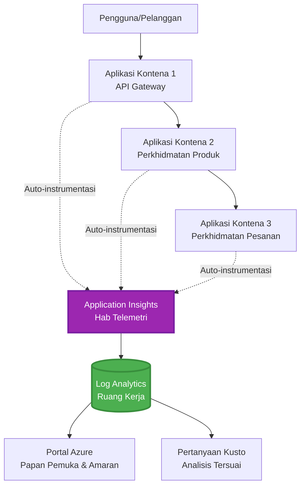
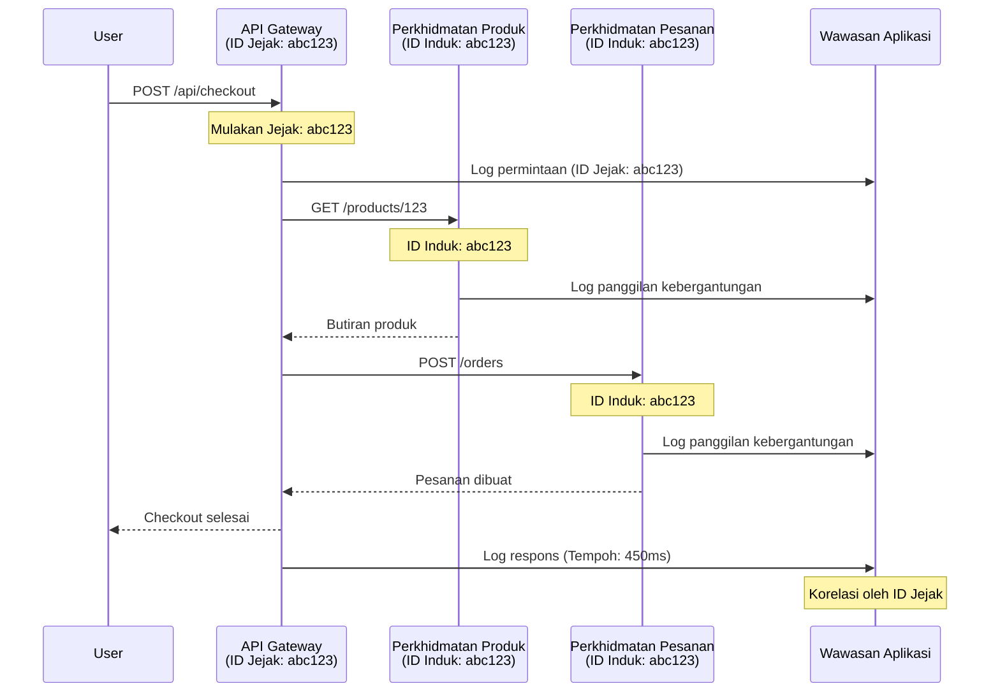

# Integrasi Application Insights dengan AZD

⏱️ **Anggaran Masa**: 40-50 minit | 💰 **Kos Anggaran**: ~$5-15/bulan | ⭐ **Tahap Kesukaran**: Pertengahan

**📚 Laluan Pembelajaran:**
- ← Sebelumnya: [Pemeriksaan Awal](preflight-checks.md) - Pengesahan sebelum pelaksanaan
- 🎯 **Anda Di Sini**: Integrasi Application Insights (Pemantauan, telemetri, debugging)
- → Seterusnya: [Panduan Pelaksanaan](../deployment/deployment-guide.md) - Melaksanakan ke Azure
- 🏠 [Halaman Utama Kursus](../../README.md)

---

## Apa yang Akan Anda Pelajari

Dengan menyelesaikan pelajaran ini, anda akan:
- Mengintegrasikan **Application Insights** ke dalam projek AZD secara automatik
- Mengkonfigurasi **pengesanan teragih** untuk perkhidmatan mikro
- Melaksanakan **telemetri tersuai** (metrik, acara, kebergantungan)
- Menyediakan **metrik langsung** untuk pemantauan masa nyata
- Membuat **amaran dan papan pemuka** daripada pelaksanaan AZD
- Menyelesaikan masalah pengeluaran dengan **pertanyaan telemetri**
- Mengoptimumkan **kos dan strategi pensampelan**
- Memantau **aplikasi AI/LLM** (token, latensi, kos)

## Mengapa Application Insights dengan AZD Penting

### Cabaran: Kebolehlihatan Pengeluaran

**Tanpa Application Insights:**
```
❌ No visibility into production behavior
❌ Manual log aggregation across services
❌ Reactive debugging (wait for customer complaints)
❌ No performance metrics
❌ Cannot trace requests across services
❌ Unknown failure rates and bottlenecks
```

**Dengan Application Insights + AZD:**
```
✅ Automatic telemetry collection
✅ Centralized logs from all services
✅ Proactive issue detection
✅ End-to-end request tracing
✅ Performance metrics and insights
✅ Real-time dashboards
✅ AZD provisions everything automatically
```

**Analogi**: Application Insights seperti mempunyai "kotak hitam" perakam penerbangan + papan pemuka kokpit untuk aplikasi anda. Anda dapat melihat segala yang berlaku secara masa nyata dan boleh memainkan semula sebarang insiden.

---

## Gambaran Keseluruhan Seni Bina

### Application Insights dalam Seni Bina AZD


### Apa yang Dipantau Secara Automatik

| Jenis Telemetri | Apa yang Ditangkap | Kes Penggunaan |
|------------------|--------------------|----------------|
| **Permintaan** | Permintaan HTTP, kod status, tempoh | Pemantauan prestasi API |
| **Kebergantungan** | Panggilan luaran (DB, API, storan) | Mengenal pasti kelembapan |
| **Pengecualian** | Ralat yang tidak ditangani dengan jejak tumpukan | Penyelesaian masalah kegagalan |
| **Acara Tersuai** | Acara perniagaan (pendaftaran, pembelian) | Analitik dan corong |
| **Metrik** | Kaunter prestasi, metrik tersuai | Perancangan kapasiti |
| **Jejak** | Mesej log dengan keterukan | Penyelesaian masalah dan pengauditan |
| **Ketersediaan** | Ujian masa tindak balas dan waktu operasi | Pemantauan SLA |

---

## Prasyarat

### Alat Diperlukan

```bash
# Sahkan Azure Developer CLI
azd version
# ✅ Dijangka: azd versi 1.0.0 atau lebih tinggi

# Sahkan Azure CLI
az --version
# ✅ Dijangka: azure-cli 2.50.0 atau lebih tinggi
```

### Keperluan Azure

- Langganan Azure aktif
- Kebenaran untuk membuat:
  - Sumber Application Insights
  - Ruang kerja Log Analytics
  - Aplikasi Container
  - Kumpulan sumber

### Prasyarat Pengetahuan

Anda sepatutnya telah menyelesaikan:
- [Asas AZD](../getting-started/azd-basics.md) - Konsep teras AZD
- [Konfigurasi](../getting-started/configuration.md) - Persediaan persekitaran
- [Projek Pertama](../getting-started/first-project.md) - Pelaksanaan asas

---

## Pelajaran 1: Application Insights Automatik dengan AZD

### Bagaimana AZD Menyediakan Application Insights

AZD secara automatik mencipta dan mengkonfigurasi Application Insights semasa anda melaksanakan. Mari lihat bagaimana ia berfungsi.

### Struktur Projek

```
monitored-app/
├── azure.yaml                     # AZD configuration
├── infra/
│   ├── main.bicep                # Main infrastructure
│   ├── core/
│   │   └── monitoring.bicep      # Application Insights + Log Analytics
│   └── app/
│       └── api.bicep             # Container App with monitoring
└── src/
    ├── app.py                    # Application with telemetry
    ├── requirements.txt
    └── Dockerfile
```

---

### Langkah 1: Konfigurasi AZD (azure.yaml)

**Fail: `azure.yaml`**

```yaml
name: monitored-app
metadata:
  template: monitored-app@1.0.0

services:
  api:
    project: ./src
    language: python
    host: containerapp

# AZD automatically provisions monitoring!
```

**Itu sahaja!** AZD akan mencipta Application Insights secara lalai. Tiada konfigurasi tambahan diperlukan untuk pemantauan asas.

---

### Langkah 2: Infrastruktur Pemantauan (Bicep)

**Fail: `infra/core/monitoring.bicep`**

```bicep
param logAnalyticsName string
param applicationInsightsName string
param location string = resourceGroup().location
param tags object = {}

// Log Analytics Workspace (required for Application Insights)
resource logAnalytics 'Microsoft.OperationalInsights/workspaces@2022-10-01' = {
  name: logAnalyticsName
  location: location
  tags: tags
  properties: {
    sku: {
      name: 'PerGB2018'  // Pay-as-you-go pricing
    }
    retentionInDays: 30  // Keep logs for 30 days
    features: {
      enableLogAccessUsingOnlyResourcePermissions: true
    }
  }
}

// Application Insights
resource applicationInsights 'Microsoft.Insights/components@2020-02-02' = {
  name: applicationInsightsName
  location: location
  tags: tags
  kind: 'web'
  properties: {
    Application_Type: 'web'
    WorkspaceResourceId: logAnalytics.id
    IngestionMode: 'LogAnalytics'
    publicNetworkAccessForIngestion: 'Enabled'
    publicNetworkAccessForQuery: 'Enabled'
  }
}

// Outputs for Container Apps
output logAnalyticsWorkspaceId string = logAnalytics.id
output logAnalyticsWorkspaceName string = logAnalytics.name
output applicationInsightsConnectionString string = applicationInsights.properties.ConnectionString
output applicationInsightsInstrumentationKey string = applicationInsights.properties.InstrumentationKey
output applicationInsightsName string = applicationInsights.name
```

---

### Langkah 3: Sambungkan Aplikasi Container ke Application Insights

**Fail: `infra/app/api.bicep`**

```bicep
param name string
param location string
param tags object = {}
param containerAppsEnvironmentName string
param applicationInsightsConnectionString string

resource containerApp 'Microsoft.App/containerApps@2023-05-01' = {
  name: name
  location: location
  tags: tags
  properties: {
    configuration: {
      ingress: {
        external: true
        targetPort: 8000
      }
      secrets: [
        {
          name: 'appinsights-connection-string'
          value: applicationInsightsConnectionString
        }
      ]
    }
    template: {
      containers: [
        {
          name: 'api'
          image: 'myregistry.azurecr.io/api:latest'
          resources: {
            cpu: json('0.5')
            memory: '1Gi'
          }
          env: [
            {
              name: 'APPLICATIONINSIGHTS_CONNECTION_STRING'
              secretRef: 'appinsights-connection-string'
            }
            {
              name: 'APPLICATIONINSIGHTS_ENABLED'
              value: 'true'
            }
          ]
        }
      ]
    }
  }
}

output uri string = 'https://${containerApp.properties.configuration.ingress.fqdn}'
```

---

### Langkah 4: Kod Aplikasi dengan Telemetri

**Fail: `src/app.py`**

```python
from flask import Flask, request, jsonify
from opencensus.ext.azure.log_exporter import AzureLogHandler
from opencensus.ext.azure.trace_exporter import AzureExporter
from opencensus.ext.flask.flask_middleware import FlaskMiddleware
from opencensus.trace.samplers import ProbabilitySampler
import logging
import os

app = Flask(__name__)

# Dapatkan rentetan sambungan Application Insights
connection_string = os.environ.get('APPLICATIONINSIGHTS_CONNECTION_STRING')

if connection_string:
    # Konfigurasikan pengesanan teragih
    middleware = FlaskMiddleware(
        app,
        exporter=AzureExporter(connection_string=connection_string),
        sampler=ProbabilitySampler(rate=1.0)  # 100% pensampelan untuk pembangunan
    )
    
    # Konfigurasikan log
    logger = logging.getLogger(__name__)
    logger.addHandler(AzureLogHandler(connection_string=connection_string))
    logger.setLevel(logging.INFO)
    
    print("✅ Application Insights enabled")
else:
    logger = logging.getLogger(__name__)
    logger.setLevel(logging.INFO)
    print("⚠️ Application Insights not configured")

@app.route('/health')
def health():
    logger.info('Health check endpoint called')
    return jsonify({'status': 'healthy', 'monitoring': 'enabled'})

@app.route('/api/products')
def get_products():
    logger.info('Fetching products')
    
    # Simulasikan panggilan pangkalan data (dikesan secara automatik sebagai kebergantungan)
    products = [
        {'id': 1, 'name': 'Laptop', 'price': 999.99},
        {'id': 2, 'name': 'Mouse', 'price': 29.99},
        {'id': 3, 'name': 'Keyboard', 'price': 79.99}
    ]
    
    logger.info(f'Returned {len(products)} products')
    return jsonify(products)

@app.route('/api/error-test')
def error_test():
    """Test error tracking"""
    logger.error('Testing error tracking')
    try:
        raise ValueError('This is a test exception')
    except Exception as e:
        logger.exception('Exception occurred in error-test endpoint')
        return jsonify({'error': str(e)}), 500

@app.route('/api/slow')
def slow_endpoint():
    """Test performance tracking"""
    import time
    logger.info('Slow endpoint called')
    time.sleep(3)  # Simulasikan operasi perlahan
    logger.warning('Endpoint took 3 seconds to respond')
    return jsonify({'message': 'Slow operation completed'})

if __name__ == '__main__':
    app.run(host='0.0.0.0', port=8000)
```

**Fail: `src/requirements.txt`**

```txt
Flask==3.0.0
opencensus-ext-azure==1.1.13
opencensus-ext-flask==0.8.1
gunicorn==21.2.0
```

---

### Langkah 5: Melaksanakan dan Mengesahkan

```bash
# Inisialisasi AZD
azd init

# Laksanakan (menyediakan Application Insights secara automatik)
azd up

# Dapatkan URL aplikasi
APP_URL=$(azd env get-values | grep API_URL | cut -d '=' -f2 | tr -d '"')

# Hasilkan telemetri
curl $APP_URL/health
curl $APP_URL/api/products
curl $APP_URL/api/error-test
curl $APP_URL/api/slow
```

**✅ Output Dijangka:**
```json
{
  "status": "healthy",
  "monitoring": "enabled"
}
```

---

### Langkah 6: Lihat Telemetri di Portal Azure

```bash
# Dapatkan butiran Application Insights
azd env get-values | grep APPLICATIONINSIGHTS

# Buka dalam Azure Portal
az monitor app-insights component show \
  --app $(azd env get-values | grep APPLICATIONINSIGHTS_NAME | cut -d '=' -f2 | tr -d '"') \
  --resource-group $(azd env get-values | grep AZURE_RESOURCE_GROUP | cut -d '=' -f2 | tr -d '"') \
  --query "appId" -o tsv
```

**Navigasi ke Portal Azure → Application Insights → Transaction Search**

Anda sepatutnya melihat:
- ✅ Permintaan HTTP dengan kod status
- ✅ Tempoh permintaan (3+ saat untuk `/api/slow`)
- ✅ Butiran pengecualian daripada `/api/error-test`
- ✅ Mesej log tersuai

---

## Pelajaran 2: Telemetri dan Acara Tersuai

### Jejak Acara Perniagaan

Mari tambahkan telemetri tersuai untuk acara penting perniagaan.

**Fail: `src/telemetry.py`**

```python
from opencensus.ext.azure import metrics_exporter
from opencensus.stats import aggregation as aggregation_module
from opencensus.stats import measure as measure_module
from opencensus.stats import stats as stats_module
from opencensus.stats import view as view_module
from opencensus.tags import tag_map as tag_map_module
from opencensus.ext.azure.log_exporter import AzureLogHandler
from opencensus.ext.azure.trace_exporter import AzureExporter
from opencensus.trace import tracer as tracer_module
import logging
import os

class TelemetryClient:
    """Custom telemetry client for Application Insights"""
    
    def __init__(self, connection_string=None):
        self.connection_string = connection_string or os.environ.get('APPLICATIONINSIGHTS_CONNECTION_STRING')
        
        if not self.connection_string:
            print("⚠️ Application Insights connection string not found")
            return
        
        # Tetapkan logger
        self.logger = logging.getLogger(__name__)
        self.logger.addHandler(AzureLogHandler(connection_string=self.connection_string))
        self.logger.setLevel(logging.INFO)
        
        # Tetapkan pengeksport metrik
        self.stats = stats_module.stats
        self.view_manager = self.stats.view_manager
        self.stats_recorder = self.stats.stats_recorder
        
        exporter = metrics_exporter.new_metrics_exporter(
            connection_string=self.connection_string
        )
        self.view_manager.register_exporter(exporter)
        
        # Tetapkan penjejak
        self.tracer = tracer_module.Tracer(
            exporter=AzureExporter(connection_string=self.connection_string)
        )
        
        print("✅ Custom telemetry client initialized")
    
    def track_event(self, event_name: str, properties: dict = None):
        """Track custom business event"""
        properties = properties or {}
        self.logger.info(
            f"CustomEvent: {event_name}",
            extra={
                'custom_dimensions': {
                    'event_name': event_name,
                    **properties
                }
            }
        )
    
    def track_metric(self, metric_name: str, value: float, properties: dict = None):
        """Track custom metric"""
        properties = properties or {}
        self.logger.info(
            f"CustomMetric: {metric_name} = {value}",
            extra={
                'custom_dimensions': {
                    'metric_name': metric_name,
                    'value': value,
                    **properties
                }
            }
        )
    
    def track_dependency(self, name: str, dependency_type: str, duration: float, success: bool):
        """Track external dependency call"""
        with self.tracer.span(name=name) as span:
            span.add_attribute('dependency.type', dependency_type)
            span.add_attribute('duration', duration)
            span.add_attribute('success', success)

# Klien telemetri global
telemetry = TelemetryClient()
```

### Kemas Kini Aplikasi dengan Acara Tersuai

**Fail: `src/app.py` (dipertingkatkan)**

```python
from flask import Flask, request, jsonify
from telemetry import telemetry
import time
import random

app = Flask(__name__)

@app.route('/api/purchase', methods=['POST'])
def purchase():
    """Track purchase event with custom telemetry"""
    data = request.json
    product_id = data.get('product_id')
    quantity = data.get('quantity', 1)
    price = data.get('price', 0)
    
    # Jejak acara perniagaan
    telemetry.track_event('Purchase', {
        'product_id': product_id,
        'quantity': quantity,
        'total_amount': price * quantity,
        'user_id': request.headers.get('X-User-Id', 'anonymous')
    })
    
    # Jejak metrik hasil
    telemetry.track_metric('Revenue', price * quantity, {
        'product_id': product_id,
        'currency': 'USD'
    })
    
    return jsonify({
        'order_id': f'ORD-{random.randint(1000, 9999)}',
        'status': 'confirmed',
        'total': price * quantity
    })

@app.route('/api/search')
def search():
    """Track search queries"""
    query = request.args.get('q', '')
    
    start_time = time.time()
    
    # Simulasikan carian (akan menjadi pertanyaan pangkalan data sebenar)
    results = [{'id': 1, 'name': f'Result for {query}'}]
    
    duration = (time.time() - start_time) * 1000  # Tukar kepada ms
    
    # Jejak acara carian
    telemetry.track_event('Search', {
        'query': query,
        'results_count': len(results),
        'duration_ms': duration
    })
    
    # Jejak metrik prestasi carian
    telemetry.track_metric('SearchDuration', duration, {
        'query_length': len(query)
    })
    
    return jsonify({'results': results, 'count': len(results)})

@app.route('/api/external-call')
def external_call():
    """Track external API dependency"""
    import requests
    
    start_time = time.time()
    success = True
    
    try:
        # Simulasikan panggilan API luaran
        response = requests.get('https://api.example.com/data', timeout=5)
        result = response.json()
    except Exception as e:
        success = False
        result = {'error': str(e)}
    
    duration = (time.time() - start_time) * 1000
    
    # Jejak kebergantungan
    telemetry.track_dependency(
        name='ExternalAPI',
        dependency_type='HTTP',
        duration=duration,
        success=success
    )
    
    return jsonify(result)

if __name__ == '__main__':
    app.run(host='0.0.0.0', port=8000)
```

### Uji Telemetri Tersuai

```bash
# Jejak acara pembelian
curl -X POST $APP_URL/api/purchase \
  -H "Content-Type: application/json" \
  -H "X-User-Id: user123" \
  -d '{"product_id": 1, "quantity": 2, "price": 29.99}'

# Jejak acara carian
curl "$APP_URL/api/search?q=laptop"

# Jejak kebergantungan luaran
curl $APP_URL/api/external-call
```

**Lihat di Portal Azure:**

Navigasi ke Application Insights → Logs, kemudian jalankan:

```kusto
// View purchase events
traces
| where customDimensions.event_name == "Purchase"
| project 
    timestamp,
    product_id = tostring(customDimensions.product_id),
    total_amount = todouble(customDimensions.total_amount),
    user_id = tostring(customDimensions.user_id)
| order by timestamp desc

// View revenue metrics
traces
| where customDimensions.metric_name == "Revenue"
| summarize TotalRevenue = sum(todouble(customDimensions.value)) by bin(timestamp, 1h)
| render timechart

// View search performance
traces
| where customDimensions.event_name == "Search"
| summarize 
    AvgDuration = avg(todouble(customDimensions.duration_ms)),
    SearchCount = count()
  by bin(timestamp, 5m)
| render timechart
```

---

## Pelajaran 3: Pengesanan Teragih untuk Perkhidmatan Mikro

### Aktifkan Pengesanan Lintas Perkhidmatan

Untuk perkhidmatan mikro, Application Insights secara automatik mengaitkan permintaan merentasi perkhidmatan.

**Fail: `infra/main.bicep`**

```bicep
targetScope = 'subscription'

param environmentName string
param location string = 'eastus'

var tags = { 'azd-env-name': environmentName }

resource rg 'Microsoft.Resources/resourceGroups@2021-04-01' = {
  name: 'rg-${environmentName}'
  location: location
  tags: tags
}

// Monitoring (shared by all services)
module monitoring './core/monitoring.bicep' = {
  name: 'monitoring'
  scope: rg
  params: {
    logAnalyticsName: 'log-${environmentName}'
    applicationInsightsName: 'appi-${environmentName}'
    location: location
    tags: tags
  }
}

// API Gateway
module apiGateway './app/api-gateway.bicep' = {
  name: 'api-gateway'
  scope: rg
  params: {
    name: 'ca-gateway-${environmentName}'
    location: location
    tags: union(tags, { 'azd-service-name': 'gateway' })
    applicationInsightsConnectionString: monitoring.outputs.applicationInsightsConnectionString
  }
}

// Product Service
module productService './app/product-service.bicep' = {
  name: 'product-service'
  scope: rg
  params: {
    name: 'ca-products-${environmentName}'
    location: location
    tags: union(tags, { 'azd-service-name': 'products' })
    applicationInsightsConnectionString: monitoring.outputs.applicationInsightsConnectionString
  }
}

// Order Service
module orderService './app/order-service.bicep' = {
  name: 'order-service'
  scope: rg
  params: {
    name: 'ca-orders-${environmentName}'
    location: location
    tags: union(tags, { 'azd-service-name': 'orders' })
    applicationInsightsConnectionString: monitoring.outputs.applicationInsightsConnectionString
  }
}

output APPLICATIONINSIGHTS_CONNECTION_STRING string = monitoring.outputs.applicationInsightsConnectionString
output GATEWAY_URL string = apiGateway.outputs.uri
```

### Lihat Transaksi Hujung ke Hujung


**Pertanyaan jejak hujung ke hujung:**

```kusto
// Find complete request flow
let traceId = "abc123...";  // Get from response header
dependencies
| union requests
| where operation_Id == traceId
| project 
    timestamp,
    type = itemType,
    name,
    duration,
    success,
    cloud_RoleName
| order by timestamp asc
```

---

## Pelajaran 4: Metrik Langsung dan Pemantauan Masa Nyata

### Aktifkan Aliran Metrik Langsung

Metrik Langsung menyediakan telemetri masa nyata dengan latensi <1 saat.

**Akses Metrik Langsung:**

```bash
# Dapatkan sumber Application Insights
APPI_NAME=$(azd env get-values | grep APPLICATIONINSIGHTS_NAME | cut -d '=' -f2 | tr -d '"')

# Dapatkan kumpulan sumber
RG_NAME=$(azd env get-values | grep AZURE_RESOURCE_GROUP | cut -d '=' -f2 | tr -d '"')

echo "Navigate to: Azure Portal → Resource Groups → $RG_NAME → $APPI_NAME → Live Metrics"
```

**Apa yang anda lihat secara masa nyata:**
- ✅ Kadar permintaan masuk (permintaan/saat)
- ✅ Panggilan kebergantungan keluar
- ✅ Bilangan pengecualian
- ✅ Penggunaan CPU dan memori
- ✅ Bilangan pelayan aktif
- ✅ Telemetri sampel

### Hasilkan Beban untuk Ujian

```bash
# Hasilkan beban untuk melihat metrik langsung
for i in {1..100}; do
  curl $APP_URL/api/products &
  curl $APP_URL/api/search?q=test$i &
done

# Lihat metrik langsung di Portal Azure
# Anda sepatutnya melihat lonjakan kadar permintaan
```

---

## Latihan Praktikal

### Latihan 1: Sediakan Amaran ⭐⭐ (Sederhana)

**Matlamat**: Buat amaran untuk kadar ralat tinggi dan tindak balas perlahan.

**Langkah:**

1. **Buat amaran untuk kadar ralat:**

```bash
# Dapatkan ID sumber Application Insights
APPI_ID=$(az monitor app-insights component show \
  --app $APPI_NAME \
  --resource-group $RG_NAME \
  --query "id" -o tsv)

# Cipta amaran metrik untuk permintaan yang gagal
az monitor metrics alert create \
  --name "High-Error-Rate" \
  --resource-group $RG_NAME \
  --scopes $APPI_ID \
  --condition "count requests/failed > 10" \
  --window-size 5m \
  --evaluation-frequency 1m \
  --description "Alert when error rate exceeds 10 per 5 minutes"
```

2. **Buat amaran untuk tindak balas perlahan:**

```bash
az monitor metrics alert create \
  --name "Slow-Responses" \
  --resource-group $RG_NAME \
  --scopes $APPI_ID \
  --condition "avg requests/duration > 3000" \
  --window-size 5m \
  --evaluation-frequency 1m \
  --description "Alert when average response time exceeds 3 seconds"
```

3. **Buat amaran melalui Bicep (disyorkan untuk AZD):**

**Fail: `infra/core/alerts.bicep`**

```bicep
param applicationInsightsId string
param actionGroupId string = ''
param location string = resourceGroup().location

// High error rate alert
resource errorRateAlert 'Microsoft.Insights/metricAlerts@2018-03-01' = {
  name: 'high-error-rate'
  location: 'global'
  properties: {
    description: 'Alert when error rate exceeds threshold'
    severity: 2
    enabled: true
    scopes: [
      applicationInsightsId
    ]
    evaluationFrequency: 'PT1M'
    windowSize: 'PT5M'
    criteria: {
      'odata.type': 'Microsoft.Azure.Monitor.SingleResourceMultipleMetricCriteria'
      allOf: [
        {
          name: 'Error rate'
          metricName: 'requests/failed'
          operator: 'GreaterThan'
          threshold: 10
          timeAggregation: 'Count'
        }
      ]
    }
    actions: actionGroupId != '' ? [
      {
        actionGroupId: actionGroupId
      }
    ] : []
  }
}

// Slow response alert
resource slowResponseAlert 'Microsoft.Insights/metricAlerts@2018-03-01' = {
  name: 'slow-responses'
  location: 'global'
  properties: {
    description: 'Alert when response time is too high'
    severity: 3
    enabled: true
    scopes: [
      applicationInsightsId
    ]
    evaluationFrequency: 'PT1M'
    windowSize: 'PT5M'
    criteria: {
      'odata.type': 'Microsoft.Azure.Monitor.SingleResourceMultipleMetricCriteria'
      allOf: [
        {
          name: 'Response duration'
          metricName: 'requests/duration'
          operator: 'GreaterThan'
          threshold: 3000
          timeAggregation: 'Average'
        }
      ]
    }
  }
}

output errorAlertId string = errorRateAlert.id
output slowResponseAlertId string = slowResponseAlert.id
```

4. **Uji amaran:**

```bash
# Hasilkan ralat
for i in {1..20}; do
  curl $APP_URL/api/error-test
done

# Hasilkan tindak balas perlahan
for i in {1..10}; do
  curl $APP_URL/api/slow
done

# Periksa status amaran (tunggu 5-10 minit)
az monitor metrics alert list \
  --resource-group $RG_NAME \
  --query "[].{Name:name, Enabled:enabled, State:properties.enabled}" \
  --output table
```

**✅ Kriteria Kejayaan:**
- ✅ Amaran berjaya dibuat
- ✅ Amaran diaktifkan apabila ambang dilebihi
- ✅ Boleh melihat sejarah amaran di Portal Azure
- ✅ Disepadukan dengan pelaksanaan AZD

**Masa**: 20-25 minit

---

### Latihan 2: Buat Papan Pemuka Tersuai ⭐⭐ (Sederhana)

**Matlamat**: Bina papan pemuka yang menunjukkan metrik utama aplikasi.

**Langkah:**

1. **Buat papan pemuka melalui Portal Azure:**

Navigasi ke: Portal Azure → Dashboards → New Dashboard

2. **Tambah jubin untuk metrik utama:**

- Bilangan permintaan (24 jam terakhir)
- Masa tindak balas purata
- Kadar ralat
- 5 operasi paling perlahan
- Pengedaran geografi pengguna

3. **Buat papan pemuka melalui Bicep:**

**Fail: `infra/core/dashboard.bicep`**

```bicep
param dashboardName string
param applicationInsightsId string
param location string = resourceGroup().location

resource dashboard 'Microsoft.Portal/dashboards@2020-09-01-preview' = {
  name: dashboardName
  location: location
  properties: {
    lenses: [
      {
        order: 0
        parts: [
          // Request count
          {
            position: { x: 0, y: 0, rowSpan: 4, colSpan: 6 }
            metadata: {
              type: 'Extension/Microsoft_OperationsManagementSuite_Workspace/PartType/LogsDashboardPart'
              inputs: [
                {
                  name: 'resourceId'
                  value: applicationInsightsId
                }
                {
                  name: 'query'
                  value: '''
                    requests
                    | summarize RequestCount = count() by bin(timestamp, 1h)
                    | render timechart
                  '''
                }
              ]
            }
          }
          // Error rate
          {
            position: { x: 6, y: 0, rowSpan: 4, colSpan: 6 }
            metadata: {
              type: 'Extension/Microsoft_OperationsManagementSuite_Workspace/PartType/LogsDashboardPart'
              inputs: [
                {
                  name: 'resourceId'
                  value: applicationInsightsId
                }
                {
                  name: 'query'
                  value: '''
                    requests
                    | summarize 
                        Total = count(),
                        Failed = countif(success == false)
                    | extend ErrorRate = (Failed * 100.0) / Total
                    | project ErrorRate
                  '''
                }
              ]
            }
          }
        ]
      }
    ]
  }
}

output dashboardId string = dashboard.id
```

4. **Laksanakan papan pemuka:**

```bash
# Tambah ke main.bicep
module dashboard './core/dashboard.bicep' = {
  name: 'dashboard'
  scope: rg
  params: {
    dashboardName: 'dashboard-${environmentName}'
    applicationInsightsId: monitoring.outputs.applicationInsightsId
    location: location
  }
}

# Laksanakan
azd up
```

**✅ Kriteria Kejayaan:**
- ✅ Papan pemuka memaparkan metrik utama
- ✅ Boleh dipin ke halaman utama Portal Azure
- ✅ Dikemas kini secara masa nyata
- ✅ Boleh dilaksanakan melalui AZD

**Masa**: 25-30 minit

---

### Latihan 3: Pantau Aplikasi AI/LLM ⭐⭐⭐ (Lanjutan)

**Matlamat**: Jejak penggunaan Azure OpenAI (token, kos, latensi).

**Langkah:**

1. **Buat pembungkus pemantauan AI:**

**Fail: `src/ai_telemetry.py`**

```python
from telemetry import telemetry
from openai import AzureOpenAI
import time

class MonitoredAzureOpenAI:
    """Azure OpenAI client with automatic telemetry"""
    
    def __init__(self, api_key, endpoint, api_version="2024-02-01"):
        self.client = AzureOpenAI(
            api_key=api_key,
            api_version=api_version,
            azure_endpoint=endpoint
        )
    
    def chat_completion(self, model: str, messages: list, **kwargs):
        """Track chat completion with telemetry"""
        start_time = time.time()
        
        try:
            # Panggil Azure OpenAI
            response = self.client.chat.completions.create(
                model=model,
                messages=messages,
                **kwargs
            )
            
            duration = (time.time() - start_time) * 1000  # ms
            
            # Ekstrak penggunaan
            usage = response.usage
            prompt_tokens = usage.prompt_tokens
            completion_tokens = usage.completion_tokens
            total_tokens = usage.total_tokens
            
            # Kira kos (harga GPT-4)
            prompt_cost = (prompt_tokens / 1000) * 0.03  # $0.03 setiap 1K token
            completion_cost = (completion_tokens / 1000) * 0.06  # $0.06 setiap 1K token
            total_cost = prompt_cost + completion_cost
            
            # Jejak acara tersuai
            telemetry.track_event('OpenAI_Request', {
                'model': model,
                'prompt_tokens': prompt_tokens,
                'completion_tokens': completion_tokens,
                'total_tokens': total_tokens,
                'duration_ms': duration,
                'cost_usd': total_cost,
                'success': True
            })
            
            # Jejak metrik
            telemetry.track_metric('OpenAI_Tokens', total_tokens, {
                'model': model,
                'type': 'total'
            })
            
            telemetry.track_metric('OpenAI_Cost', total_cost, {
                'model': model,
                'currency': 'USD'
            })
            
            telemetry.track_metric('OpenAI_Duration', duration, {
                'model': model
            })
            
            return response
            
        except Exception as e:
            duration = (time.time() - start_time) * 1000
            
            telemetry.track_event('OpenAI_Request', {
                'model': model,
                'duration_ms': duration,
                'success': False,
                'error': str(e)
            })
            
            raise
```

2. **Gunakan klien yang dipantau:**

```python
from flask import Flask, request, jsonify
from ai_telemetry import MonitoredAzureOpenAI
import os

app = Flask(__name__)

# Inisialisasi klien OpenAI yang dipantau
openai_client = MonitoredAzureOpenAI(
    api_key=os.environ['AZURE_OPENAI_API_KEY'],
    endpoint=os.environ['AZURE_OPENAI_ENDPOINT']
)

@app.route('/api/chat', methods=['POST'])
def chat():
    data = request.json
    user_message = data.get('message')
    
    # Panggil dengan pemantauan automatik
    response = openai_client.chat_completion(
        model='gpt-4',
        messages=[
            {'role': 'user', 'content': user_message}
        ]
    )
    
    return jsonify({
        'response': response.choices[0].message.content,
        'tokens': response.usage.total_tokens
    })
```

3. **Pertanyaan metrik AI:**

```kusto
// Total AI spend over time
traces
| where customDimensions.event_name == "OpenAI_Request"
| where customDimensions.success == "True"
| summarize TotalCost = sum(todouble(customDimensions.cost_usd)) by bin(timestamp, 1h)
| render timechart

// Token usage by model
traces
| where customDimensions.event_name == "OpenAI_Request"
| summarize 
    TotalTokens = sum(toint(customDimensions.total_tokens)),
    RequestCount = count()
  by Model = tostring(customDimensions.model)

// Average latency
traces
| where customDimensions.event_name == "OpenAI_Request"
| summarize AvgDuration = avg(todouble(customDimensions.duration_ms))
| project AvgDurationSeconds = AvgDuration / 1000

// Cost per request
traces
| where customDimensions.event_name == "OpenAI_Request"
| extend Cost = todouble(customDimensions.cost_usd)
| summarize 
    TotalCost = sum(Cost),
    RequestCount = count(),
    AvgCostPerRequest = avg(Cost)
```

**✅ Kriteria Kejayaan:**
- ✅ Setiap panggilan OpenAI dijejak secara automatik
- ✅ Penggunaan token dan kos kelihatan
- ✅ Latensi dipantau
- ✅ Boleh menetapkan amaran bajet

**Masa**: 35-45 minit

---

## Pengoptimuman Kos

### Strategi Pensampelan

Kawal kos dengan pensampelan telemetri:

```python
from opencensus.trace.samplers import ProbabilitySampler

# Pembangunan: 100% pensampelan
sampler = ProbabilitySampler(rate=1.0)

# Pengeluaran: 10% pensampelan (mengurangkan kos sebanyak 90%)
sampler = ProbabilitySampler(rate=0.1)

# Pensampelan adaptif (menyesuaikan secara automatik)
from opencensus.trace.samplers import AdaptiveSampler
sampler = AdaptiveSampler()
```

**Dalam Bicep:**

```bicep
resource applicationInsights 'Microsoft.Insights/components@2020-02-02' = {
  name: applicationInsightsName
  properties: {
    SamplingPercentage: 10  // 10% sampling
  }
}
```

### Pengekalan Data

```bicep
resource logAnalytics 'Microsoft.OperationalInsights/workspaces@2022-10-01' = {
  name: logAnalyticsName
  properties: {
    retentionInDays: 30  // Minimum (cheapest)
    // Options: 30, 31, 60, 90, 120, 180, 270, 365, 550, 730
  }
}
```

### Anggaran Kos Bulanan

| Jumlah Data | Pengekalan | Kos Bulanan |
|-------------|------------|-------------|
| 1 GB/bulan | 30 hari | ~$2-5 |
| 5 GB/bulan | 30 hari | ~$10-15 |
| 10 GB/bulan | 90 hari | ~$25-40 |
| 50 GB/bulan | 90 hari | ~$100-150 |

**Tier percuma**: 5 GB/bulan disertakan

---

## Titik Pemeriksaan Pengetahuan

### 1. Integrasi Asas ✓

Uji pemahaman anda:

- [ ] **S1**: Bagaimana AZD menyediakan Application Insights?
  - **J**: Secara automatik melalui templat Bicep dalam `infra/core/monitoring.bicep`

- [ ] **S2**: Apakah pemboleh ubah persekitaran yang mengaktifkan Application Insights?
  - **J**: `APPLICATIONINSIGHTS_CONNECTION_STRING`

- [ ] **S3**: Apakah tiga jenis telemetri utama?
  - **J**: Permintaan (panggilan HTTP), Kebergantungan (panggilan luaran), Pengecualian (ralat)

**Pengesahan Hands-On:**
```bash
# Periksa jika Application Insights dikonfigurasi
azd env get-values | grep APPLICATIONINSIGHTS

# Sahkan telemetri sedang mengalir
az monitor app-insights metrics show \
  --app $APPI_NAME \
  --resource-group $RG_NAME \
  --metric "requests/count"
```

---

### 2. Telemetri Tersuai ✓

Uji pemahaman anda:

- [ ] **S1**: Bagaimana anda menjejak acara perniagaan tersuai?
  - **J**: Gunakan logger dengan `custom_dimensions` atau `TelemetryClient.track_event()`

- [ ] **S2**: Apakah perbezaan antara acara dan metrik?
  - **J**: Acara adalah kejadian diskret, metrik adalah pengukuran berangka

- [ ] **S3**: Bagaimana anda mengaitkan telemetri merentasi perkhidmatan?
  - **J**: Application Insights secara automatik menggunakan `operation_Id` untuk pengaitan

**Pengesahan Hands-On:**
```kusto
// Verify custom events
traces
| where customDimensions.event_name != ""
| summarize count() by tostring(customDimensions.event_name)
```

---

### 3. Pemantauan Pengeluaran ✓

Uji pemahaman anda:

- [ ] **S1**: Apakah pensampelan dan mengapa menggunakannya?
  - **J**: Pensampelan mengurangkan jumlah data (dan kos) dengan hanya menangkap peratusan telemetri

- [ ] **S2**: Bagaimana anda menyediakan amaran?
  - **J**: Gunakan amaran metrik dalam Bicep atau Portal Azure berdasarkan metrik Application Insights

- [ ] **S3**: Apakah perbezaan antara Log Analytics dan Application Insights?
  - **J**: Application Insights menyimpan data dalam ruang kerja Log Analytics; App Insights menyediakan pandangan khusus aplikasi

**Pengesahan Hands-On:**
```bash
# Periksa konfigurasi pensampelan
az monitor app-insights component show \
  --app $APPI_NAME \
  --resource-group $RG_NAME \
  --query "properties.SamplingPercentage"
```

---

## Amalan Terbaik

### ✅ LAKUKAN:

1. **Gunakan ID pengaitan**
   ```python
   logger.info('Processing order', extra={
       'custom_dimensions': {
           'order_id': order_id,
           'user_id': user_id
       }
   })
   ```

2. **Sediakan amaran untuk metrik kritikal**
   ```bicep
   // Error rate, slow responses, availability
   ```

3. **Gunakan log berstruktur**
   ```python
   # ✅ BAIK: Berstruktur
   logger.info('User signup', extra={'custom_dimensions': {'user_id': 123}})
   
   # ❌ BURUK: Tidak berstruktur
   logger.info(f'User 123 signed up')
   ```

4. **Pantau kebergantungan**
   ```python
   # Jejaki panggilan pangkalan data, permintaan HTTP, dan lain-lain secara automatik.
   ```

5. **Gunakan Metrik Langsung semasa pelaksanaan**

### ❌ JANGAN:

1. **Jangan log data sensitif**
   ```python
   # ❌ BURUK
   logger.info(f'Login: {username}:{password}')
   
   # ✅ BAIK
   logger.info('Login attempt', extra={'custom_dimensions': {'username': username}})
   ```

2. **Jangan gunakan pensampelan 100% dalam pengeluaran**
   ```python
   # ❌ Mahal
   sampler = ProbabilitySampler(rate=1.0)
   
   # ✅ Berpatutan
   sampler = ProbabilitySampler(rate=0.1)
   ```

3. **Jangan abaikan antrian surat mati**

4. **Jangan lupa menetapkan had pengekalan data**

---

## Penyelesaian Masalah

### Masalah: Tiada telemetri muncul

**Diagnosis:**
```bash
# Periksa rentetan sambungan telah ditetapkan
azd env get-values | grep APPLICATIONINSIGHTS

# Periksa log aplikasi
azd logs api --tail 50
```

**Penyelesaian:**
```bash
# Sahkan rentetan sambungan dalam Aplikasi Kontena
az containerapp show \
  --name $APP_NAME \
  --resource-group $RG_NAME \
  --query "properties.template.containers[0].env" \
  | grep -i applicationinsights
```

---

### Masalah: Kos tinggi

**Diagnosis:**
```bash
# Periksa pengambilan data
az monitor app-insights metrics show \
  --app $APPI_NAME \
  --resource-group $RG_NAME \
  --metric "availabilityResults/count"
```

**Penyelesaian:**
- Kurangkan kadar pensampelan
- Kurangkan tempoh pengekalan
- Buang log yang terlalu terperinci

---

## Ketahui Lebih Lanjut

### Dokumentasi Rasmi
- [Gambaran Keseluruhan Application Insights](https://learn.microsoft.com/azure/azure-monitor/app/app-insights-overview)
- [Application Insights untuk Python](https://learn.microsoft.com/azure/azure-monitor/app/opencensus-python)
- [Bahasa Pertanyaan Kusto](https://learn.microsoft.com/azure/data-explorer/kusto/query/)
- [Pemantauan AZD](https://learn.microsoft.com/azure/developer/azure-developer-cli/monitor-your-app)

### Langkah Seterusnya dalam Kursus Ini
- ← Sebelumnya: [Pemeriksaan Awal](preflight-checks.md)
- → Seterusnya: [Panduan Pelaksanaan](../deployment/deployment-guide.md)
- 🏠 [Halaman Utama Kursus](../../README.md)

### Contoh Berkaitan
- [Contoh Azure OpenAI](../../../../examples/azure-openai-chat) - Telemetri AI
- [Contoh Perkhidmatan Mikro](../../../../examples/microservices) - Pengesanan teragih

---

## Ringkasan

**Anda telah belajar:**
- ✅ Penyediaan Application Insights automatik dengan AZD
- ✅ Telemetri tersuai (acara, metrik, kebergantungan)
- ✅ Pengesanan teragih merentasi perkhidmatan mikro
- ✅ Metrik langsung dan pemantauan masa nyata
- ✅ Amaran dan papan pemuka
- ✅ Pemantauan aplikasi AI/LLM
- ✅ Strategi pengoptimuman kos

**Perkara Penting:**
1. **AZD menyediakan pemantauan secara automatik** - Tiada persediaan manual diperlukan
2. **Gunakan log berstruktur** - Memudahkan pertanyaan data
3. **Jejak acara perniagaan** - Bukan hanya metrik teknikal
4. **Pantau kos AI** - Jejak token dan perbelanjaan
5. **Tetapkan amaran** - Bersikap proaktif, bukan reaktif
6. **Optimumkan kos** - Gunakan pensampelan dan had pengekalan

**Langkah Seterusnya:**
1. Selesaikan latihan praktikal
2. Tambahkan Application Insights ke dalam projek AZD anda
3. Cipta papan pemuka tersuai untuk pasukan anda
4. Pelajari [Panduan Penerapan](../deployment/deployment-guide.md)

---

<!-- CO-OP TRANSLATOR DISCLAIMER START -->
**Penafian**:  
Dokumen ini telah diterjemahkan menggunakan perkhidmatan terjemahan AI [Co-op Translator](https://github.com/Azure/co-op-translator). Walaupun kami berusaha untuk ketepatan, sila ambil perhatian bahawa terjemahan automatik mungkin mengandungi kesilapan atau ketidaktepatan. Dokumen asal dalam bahasa asalnya harus dianggap sebagai sumber yang berwibawa. Untuk maklumat penting, terjemahan manusia profesional adalah disyorkan. Kami tidak bertanggungjawab atas sebarang salah faham atau salah tafsir yang timbul daripada penggunaan terjemahan ini.
<!-- CO-OP TRANSLATOR DISCLAIMER END -->