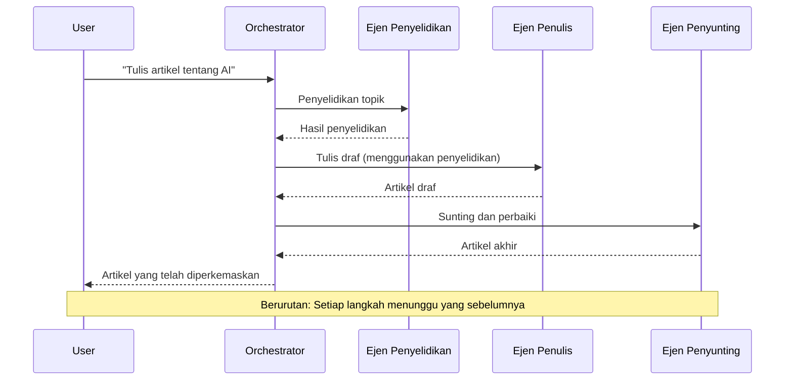
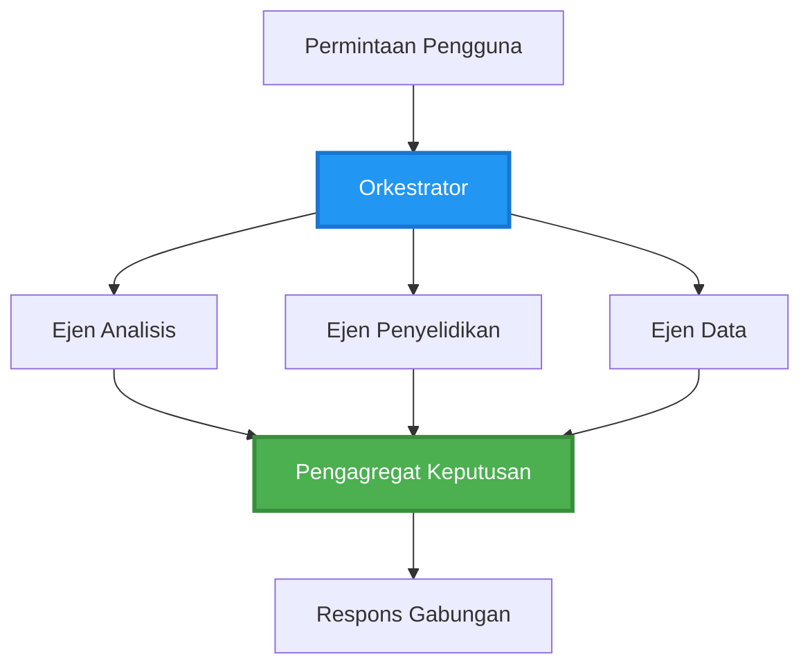
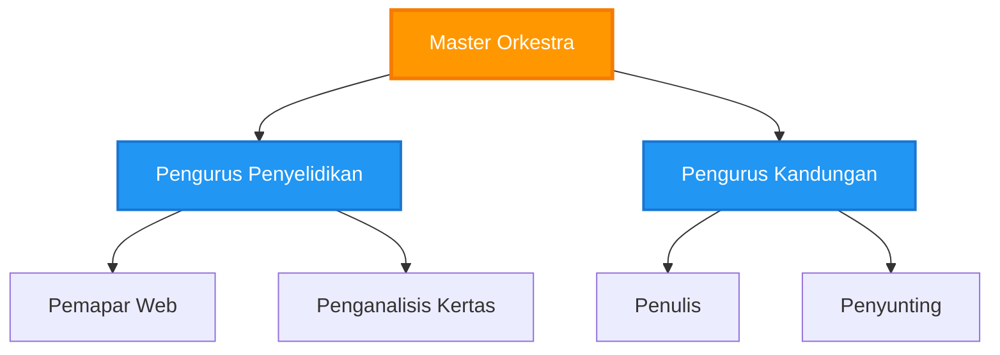
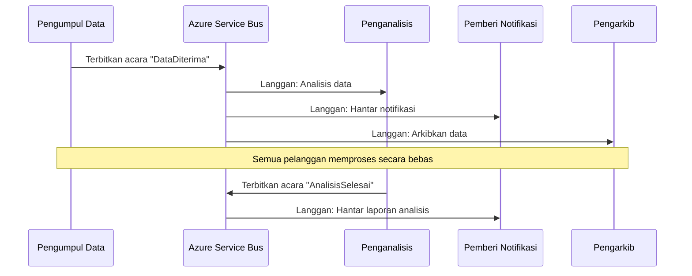
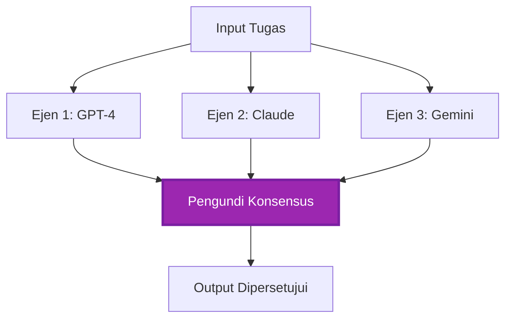
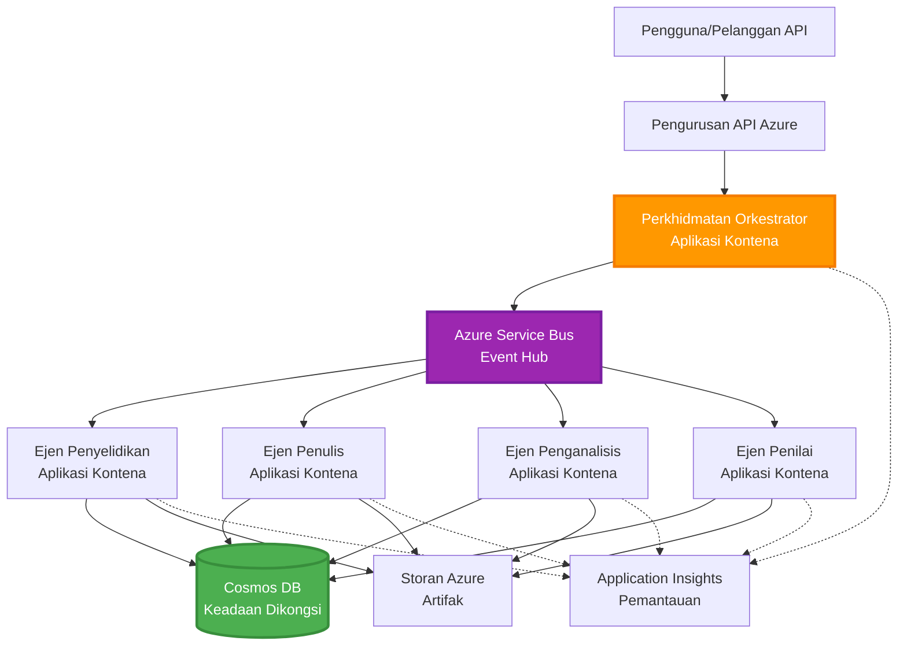

<!--
CO_OP_TRANSLATOR_METADATA:
{
  "original_hash": "bcefbd5d0107691ef3e6e33ba694d6f4",
  "translation_date": "2025-11-22T11:19:55+00:00",
  "source_file": "docs/pre-deployment/coordination-patterns.md",
  "language_code": "ms"
}
-->
# Corak Koordinasi Multi-Ejen

⏱️ **Anggaran Masa**: 60-75 minit | 💰 **Anggaran Kos**: ~$100-300/bulan | ⭐ **Kerumitan**: Lanjutan

**📚 Laluan Pembelajaran:**
- ← Sebelumnya: [Perancangan Kapasiti](capacity-planning.md) - Strategi saiz dan penskalaan sumber
- 🎯 **Anda Di Sini**: Corak Koordinasi Multi-Ejen (Orkestrasi, komunikasi, pengurusan keadaan)
- → Seterusnya: [Pemilihan SKU](sku-selection.md) - Memilih perkhidmatan Azure yang sesuai
- 🏠 [Halaman Kursus](../../README.md)

---

## Apa yang Akan Anda Pelajari

Dengan melengkapkan pelajaran ini, anda akan:
- Memahami corak **senibina multi-ejen** dan bila untuk menggunakannya
- Melaksanakan corak **orkestrasi** (berpusat, terdesentralisasi, hierarki)
- Merancang strategi **komunikasi ejen** (segerak, tak segerak, berasaskan acara)
- Menguruskan **keadaan bersama** di kalangan ejen yang diedarkan
- Melancarkan **sistem multi-ejen** di Azure dengan AZD
- Mengaplikasikan **corak koordinasi** untuk senario AI dunia sebenar
- Memantau dan menyahpepijat sistem ejen yang diedarkan

## Kenapa Koordinasi Multi-Ejen Penting

### Evolusi: Dari Ejen Tunggal ke Multi-Ejen

**Ejen Tunggal (Mudah):**
```
User → Agent → Response
```
- ✅ Mudah difahami dan dilaksanakan
- ✅ Cepat untuk tugas mudah
- ❌ Terhad oleh keupayaan model tunggal
- ❌ Tidak boleh memparallelkan tugas kompleks
- ❌ Tiada pengkhususan

**Sistem Multi-Ejen (Lanjutan):**
```
           ┌─────────────┐
           │ Orchestrator│
           └──────┬──────┘
        ┌─────────┼─────────┐
        │         │         │
    ┌───▼──┐  ┌──▼───┐  ┌──▼────┐
    │Agent1│  │Agent2│  │Agent3 │
    │(Plan)│  │(Code)│  │(Review)│
    └──────┘  └──────┘  └───────┘
```
- ✅ Ejen khusus untuk tugas tertentu
- ✅ Pelaksanaan selari untuk kelajuan
- ✅ Modular dan mudah diselenggara
- ✅ Lebih baik untuk aliran kerja kompleks
- ⚠️ Memerlukan logik koordinasi

**Analogi**: Ejen tunggal seperti seorang individu yang melakukan semua tugas. Multi-ejen seperti pasukan di mana setiap ahli mempunyai kemahiran khusus (penyelidik, penulis kod, pengulas, penulis) yang bekerja bersama.

---

## Corak Koordinasi Teras

### Corak 1: Koordinasi Berurutan (Rantai Tanggungjawab)

**Bila untuk digunakan**: Tugas mesti diselesaikan dalam urutan tertentu, setiap ejen membina hasil sebelumnya.


**Kelebihan:**
- ✅ Aliran data yang jelas
- ✅ Mudah untuk menyahpepijat
- ✅ Urutan pelaksanaan yang boleh diramal

**Kekurangan:**
- ❌ Lebih perlahan (tiada pelaksanaan selari)
- ❌ Kegagalan satu ejen menyekat keseluruhan rantai
- ❌ Tidak boleh mengendalikan tugas saling bergantung

**Contoh Penggunaan:**
- Saluran penciptaan kandungan (penyelidikan → penulisan → penyuntingan → penerbitan)
- Penjanaan kod (perancangan → pelaksanaan → ujian → pelancaran)
- Penjanaan laporan (pengumpulan data → analisis → visualisasi → ringkasan)

---

### Corak 2: Koordinasi Selari (Fan-Out/Fan-In)

**Bila untuk digunakan**: Tugas bebas boleh dijalankan serentak, hasil digabungkan di akhir.


**Kelebihan:**
- ✅ Cepat (pelaksanaan selari)
- ✅ Tahan kegagalan (hasil separa boleh diterima)
- ✅ Skala secara mendatar

**Kekurangan:**
- ⚠️ Hasil mungkin tiba tidak mengikut urutan
- ⚠️ Memerlukan logik pengagregatan
- ⚠️ Pengurusan keadaan yang kompleks

**Contoh Penggunaan:**
- Pengumpulan data dari pelbagai sumber (API + pangkalan data + pengikisan web)
- Analisis kompetitif (pelbagai model menghasilkan penyelesaian, yang terbaik dipilih)
- Perkhidmatan terjemahan (terjemah ke pelbagai bahasa secara serentak)

---

### Corak 3: Koordinasi Hierarki (Pengurus-Pekerja)

**Bila untuk digunakan**: Aliran kerja kompleks dengan sub-tugas, delegasi diperlukan.


**Kelebihan:**
- ✅ Mengendalikan aliran kerja kompleks
- ✅ Modular dan mudah diselenggara
- ✅ Sempadan tanggungjawab yang jelas

**Kekurangan:**
- ⚠️ Senibina lebih kompleks
- ⚠️ Latensi lebih tinggi (lapisan koordinasi berganda)
- ⚠️ Memerlukan orkestrasi yang canggih

**Contoh Penggunaan:**
- Pemprosesan dokumen perusahaan (klasifikasi → penghalaan → pemprosesan → arkib)
- Saluran data pelbagai peringkat (pengambilan → pembersihan → transformasi → analisis → laporan)
- Aliran kerja automasi kompleks (perancangan → peruntukan sumber → pelaksanaan → pemantauan)

---

### Corak 4: Koordinasi Berasaskan Acara (Publish-Subscribe)

**Bila untuk digunakan**: Ejen perlu bertindak balas kepada acara, sambungan longgar diinginkan.


**Kelebihan:**
- ✅ Sambungan longgar antara ejen
- ✅ Mudah menambah ejen baru (hanya melanggan)
- ✅ Pemprosesan tak segerak
- ✅ Tahan lasak (kekekalan mesej)

**Kekurangan:**
- ⚠️ Konsistensi akhirnya
- ⚠️ Penyahpepijatan kompleks
- ⚠️ Cabaran pengurutan mesej

**Contoh Penggunaan:**
- Sistem pemantauan masa nyata (amaran, papan pemuka, log)
- Pemberitahuan pelbagai saluran (e-mel, SMS, push, Slack)
- Saluran pemprosesan data (pelbagai pengguna data yang sama)

---

### Corak 5: Koordinasi Berasaskan Konsensus (Pengundian/Kuorum)

**Bila untuk digunakan**: Memerlukan persetujuan dari pelbagai ejen sebelum meneruskan.


**Kelebihan:**
- ✅ Ketepatan lebih tinggi (pendapat pelbagai)
- ✅ Tahan kegagalan (kegagalan minoriti boleh diterima)
- ✅ Jaminan kualiti terbina dalam

**Kekurangan:**
- ❌ Mahal (panggilan model berganda)
- ❌ Lebih perlahan (menunggu semua ejen)
- ⚠️ Memerlukan penyelesaian konflik

**Contoh Penggunaan:**
- Moderasi kandungan (pelbagai model menyemak kandungan)
- Semakan kod (pelbagai linter/penganalisis)
- Diagnosis perubatan (pelbagai model AI, pengesahan pakar)

---

## Gambaran Keseluruhan Senibina

### Sistem Multi-Ejen Lengkap di Azure


**Komponen Utama:**

| Komponen | Tujuan | Perkhidmatan Azure |
|----------|--------|--------------------|
| **API Gateway** | Titik masuk, had kadar, pengesahan | API Management |
| **Orkestrator** | Menyelaraskan aliran kerja ejen | Container Apps |
| **Message Queue** | Komunikasi tak segerak | Service Bus / Event Hubs |
| **Ejen** | Pekerja AI khusus | Container Apps / Functions |
| **State Store** | Keadaan bersama, penjejakan tugas | Cosmos DB |
| **Artifact Storage** | Dokumen, hasil, log | Blob Storage |
| **Pemantauan** | Penjejakan diedarkan, log | Application Insights |

---

## Prasyarat

### Alat Diperlukan

```bash
# Sahkan Azure Developer CLI
azd version
# ✅ Dijangka: azd versi 1.0.0 atau lebih tinggi

# Sahkan Azure CLI
az --version
# ✅ Dijangka: azure-cli 2.50.0 atau lebih tinggi

# Sahkan Docker (untuk ujian tempatan)
docker --version
# ✅ Dijangka: Docker versi 20.10 atau lebih tinggi
```

### Keperluan Azure

- Langganan Azure aktif
- Kebenaran untuk mencipta:
  - Container Apps
  - Nama ruang Service Bus
  - Akaun Cosmos DB
  - Akaun storan
  - Application Insights

### Prasyarat Pengetahuan

Anda sepatutnya telah melengkapkan:
- [Pengurusan Konfigurasi](../getting-started/configuration.md)
- [Pengesahan & Keselamatan](../getting-started/authsecurity.md)
- [Contoh Mikroservis](../../../../examples/microservices)

---

## Panduan Pelaksanaan

### Struktur Projek

```
multi-agent-system/
├── azure.yaml                    # AZD configuration
├── infra/
│   ├── main.bicep               # Main infrastructure
│   ├── core/
│   │   ├── servicebus.bicep     # Message queue
│   │   ├── cosmos.bicep         # State store
│   │   ├── storage.bicep        # Artifact storage
│   │   └── monitoring.bicep     # Application Insights
│   └── app/
│       ├── orchestrator.bicep   # Orchestrator service
│       └── agent.bicep          # Agent template
└── src/
    ├── orchestrator/            # Orchestration logic
    │   ├── app.py
    │   ├── workflows.py
    │   └── Dockerfile
    ├── agents/
    │   ├── research/            # Research agent
    │   ├── writer/              # Writer agent
    │   ├── analyst/             # Analyst agent
    │   └── reviewer/            # Reviewer agent
    └── shared/
        ├── state_manager.py     # Shared state logic
        └── message_handler.py   # Message handling
```

---

## Pelajaran 1: Corak Koordinasi Berurutan

### Pelaksanaan: Saluran Penciptaan Kandungan

Mari bina saluran berurutan: Penyelidikan → Penulisan → Penyuntingan → Penerbitan

### 1. Konfigurasi AZD

**Fail: `azure.yaml`**

```yaml
name: content-pipeline
metadata:
  template: multi-agent-sequential@1.0.0

services:
  orchestrator:
    project: ./src/orchestrator
    language: python
    host: containerapp
  
  research-agent:
    project: ./src/agents/research
    language: python
    host: containerapp
  
  writer-agent:
    project: ./src/agents/writer
    language: python
    host: containerapp
  
  editor-agent:
    project: ./src/agents/editor
    language: python
    host: containerapp
```

### 2. Infrastruktur: Service Bus untuk Koordinasi

**Fail: `infra/core/servicebus.bicep`**

```bicep
param name string
param location string
param tags object = {}

resource serviceBusNamespace 'Microsoft.ServiceBus/namespaces@2022-10-01-preview' = {
  name: name
  location: location
  tags: tags
  sku: {
    name: 'Standard'
    tier: 'Standard'
  }
  properties: {
    minimumTlsVersion: '1.2'
  }
}

// Queue for orchestrator → research agent
resource researchQueue 'Microsoft.ServiceBus/namespaces/queues@2022-10-01-preview' = {
  parent: serviceBusNamespace
  name: 'research-tasks'
  properties: {
    maxDeliveryCount: 3
    lockDuration: 'PT5M'
    deadLetteringOnMessageExpiration: true
  }
}

// Queue for research agent → writer agent
resource writerQueue 'Microsoft.ServiceBus/namespaces/queues@2022-10-01-preview' = {
  parent: serviceBusNamespace
  name: 'writer-tasks'
  properties: {
    maxDeliveryCount: 3
    lockDuration: 'PT5M'
  }
}

// Queue for writer agent → editor agent
resource editorQueue 'Microsoft.ServiceBus/namespaces/queues@2022-10-01-preview' = {
  parent: serviceBusNamespace
  name: 'editor-tasks'
  properties: {
    maxDeliveryCount: 3
    lockDuration: 'PT5M'
  }
}

output namespace string = serviceBusNamespace.name
output connectionString string = listKeys('${serviceBusNamespace.id}/AuthorizationRules/RootManageSharedAccessKey', serviceBusNamespace.apiVersion).primaryConnectionString
```

### 3. Pengurus Keadaan Bersama

**Fail: `src/shared/state_manager.py`**

```python
from azure.cosmos import CosmosClient, PartitionKey
from datetime import datetime
import os

class StateManager:
    """Manages shared state across agents using Cosmos DB"""
    
    def __init__(self):
        endpoint = os.environ['COSMOS_ENDPOINT']
        key = os.environ['COSMOS_KEY']
        
        self.client = CosmosClient(endpoint, key)
        self.database = self.client.get_database_client('agent-state')
        self.container = self.database.get_container_client('tasks')
    
    def create_task(self, task_id: str, task_type: str, input_data: dict):
        """Create a new task"""
        task = {
            'id': task_id,
            'type': task_type,
            'status': 'pending',
            'input': input_data,
            'created_at': datetime.utcnow().isoformat(),
            'steps': []
        }
        self.container.create_item(task)
        return task
    
    def update_task_step(self, task_id: str, step_name: str, result: dict):
        """Update task with completed step"""
        task = self.container.read_item(task_id, partition_key=task_id)
        
        task['steps'].append({
            'name': step_name,
            'completed_at': datetime.utcnow().isoformat(),
            'result': result
        })
        
        self.container.replace_item(task_id, task)
        return task
    
    def complete_task(self, task_id: str, final_result: dict):
        """Mark task as complete"""
        task = self.container.read_item(task_id, partition_key=task_id)
        task['status'] = 'completed'
        task['result'] = final_result
        task['completed_at'] = datetime.utcnow().isoformat()
        self.container.replace_item(task_id, task)
        return task
    
    def get_task(self, task_id: str):
        """Retrieve task state"""
        return self.container.read_item(task_id, partition_key=task_id)
```

### 4. Perkhidmatan Orkestrator

**Fail: `src/orchestrator/app.py`**

```python
from flask import Flask, request, jsonify
from azure.servicebus import ServiceBusClient, ServiceBusMessage
import json
import uuid
import os
from shared.state_manager import StateManager

app = Flask(__name__)
state_manager = StateManager()

# Sambungan Service Bus
servicebus_connection_str = os.environ['SERVICEBUS_CONNECTION_STRING']
servicebus_client = ServiceBusClient.from_connection_string(servicebus_connection_str)

@app.route('/health', methods=['GET'])
def health():
    return jsonify({'status': 'healthy', 'service': 'orchestrator'})

@app.route('/create-content', methods=['POST'])
def create_content():
    """
    Sequential workflow: Research → Write → Edit → Publish
    """
    data = request.json
    topic = data.get('topic')
    
    if not topic:
        return jsonify({'error': 'Topic required'}), 400
    
    # Cipta tugas dalam stor keadaan
    task_id = str(uuid.uuid4())
    task = state_manager.create_task(
        task_id=task_id,
        task_type='content_creation',
        input_data={'topic': topic}
    )
    
    # Hantar mesej kepada ejen penyelidikan (langkah pertama)
    sender = servicebus_client.get_queue_sender('research-tasks')
    message = ServiceBusMessage(
        body=json.dumps({
            'task_id': task_id,
            'topic': topic,
            'next_queue': 'writer-tasks'  # Di mana untuk menghantar hasil
        }),
        content_type='application/json'
    )
    
    with sender:
        sender.send_messages(message)
    
    return jsonify({
        'task_id': task_id,
        'status': 'started',
        'workflow': 'sequential',
        'steps': ['research', 'write', 'edit', 'publish'],
        'message': 'Content creation pipeline initiated'
    }), 202

@app.route('/task/<task_id>', methods=['GET'])
def get_task_status(task_id):
    """Check task status"""
    try:
        task = state_manager.get_task(task_id)
        return jsonify(task)
    except Exception as e:
        return jsonify({'error': str(e)}), 404

if __name__ == '__main__':
    app.run(host='0.0.0.0', port=8080)
```

### 5. Ejen Penyelidikan

**Fail: `src/agents/research/app.py`**

```python
from azure.servicebus import ServiceBusClient, ServiceBusMessage
from openai import AzureOpenAI
import json
import os
import time
from shared.state_manager import StateManager

# Inisialisasi klien
state_manager = StateManager()
servicebus_client = ServiceBusClient.from_connection_string(
    os.environ['SERVICEBUS_CONNECTION_STRING']
)

openai_client = AzureOpenAI(
    api_key=os.environ['AZURE_OPENAI_API_KEY'],
    api_version="2024-02-01",
    azure_endpoint=os.environ['AZURE_OPENAI_ENDPOINT']
)

def process_research_task(message_data):
    """Process research request and pass to writer"""
    task_id = message_data['task_id']
    topic = message_data['topic']
    next_queue = message_data['next_queue']
    
    print(f"🔬 Researching: {topic}")
    
    # Panggil Azure OpenAI untuk penyelidikan
    response = openai_client.chat.completions.create(
        model="gpt-4",
        messages=[
            {"role": "system", "content": "You are a research assistant. Provide comprehensive research on the given topic."},
            {"role": "user", "content": f"Research this topic thoroughly: {topic}"}
        ],
        max_tokens=1500
    )
    
    research_results = response.choices[0].message.content
    
    # Kemas kini keadaan
    state_manager.update_task_step(
        task_id=task_id,
        step_name='research',
        result={'research': research_results}
    )
    
    # Hantar kepada ejen seterusnya (penulis)
    sender = servicebus_client.get_queue_sender(next_queue)
    message = ServiceBusMessage(
        body=json.dumps({
            'task_id': task_id,
            'topic': topic,
            'research': research_results,
            'next_queue': 'editor-tasks'
        }),
        content_type='application/json'
    )
    
    with sender:
        sender.send_messages(message)
    
    print(f"✅ Research complete for task {task_id}")

def main():
    """Listen to research queue"""
    receiver = servicebus_client.get_queue_receiver('research-tasks')
    
    print("🔬 Research Agent started, listening for tasks...")
    
    with receiver:
        while True:
            messages = receiver.receive_messages(max_wait_time=5)
            for message in messages:
                try:
                    message_data = json.loads(str(message))
                    process_research_task(message_data)
                    receiver.complete_message(message)
                except Exception as e:
                    print(f"❌ Error processing message: {e}")
                    receiver.abandon_message(message)

if __name__ == '__main__':
    main()
```

### 6. Ejen Penulis

**Fail: `src/agents/writer/app.py`**

```python
from azure.servicebus import ServiceBusClient, ServiceBusMessage
from openai import AzureOpenAI
import json
import os
from shared.state_manager import StateManager

state_manager = StateManager()
servicebus_client = ServiceBusClient.from_connection_string(
    os.environ['SERVICEBUS_CONNECTION_STRING']
)

openai_client = AzureOpenAI(
    api_key=os.environ['AZURE_OPENAI_API_KEY'],
    api_version="2024-02-01",
    azure_endpoint=os.environ['AZURE_OPENAI_ENDPOINT']
)

def process_writing_task(message_data):
    """Write article based on research"""
    task_id = message_data['task_id']
    topic = message_data['topic']
    research = message_data['research']
    next_queue = message_data['next_queue']
    
    print(f"✍️ Writing article: {topic}")
    
    # Panggil Azure OpenAI untuk menulis artikel
    response = openai_client.chat.completions.create(
        model="gpt-4",
        messages=[
            {"role": "system", "content": "You are a professional writer. Write engaging, well-structured articles."},
            {"role": "user", "content": f"Based on this research:\n\n{research}\n\nWrite a comprehensive article about: {topic}"}
        ],
        max_tokens=2000
    )
    
    article_draft = response.choices[0].message.content
    
    # Kemas kini status
    state_manager.update_task_step(
        task_id=task_id,
        step_name='writing',
        result={'draft': article_draft}
    )
    
    # Hantar kepada editor
    sender = servicebus_client.get_queue_sender(next_queue)
    message = ServiceBusMessage(
        body=json.dumps({
            'task_id': task_id,
            'topic': topic,
            'draft': article_draft
        }),
        content_type='application/json'
    )
    
    with sender:
        sender.send_messages(message)
    
    print(f"✅ Article draft complete for task {task_id}")

def main():
    """Listen to writer queue"""
    receiver = servicebus_client.get_queue_receiver('writer-tasks')
    
    print("✍️ Writer Agent started, listening for tasks...")
    
    with receiver:
        while True:
            messages = receiver.receive_messages(max_wait_time=5)
            for message in messages:
                try:
                    message_data = json.loads(str(message))
                    process_writing_task(message_data)
                    receiver.complete_message(message)
                except Exception as e:
                    print(f"❌ Error: {e}")
                    receiver.abandon_message(message)

if __name__ == '__main__':
    main()
```

### 7. Ejen Penyunting

**Fail: `src/agents/editor/app.py`**

```python
from azure.servicebus import ServiceBusClient
from openai import AzureOpenAI
import json
import os
from shared.state_manager import StateManager

state_manager = StateManager()
servicebus_client = ServiceBusClient.from_connection_string(
    os.environ['SERVICEBUS_CONNECTION_STRING']
)

openai_client = AzureOpenAI(
    api_key=os.environ['AZURE_OPENAI_API_KEY'],
    api_version="2024-02-01",
    azure_endpoint=os.environ['AZURE_OPENAI_ENDPOINT']
)

def process_editing_task(message_data):
    """Edit and finalize article"""
    task_id = message_data['task_id']
    topic = message_data['topic']
    draft = message_data['draft']
    
    print(f"📝 Editing article: {topic}")
    
    # Panggil Azure OpenAI untuk menyunting
    response = openai_client.chat.completions.create(
        model="gpt-4",
        messages=[
            {"role": "system", "content": "You are an expert editor. Improve grammar, clarity, and structure."},
            {"role": "user", "content": f"Edit and improve this article:\n\n{draft}"}
        ],
        max_tokens=2000
    )
    
    final_article = response.choices[0].message.content
    
    # Tandakan tugas sebagai selesai
    state_manager.complete_task(
        task_id=task_id,
        final_result={
            'topic': topic,
            'final_article': final_article,
            'word_count': len(final_article.split())
        }
    )
    
    print(f"✅ Article finalized for task {task_id}")

def main():
    """Listen to editor queue"""
    receiver = servicebus_client.get_queue_receiver('editor-tasks')
    
    print("📝 Editor Agent started, listening for tasks...")
    
    with receiver:
        while True:
            messages = receiver.receive_messages(max_wait_time=5)
            for message in messages:
                try:
                    message_data = json.loads(str(message))
                    process_editing_task(message_data)
                    receiver.complete_message(message)
                except Exception as e:
                    print(f"❌ Error: {e}")
                    receiver.abandon_message(message)

if __name__ == '__main__':
    main()
```

### 8. Melancarkan dan Uji

```bash
# Inisialisasi dan laksanakan
azd init
azd up

# Dapatkan URL orkestrator
ORCHESTRATOR_URL=$(azd env get-values | grep ORCHESTRATOR_URL | cut -d '=' -f2 | tr -d '"')

# Cipta kandungan
curl -X POST $ORCHESTRATOR_URL/create-content \
  -H "Content-Type: application/json" \
  -d '{"topic": "The Future of AI in Healthcare"}'
```

**✅ Output Dijangka:**
```json
{
  "task_id": "a1b2c3d4-e5f6-7890-abcd-ef1234567890",
  "status": "started",
  "workflow": "sequential",
  "steps": ["research", "write", "edit", "publish"],
  "message": "Content creation pipeline initiated"
}
```

**Semak kemajuan tugas:**
```bash
TASK_ID="a1b2c3d4-e5f6-7890-abcd-ef1234567890"
curl $ORCHESTRATOR_URL/task/$TASK_ID
```

**✅ Output Dijangka (selesai):**
```json
{
  "id": "a1b2c3d4-e5f6-7890-abcd-ef1234567890",
  "type": "content_creation",
  "status": "completed",
  "steps": [
    {
      "name": "research",
      "completed_at": "2025-11-19T10:30:00Z",
      "result": {"research": "..."}
    },
    {
      "name": "writing",
      "completed_at": "2025-11-19T10:32:00Z",
      "result": {"draft": "..."}
    }
  ],
  "result": {
    "topic": "The Future of AI in Healthcare",
    "final_article": "...",
    "word_count": 1500
  }
}
```

---

## Pelajaran 2: Corak Koordinasi Selari

### Pelaksanaan: Pengagregat Penyelidikan Pelbagai Sumber

Mari bina sistem selari yang mengumpulkan maklumat dari pelbagai sumber secara serentak.

### Orkestrator Selari

**Fail: `src/orchestrator/parallel_workflow.py`**

```python
from flask import Flask, request, jsonify
from azure.servicebus import ServiceBusClient, ServiceBusMessage
import json
import uuid
import os
from shared.state_manager import StateManager

app = Flask(__name__)
state_manager = StateManager()

servicebus_client = ServiceBusClient.from_connection_string(
    os.environ['SERVICEBUS_CONNECTION_STRING']
)

@app.route('/research-parallel', methods=['POST'])
def research_parallel():
    """
    Parallel workflow: Multiple agents work simultaneously
    """
    data = request.json
    query = data.get('query')
    
    task_id = str(uuid.uuid4())
    task = state_manager.create_task(
        task_id=task_id,
        task_type='parallel_research',
        input_data={
            'query': query,
            'agents': ['web', 'academic', 'news', 'social']
        }
    )
    
    # Fan-out: Hantar kepada semua ejen secara serentak
    agents = [
        ('web-research-queue', 'web'),
        ('academic-research-queue', 'academic'),
        ('news-research-queue', 'news'),
        ('social-research-queue', 'social')
    ]
    
    for queue_name, agent_type in agents:
        sender = servicebus_client.get_queue_sender(queue_name)
        message = ServiceBusMessage(
            body=json.dumps({
                'task_id': task_id,
                'query': query,
                'agent_type': agent_type,
                'result_queue': 'aggregation-queue'
            }),
            content_type='application/json'
        )
        
        with sender:
            sender.send_messages(message)
    
    return jsonify({
        'task_id': task_id,
        'status': 'started',
        'workflow': 'parallel',
        'agents_dispatched': 4,
        'message': 'Parallel research initiated'
    }), 202

if __name__ == '__main__':
    app.run(host='0.0.0.0', port=8080)
```

### Logik Pengagregatan

**Fail: `src/agents/aggregator/app.py`**

```python
from azure.servicebus import ServiceBusClient
import json
import os
from collections import defaultdict
from shared.state_manager import StateManager

state_manager = StateManager()
servicebus_client = ServiceBusClient.from_connection_string(
    os.environ['SERVICEBUS_CONNECTION_STRING']
)

# Jejak hasil setiap tugas
task_results = defaultdict(list)
expected_agents = 4  # web, akademik, berita, sosial

def process_result(message_data):
    """Aggregate results from parallel agents"""
    task_id = message_data['task_id']
    agent_type = message_data['agent_type']
    result = message_data['result']
    
    # Simpan hasil
    task_results[task_id].append({
        'agent': agent_type,
        'data': result
    })
    
    print(f"📊 Received result from {agent_type} agent ({len(task_results[task_id])}/{expected_agents})")
    
    # Periksa jika semua ejen telah selesai (fan-in)
    if len(task_results[task_id]) == expected_agents:
        print(f"✅ All agents completed for task {task_id}. Aggregating...")
        
        # Gabungkan hasil
        aggregated = {
            'query': message_data['query'],
            'sources': task_results[task_id],
            'summary': generate_summary(task_results[task_id])
        }
        
        # Tandakan selesai
        state_manager.complete_task(task_id, aggregated)
        
        # Bersihkan
        del task_results[task_id]
        
        print(f"✅ Aggregation complete for task {task_id}")

def generate_summary(results):
    """Generate summary from all sources"""
    summaries = [r['data'].get('summary', '') for r in results]
    return '\n\n'.join(summaries)

def main():
    """Listen to aggregation queue"""
    receiver = servicebus_client.get_queue_receiver('aggregation-queue')
    
    print("📊 Aggregator started, listening for results...")
    
    with receiver:
        while True:
            messages = receiver.receive_messages(max_wait_time=5)
            for message in messages:
                try:
                    message_data = json.loads(str(message))
                    process_result(message_data)
                    receiver.complete_message(message)
                except Exception as e:
                    print(f"❌ Error: {e}")
                    receiver.abandon_message(message)

if __name__ == '__main__':
    main()
```

**Kelebihan Corak Selari:**
- ⚡ **4x lebih cepat** (ejen berjalan serentak)
- 🔄 **Tahan kegagalan** (hasil separa boleh diterima)
- 📈 **Boleh diskala** (mudah menambah lebih banyak ejen)

---

## Latihan Praktikal

### Latihan 1: Tambah Logik Timeout ⭐⭐ (Sederhana)

**Matlamat**: Melaksanakan logik timeout supaya pengagregat tidak menunggu terlalu lama untuk ejen yang perlahan.

**Langkah-langkah**:

1. **Tambah penjejakan timeout kepada pengagregat:**

```python
from datetime import datetime, timedelta

task_timeouts = {}  # task_id -> masa_tamat

def process_result(message_data):
    task_id = message_data['task_id']
    
    # Tetapkan masa tamat pada hasil pertama
    if task_id not in task_timeouts:
        task_timeouts[task_id] = datetime.utcnow() + timedelta(seconds=30)
    
    task_results[task_id].append({
        'agent': message_data['agent_type'],
        'data': message_data['result']
    })
    
    # Periksa jika selesai ATAU masa tamat
    if len(task_results[task_id]) == expected_agents or \
       datetime.utcnow() > task_timeouts[task_id]:
        
        print(f"📊 Aggregating with {len(task_results[task_id])}/{expected_agents} results")
        
        aggregated = {
            'query': message_data['query'],
            'sources': task_results[task_id],
            'completed_agents': len(task_results[task_id]),
            'timed_out': len(task_results[task_id]) < expected_agents
        }
        
        state_manager.complete_task(task_id, aggregated)
        
        # Pembersihan
        del task_results[task_id]
        del task_timeouts[task_id]
```

2. **Uji dengan kelewatan tiruan:**

```python
# Dalam satu ejen, tambah kelewatan untuk mensimulasikan pemprosesan perlahan
import time
time.sleep(35)  # Melebihi had masa 30 saat
```

3. **Lancarkan dan sahkan:**

```bash
azd deploy aggregator

# Hantar tugasan
curl -X POST $ORCHESTRATOR_URL/research-parallel \
  -H "Content-Type: application/json" \
  -d '{"query": "AI safety research"}'

# Semak keputusan selepas 30 saat
curl $ORCHESTRATOR_URL/task/$TASK_ID
```

**✅ Kriteria Kejayaan:**
- ✅ Tugas selesai selepas 30 saat walaupun ejen tidak lengkap
- ✅ Respons menunjukkan hasil separa (`"timed_out": true`)
- ✅ Hasil yang tersedia dikembalikan (3 daripada 4 ejen)

**Masa**: 20-25 minit

---

### Latihan 2: Melaksanakan Logik Ulangi ⭐⭐⭐ (Lanjutan)

**Matlamat**: Ulangi tugas ejen yang gagal secara automatik sebelum menyerah.

**Langkah-langkah**:

1. **Tambah penjejakan ulangi kepada orkestrator:**

```python
from dataclasses import dataclass
from typing import Dict

@dataclass
class RetryConfig:
    max_retries: int = 3
    backoff_seconds: int = 5

retry_counts: Dict[str, int] = {}  # message_id -> kiraan_cuba_ulang

def send_with_retry(queue_name: str, message_data: dict, retry_config: RetryConfig):
    """Send message with retry metadata"""
    message_id = message_data.get('message_id', str(uuid.uuid4()))
    message_data['message_id'] = message_id
    message_data['retry_count'] = retry_counts.get(message_id, 0)
    message_data['max_retries'] = retry_config.max_retries
    
    sender = servicebus_client.get_queue_sender(queue_name)
    message = ServiceBusMessage(
        body=json.dumps(message_data),
        content_type='application/json',
        message_id=message_id
    )
    
    with sender:
        sender.send_messages(message)
```

2. **Tambah pengendali ulangi kepada ejen:**

```python
def process_with_retry(message, receiver, process_func):
    """Process message with automatic retry on failure"""
    try:
        message_data = json.loads(str(message))
        
        # Proses mesej
        process_func(message_data)
        
        # Berjaya - selesai
        receiver.complete_message(message)
        
    except Exception as e:
        message_id = message.message_id
        retry_count = message_data.get('retry_count', 0)
        max_retries = message_data.get('max_retries', 3)
        
        if retry_count < max_retries:
            # Cuba semula: batalkan dan masukkan semula ke dalam barisan dengan kiraan yang ditingkatkan
            print(f"⚠️ Retry {retry_count + 1}/{max_retries} for message {message_id}")
            
            message_data['retry_count'] = retry_count + 1
            
            # Hantar semula ke barisan yang sama dengan kelewatan
            time.sleep(5 * (retry_count + 1))  # Penangguhan eksponen
            send_with_retry(queue_name, message_data, RetryConfig())
            
            receiver.complete_message(message)  # Alihkan asal
        else:
            # Percubaan maksimum melebihi - pindahkan ke barisan surat mati
            print(f"❌ Max retries exceeded for message {message_id}")
            receiver.dead_letter_message(
                message,
                reason="MaxRetriesExceeded",
                error_description=str(e)
            )
```

3. **Pantau antrian surat mati:**

```python
def monitor_dead_letters():
    """Check dead letter queue for failed messages"""
    receiver = servicebus_client.get_queue_receiver(
        'research-queue',
        sub_queue='deadletter'
    )
    
    with receiver:
        messages = receiver.receive_messages(max_wait_time=5)
        for message in messages:
            print(f"☠️ Dead letter: {message.message_id}")
            print(f"Reason: {message.dead_letter_reason}")
            print(f"Description: {message.dead_letter_error_description}")
```

**✅ Kriteria Kejayaan:**
- ✅ Tugas yang gagal diulang secara automatik (sehingga 3 kali)
- ✅ Backoff eksponen antara ulangi (5s, 10s, 15s)
- ✅ Selepas ulangi maksimum, mesej pergi ke antrian surat mati
- ✅ Antrian surat mati boleh dipantau dan dimainkan semula

**Masa**: 30-40 minit

---

### Latihan 3: Melaksanakan Pemutus Litar ⭐⭐⭐ (Lanjutan)

**Matlamat**: Mengelakkan kegagalan berantai dengan menghentikan permintaan kepada ejen yang gagal.

**Langkah-langkah**:

1. **Cipta kelas pemutus litar:**

```python
from enum import Enum
from datetime import datetime, timedelta

class CircuitState(Enum):
    CLOSED = "closed"      # Operasi normal
    OPEN = "open"          # Gagal, tolak permintaan
    HALF_OPEN = "half_open"  # Ujian jika telah pulih

class CircuitBreaker:
    def __init__(self, failure_threshold=5, timeout_seconds=60):
        self.failure_threshold = failure_threshold
        self.timeout_seconds = timeout_seconds
        self.failure_count = 0
        self.last_failure_time = None
        self.state = CircuitState.CLOSED
    
    def call(self, func):
        """Execute function with circuit breaker protection"""
        if self.state == CircuitState.OPEN:
            # Periksa jika masa tamat telah luput
            if datetime.utcnow() - self.last_failure_time > timedelta(seconds=self.timeout_seconds):
                self.state = CircuitState.HALF_OPEN
                print("🔄 Circuit breaker: HALF_OPEN (testing)")
            else:
                raise Exception(f"Circuit breaker OPEN for agent. Try again in {self.timeout_seconds}s")
        
        try:
            result = func()
            
            # Berjaya
            if self.state == CircuitState.HALF_OPEN:
                self.state = CircuitState.CLOSED
                self.failure_count = 0
                print("✅ Circuit breaker: CLOSED (recovered)")
            
            return result
            
        except Exception as e:
            self.failure_count += 1
            self.last_failure_time = datetime.utcnow()
            
            if self.failure_count >= self.failure_threshold:
                self.state = CircuitState.OPEN
                print(f"🔴 Circuit breaker: OPEN (too many failures)")
            
            raise e
```

2. **Gunakan pada panggilan ejen:**

```python
# Dalam pengaturcara
agent_circuits = {
    'web': CircuitBreaker(failure_threshold=5, timeout_seconds=60),
    'academic': CircuitBreaker(failure_threshold=5, timeout_seconds=60),
    'news': CircuitBreaker(failure_threshold=5, timeout_seconds=60),
    'social': CircuitBreaker(failure_threshold=5, timeout_seconds=60)
}

def send_to_agent(agent_type, message_data):
    """Send with circuit breaker protection"""
    circuit = agent_circuits[agent_type]
    
    try:
        circuit.call(lambda: send_message(agent_type, message_data))
    except Exception as e:
        print(f"⚠️ Skipping {agent_type} agent: {e}")
        # Teruskan dengan ejen lain
```

3. **Uji pemutus litar:**

```bash
# Simulasikan kegagalan berulang (hentikan satu ejen)
az containerapp stop --name web-research-agent --resource-group rg-agents

# Hantar pelbagai permintaan
for i in {1..10}; do
  curl -X POST $ORCHESTRATOR_URL/research-parallel \
    -H "Content-Type: application/json" \
    -d '{"query": "test query '$i'"}'
  sleep 2
done

# Periksa log - sepatutnya melihat litar terbuka selepas 5 kegagalan
azd logs orchestrator --tail 50
```

**✅ Kriteria Kejayaan:**
- ✅ Selepas 5 kegagalan, litar terbuka (menolak permintaan)
- ✅ Selepas 60 saat, litar separuh terbuka (menguji pemulihan)
- ✅ Ejen lain terus bekerja seperti biasa
- ✅ Litar ditutup secara automatik apabila ejen pulih

**Masa**: 40-50 minit

---

## Pemantauan dan Penyahpepijatan

### Penjejakan Diedarkan dengan Application Insights

**Fail: `src/shared/tracing.py`**

```python
from opencensus.ext.azure.log_exporter import AzureLogHandler
from opencensus.ext.azure.trace_exporter import AzureExporter
from opencensus.trace import config_integration
from opencensus.trace.tracer import Tracer
from opencensus.trace.samplers import AlwaysOnSampler
import logging
import os

# Konfigurasikan penjejakan
config_integration.trace_integrations(['requests', 'logging'])

connection_string = os.environ.get('APPLICATIONINSIGHTS_CONNECTION_STRING')

# Cipta penjejak
tracer = Tracer(
    exporter=AzureExporter(connection_string=connection_string),
    sampler=AlwaysOnSampler()
)

# Konfigurasikan log
logger = logging.getLogger(__name__)
logger.addHandler(AzureLogHandler(connection_string=connection_string))
logger.setLevel(logging.INFO)

def trace_agent_call(agent_name, task_id, operation):
    """Trace agent operations"""
    with tracer.span(name=f'{agent_name}.{operation}') as span:
        span.add_attribute('agent', agent_name)
        span.add_attribute('task_id', task_id)
        span.add_attribute('operation', operation)
        
        try:
            result = operation()
            span.add_attribute('status', 'success')
            return result
        except Exception as e:
            span.add_attribute('status', 'error')
            span.add_attribute('error', str(e))
            raise
```

### Pertanyaan Application Insights

**Jejak aliran kerja multi-ejen:**

```kusto
// Trace complete workflow for a task
traces
| where customDimensions.task_id == "a1b2c3d4-..."
| project timestamp, message, customDimensions.agent, customDimensions.operation
| order by timestamp asc
```

**Perbandingan prestasi ejen:**

```kusto
// Compare agent execution times
dependencies
| where name contains "agent"
| summarize 
    avg_duration = avg(duration),
    p95_duration = percentile(duration, 95),
    count = count()
  by agent = tostring(customDimensions.agent)
| order by avg_duration desc
```

**Analisis kegagalan:**

```kusto
// Find which agents fail most
exceptions
| where customDimensions.agent != ""
| summarize 
    failure_count = count(),
    unique_errors = dcount(outerMessage)
  by agent = tostring(customDimensions.agent)
| order by failure_count desc
```

---

## Analisis Kos

### Kos Sistem Multi-Ejen (Anggaran Bulanan)

| Komponen | Konfigurasi | Kos |
|----------|-------------|-----|
| **Orkestrator** | 1 Container App (1 vCPU, 2GB) | $30-50 |
| **4 Ejen** | 4 Container Apps (0.5 vCPU, 1GB setiap satu) | $60-120 |
| **Service Bus** | Tier standard, 10M mesej | $10-20 |
| **Cosmos DB** | Serverless, 5GB storan, 1M RUs | $25-50 |
| **Blob Storage** | 10GB storan, 100K operasi | $5-10 |
| **Application Insights** | 5GB pengambilan | $10-15 |
| **Azure OpenAI** | GPT-4, 10M token | $100-300 |
| **Jumlah** | | **$240-565/bulan** |

### Strategi Pengoptimuman Kos

1. **Gunakan serverless di mana mungkin:**
   ```bicep
   // Cosmos DB serverless (no minimum cost)
   properties: {
     databaseAccountOfferType: 'Standard'
     capabilities: [{ name: 'EnableServerless' }]
   }
   ```

2. **Skala ejen ke sifar apabila tidak aktif:**
   ```bicep
   scale: {
     minReplicas: 0  // Scale to zero when no messages
     maxReplicas: 10
   }
   ```

3. **Gunakan batching untuk Service Bus:**
   ```python
   # Hantar mesej dalam kumpulan (lebih murah)
   sender.send_messages([message1, message2, message3])
   ```

4. **Cache hasil yang sering digunakan:**
   ```python
   # Gunakan Azure Cache untuk Redis
   if cache.exists(query_hash):
       return cache.get(query_hash)
   ```

---

## Amalan Terbaik

### ✅ LAKUKAN:

1. **Gunakan operasi idempotent**
   ```python
   # Ejen boleh memproses mesej yang sama berulang kali dengan selamat
   def process_task(task_id):
       if state_manager.task_exists(task_id):
           print(f"Task {task_id} already processed, skipping")
           return
       # Memproses tugas...
   ```

2. **Laksanakan log yang komprehensif**
   ```python
   logger.info(f"Agent: {agent_name}, Task: {task_id}, Action: {action}")
   ```

3. **Gunakan ID korelasi**
   ```python
   # Luluskan task_id melalui keseluruhan aliran kerja
   message_data = {
       'task_id': task_id,  # ID Korelasi
       'timestamp': datetime.utcnow().isoformat()
   }
   ```

4. **Tetapkan TTL mesej (time-to-live)**
   ```bicep
   properties: {
     defaultMessageTimeToLive: 'PT1H'  // 1 hour max
   }
   ```

5. **Pantau antrian surat mati**
   ```python
   # Pemantauan berkala mesej yang gagal
   monitor_dead_letters()
   ```

### ❌ JANGAN:

1. **Jangan cipta pergantungan bulat**
   ```python
   # ❌ BURUK: Ejen A → Ejen B → Ejen A (gelung tak terhingga)
   # ✅ BAIK: Tetapkan graf asiklik terarah (DAG) yang jelas
   ```

2. **Jangan sekat thread ejen**
   ```python
   # ❌ BURUK: Tunggu segerak
   while not task_complete:
       time.sleep(1)
   
   # ✅ BAIK: Gunakan panggilan balik barisan mesej
   ```

3. **Jangan abaikan kegagalan separa**
   ```python
   # ❌ BURUK: Gagal keseluruhan aliran kerja jika satu ejen gagal
   # ✅ BAIK: Kembalikan hasil separa dengan penunjuk ralat
   ```

4. **Jangan gunakan ulangi tanpa had**
   ```python
   # ❌ BURUK: cuba semula selama-lamanya
   # ✅ BAIK: max_retries = 3, kemudian surat mati
   ```

---
## Panduan Penyelesaian Masalah

### Masalah: Mesej tersekat dalam barisan

**Gejala:**
- Mesej terkumpul dalam barisan
- Ejen tidak memproses
- Status tugas tersekat pada "pending"

**Diagnosis:**
```bash
# Periksa kedalaman barisan
az servicebus queue show \
  --namespace-name mybus \
  --name research-tasks \
  --query "countDetails"

# Periksa kesihatan ejen
azd logs research-agent --tail 50
```

**Penyelesaian:**

1. **Tambah replika ejen:**
   ```bash
   az containerapp update \
     --name research-agent \
     --min-replicas 3 \
     --max-replicas 10
   ```

2. **Periksa barisan surat mati:**
   ```bash
   az servicebus queue show \
     --namespace-name mybus \
     --name research-tasks \
     --query "countDetails.deadLetterMessageCount"
   ```

---

### Masalah: Tugas tamat masa/tidak pernah selesai

**Gejala:**
- Status tugas kekal "in_progress"
- Sesetengah ejen selesai, yang lain tidak
- Tiada mesej ralat

**Diagnosis:**
```bash
# Periksa keadaan tugas
curl $ORCHESTRATOR_URL/task/$TASK_ID

# Periksa Application Insights
# Jalankan pertanyaan: traces | where customDimensions.task_id == "..."
```

**Penyelesaian:**

1. **Laksanakan tamat masa dalam aggregator (Latihan 1)**

2. **Periksa kegagalan ejen:**
   ```bash
   azd logs --follow | grep "ERROR\|FAIL"
   ```

3. **Sahkan semua ejen sedang berjalan:**
   ```bash
   az containerapp list \
     --resource-group rg-agents \
     --query "[].{name:name, status:properties.runningStatus}"
   ```

---

## Ketahui Lebih Lanjut

### Dokumentasi Rasmi
- [Azure Service Bus](https://learn.microsoft.com/azure/service-bus-messaging/service-bus-messaging-overview)
- [Cosmos DB](https://learn.microsoft.com/azure/cosmos-db/introduction)
- [Container Apps DAPR](https://learn.microsoft.com/azure/container-apps/dapr-overview)
- [Corak Reka Bentuk Multi-Ejen](https://learn.microsoft.com/azure/architecture/guide/ai/multi-agent-systems)

### Langkah Seterusnya dalam Kursus Ini
- ← Sebelumnya: [Perancangan Kapasiti](capacity-planning.md)
- → Seterusnya: [Pemilihan SKU](sku-selection.md)
- 🏠 [Halaman Utama Kursus](../../README.md)

### Contoh Berkaitan
- [Contoh Microservices](../../../../examples/microservices) - Corak komunikasi perkhidmatan
- [Contoh Azure OpenAI](../../../../examples/azure-openai-chat) - Integrasi AI

---

## Ringkasan

**Anda telah belajar:**
- ✅ Lima corak koordinasi (berurutan, selari, hierarki, berasaskan acara, konsensus)
- ✅ Seni bina multi-ejen di Azure (Service Bus, Cosmos DB, Container Apps)
- ✅ Pengurusan keadaan di seluruh ejen yang diedarkan
- ✅ Pengendalian tamat masa, percubaan semula, dan pemutus litar
- ✅ Pemantauan dan penyahpepijatan sistem diedarkan
- ✅ Strategi pengoptimuman kos

**Perkara Penting:**
1. **Pilih corak yang sesuai** - Berurutan untuk aliran kerja yang teratur, selari untuk kelajuan, berasaskan acara untuk fleksibiliti
2. **Urus keadaan dengan teliti** - Gunakan Cosmos DB atau yang serupa untuk keadaan yang dikongsi
3. **Tangani kegagalan dengan baik** - Tamat masa, percubaan semula, pemutus litar, barisan surat mati
4. **Pantau segalanya** - Penjejakan diedarkan adalah penting untuk penyahpepijatan
5. **Optimumkan kos** - Skala ke sifar, gunakan tanpa pelayan, laksanakan caching

**Langkah Seterusnya:**
1. Lengkapkan latihan praktikal
2. Bina sistem multi-ejen untuk kes penggunaan anda
3. Kajian [Pemilihan SKU](sku-selection.md) untuk mengoptimumkan prestasi dan kos

---

<!-- CO-OP TRANSLATOR DISCLAIMER START -->
**Penafian**:  
Dokumen ini telah diterjemahkan menggunakan perkhidmatan terjemahan AI [Co-op Translator](https://github.com/Azure/co-op-translator). Walaupun kami berusaha untuk ketepatan, sila ambil perhatian bahawa terjemahan automatik mungkin mengandungi kesilapan atau ketidaktepatan. Dokumen asal dalam bahasa asalnya harus dianggap sebagai sumber yang berwibawa. Untuk maklumat penting, terjemahan manusia profesional adalah disyorkan. Kami tidak bertanggungjawab atas sebarang salah faham atau salah tafsir yang timbul daripada penggunaan terjemahan ini.
<!-- CO-OP TRANSLATOR DISCLAIMER END -->