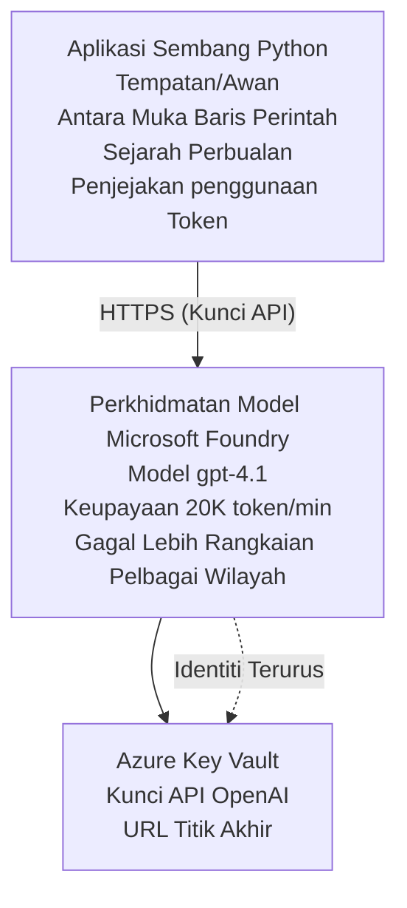

# Aplikasi Sembang Model Microsoft Foundry

**Jalur Pembelajaran:** Pertengahan ⭐⭐ | **Masa:** 35-45 minit | **Kos:** $50-200/bulan

Satu aplikasi sembang lengkap Model Microsoft Foundry yang diterapkan menggunakan Azure Developer CLI (azd). Contoh ini menunjukkan penerapan gpt-4.1, akses API yang selamat, dan antara muka sembang mudah.

## 🎯 Apa yang Akan Anda Pelajari

- Terap Model Microsoft Foundry Services dengan model gpt-4.1
- Lindungi kunci API OpenAI dengan Key Vault
- Bina antara muka sembang mudah dengan Python
- Pantau penggunaan token dan kos
- Laksanakan had kadar dan pengendalian ralat

## 📦 Apa yang Termasuk

✅ **Microsoft Foundry Models Service** - penerapan model gpt-4.1  
✅ **Aplikasi Sembang Python** - antara muka sembang baris perintah mudah  
✅ **Integrasi Key Vault** - penyimpanan kunci API yang selamat  
✅ **Templat ARM** - infrastruktur lengkap sebagai kod  
✅ **Pemantauan Kos** - penjejakan penggunaan token  
✅ **Had Kadar** - cegah kehabisan kuota  

## Seni Bina



## Prasyarat

### Diperlukan

- **Azure Developer CLI (azd)** - [Panduan pemasangan](https://learn.microsoft.com/azure/developer/azure-developer-cli/install-azd)
- **Langganan Azure** dengan akses OpenAI - [Mohon akses](https://aka.ms/oai/access)
- **Python 3.9+** - [Pasang Python](https://www.python.org/downloads/)

### Sahkan Prasyarat

```bash
# Semak versi azd (perlu 1.5.0 atau lebih tinggi)
azd version

# Sahkan log masuk Azure
azd auth login

# Semak versi Python
python --version  # atau python3 --version

# Sahkan akses OpenAI (semak di Portal Azure)
az cognitiveservices account list-skus \
  --kind OpenAI \
  --location eastus
```

> **⚠️ Penting:** Microsoft Foundry Models memerlukan kelulusan aplikasi. Jika anda belum memohon, lawati [aka.ms/oai/access](https://aka.ms/oai/access). Kelulusan biasanya mengambil masa 1-2 hari bekerja.

## ⏱️ Garis Masa Deploy

| Fasa | Tempoh | Apa yang Berlaku |
|-------|----------|--------------|
| Semakan prasyarat | 2-3 minit | Sahkan kuota OpenAI tersedia |
| Terap infrastruktur | 8-12 minit | Buat OpenAI, Key Vault, penerapan model |
| Konfigurasi aplikasi | 2-3 minit | Tetapkan persekitaran dan kebergantungan |
| **Jumlah** | **12-18 minit** | Sedia untuk sembang dengan gpt-4.1 |

**Nota:** Penerapan OpenAI kali pertama mungkin mengambil masa lebih lama kerana penyediaan model.

## Mula Pantas

```bash
# Navigasi ke contoh
cd examples/azure-openai-chat

# Inisialisasi persekitaran
azd env new myopenai

# Hantar semuanya (infrastruktur + konfigurasi)
azd up
# Anda akan diminta untuk:
# 1. Pilih langganan Azure
# 2. Pilih lokasi dengan ketersediaan OpenAI (contoh, eastus, eastus2, westus)
# 3. Tunggu 12-18 minit untuk penghantaran

# Pasang kebergantungan Python
pip install -r requirements.txt

# Mula berbual!
python chat.py
```

**Output Dijangka:**
```
🤖 Microsoft Foundry Models Chat Application
Connected to: gpt-4.1 (eastus)
Type your message (or 'quit' to exit)

You: Hello! Tell me about Microsoft Foundry Models.
Assistant: Microsoft Foundry Models Service provides REST API access to OpenAI's powerful language models including gpt-4.1, GPT-3.5-Turbo, and Embeddings...

[Tokens used: 145 | Estimated cost: $0.0044]
```

## ✅ Sahkan Penerapan

### Langkah 1: Semak Sumber Azure

```bash
# Lihat sumber yang telah dikerah
azd show

# Output yang dijangka menunjukkan:
# - Perkhidmatan OpenAI: (nama sumber)
# - Peti Kunci: (nama sumber)
# - Penyebaran: gpt-4.1
# - Lokasi: eastus (atau wilayah pilihan anda)
```

### Langkah 2: Uji API OpenAI

```bash
# Dapatkan titik akhir dan kunci OpenAI
OPENAI_ENDPOINT=$(azd env get-value AZURE_OPENAI_ENDPOINT)
OPENAI_KEY=$(azd env get-value AZURE_OPENAI_API_KEY)

# Uji panggilan API
curl "$OPENAI_ENDPOINT/openai/deployments/gpt-4.1/chat/completions?api-version=2024-08-01-preview" \
  -H "Content-Type: application/json" \
  -H "api-key: $OPENAI_KEY" \
  -d '{
    "messages": [{"role": "user", "content": "Say hello!"}],
    "max_tokens": 50
  }'
```

**Respons Dijangka:**
```json
{
  "choices": [
    {
      "message": {
        "role": "assistant",
        "content": "Hello! How can I assist you today?"
      }
    }
  ],
  "usage": {
    "prompt_tokens": 8,
    "completion_tokens": 9,
    "total_tokens": 17
  }
}
```

### Langkah 3: Sahkan Akses Key Vault

```bash
# Senaraikan rahsia dalam Key Vault
KV_NAME=$(azd env get-value AZURE_KEY_VAULT_NAME)

az keyvault secret list \
  --vault-name $KV_NAME \
  --query "[].name" \
  --output table
```

**Rahsia Dijangka:**
- `openai-api-key`
- `openai-endpoint`

**Kriteria Kejayaan:**
- ✅ Perkhidmatan OpenAI diterapkan dengan gpt-4.1
- ✅ Panggilan API mengembalikan penyempurnaan sah
- ✅ Rahsia disimpan dalam Key Vault
- ✅ Penjejakan penggunaan token berfungsi

## Struktur Projek

```
azure-openai-chat/
├── README.md                   ✅ This guide
├── azure.yaml                  ✅ AZD configuration
├── infra/                      ✅ Infrastructure as Code
│   ├── main.bicep             ✅ Main Bicep template
│   ├── main.parameters.json   ✅ Parameters
│   └── openai.bicep           ✅ OpenAI resource definition
├── src/                        ✅ Application code
│   ├── chat.py                ✅ Chat interface
│   ├── config.py              ✅ Configuration loader
│   └── requirements.txt       ✅ Python dependencies
└── .gitignore                  ✅ Git ignore rules
```

## Ciri-ciri Aplikasi

### Antara Muka Sembang (`chat.py`)

Aplikasi sembang mengandungi:

- **Sejarah Perbualan** - Mengekalkan konteks merentasi mesej
- **Pengiraan Token** - Menjejaki penggunaan dan menganggarkan kos
- **Pengendalian Ralat** - Menangani had kadar dan ralat API dengan baik
- **Anggaran Kos** - Pengiraan kos masa nyata bagi setiap mesej
- **Sokongan Penstriman** - Respons penstriman pilihan

### Arahan

Semasa bersembang, anda boleh menggunakan:
- `quit` atau `exit` - Tamatkan sesi
- `clear` - Kosongkan sejarah perbualan
- `tokens` - Papar jumlah penggunaan token
- `cost` - Papar anggaran kos keseluruhan

### Konfigurasi (`config.py`)

Muat konfigurasi dari pemboleh ubah persekitaran:
```python
AZURE_OPENAI_ENDPOINT  # Dari Peti Kunci
AZURE_OPENAI_API_KEY   # Dari Peti Kunci
AZURE_OPENAI_MODEL     # Lalai: gpt-4.1
AZURE_OPENAI_MAX_TOKENS # Lalai: 800
```

## Contoh Penggunaan

### Sembang Asas

```bash
python chat.py
```

### Sembang dengan Model Khusus

```bash
export AZURE_OPENAI_MODEL=gpt-35-turbo
python chat.py
```

### Sembang dengan Penstriman

```bash
python chat.py --stream
```

### Contoh Perbualan

```
You: Explain Microsoft Foundry Models Service in 3 sentences.
Assistant: Microsoft Foundry Models Service is Microsoft Azure's cloud platform offering 
that provides access to OpenAI's powerful language models. It enables developers 
to integrate capabilities like gpt-4.1 into their applications with enterprise-grade 
security and compliance. The service includes features for content filtering, 
abuse monitoring, and responsible AI practices.

[Tokens used: 89 | Estimated cost: $0.0027]

You: What models are available?
Assistant: Microsoft Foundry Models Service offers several model families including gpt-4.1 
(most capable), GPT-3.5-Turbo (faster and cost-effective), and Embeddings models 
for vector search. Each model has different capabilities, pricing, and token limits.

[Tokens used: 67 | Estimated cost: $0.0020]

Total session: 156 tokens | $0.0047
```

## Pengurusan Kos

### Harga Token (gpt-4.1)

| Model | Input (per 1K token) | Output (per 1K token) |
|-------|----------------------|------------------------|
| gpt-4.1 | $0.03 | $0.06 |
| GPT-3.5-Turbo | $0.0015 | $0.002 |

### Anggaran Kos Bulanan

Berdasarkan corak penggunaan:

| Tahap Penggunaan | Mesej/Hari | Token/Hari | Kos Bulanan |
|-------------|--------------|------------|--------------|
| **Ringan** | 20 mesej | 3,000 token | $3-5 |
| **Sederhana** | 100 mesej | 15,000 token | $15-25 |
| **Berat** | 500 mesej | 75,000 token | $75-125 |

**Kos Infrastruktur Asas:** $1-2/bulan (Key Vault + pengkomputeran minimum)

### Petua Pengoptimuman Kos

```bash
# 1. Gunakan GPT-3.5-Turbo untuk tugasan yang lebih mudah (20x lebih murah)
export AZURE_OPENAI_MODEL=gpt-35-turbo

# 2. Kurangkan token maksimum untuk jawapan yang lebih pendek
export AZURE_OPENAI_MAX_TOKENS=400

# 3. Pantau penggunaan token
python chat.py --show-tokens

# 4. Tetapkan amaran bajet
az consumption budget create \
  --budget-name "openai-budget" \
  --amount 50 \
  --time-grain Monthly
```

## Pemantauan

### Lihat Penggunaan Token

```bash
# Dalam Azure Portal:
# Sumber OpenAI → Metrik → Pilih "Transaksi Token"

# Atau melalui Azure CLI:
az monitor metrics list \
  --resource $(azd env get-value AZURE_OPENAI_RESOURCE_ID) \
  --metric "TokenTransaction" \
  --start-time $(date -u -d '1 hour ago' '+%Y-%m-%dT%H:%M:%S') \
  --interval PT1M
```

### Lihat Log API

```bash
# Alirkan log diagnostik
az monitor diagnostic-settings create \
  --resource $(azd env get-value AZURE_OPENAI_RESOURCE_ID) \
  --name openai-logs \
  --logs '[{"category": "Audit", "enabled": true}]' \
  --workspace $(azd env get-value LOG_ANALYTICS_WORKSPACE_ID)

# Log pertanyaan
az monitor log-analytics query \
  --workspace $(azd env get-value LOG_ANALYTICS_WORKSPACE_ID) \
  --analytics-query "AzureDiagnostics | where Category == 'Audit' | top 10 by TimeGenerated"
```

## Penyelesaian Masalah

### Isu: Ralat "Akses Ditolak"

**Gejala:** 403 Forbidden ketika memanggil API

**Penyelesaian:**
```bash
# 1. Sahkan akses OpenAI diluluskan
az cognitiveservices account show \
  --name $(azd env get-value AZURE_OPENAI_NAME) \
  --resource-group $(azd env get-value AZURE_RESOURCE_GROUP)

# 2. Periksa kunci API adalah betul
azd env get-value AZURE_OPENAI_API_KEY

# 3. Sahkan format URL endpoint
azd env get-value AZURE_OPENAI_ENDPOINT
# Sepatutnya: https://[name].openai.azure.com/
```

### Isu: "Had Kadar Terlampau"

**Gejala:** 429 Too Many Requests

**Penyelesaian:**
```bash
# 1. Semak kuota semasa
az cognitiveservices account deployment show \
  --name $(azd env get-value AZURE_OPENAI_NAME) \
  --resource-group $(azd env get-value AZURE_RESOURCE_GROUP) \
  --deployment-name gpt-4.1

# 2. Meminta peningkatan kuota (jika perlu)
# Pergi ke Azure Portal → OpenAI Resource → Kuota → Meminta Peningkatan

# 3. Laksanakan logik cuba semula (sudah ada dalam chat.py)
# Aplikasi secara automatik cuba semula dengan penangguhan eksponen
```

### Isu: "Model Tidak Ditemui"

**Gejala:** ralat 404 untuk penerapan

**Penyelesaian:**
```bash
# 1. Senaraikan penempatan yang tersedia
az cognitiveservices account deployment list \
  --name $(azd env get-value AZURE_OPENAI_NAME) \
  --resource-group $(azd env get-value AZURE_RESOURCE_GROUP)

# 2. Sahkan nama model dalam persekitaran
echo $AZURE_OPENAI_MODEL

# 3. Kemas kini kepada nama penempatan yang betul
export AZURE_OPENAI_MODEL=gpt-4.1  # atau gpt-35-turbo
```

### Isu: Kelewatan Tinggi

**Gejala:** Masa tindak balas perlahan (>5 saat)

**Penyelesaian:**
```bash
# 1. Semak kelewatan serantau
# Hantar ke rantau terdekat dengan pengguna

# 2. Kurangkan max_tokens untuk respons lebih cepat
export AZURE_OPENAI_MAX_TOKENS=400

# 3. Gunakan penstriman untuk UX yang lebih baik
python chat.py --stream
```

## Amalan Terbaik Keselamatan

### 1. Lindungi Kunci API

```bash
# Jangan sesekali memuat naik kunci ke kawalan sumber
# Gunakan Key Vault (sudah dikonfigurasi)

# Putar kunci secara berkala
az cognitiveservices account keys regenerate \
  --name $(azd env get-value AZURE_OPENAI_NAME) \
  --resource-group $(azd env get-value AZURE_RESOURCE_GROUP) \
  --key-name key1
```

### 2. Laksanakan Penapisan Kandungan

```python
# Microsoft Foundry Models termasuk penapisan kandungan terbina dalam
# Konfigurasi dalam Portal Azure:
# Sumber OpenAI → Penapis Kandungan → Buat Penapis Tersuai

# Kategori: Kebencian, Seksual, Keganasan, Cedera diri
# Tahap: Penapisan Rendah, Sederhana, Tinggi
```

### 3. Gunakan Identiti Terurus (Pengeluaran)

```bash
# Untuk pengeluaran produksi, gunakan identiti yang diuruskan
# bukan kunci API (memerlukan hosting aplikasi di Azure)

# Kemas kini infra/openai.bicep untuk memasukkan:
# identity: { type: 'SystemAssigned' }
```

## Pembangunan

### Jalankan Secara Lokal

```bash
# Pasang kebergantungan
pip install -r src/requirements.txt

# Tetapkan pembolehubah persekitaran
export AZURE_OPENAI_ENDPOINT="https://[name].openai.azure.com/"
export AZURE_OPENAI_API_KEY="your-api-key"
export AZURE_OPENAI_MODEL="gpt-4.1"

# Jalankan aplikasi
python src/chat.py
```

### Jalankan Ujian

```bash
# Pasang kebergantungan ujian
pip install pytest pytest-cov

# Jalankan ujian
pytest tests/ -v

# Dengan liputan
pytest tests/ --cov=src --cov-report=html
```

### Kemas Kini Penerapan Model

```bash
# Gunakan versi model yang berbeza
az cognitiveservices account deployment create \
  --name $(azd env get-value AZURE_OPENAI_NAME) \
  --resource-group $(azd env get-value AZURE_RESOURCE_GROUP) \
  --deployment-name gpt-35-turbo \
  --model-name gpt-35-turbo \
  --model-version "0613" \
  --model-format OpenAI \
  --sku-capacity 20 \
  --sku-name "Standard"
```

## Pembersihan

```bash
# Padam semua sumber Azure
azd down --force --purge

# Ini menghapus:
# - Perkhidmatan OpenAI
# - Peti Kunci Utama (dengan pemadaman lembut selama 90 hari)
# - Kumpulan Sumber
# - Semua penyebaran dan konfigurasi
```

## Langkah Seterusnya

### Kembangkan Contoh Ini

1. **Tambah Antara Muka Web** - Bina frontend React/Vue
   ```bash
   # Tambah perkhidmatan frontend ke azure.yaml
   # Lancarkan ke Azure Static Web Apps
   ```

2. **Laksanakan RAG** - Tambah pencarian dokumen dengan Azure AI Search
   ```python
   # Integrasi Azure AI Search
   # Muat naik dokumen dan cipta indeks vektor
   ```

3. **Tambah Panggilan Fungsi** - Benarkan penggunaan alat
   ```python
   # Takrifkan fungsi-fungsi dalam chat.py
   # Benarkan gpt-4.1 memanggil API luaran
   ```

4. **Sokongan Multi-Model** - Terap beberapa model
   ```bash
   # Tambah model gpt-35-turbo, embeddings
   # Laksanakan logik penghalaan model
   ```

### Contoh Berkaitan

- **[Ejen Pelbagai Runcit](../retail-scenario.md)** - Seni bina ejen pelbagai lanjutan
- **[Aplikasi Pangkalan Data](../../../../examples/database-app)** - Tambah penyimpanan berterusan
- **[Aplikasi Kontena](../../../../examples/container-app)** - Terap sebagai perkhidmatan berkontena

### Sumber Pembelajaran

- 📚 [Kursus AZD Untuk Pemula](../../README.md) - Halaman utama kursus
- 📚 [Dokumentasi Microsoft Foundry Models](https://learn.microsoft.com/azure/ai-services/openai/) - Dokumentasi rasmi
- 📚 [Rujukan API OpenAI](https://platform.openai.com/docs/api-reference) - Butiran API
- 📚 [AI Bertanggungjawab](https://www.microsoft.com/ai/responsible-ai) - Amalan terbaik

## Sumber Tambahan

### Dokumentasi
- **[Perkhidmatan Microsoft Foundry Models](https://learn.microsoft.com/azure/ai-services/openai/)** - Panduan lengkap
- **[Model gpt-4.1](https://learn.microsoft.com/azure/ai-services/openai/concepts/models)** - Kebolehan model
- **[Penapisan Kandungan](https://learn.microsoft.com/azure/ai-services/openai/concepts/content-filter)** - Ciri keselamatan
- **[Azure Developer CLI](https://learn.microsoft.com/azure/developer/azure-developer-cli/)** - rujukan azd

### Tutorial
- **[Permulaan Cepat OpenAI](https://learn.microsoft.com/azure/ai-services/openai/quickstart)** - Penerapan pertama
- **[Chat Completions](https://learn.microsoft.com/azure/ai-services/openai/how-to/chatgpt)** - Membina aplikasi sembang
- **[Panggilan Fungsi](https://learn.microsoft.com/azure/ai-services/openai/how-to/function-calling)** - Ciri lanjutan

### Alat
- **[Microsoft Foundry Models Studio](https://oai.azure.com/)** - Kawasan main berasaskan web
- **[Panduan Kejuruteraan Prompt](https://platform.openai.com/docs/guides/prompt-engineering)** - Menulis prompt lebih baik
- **[Pengira Token](https://platform.openai.com/tokenizer)** - Anggar penggunaan token

### Komuniti
- **[Azure AI Discord](https://discord.gg/azure)** - Dapatkan bantuan komuniti
- **[GitHub Discussions](https://github.com/Azure-Samples/openai/discussions)** - Forum soal jawab
- **[Blog Azure](https://azure.microsoft.com/blog/tag/azure-openai-service/)** - Kemas kini terkini

---

**🎉 Berjaya!** Anda telah menerapkan Microsoft Foundry Models dan membina aplikasi sembang yang berfungsi. Mulakan meneroka kebolehan gpt-4.1 dan cuba pelbagai prompt serta kes penggunaan.

**Ada Soalan?** [Buka isu](https://github.com/microsoft/AZD-for-beginners/issues) atau lihat [FAQ](../../resources/faq.md)

**Amaran Kos:** Ingat untuk jalankan `azd down` selepas selesai ujian supaya kos berterusan tidak dikenakan (~$50-100/bulan untuk penggunaan aktif).

---

<!-- CO-OP TRANSLATOR DISCLAIMER START -->
**Penafian**:
Dokumen ini telah diterjemahkan menggunakan perkhidmatan terjemahan AI [Co-op Translator](https://github.com/Azure/co-op-translator). Walaupun kami berusaha untuk ketepatan, sila ambil maklum bahawa terjemahan automatik mungkin mengandungi kesilapan atau ketidaktepatan. Dokumen asal dalam bahasa asalnya harus dianggap sebagai sumber yang sahih. Untuk maklumat penting, terjemahan oleh manusia profesional adalah disyorkan. Kami tidak bertanggungjawab terhadap sebarang salah faham atau salah tafsir yang timbul daripada penggunaan terjemahan ini.
<!-- CO-OP TRANSLATOR DISCLAIMER END -->