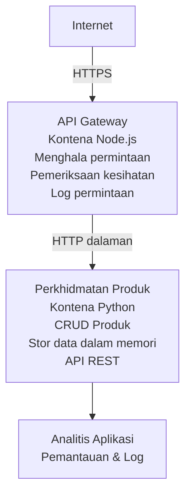

# Seni Bina Mikros perkhidmatan - Contoh Aplikasi Kontena

⏱️ **Anggaran Masa**: 25-35 minit | 💰 **Anggaran Kos**: ~$50-100/bulan | ⭐ **Kerumitan**: Lanjutan

Satu seni bina mikros perkhidmatan yang **dipermudahkan tetapi berfungsi** yang dikerahkan ke Azure Container Apps menggunakan AZD CLI. Contoh ini menunjukkan komunikasi perkhidmatan-ke-perkhidmatan, orkestrasi kontena, dan pemantauan dengan setup praktikal 2-perkhidmatan.

> **📚 Pendekatan Pembelajaran**: Contoh ini bermula dengan seni bina 2-perkhidmatan minimum (API Gateway + Perkhidmatan Backend) yang boleh anda terapkan dan pelajari. Selepas menguasai asas ini, kami menyediakan panduan untuk berkembang ke ekosistem mikros perkhidmatan penuh.

## Apa Yang Anda Akan Pelajari

Dengan menyelesaikan contoh ini, anda akan dapat:
- Mengedar pelbagai kontena ke Azure Container Apps
- Melaksanakan komunikasi perkhidmatan-ke-perkhidmatan dengan rangkaian dalaman
- Mengkonfigurasi penskalaan berdasarkan persekitaran dan pemeriksaan kesihatan
- Memantau aplikasi teragih dengan Application Insights
- Memahami corak pengeluaran mikros perkhidmatan dan amalan terbaik
- Belajar pengembangan progresif dari seni bina mudah ke kompleks

## Seni Bina

### Fasa 1: Apa Yang Kami Bangunkan (Termasuk dalam Contoh Ini)


**Mengapa Mulakan Dengan Mudah?**
- ✅ Dapat dikerahkan dan difahami dengan cepat (25-35 minit)
- ✅ Pelajari corak mikros perkhidmatan teras tanpa kerumitan
- ✅ Kod berfungsi yang boleh anda ubah dan cuba
- ✅ Kos rendah untuk pembelajaran (~$50-100/bulan berbanding $300-1400/bulan)
- ✅ Bina keyakinan sebelum menambah pangkalan data dan barisan mesej

**Analogi**: Fikirkan ini seperti belajar memandu. Anda mulakan dengan kawasan letak kereta kosong (2 perkhidmatan), menguasai asas, kemudian maju ke trafik bandar (5+ perkhidmatan dengan pangkalan data).

### Fasa 2: Pengembangan Masa Hadapan (Seni Bina Rujukan)

Setelah anda menguasai seni bina 2-perkhidmatan, anda boleh berkembang ke:

```
Full Architecture (Not Included - For Reference)
├── API Gateway (✅ Included)
├── Product Service (✅ Included)
├── Order Service (🔜 Add next)
├── User Service (🔜 Add next)
├── Notification Service (🔜 Add last)
├── Azure Service Bus (🔜 For async communication)
├── Cosmos DB (🔜 For product persistence)
├── Azure SQL (🔜 For order management)
└── Azure Storage (🔜 For file storage)
```

Lihat bahagian "Panduan Pengembangan" di akhir untuk arahan langkah demi langkah.

## Ciri-ciri Termasuk

✅ **Penemuan Perkhidmatan**: Penemuan DNS automatik antara kontena  
✅ **Pengimbangan Beban**: Pengimbangan beban terbina merentas replika  
✅ **Penskalakan Automatik**: Skala bebas per perkhidmatan berdasarkan permintaan HTTP  
✅ **Pemantauan Kesihatan**: Ujian liveness dan readiness untuk kedua-dua perkhidmatan  
✅ **Pencatatan Teragih**: Pencatatan berpusat dengan Application Insights  
✅ **Rangkaian Dalaman**: Komunikasi perkhidmatan-ke-perkhidmatan yang selamat  
✅ **Orkestrasi Kontena**: Pengeluaran dan penskalaan automatik  
✅ **Kemas Kini Tanpa Henti**: Kemas kini bergulung dengan pengurusan revisi  

## Prasyarat

### Alat Diperlukan

Sebelum bermula, sahkan anda telah memasang alat berikut:

1. **[Azure Developer CLI (azd)](https://learn.microsoft.com/azure/developer/azure-developer-cli/install-azd)** (versi 1.0.0 atau lebih tinggi)
   ```bash
   azd version
   # Keluaran yang dijangka: versi azd 1.0.0 atau lebih tinggi
   ```

2. **[Azure CLI](https://learn.microsoft.com/cli/azure/install-azure-cli)** (versi 2.50.0 atau lebih tinggi)
   ```bash
   az --version
   # Output yang dijangka: azure-cli 2.50.0 atau lebih tinggi
   ```

3. **[Docker](https://www.docker.com/get-started)** (untuk pembangunan/ujian tempatan - pilihan)
   ```bash
   docker --version
   # Output yang dijangka: Versi Docker 20.10 atau lebih tinggi
   ```

### Keperluan Azure

- Langganan **Azure aktif** ([buat akaun percuma](https://azure.microsoft.com/free/))
- Kebenaran untuk mencipta sumber dalam langganan anda
- Peranan **Penyumbang** pada langganan atau kumpulan sumber

### Prasyarat Pengetahuan

Ini adalah contoh **peringkat lanjutan**. Anda harus:
- Telah menyelesaikan [contoh Simple Flask API](../../../../../examples/container-app/simple-flask-api) 
- Memahami asas seni bina mikros perkhidmatan
- Mengenali REST API dan HTTP
- Faham konsep kontena

**Baru dengan Container Apps?** Mulakan dengan [contoh Simple Flask API](../../../../../examples/container-app/simple-flask-api) terlebih dahulu untuk belajar asas.

## Mula Pantas (Langkah demi Langkah)

### Langkah 1: Klon dan Navigasi

```bash
git clone https://github.com/microsoft/AZD-for-beginners.git
cd AZD-for-beginners/examples/container-app/microservices
```

**✓ Semak Kejayaan**: Sahkan anda melihat `azure.yaml`:
```bash
ls
# Dijangka: README.md, azure.yaml, infra/, src/
```

### Langkah 2: Pengesahan Dengan Azure

```bash
azd auth login
```

Ini membuka pelayar anda untuk pengesahan Azure. Log masuk dengan kelayakan Azure anda.

**✓ Semak Kejayaan**: Anda harus melihat:
```
Logged in to Azure.
```

### Langkah 3: Inisialisasi Persekitaran

```bash
azd init
```

**Mesej yang anda akan lihat**:
- **Nama persekitaran**: Masukkan nama ringkas (cth., `microservices-dev`)
- **Langganan Azure**: Pilih langganan anda
- **Lokasi Azure**: Pilih kawasan (cth., `eastus`, `westeurope`)

**✓ Semak Kejayaan**: Anda harus melihat:
```
SUCCESS: New project initialized!
```

### Langkah 4: Edar Infrastruktur dan Perkhidmatan

```bash
azd up
```

**Apa yang berlaku** (ambil masa 8-12 minit):
1. Mencipta persekitaran Container Apps
2. Mencipta Application Insights untuk pemantauan
3. Membina kontena API Gateway (Node.js)
4. Membina kontena Product Service (Python)
5. Mengedar kedua-dua kontena ke Azure
6. Mengkonfigurasi rangkaian dan pemeriksaan kesihatan
7. Menyediakan pemantauan dan pencatatan

**✓ Semak Kejayaan**: Anda harus melihat:
```
SUCCESS: Your application was deployed to Azure in X minutes Y seconds.
Endpoint: https://api-gateway-<unique-id>.azurecontainerapps.io
```

**⏱️ Masa**: 8-12 minit

### Langkah 5: Uji Pengeluaran

```bash
# Dapatkan titik akhir pintu masuk
GATEWAY_URL=$(azd env get-values | grep API_GATEWAY_URL | cut -d '=' -f2 | tr -d '"')

# Uji kesihatan API Gateway
curl $GATEWAY_URL/health

# Output yang dijangka:
# {"status":"sihat","service":"api-gateway","timestamp":"2025-11-19T10:30:00Z"}
```

**Uji perkhidmatan produk melalui gateway**:
```bash
# Senaraikan produk
curl $GATEWAY_URL/api/products

# Output yang dijangka:
# [
#   {"id":1,"name":"Laptop","price":999.99,"stock":50},
#   {"id":2,"name":"Tetikus","price":29.99,"stock":200},
#   {"id":3,"name":"Papan Kekunci","price":79.99,"stock":150}
# ]
```

**✓ Semak Kejayaan**: Kedua-dua titik akhir memulangkan data JSON tanpa ralat.

---

**🎉 Tahniah!** Anda telah mengedar seni bina mikros perkhidmatan ke Azure!

## Struktur Projek

Semua fail pelaksanaan disertakan—ini adalah contoh lengkap dan berfungsi:

```
microservices/
│
├── README.md                         # This file
├── azure.yaml                        # AZD configuration
├── .gitignore                        # Git ignore patterns
│
├── infra/                           # Infrastructure as Code (Bicep)
│   ├── main.bicep                   # Main orchestration
│   ├── abbreviations.json           # Naming conventions
│   ├── core/                        # Shared infrastructure
│   │   ├── container-apps-environment.bicep  # Container environment + registry
│   │   └── monitor.bicep            # Application Insights + Log Analytics
│   └── app/                         # Service definitions
│       ├── api-gateway.bicep        # API Gateway container app
│       └── product-service.bicep    # Product Service container app
│
└── src/                             # Application source code
    ├── api-gateway/                 # Node.js API Gateway
    │   ├── app.js                   # Express server with routing
    │   ├── package.json             # Node dependencies
    │   └── Dockerfile               # Container definition
    └── product-service/             # Python Product Service
        ├── main.py                  # Flask API with product data
        ├── requirements.txt         # Python dependencies
        └── Dockerfile               # Container definition
```

**Apa Fungsi Setiap Komponen:**

**Infrastruktur (infra/)**:
- `main.bicep`: Menyelaraskan semua sumber Azure dan pergantungan mereka
- `core/container-apps-environment.bicep`: Mencipta persekitaran Container Apps dan Azure Container Registry
- `core/monitor.bicep`: Menyediakan Application Insights untuk pencatatan teragih
- `app/*.bicep`: Definisi aplikasi kontena individu dengan penskalaan dan pemeriksaan kesihatan

**API Gateway (src/api-gateway/)**:
- Perkhidmatan hadapan awam yang menghala permintaan ke perkhidmatan backend
- Melaksanakan pencatatan, pengendalian ralat, dan pemajuan permintaan
- Menunjukkan komunikasi HTTP perkhidmatan-ke-perkhidmatan

**Product Service (src/product-service/)**:
- Perkhidmatan dalaman dengan katalog produk (dalam memori untuk kesederhanaan)
- REST API dengan pemeriksaan kesihatan
- Contoh corak mikros perkhidmatan backend

## Gambaran Keseluruhan Perkhidmatan

### API Gateway (Node.js/Express)

**Port**: 8080  
**Akses**: Awam (ingress luaran)  
**Tujuan**: Menghala permintaan yang masuk ke perkhidmatan backend yang sesuai  

**Titik Akhir**:
- `GET /` - Maklumat perkhidmatan
- `GET /health` - Titik akhir pemeriksaan kesihatan
- `GET /api/products` - Maju ke perkhidmatan produk (senaraikan semua)
- `GET /api/products/:id` - Maju ke perkhidmatan produk (dapatkan mengikut ID)

**Ciri Utama**:
- Penghalaan permintaan dengan axios
- Pencatatan berpusat
- Pengendalian ralat dan pengurusan tamat masa
- Penemuan perkhidmatan melalui pembolehubah persekitaran
- Integrasi Application Insights

**Sorotan Kod** (`src/api-gateway/app.js`):
```javascript
// Komunikasi perkhidmatan dalaman
app.get('/api/products', async (req, res) => {
  const response = await axios.get(`${PRODUCT_SERVICE_URL}/products`);
  res.json(response.data);
});
```

### Product Service (Python/Flask)

**Port**: 8000  
**Akses**: Dalaman sahaja (tiada ingress luaran)  
**Tujuan**: Mengurus katalog produk dengan data dalam memori  

**Titik Akhir**:
- `GET /` - Maklumat perkhidmatan
- `GET /health` - Titik akhir pemeriksaan kesihatan
- `GET /products` - Senarai semua produk
- `GET /products/<id>` - Dapatkan produk mengikut ID

**Ciri Utama**:
- RESTful API dengan Flask
- Penyimpanan produk dalam memori (mudah, tiada pangkalan data diperlukan)
- Pemantauan kesihatan dengan probes
- Pencatatan berstruktur
- Integrasi Application Insights

**Model Data**:
```python
{
  "id": 1,
  "name": "Laptop",
  "description": "High-performance laptop",
  "price": 999.99,
  "stock": 50
}
```

**Mengapa Dalaman Sahaja?**
Perkhidmatan produk tidak didedahkan secara awam. Semua permintaan mesti melalui API Gateway, yang menyediakan:
- Keselamatan: Titik akses yang dikawal
- Fleksibiliti: Boleh tukar backend tanpa menjejaskan klien
- Pemantauan: Pencatatan permintaan berpusat

## Memahami Komunikasi Perkhidmatan

### Bagaimana Perkhidmatan Berbual antara Satu Sama Lain

Dalam contoh ini, API Gateway berkomunikasi dengan Perkhidmatan Produk menggunakan **panggilan HTTP dalaman**:

```javascript
// API Gateway (src/api-gateway/app.js)
const PRODUCT_SERVICE_URL = process.env.PRODUCT_SERVICE_URL;

// Buat permintaan HTTP dalaman
const response = await axios.get(`${PRODUCT_SERVICE_URL}/products`);
```

**Perkara Penting**:

1. **Penemuan Berdasarkan DNS**: Container Apps secara automatik menyediakan DNS untuk perkhidmatan dalaman
   - FQDN Perkhidmatan Produk: `product-service.internal.<environment>.azurecontainerapps.io`
   - Disederhanakan sebagai: `http://product-service` (Container Apps menyelesaikannya)

2. **Tiada Pendedahan Awam**: Perkhidmatan Produk mempunyai `external: false` dalam Bicep
   - Hanya boleh diakses dalam persekitaran Container Apps
   - Tidak boleh dicapai dari internet

3. **Pembolehubah Persekitaran**: URL perkhidmatan disuntik semasa masa deploy
   - Bicep memberikan FQDN dalaman ke gateway
   - Tiada URL keras dalam kod aplikasi

**Analogi**: Fikirkan ini seperti bilik pejabat. API Gateway adalah kaunter resepsi (muka awam), dan Perkhidmatan Produk adalah bilik pejabat (dalam sahaja). Pelawat mesti melalui resepsi untuk sampai ke mana-mana bilik pejabat.

## Pilihan Pengeluaran

### Pengeluaran Penuh (Disyorkan)

```bash
# Sebarkan infrastruktur dan kedua-dua perkhidmatan
azd up
```

Ini mengedar:
1. Persekitaran Container Apps
2. Application Insights
3. Container Registry
4. Kontena API Gateway
5. Kontena Product Service

**Masa**: 8-12 minit

### Edar Perkhidmatan Individu

```bash
# Hanya pasang satu perkhidmatan (selepas azd up awal)
azd deploy api-gateway

# Atau pasang perkhidmatan produk
azd deploy product-service
```

**Kes Penggunaan**: Bila anda telah mengemas kini kod dalam satu perkhidmatan dan mahu mengedar semula hanya perkhidmatan itu.

### Kemas Kini Konfigurasi

```bash
# Tukar parameter penskalaan
azd env set GATEWAY_MAX_REPLICAS 30

# Deploy semula dengan konfigurasi baru
azd up
```

## Konfigurasi

### Konfigurasi Penskalaan

Kedua-dua perkhidmatan dikonfigurasi dengan penskalaan automatik berasaskan HTTP dalam fail Bicep mereka:

**API Gateway**:
- Replika minimum: 2 (sentiasa sekurang-kurangnya 2 untuk ketersediaan)
- Replika maksimum: 20
- Pencetus skala: 50 permintaan serentak per replika

**Product Service**:
- Replika minimum: 1 (boleh skala ke sifar jika perlu)
- Replika maksimum: 10
- Pencetus skala: 100 permintaan serentak per replika

**Sesuaikan Penskalaan** (dalam `infra/app/*.bicep`):
```bicep
scale: {
  minReplicas: 1
  maxReplicas: 10
  rules: [
    {
      name: 'http-scale-rule'
      http: {
        metadata: {
          concurrentRequests: '100'  // Adjust this
        }
      }
    }
  ]
}
```

### Peruntukan Sumber

**API Gateway**:
- CPU: 1.0 vCPU
- Memori: 2 GiB
- Sebab: Mengendalikan semua trafik luaran

**Product Service**:
- CPU: 0.5 vCPU
- Memori: 1 GiB
- Sebab: Operasi ringan dalam memori

### Pemeriksaan Kesihatan

Kedua-dua perkhidmatan termasuk probes liveness dan readiness:

```bicep
probes: [
  {
    type: 'Liveness'
    httpGet: {
      path: '/health'
      port: 8080
    }
    initialDelaySeconds: 10
    periodSeconds: 30
  }
  {
    type: 'Readiness'
    httpGet: {
      path: '/health'
      port: 8080
    }
    initialDelaySeconds: 5
    periodSeconds: 10
  }
]
```

**Maksud Ini**:
- **Liveness**: Jika ujian kesihatan gagal, Container Apps memulakan semula kontena
- **Readiness**: Jika tidak sedia, Container Apps berhenti menghala trafik ke replika itu


## Pemantauan & Kebolehlihatan

### Lihat Log Perkhidmatan

```bash
# Lihat log menggunakan azd monitor
azd monitor --logs

# Atau gunakan Azure CLI untuk Container Apps khusus:
# Alirkan log dari API Gateway
az containerapp logs show --name api-gateway --resource-group $RG_NAME --follow

# Lihat log perkhidmatan produk terkini
az containerapp logs show --name product-service --resource-group $RG_NAME --tail 100
```

**Output Dijangkakan**:
```
[api-gateway] API Gateway listening on port 8080
[api-gateway] Product Service URL: http://product-service
[api-gateway] GET /api/products 200 - 45ms
[product-service] Retrieved 5 products
```

### Pertanyaan Application Insights

Akses Application Insights di Azure Portal, kemudian jalankan pertanyaan ini:

**Cari Permintaan Perlahan**:
```kusto
requests
| where timestamp > ago(1h)
| where duration > 1000  // Requests taking >1 second
| summarize count() by name, cloud_RoleName
| order by count_ desc
```

**Jejaki Panggilan Perkhidmatan-ke-Perkhidmatan**:
```kusto
dependencies
| where timestamp > ago(1h)
| where type == "Http"
| project timestamp, name, target, duration, success
| order by timestamp desc
```

**Kadar Ralat Mengikut Perkhidmatan**:
```kusto
exceptions
| where timestamp > ago(24h)
| summarize errorCount = count() by cloud_RoleName, type
| order by errorCount desc
```

**Isipadu Permintaan Sepanjang Masa**:
```kusto
requests
| where timestamp > ago(1h)
| summarize requestCount = count() by bin(timestamp, 5m), cloud_RoleName
| render timechart
```

### Akses Papan Pemantauan

```bash
# Dapatkan butiran Application Insights
azd env get-values | grep APPLICATIONINSIGHTS

# Buka pemantauan Azure Portal
az monitor app-insights component show \
  --app $(azd env get-values | grep APPLICATIONINSIGHTS_CONNECTION_STRING | cut -d '=' -f2) \
  --resource-group $(azd env get-values | grep AZURE_RESOURCE_GROUP | cut -d '=' -f2) \
  --query "appId" -o tsv
```

### Metrik Masa Nyata

1. Navigasi ke Application Insights di Azure Portal
2. Klik "Live Metrics"
3. Lihat permintaan, kegagalan, dan prestasi masa nyata
4. Uji dengan menjalankan: `curl $(azd env get-values | grep API_GATEWAY_URL | cut -d '=' -f2 | tr -d '"')/api/products`

## Latihan Praktikal

[Nota: Lihat latihan penuh di atas dalam bahagian "Practical Exercises" untuk latihan langkah demi langkah termasuk pengesahan pengeluaran, pengubahsuaian data, ujian penskalaan automatik, pengendalian ralat, dan penambahan perkhidmatan ketiga.]

## Analisis Kos

### Anggaran Kos Bulanan (Untuk Contoh 2-Perkhidmatan Ini)

| Sumber | Konfigurasi | Anggaran Kos |
|----------|--------------|----------------|
| API Gateway | 2-20 replika, 1 vCPU, 2GB RAM | $30-150 |
| Product Service | 1-10 replika, 0.5 vCPU, 1GB RAM | $15-75 |
| Container Registry | Tahap asas | $5 |
| Application Insights | 1-2 GB/bulan | $5-10 |
| Log Analytics | 1 GB/bulan | $3 |
| **Jumlah** | | **$58-243/bulan** |

**Pecahan Kos Berdasarkan Penggunaan**:
- **Trafik ringan** (ujian/pembelajaran): ~$60/bulan
- **Trafik sederhana** (produksi kecil): ~$120/bulan
- **Trafik tinggi** (tempoh sibuk): ~$240/bulan

### Petua Pengoptimuman Kos

1. **Skala Ke Sifar Untuk Pembangunan**:
   ```bicep
   scale: {
     minReplicas: 0  // Save $30-40/month when not in use
     maxReplicas: 10
   }
   ```

2. **Gunakan Pelan Penggunaan Untuk Cosmos DB** (apabila anda menambahkannya):
   - Bayar hanya untuk apa yang digunakan
   - Tiada caj minimum

3. **Tetapkan Sampling Application Insights**:
   ```javascript
   appInsights.defaultClient.config.samplingPercentage = 50; // Contoh 50% daripada permintaan
   ```

4. **Bersihkan Bila Tidak Diperlukan**:
   ```bash
   azd down
   ```

### Pilihan Tahap Percuma

Untuk pembelajaran/ujian, pertimbangkan:
- Gunakan kredit percuma Azure (30 hari pertama)
- Kekalkan salinan minimum
- Padam selepas ujian (tiada caj berterusan)

---

## Pembersihan

Untuk mengelakkan caj berterusan, padam semua sumber:

```bash
azd down --force --purge
```

**Pengesahan**:
```
? Total resources to delete: 6, are you sure you want to continue? (y/N)
```

Taip `y` untuk mengesahkan.

**Apa yang Dipadamkan**:
- Persekitaran Container Apps
- Kedua-dua Container Apps (gateway & perkhidmatan produk)
- Container Registry
- Application Insights
- Log Analytics Workspace
- Resource Group

**✓ Sahkan Pembersihan**:
```bash
az group list --query "[?starts_with(name,'rg-microservices')]" --output table
```

Sepatutnya kembali kosong.

---

## Panduan Pengembangan: Dari 2 ke 5+ Perkhidmatan

Setelah anda menguasai seni bina 2 perkhidmatan ini, berikut cara untuk mengembangkannya:

### Fasa 1: Tambah Penyimpanan Pangkalan Data (Langkah Seterusnya)

**Tambah Cosmos DB untuk Perkhidmatan Produk**:

1. Buat `infra/core/cosmos.bicep`:
   ```bicep
   resource cosmosAccount 'Microsoft.DocumentDB/databaseAccounts@2023-04-15' = {
     name: name
     location: location
     kind: 'GlobalDocumentDB'
     properties: {
       databaseAccountOfferType: 'Standard'
       locations: [{ locationName: location, failoverPriority: 0 }]
     }
   }
   ```

2. Kemas kini perkhidmatan produk untuk menggunakan Cosmos DB dan bukannya data dalam ingatan

3. Anggaran kos tambahan: ~RM105/bulan (serverless)

### Fasa 2: Tambah Perkhidmatan Ketiga (Pengurusan Pesanan)

**Buat Perkhidmatan Pesanan**:

1. Folder baru: `src/order-service/` (Python/Node.js/C#)
2. Bicep baru: `infra/app/order-service.bicep`
3. Kemas kini API Gateway untuk laluan `/api/orders`
4. Tambah Azure SQL Database untuk penyimpanan pesanan

**Seni bina menjadi**:
```
API Gateway → Product Service (Cosmos DB)
           → Order Service (Azure SQL)
```

### Fasa 3: Tambah Komunikasi Async (Service Bus)

**Laksanakan Seni Bina Berpandukan Acara**:

1. Tambah Azure Service Bus: `infra/core/servicebus.bicep`
2. Perkhidmatan Produk menerbitkan acara "ProductCreated"
3. Perkhidmatan Pesanan melanggan acara produk
4. Tambah Perkhidmatan Pemberitahuan untuk memproses acara

**Pola**: Permintaan/Respons (HTTP) + Berpandukan Acara (Service Bus)

### Fasa 4: Tambah Pengesahan Pengguna

**Laksanakan Perkhidmatan Pengguna**:

1. Buat `src/user-service/` (Go/Node.js)
2. Tambah Azure AD B2C atau pengesahan JWT tersuai
3. API Gateway mengesahkan token
4. Perkhidmatan memeriksa kebenaran pengguna

### Fasa 5: Kesiapan Pengeluaran

**Tambah Komponen Berikut**:
- Azure Front Door (imbangan beban global)
- Azure Key Vault (pengurusan rahsia)
- Azure Monitor Workbooks (papan pemuka tersuai)
- Saluran CI/CD (GitHub Actions)
- Penggunaan Blue-Green Deployments
- Managed Identity untuk semua perkhidmatan

**Kos Seni Bina Pengeluaran Penuh**: ~RM1,260-5,880/bulan

---

## Ketahui Lebih Lanjut

### Dokumentasi Berkaitan
- [Dokumentasi Azure Container Apps](https://learn.microsoft.com/azure/container-apps/)
- [Panduan Seni Bina Mikroservis](https://learn.microsoft.com/azure/architecture/guide/architecture-styles/microservices)
- [Application Insights untuk Pengesanan Teragih](https://learn.microsoft.com/azure/azure-monitor/app/distributed-tracing)
- [Dokumentasi Azure Developer CLI](https://learn.microsoft.com/azure/developer/azure-developer-cli/)

### Langkah Seterusnya dalam Kursus Ini
- ← Sebelum: [Simple Flask API](../../../../../examples/container-app/simple-flask-api) - Contoh satu kontena untuk pemula
- → Seterusnya: [Panduan Integrasi AI](../../../../../examples/docs/ai-foundry) - Tambah kemampuan AI
- 🏠 [Halaman Utama Kursus](../../README.md)

### Perbandingan: Bila Gunakan Apa

**Aplikasi Kontena Tunggal** (contoh Simple Flask API):
- ✅ Aplikasi ringkas
- ✅ Seni bina monolitik
- ✅ Cepat untuk dikerahkan
- ❌ Skala terhad
- **Kos**: ~RM65-215/bulan

**Mikroservis** (contoh ini):
- ✅ Aplikasi kompleks
- ✅ Skala bebas per perkhidmatan
- ✅ Autonomi pasukan (perkhidmatan berbeza, pasukan berbeza)
- ❌ Lebih rumit untuk diurus
- **Kos**: ~RM260-1,075/bulan

**Kubernetes (AKS)**:
- ✅ Kawalan maksimum dan fleksibiliti
- ✅ Mudah dipindahkan antara pelbagai awan
- ✅ Rangkaian lanjutan
- ❌ Memerlukan kepakaran Kubernetes
- **Kos**: ~RM650-2,160/bulan minimum

**Cadangan**: Mulakan dengan Container Apps (contoh ini), beralih ke AKS hanya jika anda perlukan ciri khusus Kubernetes.

---

## Soalan Lazim

**S: Kenapa hanya 2 perkhidmatan dan bukan 5+?**  
J: Progresi pendidikan. Kuasai asas (komunikasi perkhidmatan, pemantauan, penskalaan) dengan contoh mudah sebelum menambahkan kerumitan. Corak yang anda pelajari di sini sesuai untuk seni bina 100 perkhidmatan.

**S: Bolehkah saya tambah lebih banyak perkhidmatan sendiri?**  
J: Sudah tentu! Ikuti panduan pengembangan di atas. Setiap perkhidmatan baru mengikut pola yang sama: buat folder src, buat fail Bicep, kemas kini azure.yaml, terbitkan.

**S: Adakah ini bersedia untuk pengeluaran?**  
J: Ia asas yang kukuh. Untuk pengeluaran, tambah: managed identity, Key Vault, pangkalan data kekal, saluran CI/CD, amaran pemantauan, dan strategi sandaran.

**S: Kenapa tidak guna Dapr atau service mesh lain?**  
J: Kekalkan ringkas untuk pembelajaran. Setelah anda faham rangkaian Container Apps asli, anda boleh tambah lapisan Dapr untuk senario lanjutan.

**S: Bagaimana saya debug secara tempatan?**  
J: Jalankan perkhidmatan secara tempatan dengan Docker:
```bash
cd src/api-gateway
docker build -t local-gateway .
docker run -p 8080:8080 -e PRODUCT_SERVICE_URL=http://localhost:8000 local-gateway
```

**S: Bolehkah saya guna bahasa pengaturcaraan berbeza?**  
J: Ya! Contoh ini menunjukkan Node.js (gateway) + Python (perkhidmatan produk). Anda boleh gabungkan mana-mana bahasa yang berjalan dalam kontena.

**S: Bagaimana jika saya tiada kredit Azure?**  
J: Gunakan lapisan percuma Azure (30 hari pertama untuk akaun baru) atau terbitkan untuk tempoh ujian singkat dan padam segera.

---

> **🎓 Ringkasan Jalur Pembelajaran**: Anda telah belajar cara terbit seni bina berbilang perkhidmatan dengan penskalaan automatik, rangkaian dalaman, pemantauan pusat, dan corak bersedia pengeluaran. Asas ini menyediakan anda untuk sistem teragih kompleks dan seni bina mikroservis perusahaan.

**📚 Navigasi Kursus:**
- ← Sebelum: [Simple Flask API](../../../../../examples/container-app/simple-flask-api)
- → Seterusnya: [Contoh Integrasi Pangkalan Data](../../../../../examples/database-app)
- 🏠 [Halaman Utama Kursus](../../../README.md)
- 📖 [Amalan Terbaik Container Apps](../../../docs/chapter-04-infrastructure/deployment-guide.md)

---

<!-- CO-OP TRANSLATOR DISCLAIMER START -->
**Penafian**:  
Dokumen ini telah diterjemahkan menggunakan perkhidmatan terjemahan AI [Co-op Translator](https://github.com/Azure/co-op-translator). Walaupun kami berusaha untuk ketepatan, sila ambil maklum bahawa terjemahan automatik mungkin mengandungi kesilapan atau ketidaktepatan. Dokumen asal dalam bahasa asalnya harus dianggap sebagai sumber yang sah. Untuk maklumat penting, terjemahan profesional oleh manusia adalah disyorkan. Kami tidak bertanggungjawab atas sebarang salah faham atau salah tafsir yang timbul daripada penggunaan terjemahan ini.
<!-- CO-OP TRANSLATOR DISCLAIMER END -->