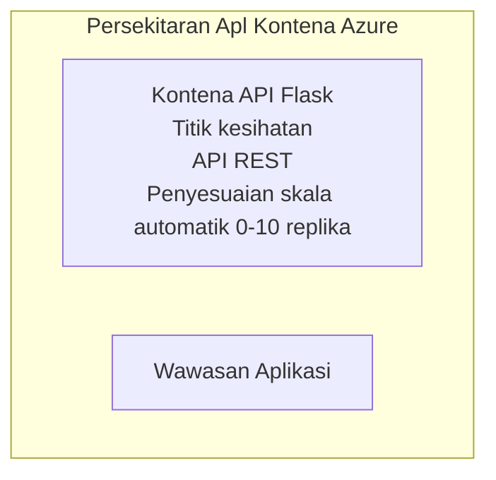

# Contoh Aplikasi Flask API Mudah - Container App

**Jalur Pembelajaran:** Pemula ⭐ | **Masa:** 25-35 minit | **Kos:** $0-15/bulan

API REST Python Flask yang lengkap dan berfungsi telah dikerahkan ke Azure Container Apps menggunakan Azure Developer CLI (azd). Contoh ini menunjukkan penyebaran kontena, auto-scaling, dan asas pemantauan.

## 🎯 Apa Yang Akan Anda Pelajari

- Mengedar aplikasi Python berasaskan kontena ke Azure
- Mengkonfigurasi auto-scaling dengan skala ke sifar
- Melaksanakan probe kesihatan dan pemeriksaan kesediaan
- Memantau log aplikasi dan metrik
- Menggunakan Azure Developer CLI untuk penyebaran pantas

## 📦 Apa Yang Termasuk

✅ **Aplikasi Flask** - API REST lengkap dengan operasi CRUD (`src/app.py`)  
✅ **Dockerfile** - Konfigurasi kontena sedia produksi  
✅ **Infrastruktur Bicep** - Persekitaran Container Apps dan penyebaran API  
✅ **Konfigurasi AZD** - Persediaan penyebaran satu arahan  
✅ **Probe Kesihatan** - Pemeriksaan hidup dan kesediaan dikonfigurasi  
✅ **Auto-scaling** - 0-10 replika berdasarkan beban HTTP  

## Seni Bina



## Prasyarat

### Diperlukan
- **Azure Developer CLI (azd)** - [Panduan pemasangan](https://learn.microsoft.com/azure/developer/azure-developer-cli/install-azd)
- **Langganan Azure** - [Akaun percuma](https://azure.microsoft.com/free/)
- **Docker Desktop** - [Pasang Docker](https://www.docker.com/products/docker-desktop/) (untuk ujian tempatan)

### Sahkan Prasyarat

```bash
# Semak versi azd (perlukan 1.5.0 atau lebih tinggi)
azd version

# Sahkan log masuk Azure
azd auth login

# Semak Docker (pilihan, untuk ujian tempatan)
docker --version
```

## ⏱️ Garis Masa Penyebaran

| Fasa | Tempoh | Apa Yang Berlaku |
|-------|----------|--------------||
| Persediaan persekitaran | 30 saat | Membuat persekitaran azd |
| Bina kontena | 2-3 minit | Docker bina aplikasi Flask |
| Sediakan infrastruktur | 3-5 minit | Cipta Container Apps, registri, pemantauan |
| Sebar aplikasi | 2-3 minit | Tolak imej dan sebar ke Container Apps |
| **Jumlah** | **8-12 minit** | Penyebaran lengkap sedia |

## Mula Dengan Cepat

```bash
# Navigasi ke contoh
cd examples/container-app/simple-flask-api

# Inisialisasi persekitaran (pilih nama unik)
azd env new myflaskapi

# Lancarkan semuanya (infrastruktur + aplikasi)
azd up
# Anda akan diberi arahan untuk:
# 1. Pilih langganan Azure
# 2. Pilih lokasi (contoh, eastus2)
# 3. Tunggu 8-12 minit untuk pelancaran

# Dapatkan titik akhir API anda
azd env get-values

# Uji API
curl $(azd env get-value API_ENDPOINT)/health
```

**Output Dijangka:**
```json
{
  "status": "healthy",
  "timestamp": "2025-11-19T10:30:00Z",
  "service": "simple-flask-api",
  "version": "1.0.0"
}
```

## ✅ Sahkan Penyebaran

### Langkah 1: Semak Status Penyebaran

```bash
# Lihat perkhidmatan yang telah diterapkan
azd show

# Output yang dijangka menunjukkan:
# - Perkhidmatan: api
# - Titik akhir: https://ca-api-[env].xxx.azurecontainerapps.io
# - Status: Berjalan
```

### Langkah 2: Uji Titik Akhir API

```bash
# Dapatkan titik akhir API
API_URL=$(azd env get-value API_ENDPOINT)

# Uji kesihatan
curl $API_URL/health

# Uji titik akhir akar
curl $API_URL/

# Buat satu item
curl -X POST $API_URL/api/items \
  -H "Content-Type: application/json" \
  -d '{"name": "Test Item", "description": "My first item"}'

# Dapatkan semua item
curl $API_URL/api/items
```

**Kriteria Kejayaan:**
- ✅ Titik akhir kesihatan mengembalikan HTTP 200
- ✅ Titik akhir root memaparkan maklumat API
- ✅ POST mencipta item dan mengembalikan HTTP 201
- ✅ GET mengembalikan item yang dicipta

### Langkah 3: Lihat Log

```bash
# Alirkan log secara langsung menggunakan azd monitor
azd monitor --logs

# Atau gunakan Azure CLI:
az containerapp logs show --name api --resource-group $RG_NAME --follow

# Anda seharusnya melihat:
# - Mesej permulaan Gunicorn
# - Log permintaan HTTP
# - Log maklumat aplikasi
```

## Struktur Projek

```
simple-flask-api/
├── azure.yaml              # AZD configuration
├── infra/
│   ├── main.bicep         # Main infrastructure
│   ├── main.parameters.json
│   └── app/
│       ├── container-env.bicep
│       └── api.bicep
└── src/
    ├── app.py             # Flask application
    ├── requirements.txt
    └── Dockerfile
```

## Titik Akhir API

| Titik Akhir | Kaedah | Penerangan |
|----------|--------|-------------|
| `/health` | GET | Pemeriksaan kesihatan |
| `/api/items` | GET | Senaraikan semua item |
| `/api/items` | POST | Cipta item baru |
| `/api/items/{id}` | GET | Dapatkan item tertentu |
| `/api/items/{id}` | PUT | Kemas kini item |
| `/api/items/{id}` | DELETE | Padam item |

## Konfigurasi

### Pembolehubah Persekitaran

```bash
# Tetapkan konfigurasi khusus
azd env set PORT 8000
azd env set LOG_LEVEL info
azd env set MAX_REPLICAS 20
```

### Konfigurasi Skala

API secara automatik menyesuaikan skala berdasarkan trafik HTTP:
- **Replika Min**: 0 (skala ke sifar apabila idle)
- **Replika Maks**: 10
- **Permintaan Serentak setiap Replika**: 50

## Pembangunan

### Jalankan Secara Tempatan

```bash
# Pasang kebergantungan
cd src
pip install -r requirements.txt

# Jalankan aplikasi
python app.py

# Uji secara tempatan
curl http://localhost:8000/health
```

### Bina dan Uji Kontena

```bash
# Bina imej Docker
docker build -t flask-api:local ./src

# Jalankan bekas secara tempatan
docker run -p 8000:8000 flask-api:local

# Uji bekas
curl http://localhost:8000/health
```

## Penyebaran

### Penyebaran Penuh

```bash
# Menyebarkan infrastruktur dan aplikasi
azd up
```

### Penyebaran Kod Sahaja

```bash
# Hanya lancarkan kod aplikasi (infrastruktur tidak berubah)
azd deploy api
```

### Kemas Kini Konfigurasi

```bash
# Kemaskini pembolehubah persekitaran
azd env set API_KEY "new-api-key"

# Deploy semula dengan konfigurasi baru
azd deploy api
```

## Pemantauan

### Lihat Log

```bash
# Alirkan log langsung menggunakan azd monitor
azd monitor --logs

# Atau gunakan Azure CLI untuk Aplikasi Kontena:
az containerapp logs show --name api --resource-group $RG_NAME --follow

# Lihat 100 baris terakhir
az containerapp logs show --name api --resource-group $RG_NAME --tail 100
```

### Pantau Metrik

```bash
# Buka papan pemuka Azure Monitor
azd monitor --overview

# Lihat metrik tertentu
az monitor metrics list \
  --resource $(azd show --output json | jq -r '.services.api.resourceId') \
  --metric "Requests,ResponseTime"
```

## Ujian

### Pemeriksaan Kesihatan

```bash
curl $(azd show --output json | jq -r '.services.api.endpoint')/health
```

Respons dijangka:
```json
{
  "status": "healthy",
  "timestamp": "2025-11-19T10:30:00Z"
}
```

### Cipta Item

```bash
curl -X POST $(azd show --output json | jq -r '.services.api.endpoint')/api/items \
  -H "Content-Type: application/json" \
  -d '{"name": "Test Item", "description": "A test item"}'
```

### Dapatkan Semua Item

```bash
curl $(azd show --output json | jq -r '.services.api.endpoint')/api/items
```

## Pengoptimuman Kos

Penyebaran ini menggunakan skala ke sifar, jadi anda hanya membayar apabila API memproses permintaan:

- **Kos idle**: ~$0/bulan (skala ke sifar)
- **Kos aktif**: ~$0.000024/saat setiap replika
- **Kos bulanan dijangka** (penggunaan ringan): $5-15

### Kurangkan Kos Lagi

```bash
# Kurangkan skala maksimum replika untuk dev
azd env set MAX_REPLICAS 3

# Gunakan masa tamat tempoh idle yang lebih pendek
azd env set SCALE_TO_ZERO_TIMEOUT 300  # 5 minit
```

## Penyelesaian Masalah

### Kontena Tidak Mula

```bash
# Semak log bekas menggunakan Azure CLI
az containerapp logs show --name api --resource-group $RG_NAME --tail 100

# Sahkan binaan imej Docker secara tempatan
docker build -t test ./src
```

### API Tidak Boleh Diakses

```bash
# Sahkan ingress adalah luaran
az containerapp show --name api --resource-group rg-simple-flask-api \
  --query properties.configuration.ingress.external
```

### Masa Respons Tinggi

```bash
# Semak penggunaan CPU/Memori
az monitor metrics list \
  --resource $(azd show --output json | jq -r '.services.api.resourceId') \
  --metric "CPUPercentage,MemoryPercentage"

# Tingkatkan sumber jika perlu
az containerapp update --name api --resource-group rg-simple-flask-api \
  --cpu 1.0 --memory 2Gi
```

## Bersihkan

```bash
# Padam semua sumber daya
azd down --force --purge
```

## Langkah Seterusnya

### Kembangkan Contoh Ini

1. **Tambah Pangkalan Data** - Integrasi Azure Cosmos DB atau Pangkalan Data SQL  
   ```bash
   # Tambah modul Cosmos DB ke infra/main.bicep
   # Kemas kini app.py dengan sambungan pangkalan data
   ```

2. **Tambah Pengesahan** - Laksanakan Microsoft Entra ID atau kunci API  
   ```python
   # Tambah middleware pengesahan ke app.py
   from functools import wraps
   ```

3. **Sediakan CI/CD** - Aliran kerja GitHub Actions  
   ```yaml
   # Create .github/workflows/deploy.yml
   name: Deploy to Azure
   on: [push]
   ```

4. **Tambah Identiti Terurus** - Akses selamat ke perkhidmatan Azure  
   ```bicep
   # Update infra/app/api.bicep
   identity: { type: 'SystemAssigned' }
   ```

### Contoh Berkaitan

- **[Aplikasi Pangkalan Data](../../../../../examples/database-app)** - Contoh lengkap dengan Pangkalan Data SQL
- **[Mikroservis](../../../../../examples/container-app/microservices)** - Seni bina berbilang perkhidmatan
- **[Panduan Utama Container Apps](../README.md)** - Semua corak kontena

### Sumber Pembelajaran

- 📚 [Kursus AZD Untuk Pemula](../../../README.md) - Laman utama kursus
- 📚 [Corak Container Apps](../README.md) - Lebih banyak corak penyebaran
- 📚 [Galeri Templat AZD](https://azure.github.io/awesome-azd/) - Templat komuniti

## Sumber Tambahan

### Dokumentasi
- **[Dokumentasi Flask](https://flask.palletsprojects.com/)** - Panduan rangka kerja Flask
- **[Azure Container Apps](https://learn.microsoft.com/azure/container-apps/)** - Dokumen rasmi Azure
- **[Azure Developer CLI](https://learn.microsoft.com/azure/developer/azure-developer-cli/)** - Rujukan arahan azd

### Tutorial
- **[Container Apps Quickstart](https://learn.microsoft.com/azure/container-apps/quickstart-portal)** - Sebarkan aplikasi pertama anda
- **[Python di Azure](https://learn.microsoft.com/azure/developer/python/)** - Panduan pembangunan Python
- **[Bahasa Bicep](https://learn.microsoft.com/azure/azure-resource-manager/bicep/)** - Infrastruktur sebagai kod

### Alat
- **[Portal Azure](https://portal.azure.com)** - Urus sumber secara visual
- **[Sambungan Azure VS Code](https://marketplace.visualstudio.com/items?itemName=ms-azuretools.vscode-azurecontainerapps)** - Integrasi IDE

---

**🎉 Tahniah!** Anda telah menyebarkan Flask API sedia produksi ke Azure Container Apps dengan auto-scaling dan pemantauan.

**Soalan?** [Buka isu](https://github.com/microsoft/AZD-for-beginners/issues) atau semak [FAQ](../../../resources/faq.md)

---

<!-- CO-OP TRANSLATOR DISCLAIMER START -->
**Penafian**:
Dokumen ini telah diterjemahkan menggunakan perkhidmatan terjemahan AI [Co-op Translator](https://github.com/Azure/co-op-translator). Walaupun kami berusaha untuk ketepatan, sila ambil maklum bahawa terjemahan automatik mungkin mengandungi kesilapan atau ketidaktepatan. Dokumen asal dalam bahasa asalnya harus dianggap sebagai sumber yang sahih. Untuk maklumat penting, terjemahan oleh manusia profesional adalah disyorkan. Kami tidak bertanggungjawab terhadap sebarang salah faham atau salah tafsir yang timbul daripada penggunaan terjemahan ini.
<!-- CO-OP TRANSLATOR DISCLAIMER END -->