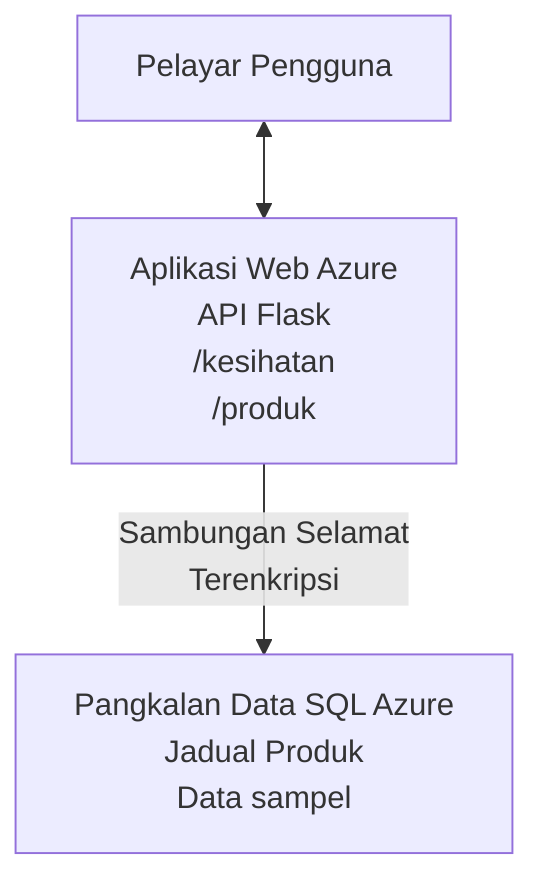

# Menyebarkan Pangkalan Data Microsoft SQL dan Aplikasi Web dengan AZD

⏱️ **Anggaran Masa**: 20-30 minit | 💰 **Anggaran Kos**: ~$15-25/bulan | ⭐ **Kesukaran**: Pertengahan

Contoh **lengkap dan berfungsi** ini menunjukkan bagaimana menggunakan [Azure Developer CLI (azd)](https://learn.microsoft.com/azure/developer/azure-developer-cli/) untuk menyebarkan aplikasi web Python Flask dengan Pangkalan Data Microsoft SQL ke Azure. Semua kod dimasukkan dan diuji—tiada kebergantungan luaran diperlukan.

## Apa Yang Akan Anda Pelajari

Dengan menyelesaikan contoh ini, anda akan:
- Menyebarkan aplikasi bertingkat pelbagai (aplikasi web + pangkalan data) menggunakan infrastruktur-sebagai-kod
- Mengkonfigurasi sambungan pangkalan data yang selamat tanpa menyimpan rahsia secara keras
- Memantau kesihatan aplikasi dengan Application Insights
- Mengurus sumber Azure dengan cekap menggunakan AZD CLI
- Mengikuti amalan terbaik Azure bagi keselamatan, pengoptimuman kos, dan kebolehpengamatan

## Gambaran Keseluruhan Senario
- **Aplikasi Web**: Python Flask REST API dengan sambungan pangkalan data
- **Pangkalan Data**: Azure SQL Database dengan data contoh
- **Infrastruktur**: Disediakan menggunakan Bicep (templat modular, boleh guna semula)
- **Penyebaran**: Sepenuhnya automatik dengan arahan `azd`
- **Pemantauan**: Application Insights untuk log dan telemetri

## Prasyarat

### Alat Diperlukan

Sebelum bermula, pastikan anda memasang alat berikut:

1. **[Azure CLI](https://learn.microsoft.com/cli/azure/install-azure-cli)** (versi 2.50.0 atau lebih tinggi)
   ```sh
   az --version
   # Output yang dijangka: azure-cli 2.50.0 atau lebih tinggi
   ```

2. **[Azure Developer CLI (azd)](https://learn.microsoft.com/azure/developer/azure-developer-cli/install-azd)** (versi 1.0.0 atau lebih tinggi)
   ```sh
   azd version
   # Output dijangka: versi azd 1.0.0 atau lebih tinggi
   ```

3. **[Python 3.8+](https://www.python.org/downloads/)** (untuk pembangunan tempatan)
   ```sh
   python --version
   # Output yang dijangkakan: Python 3.8 atau lebih tinggi
   ```

4. **[Docker](https://www.docker.com/get-started)** (pilihan, untuk pembangunan berbekas tempatan)
   ```sh
   docker --version
   # Output yang dijangka: Versi Docker 20.10 atau lebih tinggi
   ```

### Keperluan Azure

- Langganan **Azure aktif** ([buat akaun percuma](https://azure.microsoft.com/free/))
- Kebenaran untuk membuat sumber dalam langganan anda
- Peranan **Pemilik** atau **Penyumbang** pada langganan atau kumpulan sumber

### Prasyarat Pengetahuan

Ini adalah contoh **peringkat pertengahan**. Anda harus biasa dengan:
- Operasi baris arahan asas
- Konsep awan asas (sumber, kumpulan sumber)
- Pemahaman asas aplikasi web dan pangkalan data

**Baru dengan AZD?** Mula dengan [panduan Memulakan](../../docs/chapter-01-foundation/azd-basics.md) dahulu.

## Seni Bina

Contoh ini menyebarkan seni bina dua tingkat dengan aplikasi web dan pangkalan data SQL:



**Penyebaran Sumber:**
- **Kumpulan Sumber**: Bekas untuk semua sumber
- **Pelan Perkhidmatan Aplikasi**: Hos berasaskan Linux (tingkat B1 untuk penjimatan kos)
- **Aplikasi Web**: Runtime Python 3.11 dengan aplikasi Flask
- **Pelayan SQL**: Pelayan pangkalan data terurus dengan TLS 1.2 minimum
- **Pangkalan Data SQL**: Tingkat asas (2GB, sesuai untuk pembangunan/ujian)
- **Application Insights**: Pemantauan dan pencatatan
- **Log Analytics Workspace**: Penyimpanan log berpusat

**Analoginya**: Fikirkan ini seperti restoran (aplikasi web) dengan peti sejuk berjalan (pangkalan data). Pelanggan membuat pesanan dari menu (titik hujung API), dan dapur (aplikasi Flask) mengambil bahan (data) dari peti sejuk. Pengurus restoran (Application Insights) memantau segala yang berlaku.

## Struktur Folder

Semua fail termasuk dalam contoh ini—tiada kebergantungan luaran diperlukan:

```
examples/database-app/
│
├── README.md                    # This file
├── azure.yaml                   # AZD configuration file
├── .env.sample                  # Sample environment variables
├── .gitignore                   # Git ignore patterns
│
├── infra/                       # Infrastructure as Code (Bicep)
│   ├── main.bicep              # Main orchestration template
│   ├── abbreviations.json      # Azure naming conventions
│   └── resources/              # Modular resource templates
│       ├── sql-server.bicep    # SQL Server configuration
│       ├── sql-database.bicep  # Database configuration
│       ├── app-service-plan.bicep  # Hosting plan
│       ├── app-insights.bicep  # Monitoring setup
│       └── web-app.bicep       # Web application
│
└── src/
    └── web/                    # Application source code
        ├── app.py              # Flask REST API
        ├── requirements.txt    # Python dependencies
        └── Dockerfile          # Container definition
```

**Fungsi Setiap Fail:**
- **azure.yaml**: Memberitahu AZD apa yang hendak disebarkan dan di mana
- **infra/main.bicep**: Mengatur semua sumber Azure
- **infra/resources/*.bicep**: Definisi sumber individu (modular untuk guna semula)
- **src/web/app.py**: Aplikasi Flask dengan logik pangkalan data
- **requirements.txt**: Kebergantungan pakej Python
- **Dockerfile**: Arahan berbekas untuk penyebaran

## Mulakan Cepat (Langkah demi Langkah)

### Langkah 1: Klon dan Navigasi

```sh
git clone https://github.com/microsoft/AZD-for-beginners.git
cd AZD-for-beginners/examples/database-app
```

**✓ Semakan Kejayaan**: Pastikan anda melihat `azure.yaml` dan folder `infra/`:
```sh
ls
# Dijangka: README.md, azure.yaml, infra/, src/
```

### Langkah 2: Pengesahan dengan Azure

```sh
azd auth login
```

Ini membuka pelayar anda untuk pengesahan Azure. Log masuk dengan kelayakan Azure anda.

**✓ Semakan Kejayaan**: Anda sepatutnya melihat:
```
Logged in to Azure.
```

### Langkah 3: Inisialisasi Persekitaran

```sh
azd init
```

**Apa yang berlaku**: AZD mencipta konfigurasi tempatan untuk penyebaran anda.

**Prompt yang akan anda lihat**:
- **Nama persekitaran**: Masukkan nama pendek (contoh: `dev`, `myapp`)
- **Langganan Azure**: Pilih langganan anda dari senarai
- **Lokasi Azure**: Pilih rantau (contoh: `eastus`, `westeurope`)

**✓ Semakan Kejayaan**: Anda sepatutnya melihat:
```
SUCCESS: New project initialized!
```

### Langkah 4: Sediakan Sumber Azure

```sh
azd provision
```

**Apa yang berlaku**: AZD menyebarkan semua infrastruktur (ambil masa 5-8 minit):
1. Membuat kumpulan sumber
2. Membuat Pelayan dan Pangkalan Data SQL
3. Membuat Pelan Perkhidmatan Aplikasi
4. Membuat Aplikasi Web
5. Membuat Application Insights
6. Mengkonfigurasi rangkaian dan keselamatan

**Anda akan diminta untuk**:
- **Nama pengguna admin SQL**: Masukkan nama pengguna (contoh: `sqladmin`)
- **Kata laluan admin SQL**: Masukkan kata laluan yang kuat (simpan ini!)

**✓ Semakan Kejayaan**: Anda sepatutnya melihat:
```
SUCCESS: Your application was provisioned in Azure in X minutes Y seconds.
You can view the resources created under the resource group rg-<env-name> in Azure Portal:
https://portal.azure.com/#@/resource/subscriptions/.../resourceGroups/rg-<env-name>
```

**⏱️ Masa**: 5-8 minit

### Langkah 5: Sebarkan Aplikasi

```sh
azd deploy
```

**Apa yang berlaku**: AZD membina dan menyebarkan aplikasi Flask anda:
1. Mengepakan aplikasi Python
2. Membina bekas Docker
3. Menolak ke Azure Web App
4. Memulakan pangkalan data dengan data contoh
5. Memulakan aplikasi

**✓ Semakan Kejayaan**: Anda sepatutnya melihat:
```
SUCCESS: Your application was deployed to Azure in X minutes Y seconds.
You can view the resources created under the resource group rg-<env-name> in Azure Portal:
https://portal.azure.com/#@/resource/subscriptions/.../resourceGroups/rg-<env-name>
```

**⏱️ Masa**: 3-5 minit

### Langkah 6: Layari Aplikasi

```sh
azd browse
```

Ini membuka aplikasi web yang disebarkan dalam pelayar pada `https://app-<unique-id>.azurewebsites.net`

**✓ Semakan Kejayaan**: Anda sepatutnya melihat output JSON:
```json
{
  "message": "Welcome to the Database App API",
  "endpoints": {
    "/": "This help message",
    "/health": "Health check endpoint",
    "/products": "List all products",
    "/products/<id>": "Get product by ID"
  }
}
```

### Langkah 7: Uji Titik Hujung API

**Semakan Kesihatan** (sahkan sambungan pangkalan data):
```sh
curl https://app-<your-id>.azurewebsites.net/health
```

**Respons Dijangka**:
```json
{
  "status": "healthy",
  "database": "connected"
}
```

**Senarai Produk** (data contoh):
```sh
curl https://app-<your-id>.azurewebsites.net/products
```

**Respons Dijangka**:
```json
[
  {
    "id": 1,
    "name": "Laptop",
    "description": "High-performance laptop",
    "price": 1299.99,
    "created_at": "2025-11-19T10:30:00"
  },
  ...
]
```

**Dapatkan Produk Tunggal**:
```sh
curl https://app-<your-id>.azurewebsites.net/products/1
```

**✓ Semakan Kejayaan**: Semua titik hujung mengembalikan data JSON tanpa ralat.

---

**🎉 Tahniah!** Anda telah berjaya menyebarkan aplikasi web dengan pangkalan data ke Azure menggunakan AZD.

## Penyelaman Konfigurasi

### Pembolehubah Persekitaran

Rahsia diuruskan dengan selamat melalui konfigurasi Azure App Service—**jangan sesekali menyimpan keras dalam kod sumber**.

**Dikonfigurasi Secara Automatik oleh AZD**:
- `SQL_CONNECTION_STRING`: Sambungan pangkalan data dengan kelayakan disulitkan
- `APPLICATIONINSIGHTS_CONNECTION_STRING`: Titik hujung telemetri pemantauan
- `SCM_DO_BUILD_DURING_DEPLOYMENT`: Mengaktifkan pemasangan kebergantungan automatik

**Di Mana Rahsia Disimpan**:
1. Semasa `azd provision`, anda memberikan kelayakan SQL melalui prompt selamat
2. AZD menyimpannya dalam fail tempatan `.azure/<env-name>/.env` (diabaikan oleh git)
3. AZD menyuntiknya ke konfigurasi Azure App Service (disulitkan semasa penyimpanan)
4. Aplikasi membacanya melalui `os.getenv()` semasa runtuh

### Pembangunan Tempatan

Untuk ujian tempatan, cipta fail `.env` dari contoh:

```sh
cp .env.sample .env
# Sunting .env dengan sambungan pangkalan data tempatan anda
```

**Aliran Kerja Pembangunan Tempatan**:
```sh
# Pasang kebergantungan
cd src/web
pip install -r requirements.txt

# Tetapkan pembolehubah persekitaran
export SQL_CONNECTION_STRING="your-local-connection-string"

# Jalankan aplikasi
python app.py
```

**Uji secara tempatan**:
```sh
curl http://localhost:8000/health
# Dijangka: {"status": "sihat", "database": "berhubung"}
```

### Infrastruktur sebagai Kod

Semua sumber Azure ditakrifkan dalam **templat Bicep** (`infra/` folder):

- **Reka Bentuk Modular**: Setiap jenis sumber ada fail sendiri untuk guna semula
- **Parameterisasi**: Sesuaikan SKU, rantau, konvensyen penamaan
- **Amalan Terbaik**: Mematuhi piawaian penamaan dan keselamatan Azure
- **Kawalan Versi**: Perubahan infrastruktur diawasi dalam Git

**Contoh Penyesuaian**:
Untuk menukar tingkat pangkalan data, sunting `infra/resources/sql-database.bicep`:
```bicep
sku: {
  name: 'Standard'  // Changed from 'Basic'
  tier: 'Standard'
  capacity: 10
}
```

## Amalan Keselamatan Terbaik

Contoh ini mengikut amalan keselamatan terbaik Azure:

### 1. **Tiada Rahsia Dalam Kod Sumber**
- ✅ Kelayakan disimpan dalam konfigurasi Azure App Service (disulitkan)
- ✅ Fail `.env` dikecualikan dari Git melalui `.gitignore`
- ✅ Rahsia disalurkan melalui parameter selamat semasa penyiapan

### 2. **Sambungan Disulitkan**
- ✅ TLS 1.2 minimum untuk Pelayan SQL
- ✅ HTTPS sahaja dipaksakan untuk Aplikasi Web
- ✅ Sambungan pangkalan data menggunakan saluran disulitkan

### 3. **Keselamatan Rangkaian**
- ✅ Firewall Pelayan SQL dikonfigurasi untuk membenarkan perkhidmatan Azure sahaja
- ✅ Akses rangkaian awam dihadkan (boleh dikunci lebih dengan Private Endpoints)
- ✅ FTPS dimatikan pada Aplikasi Web

### 4. **Pengesahan & Kebenaran**
- ⚠️ **Semasa**: Pengesahan SQL (nama pengguna/katalaluan)
- ✅ **Cadangan Produksi**: Gunakan Managed Identity Azure untuk pengesahan tanpa kata laluan

**Untuk Naik Taraf ke Managed Identity** (untuk produksi):
1. Aktifkan managed identity pada Aplikasi Web
2. Beri kebenaran identiti untuk SQL
3. Kemas kini rentetan sambungan untuk menggunakan managed identity
4. Alih keluar pengesahan berasaskan kata laluan

### 5. **Audit & Pematuhan**
- ✅ Application Insights merekod semua permintaan dan ralat
- ✅ Audit Pangkalan Data SQL diaktifkan (boleh dikonfigurasi untuk pematuhan)
- ✅ Semua sumber ditag untuk tadbir urus

**Senarai Semak Keselamatan Sebelum Produksi**:
- [ ] Aktifkan Azure Defender untuk SQL
- [ ] Konfigurasikan Private Endpoints untuk Pangkalan Data SQL
- [ ] Aktifkan Web Application Firewall (WAF)
- [ ] Laksanakan Azure Key Vault untuk putaran rahsia
- [ ] Konfigurasikan pengesahan Microsoft Entra ID
- [ ] Aktifkan pencatatan diagnostik untuk semua sumber

## Pengoptimuman Kos

**Anggaran Kos Bulanan** (sehingga November 2025):

| Sumber | SKU/Tingkat | Anggaran Kos |
|----------|----------|----------------|
| Pelan Perkhidmatan Aplikasi | B1 (Asas) | ~$13/bulan |
| Pangkalan Data SQL | Asas (2GB) | ~$5/bulan |
| Application Insights | Bayar ikut guna | ~$2/bulan (trafik rendah) |
| **Jumlah** | | **~$20/bulan** |

**💡 Petua Jimat Kos**:

1. **Gunakan Tingkat Percuma untuk Pembelajaran**:
   - Pelan Perkhidmatan: Tingkat F1 (percuma, jam terhad)
   - Pangkalan Data SQL: Gunakan Azure SQL Database serverless
   - Application Insights: 5GB/bulan untuk pengambilan percuma

2. **Hentikan Sumber Apabila Tidak Digunakan**:
   ```sh
   # Hentikan aplikasi web (pangkalan data masih dikenakan caj)
   az webapp stop --name <app-name> --resource-group <rg-name>
   
   # Mulakan semula bila perlu
   az webapp start --name <app-name> --resource-group <rg-name>
   ```

3. **Padam Semua Selepas Ujian**:
   ```sh
   azd down
   ```
   Ini membuang SEMUA sumber dan menghentikan caj.

4. **SKU Pembangunan vs Produksi**:
   - **Pembangunan**: Tingkat asas (digunakan dalam contoh ini)
   - **Produksi**: Tingkat Standard/Premium dengan redudan

**Pemantauan Kos**:
- Lihat kos dalam [Azure Cost Management](https://portal.azure.com/#view/Microsoft_Azure_CostManagement)
- Tetapkan amaran kos untuk elak kejutan
- Tag semua sumber dengan `azd-env-name` untuk penjejakan

**Alternatif Tingkat Percuma**:
Untuk tujuan pembelajaran, anda boleh ubah `infra/resources/app-service-plan.bicep`:
```bicep
sku: {
  name: 'F1'  // Free tier
  tier: 'Free'
}
```
**Nota**: Tingkat percuma ada had (60 minit/hari CPU, tiada mode sentiasa aktif).

## Pemantauan & Kebolehpengamatan

### Integrasi Application Insights

Contoh ini termasuk **Application Insights** untuk pemantauan menyeluruh:

**Yang Dipantau**:
- ✅ Permintaan HTTP (latensi, kod status, titik hujung)
- ✅ Ralat dan pengecualian aplikasi
- ✅ Pencatatan tersuai dari aplikasi Flask
- ✅ Kesihatan sambungan pangkalan data
- ✅ Metrik prestasi (CPU, memori)

**Akses Application Insights**:
1. Buka [Azure Portal](https://portal.azure.com)
2. Navigasi ke kumpulan sumber anda (`rg-<env-name>`)
3. Klik sumber Application Insights (`appi-<unique-id>`)

**Kueri Berguna** (Application Insights → Logs):

**Lihat Semua Permintaan**:
```kusto
requests
| where timestamp > ago(1h)
| order by timestamp desc
| project timestamp, name, url, resultCode, duration
```

**Cari Ralat**:
```kusto
exceptions
| where timestamp > ago(24h)
| order by timestamp desc
| project timestamp, type, outerMessage, operation_Name
```

**Semak Titik Hujung Kesihatan**:
```kusto
requests
| where name contains "health"
| summarize count() by resultCode, bin(timestamp, 1h)
```

### Audit Pangkalan Data SQL

**Audit Pangkalan Data SQL diaktifkan** untuk mengesan:
- Corak akses pangkalan data
- Cubaan log masuk gagal
- Perubahan skema
- Akses data (untuk pematuhan)

**Akses Log Audit**:
1. Azure Portal → Pangkalan Data SQL → Audit
2. Lihat log dalam Log Analytics workspace

### Pemantauan Masa Nyata

**Lihat Metrik Langsung**:
1. Application Insights → Live Metrics
2. Lihat permintaan, kegagalan, dan prestasi masa nyata

**Tetapkan Amaran**:
Cipta amaran untuk kejadian kritikal:
- Ralat HTTP 500 > 5 kali dalam 5 minit
- Kegagalan sambungan pangkalan data
- Masa tindak balas tinggi (>2 saat)

**Contoh Cipta Amaran**:
```sh
az monitor metrics alert create \
  --name "High-Response-Time" \
  --resource-group <rg-name> \
  --scopes <app-insights-resource-id> \
  --condition "avg requests/duration > 2000" \
  --description "Alert when response time exceeds 2 seconds"
```

## Penyelesaian Masalah
### Isu-isu Biasa dan Penyelesaian

#### 1. `azd provision` gagal dengan "Lokasi tidak tersedia"

**Gejala**:  
```
Error: The subscription is not registered for the resource type 'components' in the location 'centralus'.
```
  
**Penyelesaian**:  
Pilih rantau Azure yang berbeza atau daftar pembekal sumber:  
```sh
az provider register --namespace Microsoft.Insights
```
  
#### 2. Sambungan SQL Gagal Semasa Penghantaran

**Gejala**:  
```
pyodbc.OperationalError: ('08001', '[08001] [Microsoft][ODBC Driver 18 for SQL Server]TCP Provider...')
```
  
**Penyelesaian**:  
- Sahkan firewall SQL Server membenarkan perkhidmatan Azure (dikonfigurasikan secara automatik)  
- Periksa kata laluan pentadbir SQL dimasukkan dengan betul semasa `azd provision`  
- Pastikan SQL Server sudah lengkap dipasang (boleh mengambil masa 2-3 minit)  

**Sahkan Sambungan**:  
```sh
# Dari Portal Azure, pergi ke SQL Database → Penyunting pertanyaan
# Cuba sambungkan dengan kelayakan anda
```
  
#### 3. Web App Memaparkan "Ralat Aplikasi"

**Gejala**:  
Pelayar memaparkan halaman ralat generik.

**Penyelesaian**:  
Periksa log aplikasi:  
```sh
# Lihat log terkini
az webapp log tail --name <app-name> --resource-group <rg-name>
```
  
**Punca biasa**:  
- Pembolehubah persekitaran hilang (periksa App Service → Konfigurasi)  
- Pemasangan pakej Python gagal (periksa log penghantaran)  
- Ralat inisialisasi pangkalan data (periksa keterhubungan SQL)  

#### 4. `azd deploy` Gagal dengan "Ralat Kompilasi"

**Gejala**:  
```
Error: Failed to build project
```
  
**Penyelesaian**:  
- Pastikan `requirements.txt` tiada ralat sintaks  
- Periksa bahawa Python 3.11 dinyatakan dalam `infra/resources/web-app.bicep`  
- Sahkan Dockerfile mempunyai imej asas yang betul  

**Sah penyahpepijatan secara tempatan**:  
```sh
cd src/web
docker build -t test-app .
docker run -p 8000:8000 test-app
```
  
#### 5. "Tidak Sah" Apabila Menjalankan Perintah AZD

**Gejala**:  
```
ERROR: (Unauthorized) The client '<id>' with object id '<id>' does not have authorization
```
  
**Penyelesaian**:  
Log masuk semula ke Azure:  
```sh
# Diperlukan untuk aliran kerja AZD
azd auth login

# Pilihan jika anda juga menggunakan arahan Azure CLI secara langsung
az login
```
  
Sahkan anda mempunyai kebenaran yang betul (peranan Contributor) pada langganan.

#### 6. Kos Pangkalan Data Tinggi

**Gejala**:  
Bil Azure yang tidak dijangka.

**Penyelesaian**:  
- Periksa jika anda terlupa menjalankan `azd down` selepas ujian  
- Sahkan Pangkalan Data SQL menggunakan tahap Basic (bukan Premium)  
- Semak kos dalam Pengurusan Kos Azure  
- Tetapkan amaran kos  

### Mendapatkan Bantuan

**Lihat Semua Pembolehubah Persekitaran AZD**:  
```sh
azd env get-values
```
  
**Semak Status Penghantaran**:  
```sh
az webapp show --name <app-name> --resource-group <rg-name> --query state
```
  
**Akses Log Aplikasi**:  
```sh
az webapp log download --name <app-name> --resource-group <rg-name> --log-file app-logs.zip
```
  
**Perlukan Bantuan Lagi?**  
- [Panduan Penyelesaian Masalah AZD](../../docs/chapter-07-troubleshooting/common-issues.md)  
- [Penyelesaian Masalah Azure App Service](https://learn.microsoft.com/azure/app-service/troubleshoot-diagnostic-logs)  
- [Penyelesaian Masalah Azure SQL](https://learn.microsoft.com/azure/azure-sql/database/troubleshoot-common-errors-issues)  

## Latihan Praktikal

### Latihan 1: Sahkan Penghantaran Anda (Pemula)

**Matlamat**: Sahkan semua sumber telah dihantar dan aplikasi berfungsi.

**Langkah-langkah**:  
1. Senaraikan semua sumber dalam kumpulan sumber anda:  
   ```sh
   az resource list --resource-group rg-<env-name> --output table
   ```
  
  **Jangkaan**: 6-7 sumber (Web App, SQL Server, Pangkalan Data SQL, Pelan App Service, Application Insights, Log Analytics)  

2. Uji semua titik akhir API:  
   ```sh
   curl https://app-<your-id>.azurewebsites.net/
   curl https://app-<your-id>.azurewebsites.net/health
   curl https://app-<your-id>.azurewebsites.net/products
   curl https://app-<your-id>.azurewebsites.net/products/1
   ```
  
  **Jangkaan**: Semua mengembalikan JSON sah tanpa ralat  

3. Periksa Application Insights:  
   - Pergi ke Application Insights di Azure Portal  
   - Pilih "Live Metrics"  
   - Segarkan pelayar anda pada aplikasi web  
   **Jangkaan**: Permintaan muncul secara masa nyata  

**Kriteria Kejayaan**: Semua 6-7 sumber wujud, semua titik akhir mengembalikan data, Live Metrics menunjukkan aktiviti.

---

### Latihan 2: Tambah Titik Akhir API Baru (Sederhana)

**Matlamat**: Memperluaskan aplikasi Flask dengan titik akhir baru.

**Kod Permulaan**: Titik akhir semasa dalam `src/web/app.py`

**Langkah-langkah**:  
1. Edit `src/web/app.py` dan tambah titik akhir baru selepas fungsi `get_product()`:  
   ```python
   @app.route('/products/search/<keyword>')
   def search_products(keyword):
       """Search products by name or description."""
       try:
           conn = get_db_connection()
           cursor = conn.cursor()
           cursor.execute(
               "SELECT id, name, description, price, created_at FROM products WHERE name LIKE ? OR description LIKE ?",
               (f'%{keyword}%', f'%{keyword}%')
           )
           
           products = []
           for row in cursor.fetchall():
               products.append({
                   'id': row[0],
                   'name': row[1],
                   'description': row[2],
                   'price': float(row[3]) if row[3] else None,
                   'created_at': row[4].isoformat() if row[4] else None
               })
           
           cursor.close()
           conn.close()
           
           logger.info(f"Search for '{keyword}' returned {len(products)} results")
           return jsonify(products), 200
           
       except Exception as e:
           logger.error(f"Error searching products: {str(e)}")
           return jsonify({'error': str(e)}), 500
   ```
  
2. Hantar aplikasi yang dikemas kini:  
   ```sh
   azd deploy
   ```
  
3. Uji titik akhir baru:  
   ```sh
   curl https://app-<your-id>.azurewebsites.net/products/search/laptop
   ```
  
  **Jangkaan**: Mengembalikan produk yang sepadan dengan "laptop"  

**Kriteria Kejayaan**: Titik akhir baru berfungsi, mengembalikan hasil yang ditapis, dipaparkan dalam log Application Insights.

---

### Latihan 3: Tambah Pemantauan dan Amaran (Lanjutan)

**Matlamat**: Menyediakan pemantauan proaktif dengan amaran.

**Langkah-langkah**:  
1. Buat amaran untuk ralat HTTP 500:  
   ```sh
   # Dapatkan ID sumber Application Insights
   AI_ID=$(az monitor app-insights component show \
     --app appi-<your-id> \
     --resource-group rg-<env-name> \
     --query id -o tsv)
   
   # Buat amaran
   az monitor metrics alert create \
     --name "High-Error-Rate" \
     --resource-group rg-<env-name> \
     --scopes $AI_ID \
     --condition "count requests/failed > 5" \
     --window-size 5m \
     --evaluation-frequency 1m \
     --description "Alert when >5 failed requests in 5 minutes"
   ```
  
2. Picu amaran dengan menyebabkan ralat:  
   ```sh
   # Meminta produk yang tidak wujud
   for i in {1..10}; do curl https://app-<your-id>.azurewebsites.net/products/999; done
   ```
  
3. Semak jika amaran tercetus:  
   - Azure Portal → Amaran → Peraturan Amaran  
   - Semak e-mel anda (jika dikonfigurasikan)  

**Kriteria Kejayaan**: Peraturan amaran dibuat, tercetus pada ralat, penerimaan pemberitahuan.

---

### Latihan 4: Perubahan Skema Pangkalan Data (Lanjutan)

**Matlamat**: Tambah jadual baru dan kemaskini aplikasi untuk menggunakannya.

**Langkah-langkah**:  
1. Sambung ke Pangkalan Data SQL melalui Editor Pertanyaan di Azure Portal  

2. Buat jadual `categories` baru:  
   ```sql
   CREATE TABLE categories (
       id INT PRIMARY KEY IDENTITY(1,1),
       name NVARCHAR(50) NOT NULL,
       description NVARCHAR(200)
   );
   
   INSERT INTO categories (name, description) VALUES
   ('Electronics', 'Electronic devices and accessories'),
   ('Office Supplies', 'Office equipment and supplies');
   
   -- Add category to products table
   ALTER TABLE products ADD category_id INT;
   UPDATE products SET category_id = 1; -- Set all to Electronics
   ```
  
3. Kemaskini `src/web/app.py` untuk memasukkan maklumat kategori dalam respons  

4. Hantar dan uji  

**Kriteria Kejayaan**: Jadual baru wujud, produk memaparkan maklumat kategori, aplikasi masih berfungsi.

---

### Latihan 5: Laksanakan Caching (Pakar)

**Matlamat**: Tambah Azure Redis Cache untuk meningkatkan prestasi.

**Langkah-langkah**:  
1. Tambah Redis Cache ke `infra/main.bicep`  
2. Kemaskini `src/web/app.py` untuk caching kueri produk  
3. Ukur peningkatan prestasi dengan Application Insights  
4. Bandingkan masa tindak balas sebelum/selepas caching  

**Kriteria Kejayaan**: Redis dihantar, caching berfungsi, masa tindak balas meningkat >50%.

**Petua**: Mulakan dengan [Dokumentasi Azure Cache for Redis](https://learn.microsoft.com/azure/azure-cache-for-redis/).

---

## Pembersihan

Untuk mengelakkan caj berterusan, padam semua sumber selepas selesai:

```sh
azd down
```
  
**Prompt pengesahan**:  
```
? Total resources to delete: 7, are you sure you want to continue? (y/N)
```
  
Taip `y` untuk mengesahkan.

**✓ Semakan Kejayaan**:  
- Semua sumber dipadam dari Azure Portal  
- Tiada caj berterusan  
- Folder `.azure/<env-name>` tempatan boleh dipadam  

**Alternatif** (simpan infrastruktur, padam data):  
```sh
# Padamkan hanya kumpulan sumber (simpan konfigurasi AZD)
az group delete --name rg-<env-name> --yes
```
## Ketahui Lebih Lanjut

### Dokumentasi Berkaitan
- [Dokumentasi Azure Developer CLI](https://learn.microsoft.com/azure/developer/azure-developer-cli/)  
- [Dokumentasi Azure SQL Database](https://learn.microsoft.com/azure/azure-sql/database/)  
- [Dokumentasi Azure App Service](https://learn.microsoft.com/azure/app-service/)  
- [Dokumentasi Application Insights](https://learn.microsoft.com/azure/azure-monitor/app/app-insights-overview)  
- [Rujukan Bahasa Bicep](https://learn.microsoft.com/azure/azure-resource-manager/bicep/)  

### Langkah Seterusnya dalam Kursus Ini  
- **[Contoh Container Apps](../../../../examples/container-app)**: Hantar mikroservis dengan Azure Container Apps  
- **[Panduan Integrasi AI](../../../../docs/ai-foundry)**: Tambah kebolehan AI ke aplikasi anda  
- **[Amalan Terbaik Penghantaran](../../docs/chapter-04-infrastructure/deployment-guide.md)**: Corak penghantaran produksi  

### Topik Lanjutan  
- **Identiti Terurus**: Alih keluar kata laluan dan guna pengesahan Microsoft Entra ID  
- **Private Endpoints**: Amankan sambungan pangkalan data dalam rangkaian maya  
- **Integrasi CI/CD**: Automatikkan penghantaran dengan GitHub Actions atau Azure DevOps  
- **Pelbagai Persekitaran**: Tetapkan persekitaran dev, staging, dan produksi  
- **Migrasi Pangkalan Data**: Gunakan Alembic atau Entity Framework untuk versi skema  

### Perbandingan dengan Pendekatan Lain

**AZD vs. ARM Templates**:  
- ✅ AZD: Abstraksi tahap tinggi, arahan lebih ringkas  
- ⚠️ ARM: Lebih terperinci, kawalan granular  

**AZD vs. Terraform**:  
- ✅ AZD: Native Azure, terintegrasi dengan perkhidmatan Azure  
- ⚠️ Terraform: Sokongan multi-cloud, ekosistem lebih besar  

**AZD vs. Azure Portal**:  
- ✅ AZD: Boleh diulang, versi dikawal, boleh diautomasi  
- ⚠️ Portal: Klik manual, sukar untuk diulang  

**Fikirkan AZD sebagai**: Docker Compose untuk Azure—konfigurasi dipermudahkan untuk penghantaran kompleks.

---

## Soalan Lazim

**S: Bolehkah saya menggunakan bahasa pengaturcaraan lain?**  
J: Ya! Gantikan `src/web/` dengan Node.js, C#, Go, atau mana-mana bahasa. Kemaskini `azure.yaml` dan Bicep mengikutnya.

**S: Bagaimana saya menambah lebih banyak pangkalan data?**  
J: Tambah modul Pangkalan Data SQL lain di `infra/main.bicep` atau gunakan PostgreSQL/MySQL dari perkhidmatan Pangkalan Data Azure.

**S: Bolehkah saya gunakan ini untuk produksi?**  
J: Ini adalah titik permulaan. Untuk produksi, tambah: identiti terurus, private endpoints, redunan, strategi sandaran, WAF, dan pemantauan ditingkatkan.

**S: Apa jika saya mahu guna kontena dan bukannya penghantaran kod?**  
J: Semak [Contoh Container Apps](../../../../examples/container-app) yang menggunakan kontena Docker sepenuhnya.

**S: Bagaimana saya sambung ke pangkalan data dari mesin tempatan saya?**  
J: Tambah IP anda ke firewall SQL Server:  
```sh
az sql server firewall-rule create \
  --resource-group rg-<env-name> \
  --server sql-<unique-id> \
  --name AllowMyIP \
  --start-ip-address <your-ip> \
  --end-ip-address <your-ip>
```
  
**S: Bolehkah saya gunakan pangkalan data sedia ada dan bukan buat baru?**  
J: Ya, ubah `infra/main.bicep` untuk merujuk SQL Server sedia ada dan kemaskini parameter rentetan sambungan.

---

> **Nota:** Contoh ini menunjukkan amalan terbaik untuk menghantar aplikasi web dengan pangkalan data menggunakan AZD. Ia termasuk kod berfungsi, dokumentasi menyeluruh, dan latihan praktikal untuk mengukuhkan pembelajaran. Untuk penghantaran produksi, tinjau keselamatan, penskalaan, pematuhan, dan keperluan kos khusus organisasi anda.

**📚 Navigasi Kursus:**  
- ← Sebelumnya: [Contoh Container Apps](../../../../examples/container-app)  
- → Seterusnya: [Panduan Integrasi AI](../../../../docs/ai-foundry)  
- 🏠 [Laman Utama Kursus](../../README.md)

---

<!-- CO-OP TRANSLATOR DISCLAIMER START -->
**Penafian**:
Dokumen ini telah diterjemahkan menggunakan perkhidmatan terjemahan AI [Co-op Translator](https://github.com/Azure/co-op-translator). Walaupun kami berusaha untuk ketepatan, sila ambil maklum bahawa terjemahan automatik mungkin mengandungi kesilapan atau ketidaktepatan. Dokumen asal dalam bahasa asalnya harus dianggap sebagai sumber yang sahih. Untuk maklumat penting, terjemahan oleh manusia profesional adalah disyorkan. Kami tidak bertanggungjawab terhadap sebarang salah faham atau salah tafsir yang timbul daripada penggunaan terjemahan ini.
<!-- CO-OP TRANSLATOR DISCLAIMER END -->