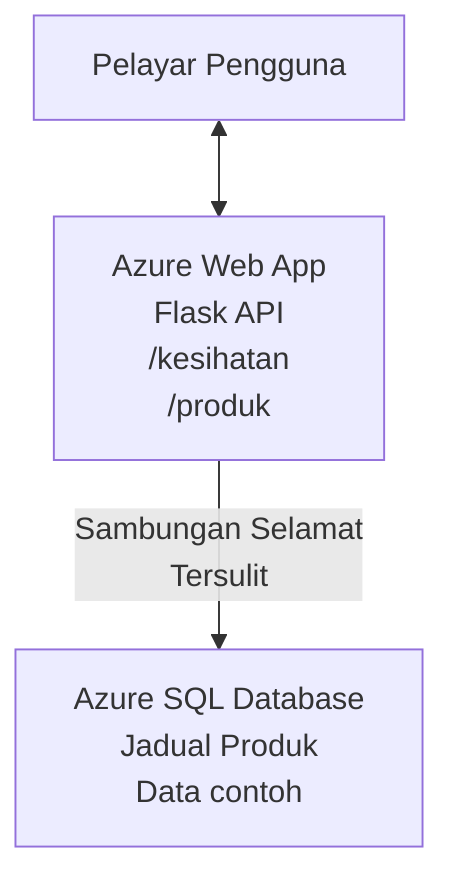

# Menyebarkan Pangkalan Data Microsoft SQL dan Aplikasi Web dengan AZD

⏱️ **Anggaran Masa**: 20-30 minit | 💰 **Anggaran Kos**: ~$15-25/bulan | ⭐ **Kerumitan**: Pertengahan

**Contoh lengkap dan berfungsi** ini menunjukkan cara menggunakan [Azure Developer CLI (azd)](https://learn.microsoft.com/azure/developer/azure-developer-cli/) untuk menyebarkan aplikasi web Python Flask dengan Pangkalan Data Microsoft SQL ke Azure. Semua kod disertakan dan telah diuji—tiada kebergantungan luaran diperlukan.

## Apa Yang Akan Anda Pelajari

Dengan menyelesaikan contoh ini, anda akan:
- Menyebarkan aplikasi berbilang lapisan (aplikasi web + pangkalan data) menggunakan infrastruktur sebagai kod
- Mengkonfigurasi sambungan pangkalan data yang selamat tanpa menyulitkan rahsia dalam kod
- Memantau kesihatan aplikasi dengan Application Insights
- Mengurus sumber Azure dengan cekap menggunakan AZD CLI
- Mengikuti amalan terbaik Azure untuk keselamatan, pengoptimuman kos, dan kebolehperhimpunan

## Gambaran Keseluruhan Senario
- **Aplikasi Web**: API REST Python Flask dengan sambungan pangkalan data
- **Pangkalan Data**: Azure SQL Database dengan data contoh
- **Infrastruktur**: Disediakan menggunakan Bicep (templat modular dan boleh guna semula)
- **Penyebaran**: Automatik sepenuhnya dengan arahan `azd`
- **Pemantauan**: Application Insights untuk log dan telemetri

## Prasyarat

### Alat Diperlukan

Sebelum bermula, pastikan anda mempunyai alat ini dipasang:

1. **[Azure CLI](https://learn.microsoft.com/cli/azure/install-azure-cli)** (versi 2.50.0 atau lebih tinggi)
   ```sh
   az --version
   # Output yang dijangka: azure-cli 2.50.0 atau lebih tinggi
   ```

2. **[Azure Developer CLI (azd)](https://learn.microsoft.com/azure/developer/azure-developer-cli/install-azd)** (versi 1.0.0 atau lebih tinggi)
   ```sh
   azd version
   # Output yang dijangkakan: versi azd 1.0.0 atau lebih tinggi
   ```

3. **[Python 3.8+](https://www.python.org/downloads/)** (untuk pembangunan tempatan)
   ```sh
   python --version
   # Jangkaan output: Python 3.8 atau lebih tinggi
   ```

4. **[Docker](https://www.docker.com/get-started)** (pilihan, untuk pembangunan berbekas tempatan)
   ```sh
   docker --version
   # Hasil dijangka: Versi Docker 20.10 atau lebih tinggi
   ```

### Keperluan Azure

- **Langganan Azure** yang aktif ([buat akaun percuma](https://azure.microsoft.com/free/))
- Kebenaran untuk mencipta sumber dalam langganan anda
- Peranan **Pemilik** atau **Penyumbang** pada langganan atau kumpulan sumber

### Prasyarat Pengetahuan

Ini adalah contoh **peringkat pertengahan**. Anda harus biasa dengan:
- Operasi asas baris arahan
- Konsep awan asas (sumber, kumpulan sumber)
- Pemahaman asas aplikasi web dan pangkalan data

**Baru dengan AZD?** Mulakan dengan panduan [Memulakan](../../docs/chapter-01-foundation/azd-basics.md).

## Seni Bina

Contoh ini menyebarkan seni bina dua lapisan dengan aplikasi web dan pangkalan data SQL:


**Penyebaran Sumber:**
- **Kumpulan Sumber**: Tempat semua sumber disimpan
- **Pelan Perkhidmatan Aplikasi**: Hos berasaskan Linux (tier B1 untuk kos efisien)
- **Aplikasi Web**: Runtime Python 3.11 dengan aplikasi Flask
- **Pelayan SQL**: Pelayan pangkalan data terurus dengan TLS 1.2 minimum
- **Pangkalan Data SQL**: Tier Basic (2GB, sesuai untuk pembangunan/ujian)
- **Application Insights**: Pemantauan dan pelog
- **Ruang Kerja Log Analytics**: Penyimpanan log berpusat

**Analogi**: Anggap ia seperti restoran (aplikasi web) dengan peti sejuk berjalan (pangkalan data). Pelanggan memesan dari menu (titik akhir API), dan dapur (aplikasi Flask) mendapatkan bahan (data) dari peti sejuk. Pengurus restoran (Application Insights) memantau semua yang berlaku.

## Struktur Folder

Semua fail dimasukkan dalam contoh ini—tiada kebergantungan luaran diperlukan:

```
examples/database-app/
│
├── README.md                    # This file
├── azure.yaml                   # AZD configuration file
├── .env.sample                  # Sample environment variables
├── .gitignore                   # Git ignore patterns
│
├── infra/                       # Infrastructure as Code (Bicep)
│   ├── main.bicep              # Main orchestration template
│   ├── abbreviations.json      # Azure naming conventions
│   └── resources/              # Modular resource templates
│       ├── sql-server.bicep    # SQL Server configuration
│       ├── sql-database.bicep  # Database configuration
│       ├── app-service-plan.bicep  # Hosting plan
│       ├── app-insights.bicep  # Monitoring setup
│       └── web-app.bicep       # Web application
│
└── src/
    └── web/                    # Application source code
        ├── app.py              # Flask REST API
        ├── requirements.txt    # Python dependencies
        └── Dockerfile          # Container definition
```

**Fungsi Setiap Fail:**
- **azure.yaml**: Beritahu AZD apa yang hendak disebarkan dan ke mana
- **infra/main.bicep**: Mengatur semua sumber Azure
- **infra/resources/*.bicep**: Definisi sumber individu (modular untuk kegunaan semula)
- **src/web/app.py**: Aplikasi Flask dengan logik pangkalan data
- **requirements.txt**: Kebergantungan pakej Python
- **Dockerfile**: Arahan pengbekasan untuk penyebaran

## Mula Pantas (Langkah demi Langkah)

### Langkah 1: Clone dan Navigasi

```sh
git clone https://github.com/microsoft/AZD-for-beginners.git
cd AZD-for-beginners/examples/database-app
```

**✓ Semakan Kejayaan**: Pastikan anda melihat `azure.yaml` dan folder `infra/`:
```sh
ls
# Dijangka: README.md, azure.yaml, infra/, src/
```

### Langkah 2: Log Masuk ke Azure

```sh
azd auth login
```

Ini membuka pelayar anda untuk pengesahan Azure. Log masuk menggunakan kelayakan Azure anda.

**✓ Semakan Kejayaan**: Anda sepatutnya melihat:
```
Logged in to Azure.
```

### Langkah 3: Inisialisasi Persekitaran

```sh
azd init
```

**Apa yang berlaku**: AZD mencipta konfigurasi tempatan untuk penyebaran anda.

**Arahan yang akan dijawab**:
- **Nama persekitaran**: Masukkan nama singkat (contoh, `dev`, `myapp`)
- **Langganan Azure**: Pilih langganan anda dari senarai
- **Lokasi Azure**: Pilih rantau (contoh, `eastus`, `westeurope`)

**✓ Semakan Kejayaan**: Anda sepatutnya melihat:
```
SUCCESS: New project initialized!
```

### Langkah 4: Sediakan Sumber Azure

```sh
azd provision
```

**Apa yang berlaku**: AZD menyebarkan semua infrastruktur (ambil masa 5-8 minit):
1. Membuat kumpulan sumber
2. Membuat Pelayan SQL dan Pangkalan Data
3. Membuat Pelan Perkhidmatan Aplikasi
4. Membuat Aplikasi Web
5. Membuat Application Insights
6. Mengkonfigurasi rangkaian dan keselamatan

**Anda akan diminta untuk**:
- **Nama pengguna pentadbir SQL**: Masukkan nama pengguna (contoh, `sqladmin`)
- **Kata laluan pentadbir SQL**: Masukkan kata laluan yang kuat (simpan ini!)

**✓ Semakan Kejayaan**: Anda sepatutnya melihat:
```
SUCCESS: Your application was provisioned in Azure in X minutes Y seconds.
You can view the resources created under the resource group rg-<env-name> in Azure Portal:
https://portal.azure.com/#@/resource/subscriptions/.../resourceGroups/rg-<env-name>
```

**⏱️ Masa**: 5-8 minit

### Langkah 5: Sebarkan Aplikasi

```sh
azd deploy
```

**Apa yang berlaku**: AZD membina dan menyebarkan aplikasi Flask anda:
1. Mengepak aplikasi Python
2. Membina kontena Docker
3. Mendorong ke Azure Web App
4. Memulakan pangkalan data dengan data contoh
5. Memulakan aplikasi

**✓ Semakan Kejayaan**: Anda sepatutnya melihat:
```
SUCCESS: Your application was deployed to Azure in X minutes Y seconds.
You can view the resources created under the resource group rg-<env-name> in Azure Portal:
https://portal.azure.com/#@/resource/subscriptions/.../resourceGroups/rg-<env-name>
```

**⏱️ Masa**: 3-5 minit

### Langkah 6: Layari Aplikasi

```sh
azd browse
```

Ini membuka aplikasi web yang disebarkan dalam pelayar di `https://app-<unique-id>.azurewebsites.net`

**✓ Semakan Kejayaan**: Anda sepatutnya melihat output JSON:
```json
{
  "message": "Welcome to the Database App API",
  "endpoints": {
    "/": "This help message",
    "/health": "Health check endpoint",
    "/products": "List all products",
    "/products/<id>": "Get product by ID"
  }
}
```

### Langkah 7: Uji Titik Akhir API

**Semakan Kesihatan** (sahkan sambungan pangkalan data):
```sh
curl https://app-<your-id>.azurewebsites.net/health
```

**Balasan Dijangka**:
```json
{
  "status": "healthy",
  "database": "connected"
}
```

**Senarai Produk** (data contoh):
```sh
curl https://app-<your-id>.azurewebsites.net/products
```

**Balasan Dijangka**:
```json
[
  {
    "id": 1,
    "name": "Laptop",
    "description": "High-performance laptop",
    "price": 1299.99,
    "created_at": "2025-11-19T10:30:00"
  },
  ...
]
```

**Dapatkan Produk Tunggal**:
```sh
curl https://app-<your-id>.azurewebsites.net/products/1
```

**✓ Semakan Kejayaan**: Semua titik akhir mengembalikan data JSON tanpa ralat.

---

**🎉 Tahniah!** Anda telah berjaya menyebarkan aplikasi web dengan pangkalan data ke Azure menggunakan AZD.

## Penyelaman Konfigurasi

### Pembolehubah Persekitaran

Rahsia dikendalikan dengan selamat melalui konfigurasi Azure App Service—**jangan sesekali menyulitkannya dalam kod sumber**.

**Dikonfigurasi Secara Automatik oleh AZD**:
- `SQL_CONNECTION_STRING`: Sambungan pangkalan data dengan kelayakan disulit
- `APPLICATIONINSIGHTS_CONNECTION_STRING`: Titik akhir telemetri pemantauan
- `SCM_DO_BUILD_DURING_DEPLOYMENT`: Mengaktifkan pemasangan kebergantungan automatik

**Lokasi Penyimpanan Rahsia**:
1. Semasa `azd provision`, anda menyediakan kelayakan SQL melalui arahan yang selamat
2. AZD menyimpannya dalam fail `.azure/<env-name>/.env` tempatan anda (diabaikan oleh git)
3. AZD menyuntiknya ke konfigurasi Azure App Service (disulitkan ketika disimpan)
4. Aplikasi membaca melalui `os.getenv()` semasa waktu jalan

### Pembangunan Tempatan

Untuk ujian tempatan, cipta fail `.env` dari contoh:

```sh
cp .env.sample .env
# Edit .env dengan sambungan pangkalan data tempatan anda
```

**Alir Kerja Pembangunan Tempatan**:
```sh
# Pasang kebergantungan
cd src/web
pip install -r requirements.txt

# Tetapkan pembolehubah persekitaran
export SQL_CONNECTION_STRING="your-local-connection-string"

# Jalankan aplikasi
python app.py
```

**Uji secara tempatan**:
```sh
curl http://localhost:8000/health
# Dijangka: {"status": "sehat", "database": "bersambung"}
```

### Infrastruktur sebagai Kod

Semua sumber Azure ditakrifkan dalam **templat Bicep** (`infra/` folder):

- **Reka Bentuk Modular**: Setiap jenis sumber mempunyai fail sendiri untuk kegunaan semula
- **Diparameterkan**: Sesuaikan SKU, rantau, konvensyen penamaan
- **Amalan Terbaik**: Mengikuti piawaian penamaan dan sekuriti Azure
- **Kawalan Versi**: Perubahan infrastruktur direkod dalam Git

**Contoh Pengubahsuaian**:
Untuk menukar tier pangkalan data, sunting `infra/resources/sql-database.bicep`:
```bicep
sku: {
  name: 'Standard'  // Changed from 'Basic'
  tier: 'Standard'
  capacity: 10
}
```

## Amalan Terbaik Keselamatan

Contoh ini mengikuti amalan terbaik keselamatan Azure:

### 1. **Tiada Rahsia dalam Kod Sumber**
- ✅ Kelayakan disimpan dalam konfigurasi Azure App Service (disulit)
- ✅ Fail `.env` dikecualikan dari Git melalui `.gitignore`
- ✅ Rahsia dihantar melalui parameter selamat semasa penyediaan

### 2. **Sambungan Disulit**
- ✅ TLS 1.2 minimum untuk Pelayan SQL
- ✅ HTTPS sahaja diwajibkan untuk Aplikasi Web
- ✅ Sambungan pangkalan data menggunakan saluran disulit

### 3. **Keselamatan Rangkaian**
- ✅ Firewall Pelayan SQL dikonfigurasi membenarkan servis Azure sahaja
- ✅ Akses rangkaian awam terhad (boleh dikekang dengan Private Endpoints)
- ✅ FTPS dimatikan di Aplikasi Web

### 4. **Pengesahan & Kebenaran**
- ⚠️ **Semasa**: Pengesahan SQL (nama pengguna/kata laluan)
- ✅ **Cadangan Produksi**: Gunakan Azure Managed Identity untuk pengesahan tanpa kata laluan

**Untuk Naik Taraf ke Managed Identity** (untuk produksi):
1. Aktifkan managed identity pada Aplikasi Web
2. Beri kebenaran SQL kepada identity
3. Kemas kini rentetan sambungan untuk guna managed identity
4. Keluarkan pengesahan berasaskan kata laluan

### 5. **Audit & Pematuhan**
- ✅ Application Insights mencatat semua permintaan dan ralat
- ✅ Audit Pangkalan Data SQL diaktifkan (boleh dikonfigurasi untuk pematuhan)
- ✅ Semua sumber diberi tag untuk tadbir urus

**Senarai Semak Keselamatan Sebelum Produksi**:
- [ ] Aktifkan Azure Defender untuk SQL
- [ ] Konfigurasikan Private Endpoints untuk Pangkalan Data SQL
- [ ] Aktifkan Web Application Firewall (WAF)
- [ ] Laksanakan Azure Key Vault untuk putaran rahsia
- [ ] Konfigurasikan pengesahan Azure AD
- [ ] Aktifkan pencatatan diagnostik untuk semua sumber

## Pengoptimuman Kos

**Anggaran Kos Bulanan** (sehingga November 2025):

| Sumber | SKU/Tier | Anggaran Kos |
|----------|----------|----------------|
| Pelan Perkhidmatan Aplikasi | B1 (Basic) | ~$13/bulan |
| Pangkalan Data SQL | Basic (2GB) | ~$5/bulan |
| Application Insights | Bayar ikut guna | ~$2/bulan (trafik rendah) |
| **Jumlah** | | **~$20/bulan** |

**💡 Petua Penjimatan Kos**:

1. **Gunakan Tier Percuma untuk Pembelajaran**:
   - Perkhidmatan Aplikasi: tier F1 (percuma, jam terhad)
   - Pangkalan Data SQL: Gunakan Azure SQL Database serverless
   - Application Insights: 5GB/bulan pengambilan percuma

2. **Hentikan Sumber Apabila Tidak Digunakan**:
   ```sh
   # Hentikan aplikasi web (pangkalan data masih dikenakan caj)
   az webapp stop --name <app-name> --resource-group <rg-name>
   
   # Mulakan semula apabila perlu
   az webapp start --name <app-name> --resource-group <rg-name>
   ```

3. **Padam Semua Selepas Ujian**:
   ```sh
   azd down
   ```
   Ini membuang SEMUA sumber dan menghentikan caj.

4. **SKU Pembangunan vs Produksi**:
   - **Pembangunan**: tier Basic (digunakan dalam contoh ini)
   - **Produksi**: tier Standard/Premium dengan redundansi

**Pemantauan Kos**:
- Lihat kos di [Pengurusan Kos Azure](https://portal.azure.com/#view/Microsoft_Azure_CostManagement)
- Tetapkan amaran kos untuk elakkan kejutan
- Tag semua sumber dengan `azd-env-name` untuk tujuan penjejakan

**Alternatif Tier Percuma**:
Untuk tujuan pembelajaran, anda boleh ubah `infra/resources/app-service-plan.bicep`:
```bicep
sku: {
  name: 'F1'  // Free tier
  tier: 'Free'
}
```
**Nota**: Tier percuma mempunyai had (CPU 60 min/hari, tiada sentiasa aktif).

## Pemantauan & Kebolehperhimpunan

### Integrasi Application Insights

Contoh ini merangkumi **Application Insights** untuk pemantauan menyeluruh:

**Apa Yang Dipantau**:
- ✅ Permintaan HTTP (kelewatan, kod status, titik akhir)
- ✅ Ralat dan pengecualian aplikasi
- ✅ Pelog kustom dari aplikasi Flask
- ✅ Kesihatan sambungan pangkalan data
- ✅ Metik prestasi (CPU, memori)

**Akses Application Insights**:
1. Buka [Portal Azure](https://portal.azure.com)
2. Navigasi ke kumpulan sumber anda (`rg-<env-name>`)
3. Klik sumber Application Insights (`appi-<unique-id>`)

**Pertanyaan Berguna** (Application Insights → Log):

**Lihat Semua Permintaan**:
```kusto
requests
| where timestamp > ago(1h)
| order by timestamp desc
| project timestamp, name, url, resultCode, duration
```

**Cari Ralat**:
```kusto
exceptions
| where timestamp > ago(24h)
| order by timestamp desc
| project timestamp, type, outerMessage, operation_Name
```

**Semak Titik Kesihatan**:
```kusto
requests
| where name contains "health"
| summarize count() by resultCode, bin(timestamp, 1h)
```

### Audit Pangkalan Data SQL

**Audit Pangkalan Data SQL diaktifkan** untuk merakam:
- Corak akses pangkalan data
- Percubaan log masuk gagal
- Perubahan skema
- Akses data (untuk pematuhan)

**Akses Log Audit**:
1. Portal Azure → Pangkalan Data SQL → Audit
2. Lihat log dalam ruang kerja Log Analytics

### Pemantauan Masa Nyata

**Lihat Metik Langsung**:
1. Application Insights → Metik Langsung
2. Lihat permintaan, kegagalan, dan prestasi masa nyata

**Tetapkan Amaran**:
Buat amaran untuk acara kritikal:
- Ralat HTTP 500 > 5 dalam 5 minit
- Kegagalan sambungan pangkalan data
- Masa tindak balas tinggi (>2 saat)

**Contoh Cipta Amaran**:
```sh
az monitor metrics alert create \
  --name "High-Response-Time" \
  --resource-group <rg-name> \
  --scopes <app-insights-resource-id> \
  --condition "avg requests/duration > 2000" \
  --description "Alert when response time exceeds 2 seconds"
```

## Penyelesaian Masalah
### Isu dan Penyelesaian Biasa

#### 1. `azd provision` gagal dengan "Lokasi tidak tersedia"

**Simptom**:  
```
Error: The subscription is not registered for the resource type 'components' in the location 'centralus'.
```
  
**Penyelesaian**:  
Pilih wilayah Azure yang lain atau daftar penyedia sumber:  
```sh
az provider register --namespace Microsoft.Insights
```
  
#### 2. Sambungan SQL Gagal Semasa Penghantaran

**Simptom**:  
```
pyodbc.OperationalError: ('08001', '[08001] [Microsoft][ODBC Driver 18 for SQL Server]TCP Provider...')
```
  
**Penyelesaian**:  
- Sahkan firewall SQL Server membenarkan perkhidmatan Azure (dikonfigurasi secara automatik)  
- Semak kata laluan admin SQL dimasukkan dengan betul semasa `azd provision`  
- Pastikan SQL Server telah siap sepenuhnya (boleh mengambil masa 2-3 minit)

**Sahkan Sambungan**:  
```sh
# Dari Portal Azure, pergi ke Pangkalan Data SQL → Penyunting pertanyaan
# Cuba untuk menyambung dengan kelayakan anda
```
  
#### 3. Aplikasi Web Memaparkan "Ralat Aplikasi"

**Simptom**:  
Pelayar memaparkan halaman ralat umum.

**Penyelesaian**:  
Semak log aplikasi:  
```sh
# Lihat log terkini
az webapp log tail --name <app-name> --resource-group <rg-name>
```
  
**Punca biasa**:  
- Pembolehubah persekitaran hilang (semak App Service → Configuration)  
- Pemasangan pakej Python gagal (semak log penghantaran)  
- Ralat inisialisasi pangkalan data (semak sambungan SQL)

#### 4. `azd deploy` Gagal dengan "Ralat Pembinaan"

**Simptom**:  
```
Error: Failed to build project
```
  
**Penyelesaian**:  
- Pastikan `requirements.txt` tiada ralat sintaks  
- Semak bahawa Python 3.11 disebutkan dalam `infra/resources/web-app.bicep`  
- Sahkan Dockerfile menggunakan imej asas yang betul

**Uji debug secara tempatan**:  
```sh
cd src/web
docker build -t test-app .
docker run -p 8000:8000 test-app
```
  
#### 5. "Tidak Dibenarkan" Semasa Menjalankan Arahan AZD

**Simptom**:  
```
ERROR: (Unauthorized) The client '<id>' with object id '<id>' does not have authorization
```
  
**Penyelesaian**:  
Log masuk semula dengan Azure:  
```sh
# Diperlukan untuk aliran kerja AZD
azd auth login

# Pilihan jika anda juga menggunakan arahan Azure CLI secara langsung
az login
```
  
Sahkan anda mempunyai kebenaran yang betul (peranan Contributor) pada langganan.

#### 6. Kos Pangkalan Data Tinggi

**Simptom**:  
Bil Azure tidak dijangka.

**Penyelesaian**:  
- Semak jika anda terlupa menjalankan `azd down` selepas ujian  
- Sahkan Pangkalan Data SQL menggunakan tier Basic (bukan Premium)  
- Semak kos dalam Pengurusan Kos Azure  
- Tetapkan amaran kos

### Mendapatkan Bantuan

**Lihat Semua Pembolehubah Persekitaran AZD**:  
```sh
azd env get-values
```
  
**Semak Status Penghantaran**:  
```sh
az webapp show --name <app-name> --resource-group <rg-name> --query state
```
  
**Akses Log Aplikasi**:  
```sh
az webapp log download --name <app-name> --resource-group <rg-name> --log-file app-logs.zip
```
  
**Perlu Bantuan Lagi?**  
- [Panduan Penyelesaian Masalah AZD](../../docs/chapter-07-troubleshooting/common-issues.md)  
- [Penyelesaian Masalah Azure App Service](https://learn.microsoft.com/azure/app-service/troubleshoot-diagnostic-logs)  
- [Penyelesaian Masalah Azure SQL](https://learn.microsoft.com/azure/azure-sql/database/troubleshoot-common-errors-issues)

## Latihan Praktikal

### Latihan 1: Sahkan Penghantaran Anda (Pemula)

**Matlamat**: Sahkan semua sumber telah dihantar dan aplikasi berfungsi.

**Langkah**:  
1. Senaraikan semua sumber dalam kumpulan sumber anda:  
   ```sh
   az resource list --resource-group rg-<env-name> --output table
   ```
   **Dijangka**: 6-7 sumber (Web App, SQL Server, Pangkalan Data SQL, Pelan App Service, Application Insights, Log Analytics)

2. Uji semua titik akhir API:  
   ```sh
   curl https://app-<your-id>.azurewebsites.net/
   curl https://app-<your-id>.azurewebsites.net/health
   curl https://app-<your-id>.azurewebsites.net/products
   curl https://app-<your-id>.azurewebsites.net/products/1
   ```
   **Dijangka**: Semua mengembalikan JSON sah tanpa ralat

3. Semak Application Insights:  
   - Navigasi ke Application Insights dalam Azure Portal  
   - Pergi ke "Live Metrics"  
   - Segarkan pelayar anda pada aplikasi web  
   **Dijangka**: Lihat permintaan muncul secara masa nyata  

**Kriteria Kejayaan**: Semua 6-7 sumber wujud, semua titik akhir mengembalikan data, Live Metrics menunjukkan aktiviti.

---

### Latihan 2: Tambah Titik Akhir API Baru (Perantaraan)

**Matlamat**: Kembangkan aplikasi Flask dengan titik akhir baru.

**Kod Permulaan**: Titik akhir semasa di `src/web/app.py`

**Langkah**:  
1. Edit `src/web/app.py` dan tambah titik akhir baru selepas fungsi `get_product()`:  
   ```python
   @app.route('/products/search/<keyword>')
   def search_products(keyword):
       """Search products by name or description."""
       try:
           conn = get_db_connection()
           cursor = conn.cursor()
           cursor.execute(
               "SELECT id, name, description, price, created_at FROM products WHERE name LIKE ? OR description LIKE ?",
               (f'%{keyword}%', f'%{keyword}%')
           )
           
           products = []
           for row in cursor.fetchall():
               products.append({
                   'id': row[0],
                   'name': row[1],
                   'description': row[2],
                   'price': float(row[3]) if row[3] else None,
                   'created_at': row[4].isoformat() if row[4] else None
               })
           
           cursor.close()
           conn.close()
           
           logger.info(f"Search for '{keyword}' returned {len(products)} results")
           return jsonify(products), 200
           
       except Exception as e:
           logger.error(f"Error searching products: {str(e)}")
           return jsonify({'error': str(e)}), 500
   ```
  
2. Hantar aplikasi yang dikemas kini:  
   ```sh
   azd deploy
   ```
  
3. Uji titik akhir baru:  
   ```sh
   curl https://app-<your-id>.azurewebsites.net/products/search/laptop
   ```
   **Dijangka**: Mengembalikan produk yang sepadan dengan "laptop"

**Kriteria Kejayaan**: Titik akhir baru berfungsi, mengembalikan hasil yang ditapis, muncul dalam log Application Insights.

---

### Latihan 3: Tambah Pemantauan dan Amaran (Lanjutan)

**Matlamat**: Sediakan pemantauan proaktif dengan amaran.

**Langkah**:  
1. Cipta amaran untuk ralat HTTP 500:  
   ```sh
   # Dapatkan ID sumber Application Insights
   AI_ID=$(az monitor app-insights component show \
     --app appi-<your-id> \
     --resource-group rg-<env-name> \
     --query id -o tsv)
   
   # Cipta amaran
   az monitor metrics alert create \
     --name "High-Error-Rate" \
     --resource-group rg-<env-name> \
     --scopes $AI_ID \
     --condition "count requests/failed > 5" \
     --window-size 5m \
     --evaluation-frequency 1m \
     --description "Alert when >5 failed requests in 5 minutes"
   ```
  
2. Picu amaran dengan mengakibatkan ralat:  
   ```sh
   # Minta produk yang tidak wujud
   for i in {1..10}; do curl https://app-<your-id>.azurewebsites.net/products/999; done
   ```
  
3. Semak jika amaran berjaya dipicu:  
   - Azure Portal → Alerts → Alert Rules  
   - Semak emel anda (jika dikonfigurasikan)

**Kriteria Kejayaan**: Peraturan amaran dicipta, dipicu pada ralat, pemberitahuan diterima.

---

### Latihan 4: Perubahan Skema Pangkalan Data (Lanjutan)

**Matlamat**: Tambah jadual baru dan ubah aplikasi untuk menggunakannya.

**Langkah**:  
1. Sambung ke Pangkalan Data SQL melalui Editor Kuiri Azure Portal

2. Cipta jadual `categories` baru:  
   ```sql
   CREATE TABLE categories (
       id INT PRIMARY KEY IDENTITY(1,1),
       name NVARCHAR(50) NOT NULL,
       description NVARCHAR(200)
   );
   
   INSERT INTO categories (name, description) VALUES
   ('Electronics', 'Electronic devices and accessories'),
   ('Office Supplies', 'Office equipment and supplies');
   
   -- Add category to products table
   ALTER TABLE products ADD category_id INT;
   UPDATE products SET category_id = 1; -- Set all to Electronics
   ```
  
3. Kemas kini `src/web/app.py` untuk memasukkan maklumat kategori dalam respons

4. Hantar dan uji

**Kriteria Kejayaan**: Jadual baru wujud, produk menunjukkan maklumat kategori, aplikasi masih berfungsi.

---

### Latihan 5: Laksanakan Penimbalan (Pakarpakar)

**Matlamat**: Tambah Azure Redis Cache untuk meningkatkan prestasi.

**Langkah**:  
1. Tambah Redis Cache ke `infra/main.bicep`  
2. Kemas kini `src/web/app.py` untuk menimbalkan pertanyaan produk  
3. Ukur peningkatan prestasi dengan Application Insights  
4. Bandingkan masa tindak balas sebelum/selepas penimbalan

**Kriteria Kejayaan**: Redis dihantar, penimbalan berfungsi, masa tindak balas bertambah baik >50%.

**Petua**: Mula dengan [dokumentasi Azure Cache for Redis](https://learn.microsoft.com/azure/azure-cache-for-redis/).

---

## Pembersihan

Untuk mengelakkan caj berterusan, padam semua sumber apabila selesai:

```sh
azd down
```
  
**Prompt pengesahan**:  
```
? Total resources to delete: 7, are you sure you want to continue? (y/N)
```
  
Taip `y` untuk mengesahkan.

**✓ Semakan Kejayaan**:  
- Semua sumber dipadam dari Azure Portal  
- Tiada caj berterusan  
- Folder `.azure/<env-name>` tempatan boleh dipadam

**Alternatif** (simpannya infrastruktur, padam data):  
```sh
# Padam hanya kumpulan sumber (simpan konfigurasi AZD)
az group delete --name rg-<env-name> --yes
```
## Ketahui Lebih Lanjut

### Dokumentasi Berkaitan
- [Dokumentasi Azure Developer CLI](https://learn.microsoft.com/azure/developer/azure-developer-cli/)  
- [Dokumentasi Azure SQL Database](https://learn.microsoft.com/azure/azure-sql/database/)  
- [Dokumentasi Azure App Service](https://learn.microsoft.com/azure/app-service/)  
- [Dokumentasi Application Insights](https://learn.microsoft.com/azure/azure-monitor/app/app-insights-overview)  
- [Rujukan Bahasa Bicep](https://learn.microsoft.com/azure/azure-resource-manager/bicep/)

### Langkah Seterusnya dalam Kursus Ini
- **[Contoh Container Apps](../../../../examples/container-app)**: Hantar mikroservis dengan Azure Container Apps  
- **[Panduan Integrasi AI](../../../../docs/ai-foundry)**: Tambah keupayaan AI ke aplikasi anda  
- **[Amalan Terbaik Penghantaran](../../docs/chapter-04-infrastructure/deployment-guide.md)**: Corak penghantaran produksi

### Topik Lanjutan
- **Identiti Terurus**: Keluarkan kata laluan dan guna pengesahan Azure AD  
- **Private Endpoints**: Amankan sambungan pangkalan data dalam rangkaian maya  
- **Integrasi CI/CD**: Automatikkan penghantaran dengan GitHub Actions atau Azure DevOps  
- **Multi-Alam Sekitar**: Sediakan persekitaran dev, staging, dan produksi  
- **Migrasi Pangkalan Data**: Gunakan Alembic atau Entity Framework untuk versi skema

### Perbandingan dengan Pendekatan Lain

**AZD vs. Templat ARM**:  
- ✅ AZD: Abstraksi tahap tinggi, arahan lebih mudah  
- ⚠️ ARM: Lebih panjang, kawalan granular

**AZD vs. Terraform**:  
- ✅ AZD: Asli Azure, integrasi dengan perkhidmatan Azure  
- ⚠️ Terraform: Sokongan multi-cloud, ekosistem lebih besar

**AZD vs. Azure Portal**:  
- ✅ AZD: Boleh ulang, dikawal versi, boleh automasi  
- ⚠️ Portal: Klik manual, sukar diulang

**Fikirkan AZD sebagai**: Docker Compose untuk Azure—konfigurasi dipermudahkan untuk penghantaran kompleks.

---

## Soalan Lazim

**S: Bolehkah saya gunakan bahasa pengaturcaraan lain?**  
J: Ya! Gantikan `src/web/` dengan Node.js, C#, Go, atau mana-mana bahasa. Kemas kini `azure.yaml` dan Bicep mengikutnya.

**S: Bagaimana nak tambah lebih banyak pangkalan data?**  
J: Tambah modul Pangkalan Data SQL lain dalam `infra/main.bicep` atau guna PostgreSQL/MySQL daripada perkhidmatan Pangkalan Data Azure.

**S: Bolehkah saya guna ini untuk produksi?**  
J: Ini permulaan. Untuk produksi, tambah: identiti terurus, private endpoints, kebergantungan, strategi sandaran, WAF, dan pemantauan lanjutan.

**S: Bagaimana jika saya mahu guna kontena bukan penghantaran kod?**  
J: Semak [Contoh Container Apps](../../../../examples/container-app) yang menggunakan kontena Docker sepanjangnya.

**S: Bagaimana nak sambung ke pangkalan data dari mesin tempatan saya?**  
J: Tambah IP anda ke firewall SQL Server:  
```sh
az sql server firewall-rule create \
  --resource-group rg-<env-name> \
  --server sql-<unique-id> \
  --name AllowMyIP \
  --start-ip-address <your-ip> \
  --end-ip-address <your-ip>
```
  
**S: Bolehkah saya guna pangkalan data sedia ada bukan cipta baru?**  
J: Ya, ubah `infra/main.bicep` untuk rujuk SQL Server sedia ada dan kemas kini parameter rentetan sambungan.

---

> **Nota:** Contoh ini menunjukkan amalan terbaik untuk menghantar aplikasi web dengan pangkalan data menggunakan AZD. Ia merangkumi kod berfungsi, dokumentasi lengkap, dan latihan praktikal untuk memperkukuh pembelajaran. Untuk penghantaran produksi, semak keselamatan, penskalaan, pematuhan, dan keperluan kos khusus organisasi anda.

**📚 Navigasi Kursus:**  
- ← Sebelumnya: [Contoh Container Apps](../../../../examples/container-app)  
- → Seterusnya: [Panduan Integrasi AI](../../../../docs/ai-foundry)  
- 🏠 [Rumah Kursus](../../README.md)

---

<!-- CO-OP TRANSLATOR DISCLAIMER START -->
**Penafian**:  
Dokumen ini telah diterjemahkan menggunakan perkhidmatan terjemahan AI [Co-op Translator](https://github.com/Azure/co-op-translator). Walaupun kami berusaha untuk ketepatan, harap maklum bahawa terjemahan automatik mungkin mengandungi ralat atau ketidaktepatan. Dokumen asal dalam bahasa asalnya harus dianggap sebagai sumber yang sahih. Untuk maklumat penting, disarankan terjemahan oleh manusia profesional. Kami tidak bertanggungjawab atas sebarang salah faham atau salah tafsir yang timbul daripada penggunaan terjemahan ini.
<!-- CO-OP TRANSLATOR DISCLAIMER END -->