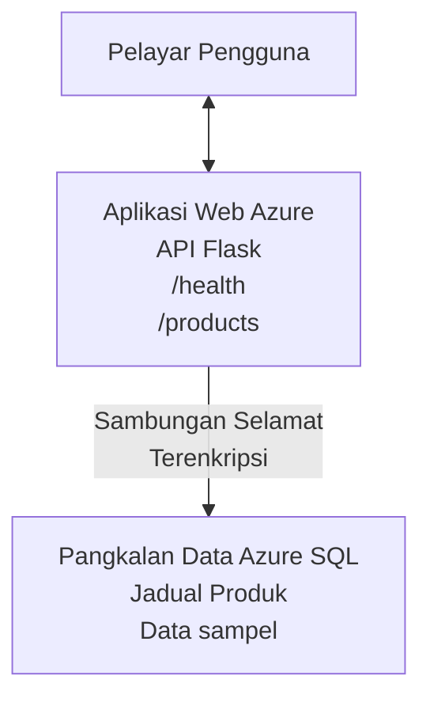

# Menerapkan Pangkalan Data Microsoft SQL dan Aplikasi Web dengan AZD

⏱️ **Anggaran Masa**: 20-30 minit | 💰 **Anggaran Kos**: ~$15-25/bulan | ⭐ **Kerumitan**: Pertengahan

**Contoh lengkap dan berfungsi ini** menunjukkan cara menggunakan [Azure Developer CLI (azd)](https://learn.microsoft.com/azure/developer/azure-developer-cli/) untuk menerapkan aplikasi web Python Flask dengan Pangkalan Data Microsoft SQL ke Azure. Semua kod disertakan dan diuji—tiada kebergantungan luaran diperlukan.

## Apa yang Akan Anda Pelajari

Dengan menyelesaikan contoh ini, anda akan:
- Menerapkan aplikasi berbilang lapisan (aplikasi web + pangkalan data) menggunakan infrastruktur sebagai kod
- Mengkonfigurasi sambungan pangkalan data yang selamat tanpa menyimpan rahsia secara keras
- Memantau kesihatan aplikasi dengan Application Insights
- Mengurus sumber Azure dengan cekap menggunakan AZD CLI
- Mengikuti amalan terbaik Azure untuk keselamatan, pengoptimuman kos, dan pemerhatian

## Gambaran Keseluruhan Senario
- **Aplikasi Web**: Python Flask REST API dengan sambungan pangkalan data
- **Pangkalan Data**: Azure SQL Database dengan data contoh
- **Infrastruktur**: Disediakan menggunakan Bicep (templat modular, boleh guna semula)
- **Penerapan**: Terautomasi sepenuhnya dengan arahan `azd`
- **Pemantauan**: Application Insights untuk log dan telemetri

## Prasyarat

### Alat Diperlukan

Sebelum bermula, sahkan anda mempunyai alat-alat ini dipasang:

1. **[Azure CLI](https://learn.microsoft.com/cli/azure/install-azure-cli)** (versi 2.50.0 atau lebih tinggi)
   ```sh
   az --version
   # Output yang dijangka: azure-cli 2.50.0 atau lebih tinggi
   ```

2. **[Azure Developer CLI (azd)](https://learn.microsoft.com/azure/developer/azure-developer-cli/install-azd)** (versi 1.0.0 atau lebih tinggi)
   ```sh
   azd version
   # Output yang dijangka: versi azd 1.0.0 atau lebih tinggi
   ```

3. **[Python 3.8+](https://www.python.org/downloads/)** (untuk pembangunan tempatan)
   ```sh
   python --version
   # Output yang dijangkakan: Python 3.8 atau lebih tinggi
   ```

4. **[Docker](https://www.docker.com/get-started)** (pilihan, untuk pembangunan berkontena tempatan)
   ```sh
   docker --version
   # Jangkaan output: Versi Docker 20.10 atau lebih tinggi
   ```

### Keperluan Azure

- Langganan **Azure aktif** ([buat akaun percuma](https://azure.microsoft.com/free/))
- Kebenaran untuk mencipta sumber dalam langganan anda
- Peranan **Pemilik** atau **Penyumbang** pada langganan atau kumpulan sumber

### Prasyarat Pengetahuan

Ini adalah contoh **peringkat pertengahan**. Anda harus biasa dengan:
- Operasi asas baris arahan
- Konsep awan asas (sumber, kumpulan sumber)
- Pemahaman asas tentang aplikasi web dan pangkalan data

**Baru dalam AZD?** Mula dengan panduan [Memulakan](../../docs/chapter-01-foundation/azd-basics.md) terlebih dahulu.

## Seni Bina

Contoh ini menerapkan seni bina dua lapisan dengan aplikasi web dan pangkalan data SQL:


**Penerapan Sumber:**
- **Kumpulan Sumber**: Penampung untuk semua sumber
- **Pelan Perkhidmatan Aplikasi**: Hosting berasaskan Linux (peringkat B1 untuk kecekapan kos)
- **Aplikasi Web**: Runtime Python 3.11 dengan aplikasi Flask
- **Pelayan SQL**: Pelayan pangkalan data terurus dengan TLS 1.2 minimum
- **Pangkalan Data SQL**: Peringkat asas (2GB, sesuai untuk pembangunan/ujian)
- **Application Insights**: Pemantauan dan log
- **Workspace Log Analytics**: Penyimpanan log berpusat

**Analogi**: Fikirkan ini seperti sebuah restoran (aplikasi web) dengan peti sejuk berjalan (pangkalan data). Pelanggan memesan dari menu (titik akhir API), dan dapur (aplikasi Flask) mengambil bahan (data) dari peti sejuk. Pengurus restoran (Application Insights) memantau semua yang berlaku.

## Struktur Folder

Semua fail disertakan dalam contoh ini—tiada kebergantungan luaran diperlukan:

```
examples/database-app/
│
├── README.md                    # This file
├── azure.yaml                   # AZD configuration file
├── .env.sample                  # Sample environment variables
├── .gitignore                   # Git ignore patterns
│
├── infra/                       # Infrastructure as Code (Bicep)
│   ├── main.bicep              # Main orchestration template
│   ├── abbreviations.json      # Azure naming conventions
│   └── resources/              # Modular resource templates
│       ├── sql-server.bicep    # SQL Server configuration
│       ├── sql-database.bicep  # Database configuration
│       ├── app-service-plan.bicep  # Hosting plan
│       ├── app-insights.bicep  # Monitoring setup
│       └── web-app.bicep       # Web application
│
└── src/
    └── web/                    # Application source code
        ├── app.py              # Flask REST API
        ├── requirements.txt    # Python dependencies
        └── Dockerfile          # Container definition
```

**Fungsi Setiap Fail:**
- **azure.yaml**: Memberitahu AZD apa yang akan diterapkan dan di mana
- **infra/main.bicep**: Mengatur semua sumber Azure
- **infra/resources/*.bicep**: Definisi sumber individu (modular untuk guna semula)
- **src/web/app.py**: Aplikasi Flask dengan logik pangkalan data
- **requirements.txt**: Kebergantungan pakej Python
- **Dockerfile**: Arahan pengkontena bagi penerapan

## Bermula Pantas (Langkah demi Langkah)

### Langkah 1: Klon dan Navigasi

```sh
git clone https://github.com/microsoft/AZD-for-beginners.git
cd AZD-for-beginners/examples/database-app
```

**✓ Semak Kejayaan**: Sahkan anda melihat `azure.yaml` dan folder `infra/`:
```sh
ls
# Dijangka: README.md, azure.yaml, infra/, src/
```

### Langkah 2: Pengesahan dengan Azure

```sh
azd auth login
```

Ini membuka pelayar anda untuk pengesahan Azure. Log masuk dengan kelayakan Azure anda.

**✓ Semak Kejayaan**: Anda harus melihat:
```
Logged in to Azure.
```

### Langkah 3: Inisialisasi Persekitaran

```sh
azd init
```

**Apa yang berlaku**: AZD mencipta konfigurasi tempatan untuk penerapan anda.

**Arahan yang anda akan lihat**:
- **Nama persekitaran**: Masukkan nama pendek (contoh: `dev`, `myapp`)
- **Langganan Azure**: Pilih langganan anda dari senarai
- **Lokasi Azure**: Pilih rantau (contoh: `eastus`, `westeurope`)

**✓ Semak Kejayaan**: Anda harus melihat:
```
SUCCESS: New project initialized!
```

### Langkah 4: Sediakan Sumber Azure

```sh
azd provision
```

**Apa yang berlaku**: AZD menerapkan semua infrastruktur (ambil masa 5-8 minit):
1. Mencipta kumpulan sumber
2. Mencipta Pelayan SQL dan Pangkalan Data
3. Mencipta Pelan Perkhidmatan Aplikasi
4. Mencipta Aplikasi Web
5. Mencipta Application Insights
6. Mengkonfigurasi rangkaian dan keselamatan

**Anda akan diminta untuk**:
- **Nama pengguna admin SQL**: Masukkan nama pengguna (contoh: `sqladmin`)
- **Kata laluan admin SQL**: Masukkan kata laluan yang kuat (simpan ini!)

**✓ Semak Kejayaan**: Anda harus melihat:
```
SUCCESS: Your application was provisioned in Azure in X minutes Y seconds.
You can view the resources created under the resource group rg-<env-name> in Azure Portal:
https://portal.azure.com/#@/resource/subscriptions/.../resourceGroups/rg-<env-name>
```

**⏱️ Masa**: 5-8 minit

### Langkah 5: Terapkan Aplikasi

```sh
azd deploy
```

**Apa yang berlaku**: AZD membina dan menerapkan aplikasi Flask anda:
1. Membungkus aplikasi Python
2. Membina kontena Docker
3. Mendorong ke Azure Web App
4. Memulakan pangkalan data dengan data contoh
5. Memulakan aplikasi

**✓ Semak Kejayaan**: Anda harus melihat:
```
SUCCESS: Your application was deployed to Azure in X minutes Y seconds.
You can view the resources created under the resource group rg-<env-name> in Azure Portal:
https://portal.azure.com/#@/resource/subscriptions/.../resourceGroups/rg-<env-name>
```

**⏱️ Masa**: 3-5 minit

### Langkah 6: Layari Aplikasi

```sh
azd browse
```

Ini membuka aplikasi web yang anda terapkan di pelayar pada `https://app-<unique-id>.azurewebsites.net`

**✓ Semak Kejayaan**: Anda harus melihat output JSON:
```json
{
  "message": "Welcome to the Database App API",
  "endpoints": {
    "/": "This help message",
    "/health": "Health check endpoint",
    "/products": "List all products",
    "/products/<id>": "Get product by ID"
  }
}
```

### Langkah 7: Uji Titik Akhir API

**Pemeriksaan Kesihatan** (sahkan sambungan pangkalan data):
```sh
curl https://app-<your-id>.azurewebsites.net/health
```

**Respon Dijangkakan**:
```json
{
  "status": "healthy",
  "database": "connected"
}
```

**Senaraikan Produk** (data contoh):
```sh
curl https://app-<your-id>.azurewebsites.net/products
```

**Respon Dijangkakan**:
```json
[
  {
    "id": 1,
    "name": "Laptop",
    "description": "High-performance laptop",
    "price": 1299.99,
    "created_at": "2025-11-19T10:30:00"
  },
  ...
]
```

**Dapatkan Produk Tunggal**:
```sh
curl https://app-<your-id>.azurewebsites.net/products/1
```

**✓ Semak Kejayaan**: Semua titik akhir mengembalikan data JSON tanpa ralat.

---

**🎉 Tahniah!** Anda telah berjaya menerapkan aplikasi web dengan pangkalan data ke Azure menggunakan AZD.

## Penerangan Konfigurasi

### Pemboleh Ubah Persekitaran

Rahsia diuruskan dengan selamat melalui konfigurasi Azure App Service—**tidak pernah disimpan keras dalam kod sumber**.

**Dikonfigurasi Secara Automatik oleh AZD**:
- `SQL_CONNECTION_STRING`: Sambungan pangkalan data dengan kelayakan disulitkan
- `APPLICATIONINSIGHTS_CONNECTION_STRING`: Titik telemetri pemantauan
- `SCM_DO_BUILD_DURING_DEPLOYMENT`: Menghidupkan pemasangan kebergantungan automatik

**Di Mana Rahsia Disimpan**:
1. Semasa `azd provision`, anda menyediakan kelayakan SQL melalui arahan selamat
2. AZD menyimpannya dalam fail `.azure/<env-name>/.env` tempatan anda (diabaikan Git)
3. AZD menyuntiknya ke dalam konfigurasi Azure App Service (disulitkan ketika disimpan)
4. Aplikasi membacanya melalui `os.getenv()` semasa runtime

### Pembangunan Tempatan

Untuk ujian tempatan, buat fail `.env` daripada sampel:

```sh
cp .env.sample .env
# Edit .env dengan sambungan pangkalan data tempatan anda
```

**Aliran Kerja Pembangunan Tempatan**:
```sh
# Pasang pergantungan
cd src/web
pip install -r requirements.txt

# Tetapkan pembolehubah persekitaran
export SQL_CONNECTION_STRING="your-local-connection-string"

# Jalankan aplikasi
python app.py
```

**Uji secara tempatan**:
```sh
curl http://localhost:8000/health
# Dijangka: {"status": "sihat", "database": "bersambung"}
```

### Infrastruktur sebagai Kod

Semua sumber Azure didefinisikan dalam **templat Bicep** (`infra/` folder):

- **Reka Bentuk Modular**: Setiap jenis sumber ada fail sendiri untuk guna semula
- **Berparameter**: Sesuaikan SKU, lokasi, konvensi penamaan
- **Amalan Terbaik**: Mengikuti piawaian penamaan dan keselamatan Azure
- **Kawalan Versi**: Perubahan infrastruktur ditjejak dalam Git

**Contoh Penyesuaian**:
Untuk menukar peringkat pangkalan data, edit `infra/resources/sql-database.bicep`:
```bicep
sku: {
  name: 'Standard'  // Changed from 'Basic'
  tier: 'Standard'
  capacity: 10
}
```

## Amalan Terbaik Keselamatan

Contoh ini mengikuti amalan terbaik keselamatan Azure:

### 1. **Tiada Rahsia dalam Kod Sumber**
- ✅ Kelayakan disimpan dalam konfigurasi Azure App Service (disulitkan)
- ✅ Fail `.env` dikecualikan dari Git melalui `.gitignore`
- ✅ Rahsia dihantar melalui parameter selamat semasa penyediaan

### 2. **Sambungan Disulitkan**
- ✅ TLS 1.2 minimum untuk Pelayan SQL
- ✅ HTTPS sahaja dipaksa untuk Aplikasi Web
- ✅ Sambungan pangkalan data menggunakan saluran disulitkan

### 3. **Keselamatan Rangkaian**
- ✅ Firewall pelayan SQL dikonfigurasi untuk membenarkan perkhidmatan Azure sahaja
- ✅ Akses rangkaian awam dihadkan (boleh diketatkan lagi dengan Private Endpoints)
- ✅ FTPS dimatikan pada Aplikasi Web

### 4. **Pengesahan & Kebenaran**
- ⚠️ **Semasa**: Pengesahan SQL (nama pengguna/kata laluan)
- ✅ **Cadangan Produksi**: Gunakan Identiti Terurus Azure untuk pengesahan tanpa kata laluan

**Untuk Meningkatkan ke Identiti Terurus** (untuk produksi):
1. Aktifkan identiti terurus pada Aplikasi Web
2. Beri kebenaran identiti ke SQL
3. Kemas kini rentetan sambungan untuk guna identiti terurus
4. Buang pengesahan berasaskan kata laluan

### 5. **Audit & Pematuhan**
- ✅ Application Insights merekodkan semua permintaan dan ralat
- ✅ Audit Pangkalan Data SQL diaktifkan (boleh dikonfigurasi untuk pematuhan)
- ✅ Semua sumber ditag untuk tadbir urus

**Senarai Semak Keselamatan Sebelum Produksi**:
- [ ] Aktifkan Azure Defender untuk SQL
- [ ] Konfigurasi Private Endpoints untuk Pangkalan Data SQL
- [ ] Aktifkan Web Application Firewall (WAF)
- [ ] Laksanakan Azure Key Vault untuk pertukaran rahsia
- [ ] Konfigurasi pengesahan Azure AD
- [ ] Aktifkan log diagnostik untuk semua sumber

## Pengoptimuman Kos

**Anggaran Kos Bulanan** (setakat November 2025):

| Sumber | SKU/Peringkat | Anggaran Kos |
|----------|----------|----------------|
| Pelan Perkhidmatan Aplikasi | B1 (Asas) | ~$13/bulan |
| Pangkalan Data SQL | Asas (2GB) | ~$5/bulan |
| Application Insights | Bayar ikut guna | ~$2/bulan (trafik rendah) |
| **Jumlah** | | **~$20/bulan** |

**💡 Petua Penjimatan Kos**:

1. **Gunakan Peringkat Percuma untuk Pembelajaran**:
   - App Service: peringkat F1 (percuma, jam terhad)
   - Pangkalan Data SQL: Gunakan serverless Azure SQL Database
   - Application Insights: 5GB/bulan pengambilan percuma

2. **Hentikan Sumber Apabila Tidak Digunakan**:
   ```sh
   # Hentikan aplikasi web (pangkalan data masih mengenakan bayaran)
   az webapp stop --name <app-name> --resource-group <rg-name>
   
   # Mulakan semula apabila diperlukan
   az webapp start --name <app-name> --resource-group <rg-name>
   ```

3. **Padamkan Semua Selepas Ujian**:
   ```sh
   azd down
   ```
   Ini membuang SEMUA sumber dan memberhentikan caj.

4. **SKU Pembangunan vs Produksi**:
   - **Pembangunan**: peringkat asas (digunakan dalam contoh ini)
   - **Produksi**: peringkat Standard/Premium dengan redundansi

**Pemantauan Kos**:
- Lihat kos di [Pengurusan Kos Azure](https://portal.azure.com/#view/Microsoft_Azure_CostManagement)
- Tetapkan amaran kos untuk mengelakkan kejutan
- Tag semua sumber dengan `azd-env-name` untuk penjejakan

**Alternatif Peringkat Percuma**:
Untuk tujuan pembelajaran, anda boleh ubah `infra/resources/app-service-plan.bicep`:
```bicep
sku: {
  name: 'F1'  // Free tier
  tier: 'Free'
}
```
**Nota**: Peringkat percuma mempunyai had (60 minit/CPU sehari, tiada selalu aktif).

## Pemantauan & Pemerhatian

### Integrasi Application Insights

Contoh ini termasuk **Application Insights** untuk pemantauan menyeluruh:

**Apa yang Dipantau**:
- ✅ Permintaan HTTP (kelajuan, kod status, titik akhir)
- ✅ Ralat aplikasi dan pengecualian
- ✅ Log tersuai dari aplikasi Flask
- ✅ Kesihatan sambungan pangkalan data
- ✅ Metik prestasi (CPU, memori)

**Akses Application Insights**:
1. Buka [Azure Portal](https://portal.azure.com)
2. Navigasi ke kumpulan sumber anda (`rg-<env-name>`)
3. Klik pada sumber Application Insights (`appi-<unique-id>`)

**Pertanyaan Berguna** (Application Insights → Log):

**Lihat Semua Permintaan**:
```kusto
requests
| where timestamp > ago(1h)
| order by timestamp desc
| project timestamp, name, url, resultCode, duration
```

**Cari Ralat**:
```kusto
exceptions
| where timestamp > ago(24h)
| order by timestamp desc
| project timestamp, type, outerMessage, operation_Name
```

**Semak Titik Akhir Kesihatan**:
```kusto
requests
| where name contains "health"
| summarize count() by resultCode, bin(timestamp, 1h)
```

### Audit Pangkalan Data SQL

**Audit Pangkalan Data SQL diaktifkan** untuk mengesan:
- Corak akses pangkalan data
- Percubaan login gagal
- Perubahan skema
- Akses data (untuk pematuhan)

**Akses Log Audit**:
1. Azure Portal → Pangkalan Data SQL → Audit
2. Lihat log dalam workspace Log Analytics

### Pemantauan Masa Nyata

**Lihat Metik Langsung**:
1. Application Insights → Live Metrics
2. Lihat permintaan, kegagalan, dan prestasi masa nyata

**Tetapkan Amaran**:
Buat amaran untuk kejadian kritikal:
- Ralat HTTP 500 > 5 dalam 5 minit
- Kegagalan sambungan pangkalan data
- Masa respons tinggi (>2 saat)

**Contoh Penciptaan Amaran**:
```sh
az monitor metrics alert create \
  --name "High-Response-Time" \
  --resource-group <rg-name> \
  --scopes <app-insights-resource-id> \
  --condition "avg requests/duration > 2000" \
  --description "Alert when response time exceeds 2 seconds"
```

## Penyelesaian Masalah
### Isu dan Penyelesaian Lazim

#### 1. `azd provision` gagal dengan "Lokasi tidak tersedia"

**Gejala**:  
```
Error: The subscription is not registered for the resource type 'components' in the location 'centralus'.
```
  
**Penyelesaian**:  
Pilih wilayah Azure yang berbeza atau daftar penyedia sumber:  
```sh
az provider register --namespace Microsoft.Insights
```
  
#### 2. Sambungan SQL Gagal Semasa Penyebaran

**Gejala**:  
```
pyodbc.OperationalError: ('08001', '[08001] [Microsoft][ODBC Driver 18 for SQL Server]TCP Provider...')
```
  
**Penyelesaian**:  
- Sahkan firewall SQL Server membenarkan perkhidmatan Azure (diatur secara automatik)  
- Semak kata laluan admin SQL dimasukkan dengan betul semasa `azd provision`  
- Pastikan SQL Server sudah sepenuhnya disediakan (boleh mengambil masa 2-3 minit)  

**Sahkan Sambungan**:  
```sh
# Dari Portal Azure, pergi ke SQL Database → Penyunting pertanyaan
# Cuba untuk menyambung dengan kelayakan anda
```
  
#### 3. Web App Memaparkan "Ralat Aplikasi"

**Gejala**:  
Pelayar menunjukkan halaman ralat yang umum.

**Penyelesaian**:  
Semak log aplikasi:  
```sh
# Lihat log terkini
az webapp log tail --name <app-name> --resource-group <rg-name>
```
  
**Punca umum**:  
- Pembolehubah persekitaran hilang (semak App Service → Konfigurasi)  
- Pemasangan pakej Python gagal (semak log penyebaran)  
- Ralat inisialisasi pangkalan data (semak kesambungan SQL)  

#### 4. `azd deploy` Gagal dengan "Ralat Kompilasi"

**Gejala**:  
```
Error: Failed to build project
```
  
**Penyelesaian**:  
- Pastikan `requirements.txt` tiada ralat sintaks  
- Semak Python 3.11 ditetapkan dalam `infra/resources/web-app.bicep`  
- Sahkan Dockerfile mempunyai imej asas yang betul  

**Debug secara tempatan**:  
```sh
cd src/web
docker build -t test-app .
docker run -p 8000:8000 test-app
```
  
#### 5. "Tidak Sah" Semasa Menjalankan Arahan AZD

**Gejala**:  
```
ERROR: (Unauthorized) The client '<id>' with object id '<id>' does not have authorization
```
  
**Penyelesaian**:  
Log masuk semula dengan Azure:  
```sh
azd auth login
az login
```
  
Sahkan anda mempunyai kebenaran yang betul (peranan Contributor) pada langganan.

#### 6. Kos Pangkalan Data Tinggi

**Gejala**:  
Bil Azure yang tidak dijangka.

**Penyelesaian**:  
- Semak jika anda terlupa jalankan `azd down` selepas ujian  
- Sahkan SQL Database menggunakan tier Basic (bukan Premium)  
- Semak kos dalam Pengurusan Kos Azure  
- Tetapkan amaran kos  

### Mendapatkan Bantuan

**Lihat Semua Pembolehubah Persekitaran AZD**:  
```sh
azd env get-values
```
  
**Semak Status Penyebaran**:  
```sh
az webapp show --name <app-name> --resource-group <rg-name> --query state
```
  
**Akses Log Aplikasi**:  
```sh
az webapp log download --name <app-name> --resource-group <rg-name> --log-file app-logs.zip
```
  
**Perlukan Bantuan Tambahan?**  
- [Panduan Penyelesaian Masalah AZD](../../docs/chapter-07-troubleshooting/common-issues.md)  
- [Penyelesaian Masalah Azure App Service](https://learn.microsoft.com/azure/app-service/troubleshoot-diagnostic-logs)  
- [Penyelesaian Masalah Azure SQL](https://learn.microsoft.com/azure/azure-sql/database/troubleshoot-common-errors-issues)  

## Latihan Praktikal

### Latihan 1: Sahkan Penyebaran Anda (Pemula)

**Matlamat**: Sahkan semua sumber telah disebarkan dan aplikasi berfungsi.

**Langkah**:  
1. Senaraikan semua sumber dalam kumpulan sumber anda:  
   ```sh
   az resource list --resource-group rg-<env-name> --output table
   ```
   **Jangkaan**: 6-7 sumber (Web App, SQL Server, SQL Database, Pelan Perkhidmatan App, Application Insights, Log Analytics)  

2. Uji semua titik akhir API:  
   ```sh
   curl https://app-<your-id>.azurewebsites.net/
   curl https://app-<your-id>.azurewebsites.net/health
   curl https://app-<your-id>.azurewebsites.net/products
   curl https://app-<your-id>.azurewebsites.net/products/1
   ```
   **Jangkaan**: Semua mengembalikan JSON sah tanpa ralat  

3. Semak Application Insights:  
   - Navigasi ke Application Insights dalam Azure Portal  
   - Pergi ke "Metrik Langsung"  
   - Muat semula pelayar anda pada web app  
   **Jangkaan**: Lihat permintaan muncul secara waktu nyata  

**Kriteria Kejayaan**: Semua 6-7 sumber wujud, semua titik akhir mengembalikan data, Metrik Langsung menunjukkan aktiviti.  

---

### Latihan 2: Tambah Titik Akhir API Baru (Perantaraan)

**Matlamat**: Kembangkan aplikasi Flask dengan titik akhir baru.

**Kod Permulaan**: Titik akhir semasa dalam `src/web/app.py`

**Langkah**:  
1. Sunting `src/web/app.py` dan tambah titik akhir baru selepas fungsi `get_product()`:
   ```python
   @app.route('/products/search/<keyword>')
   def search_products(keyword):
       """Search products by name or description."""
       try:
           conn = get_db_connection()
           cursor = conn.cursor()
           cursor.execute(
               "SELECT id, name, description, price, created_at FROM products WHERE name LIKE ? OR description LIKE ?",
               (f'%{keyword}%', f'%{keyword}%')
           )
           
           products = []
           for row in cursor.fetchall():
               products.append({
                   'id': row[0],
                   'name': row[1],
                   'description': row[2],
                   'price': float(row[3]) if row[3] else None,
                   'created_at': row[4].isoformat() if row[4] else None
               })
           
           cursor.close()
           conn.close()
           
           logger.info(f"Search for '{keyword}' returned {len(products)} results")
           return jsonify(products), 200
           
       except Exception as e:
           logger.error(f"Error searching products: {str(e)}")
           return jsonify({'error': str(e)}), 500
   ```
  
2. Sebarkan aplikasi yang dikemas kini:  
   ```sh
   azd deploy
   ```
  
3. Uji titik akhir baru:  
   ```sh
   curl https://app-<your-id>.azurewebsites.net/products/search/laptop
   ```
   **Jangkaan**: Mengembalikan produk yang sepadan dengan "laptop"  

**Kriteria Kejayaan**: Titik akhir baru berfungsi, mengembalikan hasil yang ditapis, muncul dalam log Application Insights.  

---

### Latihan 3: Tambah Pemantauan dan Amaran (Lanjutan)

**Matlamat**: Sediakan pemantauan proaktif dengan amaran.

**Langkah**:  
1. Buat amaran untuk ralat HTTP 500:  
   ```sh
   # Dapatkan ID sumber Application Insights
   AI_ID=$(az monitor app-insights component show \
     --app appi-<your-id> \
     --resource-group rg-<env-name> \
     --query id -o tsv)
   
   # Cipta amaran
   az monitor metrics alert create \
     --name "High-Error-Rate" \
     --resource-group rg-<env-name> \
     --scopes $AI_ID \
     --condition "count requests/failed > 5" \
     --window-size 5m \
     --evaluation-frequency 1m \
     --description "Alert when >5 failed requests in 5 minutes"
   ```
  
2. Picu amaran dengan menyebabkan ralat:  
   ```sh
   # Meminta produk yang tidak wujud
   for i in {1..10}; do curl https://app-<your-id>.azurewebsites.net/products/999; done
   ```
  
3. Semak jika amaran dipicu:  
   - Azure Portal → Amaran → Peraturan Amaran  
   - Semak emel anda (jika disediakan)  

**Kriteria Kejayaan**: Peraturan amaran dibuat, tercetus pada ralat, notifikasi diterima.  

---

### Latihan 4: Perubahan Skema Pangkalan Data (Lanjutan)

**Matlamat**: Tambah jadual baru dan kemas kini aplikasi untuk menggunakannya.

**Langkah**:  
1. Sambung ke SQL Database melalui Azure Portal Query Editor

2. Cipta jadual `categories` baru:  
   ```sql
   CREATE TABLE categories (
       id INT PRIMARY KEY IDENTITY(1,1),
       name NVARCHAR(50) NOT NULL,
       description NVARCHAR(200)
   );
   
   INSERT INTO categories (name, description) VALUES
   ('Electronics', 'Electronic devices and accessories'),
   ('Office Supplies', 'Office equipment and supplies');
   
   -- Add category to products table
   ALTER TABLE products ADD category_id INT;
   UPDATE products SET category_id = 1; -- Set all to Electronics
   ```
  
3. Kemas kini `src/web/app.py` untuk termasuk maklumat kategori dalam respons  

4. Sebarkan dan uji  

**Kriteria Kejayaan**: Jadual baru wujud, produk memaparkan maklumat kategori, aplikasi masih berfungsi.  

---

### Latihan 5: Laksanakan Caching (Pakar)

**Matlamat**: Tambah Azure Redis Cache untuk meningkatkan prestasi.

**Langkah**:  
1. Tambah Redis Cache ke `infra/main.bicep`  
2. Kemas kini `src/web/app.py` untuk menyimpan cache bagi pertanyaan produk  
3. Ukur peningkatan prestasi dengan Application Insights  
4. Bandingkan masa respon sebelum/selepas caching  

**Kriteria Kejayaan**: Redis disebarkan, caching berfungsi, masa respon bertambah baik >50%.

**Petua**: Mula dengan [dokumentasi Azure Cache for Redis](https://learn.microsoft.com/azure/azure-cache-for-redis/).  

---

## Pembersihan

Untuk mengelakkan caj berterusan, padam semua sumber selepas selesai:

```sh
azd down
```
  
**Prompt pengesahan**:  
```
? Total resources to delete: 7, are you sure you want to continue? (y/N)
```
  
Taip `y` untuk sahkan.

**✓ Semakan Kejayaan**:  
- Semua sumber dipadam dari Azure Portal  
- Tiada caj berterusan  
- Folder `.azure/<env-name>` tempatan boleh dihapuskan  

**Alternatif** (simpan infrastruktur, padam data):  
```sh
# Padam hanya kumpulan sumber (simpan konfigurasi AZD)
az group delete --name rg-<env-name> --yes
```
## Ketahui Lebih Lanjut

### Dokumentasi Berkaitan
- [Dokumentasi Azure Developer CLI](https://learn.microsoft.com/azure/developer/azure-developer-cli/)  
- [Dokumentasi Azure SQL Database](https://learn.microsoft.com/azure/azure-sql/database/)  
- [Dokumentasi Azure App Service](https://learn.microsoft.com/azure/app-service/)  
- [Dokumentasi Application Insights](https://learn.microsoft.com/azure/azure-monitor/app/app-insights-overview)  
- [Rujukan Bahasa Bicep](https://learn.microsoft.com/azure/azure-resource-manager/bicep/)  

### Langkah Seterusnya Dalam Kursus Ini
- **[Contoh Aplikasi Kontena](../../../../examples/container-app)**: Sebarkan mikroservis dengan Azure Container Apps  
- **[Panduan Integrasi AI](../../../../docs/ai-foundry)**: Tambah keupayaan AI ke aplikasi anda  
- **[Amalan Terbaik Penyebaran](../../docs/chapter-04-infrastructure/deployment-guide.md)**: Corak penyebaran produksi  

### Topik Lanjutan
- **Identiti Terkawal**: Alih keluar kata laluan dan gunakan pengesahan Azure AD  
- **Endpoint Peribadi**: Lindungi sambungan pangkalan data dalam rangkaian maya  
- **Integrasi CI/CD**: Automasi penyebaran dengan GitHub Actions atau Azure DevOps  
- **Multi-Persekitaran**: Tetapkan persekitaran dev, staging, dan produksi  
- **Migrasi Pangkalan Data**: Gunakan Alembic atau Entity Framework untuk versi skema  

### Perbandingan Dengan Pendekatan Lain

**AZD vs. ARM Templates**:  
- ✅ AZD: Abstraksi tahap tinggi, arahan lebih mudah  
- ⚠️ ARM: Lebih verbose, kawalan terperinci  

**AZD vs. Terraform**:  
- ✅ AZD: Asli Azure, terintegrasi dengan perkhidmatan Azure  
- ⚠️ Terraform: Sokongan multi-cloud, ekosistem lebih besar  

**AZD vs. Portal Azure**:  
- ✅ AZD: Boleh diulang, versi terkawal, boleh automasi  
- ⚠️ Portal: Klik manual, sukar untuk diulang  

**Fikirkan AZD sebagai**: Docker Compose untuk Azure—konfigurasi dipermudahkan untuk penyebaran kompleks.  

---

## Soalan Lazim

**S: Bolehkah saya guna bahasa pengaturcaraan lain?**  
J: Ya! Gantikan `src/web/` dengan Node.js, C#, Go, atau bahasa lain. Kemas kini `azure.yaml` dan Bicep mengikut keperluan.  

**S: Bagaimana untuk tambah lebih banyak pangkalan data?**  
J: Tambah modul SQL Database lain dalam `infra/main.bicep` atau gunakan PostgreSQL/MySQL dari perkhidmatan Azure Database.  

**S: Bolehkah saya guna ini untuk produksi?**  
J: Ini permulaan. Untuk produksi, tambah: identiti terkawal, endpoint peribadi, redundansi, strategi sandaran, WAF, dan pemantauan lanjutan.  

**S: Bagaimana jika saya mahu guna kontena dan bukan penyebaran kod?**  
J: Lihat [Contoh Aplikasi Kontena](../../../../examples/container-app) yang menggunakan kontena Docker sepenuhnya.  

**S: Bagaimana saya sambung ke pangkalan data dari mesin tempatan saya?**  
J: Tambah IP anda ke firewall SQL Server:  
```sh
az sql server firewall-rule create \
  --resource-group rg-<env-name> \
  --server sql-<unique-id> \
  --name AllowMyIP \
  --start-ip-address <your-ip> \
  --end-ip-address <your-ip>
```
  
**S: Bolehkah saya gunakan pangkalan data sedia ada dan bukannya mencipta baru?**  
J: Ya, sunting `infra/main.bicep` untuk rujuk SQL Server yang sedia ada dan kemas kini parameter rentetan sambungan.  

---

> **Nota:** Contoh ini menunjukkan amalan terbaik untuk menyebarkan aplikasi web dengan pangkalan data menggunakan AZD. Ia termasuk kod yang berfungsi, dokumentasi lengkap, dan latihan praktikal untuk mengukuhkan pembelajaran. Untuk penyebaran produksi, tinjau keselamatan, penskalaan, pematuhan, dan keperluan kos khusus organisasi anda.  

**📚 Navigasi Kursus:**  
- ← Sebelumnya: [Contoh Aplikasi Kontena](../../../../examples/container-app)  
- → Seterusnya: [Panduan Integrasi AI](../../../../docs/ai-foundry)  
- 🏠 [Laman Utama Kursus](../../README.md)

---

<!-- CO-OP TRANSLATOR DISCLAIMER START -->
**Penafian**:  
Dokumen ini telah diterjemahkan menggunakan perkhidmatan terjemahan AI [Co-op Translator](https://github.com/Azure/co-op-translator). Walaupun kami berusaha untuk ketepatan, sila maklum bahawa terjemahan automatik mungkin mengandungi kesilapan atau ketidaktepatan. Dokumen asal dalam bahasa asalnya harus dianggap sebagai sumber yang sahih. Untuk maklumat penting, disarankan terjemahan profesional oleh manusia. Kami tidak bertanggungjawab atas sebarang salah faham atau salah tafsir yang timbul daripada penggunaan terjemahan ini.
<!-- CO-OP TRANSLATOR DISCLAIMER END -->